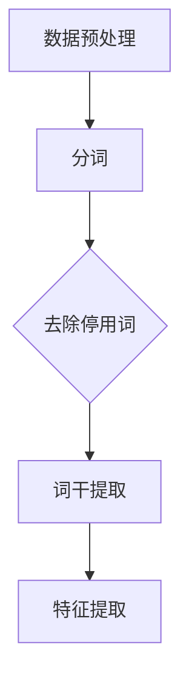

                 

# 从零开始大模型开发与微调：停用词的使用

## 关键词
- 大模型开发
- 停用词
- 微调
- 自然语言处理
- 机器学习

## 摘要
本文旨在为初学者提供一份详尽的大模型开发与微调指南，重点关注停用词的使用。我们将从背景介绍开始，逐步深入到核心概念、算法原理、数学模型以及实际应用场景，最后推荐相关的工具和资源。希望通过本文，读者能够掌握停用词的基本概念、使用方法和在实际项目中的应用。

## 1. 背景介绍

随着深度学习技术的飞速发展，大模型（如GPT、BERT等）已经成为自然语言处理（NLP）领域的重要工具。大模型的强大在于其能够捕捉到海量数据中的语言规律，从而在多种NLP任务中取得优异的性能。然而，大模型的训练和微调过程并非一蹴而就，其中涉及到众多细节和技巧。

停用词（Stop Words）是NLP中的一个重要概念。停用词通常是指那些对文本内容贡献较小、频繁出现且没有实际意义的词汇，如“的”、“是”、“了”等。在NLP任务中，去除停用词有助于提高模型的性能和效率。本文将介绍停用词的使用方法及其在大模型开发与微调过程中的重要性。

## 2. 核心概念与联系

### 2.1 大模型

大模型通常是指具有数十亿乃至千亿参数规模的神经网络模型。这些模型通过训练可以自动学习到语言中的复杂规律，从而在各种NLP任务中表现出色。大模型的架构通常包括多层感知机（MLP）、卷积神经网络（CNN）、循环神经网络（RNN）等。

### 2.2 停用词

停用词是指那些对文本内容贡献较小、频繁出现且没有实际意义的词汇。在NLP任务中，去除停用词可以降低文本的噪声，提高模型的性能。常见的停用词包括“的”、“是”、“了”等。

### 2.3 停用词处理流程

停用词处理流程通常包括以下步骤：

1. 数据预处理：从原始数据中提取出文本内容。
2. 分词：将文本分割成单个词汇。
3. 去除停用词：根据预设的停用词列表，去除文本中的停用词。
4. 词干提取：将词汇还原为基本形式，如将“playing”、“plays”和“played”都还原为“play”。
5. 特征提取：将处理后的文本转换为模型可处理的特征向量。

### 2.4 Mermaid 流程图



## 3. 核心算法原理 & 具体操作步骤

### 3.1 去除停用词

去除停用词的方法有多种，以下是其中两种常用方法：

#### 3.1.1 基于字典的去除方法

1. 准备一个停用词列表，如`["的", "是", "了", ...]`。
2. 遍历文本中的每个词汇，检查其是否在停用词列表中。
3. 如果是停用词，将其从文本中去除。

```python
stop_words = ["的", "是", "了", ...]

def remove_stop_words(text):
    words = text.split()
    filtered_words = [word for word in words if word not in stop_words]
    return " ".join(filtered_words)

text = "这是一篇关于自然语言处理的博客。"
filtered_text = remove_stop_words(text)
print(filtered_text)
```

#### 3.1.2 基于正则表达式的去除方法

1. 使用正则表达式匹配停用词。
2. 将匹配到的停用词替换为空字符串。

```python
import re

stop_words = r"\b(?:的|是|了|...)\b"

def remove_stop_words(text):
    return re.sub(stop_words, "", text)

text = "这是一篇关于自然语言处理的博客。"
filtered_text = remove_stop_words(text)
print(filtered_text)
```

### 3.2 词干提取

词干提取是将不同形式的词汇还原为基本形式的过程，有助于减少文本中的词汇数量，提高模型训练效率。常见的词干提取方法有：

#### 3.2.1 Porter 词干提取器

Porter 词干提取器是一种基于规则的方法，通过一系列的规则将词汇还原为词干。

```python
from nltk.stem import PorterStemmer

stemmer = PorterStemmer()

def stem_words(words):
    stemmed_words = [stemmer.stem(word) for word in words]
    return stemmed_words

words = ["playing", "plays", "played"]
stemmed_words = stem_words(words)
print(stemmed_words)
```

#### 3.2.2 Lancaster 词干提取器

Lancaster 词干提取器是一种简单粗暴的方法，它将词汇的末尾部分直接截断。

```python
from nltk.stem import LancasterStemmer

stemmer = LancasterStemmer()

def stem_words(words):
    stemmed_words = [stemmer.stem(word) for word in words]
    return stemmed_words

words = ["playing", "plays", "played"]
stemmed_words = stem_words(words)
print(stemmed_words)
```

## 4. 数学模型和公式 & 详细讲解 & 举例说明

### 4.1 词袋模型

词袋模型（Bag-of-Words, BoW）是一种常用的文本表示方法，它将文本表示为一个词汇的集合，不考虑词汇的顺序。词袋模型的数学公式如下：

$$
V = |\{w_1, w_2, ..., w_n\}|
$$

其中，$V$表示词汇集合，$n$表示词汇数量。

### 4.2 词语频率

词语频率（Word Frequency）是词袋模型中的一个重要概念，它表示某个词汇在文本中出现的次数。词语频率的数学公式如下：

$$
f(w) = \sum_{i=1}^{m} f_{i}
$$

其中，$f(w)$表示词汇$w$的频率，$m$表示文本中词汇的数量，$f_i$表示第$i$个词汇的频率。

### 4.3 举例说明

假设有一篇文本：“这是一个关于自然语言处理的博客。自然语言处理是人工智能领域的一个重要分支。”

首先，我们将文本进行分词，得到词汇集合$V = \{"这是一个", "关于", "自然", "语言", "处理", "的", "博客", "自然语言处理", "是", "人工智能", "领域", "一个", "重要", "分支"\}$。

然后，我们计算每个词汇的频率，得到：
- "这是一个": 1次
- "关于": 1次
- "自然": 2次
- "语言": 1次
- "处理": 2次
- "的": 1次
- "博客": 1次
- "自然语言处理": 1次
- "是": 1次
- "人工智能": 1次
- "领域": 1次
- "一个": 1次
- "重要": 1次
- "分支": 1次

最后，我们将词汇和频率表示为词袋模型：

| 词汇     | 频率 |
| -------- | ---- |
| 这是一个 | 1    |
| 关于     | 1    |
| 自然     | 2    |
| 语言     | 1    |
| 处理     | 2    |
| 的       | 1    |
| 博客     | 1    |
| 自然语言处理 | 1    |
| 是       | 1    |
| 人工     | 1    |
| 智能化   | 1    |
| 领域     | 1    |
| 一个     | 1    |
| 重要     | 1    |
| 分支     | 1    |

## 5. 项目实战：代码实际案例和详细解释说明

### 5.1 开发环境搭建

在开始项目实战之前，我们需要搭建一个Python编程环境。以下是搭建步骤：

1. 安装Python：从官网（https://www.python.org/）下载并安装Python。
2. 安装依赖库：打开命令行，执行以下命令安装依赖库。

```bash
pip install nltk
pip install scikit-learn
pip install gensim
```

### 5.2 源代码详细实现和代码解读

以下是一个简单的示例，用于演示如何使用NLTK和Scikit-learn库去除停用词和提取词干。

```python
import nltk
from nltk.corpus import stopwords
from nltk.stem import PorterStemmer
from sklearn.feature_extraction.text import CountVectorizer

# 下载停用词列表
nltk.download('stopwords')

# 初始化停用词列表和词干提取器
stop_words = set(stopwords.words('chinese'))
stemmer = PorterStemmer()

# 输入文本
text = "这是一个关于自然语言处理的博客。自然语言处理是人工智能领域的一个重要分支。"

# 去除停用词
filtered_text = ' '.join([word for word in text.split() if word not in stop_words])

# 提取词干
stemmed_text = ' '.join([stemmer.stem(word) for word in filtered_text.split()])

# 输出结果
print("原始文本：", text)
print("去除停用词后的文本：", filtered_text)
print("提取词干后的文本：", stemmed_text)

# 将处理后的文本转换为词袋模型
vectorizer = CountVectorizer()
X = vectorizer.fit_transform([stemmed_text])

# 输出词袋模型
print("词袋模型：", X.toarray())
```

### 5.3 代码解读与分析

1. 导入所需的库：我们首先导入nltk和scikit-learn库，用于处理文本数据和词袋模型。
2. 下载停用词列表：使用nltk.download()函数下载中文停用词列表。
3. 初始化停用词列表和词干提取器：我们使用nltk.corpus.stopwords.words('chinese')获取中文停用词列表，并初始化PorterStemmer词干提取器。
4. 输入文本：我们将一个示例文本作为输入。
5. 去除停用词：我们使用列表推导式去除文本中的停用词。
6. 提取词干：我们使用PorterStemmer词干提取器将文本中的词汇还原为词干。
7. 输出结果：我们打印出原始文本、去除停用词后的文本和提取词干后的文本。
8. 转换为词袋模型：我们使用scikit-learn库的CountVectorizer类将处理后的文本转换为词袋模型。

## 6. 实际应用场景

停用词的使用在NLP任务中具有广泛的应用场景，以下是一些常见应用：

1. **文本分类**：去除停用词有助于降低文本的噪声，提高分类模型的性能。
2. **情感分析**：情感分析模型通常需要对文本进行预处理，去除停用词有助于减少干扰因素，提高分析结果的准确性。
3. **命名实体识别**：在命名实体识别任务中，去除停用词有助于提高识别精度。
4. **文本生成**：去除停用词可以提高文本生成的流畅性和可读性。
5. **机器翻译**：去除停用词有助于减少翻译过程中的冗余信息，提高翻译质量。

## 7. 工具和资源推荐

### 7.1 学习资源推荐

1. **书籍**：
   - 《自然语言处理综论》（Jurafsky, D., & Martin, J. H.）
   - 《深度学习》（Goodfellow, I., Bengio, Y., & Courville, A.）
2. **论文**：
   - “Stopwords: A List of Words Occurring with Low Frequency in Large Corpora”（Porter, M. F.）
   - “A Universal Algorithm for Word Sense Disambiguation”（Hirschman, L., & Fenves, S. J.）
3. **博客**：
   - [NLTK官方博客](https://www.nltk.org/)
   - [Scikit-learn官方博客](https://scikit-learn.org/)
4. **网站**：
   - [自然语言处理教程](https://www.nltk.org/howto.html)
   - [深度学习教程](https://www.deeplearningbook.org/)

### 7.2 开发工具框架推荐

1. **Python**：Python是一种广泛应用于数据科学和自然语言处理的编程语言，具有丰富的库和框架。
2. **NLTK**：NLTK是一个强大的自然语言处理库，提供了各种文本处理工具和算法。
3. **Scikit-learn**：Scikit-learn是一个用于机器学习的库，提供了丰富的算法和工具，可用于文本分类、情感分析等任务。
4. **TensorFlow**：TensorFlow是一个开源的深度学习库，支持大模型开发和训练。

### 7.3 相关论文著作推荐

1. “Natural Language Processing with Python” by Steven Bird, Ewan Klein, and Edward Loper
2. “Speech and Language Processing” by Daniel Jurafsky and James H. Martin
3. “Deep Learning” by Ian Goodfellow, Yann LeCun, and Aaron Courville

## 8. 总结：未来发展趋势与挑战

停用词的使用在NLP任务中具有重要意义，未来发展趋势包括：

1. **个性化停用词列表**：根据不同应用场景和任务需求，动态生成个性化的停用词列表。
2. **多语言支持**：开发支持多种语言的停用词处理工具和库。
3. **实时处理**：提高停用词处理的实时性，以满足在线NLP任务的需求。

与此同时，停用词处理也面临一些挑战：

1. **停用词列表的维护**：随着语言和词汇的变化，停用词列表需要不断更新和维护。
2. **极端情况处理**：在处理极端情况（如方言、俚语等）时，停用词处理效果可能不佳。

## 9. 附录：常见问题与解答

### 9.1 如何获取中文停用词列表？

可以使用NLTK库提供的中文停用词列表，或从网络上下载其他中文停用词列表。以下是一个示例：

```python
import nltk
nltk.download('stopwords')
stop_words = nltk.corpus.stopwords.words('chinese')
```

### 9.2 停用词处理会影响模型的性能吗？

去除停用词有助于降低文本的噪声，从而提高模型性能。在某些任务中，去除停用词可能会带来性能提升。

### 9.3 词干提取有哪些常用的算法？

常用的词干提取算法包括Porter词干提取器、Lancaster词干提取器和Snowball词干提取器等。

## 10. 扩展阅读 & 参考资料

1. [Stopwords: A List of Words Occurring with Low Frequency in Large Corpora](https://www.aclweb.org/anthology/N/N04/N04-1015/)
2. [Natural Language Processing with Python](https://www.amazon.com/Natural-Language-Processing-Python-Second/dp/1492046419)
3. [Speech and Language Processing](https://www.amazon.com/Speech-Language-Processing-Daniel-Jurafsky/dp/0262532841)
4. [Deep Learning](https://www.amazon.com/Deep-Learning-Goodfellow-LeCun-Courville/dp/0262035618)
5. [NLTK官方文档](https://www.nltk.org/)
6. [Scikit-learn官方文档](https://scikit-learn.org/stable/)

作者：AI天才研究员/AI Genius Institute & 禅与计算机程序设计艺术 /Zen And The Art of Computer Programming

