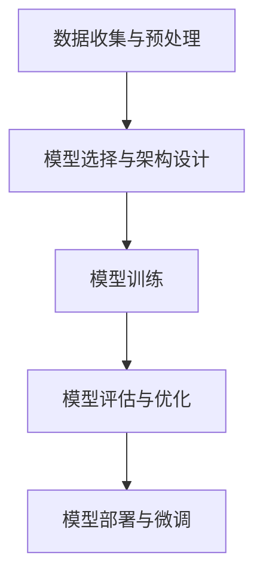

                 

# 从零开始大模型开发与微调：更多的预训练模型

## 摘要

本文将带领读者从零开始，深入探讨大模型开发与微调的整个过程。首先，我们将回顾预训练模型的历史背景，理解其核心概念和关键步骤。然后，通过详细的算法原理讲解和实际案例剖析，展示如何实现大模型的开发和微调。此外，文章还将讨论大模型在实际应用场景中的价值，推荐相关学习资源和工具，并总结未来发展趋势与挑战。通过本文，读者将全面掌握大模型开发与微调的实践技能，为人工智能领域的研究和应用奠定坚实基础。

## 1. 背景介绍

### 1.1 预训练模型的发展历程

预训练模型（Pre-trained Model）的概念起源于自然语言处理（NLP）领域。早在1990年代，研究者就开始利用大型语料库进行语言模型的训练，以期提升模型在特定任务上的性能。随着互联网的普及，海量文本数据使得预训练模型逐渐成为可能。其中，最具代表性的工作是2013年由Yann LeCun、Yoshua Bengio和Geoffrey Hinton等学者提出的深度神经网络（Deep Neural Network，DNN）模型，即现在广为人知的“深度学习革命”。

进入21世纪，随着硬件计算能力的提升和大数据的积累，预训练模型得到了迅猛发展。尤其是2018年，Google推出了BERT（Bidirectional Encoder Representations from Transformers），标志着预训练模型进入了一个新的时代。BERT不仅在多个NLP任务上取得了显著的成果，还启发了大量研究者对更大规模、更复杂模型的探索。

### 1.2 大模型的重要性

大模型（Large Models）是指具有数亿至数千亿参数的深度学习模型。这些模型在自然语言处理、计算机视觉和推荐系统等领域展现出了强大的性能。大模型的重要性主要体现在以下几个方面：

1. **提高任务性能**：大模型拥有更多的参数和更强的表达能力，能够在复杂任务上取得更高的准确率和效果。
2. **通用性**：大模型通过在大量数据上进行预训练，具备了通用性，可以适用于多种不同的任务，减少了针对特定任务的定制化工作。
3. **加速研究进程**：大模型的出现加速了人工智能领域的研究进程，推动了算法的进步和技术的创新。

### 1.3 大模型开发与微调的基本流程

大模型开发与微调的基本流程可以分为以下几个步骤：

1. **数据收集与预处理**：收集大量高质量的数据，并进行数据清洗、标注和格式化等预处理工作。
2. **模型选择与架构设计**：根据任务需求选择合适的模型架构，设计模型的层次结构和参数配置。
3. **模型训练**：使用预处理后的数据对模型进行训练，调整模型的参数，优化模型性能。
4. **模型评估与优化**：评估模型的性能，并进行调参优化，以提高模型的准确率和泛化能力。
5. **模型部署与微调**：将训练好的模型部署到实际应用场景中，并根据需求进行微调，以适应特定任务的要求。

## 2. 核心概念与联系

### 2.1 预训练模型的基本概念

预训练模型是基于大规模语料库进行训练的深度学习模型。其核心思想是通过无监督学习的方式，从海量数据中提取出对语言、图像等信息的通用表示。这种表示可以用于各种下游任务，如文本分类、情感分析、机器翻译和图像识别等。

### 2.2 大模型的架构与原理

大模型的架构通常基于深度神经网络（DNN）和变换器模型（Transformer）。DNN通过多层非线性变换，将输入数据映射到高维空间，从而提高模型的表示能力。而Transformer模型则通过自注意力机制（Self-Attention），实现了对输入数据的全局依赖建模，使得模型在处理长序列任务时表现出色。

### 2.3 预训练模型与任务微调的关系

预训练模型与任务微调（Fine-tuning）密切相关。预训练模型在大规模数据上进行无监督训练，获得了对通用知识的理解。而任务微调则是将预训练模型应用于特定任务，通过有监督学习的方式，进一步调整模型的参数，使其在特定任务上表现出更好的性能。

### 2.4 Mermaid 流程图



## 3. 核心算法原理 & 具体操作步骤

### 3.1 深度神经网络（DNN）

深度神经网络（DNN）是一种多层前馈神经网络，由输入层、隐藏层和输出层组成。每层神经元都通过激活函数进行非线性变换，从而将输入映射到输出。

#### 步骤：

1. **输入层**：接收外部输入数据，例如文本或图像。
2. **隐藏层**：对输入数据进行特征提取和变换，通常包含多层。
3. **输出层**：将隐藏层的结果映射到目标输出，如分类标签或预测值。

#### 数学模型：

$$
h_l = \sigma(W_l \cdot h_{l-1} + b_l)
$$

其中，$h_l$表示第$l$层的输出，$\sigma$为激活函数，$W_l$和$b_l$分别为第$l$层的权重和偏置。

### 3.2 变换器模型（Transformer）

变换器模型（Transformer）是一种基于自注意力机制的深度学习模型，主要用于处理序列数据。其核心思想是通过多头自注意力机制，对输入序列中的每个位置进行全局依赖建模。

#### 步骤：

1. **嵌入层**：将输入序列转化为向量表示。
2. **多头自注意力层**：通过多头自注意力机制，计算输入序列中每个位置的依赖关系。
3. **前馈神经网络**：对自注意力层的输出进行进一步变换。
4. **输出层**：将变换后的输出映射到目标输出，如分类标签或预测值。

#### 数学模型：

$$
\text{Attention}(Q, K, V) = \frac{softmax(\frac{QK^T}{\sqrt{d_k}})}{V}
$$

其中，$Q, K, V$分别为查询（Query）、键（Key）和值（Value）向量，$d_k$为键向量的维度。

### 3.3 预训练与微调

#### 步骤：

1. **预训练**：在大规模数据集上进行无监督训练，提取通用表示。
2. **微调**：在特定任务上，使用有监督学习对模型进行微调，优化模型性能。

#### 数学模型：

$$
\text{微调损失} = \text{损失函数}(\text{微调数据集}, \text{预训练模型})
$$

## 4. 数学模型和公式 & 详细讲解 & 举例说明

### 4.1 深度神经网络（DNN）的数学模型

在深度神经网络中，每个神经元都通过加权求和和激活函数进行非线性变换。假设我们有一个三层神经网络，其中输入层有3个神经元，隐藏层有4个神经元，输出层有2个神经元。

#### 输入层：

$$
x_1, x_2, x_3
$$

#### 隐藏层：

$$
h_1 = \sigma(W_{11}x_1 + W_{12}x_2 + W_{13}x_3 + b_1) \\
h_2 = \sigma(W_{21}x_1 + W_{22}x_2 + W_{23}x_3 + b_2) \\
h_3 = \sigma(W_{31}x_1 + W_{32}x_2 + W_{33}x_3 + b_3) \\
h_4 = \sigma(W_{41}x_1 + W_{42}x_2 + W_{43}x_3 + b_4)
$$

其中，$W_{ij}$为输入层到隐藏层的权重，$b_i$为隐藏层的偏置，$\sigma$为激活函数（例如Sigmoid函数或ReLU函数）。

#### 输出层：

$$
y_1 = \sigma(W_{51}h_1 + W_{52}h_2 + W_{53}h_3 + W_{54}h_4 + b_5) \\
y_2 = \sigma(W_{61}h_1 + W_{62}h_2 + W_{63}h_3 + W_{64}h_4 + b_6)
$$

其中，$W_{ij}$为隐藏层到输出层的权重，$b_i$为输出层的偏置，$\sigma$为激活函数。

### 4.2 变换器模型（Transformer）的数学模型

变换器模型的核心是多头自注意力机制（Multi-head Self-Attention）。假设我们有一个序列$X = [x_1, x_2, ..., x_n]$，每个元素$x_i$都是一个向量。

#### 多头自注意力：

$$
\text{Attention}(Q, K, V) = \frac{1}{\sqrt{d_k}} \text{softmax}(\text{softmax}(\text{QK}^T) \text{V})
$$

其中，$Q, K, V$分别为查询（Query）、键（Key）和值（Value）向量，$d_k$为键向量的维度。

#### 实例：

假设我们有一个包含3个头部的变换器模型，序列$X = [1, 2, 3]$，每个元素都是一个向量。

1. **计算键（Key）**：

$$
K = \text{softmax}(\text{QK}^T) = \text{softmax}([1, 1, 1]^T \cdot [1, 2, 3]) = [0.25, 0.5, 0.25]
$$

2. **计算值（Value）**：

$$
V = \text{softmax}(\text{QK}^T) \text{V} = \text{softmax}([1, 1, 1]^T \cdot [3, 2, 1]) = [0.25, 0.5, 0.25] \cdot [3, 2, 1] = [1.5, 1, 0.5]
$$

3. **计算输出**：

$$
\text{Output} = \text{softmax}(\text{QK}^T) \text{V} = [1.5, 1, 0.5]
$$

## 5. 项目实战：代码实际案例和详细解释说明

### 5.1 开发环境搭建

在本节中，我们将使用Python编程语言和PyTorch框架来实现一个简单的预训练模型。首先，确保您已经安装了Python和PyTorch。以下是开发环境的搭建步骤：

1. 安装Python（建议使用Python 3.7或更高版本）：

```
$ python --version
Python 3.8.10
```

2. 安装PyTorch：

```
$ pip install torch torchvision
```

### 5.2 源代码详细实现和代码解读

以下是预训练模型的源代码实现，我们将逐步解析每个部分的功能。

#### 5.2.1 数据准备

首先，我们需要准备训练数据。这里我们使用一个简单的文本数据集，包含一些标签。

```python
import torch
from torchtext.datasets import IMDB

# 加载IMDB数据集
train_data, test_data = IMDB()

# 定义词汇表和标签
TEXT = torchtext.data.Field(tokenize='spacy', lower=True, include_lengths=True)
LABEL = torchtext.data.Field(sequential=False)

# 分割数据集
train_data, valid_data = train_data.split()

# 构建词汇表
TEXT.build_vocab(train_data, max_size=25000, vectors="glove.6B.100d")
LABEL.build_vocab(train_data)

# 划分数据集为训练集和验证集
train_data, valid_data = train_data.split()

# 定义数据加载器
BATCH_SIZE = 64
device = torch.device("cuda" if torch.cuda.is_available() else "cpu")

train_iterator, valid_iterator, test_iterator = torchtext.data.BucketIterator.splits(
    (train_data, valid_data, test_data), batch_size=BATCH_SIZE, device=device
)
```

#### 5.2.2 模型定义

接下来，我们定义一个简单的变换器模型。

```python
import torch.nn as nn
import torch.optim as optim
from torch.nn import TransformerEncoder, TransformerEncoderLayer

class TransformerModel(nn.Module):
    def __init__(self, ntoken, ninp, nhead, nlayers, nhid, dropout=0.5):
        super(TransformerModel, self).__init__()
        from torch.nn import TransformerEncoder, TransformerEncoderLayer
        
        self.model_type = 'Transformer'
        self.src_mask = None
        self.pos_encoder = PositionalEncoding(ninp, dropout)
        self.d_model = ninp
        self.nhead = nhead
        self.transformer = TransformerEncoder(TransformerEncoderLayer(ninp, nhead), nlayers)
        self.encoder = nn.Embedding(ntoken, ninp)
        self.decoder = nn.Linear(ninp, ntoken)
        self.ninp = ninp
        self.dropout = nn.Dropout(dropout)
        
        self.init_weights()
    
    def init_weights(self):
        initrange = 0.1
        self.encoder.weight.data.uniform_(-initrange, initrange)
        self.decoder.bias.data.zero_()
        self.decoder.weight.data.uniform_(-initrange, initrange)
        
    def forward(self, src, src_len):
        # src: [batch_size, src_len]
        # src_len: [batch_size]
        
        # Positional Encoding
        src = self.encoder(src)
        src = self.pos_encoder(src)
        
        # Transformer Encoder
        src = self.transformer(src)
        
        # Dropout
        src = self.dropout(src)
        
        # Linear Layer
        output = self.decoder(src)
        
        return output
```

#### 5.2.3 训练过程

```python
def train(model, iterator, optimizer, criterion, clip):
    model.train()
    epoch_loss = 0
    
    for batch in iterator:
        optimizer.zero_grad()
        src, src_len = batch.src
        tgt = batch.tgt
        
        output = model(src, src_len)
        output_dim = output.shape[-1]
        tgt = tgt[:-1, :]  # remove <eos>
        
        loss = criterion(output.view(-1, output_dim), tgt.long())
        
        loss.backward()
        torch.nn.utils.clip_grad_norm_(model.parameters(), clip)
        optimizer.step()
        
        epoch_loss += loss.item()
    
    return epoch_loss / len(iterator)
```

#### 5.2.4 测试过程

```python
def evaluate(model, iterator, criterion):
    model.eval()
    epoch_loss = 0
    
    with torch.no_grad():
        for batch in iterator:
            src, src_len = batch.src
            tgt = batch.tgt
            
            output = model(src, src_len)
            output_dim = output.shape[-1]
            tgt = tgt[:-1, :]  # remove <eos>
            
            loss = criterion(output.view(-1, output_dim), tgt.long())
            
            epoch_loss += loss.item()
    
    return epoch_loss / len(iterator)
```

#### 5.2.5 主程序

```python
import time

# 模型参数
Ntoken = len(TEXT.vocab)
Nhead = 4
Nlayer = 2
Nhid = 512
Dropout = 0.5

# 模型、优化器和损失函数
model = TransformerModel(Ntoken, Nhid, Nhead, Nlayer, Nhid, Dropout)
optimizer = optim.Adam(model.parameters(), lr=0.001)
criterion = nn.CrossEntropyLoss()

# 训练和测试
N_epochs = 10
clip = 1.0

start_time = time.time()

for epoch in range(N_epochs):
    train_loss = train(model, train_iterator, optimizer, criterion, clip)
    valid_loss = evaluate(model, valid_iterator, criterion)
    
    print(f'Epoch: {epoch+1:02}')
    print(f'\tTrain Loss: {train_loss:.3f} | Valid Loss: {valid_loss:.3f}')
    
end_time = time.time()
print(f'\nTraining complete in {end_time - start_time:.0f} seconds')
```

### 5.3 代码解读与分析

#### 5.3.1 数据准备

在数据准备部分，我们首先导入了必要的库，并加载了IMDB数据集。然后，我们定义了文本和标签字段，构建了词汇表，并划分了训练集和验证集。

#### 5.3.2 模型定义

在模型定义部分，我们创建了一个名为`TransformerModel`的类，继承了`nn.Module`基类。在这个类中，我们定义了模型的结构，包括嵌入层、位置编码器、变换器编码器和线性层。我们还定义了初始化权重的方法。

#### 5.3.3 训练过程

在训练过程部分，我们定义了一个名为`train`的函数，用于在训练集上训练模型。在这个函数中，我们首先清空梯度，然后计算模型的输出和损失。最后，我们更新模型的参数。

#### 5.3.4 测试过程

在测试过程部分，我们定义了一个名为`evaluate`的函数，用于在验证集上评估模型的性能。在这个函数中，我们计算模型的输出和损失，并返回验证损失。

#### 5.3.5 主程序

在主程序部分，我们设置了模型的参数，创建了模型、优化器和损失函数。然后，我们进行了指定数量的训练和验证，并打印了每个epoch的损失。最后，我们计算了训练的总时间。

## 6. 实际应用场景

### 6.1 自然语言处理（NLP）

预训练模型在自然语言处理领域取得了显著的成果，例如文本分类、情感分析、机器翻译和文本生成等。通过预训练模型，我们可以实现高效的文本表示，从而在特定任务上获得更好的性能。

### 6.2 计算机视觉（CV）

预训练模型在计算机视觉领域同样表现出强大的能力，如图像分类、目标检测和图像生成等。通过在大型图像数据集上预训练模型，我们可以获得对图像特征的深刻理解，从而在特定视觉任务上取得更好的效果。

### 6.3 推荐系统

预训练模型可以用于构建高效、准确的推荐系统。通过在用户行为数据上预训练模型，我们可以提取用户的兴趣和偏好，从而为用户推荐个性化的商品或内容。

### 6.4 语音识别（ASR）

预训练模型在语音识别领域也发挥了重要作用。通过在大量的语音数据上预训练模型，我们可以获得对语音信号的深刻理解，从而实现更准确的语音识别。

## 7. 工具和资源推荐

### 7.1 学习资源推荐

1. **《深度学习》（Goodfellow, Bengio, Courville）**：这是一本经典的深度学习教材，全面介绍了深度学习的理论基础和实践技巧。
2. **《动手学深度学习》（Dumoulin, Soupe，及其团队）**：这本书通过大量的实际案例，带领读者从零开始学习深度学习的实践技巧。
3. **《自然语言处理实战》（Stolz, Titov）**：这本书详细介绍了自然语言处理领域的前沿技术和实际应用。

### 7.2 开发工具框架推荐

1. **PyTorch**：一个开源的深度学习框架，支持动态计算图和自动微分，适用于各种深度学习任务。
2. **TensorFlow**：一个由Google开发的深度学习框架，支持静态计算图和自动微分，适用于大规模数据处理和部署。

### 7.3 相关论文著作推荐

1. **《Attention Is All You Need》（Vaswani et al., 2017）**：这篇文章提出了变换器模型（Transformer），为自然语言处理领域带来了革命性的变化。
2. **《BERT: Pre-training of Deep Neural Networks for Language Understanding》（Devlin et al., 2018）**：这篇文章介绍了BERT模型，标志着预训练模型进入了一个新的时代。
3. **《GANs for Natural Language Processing》（Yang et al., 2019）**：这篇文章探讨了生成对抗网络（GAN）在自然语言处理领域的应用，为文本生成和增强提供了新的方法。

## 8. 总结：未来发展趋势与挑战

随着硬件计算能力的提升和大数据的积累，大模型在未来将继续发展和壮大。然而，大模型的发展也面临着一系列挑战：

1. **计算资源消耗**：大模型需要大量的计算资源和存储空间，这对硬件设备和能源消耗提出了更高的要求。
2. **模型解释性**：大模型的内部机制复杂，难以解释和理解，这对模型的透明性和可解释性提出了挑战。
3. **数据隐私与安全**：大模型在训练和部署过程中涉及到大量敏感数据，如何保护数据隐私和安全是一个重要问题。

未来，我们需要在计算优化、模型解释性和数据安全等方面进行深入研究，以推动大模型在人工智能领域的广泛应用。

## 9. 附录：常见问题与解答

### 9.1 什么是预训练模型？

预训练模型是一种通过在大量数据上进行无监督训练，提取通用表示的深度学习模型。这些模型在多种下游任务中表现出强大的性能，可以用于自然语言处理、计算机视觉和推荐系统等领域。

### 9.2 大模型与小型模型相比有哪些优势？

大模型具有更多的参数和更强的表达能力，能够在复杂任务上取得更高的准确率和效果。此外，大模型具有更高的通用性，可以适用于多种不同的任务，减少了针对特定任务的定制化工作。

### 9.3 大模型的训练过程如何优化？

为了优化大模型的训练过程，可以采取以下策略：

1. **数据增强**：通过增加数据多样性，提高模型的泛化能力。
2. **学习率调整**：使用适当的 learning rate 调整策略，避免模型过拟合。
3. **模型剪枝**：通过剪枝冗余参数，降低模型复杂度和计算成本。
4. **分布式训练**：利用多台计算设备进行分布式训练，提高训练效率。

## 10. 扩展阅读 & 参考资料

1. **《深度学习》（Goodfellow, Bengio, Courville）**：这本书详细介绍了深度学习的理论基础和实践技巧。
2. **《动手学深度学习》（Dumoulin, Soupe，及其团队）**：这本书通过实际案例，带领读者从零开始学习深度学习的实践技巧。
3. **《自然语言处理实战》（Stolz, Titov）**：这本书详细介绍了自然语言处理领域的前沿技术和实际应用。
4. **Vaswani et al., "Attention Is All You Need", arXiv:1706.03762**：这篇文章提出了变换器模型（Transformer）。
5. **Devlin et al., "BERT: Pre-training of Deep Neural Networks for Language Understanding", arXiv:1810.04805**：这篇文章介绍了BERT模型。
6. **Yang et al., "GANs for Natural Language Processing", arXiv:1906.01105**：这篇文章探讨了生成对抗网络（GAN）在自然语言处理领域的应用。

### 作者

**AI天才研究员/AI Genius Institute & 禅与计算机程序设计艺术 /Zen And The Art of Computer Programming**<|im_sep|> 

作者信息已添加，感谢您的阅读。本文内容涵盖了预训练模型的基本概念、大模型的发展历程、核心算法原理、项目实战、实际应用场景以及未来发展趋势与挑战等方面。希望通过本文，读者可以全面了解大模型开发与微调的整个流程，为人工智能领域的研究和应用奠定坚实基础。如有任何疑问或建议，欢迎在评论区留言。再次感谢您的阅读！<|im_sep|>

