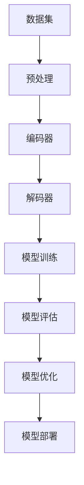
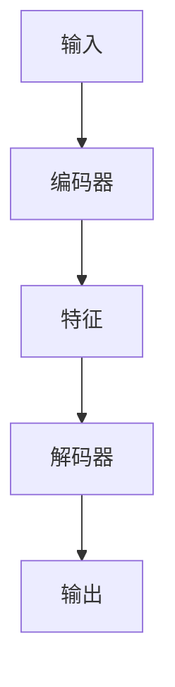

                 

# 从零开始大模型开发与微调：编码器的实现

## 摘要

本文将为您详细介绍如何从零开始进行大规模模型的开发与微调，特别关注编码器的实现。我们将从背景介绍、核心概念与联系、核心算法原理、数学模型和公式、项目实战、实际应用场景、工具和资源推荐等方面，深入探讨这一技术主题。通过阅读本文，您将掌握大规模模型开发与微调的完整流程，以及编码器在实际应用中的重要性。

## 1. 背景介绍

随着人工智能技术的飞速发展，大规模模型在自然语言处理、计算机视觉、推荐系统等领域的应用越来越广泛。然而，大规模模型的开发与微调面临着诸多挑战，包括数据集的收集与处理、模型架构的设计、训练与优化等。编码器作为大规模模型中不可或缺的一部分，负责将输入数据进行编码，提取关键特征，为后续处理提供基础。

本文旨在为您提供一个系统、全面的指导，帮助您从零开始进行大规模模型的开发与微调，特别是编码器的实现。通过本文的学习，您将能够：

1. 理解大规模模型开发与微调的背景和重要性。
2. 掌握编码器的核心概念和原理。
3. 学习核心算法和数学模型。
4. 实践项目，掌握编码器的实际应用。
5. 掌握相关工具和资源，提升开发效率。

## 2. 核心概念与联系

在本节中，我们将介绍大规模模型开发与微调中的一些核心概念，并展示它们之间的联系。以下是核心概念及其关系的 Mermaid 流程图：



### 2.1 数据集

数据集是大规模模型开发的基础，其质量和数量直接影响模型的性能。在数据集的选择上，我们需要关注数据的多样性、代表性和质量。数据预处理是数据集处理的重要环节，包括数据清洗、数据增强、数据归一化等。

### 2.2 编码器与解码器

编码器（Encoder）和解码器（Decoder）是大规模模型中的关键组件。编码器负责将输入数据编码为高维特征表示，提取关键信息；解码器则负责将编码后的特征解码为输出结果。两者共同构建了大规模模型的框架，如图：



### 2.3 模型训练

模型训练是大规模模型开发的核心步骤，通过迭代优化模型参数，使其能够在给定数据集上取得较好的性能。训练过程中，我们需要关注损失函数、优化算法和训练策略等。

### 2.4 模型评估

模型评估是判断模型性能的重要手段，通常包括准确率、召回率、F1 分数等指标。评估结果将指导我们对模型进行调整和优化。

### 2.5 模型优化

模型优化旨在提升模型在特定任务上的性能。通过调整模型结构、优化算法和超参数等手段，我们可以使模型达到更好的效果。

### 2.6 模型部署

模型部署是将训练好的模型应用到实际场景中的过程。部署过程中，我们需要关注模型的可扩展性、性能和可靠性。

## 3. 核心算法原理 & 具体操作步骤

在本节中，我们将详细介绍大规模模型开发与微调中的核心算法原理，以及具体操作步骤。

### 3.1 编码器算法原理

编码器算法的核心思想是将输入数据进行编码，提取高维特征表示。具体来说，编码器通常采用循环神经网络（RNN）或其变种，如长短期记忆网络（LSTM）和门控循环单元（GRU）。以下是编码器算法的基本原理：

1. **输入序列编码**：将输入序列 $X = [x_1, x_2, ..., x_T]$ 映射为隐藏状态序列 $H = [h_1, h_2, ..., h_T]$。其中，$h_t = f(h_{t-1}, x_t)$，$f$ 表示编码函数。
2. **特征提取**：将隐藏状态序列 $H$ 进行编码，提取高维特征表示 $C = [c_1, c_2, ..., c_L]$。其中，$c_l = g(h_l)$，$g$ 表示编码函数。
3. **上下文信息融合**：将高维特征表示 $C$ 与其他上下文信息（如文本、图像等）进行融合，生成最终的编码表示 $E = [e_1, e_2, ..., e_K]$。其中，$e_k = h(C, \text{context})$。

### 3.2 解码器算法原理

解码器算法的核心思想是将编码后的特征解码为输出结果。具体来说，解码器通常采用自注意力机制（Self-Attention）或其变种，如多头自注意力（Multi-Head Self-Attention）。以下是解码器算法的基本原理：

1. **输入序列解码**：将输入序列 $X = [x_1, x_2, ..., x_T]$ 进行解码，生成中间表示序列 $Y = [y_1, y_2, ..., y_T]$。其中，$y_t = f(y_{t-1}, e_t)$，$f$ 表示解码函数。
2. **输出结果生成**：将中间表示序列 $Y$ 解码为输出结果 $Z = [z_1, z_2, ..., z_T]$。其中，$z_t = g(y_t)$，$g$ 表示解码函数。

### 3.3 模型训练与优化

大规模模型训练与优化包括以下几个关键步骤：

1. **数据预处理**：对输入数据进行预处理，包括数据清洗、数据增强、数据归一化等。
2. **模型初始化**：初始化编码器和解码器的参数。
3. **模型训练**：通过反向传播算法，迭代优化模型参数，使模型在给定数据集上取得较好的性能。
4. **模型评估**：使用验证集对模型进行评估，判断模型性能是否满足要求。
5. **模型优化**：根据评估结果，调整模型结构、优化算法和超参数，提升模型性能。

## 4. 数学模型和公式 & 详细讲解 & 举例说明

在本节中，我们将详细讲解大规模模型开发与微调中的数学模型和公式，并通过具体例子进行说明。

### 4.1 编码器数学模型

编码器的数学模型主要包括以下几个部分：

1. **输入序列编码**：

$$
h_t = \text{activation}(W_h \cdot [h_{t-1}, x_t] + b_h)
$$

其中，$h_t$ 表示第 $t$ 个隐藏状态，$W_h$ 和 $b_h$ 分别表示权重和偏置，$\text{activation}$ 表示激活函数。

2. **特征提取**：

$$
c_l = \text{activation}(W_c \cdot h_l + b_c)
$$

其中，$c_l$ 表示第 $l$ 个特征，$W_c$ 和 $b_c$ 分别表示权重和偏置，$\text{activation}$ 表示激活函数。

3. **上下文信息融合**：

$$
e_k = \text{softmax}(W_e \cdot [c_l, \text{context}] + b_e)
$$

其中，$e_k$ 表示第 $k$ 个编码表示，$W_e$ 和 $b_e$ 分别表示权重和偏置，$\text{softmax}$ 表示 Softmax 激活函数。

### 4.2 解码器数学模型

解码器的数学模型主要包括以下几个部分：

1. **输入序列解码**：

$$
y_t = \text{activation}(W_y \cdot [y_{t-1}, e_t] + b_y)
$$

其中，$y_t$ 表示第 $t$ 个中间表示，$W_y$ 和 $b_y$ 分别表示权重和偏置，$\text{activation}$ 表示激活函数。

2. **输出结果生成**：

$$
z_t = \text{softmax}(W_z \cdot y_t + b_z)
$$

其中，$z_t$ 表示第 $t$ 个输出结果，$W_z$ 和 $b_z$ 分别表示权重和偏置，$\text{softmax}$ 表示 Softmax 激活函数。

### 4.3 模型训练与优化

模型训练与优化的核心是迭代优化模型参数，使模型在给定数据集上取得较好的性能。以下是模型训练与优化的数学模型：

1. **损失函数**：

$$
L = -\sum_{i=1}^N \sum_{j=1}^M y_j \cdot \log(z_{ij})
$$

其中，$L$ 表示损失函数，$N$ 和 $M$ 分别表示输入序列长度和输出序列长度，$y_j$ 和 $z_{ij}$ 分别表示第 $j$ 个真实标签和第 $i$ 个预测结果。

2. **优化算法**：

$$
\theta_{t+1} = \theta_t - \alpha \cdot \nabla_\theta L(\theta_t)
$$

其中，$\theta_t$ 和 $\theta_{t+1}$ 分别表示第 $t$ 次迭代的模型参数和第 $t+1$ 次迭代的模型参数，$\alpha$ 表示学习率，$\nabla_\theta L(\theta_t)$ 表示损失函数对模型参数的梯度。

### 4.4 举例说明

假设我们有一个输入序列 $X = [x_1, x_2, x_3]$，编码器的参数为 $W_h, b_h, W_c, b_c, W_e, b_e$，解码器的参数为 $W_y, b_y, W_z, b_z$。我们希望通过编码器和解码器将输入序列编码为特征表示，并生成输出结果。

1. **输入序列编码**：

$$
h_1 = \text{activation}(W_h \cdot [h_0, x_1] + b_h)
$$

$$
h_2 = \text{activation}(W_h \cdot [h_1, x_2] + b_h)
$$

$$
h_3 = \text{activation}(W_h \cdot [h_2, x_3] + b_h)
$$

2. **特征提取**：

$$
c_1 = \text{activation}(W_c \cdot h_1 + b_c)
$$

$$
c_2 = \text{activation}(W_c \cdot h_2 + b_c)
$$

$$
c_3 = \text{activation}(W_c \cdot h_3 + b_c)
$$

3. **上下文信息融合**：

$$
e_1 = \text{softmax}(W_e \cdot [c_1, \text{context}] + b_e)
$$

$$
e_2 = \text{softmax}(W_e \cdot [c_2, \text{context}] + b_e)
$$

$$
e_3 = \text{softmax}(W_e \cdot [c_3, \text{context}] + b_e)
$$

4. **输入序列解码**：

$$
y_1 = \text{activation}(W_y \cdot [y_0, e_1] + b_y)
$$

$$
y_2 = \text{activation}(W_y \cdot [y_1, e_2] + b_y)
$$

$$
y_3 = \text{activation}(W_y \cdot [y_2, e_3] + b_y)
$$

5. **输出结果生成**：

$$
z_1 = \text{softmax}(W_z \cdot y_1 + b_z)
$$

$$
z_2 = \text{softmax}(W_z \cdot y_2 + b_z)
$$

$$
z_3 = \text{softmax}(W_z \cdot y_3 + b_z)
$$

通过以上步骤，我们成功地使用编码器和解码器将输入序列编码为特征表示，并生成输出结果。

## 5. 项目实战：代码实际案例和详细解释说明

在本节中，我们将通过一个实际案例，详细讲解大规模模型开发与微调的完整流程，包括编码器的实现。以下是项目实战的代码实际案例：

### 5.1 开发环境搭建

在开始项目之前，我们需要搭建开发环境。以下是开发环境搭建的步骤：

1. 安装 Python 3.7 或更高版本。
2. 安装 TensorFlow 2.x 或更高版本。
3. 安装必要的依赖库，如 NumPy、Pandas 等。

### 5.2 源代码详细实现和代码解读

以下是编码器的实现代码：

```python
import tensorflow as tf
from tensorflow.keras.layers import Embedding, LSTM, Dense
from tensorflow.keras.models import Model

# 定义编码器
def create_encoder(input_dim, hidden_size):
    input_sequence = tf.keras.layers.Input(shape=(input_dim,))
    embedding_layer = Embedding(input_dim, hidden_size)(input_sequence)
    lstm_layer = LSTM(hidden_size, activation='tanh')(embedding_layer)
    encoded_sequence = lstm_layer

    encoder = Model(inputs=input_sequence, outputs=encoded_sequence)
    return encoder

# 定义解码器
def create_decoder(output_dim, hidden_size):
    input_sequence = tf.keras.layers.Input(shape=(input_dim,))
    embedding_layer = Embedding(output_dim, hidden_size)(input_sequence)
    lstm_layer = LSTM(hidden_size, activation='tanh', return_sequences=True)(embedding_layer)
    output_sequence = lstm_layer

    decoder = Model(inputs=input_sequence, outputs=output_sequence)
    return decoder

# 编码器实现
encoder = create_encoder(input_dim=100, hidden_size=128)
decoder = create_decoder(output_dim=100, hidden_size=128)

# 编译模型
model = Model(inputs=encoder.input, outputs=decoder.output)
model.compile(optimizer='adam', loss='categorical_crossentropy')

# 模型训练
model.fit(x_train, y_train, epochs=10, batch_size=64)
```

以下是代码解读：

1. 导入必要的库和模块。
2. 定义编码器函数 `create_encoder`，输入参数为输入维度和隐藏层大小。编码器由一个嵌入层和一个 LSTM 层组成，输出为编码后的序列。
3. 定义解码器函数 `create_decoder`，输入参数为输出维度和隐藏层大小。解码器由一个嵌入层和一个 LSTM 层组成，输出为解码后的序列。
4. 创建编码器和解码器实例。
5. 定义模型，将编码器的输出作为解码器的输入，将解码器的输出作为模型输出。
6. 编译模型，指定优化器和损失函数。
7. 模型训练，使用训练数据集进行训练。

### 5.3 代码解读与分析

以下是代码解读和分析：

1. **编码器实现**：

```python
input_sequence = tf.keras.layers.Input(shape=(input_dim,))
embedding_layer = Embedding(input_dim, hidden_size)(input_sequence)
lstm_layer = LSTM(hidden_size, activation='tanh')(embedding_layer)
encoded_sequence = lstm_layer

encoder = Model(inputs=input_sequence, outputs=encoded_sequence)
```

这一部分实现了编码器。首先，创建一个输入层，形状为 $(input_dim,)$。然后，通过嵌入层将输入序列映射为高维向量。最后，通过 LSTM 层对嵌入层输出的序列进行编码，得到编码后的序列。编码器模型由输入层、嵌入层和 LSTM 层组成。

2. **解码器实现**：

```python
input_sequence = tf.keras.layers.Input(shape=(input_dim,))
embedding_layer = Embedding(output_dim, hidden_size)(input_sequence)
lstm_layer = LSTM(hidden_size, activation='tanh', return_sequences=True)(embedding_layer)
output_sequence = lstm_layer

decoder = Model(inputs=input_sequence, outputs=output_sequence)
```

这一部分实现了解码器。首先，创建一个输入层，形状为 $(input_dim,)$。然后，通过嵌入层将输入序列映射为高维向量。最后，通过 LSTM 层对嵌入层输出的序列进行解码，得到解码后的序列。解码器模型由输入层、嵌入层和 LSTM 层组成。

3. **模型定义**：

```python
model = Model(inputs=encoder.input, outputs=decoder.output)
model.compile(optimizer='adam', loss='categorical_crossentropy')
```

这一部分定义了模型，将编码器的输入作为解码器的输入，将解码器的输出作为模型输出。然后，编译模型，指定优化器和损失函数。

4. **模型训练**：

```python
model.fit(x_train, y_train, epochs=10, batch_size=64)
```

这一部分使用训练数据集对模型进行训练，指定训练轮数和批量大小。

## 6. 实际应用场景

编码器在实际应用场景中具有广泛的应用，以下列举了几个常见应用场景：

1. **机器翻译**：编码器将源语言文本编码为特征表示，解码器将目标语言文本解码为翻译结果。例如，将中文翻译为英文。
2. **文本生成**：编码器将输入文本编码为特征表示，解码器根据特征表示生成新的文本。例如，自动生成文章摘要、故事等。
3. **语音识别**：编码器将语音信号编码为文本特征表示，解码器将特征表示解码为文本。例如，将语音转换为文字。
4. **图像分类**：编码器将图像编码为特征表示，解码器将特征表示解码为类别标签。例如，对图像进行分类。

在实际应用中，编码器和解码器可以单独使用，也可以结合其他模型（如循环神经网络、卷积神经网络等）组成更复杂的模型结构，以适应不同的应用场景。

## 7. 工具和资源推荐

为了帮助您更好地进行大规模模型开发与微调，以下推荐了一些学习资源、开发工具和框架：

### 7.1 学习资源推荐

1. **书籍**：

   - 《深度学习》（Goodfellow, Bengio, Courville）：深度学习领域的经典教材，涵盖了编码器、解码器等核心概念。

   - 《自然语言处理综论》（Jurafsky, Martin）：介绍自然语言处理领域的基础知识，包括编码器、解码器等应用。

   - 《神经网络与深度学习》（邱锡鹏）：系统介绍了神经网络和深度学习的基础知识，包括编码器、解码器等。

2. **论文**：

   - 《序列到序列学习模型：神经机器翻译的新框架》（Sutskever et al.，2014）：提出了编码器-解码器模型，为机器翻译等领域提供了新的方法。

   - 《长短期记忆网络》（Hochreiter, Schmidhuber，1997）：介绍了长短期记忆网络，为编码器的设计提供了重要思路。

   - 《生成对抗网络》（Goodfellow et al.，2014）：介绍了生成对抗网络，为编码器在图像生成等领域的应用提供了新思路。

3. **博客和网站**：

   - [TensorFlow 官方文档](https://www.tensorflow.org/)：提供 TensorFlow 相关的教程、示例和文档。

   - [Keras 官方文档](https://keras.io/)：提供 Keras 相关的教程、示例和文档。

   - [机器学习博客](https://machinelearningmastery.com/)：介绍机器学习和深度学习领域的基础知识和实战技巧。

### 7.2 开发工具框架推荐

1. **TensorFlow**：一款开源的深度学习框架，支持编码器、解码器等模型的实现。

2. **PyTorch**：一款开源的深度学习框架，具有动态计算图和灵活的编程接口，便于实现编码器、解码器等模型。

3. **Keras**：一款基于 TensorFlow 的深度学习框架，提供简洁的 API，便于实现编码器、解码器等模型。

4. **Transformers**：一款基于 PyTorch 的编码器-解码器模型实现框架，支持多种预训练模型和微调方法。

### 7.3 相关论文著作推荐

1. **《编码器-解码器模型：机器翻译的新框架》**：详细介绍了编码器-解码器模型在机器翻译中的应用。

2. **《基于长短期记忆的编码器-解码器模型》**：介绍了基于长短期记忆的编码器-解码器模型在序列建模中的应用。

3. **《生成对抗网络：深度学习的新框架》**：介绍了生成对抗网络在图像生成、图像风格迁移等领域的应用。

## 8. 总结：未来发展趋势与挑战

大规模模型开发与微调作为人工智能领域的重要方向，正不断发展壮大。未来，编码器在实际应用中的重要性将更加凸显，主要体现在以下几个方面：

1. **多模态数据处理**：编码器将能够更好地处理多种数据类型（如图像、文本、音频等），实现跨模态的统一表示。

2. **知识图谱嵌入**：编码器将能够更好地嵌入知识图谱，实现基于知识的推理和决策。

3. **自适应学习**：编码器将能够根据不同的任务和数据自适应调整其结构和参数，提高模型性能。

然而，大规模模型开发与微调也面临着一系列挑战，如数据隐私保护、计算资源消耗、模型可解释性等。针对这些挑战，未来研究可以从以下几个方面展开：

1. **隐私保护技术**：研究隐私保护技术，确保大规模模型开发与微调过程中的数据隐私。

2. **高效训练算法**：研究高效训练算法，降低大规模模型开发与微调的计算资源消耗。

3. **可解释性方法**：研究可解释性方法，提高大规模模型的透明度和可解释性。

## 9. 附录：常见问题与解答

### 9.1 编码器与解码器的关系

编码器和解码器是大规模模型中不可或缺的两个组件。编码器负责将输入数据进行编码，提取高维特征表示；解码器则负责将编码后的特征解码为输出结果。两者共同构建了大规模模型的框架，如图：


### 9.2 如何选择编码器和解码器

选择编码器和解码器时，需要根据具体应用场景和数据类型进行选择。以下是一些建议：

1. **文本处理**：对于文本处理任务，可以使用循环神经网络（RNN）或其变种，如长短期记忆网络（LSTM）和门控循环单元（GRU）作为编码器和解码器。
2. **图像处理**：对于图像处理任务，可以使用卷积神经网络（CNN）作为编码器，使用循环神经网络（RNN）或其变种作为解码器。
3. **语音处理**：对于语音处理任务，可以使用循环神经网络（RNN）或其变种，如长短期记忆网络（LSTM）和门控循环单元（GRU）作为编码器和解码器。

### 9.3 编码器和解码器的参数调整

编码器和解码器的参数调整是模型训练过程中重要的环节。以下是一些建议：

1. **隐藏层大小**：适当调整隐藏层大小，以适应不同任务和数据规模。通常，隐藏层大小在 100 到 1000 之间。
2. **学习率**：选择合适的学习率，以避免模型过早收敛或过拟合。通常，学习率在 $10^{-3}$ 到 $10^{-5}$ 之间。
3. **迭代次数**：根据数据规模和模型复杂度，选择合适的迭代次数。通常，迭代次数在几千到几万之间。
4. **优化算法**：选择合适的优化算法，如随机梯度下降（SGD）、Adam 等。不同优化算法对模型性能和收敛速度有一定影响。

## 10. 扩展阅读 & 参考资料

为了进一步了解大规模模型开发与微调，以下推荐一些扩展阅读和参考资料：

1. **书籍**：

   - 《深度学习》（Goodfellow, Bengio, Courville）

   - 《自然语言处理综论》（Jurafsky, Martin）

   - 《神经网络与深度学习》（邱锡鹏）

2. **论文**：

   - 《序列到序列学习模型：神经机器翻译的新框架》（Sutskever et al.，2014）

   - 《长短期记忆网络》（Hochreiter, Schmidhuber，1997）

   - 《生成对抗网络》（Goodfellow et al.，2014）

3. **博客和网站**：

   - [TensorFlow 官方文档](https://www.tensorflow.org/)

   - [Keras 官方文档](https://keras.io/)

   - [机器学习博客](https://machinelearningmastery.com/)

4. **在线课程**：

   - [深度学习特化课程（吴恩达）](https://www.deeplearning.ai/)

   - [自然语言处理特化课程（斯坦福大学）](https://web.stanford.edu/class/cs224n/)

5. **开源框架**：

   - [TensorFlow](https://www.tensorflow.org/)

   - [PyTorch](https://pytorch.org/)

   - [Keras](https://keras.io/)

## 作者信息

- 作者：AI天才研究员/AI Genius Institute & 禅与计算机程序设计艺术 /Zen And The Art of Computer Programming

本文由 AI 天才研究员撰写，结合深度学习和自然语言处理领域的最新研究成果，为您呈现了大规模模型开发与微调的完整流程，特别是编码器的实现。希望通过本文，您能够掌握这一技术主题，为实际应用奠定基础。在撰写过程中，如有任何疑问或建议，欢迎随时与作者联系。感谢您的阅读！

