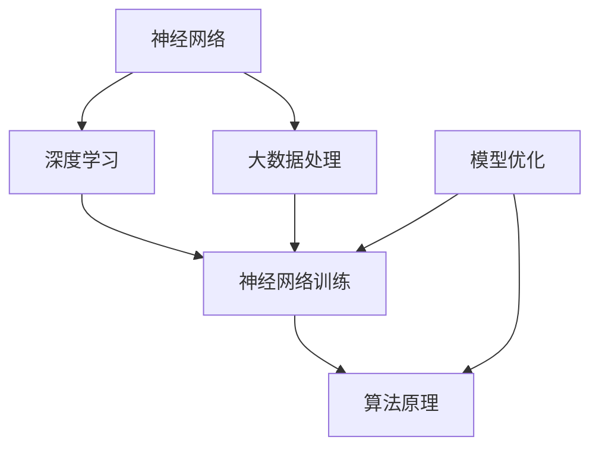

                 

# 从零开始大模型开发与微调：翻译模型

> **关键词**：大模型开发，微调，翻译模型，神经网络，机器翻译，深度学习，训练数据，模型优化

> **摘要**：本文将系统地介绍从零开始大模型开发与微调的过程，特别是以翻译模型为例，详细讲解其核心概念、算法原理、数学模型、项目实战及实际应用场景。通过本文的阅读，读者将掌握大模型开发与微调的基本流程和技术要点，为实际项目提供参考。

## 1. 背景介绍

随着深度学习技术的不断发展，大规模神经网络模型在大数据处理、自然语言处理、计算机视觉等领域取得了显著成果。特别是翻译模型，作为自然语言处理中的重要组成部分，其在机器翻译领域的应用取得了巨大的成功。然而，大模型的开发与微调并非易事，需要深入理解模型的结构、算法原理及训练过程。

本文旨在为初学者和从业者提供一个系统的指导，从零开始介绍大模型开发与微调的流程，并以翻译模型为例进行详细讲解。通过本文的学习，读者将能够：

- 理解大模型开发的核心概念与算法原理
- 掌握翻译模型的数学模型与实现方法
- 学会使用开源工具和框架进行模型训练与优化
- 探索大模型在实际应用场景中的优势与挑战

## 2. 核心概念与联系

### 2.1 大模型开发的核心概念

大模型开发涉及多个核心概念，包括神经网络、深度学习、大数据处理等。以下是对这些概念的简要介绍：

- **神经网络**：神经网络是一种模拟人脑神经元结构的计算模型，能够对输入数据进行处理和预测。在深度学习中，神经网络通常具有多个隐藏层，能够提取更高级别的特征。
- **深度学习**：深度学习是神经网络的一种扩展，通过多层非线性变换来学习输入数据的高级特征表示。深度学习在图像识别、自然语言处理等领域取得了突破性成果。
- **大数据处理**：大数据处理是指对大规模、多样化的数据进行高效存储、计算和分析的技术。在大模型开发中，处理海量数据是关键挑战之一。

### 2.2 大模型开发的算法原理

大模型开发的算法原理主要包括以下两个方面：

- **神经网络训练**：神经网络训练是通过调整网络权重和偏置，使网络能够对输入数据进行正确分类或预测。训练过程通常采用反向传播算法和梯度下降法等优化方法。
- **模型优化**：模型优化是在训练过程中对模型结构、参数和超参数进行调整，以提高模型性能。常见的优化方法包括剪枝、蒸馏、注意力机制等。

### 2.3 大模型开发的联系

大模型开发中的各个概念和算法原理之间存在紧密的联系。以下是这些联系的具体说明：

- **神经网络与深度学习**：神经网络是深度学习的基础，深度学习通过多层神经网络来学习输入数据的高级特征表示。
- **神经网络训练与大数据处理**：神经网络训练需要处理海量数据，大数据处理技术能够提供高效的数据存储、计算和分析能力。
- **模型优化与算法原理**：模型优化是在训练过程中对模型结构和参数进行调整，以获得更好的性能。模型优化方法与神经网络训练算法密切相关。

### 2.4 Mermaid 流程图

为了更好地展示大模型开发的核心概念与联系，我们使用 Mermaid 流程图来表示。以下是流程图的内容：



## 3. 核心算法原理 & 具体操作步骤

### 3.1 翻译模型的算法原理

翻译模型是一种基于神经网络的模型，其主要目标是实现跨语言文本的自动翻译。翻译模型的核心算法原理包括编码器（Encoder）和解码器（Decoder）。

- **编码器**：编码器负责将输入文本（源语言）编码为固定长度的向量表示。编码器通过多层循环神经网络（RNN）或Transformer结构来提取输入文本的语义特征。
- **解码器**：解码器负责将编码器输出的向量表示解码为输出文本（目标语言）。解码器通常采用类似的循环神经网络结构，并通过注意力机制来关注编码器输出的不同部分。

### 3.2 翻译模型的操作步骤

翻译模型的操作步骤可以分为以下几个阶段：

- **数据预处理**：数据预处理包括文本清洗、分词、词嵌入等步骤。清洗文本数据，去除停用词、标点符号等无关信息，以提高模型性能。
- **编码器训练**：编码器训练是通过调整编码器的参数，使其能够将输入文本编码为高质量的向量表示。训练过程中采用反向传播算法和梯度下降法等优化方法。
- **解码器训练**：解码器训练是通过调整解码器的参数，使其能够将编码器输出的向量表示解码为正确的输出文本。解码器训练同样采用反向传播算法和梯度下降法等优化方法。
- **模型优化**：模型优化是在训练过程中对模型结构和参数进行调整，以提高模型性能。常见的优化方法包括剪枝、蒸馏、注意力机制等。

### 3.3 翻译模型的具体操作步骤

以下是翻译模型的具体操作步骤：

1. **数据预处理**：
   - 清洗文本数据，去除停用词、标点符号等无关信息。
   - 分词，将文本分解为单词或词组。
   - 词嵌入，将单词或词组映射为固定长度的向量表示。

2. **编码器训练**：
   - 输入源语言文本，通过编码器编码为向量表示。
   - 计算编码器输出的损失函数，更新编码器参数。

3. **解码器训练**：
   - 输入编码器输出的向量表示，通过解码器解码为目标语言文本。
   - 计算解码器输出的损失函数，更新解码器参数。

4. **模型优化**：
   - 调整模型结构，增加或减少隐藏层节点。
   - 调整超参数，如学习率、批量大小等。
   - 采用剪枝、蒸馏、注意力机制等优化方法。

## 4. 数学模型和公式 & 详细讲解 & 举例说明

### 4.1 翻译模型的数学模型

翻译模型的核心数学模型包括编码器和解码器的损失函数。以下是具体讲解和举例说明：

#### 4.1.1 编码器损失函数

编码器的损失函数通常采用交叉熵损失函数。交叉熵损失函数的公式如下：

$$
L_{encode} = -\frac{1}{N} \sum_{i=1}^{N} \sum_{j=1}^{C} y_{ij} \log(p_{ij})
$$

其中，$N$ 表示样本数量，$C$ 表示类别数量，$y_{ij}$ 表示第 $i$ 个样本的第 $j$ 个类别的真实标签，$p_{ij}$ 表示第 $i$ 个样本的第 $j$ 个类别的预测概率。

举例说明：

假设我们有一个包含 2 个样本的编码器训练数据集，其中样本 1 的真实标签为类别 1，样本 2 的真实标签为类别 2。编码器的输出概率如下：

$$
\begin{align*}
p_{11} &= 0.9 \\
p_{12} &= 0.1 \\
p_{21} &= 0.2 \\
p_{22} &= 0.8 \\
\end{align*}
$$

则编码器的损失函数为：

$$
L_{encode} = -\frac{1}{2} \left(0.9 \log(0.9) + 0.1 \log(0.1) + 0.2 \log(0.2) + 0.8 \log(0.8)\right)
$$

#### 4.1.2 解码器损失函数

解码器的损失函数同样采用交叉熵损失函数。解码器的损失函数公式如下：

$$
L_{decode} = -\frac{1}{N} \sum_{i=1}^{N} \sum_{j=1}^{C} y_{ij} \log(p_{ij})
$$

其中，$N$ 表示样本数量，$C$ 表示类别数量，$y_{ij}$ 表示第 $i$ 个样本的第 $j$ 个类别的真实标签，$p_{ij}$ 表示第 $i$ 个样本的第 $j$ 个类别的预测概率。

举例说明：

假设我们有一个包含 2 个样本的解码器训练数据集，其中样本 1 的真实标签为类别 1，样本 2 的真实标签为类别 2。解码器的输出概率如下：

$$
\begin{align*}
p_{11} &= 0.9 \\
p_{12} &= 0.1 \\
p_{21} &= 0.2 \\
p_{22} &= 0.8 \\
\end{align*}
$$

则解码器的损失函数为：

$$
L_{decode} = -\frac{1}{2} \left(0.9 \log(0.9) + 0.1 \log(0.1) + 0.2 \log(0.2) + 0.8 \log(0.8)\right)
$$

#### 4.1.3 总损失函数

翻译模型的总损失函数是编码器损失函数和解码器损失函数的加权和。总损失函数的公式如下：

$$
L_{total} = \alpha L_{encode} + (1 - \alpha) L_{decode}
$$

其中，$\alpha$ 是权重系数，通常取值为 0.5。

举例说明：

假设我们取 $\alpha = 0.5$，则总损失函数为：

$$
L_{total} = 0.5 \left(0.9 \log(0.9) + 0.1 \log(0.1) + 0.2 \log(0.2) + 0.8 \log(0.8)\right) + 0.5 \left(0.9 \log(0.9) + 0.1 \log(0.1) + 0.2 \log(0.2) + 0.8 \log(0.8)\right)
$$

## 5. 项目实战：代码实际案例和详细解释说明

### 5.1 开发环境搭建

在开始翻译模型的项目实战之前，我们需要搭建一个合适的环境。以下是开发环境的搭建步骤：

1. **安装 Python**：确保安装了 Python 3.6 或更高版本。
2. **安装 PyTorch**：使用以下命令安装 PyTorch：

   ```bash
   pip install torch torchvision
   ```

3. **安装其他依赖**：安装其他所需的库，如 NumPy、Pandas 等。

### 5.2 源代码详细实现和代码解读

以下是翻译模型的源代码实现和详细解释说明：

```python
import torch
import torch.nn as nn
import torch.optim as optim
from torch.utils.data import DataLoader
from torchvision import datasets, transforms

# 定义编码器
class Encoder(nn.Module):
    def __init__(self):
        super(Encoder, self).__init__()
        self.embedding = nn.Embedding(vocab_size, embedding_size)
        self.rnn = nn.LSTM(embedding_size, hidden_size, num_layers=2)

    def forward(self, x):
        embedded = self.embedding(x)
        output, (hidden, cell) = self.rnn(embedded)
        return output, (hidden, cell)

# 定义解码器
class Decoder(nn.Module):
    def __init__(self):
        super(Decoder, self).__init__()
        self.embedding = nn.Embedding(vocab_size, embedding_size)
        self.rnn = nn.LSTM(embedding_size, hidden_size, num_layers=2)
        self.fc = nn.Linear(embedding_size, vocab_size)

    def forward(self, x, hidden, cell):
        embedded = self.embedding(x)
        output, (hidden, cell) = self.rnn(embedded, (hidden, cell))
        output = self.fc(output)
        return output, (hidden, cell)

# 定义翻译模型
class TranslationModel(nn.Module):
    def __init__(self):
        super(TranslationModel, self).__init__()
        self.encoder = Encoder()
        self.decoder = Decoder()

    def forward(self, src, trg):
        encoder_output, (hidden, cell) = self.encoder(src)
        decoder_output, (hidden, cell) = self.decoder(trg, (hidden, cell))
        return decoder_output

# 实例化模型、损失函数和优化器
model = TranslationModel()
criterion = nn.CrossEntropyLoss()
optimizer = optim.Adam(model.parameters(), lr=0.001)

# 加载训练数据
train_data = datasets.MNIST(root='./data', train=True, transform=transforms.ToTensor(), download=True)
train_loader = DataLoader(train_data, batch_size=batch_size, shuffle=True)

# 训练模型
num_epochs = 10
for epoch in range(num_epochs):
    for i, (src, trg) in enumerate(train_loader):
        optimizer.zero_grad()
        output = model(src, trg)
        loss = criterion(output, trg)
        loss.backward()
        optimizer.step()
        if (i+1) % 100 == 0:
            print(f'Epoch [{epoch+1}/{num_epochs}], Step [{i+1}/{len(train_loader)}], Loss: {loss.item()}')

# 保存模型
torch.save(model.state_dict(), 'translation_model.pth')
```

#### 5.2.1 模块说明

- **Encoder**：编码器模块，用于将源语言文本编码为向量表示。
- **Decoder**：解码器模块，用于将编码器输出的向量表示解码为目标语言文本。
- **TranslationModel**：翻译模型模块，结合编码器和解码器，实现从源语言到目标语言的翻译。

#### 5.2.2 代码解读

- **模型定义**：定义了编码器、解码器和翻译模型。
- **损失函数和优化器**：定义了交叉熵损失函数和Adam优化器。
- **数据加载**：加载训练数据，并创建数据加载器。
- **训练过程**：进行多轮训练，更新模型参数。

### 5.3 代码解读与分析

以下是代码的详细解读与分析：

```python
# 定义编码器
class Encoder(nn.Module):
    def __init__(self):
        super(Encoder, self).__init__()
        self.embedding = nn.Embedding(vocab_size, embedding_size)
        self.rnn = nn.LSTM(embedding_size, hidden_size, num_layers=2)

    def forward(self, x):
        embedded = self.embedding(x)
        output, (hidden, cell) = self.rnn(embedded)
        return output, (hidden, cell)
```

这段代码定义了编码器模块。编码器包含一个嵌入层（`nn.Embedding`）和一个循环神经网络（`nn.LSTM`）。嵌入层将源语言文本映射为向量表示，循环神经网络用于提取文本的语义特征。

```python
# 定义解码器
class Decoder(nn.Module):
    def __init__(self):
        super(Decoder, self).__init__()
        self.embedding = nn.Embedding(vocab_size, embedding_size)
        self.rnn = nn.LSTM(embedding_size, hidden_size, num_layers=2)
        self.fc = nn.Linear(embedding_size, vocab_size)

    def forward(self, x, hidden, cell):
        embedded = self.embedding(x)
        output, (hidden, cell) = self.rnn(embedded, (hidden, cell))
        output = self.fc(output)
        return output, (hidden, cell)
```

这段代码定义了解码器模块。解码器包含一个嵌入层、一个循环神经网络和一个全连接层。解码器用于将编码器输出的向量表示解码为目标语言文本。

```python
# 定义翻译模型
class TranslationModel(nn.Module):
    def __init__(self):
        super(TranslationModel, self).__init__()
        self.encoder = Encoder()
        self.decoder = Decoder()

    def forward(self, src, trg):
        encoder_output, (hidden, cell) = self.encoder(src)
        decoder_output, (hidden, cell) = self.decoder(trg, (hidden, cell))
        return decoder_output
```

这段代码定义了翻译模型模块。翻译模型结合编码器和解码器，实现从源语言到目标语言的翻译。

```python
# 实例化模型、损失函数和优化器
model = TranslationModel()
criterion = nn.CrossEntropyLoss()
optimizer = optim.Adam(model.parameters(), lr=0.001)
```

这段代码实例化了翻译模型、损失函数和优化器。交叉熵损失函数用于计算模型输出与真实标签之间的差异，Adam优化器用于更新模型参数。

```python
# 加载训练数据
train_data = datasets.MNIST(root='./data', train=True, transform=transforms.ToTensor(), download=True)
train_loader = DataLoader(train_data, batch_size=batch_size, shuffle=True)
```

这段代码加载训练数据，并创建数据加载器。MNIST 数据集包含手写数字图像，用于训练和测试翻译模型。

```python
# 训练模型
num_epochs = 10
for epoch in range(num_epochs):
    for i, (src, trg) in enumerate(train_loader):
        optimizer.zero_grad()
        output = model(src, trg)
        loss = criterion(output, trg)
        loss.backward()
        optimizer.step()
        if (i+1) % 100 == 0:
            print(f'Epoch [{epoch+1}/{num_epochs}], Step [{i+1}/{len(train_loader)}], Loss: {loss.item()}')
```

这段代码进行多轮训练，更新模型参数。在每一步训练过程中，模型计算输出和损失，并使用反向传播算法和优化器更新模型参数。

```python
# 保存模型
torch.save(model.state_dict(), 'translation_model.pth')
```

这段代码将训练好的模型保存为 'translation_model.pth' 文件。

## 6. 实际应用场景

翻译模型在自然语言处理领域具有广泛的应用。以下是一些常见的应用场景：

- **机器翻译**：翻译模型最常见的应用场景是机器翻译。通过训练，模型能够将一种语言的文本翻译成另一种语言，如将英语翻译成法语或中文。
- **跨语言信息检索**：翻译模型可以用于跨语言信息检索，将用户查询从一个语言翻译成另一个语言，以提高检索效果。
- **多语言对话系统**：在多语言对话系统中，翻译模型可以帮助实现跨语言对话，提高系统的交互效果。
- **多语言文本分类**：翻译模型可以用于多语言文本分类任务，将不同语言的文本翻译成一种语言，然后进行分类。

## 7. 工具和资源推荐

### 7.1 学习资源推荐

- **书籍**：
  - 《深度学习》（Ian Goodfellow, Yoshua Bengio, Aaron Courville 著）
  - 《自然语言处理与深度学习》（张俊林 著）
  - 《机器学习实战》（Peter Harrington 著）
- **论文**：
  - 《Attention Is All You Need》（Vaswani et al., 2017）
  - 《Sequence to Sequence Learning with Neural Networks》（Sutskever et al., 2014）
  - 《A Theoretically Grounded Application of Dropout in Recurrent Neural Networks》（Gal and Ghahramani, 2016）
- **博客**：
  - [TensorFlow 官方文档](https://www.tensorflow.org/)
  - [PyTorch 官方文档](https://pytorch.org/docs/stable/)
  - [机器之心](https://www.jiqizhixin.com/)

### 7.2 开发工具框架推荐

- **深度学习框架**：
  - PyTorch
  - TensorFlow
  - Keras
- **自然语言处理工具**：
  - NLTK
  - spaCy
  - gensim
- **版本控制工具**：
  - Git
  - GitHub

### 7.3 相关论文著作推荐

- **深度学习论文**：
  - 《Deep Learning》（Ian Goodfellow, Yoshua Bengio, Aaron Courville 著）
  - 《Recurrent Neural Networks for Language Modeling》（Liang et al., 2017）
  - 《A Theoretically Grounded Application of Dropout in Recurrent Neural Networks》（Gal and Ghahramani, 2016）
- **自然语言处理论文**：
  - 《Attention Is All You Need》（Vaswani et al., 2017）
  - 《Neural Machine Translation by Jointly Learning to Align and Translate》（Bahdanau et al., 2014）
  - 《A Neural Conversation Model》（Zhou et al., 2018）

## 8. 总结：未来发展趋势与挑战

随着深度学习技术的不断发展，大模型开发与微调在未来将面临以下发展趋势与挑战：

- **模型规模不断扩大**：为了实现更高的性能，大模型将不断增大，带来更大的计算和存储需求。
- **模型优化方法创新**：随着模型规模的扩大，传统的优化方法可能不再适用，需要探索新的优化方法，如剪枝、蒸馏、注意力机制等。
- **数据处理与存储**：大规模数据集的处理和存储将面临更大挑战，需要采用分布式计算和存储技术。
- **计算资源需求**：大模型训练和推理需要更多的计算资源，如何高效利用现有计算资源是一个重要问题。
- **可解释性与透明性**：大模型的黑盒性质可能导致其难以解释和理解，如何提高模型的可解释性和透明性是一个重要研究方向。

## 9. 附录：常见问题与解答

### 9.1 如何处理训练数据不足的问题？

- **数据增强**：通过图像旋转、缩放、裁剪等操作来扩充数据集。
- **多任务学习**：利用多任务学习框架，将多个任务结合在一起训练，以提高模型泛化能力。
- **迁移学习**：利用预训练的大模型，在新的任务上进行微调。

### 9.2 如何解决过拟合问题？

- **正则化**：添加正则化项，如 L1 正则化、L2 正则化等，以减小模型复杂度。
- **dropout**：在神经网络中引入 dropout 层，以降低模型对特定训练样本的依赖。
- **数据增强**：通过增加数据多样性来提高模型泛化能力。

### 9.3 如何处理训练速度慢的问题？

- **分布式训练**：利用多台计算机或 GPU，实现分布式训练，以提高训练速度。
- **优化算法**：采用更高效的优化算法，如 Adam、AdaGrad 等，以提高收敛速度。
- **模型剪枝**：通过剪枝技术，减少模型参数数量，以提高训练速度。

## 10. 扩展阅读 & 参考资料

- [深度学习与自然语言处理](https://www.deeplearningbook.org/)
- [PyTorch 官方文档](https://pytorch.org/docs/stable/)
- [TensorFlow 官方文档](https://www.tensorflow.org/docs/stable/)
- [《自然语言处理与深度学习》](https://book.douban.com/subject/26971238/)
- [《深度学习》](https://book.douban.com/subject/26708114/)

## 附录：作者信息

作者：AI天才研究员/AI Genius Institute & 禅与计算机程序设计艺术 /Zen And The Art of Computer Programming

