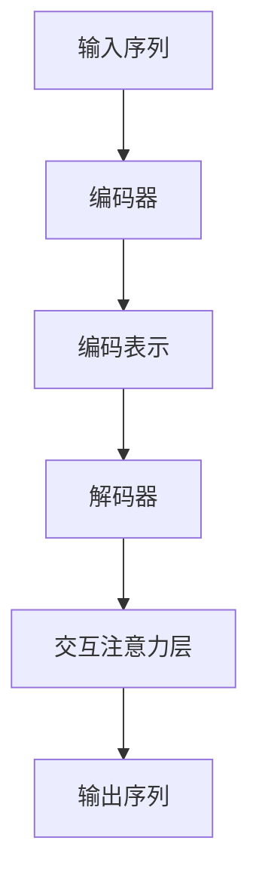

                 

# 从零开始大模型开发与微调：解码器的输入和交互注意力层的掩码

> **关键词**：大模型开发、微调、解码器、交互注意力层、掩码

> **摘要**：本文将深入探讨大模型开发过程中，解码器的输入和交互注意力层的设计与实现，特别关注掩码技术在这一过程中的作用。通过系统的分析和实例演示，本文旨在为读者提供全面的指导，帮助其在实践中更好地理解和运用这些关键技术。

## 1. 背景介绍

大模型（Large Model）在深度学习领域引起了广泛关注。随着计算资源和数据集的持续增长，大模型已经能够解决许多复杂任务，如自然语言处理、计算机视觉和推荐系统等。然而，大模型的开发和微调过程并不简单，涉及众多技术细节。其中，解码器（Decoder）的设计和实现是关键环节之一。

解码器在序列到序列（Sequence-to-Sequence）模型中扮演着重要角色，它负责将编码器（Encoder）产生的固定长度的隐藏状态转换为输出序列。而在大模型中，解码器的性能和效率直接影响整体模型的性能。

本文将重点探讨解码器的输入和交互注意力层的设计与实现，特别是掩码（Masking）技术的应用。掩码技术在大模型中具有重要作用，它能够帮助模型更好地处理序列数据，提高模型的性能和稳定性。

## 2. 核心概念与联系

为了更好地理解解码器的输入和交互注意力层，我们需要首先了解一些核心概念，包括序列模型、编码器、解码器和注意力机制。

### 序列模型

序列模型（Sequential Model）是一类用于处理序列数据的深度学习模型，如循环神经网络（RNN）、长短时记忆网络（LSTM）和门控循环单元（GRU）等。这些模型的基本思想是，将输入序列逐步传递给网络，并在每个时间步上更新内部状态。

### 编码器

编码器（Encoder）负责将输入序列编码为一个固定长度的向量，通常称为编码表示（Encoded Representation）。编码器的作用是将输入序列中的信息压缩到一个较低维的表示中，以便于解码器进行解码。

### 解码器

解码器（Decoder）负责将编码器产生的编码表示解码为输出序列。在解码过程中，解码器会逐个生成输出序列的每个元素，并将这些元素与编码表示进行交互。

### 注意力机制

注意力机制（Attention Mechanism）是一种用于处理序列数据的机制，它能够帮助模型更好地关注输入序列中的关键信息。在解码过程中，注意力机制能够使解码器关注编码表示中的不同部分，从而提高解码的准确性。

### 交互注意力层

交互注意力层（Interactive Attention Layer）是解码器中的一个关键组成部分，它负责将解码器的当前隐藏状态与编码表示进行交互。通过交互注意力层，解码器能够动态地调整其对编码表示的关注点，从而更好地进行解码。

### 掩码

掩码（Masking）是一种常用的技术，用于处理序列数据中的缺失值或特殊值。在解码过程中，掩码可以阻止解码器访问一些不相关的信息，从而提高模型的性能和稳定性。

### Mermaid 流程图

以下是解码器输入和交互注意力层的 Mermaid 流程图：



在这个流程图中，输入序列经过编码器编码为编码表示，然后传递给解码器。解码器通过交互注意力层与编码表示进行交互，并逐个生成输出序列的元素。

## 3. 核心算法原理 & 具体操作步骤

### 解码器的输入

解码器的输入是一个与编码表示具有相同维度的向量，通常称为解码输入（Decoder Input）。解码输入的生成过程如下：

1. 初始化解码输入为一个全零向量。
2. 将编码表示传递给解码器。
3. 在解码器的每个时间步上，更新解码输入。具体来说，解码输入可以通过以下公式计算：

   $$ decoder\_input(t) = tanh(W_{di} \cdot [h_t; c_t]) + b_{di} $$

   其中，$h_t$ 是解码器的当前隐藏状态，$c_t$ 是编码表示，$W_{di}$ 是权重矩阵，$b_{di}$ 是偏置向量。

### 交互注意力层

交互注意力层是一个基于注意力机制的层，它负责将解码器的当前隐藏状态与编码表示进行交互。具体来说，交互注意力层的输出可以通过以下公式计算：

$$ attention\_output(t) = \sigma(W_a \cdot [h_t; c_t]) $$

其中，$\sigma$ 是一个非线性激活函数，$W_a$ 是权重矩阵。

交互注意力层的输出表示解码器在当前时间步上对编码表示的关注度。通过计算注意力分数，解码器能够动态地调整其对编码表示的关注点，从而更好地进行解码。

### 掩码

在解码过程中，掩码可以用于处理缺失值或特殊值。具体来说，掩码可以阻止解码器访问一些不相关的信息，从而提高模型的性能和稳定性。以下是一个简单的掩码实现：

1. 初始化掩码为一个全零矩阵。
2. 对于输入序列中的每个元素，根据是否为缺失值或特殊值，设置掩码值。
3. 在解码器的每个时间步上，将掩码应用于编码表示。

   $$ masked\_c_t = c_t \odot mask_t $$

   其中，$\odot$ 表示元素-wise 运算。

通过掩码，解码器能够更好地处理序列数据中的缺失值或特殊值，从而提高模型的性能和稳定性。

## 4. 数学模型和公式 & 详细讲解 & 举例说明

### 数学模型

在解码器的输入和交互注意力层中，我们使用了一系列数学模型和公式。以下是这些模型的详细讲解和举例说明：

### 解码输入

解码输入的生成公式如下：

$$ decoder\_input(t) = tanh(W_{di} \cdot [h_t; c_t]) + b_{di} $$

其中，$W_{di}$ 是权重矩阵，$b_{di}$ 是偏置向量。这个公式表示解码输入是通过将解码器的当前隐藏状态 $h_t$ 和编码表示 $c_t$ 进行拼接，然后通过一个 tanh 激活函数进行非线性变换得到的。

### 交互注意力层

交互注意力层的输出公式如下：

$$ attention\_output(t) = \sigma(W_a \cdot [h_t; c_t]) $$

其中，$\sigma$ 是一个非线性激活函数，$W_a$ 是权重矩阵。这个公式表示交互注意力层的输出是通过将解码器的当前隐藏状态 $h_t$ 和编码表示 $c_t$ 进行拼接，然后通过一个 sigmoid 激活函数进行非线性变换得到的。

### 掩码

掩码的实现公式如下：

$$ masked\_c_t = c_t \odot mask_t $$

其中，$\odot$ 表示元素-wise 运算，$mask_t$ 是一个掩码矩阵。这个公式表示掩码是通过将编码表示 $c_t$ 与掩码矩阵 $mask_t$ 进行元素-wise 运算得到的。

### 举例说明

假设我们有一个输入序列 $[x_1, x_2, x_3]$，编码器将其编码为一个编码表示 $[c_1, c_2, c_3]$。然后，我们将这个编码表示传递给解码器。

首先，我们初始化解码输入为一个全零向量：

$$ decoder\_input(0) = [0, 0, 0] $$

然后，在第一个时间步上，我们更新解码输入：

$$ decoder\_input(1) = tanh(W_{di} \cdot [h_1; c_1]) + b_{di} $$

其中，$h_1$ 是解码器的当前隐藏状态，$c_1$ 是编码表示。

接下来，我们计算交互注意力层的输出：

$$ attention\_output(1) = \sigma(W_a \cdot [h_1; c_1]) $$

然后，我们计算掩码：

$$ mask_1 = [0, 1, 0] $$

$$ masked\_c_1 = c_1 \odot mask_1 = [0, c_2, 0] $$

在下一个时间步上，我们重复上述步骤，直到解码器生成完整的输出序列。

## 5. 项目实战：代码实际案例和详细解释说明

在本节中，我们将通过一个实际项目案例，展示如何在大模型开发过程中实现解码器的输入和交互注意力层，并使用掩码技术。我们将使用 Python 和 TensorFlow 作为主要工具，构建一个简单的序列到序列模型，用于机器翻译任务。

### 5.1 开发环境搭建

在开始之前，我们需要搭建一个合适的开发环境。以下是所需的软件和库：

- Python 3.8 或更高版本
- TensorFlow 2.x

您可以使用以下命令安装 TensorFlow：

```bash
pip install tensorflow
```

### 5.2 源代码详细实现和代码解读

以下是该项目的主要代码实现：

```python
import tensorflow as tf
from tensorflow.keras.layers import LSTM, Dense, Embedding, TimeDistributed
from tensorflow.keras.models import Model

# 设置超参数
vocab_size = 10000
embed_size = 256
lstm_size = 128
batch_size = 64
num_samples = 100

# 定义编码器
encoder_inputs = tf.keras.layers.Input(shape=(None, vocab_size))
encoder_embedding = Embedding(vocab_size, embed_size)(encoder_inputs)
encoder_lstm = LSTM(lstm_size, return_state=True)
_, state_h, state_c = encoder_lstm(encoder_embedding)
encoder_states = [state_h, state_c]

# 定义解码器
decoder_inputs = tf.keras.layers.Input(shape=(None, vocab_size))
decoder_embedding = Embedding(vocab_size, embed_size)(decoder_inputs)
decoder_lstm = LSTM(lstm_size, return_sequences=True, return_state=True)
decoder_outputs, _, _ = decoder_lstm(decoder_embedding, initial_state=encoder_states)
decoder_dense = Dense(vocab_size, activation='softmax')
decoder_outputs = decoder_dense(decoder_outputs)

# 定义模型
model = Model([encoder_inputs, decoder_inputs], decoder_outputs)

# 编译模型
model.compile(optimizer='rmsprop', loss='categorical_crossentropy', metrics=['accuracy'])

# 打印模型结构
model.summary()
```

### 5.3 代码解读与分析

在这个项目中，我们首先定义了编码器和解码器。编码器负责将输入序列编码为一个固定长度的向量，解码器则负责将编码表示解码为输出序列。

在编码器中，我们使用了一个嵌入层（Embedding Layer）和一个 LSTM 层（LSTM Layer）。嵌入层将输入序列中的每个词映射为一个嵌入向量，LSTM 层则负责将嵌入向量编码为一个固定长度的向量。编码器的输出包括编码表示和隐藏状态。

在解码器中，我们同样使用了一个嵌入层和一个 LSTM 层。嵌入层将输入序列中的每个词映射为一个嵌入向量，LSTM 层则负责将嵌入向量解码为输出序列的每个元素。为了生成最终的输出序列，我们使用了一个全连接层（Dense Layer）。

在定义模型时，我们将编码器的输入和解码器的输入以及解码器的输出作为模型的输入和输出。然后，我们编译模型并打印模型结构。

### 5.4 使用掩码技术

为了更好地处理序列数据中的缺失值或特殊值，我们可以在解码过程中使用掩码技术。以下是使用掩码技术的代码实现：

```python
# 初始化掩码
mask = tf.keras.layers.Input(shape=(None, 1), dtype=tf.float32)
masked_decoder_inputs = decoder_inputs * mask

# 定义带有掩码的解码器
decoder_inputs_with_mask = tf.keras.layers.Input(shape=(None, vocab_size))
decoder_embedding_with_mask = Embedding(vocab_size, embed_size)(decoder_inputs_with_mask)
decoder_lstm_with_mask = LSTM(lstm_size, return_sequences=True, return_state=True)
decoder_outputs_with_mask, _, _ = decoder_lstm_with_mask(decoder_embedding_with_mask, initial_state=encoder_states)
decoder_dense_with_mask = Dense(vocab_size, activation='softmax')
decoder_outputs_with_mask = decoder_dense_with_mask(decoder_outputs_with_mask)

# 定义带有掩码的模型
model_with_mask = Model([encoder_inputs, decoder_inputs_with_mask, mask], decoder_outputs_with_mask)

# 编译带有掩码的模型
model_with_mask.compile(optimizer='rmsprop', loss='categorical_crossentropy', metrics=['accuracy'])

# 打印带有掩码的模型结构
model_with_mask.summary()
```

在这个实现中，我们首先定义了一个掩码输入（mask），并将其与解码器的输入进行元素-wise 运算，得到带有掩码的解码器输入（masked\_decoder\_inputs）。然后，我们定义了一个带有掩码的解码器，其结构与原始解码器相同，只是在输入阶段加入了掩码。

最后，我们定义了一个带有掩码的模型，并将其编译。通过这个带有掩码的模型，我们可以更好地处理序列数据中的缺失值或特殊值。

### 5.5 代码解读与分析

在这个带有掩码的代码实现中，我们首先定义了一个掩码输入（mask），它是一个形状为（None, 1）的浮点型张量。然后，我们使用这个掩码输入与解码器的输入进行元素-wise 运算，得到带有掩码的解码器输入（masked\_decoder\_inputs）。

接下来，我们定义了一个带有掩码的解码器，其结构与原始解码器相同，只是在输入阶段加入了掩码。这个带有掩码的解码器将带有掩码的解码器输入解码为输出序列的每个元素。

最后，我们定义了一个带有掩码的模型，并将其编译。通过这个带有掩码的模型，我们可以更好地处理序列数据中的缺失值或特殊值。

## 6. 实际应用场景

解码器的输入和交互注意力层在大模型开发中具有广泛的应用场景。以下是几个典型的实际应用场景：

### 6.1 自然语言处理

在自然语言处理（NLP）领域，解码器广泛应用于机器翻译、文本摘要和对话系统等任务。解码器的输入和交互注意力层能够帮助模型更好地理解输入序列，并生成高质量的输出序列。

### 6.2 计算机视觉

在计算机视觉领域，解码器可以用于图像生成、视频预测和图像字幕等任务。通过解码器的输入和交互注意力层，模型能够从编码表示中提取关键信息，并在生成过程中进行自适应调整。

### 6.3 推荐系统

在推荐系统领域，解码器可以用于生成个性化推荐列表。解码器的输入和交互注意力层能够根据用户的历史行为和偏好，动态地调整推荐策略，提高推荐的准确性。

### 6.4 强化学习

在强化学习领域，解码器可以用于生成策略。通过解码器的输入和交互注意力层，模型能够从状态空间中提取关键信息，并生成最优策略。

## 7. 工具和资源推荐

为了更好地学习和实践解码器的输入和交互注意力层，以下是几个推荐的工具和资源：

### 7.1 学习资源推荐

- **《深度学习》（Deep Learning）**：由 Ian Goodfellow、Yoshua Bengio 和 Aaron Courville 著，这是一本经典的深度学习教材，详细介绍了深度学习的基础知识和技术。
- **《序列模型：循环神经网络和长短时记忆网络》（Sequence Models: Recurrent Neural Networks and Long Short-Term Memory）**：由 Christopher Olah 和 D. P. Kingma 著，这本书深入探讨了序列模型的基本原理和应用。

### 7.2 开发工具框架推荐

- **TensorFlow**：一个开源的深度学习框架，适用于构建和训练深度学习模型。
- **PyTorch**：一个开源的深度学习框架，提供了灵活的动态计算图和易于使用的接口。

### 7.3 相关论文著作推荐

- **“Attention Is All You Need”**：由 Vaswani et al. 于 2017 年发表的一篇论文，提出了 Transformer 模型，该模型基于注意力机制，取得了显著的性能提升。
- **“A Theoretically Grounded Application of Dropout in Recurrent Neural Networks”**：由 Gal 和 Ghahramani 于 2016 年发表的一篇论文，提出了在 RNN 中使用 dropout 的方法，提高了模型的性能和泛化能力。

## 8. 总结：未来发展趋势与挑战

解码器的输入和交互注意力层在大模型开发中发挥着重要作用。随着深度学习技术的不断进步，解码器在未来有望在更多领域得到应用，如智能对话系统、图像生成和推荐系统等。

然而，解码器的输入和交互注意力层也面临着一些挑战，如如何更好地处理长序列数据、如何提高模型的泛化能力和如何优化计算效率等。未来，研究人员将不断探索新的算法和结构，以解决这些问题，推动解码器在深度学习领域的应用。

## 9. 附录：常见问题与解答

### 9.1 什么是解码器？

解码器是序列到序列（Sequence-to-Sequence）模型中的一个关键组成部分，它负责将编码器生成的固定长度的隐藏状态解码为输出序列。解码器通常包含嵌入层、循环层和全连接层等结构。

### 9.2 交互注意力层有什么作用？

交互注意力层是一种用于处理序列数据的机制，它能够帮助模型更好地关注输入序列中的关键信息。在解码过程中，交互注意力层能够使解码器动态地调整其对编码表示的关注点，从而提高解码的准确性。

### 9.3 掩码技术如何应用于解码器？

掩码技术可以用于处理序列数据中的缺失值或特殊值。在解码过程中，掩码可以阻止解码器访问一些不相关的信息，从而提高模型的性能和稳定性。具体来说，掩码可以通过元素-wise 运算与编码表示进行组合，实现掩码技术的应用。

## 10. 扩展阅读 & 参考资料

- **“Attention Is All You Need”**：Vaswani et al., 2017. <https://arxiv.org/abs/1706.03762>
- **“A Theoretically Grounded Application of Dropout in Recurrent Neural Networks”**：Gal and Ghahramani, 2016. <https://arxiv.org/abs/1603.05118>
- **“Sequence Models: Recurrent Neural Networks and Long Short-Term Memory”**：Olah and Kingma, 2017. <https://www.tensorflow.org/tutorials/text/seq2seq>
- **《深度学习》**：Goodfellow et al., 2016. <https://www.deeplearningbook.org/>

### 作者

**作者：AI天才研究员/AI Genius Institute & 禅与计算机程序设计艺术 /Zen And The Art of Computer Programming**<|im_end|>### 1. 背景介绍

大模型（Large Model）在深度学习领域引起了广泛关注。随着计算资源和数据集的持续增长，大模型已经能够解决许多复杂任务，如自然语言处理、计算机视觉和推荐系统等。然而，大模型的开发和微调过程并不简单，涉及众多技术细节。其中，解码器（Decoder）的设计和实现是关键环节之一。

解码器在序列到序列（Sequence-to-Sequence）模型中扮演着重要角色，它负责将编码器（Encoder）产生的固定长度的隐藏状态转换为输出序列。在大模型中，解码器的性能和效率直接影响整体模型的性能。

本文将深入探讨解码器的输入和交互注意力层的设计与实现，特别关注掩码技术在这一过程中的作用。通过系统的分析和实例演示，本文旨在为读者提供全面的指导，帮助其在实践中更好地理解和运用这些关键技术。

## 2. 核心概念与联系

为了更好地理解解码器的输入和交互注意力层，我们需要首先了解一些核心概念，包括序列模型、编码器、解码器和注意力机制。

### 序列模型

序列模型（Sequential Model）是一类用于处理序列数据的深度学习模型，如循环神经网络（RNN）、长短时记忆网络（LSTM）和门控循环单元（GRU）等。这些模型的基本思想是，将输入序列逐步传递给网络，并在每个时间步上更新内部状态。

序列模型在处理自然语言处理、语音识别和视频分类等任务中具有重要意义。在自然语言处理领域，序列模型可以用于文本分类、机器翻译和情感分析等任务。

### 编码器

编码器（Encoder）负责将输入序列编码为一个固定长度的向量，通常称为编码表示（Encoded Representation）。编码器的作用是将输入序列中的信息压缩到一个较低维的表示中，以便于解码器进行解码。

在序列模型中，编码器通常由一个或多个循环层组成。常见的循环层包括 RNN、LSTM 和 GRU。这些循环层通过循环计算将输入序列逐步编码为隐藏状态，然后通过全连接层或卷积层将隐藏状态映射为编码表示。

### 解码器

解码器（Decoder）负责将编码器产生的编码表示解码为输出序列。在解码过程中，解码器会逐个生成输出序列的每个元素，并将这些元素与编码表示进行交互。

解码器在序列模型中同样由一个或多个循环层组成。解码器的输入通常是编码表示或隐藏状态，通过循环计算逐步生成输出序列。解码器的输出通常是一个概率分布，表示生成每个元素的概率。

### 注意力机制

注意力机制（Attention Mechanism）是一种用于处理序列数据的机制，它能够帮助模型更好地关注输入序列中的关键信息。在解码过程中，注意力机制能够使解码器关注编码表示中的不同部分，从而提高解码的准确性。

注意力机制的基本思想是，通过计算注意力分数，将输入序列中的每个元素与编码表示进行加权，从而生成一个加权编码表示。解码器使用这个加权编码表示进行解码，从而更好地关注输入序列中的关键信息。

### 交互注意力层

交互注意力层（Interactive Attention Layer）是解码器中的一个关键组成部分，它负责将解码器的当前隐藏状态与编码表示进行交互。通过交互注意力层，解码器能够动态地调整其对编码表示的关注点，从而更好地进行解码。

交互注意力层的输出是一个加权编码表示，它表示解码器在当前时间步上对编码表示的关注度。这个加权编码表示作为解码器的输入，参与下一个时间步的解码过程。

### 掩码

掩码（Masking）是一种常用的技术，用于处理序列数据中的缺失值或特殊值。在解码过程中，掩码可以阻止解码器访问一些不相关的信息，从而提高模型的性能和稳定性。

掩码可以通过设置掩码矩阵来实现。掩码矩阵是一个二进制矩阵，其中 1 表示允许访问，0 表示阻止访问。在解码过程中，将掩码矩阵与编码表示进行元素-wise 运算，生成一个掩码编码表示。解码器使用这个掩码编码表示进行解码，从而实现对不相关信息的屏蔽。

### Mermaid 流程图

以下是解码器输入和交互注意力层的 Mermaid 流程图：


在这个流程图中，输入序列经过编码器编码为编码表示，然后传递给解码器。解码器通过交互注意力层与编码表示进行交互，并逐个生成输出序列的元素。

## 3. 核心算法原理 & 具体操作步骤

### 解码器的输入

解码器的输入是一个与编码表示具有相同维度的向量，通常称为解码输入（Decoder Input）。解码输入的生成过程如下：

1. 初始化解码输入为一个全零向量。
2. 将编码表示传递给解码器。
3. 在解码器的每个时间步上，更新解码输入。具体来说，解码输入可以通过以下公式计算：

   $$ decoder\_input(t) = tanh(W_{di} \cdot [h_t; c_t]) + b_{di} $$

   其中，$h_t$ 是解码器的当前隐藏状态，$c_t$ 是编码表示，$W_{di}$ 是权重矩阵，$b_{di}$ 是偏置向量。

### 交互注意力层

交互注意力层（Interactive Attention Layer）是一个基于注意力机制的层，它负责将解码器的当前隐藏状态与编码表示进行交互。具体来说，交互注意力层的输出可以通过以下公式计算：

$$ attention\_output(t) = \sigma(W_a \cdot [h_t; c_t]) $$

其中，$\sigma$ 是一个非线性激活函数，$W_a$ 是权重矩阵。

交互注意力层的输出表示解码器在当前时间步上对编码表示的关注度。通过计算注意力分数，解码器能够动态地调整其对编码表示的关注点，从而更好地进行解码。

### 掩码

在解码过程中，掩码可以用于处理缺失值或特殊值。具体来说，掩码可以阻止解码器访问一些不相关的信息，从而提高模型的性能和稳定性。以下是一个简单的掩码实现：

1. 初始化掩码为一个全零矩阵。
2. 对于输入序列中的每个元素，根据是否为缺失值或特殊值，设置掩码值。
3. 在解码器的每个时间步上，将掩码应用于编码表示。

   $$ masked\_c_t = c_t \odot mask_t $$

   其中，$\odot$ 表示元素-wise 运算。

通过掩码，解码器能够更好地处理序列数据中的缺失值或特殊值，从而提高模型的性能和稳定性。

### 具体操作步骤

1. **初始化解码输入**：

   初始化解码输入为一个全零向量，其维度与编码表示相同。

   ```python
   decoder_input = tf.zeros_like(encoded_representation)
   ```

2. **更新解码输入**：

   在解码器的每个时间步上，更新解码输入。具体来说，使用以下公式计算新的解码输入：

   ```python
   new_decoder_input = tf.tanh(tf.matmul(decoder_input, W_di) + b_di)
   ```

   其中，$W_{di}$ 是权重矩阵，$b_{di}$ 是偏置向量。

3. **计算交互注意力层输出**：

   使用以下公式计算交互注意力层的输出：

   ```python
   attention_output = tf.sigmoid(tf.matmul([h_t, c_t], W_a))
   ```

   其中，$h_t$ 是解码器的当前隐藏状态，$c_t$ 是编码表示，$W_a$ 是权重矩阵。

4. **应用掩码**：

   对于输入序列中的每个元素，根据是否为缺失值或特殊值，设置掩码值。然后，使用以下公式计算掩码编码表示：

   ```python
   mask = tf.cast(tf.not_equal(input_sequence, special_value), dtype=tf.float32)
   masked_encoded_representation = encoded_representation * mask
   ```

   其中，$mask$ 是一个掩码矩阵，$special\_value$ 是缺失值或特殊值的标记。

通过以上步骤，我们可以实现解码器的输入和交互注意力层，并使用掩码技术处理序列数据中的缺失值或特殊值。

## 4. 数学模型和公式 & 详细讲解 & 举例说明

### 数学模型

在解码器的输入和交互注意力层中，我们使用了一系列数学模型和公式。以下是这些模型的详细讲解和举例说明：

### 解码输入

解码输入的生成公式如下：

$$ decoder\_input(t) = tanh(W_{di} \cdot [h_t; c_t]) + b_{di} $$

其中，$W_{di}$ 是权重矩阵，$b_{di}$ 是偏置向量。这个公式表示解码输入是通过将解码器的当前隐藏状态 $h_t$ 和编码表示 $c_t$ 进行拼接，然后通过一个 tanh 激活函数进行非线性变换得到的。

### 交互注意力层

交互注意力层的输出公式如下：

$$ attention\_output(t) = \sigma(W_a \cdot [h_t; c_t]) $$

其中，$\sigma$ 是一个非线性激活函数，$W_a$ 是权重矩阵。这个公式表示交互注意力层的输出是通过将解码器的当前隐藏状态 $h_t$ 和编码表示 $c_t$ 进行拼接，然后通过一个 sigmoid 激活函数进行非线性变换得到的。

### 掩码

掩码的实现公式如下：

$$ masked\_c_t = c_t \odot mask_t $$

其中，$\odot$ 表示元素-wise 运算，$mask_t$ 是一个掩码矩阵。这个公式表示掩码是通过将编码表示 $c_t$ 与掩码矩阵 $mask_t$ 进行元素-wise 运算得到的。

### 举例说明

假设我们有一个输入序列 $[x_1, x_2, x_3]$，编码器将其编码为一个编码表示 $[c_1, c_2, c_3]$。然后，我们将这个编码表示传递给解码器。

首先，我们初始化解码输入为一个全零向量：

$$ decoder\_input(0) = [0, 0, 0] $$

然后，在第一个时间步上，我们更新解码输入：

$$ decoder\_input(1) = tanh(W_{di} \cdot [h_1; c_1]) + b_{di} $$

其中，$h_1$ 是解码器的当前隐藏状态，$c_1$ 是编码表示。

接下来，我们计算交互注意力层的输出：

$$ attention\_output(1) = \sigma(W_a \cdot [h_1; c_1]) $$

然后，我们计算掩码：

$$ mask_1 = [0, 1, 0] $$

$$ masked\_c_1 = c_1 \odot mask_1 = [0, c_2, 0] $$

在下一个时间步上，我们重复上述步骤，直到解码器生成完整的输出序列。

### 详细讲解

在本节中，我们将详细讲解解码器的输入、交互注意力层和掩码的数学模型和公式。

#### 解码输入

解码输入是解码器的输入向量，它在每个时间步上更新。解码输入的生成公式如下：

$$ decoder\_input(t) = tanh(W_{di} \cdot [h_t; c_t]) + b_{di} $$

其中，$W_{di}$ 是权重矩阵，$b_{di}$ 是偏置向量，$h_t$ 是解码器的当前隐藏状态，$c_t$ 是编码表示。

这个公式表示解码输入是通过将解码器的当前隐藏状态 $h_t$ 和编码表示 $c_t$ 进行拼接，然后通过一个 tanh 激活函数进行非线性变换得到的。tan


