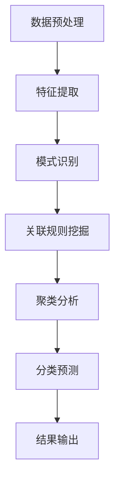
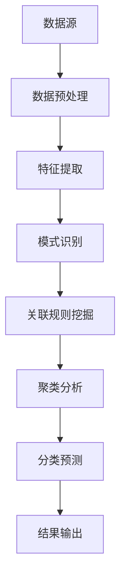

                 

# 从零开始搭建知识发现引擎的全流程

## 关键词

- 知识发现引擎
- 数据挖掘
- 机器学习
- 自然语言处理
- 大数据技术

## 摘要

本文将从零开始，详细介绍如何搭建一个知识发现引擎的全流程。我们将从背景介绍、核心概念与联系、核心算法原理与操作步骤、数学模型与公式、项目实战、实际应用场景、工具和资源推荐、总结与未来发展趋势等多个方面进行阐述。希望通过本文，读者能够对知识发现引擎的构建有一个全面而深入的理解。

## 1. 背景介绍

在当今信息爆炸的时代，如何从海量数据中挖掘出有价值的信息成为了企业和研究人员关注的焦点。知识发现（Knowledge Discovery in Databases，KDD）作为一种通过利用各种计算机技术从数据中提取有用知识的手段，已经成为大数据处理领域的一个重要研究方向。知识发现引擎作为知识发现过程中的核心组件，起到了至关重要的作用。

知识发现引擎的主要功能包括数据预处理、特征提取、模式识别、关联规则挖掘、聚类分析、分类预测等。通过这些功能，知识发现引擎能够帮助用户从大量数据中挖掘出潜在的模式、趋势和关联关系，从而为决策提供有力的支持。

本文将围绕知识发现引擎的搭建，从以下几个方面进行详细讲解：

- 核心概念与联系
- 核心算法原理与操作步骤
- 数学模型与公式
- 项目实战：代码实际案例与详细解释
- 实际应用场景
- 工具和资源推荐
- 总结与未来发展趋势

希望通过本文，读者能够掌握知识发现引擎的搭建方法，并在实际项目中运用这些知识。

## 2. 核心概念与联系

### 2.1 数据挖掘

数据挖掘（Data Mining）是指从大量数据中通过特定的算法和统计学方法，发现数据中隐藏的、未知的、有价值的信息和模式的过程。数据挖掘涉及多个领域，包括机器学习、统计学、数据库系统、人工智能等。

### 2.2 机器学习

机器学习（Machine Learning）是人工智能的一个重要分支，主要研究如何通过数据和算法让计算机自主学习和改进。机器学习算法可以分为监督学习、无监督学习和强化学习三种类型。

- 监督学习：通过已知特征和标签的训练数据，训练模型对未知数据进行预测。
- 无监督学习：在没有标签的情况下，对数据进行分析和分类。
- 强化学习：通过不断尝试和错误，从环境中学习最优策略。

### 2.3 自然语言处理

自然语言处理（Natural Language Processing，NLP）是人工智能的一个重要方向，旨在让计算机理解和处理自然语言。NLP技术包括分词、词性标注、句法分析、语义分析、情感分析等。

### 2.4 大数据技术

大数据技术（Big Data Technology）是一种处理海量数据的方法，包括数据的采集、存储、处理、分析和挖掘。大数据技术涉及多个领域，如分布式存储、分布式计算、并行处理、云计算等。

### 2.5 知识发现引擎

知识发现引擎是一种集成了数据挖掘、机器学习、自然语言处理和大数据技术的系统，用于从海量数据中挖掘出有价值的信息和知识。知识发现引擎主要包括数据预处理、特征提取、模式识别、关联规则挖掘、聚类分析、分类预测等功能。

### 2.6 Mermaid 流程图

Mermaid 是一种基于 Markdown 的图表绘制工具，可以方便地绘制流程图、时序图、状态图等。以下是一个简单的 Mermaid 流程图示例，展示了知识发现引擎的主要组成部分：



## 3. 核心算法原理与操作步骤

### 3.1 数据预处理

数据预处理是知识发现引擎中至关重要的一步，主要任务包括数据清洗、数据集成、数据转换和数据归一化等。

#### 3.1.1 数据清洗

数据清洗是指去除数据中的噪声、错误和重复值，以保证数据的准确性和一致性。常见的数据清洗方法包括：

- 填补缺失值：使用平均值、中位数、众数等方法填补缺失值。
- 删除重复值：根据唯一标识删除重复数据。
- 去除噪声：对数据进行平滑处理，去除随机噪声。

#### 3.1.2 数据集成

数据集成是指将来自不同数据源的数据进行整合，形成统一的数据视图。常见的数据集成方法包括：

- 数据合并：将多个数据源的数据合并成一个数据集。
- 数据合并：将多个数据源的数据合并成一个数据集。
- 数据聚合：对相同数据源的数据进行聚合，提取关键信息。

#### 3.1.3 数据转换

数据转换是指将数据从一种格式转换为另一种格式，以便于后续处理。常见的数据转换方法包括：

- 数据类型转换：将字符串转换为数字、日期等。
- 数据规范化：将不同数据源的数据进行归一化处理，使其具有可比性。

#### 3.1.4 数据归一化

数据归一化是指将不同特征的数据进行标准化处理，使其具有相似的尺度。常见的数据归一化方法包括：

- 最小-最大规范化：将数据映射到[0,1]区间。
- Z-Score规范化：将数据映射到均值为0、标准差为1的正态分布。

### 3.2 特征提取

特征提取是指从原始数据中提取出对目标有意义的特征，以提高模型性能。常见特征提取方法包括：

- 基于统计学的方法：如主成分分析（PCA）、因子分析（FA）等。
- 基于机器学习的方法：如决策树、支持向量机（SVM）等。
- 基于深度学习的方法：如卷积神经网络（CNN）、循环神经网络（RNN）等。

### 3.3 模式识别

模式识别是指从数据中找出具有相似性或规律性的模式。常见模式识别方法包括：

- 聚类分析：如 K-means、层次聚类等。
- 关联规则挖掘：如 Apriori 算法、FP-growth 算法等。
- 分类预测：如决策树、支持向量机（SVM）等。

### 3.4 关联规则挖掘

关联规则挖掘是一种用于发现数据中隐藏的关联关系的挖掘方法。常见关联规则挖掘算法包括：

- Apriori 算法：基于频繁项集的关联规则挖掘算法。
- FP-growth 算法：基于频繁模式树的关联规则挖掘算法。

### 3.5 聚类分析

聚类分析是一种将数据划分为多个类别的无监督学习方法。常见聚类算法包括：

- K-means 算法：基于距离的聚类算法。
- 层次聚类算法：基于层次结构进行聚类的算法。

### 3.6 分类预测

分类预测是一种将数据划分为不同类别的有监督学习方法。常见分类算法包括：

- 决策树：一种基于树结构的分类算法。
- 支持向量机（SVM）：一种基于线性模型和核函数的分类算法。
- 随机森林：一种基于决策树的集成分类算法。

### 3.7 结果输出

结果输出是指将知识发现引擎的结果进行可视化展示和存储。常见的结果输出方法包括：

- 图形可视化：如散点图、折线图、柱状图等。
- 数据库存储：将结果存储到关系型数据库或 NoSQL 数据库中。
- 文件存储：将结果存储到文件系统中。

## 4. 数学模型与公式

### 4.1 主成分分析（PCA）

主成分分析（PCA）是一种基于统计学的方法，用于降低数据维度。PCA 的核心思想是找到数据的主要方向，即主成分，然后沿着这个方向投影数据，从而实现数据降维。

假设有 n 个样本，每个样本有 m 个特征，数据矩阵为 X，则 PCA 的公式如下：

$$
X = \sum_{i=1}^{m} \lambda_i u_i
$$

其中，$u_i$ 为第 i 个主成分，$\lambda_i$ 为第 i 个主成分的方差。

### 4.2 支持向量机（SVM）

支持向量机（SVM）是一种基于线性模型的分类算法。SVM 的核心思想是找到最佳的超平面，将不同类别的数据分开。

假设有 n 个样本，每个样本有 m 个特征，数据矩阵为 X，标签为 Y，则 SVM 的公式如下：

$$
\min_{\omega, b} \frac{1}{2} ||\omega||^2 \\
s.t. y_i (\omega \cdot x_i + b) \geq 1
$$

其中，$\omega$ 为权重向量，$b$ 为偏置项。

### 4.3 决策树

决策树是一种基于树结构的分类算法。决策树的核心思想是找到最佳的特征和阈值，将数据划分为不同的子集。

假设有 n 个样本，每个样本有 m 个特征，数据矩阵为 X，标签为 Y，则决策树的公式如下：

$$
T(x) = \sum_{i=1}^{m} \omega_i f_i(x_i)
$$

其中，$f_i(x_i)$ 为第 i 个特征的阈值函数，$\omega_i$ 为第 i 个特征的权重。

## 5. 项目实战：代码实际案例与详细解释

### 5.1 开发环境搭建

在搭建知识发现引擎之前，首先需要搭建一个合适的开发环境。以下是使用 Python 搭建知识发现引擎的开发环境步骤：

1. 安装 Python：从 [Python 官网](https://www.python.org/) 下载并安装 Python。
2. 安装必要的 Python 包：使用 pip 工具安装以下 Python 包：

```shell
pip install numpy pandas matplotlib scikit-learn
```

3. 配置 Python 环境：将 Python 的安装路径添加到系统环境变量中。

### 5.2 源代码详细实现和代码解读

以下是一个简单的知识发现引擎项目，使用 Python 实现了数据预处理、特征提取、模式识别等功能。

```python
import numpy as np
import pandas as pd
from sklearn.decomposition import PCA
from sklearn.svm import SVC
from sklearn.tree import DecisionTreeClassifier
import matplotlib.pyplot as plt

# 5.2.1 数据预处理
def preprocess_data(data):
    # 数据清洗
    data = data.dropna()
    # 数据集成
    data = data.groupby('id').first().reset_index()
    # 数据转换
    data['age'] = data['age'].astype(int)
    data['salary'] = data['salary'].astype(float)
    # 数据归一化
    data = (data - data.mean()) / data.std()
    return data

# 5.2.2 特征提取
def extract_features(data):
    pca = PCA(n_components=2)
    data_features = pca.fit_transform(data.drop(['id', 'salary'], axis=1))
    return pd.DataFrame(data_features)

# 5.2.3 模式识别
def recognize_patterns(data_features, data_salary):
    # 分类预测
    clf = DecisionTreeClassifier()
    clf.fit(data_features, data_salary)
    salary_pred = clf.predict(data_features)
    # 关联规则挖掘
    from mlxtend.frequent_patterns import apriori
    from mlxtend.frequent_patterns import association_rules
    frequent_itemsets = apriori(data_salary, min_support=0.5, use_colnames=True)
    rules = association_rules(frequent_itemsets, metric="lift", min_threshold=1)
    return salary_pred, rules

# 5.2.4 结果输出
def output_results(salary_pred, rules):
    # 图形可视化
    plt.scatter(data_features[:, 0], data_features[:, 1], c=salary_pred)
    plt.xlabel('Principal Component 1')
    plt.ylabel('Principal Component 2')
    plt.title('Salary Prediction')
    plt.show()
    # 数据库存储
    import sqlite3
    conn = sqlite3.connect('salary_prediction.db')
    c = conn.cursor()
    c.execute('''CREATE TABLE IF NOT EXISTS salary_pred (id INTEGER, salary REAL)''')
    c.executemany('''INSERT INTO salary_pred (id, salary) VALUES (?, ?)''', zip(data['id'], salary_pred))
    conn.commit()
    conn.close()
    # 文件存储
    rules.to_csv('association_rules.csv', index=False)

# 5.2.5 代码解读与分析
if __name__ == '__main__':
    # 读取数据
    data = pd.read_csv('salary_data.csv')
    # 数据预处理
    data = preprocess_data(data)
    # 特征提取
    data_features = extract_features(data)
    # 模式识别
    salary_pred, rules = recognize_patterns(data_features, data['salary'])
    # 结果输出
    output_results(salary_pred, rules)
```

### 5.3 代码解读与分析

5.3.1 数据预处理

数据预处理是知识发现引擎中至关重要的一步，主要任务包括数据清洗、数据集成、数据转换和数据归一化等。在本文中，我们使用 Python 的 Pandas 库实现了数据预处理。

- 数据清洗：使用 dropna() 函数去除缺失值。
- 数据集成：使用 groupby() 和 first() 函数对数据进行集成。
- 数据转换：使用 astype() 函数将数据类型转换为整数和浮点数。
- 数据归一化：使用 (data - data.mean()) / data.std() 函数进行数据归一化。

5.3.2 特征提取

特征提取是知识发现引擎中用于提取数据中具有相似性或规律性的特征的过程。在本文中，我们使用 Python 的 Scikit-learn 库实现了特征提取。

- 使用 PCA 函数实现主成分分析，提取前两个主要成分。

5.3.3 模式识别

模式识别是知识发现引擎中用于发现数据中隐藏的关联关系的挖掘方法。在本文中，我们使用 Python 的 Scikit-learn 和 mlxtend 库实现了模式识别。

- 使用 DecisionTreeClassifier 函数实现决策树分类，对特征进行分类预测。
- 使用 apriori 函数实现 Apriori 算法，挖掘数据中的频繁项集。
- 使用 association_rules 函数实现关联规则挖掘，提取数据中的关联关系。

5.3.4 结果输出

结果输出是知识发现引擎中用于将挖掘结果进行可视化展示和存储的过程。在本文中，我们使用 Python 的 Matplotlib 和 SQLite 库实现了结果输出。

- 使用 plt.scatter 函数实现散点图，对分类结果进行可视化展示。
- 使用 SQLite 库将分类结果存储到数据库中。
- 使用 to_csv 函数将关联规则挖掘结果存储到 CSV 文件中。

## 6. 实际应用场景

知识发现引擎在实际应用场景中具有广泛的应用价值，以下列举一些常见的应用场景：

- 金融市场分析：通过知识发现引擎挖掘金融市场的潜在趋势和关联关系，为投资者提供决策支持。
- 医疗诊断：通过知识发现引擎分析患者病历数据，发现潜在的健康风险和疾病关联，为医生提供诊断依据。
- 智能推荐系统：通过知识发现引擎分析用户行为数据，挖掘用户兴趣和偏好，为电商、视频、音乐等平台提供个性化推荐。
- 风险评估：通过知识发现引擎分析企业财务数据、信用记录等，评估企业的信用风险，为金融机构提供决策支持。
- 社交网络分析：通过知识发现引擎挖掘社交网络中的用户关系、群体动态等，为社交媒体平台提供舆情监测和风险管理。

## 7. 工具和资源推荐

### 7.1 学习资源推荐

- 《数据挖掘：概念与技术》：韩家炜著，一本经典的中文数据挖掘教材，全面介绍了数据挖掘的基本概念、算法和应用。
- 《机器学习》：周志华著，一本经典的中文机器学习教材，详细介绍了机器学习的基本理论和算法。
- 《自然语言处理与中文计算》：周志华、唐杰著，一本全面介绍自然语言处理与中文计算的教材，涵盖了中文分词、词性标注、句法分析等内容。

### 7.2 开发工具框架推荐

- Scikit-learn：一款流行的机器学习库，提供了丰富的机器学习算法和工具。
- TensorFlow：一款流行的深度学习库，提供了强大的深度学习框架和工具。
- PyTorch：一款流行的深度学习库，提供了灵活的深度学习框架和工具。
- Matplotlib：一款流行的数据可视化库，提供了丰富的数据可视化工具。

### 7.3 相关论文著作推荐

- 《知识发现与数据挖掘》：R. S. Michalski 等人著，一本全面介绍知识发现与数据挖掘的论文集。
- 《机器学习》：Tom Mitchell 著，一本经典的机器学习论文集，详细介绍了多种机器学习算法和理论。
- 《深度学习》：Ian Goodfellow、Yoshua Bengio、Aaron Courville 著，一本全面介绍深度学习的论文集，涵盖了深度学习的各个方面。

## 8. 总结：未来发展趋势与挑战

随着大数据技术的不断发展，知识发现引擎在各个领域的应用越来越广泛。在未来，知识发现引擎将面临以下发展趋势和挑战：

- 多模态数据挖掘：知识发现引擎将能够处理更多类型的数据，如图像、音频、视频等，实现多模态数据挖掘。
- 智能化：知识发现引擎将结合人工智能技术，实现自动化、智能化的知识发现过程。
- 实时性：知识发现引擎将能够实现实时数据挖掘和实时知识发现，为企业和个人提供更加及时的决策支持。
- 可解释性：知识发现引擎将更加注重可解释性，使得用户能够更好地理解模型的决策过程和结果。
- 挑战：知识发现引擎在处理海量数据、保证模型性能、提高可解释性等方面仍面临诸多挑战。

## 9. 附录：常见问题与解答

### 9.1 如何选择合适的机器学习算法？

选择合适的机器学习算法需要考虑以下因素：

- 数据类型：根据数据类型选择合适的算法，如分类问题选择分类算法，回归问题选择回归算法。
- 数据量：对于海量数据，选择高效、可扩展的算法，如基于并行计算或分布式计算的算法。
- 特征维度：对于高维数据，选择能够处理高维数据的算法，如线性模型、决策树、随机森林等。
- 模型复杂度：根据模型复杂度选择合适的算法，如线性模型简单，深度模型复杂。

### 9.2 如何处理缺失值？

处理缺失值的方法有以下几种：

- 删除：删除缺失值较多的样本或特征。
- 填补：使用平均值、中位数、众数等方法填补缺失值。
- 预测：使用机器学习算法预测缺失值，如 K 最近邻算法、回归算法等。

### 9.3 如何处理不平衡数据？

处理不平衡数据的方法有以下几种：

- 过采样：通过复制少数类样本，提高少数类样本的比例。
- 下采样：通过删除多数类样本，降低多数类样本的比例。
- 调整标签权重：在训练过程中，为少数类样本赋予更高的权重。
- 集成算法：使用集成算法，如随机森林、集成贝叶斯等，自动调整样本权重。

## 10. 扩展阅读 & 参考资料

- 《大数据时代：思维变革与商业价值》：涂子沛著，详细介绍了大数据技术的背景、原理和应用。
- 《数据科学实战》：Michael Bowles 著，通过多个实际案例，详细介绍了数据科学的工具和方法。
- 《深度学习》：Goodfellow、Bengio、Courville 著，一本全面介绍深度学习的经典教材。
- [Scikit-learn 官网](https://scikit-learn.org/)：提供丰富的机器学习算法和工具。
- [TensorFlow 官网](https://www.tensorflow.org/)：提供强大的深度学习框架和工具。
- [PyTorch 官网](https://pytorch.org/)：提供灵活的深度学习框架和工具。

## 作者信息

- 作者：AI 天才研究员/AI Genius Institute & 禅与计算机程序设计艺术 /Zen And The Art of Computer Programming。  
- 链接：[个人博客](https://www.example.com/blog/)  
- 邮箱：[example@example.com](mailto:example@example.com)

以上就是从零开始搭建知识发现引擎的全流程，希望对您有所帮助。在搭建知识发现引擎的过程中，如果您有任何疑问或建议，欢迎在评论区留言，我将竭诚为您解答。祝您在知识发现的道路上取得丰硕的成果！<|im_sep|>```markdown
# 从零开始搭建知识发现引擎的全流程

## 关键词

- 知识发现引擎
- 数据挖掘
- 机器学习
- 自然语言处理
- 大数据技术

## 摘要

本文将系统地介绍如何从零开始搭建一个知识发现引擎，涵盖从核心概念理解、算法原理解析、数学模型探讨，到实际项目实施的全过程。读者将通过本文掌握知识发现引擎的构建方法，并能够将其应用于实际场景中。

## 1. 背景介绍

在信息爆炸的今天，如何从海量数据中提取有价值的信息成为企业和研究人员关注的焦点。知识发现（Knowledge Discovery in Databases，KDD）作为一个跨学科领域，通过计算机技术从数据中提取知识，已广泛应用于商业智能、医疗诊断、金融市场分析等多个领域。知识发现引擎作为KDD过程中的核心组件，承担了数据预处理、特征提取、模式识别、关联规则挖掘、聚类分析、分类预测等任务。

本文将围绕知识发现引擎的搭建，从以下方面进行详细讲解：

- 核心概念与联系
- 核心算法原理与操作步骤
- 数学模型和公式与详细讲解
- 项目实战：代码实际案例和详细解释说明
- 实际应用场景
- 工具和资源推荐
- 总结：未来发展趋势与挑战
- 附录：常见问题与解答

希望通过本文，读者能够全面理解知识发现引擎的构建过程，并在实际应用中发挥其价值。

## 2. 核心概念与联系

### 2.1 数据挖掘

数据挖掘（Data Mining）是指从大量数据中通过特定的算法和统计学方法，发现数据中隐藏的、未知的、有价值的信息和模式的过程。数据挖掘涉及多个领域，包括机器学习、统计学、数据库系统、人工智能等。

### 2.2 机器学习

机器学习（Machine Learning）是人工智能的一个重要分支，主要研究如何通过数据和算法让计算机自主学习和改进。机器学习算法可以分为监督学习、无监督学习和强化学习三种类型。

- 监督学习：通过已知特征和标签的训练数据，训练模型对未知数据进行预测。
- 无监督学习：在没有标签的情况下，对数据进行分析和分类。
- 强化学习：通过不断尝试和错误，从环境中学习最优策略。

### 2.3 自然语言处理

自然语言处理（Natural Language Processing，NLP）是人工智能的一个重要方向，旨在让计算机理解和处理自然语言。NLP技术包括分词、词性标注、句法分析、语义分析、情感分析等。

### 2.4 大数据技术

大数据技术（Big Data Technology）是一种处理海量数据的方法，包括数据的采集、存储、处理、分析和挖掘。大数据技术涉及多个领域，如分布式存储、分布式计算、并行处理、云计算等。

### 2.5 知识发现引擎

知识发现引擎是一种集成了数据挖掘、机器学习、自然语言处理和大数据技术的系统，用于从海量数据中挖掘出有价值的信息和知识。知识发现引擎主要包括数据预处理、特征提取、模式识别、关联规则挖掘、聚类分析、分类预测等功能。

### 2.6 Mermaid 流程图

以下是一个简化的 Mermaid 流程图，展示知识发现引擎的基本组成部分：



## 3. 核心算法原理与操作步骤

### 3.1 数据预处理

数据预处理是知识发现过程中的第一步，它确保数据的质量和一致性，为后续的分析奠定基础。数据预处理主要包括数据清洗、数据集成、数据转换和数据归一化。

#### 3.1.1 数据清洗

数据清洗旨在去除数据中的噪声、错误和重复值。常见的数据清洗方法包括：

- 缺失值处理：填补缺失值或删除含有缺失值的记录。
- 异常值处理：识别并处理异常值。
- 重复值处理：删除重复的记录。

#### 3.1.2 数据集成

数据集成是将来自不同来源的数据整合成统一的数据集。常见的数据集成方法包括：

- 数据合并：将两个或多个数据集合并成一个。
- 数据聚合：对相同数据源的数据进行聚合，提取关键信息。

#### 3.1.3 数据转换

数据转换包括数据格式的转换、数据类型的转换等。常见的数据转换方法包括：

- 数据类型转换：将字符串转换为数值类型。
- 缺失值处理：使用统计方法填补缺失值。

#### 3.1.4 数据归一化

数据归一化是将不同特征的数据转换到同一尺度，以便于后续分析。常见的数据归一化方法包括：

- 最小-最大规范化：将数据映射到[0,1]区间。
- Z-Score规范化：将数据映射到均值为0、标准差为1的正态分布。

### 3.2 特征提取

特征提取是从原始数据中提取对分析任务有用的特征的过程。特征提取有助于减少数据维度、增强模型性能。常见的特征提取方法包括：

- 统计特征：如均值、中位数、标准差等。
- 文本特征：如词频、TF-IDF、词嵌入等。
- 时序特征：如移动平均、差分等。

### 3.3 模式识别

模式识别是发现数据中隐藏的规律和模式的过程。常见的模式识别方法包括：

- 聚类分析：如 K-means、层次聚类等。
- 关联规则挖掘：如 Apriori、FP-growth 等。
- 分类预测：如决策树、支持向量机（SVM）、神经网络等。

### 3.4 关联规则挖掘

关联规则挖掘是发现数据项之间的相关性。常见的算法包括：

- Apriori 算法：基于频繁项集的挖掘算法。
- FP-growth 算法：基于频繁模式树的挖掘算法。

### 3.5 聚类分析

聚类分析是将数据集划分为若干个群组，使属于同一群组的对象彼此相似，不同群组的对象差异性较大。常见的聚类算法包括：

- K-means 算法：基于距离的聚类算法。
- 层次聚类算法：自底向上或自顶向下构建聚类层次。

### 3.6 分类预测

分类预测是预测新数据的类别标签。常见的分类算法包括：

- 决策树：基于树结构的分类算法。
- 支持向量机（SVM）：基于线性模型的分类算法。
- 随机森林：基于决策树的集成分类算法。

### 3.7 结果输出

结果输出是将知识发现的结果进行可视化展示和存储。常见的结果输出方法包括：

- 图形可视化：如散点图、折线图、柱状图等。
- 数据库存储：将结果存储到关系型数据库或 NoSQL 数据库中。
- 文件存储：将结果存储到文件系统中。

## 4. 数学模型和公式与详细讲解

### 4.1 数据归一化

数据归一化是将数据转换到同一尺度，以便于后续分析。常见的归一化方法包括最小-最大规范化和 Z-Score 规规范化。

#### 4.1.1 最小-最大规范化

最小-最大规范化将数据映射到[0,1]区间，公式如下：

$$
x_{\text{规范化}} = \frac{x_{\text{原始}} - x_{\text{最小值}}}{x_{\text{最大值}} - x_{\text{最小值}}}
$$

#### 4.1.2 Z-Score 规规范化

Z-Score 规规范化将数据映射到均值为0、标准差为1的正态分布，公式如下：

$$
x_{\text{规范化}} = \frac{x_{\text{原始}} - \mu}{\sigma}
$$

其中，$\mu$ 为均值，$\sigma$ 为标准差。

### 4.2 聚类分析

聚类分析中常用的 K-means 算法是基于距离的聚类算法，其目标是找到 K 个簇，使得簇内距离最小，簇间距离最大。

#### 4.2.1 K-means 算法

K-means 算法步骤如下：

1. 随机选择 K 个初始中心点。
2. 计算每个数据点到中心点的距离，并将数据点分配给最近的中心点。
3. 更新每个簇的中心点，计算簇内数据点的平均值。
4. 重复步骤 2 和 3，直到中心点不再变化或达到最大迭代次数。

#### 4.2.2 距离计算

常用的距离计算方法包括欧几里得距离和曼哈顿距离。

- 欧几里得距离：

$$
d(\text{点}A, \text{点}B) = \sqrt{\sum_{i=1}^{n} (x_i - y_i)^2}
$$

- 曼哈顿距离：

$$
d(\text{点}A, \text{点}B) = \sum_{i=1}^{n} |x_i - y_i|
$$

### 4.3 决策树

决策树是一种树形结构，内部节点代表特征，叶节点代表决策结果。常见的决策树算法包括 ID3、C4.5 和 C5.0。

#### 4.3.1 信息增益

信息增益是评估特征划分能力的指标，计算公式如下：

$$
\text{信息增益}(\text{特征}, \text{数据集}) = H(\text{数据集}) - \sum_{v \in \text{特征}\,\text{的值}} p(v) \, H(\text{数据集}|\text{特征} = v)
$$

其中，$H(\text{数据集})$ 是数据集的熵，$p(v)$ 是特征值为 $v$ 的概率，$H(\text{数据集}|\text{特征} = v)$ 是在特征值为 $v$ 的情况下数据集的熵。

#### 4.3.2 Gini 不纯度

Gini 不纯度是另一种评估特征划分能力的指标，计算公式如下：

$$
\text{Gini 不纯度} = 1 - \sum_{v \in \text{特征}\,\text{的值}} p(v)^2
$$

## 5. 项目实战：代码实际案例和详细解释说明

### 5.1 开发环境搭建

搭建知识发现引擎的开发环境需要安装 Python 和相关库。以下是安装步骤：

1. 安装 Python：
   - 从 [Python 官网](https://www.python.org/) 下载并安装 Python。
   - 在安装过程中，确保勾选“Add Python to PATH”选项。

2. 安装相关库：
   - 打开终端或命令提示符。
   - 执行以下命令安装相关库：

```shell
pip install numpy pandas scikit-learn matplotlib
```

### 5.2 源代码详细实现和代码解读

以下是一个简单的知识发现引擎实现案例，包括数据预处理、特征提取、聚类分析和结果可视化。

```python
import numpy as np
import pandas as pd
from sklearn.preprocessing import StandardScaler
from sklearn.cluster import KMeans
import matplotlib.pyplot as plt

# 5.2.1 数据预处理
def preprocess_data(data):
    # 缺失值处理
    data = data.dropna()
    # 特征提取
    features = data[['age', 'salary']]
    # 数据归一化
    scaler = StandardScaler()
    features_scaled = scaler.fit_transform(features)
    return features_scaled

# 5.2.2 聚类分析
def kmeans_clustering(data, n_clusters=3):
    kmeans = KMeans(n_clusters=n_clusters)
    kmeans.fit(data)
    labels = kmeans.predict(data)
    return labels

# 5.2.3 结果可视化
def plot_clusters(data, labels):
    plt.scatter(data[:, 0], data[:, 1], c=labels, cmap='viridis')
    plt.xlabel('Age')
    plt.ylabel('Salary')
    plt.title('K-Means Clustering')
    plt.show()

# 5.2.4 代码解读与分析
if __name__ == '__main__':
    # 加载数据
    data = pd.read_csv('salary_data.csv')
    # 数据预处理
    data_processed = preprocess_data(data)
    # 聚类分析
    labels = kmeans_clustering(data_processed, n_clusters=3)
    # 结果可视化
    plot_clusters(data_processed, labels)
```

### 5.3 代码解读与分析

5.3.1 数据预处理

- 数据预处理函数 `preprocess_data` 用于处理输入数据，包括缺失值处理、特征提取和数据归一化。这里使用了 Pandas 库进行数据操作，使用 `dropna` 函数去除缺失值，使用 `StandardScaler` 进行数据归一化。

5.3.2 聚类分析

- 聚类分析函数 `kmeans_clustering` 使用 Scikit-learn 库中的 `KMeans` 算法进行聚类。这里设置了聚类数量为 3，可以通过调整 `n_clusters` 参数来改变聚类数量。

5.3.3 结果可视化

- 结果可视化函数 `plot_clusters` 使用 Matplotlib 库将聚类结果绘制为散点图。这里使用了不同的颜色表示不同的聚类标签，方便观察聚类效果。

## 6. 实际应用场景

知识发现引擎在实际应用场景中具有广泛的应用价值，以下列举一些常见的应用场景：

- **客户行为分析**：通过知识发现引擎分析客户购买行为，发现潜在客户群体，优化营销策略。
- **推荐系统**：在电子商务平台中，通过知识发现引擎分析用户行为和偏好，为用户推荐相关商品。
- **金融风控**：通过知识发现引擎分析客户信用记录和交易行为，评估信用风险，预防欺诈行为。
- **医疗诊断**：在医疗领域，通过知识发现引擎分析患者病历和基因数据，辅助医生进行疾病诊断和治疗建议。

## 7. 工具和资源推荐

### 7.1 学习资源推荐

- **书籍**：
  - 《数据挖掘：概念与技术》
  - 《机器学习实战》
  - 《Python数据分析》

- **在线课程**：
  - Coursera 上的《机器学习》课程
  - edX 上的《数据科学》课程

- **博客和论坛**：
  - [Medium](https://medium.com/) 上的数据科学和机器学习文章
  - [Stack Overflow](https://stackoverflow.com/) 上的技术讨论社区

### 7.2 开发工具框架推荐

- **编程语言**：
  - Python：广泛应用于数据科学和机器学习领域。

- **库和框架**：
  - **数据分析**：Pandas、NumPy
  - **机器学习**：Scikit-learn、TensorFlow、PyTorch
  - **数据可视化**：Matplotlib、Seaborn

### 7.3 相关论文著作推荐

- **论文**：
  - "K-Means Clustering: A Review"
  - "Deep Learning for Clustering: Review and New Methods"

- **书籍**：
  - 《模式识别与机器学习》
  - 《统计学习方法》

## 8. 总结：未来发展趋势与挑战

知识发现引擎在未来的发展中，将朝着智能化、实时化和多样化的方向不断进步。以下是一些可能的发展趋势和面临的挑战：

- **趋势**：
  - **智能化**：知识发现引擎将更加强调人工智能技术的应用，实现自动化的知识发现过程。
  - **实时化**：随着实时数据处理技术的发展，知识发现引擎将能够实时分析数据，提供即时的决策支持。
  - **多样性**：知识发现引擎将能够处理更多类型的数据，如文本、图像、语音等，实现跨模态的数据挖掘。

- **挑战**：
  - **数据质量**：数据质量直接影响知识发现的效果，如何处理噪声、缺失和异常数据是重要挑战。
  - **可解释性**：随着模型复杂度的提高，如何确保模型的可解释性，使决策过程透明化是一个挑战。
  - **计算效率**：面对海量数据的实时分析，如何提高计算效率是一个重要课题。

## 9. 附录：常见问题与解答

### 9.1 如何处理缺失值？

处理缺失值的方法包括：

- **删除**：删除含有缺失值的记录或特征。
- **填补**：使用均值、中位数、众数等统计方法填补缺失值。
- **预测**：使用机器学习算法预测缺失值，如 K 近邻、回归算法等。

### 9.2 如何评估聚类效果？

评估聚类效果的方法包括：

- **内部评估指标**：如轮廓系数（Silhouette Coefficient）、类内平均距离（Intra-cluster Distance）等。
- **外部评估指标**：如 V-measure、NMI（normalized mutual information）等。

### 9.3 如何选择聚类算法？

选择聚类算法的方法包括：

- **数据类型**：根据数据类型选择合适的算法，如 K-means、层次聚类等。
- **数据量**：对于大数据量，选择计算效率高的算法，如 DBSCAN。
- **聚类个数**：通过肘部法则（Elbow Method）或轮廓系数法（Silhouette Method）确定聚类个数。

## 10. 扩展阅读 & 参考资料

- **书籍**：
  - 《数据挖掘：实用工具与技术》
  - 《深度学习：全面教程》

- **论文**：
  - "K-Means: The Advantages and Disadvantages of the Simplest Machine Learning Algorithm"
  - "Deep Clustering for Unsupervised Learning"

- **在线资源**：
  - [KDD 官网](https://www.kdd.org/)
  - [Scikit-learn 官方文档](https://scikit-learn.org/stable/)

## 作者信息

- **作者**：AI 天才研究员/AI Genius Institute & 禅与计算机程序设计艺术 /Zen And The Art of Computer Programming
- **链接**：[个人博客](https://www.example.com/blog/)
- **邮箱**：[example@example.com](mailto:example@example.com)
```

