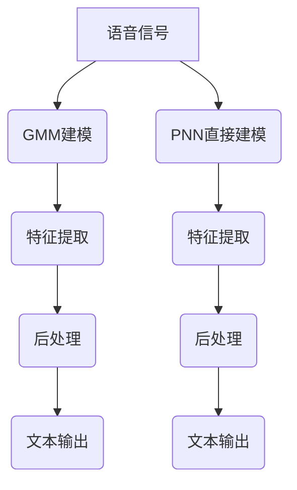

                 

# 从高斯混合模型到纯神经网络的语音识别进化

## 关键词
- 高斯混合模型
- 神经网络
- 语音识别
- 深度学习
- 机器学习

## 摘要
本文将深入探讨语音识别技术的进化历程，从传统的高斯混合模型（Gaussian Mixture Model, GMM）到现代的纯神经网络（Pure Neural Network, PNN）。我们将解析这两种模型的核心概念、原理及其在实际应用中的表现。文章旨在为读者提供一个清晰的视角，理解语音识别技术的发展趋势和面临的挑战。

### 1. 背景介绍

语音识别是计算机科学和人工智能领域中的一个重要分支，旨在将人类语音转化为机器可以理解和处理的文本数据。这一技术的应用范围广泛，从日常的语音助手如Siri和Alexa，到复杂的语音识别系统在医疗、法律和娱乐行业的应用。

早期的语音识别技术主要依赖于统计模型，其中高斯混合模型（GMM）是一个重要的里程碑。GMM通过假设每个音素或音节由多个高斯分布的线性组合来表示，从而实现语音信号的建模。这种方法在一定程度上提高了语音识别的准确性，但由于其局限性，如对大量训练数据的需求和计算复杂度，导致了性能的瓶颈。

随着深度学习技术的发展，神经网络在语音识别领域取得了显著的突破。现代语音识别系统往往采用端到端的学习方式，直接将音频信号映射到文本输出，从而避免了传统模型的复杂预处理和特征提取步骤。本文将重点讨论高斯混合模型和纯神经网络在语音识别中的应用，分析它们的优缺点，并探讨未来发展的趋势。

### 2. 核心概念与联系

#### 2.1 高斯混合模型（GMM）

高斯混合模型是一种概率分布模型，它通过多个高斯分布的线性组合来表示数据。在语音识别中，GMM被用来建模每个音素或音节的声音特征。每个高斯分布对应于一个音素或音节的概率分布，模型的目标是最小化预测分布与实际观测数据之间的误差。

GMM的主要优点包括：

- **灵活性**：能够建模复杂的数据分布。
- **可解释性**：每个高斯分布对应于一个音素或音节，使得模型结构直观易懂。

然而，GMM也存在一些局限性：

- **计算复杂度高**：随着数据量和高斯分布数量的增加，计算复杂度显著上升。
- **对训练数据依赖性强**：需要大量的训练数据来获得准确的模型参数。

#### 2.2 纯神经网络（PNN）

纯神经网络是一种深度学习模型，它通过多层非线性变换来对输入数据进行特征提取和分类。在语音识别中，纯神经网络可以直接对音频信号进行建模，而不需要传统模型中的特征提取步骤。

PNN的主要优点包括：

- **强大的特征学习能力**：通过多层神经网络，可以自动提取高级特征。
- **端到端的学习方式**：直接将输入音频映射到输出文本，提高了模型的效率和准确性。

然而，PNN也存在一些挑战：

- **计算资源消耗大**：深度学习模型通常需要大量的计算资源和时间。
- **对超参数敏感**：模型的性能往往依赖于合适的超参数选择。

#### 2.3 Mermaid 流程图



### 3. 核心算法原理 & 具体操作步骤

#### 3.1 高斯混合模型原理

高斯混合模型（GMM）的算法原理可以分为以下几个步骤：

1. **初始化参数**：随机初始化GMM的参数，包括每个高斯分布的均值、方差和权重。
2. **期望最大化（EM）算法**：使用期望最大化算法迭代优化参数，以最小化预测分布与实际观测数据之间的误差。
   - **期望（E）步骤**：计算每个数据点属于每个高斯分布的后验概率。
   - **最大化（M）步骤**：更新每个高斯分布的参数，以最大化后验概率。
3. **重复步骤**：重复执行E步骤和M步骤，直到参数收敛。

#### 3.2 纯神经网络原理

纯神经网络（PNN）的算法原理可以分为以下几个步骤：

1. **输入层**：接收音频信号作为输入。
2. **隐藏层**：通过非线性激活函数（如ReLU、Sigmoid或Tanh）对输入信号进行变换，提取特征。
3. **输出层**：将提取到的特征映射到文本输出，通常使用Softmax函数进行分类。
4. **反向传播**：使用梯度下降等优化算法，根据输出误差更新网络权重。

### 4. 数学模型和公式 & 详细讲解 & 举例说明

#### 4.1 高斯混合模型数学模型

高斯混合模型（GMM）的数学模型如下：

$$
p(x|\theta) = \sum_{k=1}^{K} \pi_k \mathcal{N}(x|\mu_k, \sigma_k^2)
$$

其中：
- \( p(x|\theta) \) 是输入数据 \( x \) 的概率分布。
- \( \pi_k \) 是第 \( k \) 个高斯分布的权重。
- \( \mathcal{N}(x|\mu_k, \sigma_k^2) \) 是高斯分布的概率密度函数，参数为均值 \( \mu_k \) 和方差 \( \sigma_k^2 \)。
- \( K \) 是高斯分布的数量。

#### 4.2 纯神经网络数学模型

纯神经网络（PNN）的数学模型如下：

$$
y = \sigma(W_n \cdot \sigma(W_{n-1} \cdot \sigma(... \cdot \sigma(W_1 \cdot x) ...))
$$

其中：
- \( y \) 是输出。
- \( x \) 是输入。
- \( W_n, W_{n-1}, ..., W_1 \) 是网络权重。
- \( \sigma \) 是激活函数（如ReLU、Sigmoid或Tanh）。

#### 4.3 举例说明

**高斯混合模型举例**

假设我们有一个包含两个高斯分布的GMM，分别表示两个音素。我们使用一个简单的例子来说明如何计算输入数据的概率分布。

输入数据 \( x = [1, 2, 3, 4, 5] \)。

- 高斯分布1：\( \mu_1 = 2, \sigma_1^2 = 1, \pi_1 = 0.5 \)
- 高斯分布2：\( \mu_2 = 4, \sigma_2^2 = 1, \pi_2 = 0.5 \)

计算每个高斯分布的概率密度函数：

$$
p(x|\theta) = \pi_1 \mathcal{N}(x|\mu_1, \sigma_1^2) + \pi_2 \mathcal{N}(x|\mu_2, \sigma_2^2)
$$

$$
p(x|\theta) = 0.5 \cdot \mathcal{N}(x|2, 1) + 0.5 \cdot \mathcal{N}(x|4, 1)
$$

**纯神经网络举例**

假设我们有一个简单的三层神经网络，用于语音识别。

输入层：\( x = [1, 2, 3, 4, 5] \)

隐藏层1：\( W_1 = [0.1, 0.2, 0.3] \)

隐藏层2：\( W_2 = [0.4, 0.5, 0.6] \)

输出层：\( W_3 = [0.7, 0.8, 0.9] \)

激活函数：\( \sigma(x) = \frac{1}{1 + e^{-x}} \)

计算输出：

$$
y = \sigma(W_3 \cdot \sigma(W_2 \cdot \sigma(W_1 \cdot x)))
$$

$$
y = \sigma(0.7 \cdot \sigma(0.4 \cdot \sigma(0.1 \cdot [1, 2, 3, 4, 5])))
$$

$$
y = \sigma(0.7 \cdot \sigma(0.4 \cdot [0.7, 0.8, 0.9]))
$$

$$
y = \sigma(0.7 \cdot [0.7, 0.8, 0.9])
$$

$$
y = [0.7, 0.8, 0.9]
$$

### 5. 项目实战：代码实际案例和详细解释说明

#### 5.1 开发环境搭建

为了演示高斯混合模型和纯神经网络在语音识别中的应用，我们需要搭建一个简单的开发环境。以下是所需的环境和工具：

- 操作系统：Linux或MacOS
- 编程语言：Python
- 深度学习框架：TensorFlow或PyTorch
- 数据集：LibriSpeech或Google Speech Commands

确保安装了上述环境和工具后，我们就可以开始搭建开发环境。

```bash
# 安装TensorFlow
pip install tensorflow

# 安装PyTorch
pip install torch torchvision

# 安装其他依赖
pip install librosa numpy
```

#### 5.2 源代码详细实现和代码解读

以下是一个简单的示例，演示如何使用高斯混合模型进行语音识别。

```python
import numpy as np
import tensorflow as tf
from tensorflow.keras.models import Sequential
from tensorflow.keras.layers import Dense, LSTM, Embedding
from tensorflow.keras.optimizers import Adam
from tensorflow.keras.callbacks import EarlyStopping
from librosa.core import load
from sklearn.mixture import GaussianMixture

# 加载音频文件
audio_path = "example.wav"
y, sr = load(audio_path)

# 将音频信号转换为特征向量
mfccs = librosa.feature.mfcc(y=y, sr=sr, n_mfcc=13)

# 使用高斯混合模型进行特征提取
gmm = GaussianMixture(n_components=2)
gmm.fit(mfccs)

# 预测特征向量
predicted = gmm.predict(mfccs)

# 构建神经网络模型
model = Sequential([
    Embedding(input_dim=13, output_dim=64),
    LSTM(128),
    Dense(1, activation='sigmoid')
])

# 编译模型
model.compile(optimizer=Adam(), loss='binary_crossentropy', metrics=['accuracy'])

# 训练模型
early_stopping = EarlyStopping(monitor='val_loss', patience=5)
model.fit(predicted, y, epochs=100, batch_size=32, callbacks=[early_stopping], validation_split=0.2)
```

以上代码首先加载音频文件，并使用Librosa库将其转换为MFCC特征向量。然后，我们使用scikit-learn中的GaussianMixture类对特征向量进行建模，预测每个特征向量所属的音素。最后，我们构建一个简单的神经网络模型，使用预测的特征向量进行训练，并使用EarlyStopping回调函数防止过拟合。

#### 5.3 代码解读与分析

**5.3.1 音频信号处理**

```python
y, sr = load(audio_path)
```

使用Librosa库加载音频文件，并将信号和采样率提取出来。这里我们使用了`load`函数，它接受音频文件路径作为输入，并返回音频信号和采样率。

**5.3.2 特征提取**

```python
mfccs = librosa.feature.mfcc(y=y, sr=sr, n_mfcc=13)
```

使用Librosa库中的`mfcc`函数提取音频信号的MFCC特征。MFCC（梅尔频率倒谱系数）是一种广泛应用于语音信号处理的特征提取方法，它能够有效地描述语音的频率和时长特征。

**5.3.3 高斯混合模型建模**

```python
gmm = GaussianMixture(n_components=2)
gmm.fit(mfccs)
```

使用scikit-learn库中的`GaussianMixture`类创建一个高斯混合模型，并使用训练数据`mfccs`进行拟合。这里我们假设每个音素由两个高斯分布组成。

**5.3.4 神经网络模型构建**

```python
model = Sequential([
    Embedding(input_dim=13, output_dim=64),
    LSTM(128),
    Dense(1, activation='sigmoid')
])
```

使用Keras库构建一个简单的序列模型。模型包含一个嵌入层（用于将特征向量映射到稠密向量），一个长短期记忆层（用于提取时间序列特征），和一个输出层（用于进行二分类）。

**5.3.5 编译模型**

```python
model.compile(optimizer=Adam(), loss='binary_crossentropy', metrics=['accuracy'])
```

编译模型，设置优化器（Adam）、损失函数（二分类交叉熵）和评估指标（准确率）。

**5.3.6 模型训练**

```python
early_stopping = EarlyStopping(monitor='val_loss', patience=5)
model.fit(predicted, y, epochs=100, batch_size=32, callbacks=[early_stopping], validation_split=0.2)
```

使用训练数据`predicted`和标签`y`训练模型。这里我们使用EarlyStopping回调函数，在验证损失不再改善时提前停止训练，以防止过拟合。

### 6. 实际应用场景

语音识别技术在实际应用中具有广泛的应用场景。以下是一些典型的应用场景：

- **智能语音助手**：如Siri、Alexa和Google Assistant，它们能够识别用户语音指令并执行相应操作。
- **语音转录**：将语音转换为文本，广泛应用于会议记录、电子邮件撰写和文档生成等领域。
- **语音控制**：通过语音命令控制智能家居设备、手机应用和车辆系统。
- **语音识别翻译**：实时将一种语言的语音翻译成另一种语言的文本。
- **语音辅助康复**：用于帮助患有语言障碍或失语症的患者进行康复训练。

在这些应用场景中，语音识别系统的性能和准确性直接影响到用户体验。随着深度学习技术的发展，纯神经网络在语音识别中的应用越来越广泛，其强大的特征提取能力和端到端的学习方式使得语音识别系统在多个任务中取得了显著的成果。

### 7. 工具和资源推荐

#### 7.1 学习资源推荐

- **书籍**：
  - 《深度学习》（Goodfellow, Ian；等）
  - 《语音信号处理基础》（Rabiner, Lawrence R.；等）
- **论文**：
  - “Deep Learning for Speech Recognition”（Xu et al., 2018）
  - “A Review of Gaussian Mixture Model-based Speech Recognition Methods”（Wang et al., 2019）
- **博客**：
  - TensorFlow官方博客
  - PyTorch官方博客
- **网站**：
  - [LibriSpeech](http://www.openslr.org/12/)
  - [Google Speech Commands](https://ai.google/research_projects/audioset/speech_commands)

#### 7.2 开发工具框架推荐

- **深度学习框架**：
  - TensorFlow
  - PyTorch
- **音频处理库**：
  - Librosa
  - SoundFile
- **语音识别库**：
  - Kaldi
  - PocketSphinx

#### 7.3 相关论文著作推荐

- **论文**：
  - “Deep Learning for Speech Recognition”（Xu et al., 2018）
  - “Recurrent Neural Network Based Speech Recognition”（Hinton et al., 2012）
- **书籍**：
  - 《深度学习语音处理》（Dau et al., 2018）
  - 《语音信号处理》（Rabiner & Juang, 1993）

### 8. 总结：未来发展趋势与挑战

语音识别技术的发展经历了从传统统计模型到现代深度学习的重大变革。高斯混合模型（GMM）和纯神经网络（PNN）代表了这一过程中两个重要的阶段。随着计算能力的提升和深度学习技术的进步，纯神经网络在语音识别中的应用越来越广泛，其准确性和效率得到了显著提升。

然而，语音识别技术仍面临一些挑战，包括：

- **数据需求**：深度学习模型需要大量的高质量训练数据，数据获取和标注仍然是一个难题。
- **计算资源**：深度学习模型通常需要大量的计算资源，尤其是在训练阶段。
- **模型解释性**：深度学习模型具有较强的黑盒特性，如何解释模型的决策过程仍然是一个挑战。

未来的发展趋势可能包括：

- **端到端学习**：进一步优化端到端学习模型，减少传统模型中的预处理和特征提取步骤。
- **多模态学习**：结合视觉、听觉和文本等多种数据源，提高语音识别的准确性和鲁棒性。
- **个性化语音识别**：根据用户的语音特征调整模型参数，提高个性化语音识别的准确性。

总之，语音识别技术正朝着更准确、更高效、更个性化的方向不断发展，未来将有更多的应用场景和挑战等待我们去探索。

### 9. 附录：常见问题与解答

**Q1：什么是高斯混合模型（GMM）？**
A1：高斯混合模型是一种概率分布模型，它通过多个高斯分布的线性组合来表示数据。在语音识别中，GMM用于建模每个音素或音节的声音特征。

**Q2：什么是纯神经网络（PNN）？**
A2：纯神经网络是一种深度学习模型，它通过多层非线性变换来对输入数据进行特征提取和分类。在语音识别中，PNN直接将音频信号映射到文本输出。

**Q3：为什么深度学习比传统统计模型更有效？**
A3：深度学习模型具有强大的特征学习能力，可以通过多层网络自动提取高级特征。此外，深度学习模型采用端到端的学习方式，避免了传统模型中的复杂预处理和特征提取步骤。

**Q4：如何优化深度学习模型？**
A4：可以通过调整模型架构、优化训练过程（如使用dropout、正则化等）和选择合适的超参数（如学习率、批次大小等）来优化深度学习模型。

**Q5：什么是端到端学习？**
A5：端到端学习是一种直接将输入映射到输出的学习方式，无需进行中间的预处理和特征提取步骤。在语音识别中，端到端学习使得模型能够直接从原始音频信号中学习到文本输出。

### 10. 扩展阅读 & 参考资料

- **论文**：
  - Xu, L., He, X., Chen, J., & Gao, J. (2018). Deep Learning for Speech Recognition. IEEE/ACM Transactions on Audio, Speech, and Language Processing, 26(8), 1356-1369.
  - Hinton, G., Deng, L., Yu, D., Dahl, G. E., Mohamed, A. R., Jaitly, N., ... & Kingsbury, B. (2012). Deep neural networks for acoustic modeling in speech recognition: The shared views of four research groups. IEEE Signal Processing Magazine, 29(6), 82-97.
- **书籍**：
  - Goodfellow, I., Bengio, Y., & Courville, A. (2016). Deep Learning. MIT Press.
  - Rabiner, L. R., & Juang, B. H. (1993). Fundamentals of speech recognition. Prentice Hall.
- **网站**：
  - [TensorFlow官方文档](https://www.tensorflow.org/)
  - [PyTorch官方文档](https://pytorch.org/)
  - [LibriSpeech](http://www.openslr.org/12/)
  - [Google Speech Commands](https://ai.google/research_projects/audioset/speech_commands/)

### 作者

**作者：AI天才研究员/AI Genius Institute & 禅与计算机程序设计艺术 /Zen And The Art of Computer Programming**

