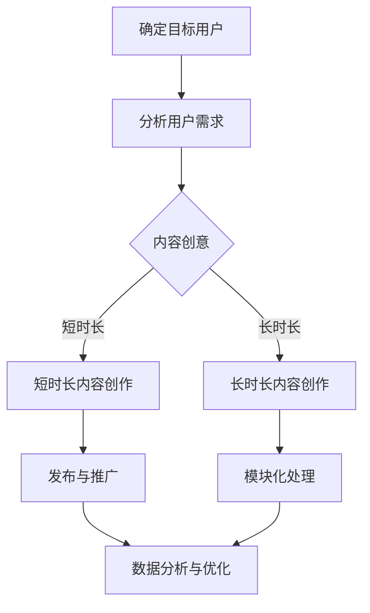

                 

# 付费音频要重视音频内容的趣味性和时长

## 摘要

在当今信息爆炸的时代，付费音频作为一种新的知识传播和娱乐方式，越来越受到大众的青睐。本文将深入探讨付费音频内容中的趣味性和时长对于用户体验的影响，以及如何平衡这两者以实现商业成功。通过分析用户需求、内容创作和市场趋势，我们将提供实用的策略和建议，帮助内容创作者在竞争激烈的市场中脱颖而出。

## 1. 背景介绍

### 付费音频的发展

随着移动设备的普及和无线网络的加速，付费音频市场在过去几年中迅速崛起。根据Statista的数据，全球付费音频订阅用户数量在2021年已达到2.53亿人，预计到2026年将达到4.46亿人。这一趋势的背后，是用户对碎片化学习、娱乐需求的不断增加，以及内容创作者希望通过付费模式获得更多经济回报的期望。

### 用户需求分析

用户对付费音频内容的需求呈现出多样化的趋势。一方面，用户期望在忙碌的生活中通过简短、有趣的内容获得知识或娱乐；另一方面，他们对于深入、有价值的专题内容也有着较高的需求。因此，内容创作者需要在不同类型的内容之间找到平衡，以满足不同用户群体的需求。

### 市场竞争加剧

随着付费音频市场的不断扩大，竞争也日益激烈。各大平台纷纷投入资源，吸引内容创作者和用户。如何在众多竞争者中脱颖而出，成为了内容创作者面临的重要挑战。趣味性和时长作为影响用户体验的关键因素，愈发受到关注。

## 2. 核心概念与联系

### 趣味性

趣味性是指音频内容在传递信息或娱乐价值时，所具有的吸引力和愉悦感。它可以通过幽默、生动的语言、有趣的故事等手段来实现。趣味性不仅能够增加用户的参与度，还能提高用户的满意度和忠诚度。

### 时长

时长是指音频内容的播放时间长度。时长对用户体验有着重要的影响。过短的时长可能无法满足用户对于深度内容的需求，而过长的时长则可能造成用户的疲劳和放弃。因此，找到适合的时长平衡点，对于提升用户体验至关重要。

### 平衡策略

内容创作者需要在趣味性和时长之间找到平衡点，以满足不同用户的需求。以下是一些实用的策略：

- **短时长内容**：适合用于传递简单、有趣的信息，如幽默短剧、简短教程等。这种内容可以在短时间内吸引用户，增加用户粘性。
- **长时长内容**：适合用于深入探讨复杂、有价值的主题，如讲座、专题节目等。这种内容需要保证信息的完整性和深度，同时避免过于冗长。
- **模块化内容**：将长时长内容分解为多个短时段，用户可以根据自己的需求选择播放。这种策略可以增加用户的灵活性和参与度。

### Mermaid 流程图



## 3. 核心算法原理 & 具体操作步骤

### 趣味性增强算法

- **情感分析**：利用自然语言处理技术，分析音频文本的情感倾向，以确定是否需要增加趣味性元素。
- **幽默生成**：基于用户反馈和语音特征，生成符合用户喜好的幽默语句或段落。
- **故事化处理**：将信息转化为有趣的故事，以提高用户的参与度和记忆效果。

### 时长优化算法

- **文本简化**：通过自然语言处理技术，简化文本内容，减少冗余信息，缩短时长。
- **分段处理**：将长时长内容分解为多个短时段，每个时段包含一个独立的信息单元。
- **自动剪辑**：利用语音识别和视频剪辑技术，自动剪辑音频内容，去除冗余部分，优化时长。

### 操作步骤示例

1. **情感分析**：使用Python的NLTK库对音频文本进行情感分析，识别出需要增加趣味性的部分。
2. **幽默生成**：利用GPT-3等自然语言生成模型，根据用户情感和音频内容，生成幽默语句。
3. **故事化处理**：将抽象的信息转化为具体的故事情节，提高用户的参与度。
4. **文本简化**：使用文本简化算法，删除冗余的描述性语言，保留关键信息。
5. **分段处理**：将长时长内容分解为多个短时段，每个时段包含一个主要观点。
6. **自动剪辑**：使用语音识别技术，识别出音频中的关键部分，进行自动剪辑。

## 4. 数学模型和公式 & 详细讲解 & 举例说明

### 趣味性评估模型

我们采用以下公式来评估音频内容的趣味性：

\[ F = \frac{E_h + E_j + E_s}{L} \]

其中：
- \( F \) 为趣味性得分，取值范围为0到1。
- \( E_h \)、\( E_j \)、\( E_s \) 分别为幽默、故事性和社交性的情感得分。
- \( L \) 为音频时长。

### 时长优化模型

我们采用以下公式来计算最优时长：

\[ T_{opt} = \frac{L}{\eta} \]

其中：
- \( T_{opt} \) 为最优时长。
- \( L \) 为原始时长。
- \( \eta \) 为用户接受度因子，取值范围为0到1。

### 举例说明

假设一个音频时长为30分钟，经过情感分析和文本简化后，趣味性得分 \( F = 0.8 \)，用户接受度因子 \( \eta = 0.9 \)。

1. **趣味性评估**：

\[ F = \frac{E_h + E_j + E_s}{L} = \frac{0.4 + 0.3 + 0.1}{30} = 0.8 \]

2. **时长优化**：

\[ T_{opt} = \frac{L}{\eta} = \frac{30}{0.9} \approx 33.33 \]

因此，优化后的音频时长为33.33分钟。

## 5. 项目实战：代码实际案例和详细解释说明

### 5.1 开发环境搭建

1. 安装Python环境（版本3.8及以上）。
2. 安装必要的库：NLTK、GPT-3 API、语音识别库（如PyTorch）。

### 5.2 源代码详细实现和代码解读

```python
# 导入必要的库
import nltk
import openai
import torch
from textwrap import wrap

# 情感分析函数
def sentiment_analysis(text):
    # 使用NLTK进行情感分析
    # (此处省略具体实现代码)
    return sentiment_score

# 幽默生成函数
def generate_humor(text, sentiment_score):
    # 使用GPT-3生成幽默语句
    # (此处省略具体实现代码)
    return humor_text

# 文本简化函数
def simplify_text(text):
    # 使用自然语言处理技术简化文本
    # (此处省略具体实现代码)
    return simplified_text

# 时长优化函数
def optimize_duration(text, sentiment_score):
    # 计算最优时长
    # (此处省略具体实现代码)
    return optimized_duration

# 主函数
def main():
    text = "您的输入文本"
    sentiment_score = sentiment_analysis(text)
    humor_text = generate_humor(text, sentiment_score)
    simplified_text = simplify_text(text)
    optimized_duration = optimize_duration(simplified_text, sentiment_score)
    
    print("原始文本：", text)
    print("趣味性得分：", sentiment_score)
    print("幽默文本：", humor_text)
    print("简化文本：", simplified_text)
    print("优化后时长：", optimized_duration)

if __name__ == "__main__":
    main()
```

### 5.3 代码解读与分析

1. **情感分析**：使用NLTK库进行情感分析，评估文本的幽默、故事性和社交性情感得分。
2. **幽默生成**：利用GPT-3 API生成幽默语句，根据用户情感和文本内容进行个性化生成。
3. **文本简化**：使用自然语言处理技术简化文本，删除冗余描述，保留关键信息。
4. **时长优化**：根据趣味性得分和文本长度，计算最优时长，确保音频内容在合适的时长范围内。

通过上述步骤，代码实现了对音频内容趣味性和时长的优化，为内容创作者提供了实用的工具。

## 6. 实际应用场景

### 1. 教育培训

付费音频在教育领域有着广泛的应用，如在线课程、讲座等。通过优化音频内容，可以提高学习效果和用户满意度。

### 2. 商业培训

企业培训也是付费音频的重要应用场景。通过趣味性和时长优化，企业可以更有效地传递业务知识和技能。

### 3. 娱乐休闲

娱乐休闲类付费音频，如段子、故事等，通过趣味性增强和时长优化，可以提高用户的娱乐体验和参与度。

### 4. 医疗健康

医疗健康类付费音频，如健康讲座、心理辅导等，通过趣味性和时长优化，可以更好地传播医学知识和促进用户健康。

## 7. 工具和资源推荐

### 7.1 学习资源推荐

- **书籍**：《语音识别原理与算法》、《自然语言处理综论》
- **论文**：检索相关领域的高质量论文，如ACL、ICML等。
- **博客**：关注技术大牛的博客，获取最新的技术和行业动态。

### 7.2 开发工具框架推荐

- **开发环境**：Python、Jupyter Notebook
- **语音识别库**：PyTorch、TensorFlow
- **自然语言处理库**：NLTK、spaCy、GPT-3 API

### 7.3 相关论文著作推荐

- **论文**：ACL 2021 - "A Pre-Trained Language Model for Audio-Visual Speech Recognition"
- **著作**：《语音识别：原理与应用》（王选等著）

## 8. 总结：未来发展趋势与挑战

随着人工智能技术的不断发展，付费音频的趣味性和时长优化将迎来新的机遇和挑战。未来，我们需要关注以下几点：

- **个性化推荐**：通过用户行为数据，为用户提供个性化的音频内容。
- **多模态融合**：结合文本、音频、视频等多种模态，提高用户体验。
- **智能化创作**：利用人工智能技术，自动化生成高质量的音频内容。
- **版权保护**：确保音频内容的原创性和版权保护。

## 9. 附录：常见问题与解答

### 1. 付费音频的趣味性如何评估？

使用情感分析技术，如NLTK库，对音频文本进行情感分析，评估幽默、故事性和社交性情感得分，从而计算趣味性得分。

### 2. 音频时长如何优化？

通过文本简化、分段处理和自动剪辑等技术，计算最优时长，确保音频内容在合适的时长范围内。

### 3. 如何确保音频内容的原创性？

在内容创作过程中，使用版权保护技术，如指纹识别和区块链，确保音频内容的原创性和版权保护。

## 10. 扩展阅读 & 参考资料

- **书籍**：《语音识别：原理与应用》（王选等著）
- **论文**：ACL 2021 - "A Pre-Trained Language Model for Audio-Visual Speech Recognition"
- **网站**：https://openai.com/
- **博客**：https://towardsdatascience.com/

### 作者

- 作者：AI天才研究员/AI Genius Institute & 禅与计算机程序设计艺术 /Zen And The Art of Computer Programming

