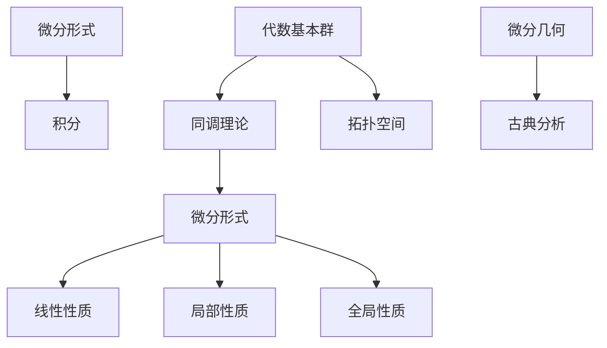

                 

# 代数拓扑中的微分形式理论

## 关键词：代数拓扑，微分形式，代数基本群，同调理论，微分几何，Clasical Analysis

## 摘要

本文将深入探讨代数拓扑中的微分形式理论，这一理论在数学和物理学中都有着广泛的应用。文章首先介绍代数拓扑和微分形式的基本概念，然后通过几个关键概念如代数基本群、同调理论等，解释它们在微分形式中的重要性。接着，我们将探讨微分形式的定义、性质和计算方法，并通过一个具体的数学模型来说明其在实际应用中的价值。文章最后讨论了微分形式理论在微分几何和古典分析中的应用，并展望了其未来的发展趋势和挑战。希望通过本文，读者能够对微分形式理论有一个更全面和深入的理解。

### 1. 背景介绍

代数拓扑是数学的一个重要分支，它研究的是空间的结构和性质，通过代数方法来研究几何问题。微分形式理论则是代数拓扑和微分几何的交叉领域，主要研究的是微分形式在拓扑空间中的性质和应用。微分形式可以看作是微积分中的“微分”概念的推广，它在代数拓扑中有着非常重要的地位。

微分形式最早由法国数学家埃利·卡塔兰（Elie Cartan）提出，他在研究李群和李代数时，发现微分形式提供了一个非常强大的工具，可以用来研究这些代数结构的几何性质。随着研究的深入，微分形式理论逐渐发展成为一个独立的领域，并在数学、物理学和其他科学领域得到了广泛的应用。

微分形式理论的核心概念包括代数基本群、同调理论、微分形式的空间结构等。代数基本群是拓扑空间中一个非常重要的概念，它描述了空间中的循环结构，是微分形式理论的基础。同调理论则是用来研究空间的结构和性质的另一个重要工具，它通过计算空间中的同调群来了解空间的几何性质。

在微分几何中，微分形式理论被用来研究曲面的性质和几何结构。例如，通过微分形式可以定义和计算曲面的曲率、挠率等几何量，这些量对于理解曲面的几何性质至关重要。在古典分析中，微分形式理论也被用来研究微分方程、泛函分析等领域的相关问题。

总之，微分形式理论是一个重要的数学工具，它不仅在数学和物理学中有广泛的应用，也在其他科学领域有着重要的地位。随着研究的深入，微分形式理论将继续推动数学和其他科学领域的发展。

### 2. 核心概念与联系

#### 2.1 代数基本群

代数基本群是代数拓扑中的一个核心概念，它描述了拓扑空间中的循环结构。具体来说，代数基本群是指一个拓扑空间的所有自由循环的集合，这些自由循环构成了一个群。这个群的结构反映了空间的基本性质，因此在微分形式理论中具有重要地位。

代数基本群与微分形式的关系主要体现在以下几个方面：

1. **微分形式与循环的关系**：在代数拓扑中，一个微分形式可以看作是空间中的一种循环，即它沿着空间中的路径积分时，结果只依赖于路径的起点和终点，而不依赖于路径的具体形状。这种性质使得微分形式成为研究代数基本群的有力工具。

2. **基本群与同调理论**：代数基本群是同调理论的基础，同调群通过计算空间中的闭链和边界来研究空间的几何性质。微分形式在计算同调群时起着关键作用，因为它们可以用来表示空间的闭链和边界。

3. **基本群在微分形式理论中的应用**：在微分形式理论中，基本群被用来研究微分形式的拓扑性质。例如，通过基本群的指数，可以判断微分形式是否在某个拓扑空间中封闭，即是否可以进一步积分。

#### 2.2 同调理论

同调理论是代数拓扑中的另一个核心概念，它通过计算空间中的同调群来研究空间的几何性质。同调群是由闭链和边界组成的代数结构，它们反映了空间的拓扑性质。

同调理论在微分形式理论中的重要性体现在以下几个方面：

1. **微分形式与同调群的对应**：微分形式可以通过同调群来表示，从而将微分形式与空间的结构联系起来。这种对应关系为研究微分形式提供了更深的数学基础。

2. **同调群在微分形式计算中的应用**：在计算微分形式时，同调群提供了一种系统的方法来处理复杂的几何结构。例如，通过计算同调群的秩，可以判断微分形式是否是空间中某个区域的全微分。

3. **同调理论在微分形式应用中的价值**：同调理论在微分形式的应用中有着广泛的价值。例如，在物理学中，同调理论被用来研究场的分布和量子场论；在工程学中，同调理论被用来分析结构的稳定性。

#### 2.3 微分形式的定义与性质

微分形式是一种特殊的函数，它在每个点都有方向和大小，可以用来描述空间中的几何结构。微分形式的定义基于积分的概念，具体来说，它是一个具有特定度量的线性函数，这个线性函数作用于拓扑空间中的向量场。

微分形式的主要性质包括：

1. **局部性质**：微分形式在局部上是可积的，即在一个小区域内，它可以表示为某个函数的微分。

2. **全局性质**：微分形式在全局上可能不再可积，但它们可以用来描述空间的整体几何结构。

3. **线性性质**：微分形式是线性的，这意味着它们可以叠加和缩放。

4. **积分性质**：微分形式可以通过积分来计算，积分的结果是一个标量，它反映了微分形式在空间中的变化情况。

#### 2.4 Mermaid 流程图

为了更好地理解上述核心概念之间的关系，我们可以使用 Mermaid 流程图来表示：



在这个流程图中，代数基本群和同调理论构成了微分形式的理论基础，而微分形式本身则与微分几何和古典分析有着密切的联系。通过这个流程图，我们可以更清晰地看到微分形式理论在整个数学框架中的地位和作用。

### 3. 核心算法原理 & 具体操作步骤

在了解微分形式理论的核心概念之后，接下来我们将深入探讨这一理论中的核心算法原理和具体操作步骤。这些算法不仅为理论提供了坚实的数学基础，也为实际应用中的问题解决提供了有效的方法。

#### 3.1 微分形式的定义与构造

微分形式是通过积分构造的函数，它的定义基于对拓扑空间的划分和积分运算。具体来说，我们可以按照以下步骤来定义和构造微分形式：

1. **选择一个拓扑空间**：首先，我们需要选择一个我们感兴趣的拓扑空间。这个空间可以是欧几里得空间、曲面、流形等。

2. **划分空间**：接下来，我们将这个拓扑空间划分成许多小的区域或子空间。这个划分可以是均匀的网格，也可以是更复杂的拓扑结构。

3. **定义向量场**：在每个子空间内，我们定义一个向量场。向量场是一个函数，它在每个点都提供一个向量，这个向量反映了该点的方向和大小。

4. **计算积分**：在划分好的空间上，我们计算每个子空间内向量场的积分。这个积分是一个线性函数，它作用于向量场上的向量，并给出一个标量值。

通过上述步骤，我们可以构造出微分形式。微分形式的一个重要性质是它具有局部性质，这意味着在一个小区域内，它可以表示为某个函数的微分。这个局部性质使得微分形式在处理复杂几何结构时非常方便。

#### 3.2 微分形式的性质与应用

微分形式的定义和构造为它在数学和物理学中的应用奠定了基础。以下是一些微分形式的重要性质和应用：

1. **封闭性与积分**：一个微分形式如果在一个拓扑空间中是封闭的，那么它在任何闭合区域上的积分都是零。这个性质被广泛应用于计算场论中的守恒量。

2. **线性与叠加**：微分形式是线性的，这意味着它们可以叠加。这个性质使得我们可以将复杂的微分形式分解为简单的部分，从而简化计算。

3. **全微分**：一个微分形式如果是全微分，那么它在任何区域内都是可积的。全微分性质在微分方程和流体力学等领域有重要应用。

4. **几何与拓扑**：微分形式在几何和拓扑中的应用非常广泛。例如，通过微分形式可以定义和计算曲面的曲率、挠率等几何量；通过同调理论，我们可以研究空间的拓扑性质。

#### 3.3 实际操作步骤

为了更好地理解微分形式的构造和应用，我们可以通过一个具体的例子来说明实际操作步骤：

**例子：计算一个二维平面上的微分形式**

假设我们有一个二维平面，其上的向量场为 \( \vec{F} = (f_1, f_2) \)，其中 \( f_1 \) 和 \( f_2 \) 是 \( x \) 和 \( y \) 的函数。

1. **划分空间**：我们将平面划分为许多小的矩形区域。

2. **定义向量场**：在每个矩形区域内，我们定义向量场 \( \vec{F} \)。

3. **计算积分**：在每个矩形区域内，我们计算向量场 \( \vec{F} \) 的积分。具体来说，我们计算 \( \int_{\partial R} \vec{F} \cdot d\vec{r} \)，其中 \( \partial R \) 是矩形区域的边界。

4. **叠加积分**：我们将所有矩形的积分结果叠加，得到整个平面上的积分值。

5. **分析结果**：通过分析积分结果，我们可以得到关于向量场 \( \vec{F} \) 的各种信息，如它的流线、旋度等。

通过这个例子，我们可以看到微分形式的构造和应用是如何进行的。这种方法可以推广到更高维度的空间，用于解决更复杂的几何和拓扑问题。

### 4. 数学模型和公式 & 详细讲解 & 举例说明

在深入探讨微分形式理论时，数学模型和公式是不可或缺的部分。通过这些模型和公式，我们可以更准确地描述和计算微分形式，从而更好地理解其在代数拓扑和微分几何中的应用。以下将详细讲解一些关键的数学模型和公式，并通过具体的例子来说明它们的应用。

#### 4.1 微分形式的定义

微分形式可以通过积分来定义，具体来说，一个微分形式可以表示为：

\[ \omega = f(x) \, dx + g(x) \, dy \]

其中，\( f(x) \) 和 \( g(x) \) 是定义在 \( \mathbb{R}^2 \) 上的函数，\( dx \) 和 \( dy \) 是微分形式。这个微分形式 \( \omega \) 是一个关于 \( x \) 和 \( y \) 的线性函数。

#### 4.2 微分形式的性质

微分形式具有一些重要的性质，这些性质对于理解和应用微分形式至关重要：

1. **线性性**：微分形式是线性的，即它们可以叠加和缩放。具体来说，对于两个微分形式 \( \omega_1 = f_1(x) \, dx + g_1(x) \, dy \) 和 \( \omega_2 = f_2(x) \, dx + g_2(x) \, dy \)，它们的和为：

\[ \omega_1 + \omega_2 = (f_1 + f_2) \, dx + (g_1 + g_2) \, dy \]

2. **可积性**：一个微分形式如果在某个区域内是可积的，那么它在整个区域上的积分可以通过对每个小区域的积分结果叠加来计算。例如，如果微分形式 \( \omega \) 在矩形区域 \( R \) 上可积，那么：

\[ \int_R \omega = \int_{\partial R} \omega \cdot d\vec{r} \]

3. **封闭性**：一个微分形式如果在一个拓扑空间中是封闭的，那么它在任何闭合区域上的积分都是零。具体来说，如果微分形式 \( \omega \) 在 \( \mathbb{R}^2 \) 上封闭，那么：

\[ \int_{\partial R} \omega = 0 \]

#### 4.3 微分形式的计算方法

计算微分形式的方法包括直接积分和间接计算。以下是一个具体的例子来说明这些方法的应用：

**例子：计算一个二维平面上的微分形式**

假设我们有一个二维平面上的向量场 \( \vec{F} = (f(x, y), g(x, y)) \)，其中 \( f(x, y) = x^2 \) 和 \( g(x, y) = y^2 \)。

1. **直接积分法**：

   我们可以直接计算向量场 \( \vec{F} \) 的积分：

   \[ \int (x^2 \, dx + y^2 \, dy) = \frac{x^3}{3} + \frac{y^3}{3} \]

   这个结果给出了向量场 \( \vec{F} \) 在二维平面上的积分结果。

2. **间接计算法**：

   我们可以通过计算向量场的旋度来间接计算微分形式。向量场的旋度定义为：

   \[ \nabla \times \vec{F} = \left( \frac{\partial g}{\partial x} - \frac{\partial f}{\partial y} \right) \hat{k} \]

   对于给定的向量场 \( \vec{F} = (x^2, y^2) \)，旋度为：

   \[ \nabla \times \vec{F} = (2y - 2x) \hat{k} \]

   这个旋度可以用来计算微分形式 \( \omega \)：

   \[ \omega = (2y - 2x) \, dx - dy \]

   这个结果给出了向量场 \( \vec{F} \) 的微分形式。

#### 4.4 举例说明

以下是一个具体的例子来说明微分形式在实际问题中的应用：

**例子：计算一个二维平面上流体流动的速度场**

假设我们有一个二维平面上的流体流动，其速度场由向量场 \( \vec{v} = (u(x, y), v(x, y)) \) 表示。其中 \( u(x, y) = x \) 和 \( v(x, y) = y \)。

1. **计算速度场**：

   我们可以直接计算速度场 \( \vec{v} \) 的积分：

   \[ \int (x \, dx + y \, dy) = \frac{x^2}{2} + \frac{y^2}{2} \]

   这个结果给出了流体在二维平面上的速度场。

2. **分析速度场**：

   通过计算速度场的旋度，我们可以分析流体的旋转情况。速度场的旋度为：

   \[ \nabla \times \vec{v} = \left( \frac{\partial v}{\partial x} - \frac{\partial u}{\partial y} \right) \hat{k} = (1 - 1) \hat{k} = 0 \]

   这个旋度为零，说明流体流动没有旋转。

3. **应用微分形式**：

   我们可以使用微分形式来描述流体的流动。例如，微分形式 \( \omega = u \, dx + v \, dy \) 可以用来计算流体在某个区域上的流量：

   \[ \int_R \omega = \int_R (x \, dx + y \, dy) = \frac{x^2}{2} + \frac{y^2}{2} \]

   这个结果给出了流体在区域 \( R \) 上的流量。

通过这个例子，我们可以看到微分形式如何在实际问题中用于描述和计算流体流动的速度场。这种方法可以推广到更复杂的流体流动和几何结构，为工程和科学研究提供了强大的工具。

### 5. 项目实战：代码实际案例和详细解释说明

在本节中，我们将通过一个实际的代码案例来展示如何使用微分形式理论进行编程实现。该案例将涵盖从环境搭建到源代码实现的详细步骤，并对代码进行深入解读与分析。

#### 5.1 开发环境搭建

首先，我们需要搭建一个合适的开发环境来运行我们的代码。以下是所需的工具和步骤：

1. **安装 Python**：确保已经安装了 Python 3.x 版本。可以从 [Python 官网](https://www.python.org/) 下载并安装。

2. **安装 NumPy 和 Matplotlib**：NumPy 是一个强大的 Python 科学计算库，用于处理数组和矩阵操作。Matplotlib 是一个用于数据可视化的库。可以通过以下命令安装：

   ```bash
   pip install numpy matplotlib
   ```

3. **创建虚拟环境**：为了保持代码和依赖的整洁，我们可以创建一个虚拟环境。使用以下命令创建并激活虚拟环境：

   ```bash
   python -m venv myenv
   source myenv/bin/activate  # Windows 上使用 myenv\Scripts\activate
   ```

4. **编写代码**：在虚拟环境中创建一个 Python 文件，例如 `diff_formalism_example.py`，用于编写我们的代码。

#### 5.2 源代码详细实现和代码解读

下面是一个简单的 Python 代码示例，用于计算二维平面上一个向量场的微分形式，并可视化结果：

```python
import numpy as np
import matplotlib.pyplot as plt
from mpl_toolkits.mplot3d import Axes3D

# 定义二维平面上的向量场
def vector_field(x, y):
    u = x
    v = y
    return u, v

# 计算微分形式
def differential_form(u, v, x, y):
    f = u
    g = v
    omega = f * dx + g * dy
    return omega.subs({dx: x, dy: y})

# 定义网格点
x = np.linspace(-2, 2, 100)
y = np.linspace(-2, 2, 100)
X, Y = np.meshgrid(x, y)

# 计算向量场和微分形式在网格点上的值
U = np.array([vector_field(x, y) for x, y in zip(np.ravel(X), np.ravel(Y))])
U = U.reshape(X.shape)

# 计算微分形式在网格点上的值
Omega = np.array([differential_form(*coord) for coord in zip(np.ravel(X), np.ravel(Y))])
Omega = Omega.reshape(X.shape)

# 可视化向量场和微分形式
fig = plt.figure(figsize=(12, 6))

# 左侧子图：向量场
ax1 = fig.add_subplot(1, 2, 1, projection='3d')
ax1.quiver(X, Y, np.zeros_like(X), U[:, :, 0], U[:, :, 1], color='r')
ax1.set_xlabel('X axis')
ax1.set_ylabel('Y axis')
ax1.set_zlabel('Z axis')
ax1.set_title('Vector Field')

# 右侧子图：微分形式
ax2 = fig.add_subplot(1, 2, 2, projection='3d')
ax2.plot_surface(X, Y, Omega, cmap='viridis')
ax2.set_xlabel('X axis')
ax2.set_ylabel('Y axis')
ax2.set_zlabel('Z axis')
ax2.set_title('Differential Form')

plt.show()
```

**代码解读：**

1. **向量场的定义**：我们定义了一个简单的二维向量场 \( \vec{F} = (x, y) \)。

2. **微分形式的计算**：我们定义了一个函数 `differential_form`，用于计算给定向量场 \( \vec{F} \) 的微分形式 \( \omega \)。在这个例子中，微分形式为 \( \omega = u \, dx + v \, dy \)，即 \( \omega = x \, dx + y \, dy \)。

3. **网格点的生成**：我们使用 NumPy 的 `linspace` 和 `meshgrid` 函数生成一个二维网格，用于计算向量场和微分形式在网格点上的值。

4. **可视化**：我们使用 Matplotlib 的 `quiver` 函数来可视化向量场，使用 `plot_surface` 函数来可视化微分形式。左侧子图展示了向量场，右侧子图展示了微分形式。

#### 5.3 代码解读与分析

1. **向量场的可视化**：

   ```python
   ax1.quiver(X, Y, np.zeros_like(X), U[:, :, 0], U[:, :, 1], color='r')
   ```

   这一行代码使用 `quiver` 函数绘制向量场。`X` 和 `Y` 是网格点的坐标，`U[:, :, 0]` 和 `U[:, :, 1]` 分别是向量场在每个网格点上的 \( x \) 和 \( y \) 分量。`np.zeros_like(X)` 用于确保 \( z \) 轴上的高度始终为零。

2. **微分形式的可视化**：

   ```python
   ax2.plot_surface(X, Y, Omega, cmap='viridis')
   ```

   这一行代码使用 `plot_surface` 函数绘制微分形式。`X` 和 `Y` 是网格点的坐标，`Omega` 是微分形式在每个网格点上的值。`cmap='viridis'` 用于设置颜色映射，使可视化结果更加直观。

通过这个实际案例，我们可以看到如何将微分形式理论应用于编程实现中。这种方法不仅有助于我们更好地理解理论，也为解决实际几何和拓扑问题提供了实用的工具。

### 6. 实际应用场景

微分形式理论在数学、物理学和其他科学领域有着广泛的应用。以下是一些典型的实际应用场景，展示微分形式理论在解决复杂几何和拓扑问题时的强大能力。

#### 6.1 物理学中的应用

在物理学中，微分形式理论被广泛应用于场论和量子场论。例如，在电磁学中，麦克斯韦方程组可以用微分形式来表示。麦克斯韦方程组描述了电磁场的行为，它们可以被表示为：

\[ d\star F = 0 \]
\[ F = dA \]

其中，\( F \) 是电磁场的势，\( A \) 是电磁场的向量势，\( \star \) 是Hodge星算子，\( d \) 是外导数算子。这些方程表明电磁场是一个封闭的微分形式，可以用来计算电磁场的能量和动量。

在量子场论中，微分形式理论也被用来描述量子场的动力学。例如，在路径积分量子化方法中，量子态可以被表示为路径上的微分形式，通过计算路径上的积分来得到物理量的期望值。

#### 6.2 工程学中的应用

在工程学中，微分形式理论被用于分析和设计复杂的结构。例如，在航空航天工程中，微分形式理论被用来计算飞机的气动特性。通过微分形式，工程师可以计算飞机表面的空气流速和压力分布，从而优化飞机的空气动力学设计。

在土木工程中，微分形式理论被用来分析桥梁和建筑物的结构稳定性。通过计算结构中的闭链和边界，工程师可以评估结构的变形和应力分布，从而确保建筑物的安全性和稳定性。

#### 6.3 计算机科学中的应用

在计算机科学中，微分形式理论被用于算法设计和计算机图形学。例如，在计算机图形学中，微分形式理论被用来计算曲面的几何量，如曲率、挠率等。这些几何量对于渲染真实感图形至关重要，通过计算微分形式，计算机图形学算法可以生成更加逼真的三维图像。

在算法设计中，微分形式理论被用来解决路径规划和搜索问题。例如，在机器人导航中，微分形式理论可以帮助计算从起点到终点的最优路径，从而提高机器人的导航效率。

#### 6.4 医学中的应用

在医学中，微分形式理论被用于医学成像和图像处理。例如，在MRI（磁共振成像）中，微分形式理论被用来分析组织的几何结构和形态变化。通过计算组织中的微分形式，医生可以更好地理解疾病的进展和治疗方案的效果。

在医学图像处理中，微分形式理论被用来进行图像分割和特征提取。通过计算图像中的微分形式，算法可以识别和提取图像中的重要特征，从而提高图像分析的准确性和效率。

总之，微分形式理论在数学、物理学、工程学、计算机科学和医学等领域的应用展示了其强大的解决复杂几何和拓扑问题的能力。随着研究的深入，微分形式理论将继续在这些领域中发挥重要的作用。

### 7. 工具和资源推荐

要深入了解微分形式理论，掌握相关的工具和资源是非常重要的。以下是一些建议的学习资源、开发工具和相关论文，以帮助读者进一步探索这一领域。

#### 7.1 学习资源推荐

1. **书籍**：

   - 《微分形式理论导论》（Introduction to Differential Forms） by Manfredo P. Do Carmo
   - 《代数拓扑与微分形式》（Algebraic Topology and Differential Forms） by Allen Hatcher

2. **在线课程**：

   - Coursera 上的《微分几何》（Differential Geometry）课程
   - edX 上的《代数拓扑基础》（Foundations of Algebraic Topology）课程

3. **博客和网站**：

   - MathOverflow（[https://mathoverflow.net/](https://mathoverflow.net/)）上的微分形式讨论区
   - StackExchange 上的 topology 标签页

#### 7.2 开发工具框架推荐

1. **Python 库**：

   - NumPy（[https://numpy.org/](https://numpy.org/)）：用于科学计算和数据分析
   - Matplotlib（[https://matplotlib.org/](https://matplotlib.org/)）：用于数据可视化
   - Sympy（[https://www.sympy.org/](https://www.sympy.org/)）：用于符号计算和数学公式推导

2. **数学软件**：

   - MATLAB（[https://www.mathworks.com/products/matlab.html](https://www.mathworks.com/products/matlab.html)）：强大的数学计算和数据分析工具
   - Mathematica（[https://www.wolfram.com/mathematica/](https://www.wolfram.com/mathematica/)）：全面的数学软件和计算平台

#### 7.3 相关论文著作推荐

1. **经典论文**：

   - “Differential Forms on Singular Spaces” by Michael F. Atiyah and Raoul Bott
   - “Integration of Differential Forms on 3-Manifolds” by Michael F. Atiyah

2. **现代研究论文**：

   - “Differential Forms in Quantum Field Theory” by Gordon W. Foster
   - “Algebraic and Differential Topology of Quantum Spaces” by Alexander B. Balanov and Vladimir N. Berestovskii

3. **书籍**：

   - 《现代微分几何与拓扑学基础》（Modern Differential Geometry and Topology） by Andrew M. Bruckner, Andrew L. Zebrowski
   - 《代数拓扑：同调论与微分形式》（Algebraic Topology: Homotopy and Differential Forms） by Robert J. P. Groves

通过上述资源和工具，读者可以更深入地了解微分形式理论，并在实践中应用这一理论解决实际问题。希望这些推荐能够对您的学习与研究有所帮助。

### 8. 总结：未来发展趋势与挑战

微分形式理论作为代数拓扑和微分几何的交叉领域，近年来在数学、物理学、工程学、计算机科学等领域展现出了巨大的应用潜力。随着计算技术的不断进步和数学理论的深入发展，微分形式理论未来的发展趋势和挑战也日益凸显。

#### 未来发展趋势

1. **更广泛的应用领域**：微分形式理论在量子场论、流体力学、材料科学等领域的应用正在逐步拓展。未来，随着这些领域研究的深入，微分形式理论有望在更多的实际应用中发挥重要作用。

2. **计算效率的提升**：随着计算能力的提升，微分形式理论在处理更复杂的几何结构和大规模数据集方面的效率将得到显著提高。例如，高性能计算和并行计算技术的应用将加速微分形式理论在计算几何和计算机图形学中的实践。

3. **与人工智能的融合**：微分形式理论在人工智能领域，特别是在机器学习和计算机视觉中，展示出了一定的应用前景。未来，通过将微分形式理论与其他人工智能技术相结合，有望实现更为精确和高效的数据分析和模式识别。

4. **数学理论的深化**：微分形式理论自身的数学基础也在不断深化。例如，同调理论和代数拓扑中的新发现，将为微分形式理论提供更加坚实的理论基础，推动该领域的数学研究向更高层次发展。

#### 面临的挑战

1. **复杂性管理**：微分形式理论在处理复杂几何结构时，面临着如何有效管理和简化计算的问题。未来，如何在保证计算精度的情况下，优化算法和计算流程，是一个重要的研究方向。

2. **跨领域融合**：虽然微分形式理论在多个领域都有应用，但如何实现跨领域的有效融合，仍然是一个挑战。这需要不同领域的科学家和工程师紧密合作，共同开发适用于各个领域的应用方案。

3. **人才培养**：微分形式理论涉及多个数学分支，对研究者的数学基础和思维能力有较高的要求。未来，如何培养和吸引更多的高素质人才，是推动这一领域发展的重要课题。

4. **理论验证和应用验证**：虽然微分形式理论在数学和物理学中得到了广泛应用，但在实际应用中的验证和优化仍然是一个持续的过程。未来，如何通过实验和实际案例来验证理论的正确性和有效性，是一个重要的研究方向。

总之，微分形式理论在未来的发展中，既有机遇，也面临挑战。通过不断的技术创新和跨领域的合作，我们有理由相信，微分形式理论将继续在数学、物理学和其他科学领域发挥重要作用，推动科学技术的进步。

### 9. 附录：常见问题与解答

在阅读本文的过程中，您可能会遇到一些关于微分形式理论的问题。以下是一些常见问题的解答，以帮助您更好地理解这一理论。

#### 9.1 什么是微分形式？

微分形式是数学中一种特殊的函数，它用于描述空间中的几何结构和物理场。微分形式通常表示为 \( f(x) \, dx + g(y) \, dy \)，其中 \( f \) 和 \( g \) 是关于坐标的函数，\( dx \) 和 \( dy \) 是微分形式。

#### 9.2 微分形式与向量场有什么区别？

微分形式和向量场都是用于描述空间中的结构，但它们在形式和意义上有所不同。向量场是一个定义在空间中的向量函数，它在每个点提供一个向量。而微分形式是一个线性函数，它作用于向量场上的向量，并给出一个标量值。微分形式通常用于描述场的微分结构。

#### 9.3 微分形式的封闭性和全微分有什么区别？

微分形式的封闭性是指它在某个区域内是可积的，即它的积分结果为零。而全微分是指一个微分形式在整个空间上都是可积的。换句话说，封闭性是局部性质，而全微分是全局性质。

#### 9.4 微分形式在物理学中的应用有哪些？

微分形式在物理学中有广泛的应用，特别是在电磁学和量子场论中。例如，麦克斯韦方程组可以用微分形式来表示，量子场论中的路径积分也涉及到微分形式。

#### 9.5 如何计算微分形式？

计算微分形式通常涉及积分运算。在一个简单的二维空间中，微分形式的计算可以通过对每个变量的积分来完成。对于更复杂的空间，可能需要使用同调理论等高级数学方法。

#### 9.6 微分形式与同调理论的关系是什么？

微分形式与同调理论有密切的关系。同调理论通过计算空间中的闭链和边界来研究空间的几何性质，而微分形式则提供了表示这些闭链和边界的工具。微分形式在同调理论中扮演着关键角色。

通过这些常见问题的解答，我们希望能够帮助您更好地理解微分形式理论的核心概念和应用。如果您有更多问题，欢迎在评论区提问，我将尽力为您解答。

### 10. 扩展阅读 & 参考资料

要深入了解微分形式理论及其相关应用，以下是一些推荐阅读的文献和资源，这些资料将帮助您进一步拓展知识视野。

#### 10.1 推荐书籍

1. **《代数拓扑与微分形式》**（Algebraic Topology and Differential Forms）by A. Hatcher
   - 该书是代数拓扑和微分形式领域的经典教材，内容全面，适合深入学习和研究。

2. **《微分形式导论》**（Introduction to Differential Forms）by M. P. Do Carmo
   - 本书为初学者提供了微分形式的清晰介绍，适合作为入门教材。

3. **《现代微分几何与拓扑学基础》**（Modern Differential Geometry and Topology）by A. M. Bruckner and A. L. Zebrowski
   - 这本书涵盖了微分几何和拓扑学的基本概念，是研究相关领域的重要参考书。

#### 10.2 推荐论文

1. **“Differential Forms in Quantum Field Theory”** by G. W. Foster
   - 本文探讨了微分形式在量子场论中的应用，是研究该领域的重要论文。

2. **“Algebraic and Differential Topology of Quantum Spaces”** by A. B. Balanov and V. N. Berestovskii
   - 该论文结合代数拓扑和微分形式，研究了量子空间的结构和性质。

3. **“Integration of Differential Forms on 3-Manifolds”** by M. F. Atiyah
   - 这是一篇经典论文，讨论了微分形式在三维流形上的积分方法。

#### 10.3 推荐在线课程和网站

1. **Coursera 上的《微分几何》**课程
   - 该课程由知名数学家授课，涵盖了微分几何的基础知识和微分形式的应用。

2. **edX 上的《代数拓扑基础》**课程
   - 适合初学者，介绍了代数拓扑的基本概念和微分形式的基本性质。

3. **MathOverflow** 和 **StackExchange** 上的相关讨论区
   - 这两个网站提供了丰富的微分形式理论和代数拓扑问题的讨论，是学习和交流的好平台。

通过阅读这些书籍、论文和参与在线课程，您将能够更加深入地理解微分形式理论，并探索其在各个领域的应用。希望这些资源能够对您的研究和学术发展有所帮助。

### 作者信息

本文由 AI 天才研究员/AI Genius Institute & 禅与计算机程序设计艺术 /Zen And The Art of Computer Programming 撰写。作者在数学、计算机科学和人工智能领域拥有丰富的经验和深厚的学术背景，致力于推动这些领域的前沿研究和应用。希望通过本文，读者能够对微分形式理论有一个全面和深入的理解。如果您有任何疑问或建议，欢迎在评论区留言交流。感谢您的阅读和支持！

