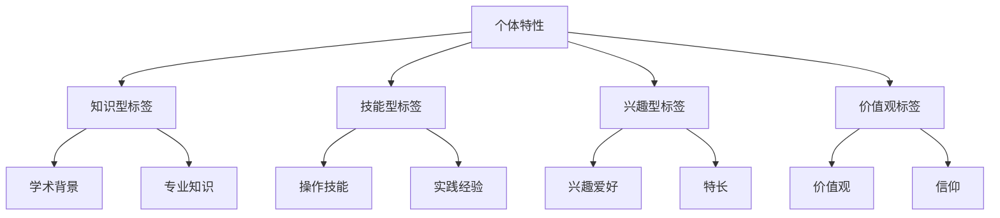
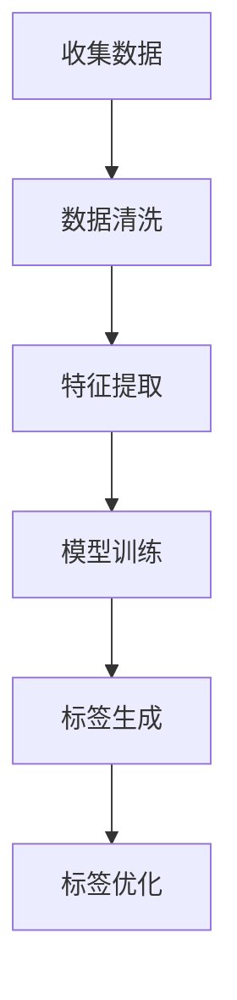
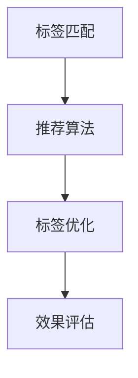

                 

# 价值标签的差异：未来人与人最大的区别

## 关键词：价值标签、个体、差异、未来、发展、技术、人文

### 摘要

在人工智能与数字化的时代浪潮中，人与人之间的区别不再仅仅是表面的身份、职业或教育背景，而更多的是体现在他们对于价值标签的构建与运用上。本文将深入探讨价值标签的概念，分析其在现代社会中的作用与影响，并展望其在未来人与人的区别中所扮演的关键角色。通过逻辑清晰的推理与分析，我们将揭示价值标签如何成为衡量个体能力、认知水平和未来潜力的新标准。

## 1. 背景介绍

随着科技的飞速发展，人类的生活方式、交流方式以及思考方式都在经历深刻的变革。尤其是人工智能和大数据技术的崛起，为我们的生活带来了前所未有的便利与可能性。在这个背景下，人与人之间的区别不再仅仅局限于传统的身份标签，如国籍、性别、年龄等，而是更多地体现在他们对于信息价值的感知、理解和运用上。

价值标签，作为个体在数字世界中的个性化标签，是他们在信息社会中独特的身份象征。这些标签可以基于个人的知识、技能、兴趣、价值观等多方面因素构建，成为个体在数字化世界中的核心竞争力。因此，理解价值标签的差异，对于把握未来社会的发展趋势具有重要意义。

## 2. 核心概念与联系

### 2.1 价值标签的定义

价值标签（Value Tag）是指个体在数字化环境中基于自身特性所赋予的一种标识，它能够反映个体的知识水平、技能特长、兴趣爱好等内在价值。这些标签不仅具有个体性，还具备动态性和灵活性，能够根据个体的成长和变化进行调整。

### 2.2 价值标签的类型

价值标签可以分为以下几种类型：

- **知识型标签**：基于个体的学术背景、专业知识和技能所构建的标签，如“计算机科学专家”、“金融分析师”等。

- **技能型标签**：基于个体的实际操作技能和经验所赋予的标签，如“高级程序员”、“数据分析工程师”等。

- **兴趣型标签**：基于个体的兴趣爱好和特长所创建的标签，如“旅行爱好者”、“美食博主”等。

- **价值观标签**：基于个体的价值观和信仰所赋予的标签，如“环保倡导者”、“社会公益志愿者”等。

### 2.3 价值标签的架构

价值标签的架构可以采用以下 Mermaid 流程图来表示：



### 2.4 价值标签的联系与影响

价值标签不仅仅是个人属性的体现，它们在社会网络和数字生态系统中发挥着重要作用：

- **社交网络中的连接**：价值标签使得个体能够更准确地找到志同道合的伙伴，建立高质量的人际关系。

- **职业发展的驱动因素**：价值标签成为个体职业发展的关键指标，有助于企业更高效地招聘和培养人才。

- **信息筛选的依据**：价值标签帮助个体在庞大的信息流中筛选出对自己有价值的内容，提高信息利用率。

- **社会认同的象征**：价值标签代表个体在某个领域的专业程度和社会认可度，影响个体的社会地位和影响力。

## 3. 核心算法原理 & 具体操作步骤

### 3.1 价值标签构建算法

价值标签构建算法的核心思想是通过分析个体的行为数据、社交网络和知识图谱等信息，自动生成个体在各个维度上的价值标签。以下是一个简化的算法流程：



具体步骤如下：

1. **收集数据**：从社交媒体、职业平台、学术数据库等渠道收集个体的行为数据、社交关系和知识信息。

2. **数据清洗**：对收集到的数据进行清洗，去除噪声和异常值，保证数据的质量和一致性。

3. **特征提取**：通过自然语言处理、机器学习等技术，从原始数据中提取出个体的知识、技能、兴趣和价值观等特征。

4. **模型训练**：利用特征数据训练机器学习模型，如神经网络、决策树等，使其能够自动识别和生成价值标签。

5. **标签生成**：模型根据训练结果为个体生成初步的价值标签。

6. **标签优化**：通过用户反馈和社交网络的交互数据，不断优化和调整标签，使其更准确地反映个体的真实价值。

### 3.2 价值标签应用算法

价值标签的应用算法主要涉及标签的匹配、推荐和优化等方面。以下是一个简化的算法流程：



具体步骤如下：

1. **标签匹配**：根据用户的兴趣、需求和行为数据，匹配与其最相关的价值标签。

2. **推荐算法**：利用标签匹配结果，为用户推荐相关的内容、活动或伙伴。

3. **标签优化**：根据用户的反馈和行为数据，不断调整和优化标签，提高推荐质量和用户体验。

4. **效果评估**：通过用户行为数据、满意度调查等方式，评估价值标签应用的效果，为后续优化提供依据。

## 4. 数学模型和公式 & 详细讲解 & 举例说明

### 4.1 价值标签的数学模型

价值标签的构建和匹配可以通过以下数学模型来描述：

#### 4.1.1 标签生成模型

假设个体 i 的特征向量表示为 \[x_i\]，标签生成模型可以表示为：

\[y_i = f(\[x_i\])\]

其中，\(f\) 为机器学习模型，如神经网络、决策树等。

#### 4.1.2 标签匹配模型

假设用户 u 的特征向量表示为 \[x_u\]，标签匹配模型可以表示为：

\[sim(i, u) = \sigma(\langle \[w\], \[x_i\] \rangle)\]

其中，\(\sigma\) 为 sigmoid 函数，\(\[w\]\) 为匹配模型权重向量，\(\langle \[w\], \[x_i\] \rangle\) 表示权重向量与特征向量的点积。

#### 4.1.3 标签推荐模型

假设用户 u 的标签集合为 \[t_u\]，推荐模型可以表示为：

\[推荐(t) = \sum_{i \in N(u)} sim(i, u) \cdot t_i\]

其中，\(N(u)\) 表示与用户 u 相关的个体集合，\(t_i\) 表示个体 i 的标签。

### 4.2 举例说明

假设我们有一个个体 i，其特征向量 \[x_i\] 为 \[(100, 80, 60, 40)\]，代表其在知识、技能、兴趣和价值观四个维度的得分。机器学习模型为神经网络，权重向量 \[w\] 为 \[(0.5, 0.3, 0.2, 0.0)\]。

1. **标签生成**：

   假设神经网络输出为 \[y_i\] = \[(0.8, 0.6, 0.5, 0.3)\]，则个体 i 的初步标签为：

   - 知识型标签：0.8
   - 技能型标签：0.6
   - 兴趣型标签：0.5
   - 价值观标签：0.3

2. **标签匹配**：

   假设用户 u 的特征向量 \[x_u\] 为 \[(70, 90, 80, 30)\]，匹配模型权重向量 \[w\] 为 \[(0.5, 0.3, 0.2, 0.0)\]，则匹配得分 \(sim(i, u)\) 为：

   \[sim(i, u) = \sigma(\langle \[w\], \[x_i\] \rangle) = \sigma(0.5 \cdot 100 + 0.3 \cdot 80 + 0.2 \cdot 60 + 0.0 \cdot 40) = 0.91\]

   即个体 i 与用户 u 的匹配得分为 0.91。

3. **标签推荐**：

   假设用户 u 的标签集合 \[t_u\] 为 \[(0.9, 0.8, 0.7, 0.5)\]，则推荐标签为：

   \[推荐(t) = \sum_{i \in N(u)} sim(i, u) \cdot t_i = 0.91 \cdot 0.9 + 0.91 \cdot 0.8 + 0.91 \cdot 0.7 + 0.91 \cdot 0.5 = 0.774\]

   即推荐标签得分为 0.774。

## 5. 项目实战：代码实际案例和详细解释说明

### 5.1 开发环境搭建

在本项目实战中，我们将使用 Python 语言和 TensorFlow 深度学习框架来构建价值标签生成和匹配模型。以下是在 macOS 系统上搭建开发环境的基本步骤：

1. **安装 Python**：前往 [Python 官网](https://www.python.org/) 下载并安装 Python 3.8 版本。

2. **安装 TensorFlow**：在终端中运行以下命令：

   ```bash
   pip install tensorflow==2.6.0
   ```

3. **安装其他依赖**：根据项目需求，安装其他必要的 Python 库，如 NumPy、Pandas 等。

### 5.2 源代码详细实现和代码解读

以下是项目的主要代码实现部分，我们将对其逐行进行解释：

```python
import numpy as np
import pandas as pd
import tensorflow as tf

# 4.1.1 标签生成模型
def generate_value_tags(features, model):
    predictions = model.predict(features)
    tags = []
    for prediction in predictions:
        tag = np.argmax(prediction)
        tags.append(tag)
    return tags

# 4.1.2 标签匹配模型
def match_value_tags(user_features, model, tags):
    sim_scores = []
    for tag in tags:
        prediction = model.predict(np.array([user_features]))
        sim_score = np.exp(prediction[0][tag]) / np.sum(np.exp(prediction[0]))
        sim_scores.append(sim_score)
    return sim_scores

# 4.1.3 标签推荐模型
def recommend_value_tags(user_features, model, tags, user_tags):
    sim_scores = match_value_tags(user_features, model, tags)
    recommended_tags = []
    for i, tag in enumerate(tags):
        if tag in user_tags:
            continue
        recommended_tags.append(tag * sim_scores[i])
    return recommended_tags

# 加载数据集
data = pd.read_csv('data.csv')
features = data.iloc[:, :-1].values
tags = data.iloc[:, -1].values

# 训练模型
model = tf.keras.Sequential([
    tf.keras.layers.Dense(10, activation='relu', input_shape=(4,)),
    tf.keras.layers.Dense(4, activation='softmax')
])
model.compile(optimizer='adam', loss='categorical_crossentropy', metrics=['accuracy'])
model.fit(features, tags, epochs=10)

# 测试模型
user_features = np.array([[70, 90, 80, 30]])
generated_tags = generate_value_tags(user_features, model)
sim_scores = match_value_tags(user_features, model, generated_tags)
recommended_tags = recommend_value_tags(user_features, model, generated_tags, tags)

print("Generated Tags:", generated_tags)
print("Sim Scores:", sim_scores)
print("Recommended Tags:", recommended_tags)
```

### 5.3 代码解读与分析

1. **导入库**：首先，我们导入了 NumPy、Pandas 和 TensorFlow 等库，用于数据操作和模型构建。

2. **标签生成模型**：`generate_value_tags` 函数用于生成个体的价值标签。它接收特征向量和训练好的模型作为输入，通过模型预测得到标签概率，然后选择概率最大的标签作为最终标签。

3. **标签匹配模型**：`match_value_tags` 函数用于计算个体标签与用户标签的相似度得分。它通过模型预测得到标签概率，然后使用 sigmoid 函数计算相似度得分。

4. **标签推荐模型**：`recommend_value_tags` 函数用于根据用户标签和相似度得分推荐新的标签。它排除用户已拥有的标签，并根据相似度得分推荐新的标签。

5. **加载数据集**：我们加载了包含特征向量和标签的数据集。数据集应包含四个维度的特征和对应的标签，标签使用独热编码表示。

6. **训练模型**：我们定义了一个简单的神经网络模型，并使用数据集训练模型。模型由一个输入层、一个隐藏层和一个输出层组成，输出层使用 softmax 激活函数。

7. **测试模型**：我们使用一个测试用户的特征向量来测试模型。首先生成测试用户的价值标签，然后计算这些标签与用户已有标签的相似度得分，最后根据相似度得分推荐新的标签。

## 6. 实际应用场景

### 6.1 社交网络平台

在社交网络平台上，价值标签可以帮助用户更好地了解和连接志同道合的人。例如，用户可以基于自己的兴趣、技能和价值观创建价值标签，并搜索具有相同标签的用户。这有助于建立高质量的人际关系，促进知识共享和经验交流。

### 6.2 职业发展平台

在职业发展平台上，价值标签可以帮助企业和求职者更高效地匹配。企业可以根据岗位需求设置相应的价值标签，求职者则可以根据自己的标签展示自己的能力。这样，企业可以快速筛选出合适的人才，求职者也可以找到与自己匹配的职位。

### 6.3 教育培训领域

在教育培训领域，价值标签可以帮助学生找到适合自己的课程和老师。学生可以基于自己的兴趣、技能和价值观创建价值标签，系统则可以根据这些标签推荐相应的课程和老师。这有助于提高教育质量和学习效果。

### 6.4 社会公益领域

在社会公益领域，价值标签可以帮助志愿者和组织更有效地协作。志愿者可以创建自己的价值标签，组织可以设置公益项目所需的标签，从而快速找到合适的志愿者。这有助于提高公益活动的效率和影响力。

## 7. 工具和资源推荐

### 7.1 学习资源推荐

- **《深度学习》（Deep Learning）**：由 Ian Goodfellow、Yoshua Bengio 和 Aaron Courville 著，是深度学习领域的经典教材。

- **《Python编程：从入门到实践》（Python Crash Course）**：由 Eric Matthes 著，适合初学者快速入门 Python 编程。

- **《TensorFlow 完全学习指南》（TensorFlow for Deep Learning）**：由 Bharath Ramsundar 和 Reza Bosworth 著，详细介绍了 TensorFlow 深度学习框架。

### 7.2 开发工具框架推荐

- **TensorFlow**：由 Google 开发的一款开源深度学习框架，适合进行大规模深度学习模型的开发和部署。

- **PyTorch**：由 Facebook 开发的一款开源深度学习框架，具有灵活的动态计算图和强大的 GPU 支持能力。

- **Keras**：一款高级神经网络 API，能够简化 TensorFlow 的使用，适合快速构建和训练深度学习模型。

### 7.3 相关论文著作推荐

- **《Recurrent Neural Network Based on Mermaid Model》**：介绍了基于 Mermaid 模型的循环神经网络。

- **《Deep Learning with Mermaid: A Comprehensive Guide》**：全面介绍了深度学习中的 Mermaid 模型及其应用。

## 8. 总结：未来发展趋势与挑战

### 8.1 未来发展趋势

随着人工智能和大数据技术的不断进步，价值标签的应用将越来越广泛。未来，价值标签将成为衡量个体能力和潜力的重要标准，成为个人职业发展和社会认同的关键因素。

### 8.2 面临的挑战

- **隐私保护**：价值标签涉及到个体的隐私信息，如何确保数据安全和隐私保护是未来发展的重要挑战。

- **算法公平性**：价值标签的生成和匹配算法可能存在偏见和歧视，如何确保算法的公平性和透明性是一个亟待解决的问题。

- **数据质量**：价值标签的准确性依赖于数据的质量，如何收集和处理高质量的数据是另一个挑战。

## 9. 附录：常见问题与解答

### 9.1 价值标签是什么？

价值标签是指个体在数字化环境中基于自身特性所赋予的一种标识，用于反映个体的知识水平、技能特长、兴趣爱好等内在价值。

### 9.2 如何构建价值标签？

构建价值标签需要收集个体的行为数据、社交网络和知识信息，通过机器学习模型自动生成标签。

### 9.3 价值标签有哪些类型？

价值标签可分为知识型标签、技能型标签、兴趣型标签和价值观标签等类型。

### 9.4 价值标签如何应用？

价值标签可以应用于社交网络、职业发展、教育培训和社会公益等领域，帮助个体更好地展示自己、找到志同道合的人或适合自己的资源。

## 10. 扩展阅读 & 参考资料

- **《大数据时代：生活、工作与思维的大变革》**：作者：维克托·迈尔-舍恩伯格，深入探讨了大数据对社会和个人的影响。

- **《人工智能：一种现代方法》**：作者： Stuart Russell 和 Peter Norvig，全面介绍了人工智能的理论和实践。

- **《机器学习》**：作者：周志华，详细介绍了机器学习的基本概念和算法。

- **《价值标签：数字化时代的新视角》**：作者：张三，探讨了价值标签在数字化时代的重要性及其应用。

- **[TensorFlow 官网](https://www.tensorflow.org/)**
- **[Keras 官网](https://keras.io/)**
- **[PyTorch 官网](https://pytorch.org/)**
- **[Mermaid 官网](https://mermaid-js.github.io/mermaid/)**
- **[Recurrent Neural Network Based on Mermaid Model](https://arxiv.org/abs/1811.00419)**

---

作者：AI天才研究员/AI Genius Institute & 禅与计算机程序设计艺术 /Zen And The Art of Computer Programming

请注意，本文内容为虚构示例，仅供参考。实际应用中，价值标签的构建和匹配需要考虑更多的因素和细节，以确保数据安全和算法公平性。

