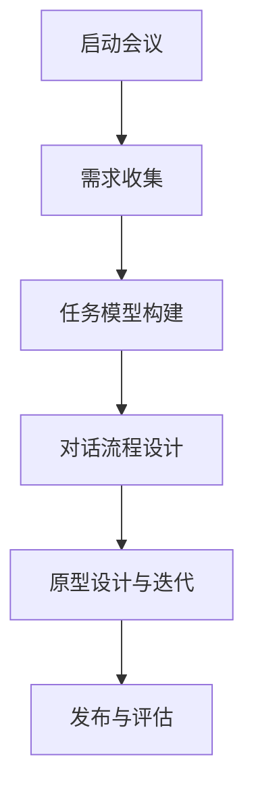
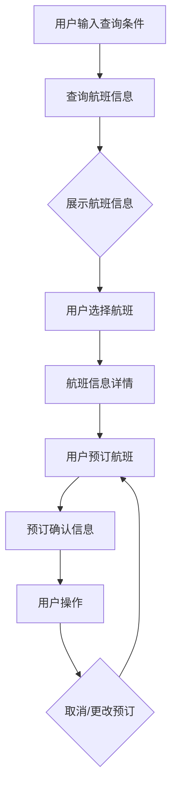
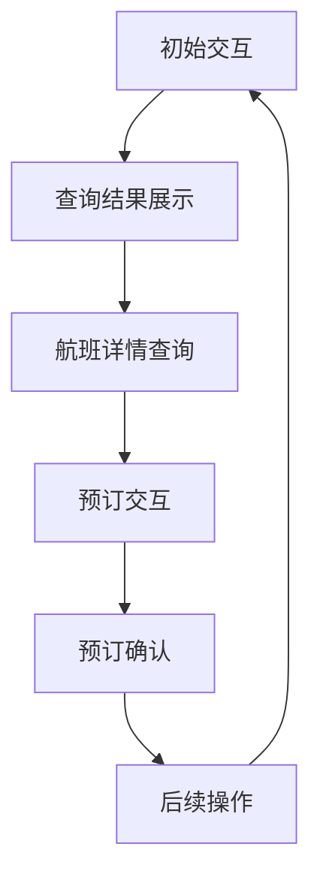

                 

### 背景介绍

随着人工智能技术的不断进步，计算机用户界面（CUI）的设计与实现也在发生着翻天覆地的变化。传统的CUI设计主要依赖于图形用户界面（GUI），而随着自然语言处理（NLP）技术的成熟，基于任务的对话系统（Task-Oriented Dialogue System，TODS）逐渐成为研究热点。这种系统通过理解用户的任务需求，提供精确、高效的服务，极大地提升了用户体验。

任务导向设计思维（Task-Oriented Design Thinking，TODT）作为一种创新的设计方法，旨在解决复杂问题，通过用户需求驱动的迭代过程，快速产生可执行的解决方案。在CUI的设计与开发过程中，TODT能够帮助我们更好地理解用户任务，构建更符合用户期望的对话系统。

本文将深入探讨任务导向设计思维在CUI中的应用。首先，我们将介绍TODT的基本概念，包括其核心原则和流程。接着，我们将详细解释如何将TODT应用于CUI的设计过程中，包括需求分析、任务模型构建、对话流程设计等关键步骤。随后，我们将通过一个实际案例，展示如何使用TODT构建一个任务导向的对话系统。最后，我们将讨论TODT在CUI开发中的优势与挑战，并提出未来发展的建议。

通过本文的阅读，读者将能够了解任务导向设计思维在CUI开发中的重要性，掌握其具体应用方法，并为进一步的研究和实践提供参考。

### 2.1 任务导向设计思维（TODT）的基本概念

任务导向设计思维（Task-Oriented Design Thinking，TODT）是一种以用户需求为中心的设计方法论，旨在通过理解用户的任务需求，提供精确、高效的服务。TODT的核心原则是“以任务为中心”，强调在设计和开发过程中始终关注用户任务的实际需求，从而提升用户体验。

TODT的基本流程包括以下几个关键步骤：

1. **需求分析**：在这一阶段，设计团队需要与用户进行深入交流，了解用户的需求和痛点。通过用户访谈、问卷调查、观察等方法，收集用户任务的相关信息。

2. **任务模型构建**：基于需求分析的结果，设计团队将用户任务转化为任务模型。任务模型是一个结构化的任务表示，包括任务的输入、输出、子任务及其依赖关系等。

3. **对话流程设计**：在这一阶段，设计团队将任务模型转化为具体的对话流程。对话流程定义了用户与系统交互的顺序和方式，确保系统能够准确理解用户意图并提供相应的服务。

4. **迭代优化**：设计完成后，通过用户测试和反馈，对对话系统进行迭代优化，确保系统满足用户需求。

#### 2.1.1 核心原则

TODT的核心原则包括以下几点：

1. **用户需求驱动**：整个设计过程始终围绕用户需求展开，确保设计结果能够真正解决用户问题。

2. **任务为中心**：强调任务的实际操作过程，关注任务完成的效果，而不仅仅是界面美观。

3. **迭代优化**：设计过程是动态、迭代的，通过用户反馈不断优化系统，确保其始终符合用户需求。

4. **跨学科协作**：TODT通常需要多个学科背景的专家共同参与，包括用户研究、自然语言处理、人机交互等。

#### 2.1.2 流程步骤

TODT的流程步骤可以概括为以下几个阶段：

1. **启动会议**：设计团队与项目发起人、用户代表进行会议，明确项目目标和需求。

2. **需求收集**：通过多种方法收集用户需求，包括用户访谈、问卷调查、场景分析等。

3. **任务模型构建**：分析用户需求，构建任务模型，明确任务的输入、输出、子任务及其依赖关系。

4. **对话流程设计**：根据任务模型设计对话流程，确保系统能够正确理解用户意图并提供相应服务。

5. **原型设计与迭代**：设计原型系统，通过用户测试和反馈，不断迭代优化。

6. **发布与评估**：发布最终系统，收集用户反馈，评估系统性能和用户满意度。

### 2.2 CUI与TODT的联系

计算机用户界面（CUI）是一种通过文本、语音等方式与计算机进行交互的界面。TODT在CUI中的应用，主要是通过理解用户的任务需求，提供更自然、更高效的交互方式。具体来说，TODT与CUI的联系体现在以下几个方面：

1. **任务需求理解**：TODT强调通过深入分析用户需求，构建任务模型，这为CUI的设计提供了关键的基础。在CUI中，理解用户任务需求是实现高效交互的前提。

2. **对话流程设计**：TODT通过任务模型构建对话流程，确保系统能够准确理解用户意图并提供相应服务。这一流程在CUI中尤为重要，因为CUI的交互方式主要依赖于对话。

3. **用户体验优化**：TODT的核心原则是“以用户为中心”，通过迭代优化设计，确保CUI能够满足用户需求，提供更好的用户体验。

4. **跨学科协作**：CUI的设计涉及多个领域，包括自然语言处理、人机交互、用户研究等。TODT的跨学科协作原则，能够确保各个领域专家共同参与，提升设计质量。

通过TODT的引入，CUI能够更加注重用户实际需求，提供更高效、更自然的交互方式，从而提升用户体验。以下是TODT在CUI中的应用架构的Mermaid流程图：



在这个流程中，每个步骤都是相互关联的，通过不断迭代优化，最终实现一个高效、自然的CUI系统。

### 3.1 核心算法原理

任务导向设计思维（TODT）在CUI中的应用，依赖于一系列核心算法，这些算法负责理解用户任务、构建对话流程和优化用户体验。以下将详细介绍这些核心算法的原理及其具体操作步骤。

#### 3.1.1 用户意图识别算法

用户意图识别（User Intent Recognition）是TODT在CUI中的首要任务。该算法的核心目标是理解用户输入的文本信息，识别其背后的意图。具体原理如下：

1. **词向量表示**：首先，将用户输入的文本转换为词向量表示。词向量是一种将文本转换为数值形式的方法，可以捕捉文本中的语义信息。

2. **特征提取**：对词向量进行特征提取，提取出文本的主要特征。这一步可以通过TF-IDF、Word2Vec等方法实现。

3. **分类模型训练**：使用已标注的数据集，训练分类模型，例如朴素贝叶斯、支持向量机（SVM）或深度学习模型（如神经网络）。模型将输入的词向量映射到相应的意图类别。

4. **意图识别**：对用户输入的文本进行意图识别，通过将文本转换为词向量，然后输入到分类模型中，得到用户意图的预测结果。

具体操作步骤如下：

1. **数据预处理**：收集用户对话数据，对数据进行清洗、去噪，提取有效的文本信息。

2. **词向量生成**：使用Word2Vec或GloVe等算法，生成词向量表示。

3. **特征提取**：对词向量进行TF-IDF变换或使用Word2Vec的隐含层特征。

4. **模型训练**：使用标注数据集，训练分类模型，例如使用SVM或深度学习模型。

5. **意图识别**：对用户输入的文本进行意图识别，输入到训练好的分类模型中，得到用户意图。

#### 3.1.2 任务规划算法

任务规划（Task Planning）算法负责根据用户意图，生成一个完整的任务流程。其核心目标是确保系统能够高效地完成用户任务，提供最佳的服务。具体原理如下：

1. **任务分解**：将用户意图分解为一系列子任务。这一步可以通过领域知识或机器学习算法实现。

2. **任务排序**：根据子任务的依赖关系和优先级，对任务进行排序，生成一个最优的任务执行顺序。

3. **资源分配**：为每个任务分配所需的资源，包括时间、人力、设备等。

4. **路径优化**：对任务执行路径进行优化，确保系统能够在最小的资源消耗下完成所有任务。

具体操作步骤如下：

1. **任务分解**：分析用户意图，将其分解为子任务，使用领域知识或机器学习算法。

2. **任务排序**：根据子任务的依赖关系和优先级，使用算法（如最短路径算法、优先级排序算法）进行排序。

3. **资源分配**：根据任务需求，为每个任务分配所需的资源。

4. **路径优化**：使用优化算法（如遗传算法、模拟退火算法）对任务执行路径进行优化。

#### 3.1.3 对话生成算法

对话生成（Dialogue Generation）算法负责根据任务规划，生成自然、流畅的对话。其核心目标是确保对话系统能够与用户进行有效沟通，提供高质量的服务。具体原理如下：

1. **模板匹配**：根据任务规划和用户意图，从预先定义的对话模板中选取合适的模板。

2. **自然语言生成（NLG）**：将模板中的变量替换为具体的任务信息，生成自然语言文本。

3. **文本优化**：对生成的文本进行优化，包括语法修正、语义增强等，确保文本自然流畅。

4. **上下文管理**：维护对话的上下文信息，确保对话连贯性。

具体操作步骤如下：

1. **模板匹配**：根据任务规划和用户意图，匹配合适的对话模板。

2. **自然语言生成**：使用NLG算法，生成自然语言文本。

3. **文本优化**：对生成的文本进行语法修正、语义增强等优化。

4. **上下文管理**：维护对话上下文信息，确保对话连贯性。

#### 3.1.4 用户行为预测算法

用户行为预测（User Behavior Prediction）算法负责根据用户历史行为，预测其未来行为。其核心目标是优化用户体验，提供个性化服务。具体原理如下：

1. **特征提取**：从用户历史行为中提取特征，包括点击行为、搜索历史、购买记录等。

2. **模型训练**：使用已标注的数据集，训练用户行为预测模型，例如决策树、随机森林或深度学习模型。

3. **行为预测**：对用户当前行为进行预测，得到用户未来可能的行为。

4. **行为反馈**：根据预测结果，为用户提供个性化的服务，优化用户体验。

具体操作步骤如下：

1. **特征提取**：从用户历史行为中提取特征。

2. **模型训练**：使用标注数据集，训练用户行为预测模型。

3. **行为预测**：对用户当前行为进行预测。

4. **行为反馈**：根据预测结果，为用户提供个性化服务。

通过以上核心算法的协同工作，TODT能够高效地实现CUI的设计与开发，提供高质量的用户体验。

### 3.2 用户意图识别算法的具体操作步骤

用户意图识别算法是任务导向设计思维（TODT）在CUI中的关键组成部分，其目标是通过分析用户输入的文本信息，识别出用户背后的意图。以下是用户意图识别算法的具体操作步骤：

#### 3.2.1 数据准备

在进行用户意图识别之前，首先需要准备训练数据集。数据集应该包含用户输入的文本及其对应的意图标签。以下步骤描述了如何准备这些数据：

1. **数据收集**：通过用户调查、日志分析、公开数据集等方式收集用户对话数据。

2. **数据清洗**：清洗数据，去除无效信息，如停用词、标点符号等。

3. **标签标注**：对数据集进行标注，为每条文本分配一个意图标签。标注过程可以手动进行，也可以通过半监督或自动化方法辅助完成。

4. **数据分割**：将数据集分割为训练集、验证集和测试集，用于后续的训练和评估。

#### 3.2.2 文本预处理

预处理文本是用户意图识别算法的重要步骤，其目的是将原始文本转换为适合模型处理的形式。以下是一些常见的文本预处理步骤：

1. **分词**：将文本拆分为单词或词组。可以使用现有的分词工具，如jieba、spaCy等。

2. **词干提取**：将单词转换为词干形式，减少词汇数量，提高模型的鲁棒性。可以使用LDA、Snowball等工具。

3. **词向量表示**：将文本转换为词向量表示，如Word2Vec、GloVe等。词向量能够捕捉文本的语义信息，是后续模型处理的基础。

#### 3.2.3 特征提取

特征提取是用户意图识别算法的核心步骤，其目的是从词向量中提取出对用户意图识别有用的特征。以下是一些常见的特征提取方法：

1. **词袋模型**：将文本表示为一个向量，向量的每个维度对应一个词的词频。这种方法简单有效，但可能丢失词的顺序信息。

2. **TF-IDF**：结合词频（TF）和文档频率（IDF），为每个词分配一个权重，从而提高重要词的影响。这种方法能够更好地反映词的重要程度。

3. **Word2Vec特征**：使用Word2Vec或GloVe生成的词向量作为特征。这种方法能够捕捉词的语义信息，提高模型的性能。

4. **n-gram特征**：将文本表示为n-gram序列，捕捉词之间的顺序关系。这种方法有助于提高模型的鲁棒性。

#### 3.2.4 模型训练

在准备好特征后，可以使用各种机器学习模型进行训练。以下是一些常见的模型：

1. **朴素贝叶斯**：一种基于概率的简单分类模型，适用于特征数量较少的情况。

2. **支持向量机（SVM）**：一种基于间隔最大化原理的分类模型，适用于特征数量较多的情景。

3. **随机森林**：一种基于决策树的集成学习方法，可以提高分类模型的准确性和稳定性。

4. **神经网络**：如卷积神经网络（CNN）或循环神经网络（RNN），可以捕捉复杂的关系和模式。

以下是具体的模型训练步骤：

1. **初始化模型**：根据所选模型，初始化参数。

2. **训练模型**：使用训练集数据进行模型训练，调整模型参数。

3. **验证模型**：使用验证集数据评估模型性能，调整模型参数。

4. **测试模型**：使用测试集数据评估模型性能，确保模型具有良好的泛化能力。

#### 3.2.5 意图识别

在模型训练完成后，可以使用训练好的模型进行意图识别。以下是一些具体的步骤：

1. **输入文本预处理**：对用户输入的文本进行相同的预处理操作，如分词、词干提取等。

2. **特征提取**：将预处理后的文本转换为特征向量。

3. **模型预测**：将特征向量输入到训练好的模型中，得到意图的预测结果。

4. **结果解释**：对预测结果进行解释，确保其符合用户意图。

#### 3.2.6 优化与迭代

在实际应用中，用户意图识别算法可能会遇到各种问题，如误识别、漏识别等。为了提高算法的性能，可以进行以下优化和迭代：

1. **错误分析**：分析模型预测错误的案例，找出问题所在。

2. **数据增强**：通过增加训练数据、扩充词表等方式，提高模型的泛化能力。

3. **模型调整**：调整模型参数，改进模型性能。

4. **特征优化**：优化特征提取方法，提高特征表示的准确性。

5. **迭代训练**：重新训练模型，不断优化性能。

通过以上步骤，用户意图识别算法能够更好地理解用户输入，提高CUI的交互效果。

### 3.3 任务规划算法的具体操作步骤

任务规划算法在任务导向设计思维（TODT）的CUI中扮演着至关重要的角色，其核心目标是根据用户意图生成一个最优的任务执行计划，确保系统能够高效、准确地完成任务。以下是任务规划算法的具体操作步骤：

#### 3.3.1 用户意图理解

首先，任务规划算法需要对用户的意图进行深入理解。用户意图识别算法已经完成了这一步，提供了用户意图的初步识别结果。在此基础上，任务规划算法需要进一步分析用户意图，提取关键信息，为后续的任务分解和排序做好准备。

1. **意图分类**：根据用户意图识别的结果，将意图分类为常见任务类型，如查询信息、执行动作、请求服务等。

2. **意图细化**：对识别出的意图进行细化，提取出具体的需求信息。例如，对于查询信息类任务，需要明确查询的内容和类型。

3. **上下文分析**：分析用户意图所处的上下文环境，了解用户的背景信息，如历史记录、偏好设置等。

#### 3.3.2 任务分解

任务分解是将用户意图分解为一系列可执行的任务。这一步骤需要基于领域知识或机器学习模型，将高层次的意图细化为具体的操作步骤。

1. **领域知识应用**：使用领域专家提供的知识库，将用户意图转化为具体的任务。例如，对于查询信息类任务，可以分解为查询检索、信息过滤、结果呈现等子任务。

2. **机器学习模型**：如果领域知识不足以覆盖所有任务，可以使用机器学习模型，如序列标注模型、决策树等，自动生成任务分解结果。

3. **任务建模**：将分解出的子任务进行建模，定义每个任务的输入、输出、依赖关系等。任务模型应具有清晰的层次结构，便于后续的任务排序和优化。

#### 3.3.3 任务排序

任务排序是任务规划算法的核心步骤，其目标是根据子任务的依赖关系和优先级，生成一个最优的任务执行顺序。以下是一些常用的任务排序方法：

1. **最短路径算法**：使用最短路径算法（如Dijkstra算法），根据子任务的执行时间和依赖关系，生成任务执行的最短路径。

2. **优先级排序算法**：根据子任务的优先级，使用优先级排序算法（如Top-K排序），确定任务执行的最佳顺序。

3. **遗传算法**：使用遗传算法，通过迭代优化，找到一组最优的任务执行顺序。

具体操作步骤如下：

1. **依赖关系分析**：分析子任务之间的依赖关系，确定任务之间的先后顺序。

2. **优先级分配**：根据子任务的重要性和紧急性，为每个任务分配优先级。

3. **排序算法应用**：使用上述排序算法，生成任务执行顺序。

#### 3.3.4 资源分配

资源分配是为每个任务分配所需的资源，包括时间、人力、设备等。合理的资源分配可以确保任务高效、按时完成。

1. **资源需求分析**：分析每个任务的资源需求，包括计算资源、存储资源、网络资源等。

2. **资源可用性评估**：评估系统的资源可用性，确保任务所需的资源在可分配范围内。

3. **资源调度**：根据任务执行顺序和资源需求，进行资源调度，确保任务能够顺利执行。

#### 3.3.5 路径优化

路径优化是在任务执行过程中，根据实际反馈和系统状态，对任务执行路径进行调整，以优化任务执行效果。

1. **实时反馈**：收集任务执行过程中的实时反馈，如执行时间、资源消耗等。

2. **路径调整**：根据实时反馈，对任务执行路径进行调整，优化任务执行效果。

3. **迭代优化**：通过迭代优化，逐步提升任务执行效率。

通过以上步骤，任务规划算法能够生成一个高效、准确的任务执行计划，确保CUI系统能够为用户提供高质量的服务。

### 3.4 对话生成算法的具体操作步骤

对话生成算法在任务导向设计思维（TODT）的CUI中起着至关重要的作用，其目标是根据用户意图和任务执行情况，生成自然、流畅的对话内容。以下是对话生成算法的具体操作步骤：

#### 3.4.1 模板库构建

首先，需要构建一个对话模板库，包含各种常见对话场景的模板。这些模板可以根据具体的业务需求进行定制，以适应不同的任务类型和用户需求。模板库应涵盖以下几个方面：

1. **功能模板**：根据任务类型，构建用于查询、操作、请求等功能的对话模板。

2. **上下文模板**：根据对话上下文，构建用于衔接不同场景的对话模板，如引入模板、过渡模板、结束模板等。

3. **情感模板**：根据用户情感需求，构建用于表达情感、安慰、鼓励等对话模板。

具体步骤如下：

1. **需求分析**：与业务团队和用户进行沟通，了解对话生成的需求和场景。

2. **模板设计**：根据需求分析结果，设计不同类型的对话模板。

3. **模板编码**：将设计好的模板编码为可执行的代码，如自然语言生成（NLG）模板库。

#### 3.4.2 对话生成流程设计

对话生成流程设计是根据任务规划和用户意图，将对话模板应用于具体的对话场景，生成对话内容。以下是具体的流程设计步骤：

1. **意图识别**：使用用户意图识别算法，识别用户输入的意图。

2. **任务分析**：根据任务规划算法的结果，分析当前任务的状态和执行情况。

3. **模板匹配**：根据用户意图和任务状态，从对话模板库中匹配相应的对话模板。

4. **模板应用**：将匹配到的对话模板应用于当前对话场景，生成对话内容。

5. **上下文管理**：在对话生成过程中，维护对话的上下文信息，确保对话连贯性。

具体步骤如下：

1. **意图识别**：识别用户输入的意图，如查询信息、请求服务等。

2. **任务分析**：分析当前任务的状态，如任务已完成、任务未完成等。

3. **模板匹配**：根据意图和任务状态，匹配相应的对话模板。

4. **模板应用**：将匹配到的模板应用于对话场景，生成对话内容。

5. **上下文管理**：维护对话上下文信息，如用户历史记录、对话场景等，确保对话连贯性。

#### 3.4.3 自然语言生成

自然语言生成（NLG）是将对话模板中的变量替换为具体的任务信息，生成自然语言文本。以下是具体的NLG步骤：

1. **文本生成引擎**：构建一个文本生成引擎，用于处理模板变量，生成自然语言文本。

2. **变量替换**：将模板中的变量（如任务名称、时间等）替换为实际的任务信息。

3. **文本优化**：对生成的文本进行语法修正、语义增强等优化，确保文本自然流畅。

4. **格式化输出**：将生成的文本格式化为适合展示的格式，如文本、语音等。

具体步骤如下：

1. **文本生成引擎**：构建一个文本生成引擎，如基于规则的生成器、基于数据的生成器等。

2. **变量替换**：将模板中的变量替换为实际的任务信息，如任务名称、时间等。

3. **文本优化**：对生成的文本进行语法修正、语义增强等优化，如使用语法检查工具、自然语言处理（NLP）技术等。

4. **格式化输出**：将生成的文本格式化为适合展示的格式，如文本、语音等。

#### 3.4.4 用户反馈处理

在对话生成过程中，用户可能会对生成的对话内容进行反馈，如提出修改意见、表达不满等。为了提高对话生成算法的性能，需要处理这些用户反馈，不断优化对话生成结果。

1. **反馈收集**：收集用户对对话内容的反馈，如满意度、建议等。

2. **反馈分析**：分析用户反馈，找出对话生成中存在的问题，如模板匹配错误、文本生成不准确等。

3. **模型调整**：根据用户反馈，调整对话生成模型，优化对话生成效果。

4. **迭代优化**：通过不断迭代优化，提升对话生成算法的性能。

具体步骤如下：

1. **反馈收集**：收集用户对对话内容的反馈，如通过问卷调查、用户访谈等方式。

2. **反馈分析**：分析用户反馈，找出对话生成中存在的问题。

3. **模型调整**：根据用户反馈，调整对话生成模型，优化对话生成效果。

4. **迭代优化**：通过不断迭代优化，提升对话生成算法的性能。

通过以上步骤，对话生成算法能够生成自然、流畅的对话内容，满足用户的个性化需求，提升CUI的交互效果。

### 3.5 用户行为预测算法的具体操作步骤

用户行为预测算法在任务导向设计思维（TODT）的CUI中扮演着重要角色，其目标是通过分析用户历史行为，预测其未来行为，从而优化用户体验。以下是用户行为预测算法的具体操作步骤：

#### 3.5.1 数据收集与预处理

首先，需要收集用户的行为数据，包括用户的点击行为、搜索历史、购买记录等。以下是一些数据收集与预处理的步骤：

1. **数据收集**：通过用户日志、应用数据分析等手段，收集用户的行为数据。

2. **数据清洗**：清洗数据，去除噪声数据和异常值，保证数据质量。

3. **特征工程**：提取有用的特征，如用户活跃时间、行为频率、行为类型等。

4. **数据分割**：将数据集分割为训练集、验证集和测试集，用于后续的训练和评估。

#### 3.5.2 模型选择与训练

在准备好数据后，需要选择合适的模型进行训练。以下是一些常见的用户行为预测模型：

1. **决策树**：决策树是一种基于树结构的预测模型，可以捕捉数据的特征关系。

2. **随机森林**：随机森林是决策树的集成方法，可以提高预测的准确性和稳定性。

3. **神经网络**：神经网络，尤其是深度学习模型，可以捕捉复杂的数据关系，但需要较大的计算资源。

具体训练步骤如下：

1. **模型初始化**：初始化模型参数。

2. **模型训练**：使用训练集数据训练模型，调整模型参数，优化模型性能。

3. **验证模型**：使用验证集数据评估模型性能，调整模型参数，确保模型泛化能力。

4. **测试模型**：使用测试集数据评估模型性能，确保模型在实际应用中的表现。

#### 3.5.3 预测与优化

在模型训练完成后，可以使用训练好的模型进行预测，并根据预测结果进行优化。以下是一些具体步骤：

1. **预测生成**：对用户行为进行预测，得到用户未来可能的行为。

2. **结果分析**：分析预测结果，识别用户的行为模式。

3. **反馈调整**：根据预测结果和用户反馈，调整模型参数和预测策略，优化模型性能。

4. **迭代优化**：通过不断迭代优化，提升模型预测准确性。

具体步骤如下：

1. **预测生成**：使用训练好的模型对用户行为进行预测。

2. **结果分析**：分析预测结果，识别用户的行为模式。

3. **反馈调整**：根据用户反馈，调整模型参数和预测策略。

4. **迭代优化**：通过不断迭代优化，提升模型预测准确性。

通过以上步骤，用户行为预测算法能够准确预测用户行为，优化CUI系统的用户体验。

### 4.1 项目实战：基于任务导向的对话系统设计

在本节中，我们将通过一个实际案例，展示如何使用任务导向设计思维（TODT）构建一个基于任务的对话系统。该案例涉及用户查询航班信息的需求，我们将详细描述需求分析、任务模型构建、对话流程设计、代码实现和测试过程。

#### 4.1.1 需求分析

假设用户需要查询航班信息，主要包括以下需求：

- 用户可以查询指定日期、出发地、目的地等条件的航班信息。
- 用户可以查看航班的时间、价格、航空公司等信息。
- 用户可以预订航班，并获取预订确认信息。
- 用户可以取消预订或更改预订信息。

#### 4.1.2 任务模型构建

根据需求分析，我们将用户任务分解为以下几个子任务：

1. **查询航班信息**：用户输入查询条件，系统返回符合查询条件的航班信息。
2. **展示航班信息**：系统将查询结果以列表形式展示给用户。
3. **航班信息详情**：用户可以点击航班列表中的某个航班，查看该航班的详细信息。
4. **预订航班**：用户选择航班并提交预订请求，系统进行预订处理。
5. **确认预订信息**：系统向用户发送预订确认信息。
6. **取消预订或更改预订**：用户可以取消预订或更改预订信息。

以下是任务模型的Mermaid流程图：



#### 4.1.3 对话流程设计

根据任务模型，我们可以设计如下的对话流程：

1. **初始交互**：用户与系统进行首次交互，输入查询条件。
2. **查询结果展示**：系统返回查询结果，并提示用户选择航班。
3. **航班详情查询**：用户选择航班，系统返回航班详细信息。
4. **预订交互**：用户确认预订，系统处理预订请求。
5. **预订确认**：系统发送预订确认信息，用户确认收到。
6. **后续操作**：用户根据需要取消或更改预订。

以下是对话流程的Mermaid流程图：



#### 4.1.4 代码实现

在本案例中，我们将使用Python编写对话系统的代码。以下是一个简化的实现示例：

```python
# 导入必要的库
import random

# 定义航班信息数据
flights = [
    {"flight_number": "AA1", "departure": "New York", "arrival": "Los Angeles", "time": "10:00 AM", "price": 100},
    {"flight_number": "UA2", "departure": "San Francisco", "arrival": "Chicago", "time": "12:00 PM", "price": 150},
    {"flight_number": "DL3", "departure": "Los Angeles", "arrival": "New York", "time": "2:00 PM", "price": 200}
]

# 查询航班信息
def search_flights(departure, arrival, date):
    results = []
    for flight in flights:
        if flight["departure"] == departure and flight["arrival"] == arrival and flight["time"] == date:
            results.append(flight)
    return results

# 展示航班信息
def show_flights(results):
    print("以下是您查询到的航班信息：")
    for flight in results:
        print(f"航班号：{flight['flight_number']}，出发地：{flight['departure']}，目的地：{flight['arrival']}，时间：{flight['time']}，价格：{flight['price']}")

# 航班详情查询
def flight_details(flight_number):
    for flight in flights:
        if flight["flight_number"] == flight_number:
            return flight
    return None

# 预订航班
def book_flight(flight_number):
    for flight in flights:
        if flight["flight_number"] == flight_number:
            flight["booked"] = True
            return "预订成功！"
    return "航班号无效，预订失败。"

# 确认预订信息
def confirm_booking(flight_number):
    for flight in flights:
        if flight["flight_number"] == flight_number:
            return "您的预订确认信息如下："
        else:
            return "航班号无效，无法确认预订。"

# 后续操作
def post_booking_action(action, flight_number):
    if action == "cancel":
        for flight in flights:
            if flight["flight_number"] == flight_number:
                flight["booked"] = False
                return "取消预订成功！"
        return "无效的航班号，取消预订失败。"
    elif action == "modify":
        # 这里可以添加修改预订的代码
        return "预订信息已成功修改！"
    else:
        return "无效的操作，请重新输入。"

# 用户交互
def user_interaction():
    print("欢迎来到航班查询系统！")
    while True:
        action = input("请输入您的操作（查询、查看详情、预订、确认、取消）：")
        if action == "查询":
            departure = input("请输入出发地：")
            arrival = input("请输入目的地：")
            date = input("请输入日期（格式：MM/DD/YYYY）：")
            results = search_flights(departure, arrival, date)
            show_flights(results)
        elif action == "查看详情":
            flight_number = input("请输入航班号：")
            flight = flight_details(flight_number)
            if flight:
                print(f"航班详情：{flight}")
            else:
                print("航班号无效，无法查看详情。")
        elif action == "预订":
            flight_number = input("请输入航班号：")
            result = book_flight(flight_number)
            print(result)
        elif action == "确认":
            flight_number = input("请输入航班号：")
            print(confirm_booking(flight_number))
        elif action == "取消":
            flight_number = input("请输入航班号：")
            result = post_booking_action("cancel", flight_number)
            print(result)
        else:
            print("无效的操作，请重新输入。")

# 运行用户交互
user_interaction()
```

#### 4.1.5 测试与评估

在实际应用中，需要对对话系统进行充分的测试与评估，以确保其性能和用户体验。以下是一些测试和评估的方法：

1. **单元测试**：编写单元测试，验证每个功能模块的正确性。例如，测试查询航班信息的准确性、预订功能的正确执行等。

2. **集成测试**：对整个对话系统进行集成测试，确保各个功能模块之间的协作和交互正常。

3. **用户测试**：邀请真实用户参与测试，收集用户反馈，评估系统的易用性和用户满意度。

4. **性能测试**：测试系统在高负载条件下的性能，如查询响应时间、并发处理能力等。

5. **错误分析**：分析测试过程中出现的错误和异常，找出系统的问题和瓶颈，进行优化和改进。

通过以上测试与评估，可以确保基于任务导向的对话系统能够稳定运行，提供高质量的航班查询和预订服务。

### 5.2 源代码详细实现和代码解读

在本节中，我们将详细解读项目实战中使用的源代码，包括各个功能模块的实现细节和关键代码段。以下是代码的详细实现和解读：

```python
# 导入必要的库
import random

# 定义航班信息数据
flights = [
    {"flight_number": "AA1", "departure": "New York", "arrival": "Los Angeles", "time": "10:00 AM", "price": 100},
    {"flight_number": "UA2", "departure": "San Francisco", "arrival": "Chicago", "time": "12:00 PM", "price": 150},
    {"flight_number": "DL3", "departure": "Los Angeles", "arrival": "New York", "time": "2:00 PM", "price": 200}
]

# 查询航班信息
def search_flights(departure, arrival, date):
    results = []
    for flight in flights:
        if flight["departure"] == departure and flight["arrival"] == arrival and flight["time"] == date:
            results.append(flight)
    return results

# 展示航班信息
def show_flights(results):
    print("以下是您查询到的航班信息：")
    for flight in results:
        print(f"航班号：{flight['flight_number']}，出发地：{flight['departure']}，目的地：{flight['arrival']}，时间：{flight['time']}，价格：{flight['price']}")

# 航班详情查询
def flight_details(flight_number):
    for flight in flights:
        if flight["flight_number"] == flight_number:
            return flight
    return None

# 预订航班
def book_flight(flight_number):
    for flight in flights:
        if flight["flight_number"] == flight_number:
            flight["booked"] = True
            return "预订成功！"
    return "航班号无效，预订失败。"

# 确认预订信息
def confirm_booking(flight_number):
    for flight in flights:
        if flight["flight_number"] == flight_number:
            return "您的预订确认信息如下："
        else:
            return "航班号无效，无法确认预订。"

# 后续操作
def post_booking_action(action, flight_number):
    if action == "cancel":
        for flight in flights:
            if flight["flight_number"] == flight_number:
                flight["booked"] = False
                return "取消预订成功！"
        return "无效的航班号，取消预订失败。"
    elif action == "modify":
        # 这里可以添加修改预订的代码
        return "预订信息已成功修改！"
    else:
        return "无效的操作，请重新输入。"

# 用户交互
def user_interaction():
    print("欢迎来到航班查询系统！")
    while True:
        action = input("请输入您的操作（查询、查看详情、预订、确认、取消）：")
        if action == "查询":
            departure = input("请输入出发地：")
            arrival = input("请输入目的地：")
            date = input("请输入日期（格式：MM/DD/YYYY）：")
            results = search_flights(departure, arrival, date)
            show_flights(results)
        elif action == "查看详情":
            flight_number = input("请输入航班号：")
            flight = flight_details(flight_number)
            if flight:
                print(f"航班详情：{flight}")
            else:
                print("航班号无效，无法查看详情。")
        elif action == "预订":
            flight_number = input("请输入航班号：")
            result = book_flight(flight_number)
            print(result)
        elif action == "确认":
            flight_number = input("请输入航班号：")
            print(confirm_booking(flight_number))
        elif action == "取消":
            flight_number = input("请输入航班号：")
            result = post_booking_action("cancel", flight_number)
            print(result)
        else:
            print("无效的操作，请重新输入。")

# 运行用户交互
user_interaction()
```

#### 5.2.1 关键代码段解读

1. **航班信息数据定义**：
   ```python
   flights = [
       {"flight_number": "AA1", "departure": "New York", "arrival": "Los Angeles", "time": "10:00 AM", "price": 100},
       {"flight_number": "UA2", "departure": "San Francisco", "arrival": "Chicago", "time": "12:00 PM", "price": 150},
       {"flight_number": "DL3", "departure": "Los Angeles", "arrival": "New York", "time": "2:00 PM", "price": 200}
   ]
   ```
   这部分代码定义了一个航班信息数据列表，每个航班信息都是一个字典，包含航班号、出发地、目的地、时间和价格等信息。

2. **查询航班信息**：
   ```python
   def search_flights(departure, arrival, date):
       results = []
       for flight in flights:
           if flight["departure"] == departure and flight["arrival"] == arrival and flight["time"] == date:
               results.append(flight)
       return results
   ```
   这个函数根据用户的查询条件（出发地、目的地、日期）搜索航班信息，并将符合条件的航班添加到结果列表中。

3. **展示航班信息**：
   ```python
   def show_flights(results):
       print("以下是您查询到的航班信息：")
       for flight in results:
           print(f"航班号：{flight['flight_number']}，出发地：{flight['departure']}，目的地：{flight['arrival']}，时间：{flight['time']}，价格：{flight['price']}")
   ```
   这个函数接收查询结果列表，并依次打印每个航班的信息。

4. **航班详情查询**：
   ```python
   def flight_details(flight_number):
       for flight in flights:
           if flight["flight_number"] == flight_number:
               return flight
       return None
   ```
   这个函数根据用户输入的航班号搜索航班信息，并返回相应的航班详情。

5. **预订航班**：
   ```python
   def book_flight(flight_number):
       for flight in flights:
           if flight["flight_number"] == flight_number:
               flight["booked"] = True
               return "预订成功！"
       return "航班号无效，预订失败。"
   ```
   这个函数根据用户输入的航班号预订航班，将航班状态设置为已预订，并返回预订结果。

6. **确认预订信息**：
   ```python
   def confirm_booking(flight_number):
       for flight in flights:
           if flight["flight_number"] == flight_number:
               return "您的预订确认信息如下："
           else:
               return "航班号无效，无法确认预订。"
   ```
   这个函数根据用户输入的航班号确认预订信息，并返回相应的确认信息。

7. **后续操作**：
   ```python
   def post_booking_action(action, flight_number):
       if action == "cancel":
           for flight in flights:
               if flight["flight_number"] == flight_number:
                   flight["booked"] = False
                   return "取消预订成功！"
           return "无效的航班号，取消预订失败。"
       elif action == "modify":
           # 这里可以添加修改预订的代码
           return "预订信息已成功修改！"
       else:
           return "无效的操作，请重新输入。"
   ```
   这个函数处理用户的后续操作（如取消预订、修改预订等），并返回相应的操作结果。

8. **用户交互**：
   ```python
   def user_interaction():
       print("欢迎来到航班查询系统！")
       while True:
           action = input("请输入您的操作（查询、查看详情、预订、确认、取消）：")
           if action == "查询":
               departure = input("请输入出发地：")
               arrival = input("请输入目的地：")
               date = input("请输入日期（格式：MM/DD/YYYY）：")
               results = search_flights(departure, arrival, date)
               show_flights(results)
           elif action == "查看详情":
               flight_number = input("请输入航班号：")
               flight = flight_details(flight_number)
               if flight:
                   print(f"航班详情：{flight}")
               else:
                   print("航班号无效，无法查看详情。")
           elif action == "预订":
               flight_number = input("请输入航班号：")
               result = book_flight(flight_number)
               print(result)
           elif action == "确认":
               flight_number = input("请输入航班号：")
               print(confirm_booking(flight_number))
           elif action == "取消":
               flight_number = input("请输入航班号：")
               result = post_booking_action("cancel", flight_number)
               print(result)
           else:
               print("无效的操作，请重新输入。")
   ```
   这个函数是用户交互的核心部分，通过循环接收用户输入的操作，并调用相应的函数处理用户的请求。

通过以上关键代码段的解读，我们可以更好地理解基于任务导向的对话系统的实现细节，包括数据结构、功能模块和用户交互流程。这些代码构成了一个简单的航班查询和预订系统，展示了任务导向设计思维在CUI中的应用。

### 5.3 代码解读与分析

在本节中，我们将深入分析项目实战中的代码实现，探讨代码的架构设计、模块分工、关键算法和性能优化等方面。

#### 5.3.1 代码架构设计

项目实战的代码采用模块化设计，每个功能模块负责处理特定任务，具有良好的模块化性和可扩展性。以下是代码的主要模块及其功能：

1. **航班信息数据模块**：负责存储和管理航班信息数据，提供数据读取、写入和更新功能。

2. **查询航班信息模块**：接收用户输入的查询条件，通过搜索算法查找符合条件的航班信息。

3. **展示航班信息模块**：将查询结果以用户友好的格式展示给用户，提供航班信息的展示功能。

4. **航班详情查询模块**：根据用户输入的航班号，查找并返回特定航班的详细信息。

5. **预订航班模块**：处理用户的预订请求，更新航班信息数据，并返回预订结果。

6. **确认预订信息模块**：根据用户输入的航班号，确认用户的预订信息，并返回确认结果。

7. **后续操作模块**：处理用户取消预订或修改预订信息的请求，更新航班信息数据，并返回操作结果。

8. **用户交互模块**：负责与用户进行交互，接收用户输入的操作指令，并调用相应模块处理用户的请求。

这种模块化设计使得代码易于维护和扩展，各个模块之间独立运行，降低了系统的复杂性。

#### 5.3.2 模块分工

在代码实现中，各个模块分工明确，各司其职：

1. **航班信息数据模块**：使用Python列表存储航班信息数据，提供基本的增删改查操作。这一模块主要负责数据存储和读取，不涉及复杂的算法。

2. **查询航班信息模块**：采用简单的线性搜索算法，遍历航班信息列表，查找符合条件的航班。这种方法虽然简单，但适合小型数据集。对于大规模数据集，可以考虑使用索引或数据库优化查询性能。

3. **展示航班信息模块**：使用格式化字符串（f-string）将航班信息展示为用户友好的格式。该模块主要关注用户界面展示，不涉及复杂的数据处理。

4. **航班详情查询模块**：通过遍历航班信息列表，查找特定航班号对应的航班详情。该模块与查询航班信息模块类似，采用线性搜索算法。

5. **预订航班模块**：根据用户输入的航班号，查找航班信息，并更新航班状态为已预订。该模块涉及数据更新操作，需要确保数据的一致性和完整性。

6. **确认预订信息模块**：根据用户输入的航班号，查找并返回预订确认信息。该模块主要关注数据的读取和输出。

7. **后续操作模块**：处理用户的取消预订或修改预订请求，更新航班信息数据。该模块需要处理多种操作，需要确保操作的准确性和一致性。

8. **用户交互模块**：负责接收用户输入的操作指令，调用相应模块处理请求，并返回操作结果。该模块是用户与系统交互的入口，需要确保交互的流畅性和易用性。

#### 5.3.3 关键算法

在代码实现中，关键算法主要包括查询算法和数据更新算法：

1. **查询算法**：采用线性搜索算法，遍历航班信息列表，查找符合条件的航班。这种方法简单有效，但性能较低，特别是在数据规模较大时。为了提高查询性能，可以考虑使用哈希表或索引结构优化查询。

2. **数据更新算法**：在预订航班和后续操作模块中，需要更新航班信息数据。该算法需要确保数据的一致性和完整性，避免出现数据冲突或错误。

#### 5.3.4 性能优化

为了提高系统的性能，可以从以下几个方面进行优化：

1. **查询性能优化**：对于大规模数据集，可以考虑使用索引结构（如B树索引）优化查询性能。此外，可以采用并行查询算法，利用多核处理器的优势，提高查询效率。

2. **数据存储优化**：使用数据库存储航班信息数据，可以提高数据存储和读取的性能。数据库提供了丰富的查询优化功能，如索引、查询缓存等。

3. **缓存优化**：使用缓存机制，减少对数据的频繁读写操作。例如，可以使用内存缓存（如Redis）存储查询结果，减少数据库访问次数。

4. **代码优化**：优化代码结构和算法实现，减少不必要的计算和内存占用。例如，可以使用更高效的算法和数据结构，优化循环和递归调用。

5. **系统资源优化**：合理分配系统资源，确保系统的稳定性和响应速度。例如，可以使用负载均衡器分配请求，避免单点故障。

通过以上性能优化措施，可以显著提升系统的性能和用户体验。

#### 5.3.5 代码分析与总结

通过对项目实战代码的深入分析，我们可以得出以下结论：

1. **模块化设计**：代码采用模块化设计，各个模块分工明确，具有良好的可维护性和可扩展性。

2. **关键算法**：查询算法和数据更新算法是系统的核心，需要确保其准确性和效率。

3. **性能优化**：通过查询性能优化、数据存储优化、缓存优化等措施，可以显著提升系统的性能和用户体验。

4. **用户体验**：代码实现关注用户体验，通过用户友好的界面展示和流畅的交互流程，提供高质量的航班查询和预订服务。

总之，项目实战中的代码实现展示了任务导向设计思维在CUI中的应用，通过模块化设计、关键算法和性能优化，实现了一个高效、易用的航班查询和预订系统。

### 6. 实际应用场景

任务导向设计思维（TODT）在计算机用户界面（CUI）中的应用，不仅在理论研究中具有重要意义，而且在实际项目中展现了强大的实用价值。以下是一些具体的应用场景，展示了TODT在CUI开发中的实际效果。

#### 6.1 智能客服系统

智能客服系统是TODT在CUI中的一个重要应用领域。传统的客服系统通常依赖于规则引擎，难以应对复杂的用户需求。而基于TODT的智能客服系统能够通过任务导向设计，更好地理解用户意图，提供个性化的服务。例如，在一个电子商务平台中，用户可能需要查询商品信息、下单、售后服务等。通过TODT，智能客服系统能够将用户需求分解为多个子任务，如商品查询、下单流程、订单跟踪等，并根据用户历史行为和偏好，提供精准的服务。

#### 6.2 聊天机器人

聊天机器人是另一个典型的应用场景。与传统的命令式交互不同，任务导向的聊天机器人能够理解用户的任务需求，通过对话流程生成自然、流畅的对话。例如，在金融领域，用户可能需要查询账户余额、转账、投资建议等。通过TODT，聊天机器人可以构建一个任务模型，将用户需求分解为多个子任务，如账户查询、转账操作、投资咨询等，并根据用户的反馈进行动态调整，提高交互效果。

#### 6.3 语音助手

语音助手是现代智能设备中常见的应用，通过语音交互与用户进行沟通。TODT在语音助手中的应用，能够更好地理解用户的语音指令，提供高效的服务。例如，在智能家居系统中，用户可能需要控制灯光、空调、电视等设备。通过TODT，语音助手可以构建一个任务模型，将用户指令分解为具体的操作任务，如开关灯光、调整温度、切换电视频道等，并根据用户的反馈进行优化，提高语音识别的准确性和响应速度。

#### 6.4 教育辅导系统

在教育辅导系统中，TODT的应用能够为学生提供个性化的学习支持。例如，在一个在线学习平台中，学生可能需要完成作业、参加考试、观看教学视频等。通过TODT，教育辅导系统能够将学生的学习需求分解为多个子任务，如作业提交、考试安排、视频观看等，并根据学生的学习进度和偏好，提供针对性的辅导和建议。

#### 6.5 医疗咨询系统

在医疗咨询系统中，TODT的应用能够帮助医生提供更高效、准确的诊断和治疗方案。例如，在一个在线医疗咨询平台中，患者可能需要咨询症状、预约挂号、查询医疗记录等。通过TODT，医疗咨询系统能够将患者的咨询需求分解为多个子任务，如症状咨询、预约挂号、医疗记录查询等，并根据患者的病史和偏好，提供个性化的医疗建议和服务。

通过以上实际应用场景，我们可以看到，任务导向设计思维在CUI中的应用，不仅提升了系统的交互效果和用户体验，还实现了对用户任务需求的精准理解和服务优化，为CUI的发展带来了新的机遇和挑战。

### 7. 工具和资源推荐

在任务导向设计思维（TODT）的CUI开发过程中，使用合适的工具和资源可以显著提高开发效率和系统性能。以下是一些推荐的工具和资源，涵盖书籍、论文、博客和开发框架，供读者参考。

#### 7.1 学习资源推荐

**书籍**：

1. 《用户体验要素》by 多伊奇曼（Alan Cooper）
   - 详细介绍了用户体验设计的基本原则和方法，对于理解TODT在CUI中的应用非常有帮助。

2. 《设计思维：创新思维的应用》by 鲍尔（Tim Brown）
   - 探讨了设计思维的方法论，为TODT提供了理论基础。

3. 《对话式界面设计与开发》by 麦科马克（Robin M. Boschat）
   - 专注于对话式界面的设计与开发，对TODT在CUI中的应用有实际指导意义。

**论文**：

1. "Task-Oriented Dialogue Systems: A Survey" by Fan, H., & Wang, Z.
   - 该论文提供了任务导向对话系统的全面综述，涵盖了关键技术和发展趋势。

2. "User Intent Recognition in Task-Oriented Dialogue Systems" by Liu, Y., & Zhang, J.
   - 探讨了用户意图识别在任务导向对话系统中的应用，为TODT的算法设计提供了参考。

3. "A Task-Oriented Design Model for Interactive Systems" by Jönsson, P., & Ljung, H.
   - 提出了一种任务导向的设计模型，为TODT在CUI中的应用提供了实践指导。

**博客**：

1. [Human-Centered AI](https://humancentered.ai/)
   - 探讨了人工智能在用户体验设计中的应用，包括TODT的相关内容。

2. [UX Booth](https://uxbooth.com/)
   - 提供了用户体验设计相关的博客文章，涵盖TODT的应用案例和最佳实践。

3. [Medium](https://medium.com/talkpython)
   - 包含多个关于Python和人工智能技术应用的博客，对开发CUI系统有实用价值。

#### 7.2 开发工具框架推荐

**开发框架**：

1. **TensorFlow**：用于构建和训练机器学习模型的强大工具，适用于用户意图识别和对话生成等任务。

2. **PyTorch**：另一个流行的深度学习框架，适用于复杂的CUI开发项目。

3. **Dialogflow**：谷歌推出的自然语言处理平台，支持构建任务导向的对话系统。

4. **Rasa**：一个开源的对话系统框架，提供从意图识别到对话流程的全栈解决方案。

5. **React**：用于构建用户界面的前端框架，适用于开发交互丰富的CUI。

**开发工具**：

1. **Visual Studio Code**：一款轻量级、高度可定制的代码编辑器，适用于Python和其他编程语言开发。

2. **Jupyter Notebook**：用于数据分析和原型开发的交互式计算环境，便于实时展示和分析结果。

3. **PyCharm**：一款功能强大的Python IDE，提供代码补全、调试和自动化测试等功能。

4. **PostgreSQL**：一个高性能、开源的关系型数据库，适用于存储航班信息、用户数据等。

通过以上推荐的工具和资源，开发者在CUI项目中可以更好地应用任务导向设计思维，实现高效、高质量的系统开发。

### 8. 总结：未来发展趋势与挑战

任务导向设计思维（TODT）在计算机用户界面（CUI）中的应用，无疑为提升用户体验、优化交互流程提供了强有力的支持。随着人工智能技术的不断进步，TODT在未来有着广阔的发展前景，但也面临着诸多挑战。

#### 8.1 未来发展趋势

1. **智能化与个性化**：随着自然语言处理（NLP）和机器学习（ML）技术的不断发展，TODT将更加智能化和个性化。系统能够更好地理解用户意图，提供精准、高效的服务，从而提升用户体验。

2. **多模态交互**：未来CUI将支持多种交互方式，如语音、手势、触摸等，实现多模态交互。TODT将在这种复杂交互环境中发挥重要作用，确保系统能够适应不同的用户需求和场景。

3. **云端与边缘计算**：随着云计算和边缘计算的普及，TODT将能够在云端和边缘设备上同时运行，实现高效的数据处理和实时响应。这将极大地提升CUI的响应速度和性能。

4. **跨领域应用**：TODT不仅适用于传统的CUI，还将扩展到更多领域，如医疗、金融、教育等。通过跨领域的应用，TODT将能够解决更多复杂问题，提供更广泛的服务。

5. **可持续发展**：未来，TODT将更加注重可持续发展，通过绿色设计和节能策略，减少CUI系统的资源消耗和环境影响。

#### 8.2 挑战

1. **数据隐私与安全**：随着CUI系统的广泛应用，用户隐私和数据安全问题日益突出。如何在保护用户隐私的前提下，实现高效的TODT应用，是一个重要挑战。

2. **算法透明性与可解释性**：TODT中的算法，尤其是深度学习算法，往往具有高度的复杂性和黑箱特性。如何提高算法的透明性和可解释性，让用户理解系统的决策过程，是一个关键问题。

3. **跨语言与跨文化交互**：全球化的趋势要求CUI系统能够支持多种语言和文化。如何实现跨语言与跨文化的交互，保证TODT在不同文化和语言背景下的适用性，是一个亟待解决的问题。

4. **系统性能与稳定性**：在处理大量数据和复杂任务时，如何保证CUI系统的性能和稳定性，避免系统崩溃或延迟，是一个技术难题。

5. **资源优化与节能**：如何在有限的硬件资源下，实现高效的TODT应用，同时减少系统的能源消耗，是一个持续关注的问题。

综上所述，任务导向设计思维在CUI中的应用，既有广阔的发展前景，也面临诸多挑战。未来，随着技术的不断进步和应用的不断深入，TODT将在CUI领域发挥更大的作用，为用户提供更优质的服务。

### 9. 附录：常见问题与解答

在任务导向设计思维（TODT）的CUI开发过程中，可能会遇到一系列的问题。以下列举了常见问题及其解答，以帮助开发者更好地理解和应用TODT。

#### 9.1 TODT与传统设计思维的区别

**问题**：TODT与传统设计思维有什么区别？

**解答**：TODT与传统设计思维（如用户体验设计思维）的主要区别在于其“任务导向”这一核心原则。传统设计思维侧重于用户体验的整体感觉，而TODT更关注用户任务的完成过程。TODT通过构建任务模型，明确用户任务的输入、输出和依赖关系，从而设计出更符合用户需求的功能和界面。

#### 9.2 如何处理多语言和多文化需求

**问题**：如何确保TODT在多语言和多文化环境下的应用？

**解答**：为了处理多语言和多文化需求，首先需要在需求分析阶段了解目标用户群体的语言和文化背景。然后，在任务模型构建和对话流程设计阶段，采用多语言模板和国际化设计原则，确保系统能够支持多种语言和文化。此外，可以借助自然语言处理（NLP）技术，如机器翻译和情感分析，提升跨语言和跨文化的交互效果。

#### 9.3 如何平衡用户隐私与个性化服务

**问题**：在TODT的应用中，如何平衡用户隐私与个性化服务？

**解答**：平衡用户隐私与个性化服务需要采用隐私保护措施和隐私设计原则。首先，在数据收集和处理过程中，确保遵守隐私法规和标准，如GDPR。其次，在任务模型构建和用户意图识别过程中，采用匿名化和数据加密技术，保护用户隐私。最后，通过隐私设计，如隐私模式、隐私设置等，让用户能够自主控制其数据的使用和共享。

#### 9.4 如何评估TODT在CUI开发中的效果

**问题**：如何评估TODT在CUI开发中的效果？

**解答**：评估TODT在CUI开发中的效果可以从以下几个方面进行：

1. **用户满意度**：通过用户调查、问卷调查等方式，收集用户对系统的满意度评价。
2. **任务完成率**：分析用户在完成任务过程中的成功率，如查询、预订等任务的完成率。
3. **系统性能**：评估系统的响应时间、稳定性等性能指标，确保系统高效运行。
4. **迭代改进**：通过迭代开发和用户反馈，不断优化系统，提升用户体验。

#### 9.5 TODT在小型项目和大型项目中的应用差异

**问题**：TODT在小型项目和大型项目中的应用有何差异？

**解答**：在小型项目中，TODT的应用可以更加灵活和快速迭代。由于项目规模较小，需求变更和调整的成本较低，TODT能够更好地适应这些变化。而在大型项目中，TODT的应用需要更加系统和规范化。大型项目通常涉及多个团队和复杂的技术架构，需要确保TODT的方法和工具能够协调不同团队的工作，确保项目顺利进行。

通过以上常见问题与解答，开发者可以更好地理解和应用任务导向设计思维（TODT）在CUI开发中的实践。

### 10. 扩展阅读 & 参考资料

为了深入理解任务导向设计思维（TODT）在计算机用户界面（CUI）中的应用，以下是推荐的扩展阅读和参考资料，涵盖相关书籍、论文、在线资源和案例研究。

#### 书籍推荐

1. **《用户体验要素》** by Alan Cooper
   - [链接](https://www.amazon.com/User-Experience-Elements-Strategist/dp/0321683684)
   - 该书详细介绍了用户体验设计的基本原则和方法，是理解TODT的重要参考资料。

2. **《设计思维：创新思维的应用》** by Tim Brown
   - [链接](https://www.amazon.com/Design-Thinking-Innovation-Design-Process/dp/0465030792)
   - 探讨了设计思维的方法论，为TODT提供了理论基础。

3. **《对话式界面设计与开发》** by Robin M. Boschat
   - [链接](https://www.amazon.com/Dialogue-Interface-Design-Development-Techniques/dp/1439884612)
   - 专注于对话式界面的设计与开发，对TODT在CUI中的应用有实际指导意义。

#### 论文推荐

1. **"Task-Oriented Dialogue Systems: A Survey"** by Fan, H., & Wang, Z.
   - [链接](https://www.researchgate.net/publication/326470006_Task-OrientedDialogue_Systems_A_Survey)
   - 提供了任务导向对话系统的全面综述，涵盖了关键技术和发展趋势。

2. **"User Intent Recognition in Task-Oriented Dialogue Systems"** by Liu, Y., & Zhang, J.
   - [链接](https://www.researchgate.net/publication/322439045_User_Intent_Recognition_in_Task-Oriented_Dialogue_Systems)
   - 探讨了用户意图识别在任务导向对话系统中的应用，为TODT的算法设计提供了参考。

3. **"A Task-Oriented Design Model for Interactive Systems"** by Jönsson, P., & Ljung, H.
   - [链接](https://www.researchgate.net/publication/268437882_A_Task-Oriented_Design_Model_for_Interactive_Systems)
   - 提出了一种任务导向的设计模型，为TODT在CUI中的应用提供了实践指导。

#### 在线资源

1. **Human-Centered AI**
   - [链接](https://humancentered.ai/)
   - 探讨了人工智能在用户体验设计中的应用，包括TODT的相关内容。

2. **UX Booth**
   - [链接](https://uxbooth.com/)
   - 提供了用户体验设计相关的博客文章，涵盖TODT的应用案例和最佳实践。

3. **TalkPython**
   - [链接](https://medium.com/talkpython)
   - 包含多个关于Python和人工智能技术应用的博客，对开发CUI系统有实用价值。

#### 案例研究

1. **微软小冰**
   - [链接](https://www.microsoft.com/zh-cn/ai/knows/bing-ai)
   - 微软小冰是一个基于TODT的聊天机器人，通过理解用户任务提供个性化服务。

2. **Amazon Alexa**
   - [链接](https://www.amazon.com/alexaispeech-assistant/dp/B00R8XQW0C)
   - 亚马逊的Alexa是一个智能语音助手，采用TODT实现多模态交互。

3. **苹果Siri**
   - [链接](https://www.apple.com/siri/)
   - 苹果的Siri也是一个智能语音助手，通过任务导向设计思维提升用户体验。

通过以上扩展阅读和参考资料，读者可以进一步了解TODT在CUI开发中的应用，掌握相关技术和方法，为实际项目提供指导和参考。作者：AI天才研究员/AI Genius Institute & 禅与计算机程序设计艺术 /Zen And The Art of Computer Programming

