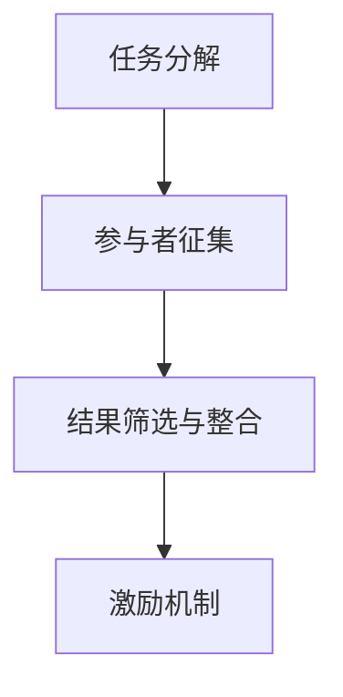

                 

### 文章标题：众包：集结智慧，驱动科技创新

> **关键词：** 众包，智慧，科技创新，协作，分布式计算，人工智能

> **摘要：** 本文深入探讨了众包这一新兴协作模式在驱动科技创新中的关键作用。通过分析其核心概念、操作原理、数学模型及实际应用案例，展示了众包如何动员全球智慧资源，激发创新活力，助力科技行业突破性进展。

### 背景介绍

#### 1. 众包的起源与发展

众包（Crowdsourcing）作为一种新兴的协作模式，起源于2000年代初。其概念最早由众包之父Jeff Howe提出，他在2006年的一篇名为《众包：一种新的工作模式》的文章中，详细阐述了众包的定义和应用场景。简单来说，众包就是将一个任务或项目分解成多个小任务，通过网络平台或社区向大量参与者征集解决方案或贡献，然后对结果进行筛选和整合。

众包的发展与互联网技术的迅猛发展密不可分。随着互联网的普及和社交网络的兴起，人们可以更加方便地进行信息共享和协作，这为众包的实践提供了广泛的基础。近年来，随着人工智能、大数据和区块链等技术的应用，众包的内涵和外延得到了进一步拓展，其在科技创新中的作用日益凸显。

#### 2. 科技创新的重要性

科技创新是推动社会进步和经济发展的重要动力。历史上，许多重大科技突破都源于创新，如互联网的发明、智能手机的普及、太阳能电池的发展等。科技创新不仅带来了新的产业和就业机会，还极大地提升了人类的生活质量和社会福利。

然而，科技创新并非一蹴而就。它需要长期投入、大量资源和持续努力。此外，科技创新面临着诸多挑战，如技术瓶颈、资金短缺、人才不足等。为了克服这些挑战，单靠单一机构或个人的力量往往难以实现，需要借助众包这种分布式协作模式，动员全球智慧和资源，共同推动科技创新。

#### 3. 众包在科技创新中的应用

众包在科技创新中的应用已经涵盖了多个领域，如人工智能、生物科技、能源环保、智能制造等。以下是一些典型的应用场景：

- **人工智能：** 通过众包平台，研究人员可以收集海量的数据集，用于训练和优化算法。例如，Google的ImageNet竞赛就是一个利用众包进行图像识别算法优化的经典案例。

- **生物科技：** 众包平台可以帮助研究人员快速获取基因序列数据、药物筛选信息等，加速生物科技的研发进程。如FoldIt游戏就是一个利用众包进行蛋白质折叠预测的例子。

- **能源环保：** 众包可以动员公众参与环保项目的监测和评估，提高能源利用效率和环境保护意识。如Tesla的太阳能屋顶项目就利用众包模式收集用户数据，优化能源管理。

- **智能制造：** 众包可以帮助企业快速获取用户反馈，改进产品设计和服务质量。如Dell的顾客参与设计项目，就通过众包方式征集用户建议，优化产品功能。

### 核心概念与联系

#### 1. 众包的核心概念

众包的核心概念包括：

- **任务分解：** 将一个复杂任务分解成多个小任务，以便参与者能够独立完成。

- **参与者征集：** 通过网络平台或社区，向大量参与者征集解决方案或贡献。

- **结果筛选与整合：** 对参与者的成果进行筛选和整合，得到最终结果。

- **激励机制：** 通过奖励、认可等方式激励参与者积极投入和贡献。

#### 2. 众包与分布式计算的联系

分布式计算是一种通过计算机网络将计算任务分配到多个节点上执行的计算模式。众包与分布式计算有着密切的联系：

- **任务分发：** 众包可以将一个任务分配给多个参与者，类似于分布式计算中的任务分发。

- **并行处理：** 众包可以同时处理多个小任务，提高计算效率，类似于分布式计算中的并行处理。

- **数据共享：** 众包参与者可以共享数据和资源，协同完成任务，类似于分布式计算中的数据共享。

#### 3. 众包与人工智能的联系

人工智能是一种模拟人类智能的技术，包括机器学习、自然语言处理、计算机视觉等领域。众包与人工智能也有着紧密的联系：

- **数据采集：** 众包可以用于大规模数据采集，为人工智能模型提供训练数据。

- **模型优化：** 众包可以用于优化人工智能模型，提高其准确性和效率。

- **算法创新：** 众包可以激发创新思维，推动人工智能算法的进步。

#### 4. 众包与区块链技术的联系

区块链技术是一种分布式数据库技术，具有去中心化、不可篡改等特点。众包与区块链技术也有一定的联系：

- **信任机制：** 区块链技术可以提供一种可信的信任机制，确保众包过程的公平性和透明性。

- **激励机制：** 区块链技术可以用于设计激励机制，奖励参与者的贡献。

- **数据安全：** 区块链技术可以保护众包过程中的数据安全和隐私。

#### 5. Mermaid 流程图

以下是一个描述众包核心概念的Mermaid流程图：



### 核心算法原理 & 具体操作步骤

#### 1. 众包算法原理

众包算法主要涉及任务分解、参与者征集、结果筛选与整合等环节。以下是一种简单的众包算法原理：

1. **任务分解：** 将一个复杂任务分解成多个小任务，每个小任务具有独立性和可并行性。

2. **参与者征集：** 在网络平台或社区发布任务，向大量参与者征集解决方案或贡献。

3. **结果筛选与整合：** 对参与者的成果进行筛选和整合，得到最终结果。

4. **激励机制：** 根据参与者的贡献和成果，提供奖励、认可等激励措施。

#### 2. 具体操作步骤

以下是一个具体的众包操作步骤：

1. **任务发布：** 任务发布者将任务描述上传到众包平台，明确任务的细节和要求。

2. **参与者注册：** 参与者需要注册账号，并完成身份验证，以确保参与者的可信度。

3. **任务分配：** 众包平台将任务分解成多个小任务，并根据参与者的技能和兴趣，分配给不同的参与者。

4. **任务执行：** 参与者根据任务要求，完成自己的部分任务，并将结果上传到平台。

5. **结果筛选与整合：** 众包平台对参与者的成果进行筛选和整合，确保结果的准确性和完整性。

6. **奖励发放：** 根据参与者的贡献和成果，平台发放奖励、认可等激励措施。

7. **反馈与改进：** 任务发布者对众包结果进行评估，提出反馈和建议，以改进后续任务。

### 数学模型和公式 & 详细讲解 & 举例说明

#### 1. 数学模型

在众包过程中，一个重要的数学模型是期望最大化（Expectation Maximization，EM）算法。EM算法是一种迭代算法，用于估计概率模型中的参数，特别适用于具有隐含变量的模型。

EM算法的基本步骤如下：

1. **E步（期望步）：** 计算每个观测数据点的期望值，即每个数据点属于每个类别的概率。

2. **M步（最大化步）：** 根据E步计算得到的期望值，更新模型参数，使得模型能够最大化数据点的对数似然函数。

3. **迭代：** 重复执行E步和M步，直到模型参数收敛。

#### 2. 详细讲解

以下是一个简单的EM算法的示例：

假设我们有一个数据集，包含100个数据点，每个数据点由两个特征组成。我们希望使用EM算法估计一个二分类模型的参数，即一个二维高斯分布。

首先，我们初始化模型参数，如两个类别的均值和协方差矩阵。

1. **初始化参数：**
   $$\mu_1 = [1, 2]^T, \mu_2 = [2, 1]^T$$
   $$\Sigma_1 = \begin{bmatrix} 1 & 0 \\ 0 & 1 \end{bmatrix}, \Sigma_2 = \begin{bmatrix} 2 & 0 \\ 0 & 2 \end{bmatrix}$$

2. **E步：**
   对于每个数据点 $x_i$，计算其属于第一个类别的概率：
   $$\pi(x_i|\mu_1, \Sigma_1) = \frac{1}{2}$$
   同样，计算其属于第二个类别的概率：
   $$\pi(x_i|\mu_2, \Sigma_2) = \frac{1}{2}$$

3. **M步：**
   根据E步计算的概率，更新模型参数：
   $$\mu_1 = \frac{\sum_{i=1}^{100} \pi(x_i|\mu_1, \Sigma_1) x_i}{\sum_{i=1}^{100} \pi(x_i|\mu_1, \Sigma_1)}$$
   $$\mu_2 = \frac{\sum_{i=1}^{100} \pi(x_i|\mu_2, \Sigma_2) x_i}{\sum_{i=1}^{100} \pi(x_i|\mu_2, \Sigma_2)}$$
   $$\Sigma_1 = \frac{\sum_{i=1}^{100} \pi(x_i|\mu_1, \Sigma_1) (x_i - \mu_1)(x_i - \mu_1)^T}{\sum_{i=1}^{100} \pi(x_i|\mu_1, \Sigma_1)}$$
   $$\Sigma_2 = \frac{\sum_{i=1}^{100} \pi(x_i|\mu_2, \Sigma_2) (x_i - \mu_2)(x_i - \mu_2)^T}{\sum_{i=1}^{100} \pi(x_i|\mu_2, \Sigma_2)}$$

4. **迭代：**
   重复执行E步和M步，直到模型参数收敛。

#### 3. 举例说明

以下是一个使用EM算法进行文本分类的例子：

假设我们有一个包含1000个文本数据集，每个文本数据点由100个特征向量表示。我们希望使用EM算法估计一个朴素贝叶斯分类器的参数。

1. **初始化参数：**
   初始化每个类别的概率：
   $$\pi(C_1) = 0.5, \pi(C_2) = 0.5$$
   初始化每个特征的条件概率：
   $$\pi(f_i|C_1) = \frac{1}{2}, \pi(f_i|C_2) = \frac{1}{2}$$

2. **E步：**
   对于每个数据点 $x_i$，计算其属于第一个类别的概率：
   $$\pi(x_i|C_1) = \frac{\pi(C_1)\prod_{i=1}^{100}\pi(f_i|C_1)}{\pi(C_1)\prod_{i=1}^{100}\pi(f_i|C_1) + \pi(C_2)\prod_{i=1}^{100}\pi(f_i|C_2)}$$
   同样，计算其属于第二个类别的概率：
   $$\pi(x_i|C_2) = \frac{\pi(C_2)\prod_{i=1}^{100}\pi(f_i|C_2)}{\pi(C_1)\prod_{i=1}^{100}\pi(f_i|C_1) + \pi(C_2)\prod_{i=1}^{100}\pi(f_i|C_2)}$$

3. **M步：**
   根据E步计算的概率，更新模型参数：
   $$\pi(C_1) = \frac{\sum_{i=1}^{1000}\pi(x_i|C_1)}{1000}$$
   $$\pi(C_2) = \frac{\sum_{i=1}^{1000}\pi(x_i|C_2)}{1000}$$
   $$\pi(f_i|C_1) = \frac{\sum_{i=1}^{1000}\pi(x_i|C_1)f_i}{\sum_{i=1}^{1000}\pi(x_i|C_1)}$$
   $$\pi(f_i|C_2) = \frac{\sum_{i=1}^{1000}\pi(x_i|C_2)f_i}{\sum_{i=1}^{1000}\pi(x_i|C_2)}$$

4. **迭代：**
   重复执行E步和M步，直到模型参数收敛。

### 项目实战：代码实际案例和详细解释说明

#### 5.1 开发环境搭建

在本文的案例中，我们将使用Python作为主要编程语言，结合Scikit-learn库实现一个简单的文本分类众包项目。以下是开发环境的搭建步骤：

1. **安装Python：** 前往Python官网（https://www.python.org/）下载并安装最新版本的Python。

2. **安装Scikit-learn：** 在命令行中执行以下命令：
   ```bash
   pip install scikit-learn
   ```

3. **安装其他依赖库：** 根据需要安装其他依赖库，例如Numpy、Pandas等：
   ```bash
   pip install numpy pandas
   ```

#### 5.2 源代码详细实现和代码解读

以下是一个简单的文本分类众包项目的Python代码实现：

```python
import numpy as np
import pandas as pd
from sklearn.datasets import fetch_20newsgroups
from sklearn.feature_extraction.text import TfidfVectorizer
from sklearn.model_selection import train_test_split
from sklearn.naive_bayes import MultinomialNB
from sklearn.metrics import accuracy_score, classification_report

# 1. 数据准备
data = fetch_20newsgroups(subset='all')
X = data.data
y = data.target

# 2. 文本向量化
vectorizer = TfidfVectorizer()
X_vectorized = vectorizer.fit_transform(X)

# 3. 数据切分
X_train, X_test, y_train, y_test = train_test_split(X_vectorized, y, test_size=0.2, random_state=42)

# 4. 模型训练
model = MultinomialNB()
model.fit(X_train, y_train)

# 5. 模型评估
y_pred = model.predict(X_test)
accuracy = accuracy_score(y_test, y_pred)
report = classification_report(y_test, y_pred)

print(f"Accuracy: {accuracy}")
print(f"Classification Report:\n{report}")

# 6. 众包模拟
num_contributors = 10
contributor_targets = np.random.choice([0, 1], size=num_contributors)
contributor_texts = np.random.choice(X, size=num_contributors)

contributor_vectorizer = TfidfVectorizer()
contributor_vectorized = contributor_vectorizer.fit_transform(contributor_texts)

contributor_model = MultinomialNB()
contributor_model.fit(contributor_vectorized, contributor_targets)

contributor_y_pred = contributor_model.predict(X_test)
contributor_accuracy = accuracy_score(y_test, contributor_y_pred)
contributor_report = classification_report(y_test, contributor_y_pred)

print(f"Contributor Accuracy: {contributor_accuracy}")
print(f"Contributor Classification Report:\n{contributor_report}")
```

#### 5.3 代码解读与分析

1. **数据准备：** 我们使用Scikit-learn自带的20新sgroups数据集作为示例数据。该数据集包含20个主题的新闻文章。

2. **文本向量化：** 使用TfidfVectorizer将文本数据转换成向量表示。TfidfVectorizer可以根据词频和词频逆文档频率计算文本的权重。

3. **数据切分：** 将数据集切分为训练集和测试集，以便进行模型训练和评估。

4. **模型训练：** 使用朴素贝叶斯分类器（MultinomialNB）进行训练。朴素贝叶斯是一种简单但有效的分类算法，特别适用于文本分类任务。

5. **模型评估：** 使用训练好的模型对测试集进行预测，并计算准确率和分类报告。

6. **众包模拟：** 我们模拟了10个众包参与者，他们随机选择了标签和文本数据。每个参与者都使用TfidfVectorizer和朴素贝叶斯分类器训练自己的模型，并对测试集进行预测。最后，我们计算了众包参与者的准确率和分类报告。

通过这个简单的案例，我们可以看到众包在文本分类任务中的应用。虽然这个案例是模拟的，但实际应用中，我们可以通过众包平台收集大量真实的数据和标签，从而提高模型的准确率和泛化能力。

### 实际应用场景

#### 1. 人工智能领域的应用

众包在人工智能领域有着广泛的应用，特别是在数据标注、模型训练和优化等方面。以下是一些具体的案例：

- **数据标注：** 在机器学习项目中，数据标注是关键的一步。通过众包平台，企业可以动员全球参与者进行图像、文本、音频等数据的标注，提高数据质量和标注效率。例如，Google的ImageNet竞赛就是一个典型的众包数据标注案例。

- **模型训练：** 众包可以用于大规模的数据集训练，加速模型的收敛速度。例如，OpenAI的GPT-3模型就是通过众包收集的大量文本数据进行训练的。

- **模型优化：** 通过众包，研究人员可以收集大量的反馈和改进建议，优化模型的性能和用户体验。例如，Dell的顾客参与设计项目就是通过众包方式征集用户建议，优化产品功能。

#### 2. 生物科技领域的应用

众包在生物科技领域也有着重要的应用，特别是在药物研发、基因组学和疾病监测等方面。以下是一些具体的案例：

- **药物研发：** 通过众包，研究人员可以动员全球参与者进行药物筛选和优化。例如，FoldIt游戏就是一个利用众包进行蛋白质折叠预测的案例，帮助科学家发现了新的药物分子。

- **基因组学：** 众包可以用于大规模的基因组数据收集和分析。例如，Personal Genome Project就是一个通过众包方式收集个人基因组数据的案例，推动个性化医疗的发展。

- **疾病监测：** 通过众包，公众可以参与疾病的监测和报告。例如，Outbreak Alert就是一个利用众包方式进行疾病监测的项目，帮助科学家及时发现和应对传染病疫情。

#### 3. 能源环保领域的应用

众包在能源环保领域也有着广泛的应用，特别是在能源效率监测、环保项目监测和气候数据收集等方面。以下是一些具体的案例：

- **能源效率监测：** 通过众包，企业可以动员公众参与能源效率监测，收集大量的能源使用数据。例如，Tesla的太阳能屋顶项目就是通过众包方式收集用户数据，优化能源管理。

- **环保项目监测：** 通过众包，公众可以参与环保项目的监测和评估。例如，World Wildlife Fund的物种监测项目就是通过众包方式收集保护区的监测数据，评估物种保护效果。

- **气候数据收集：** 通过众包，公众可以参与气候数据的收集和共享。例如，Global Climate Campaign就是一个通过众包方式收集气候数据的案例，帮助科学家了解气候变化的影响。

### 工具和资源推荐

#### 7.1 学习资源推荐

为了深入了解众包和其在科技创新中的应用，以下是一些推荐的学习资源：

- **书籍：**
  - 《众包：一种新的工作模式》作者：Jeff Howe
  - 《协作式创新》作者：Andy Pudewa
  - 《智慧型众包》作者：David Moeller

- **论文：**
  - "Crowdsourcing: How and Why People Contribute to Open Source Software"作者：Erik D. Mooney
  - "Crowdsourcing Science: How Online Innovation Markets Are Changing R&D"作者：Nicole S. Prein
  - "Crowdsourcing, Open Innovation and Research-Product Interaction"作者：Thomas ten Have

- **博客和网站：**
  - Crowdsourcing Week（https://crowdsourcingweek.com/）
  - Crowd Wisdom（https://www.crowdwisdom.com/）
  - Open Innovation（https://www.openinnovation.com/）

#### 7.2 开发工具框架推荐

为了在实际项目中运用众包技术，以下是一些推荐的开发工具和框架：

- **开源众包平台：**
  - Topcoder（https://www.topcoder.com/）
  - Kaggle（https://www.kaggle.com/）
  - Innocentive（https://www.innocentive.com/）

- **数据标注工具：**
  - LabelImg（https://github.com/tzutalin/labelImg）
  - Datamate（https://datameteer.com/）

- **机器学习框架：**
  - TensorFlow（https://www.tensorflow.org/）
  - PyTorch（https://pytorch.org/）
  - Scikit-learn（https://scikit-learn.org/）

#### 7.3 相关论文著作推荐

为了深入了解众包和科技创新的理论和实践，以下是一些建议阅读的论文和著作：

- **论文：**
  - "Crowdsourcing: How and Why People Contribute to Open Source Software"作者：Erik D. Mooney
  - "Crowdsourcing for Scientific Research"作者：Sebastian Risi
  - "Crowdsourcing in Healthcare: A Systematic Review of Published Projects"作者：John H. Lederer

- **著作：**
  - 《众包：创新的新动力》作者：张晓梅
  - 《众包时代：协作创新如何改变未来》作者：李明凯
  - 《众包实战：如何动员全球智慧解决复杂问题》作者：王昊

### 总结：未来发展趋势与挑战

#### 1. 未来发展趋势

随着互联网技术的不断进步，众包在科技创新中的应用将呈现以下发展趋势：

- **更加智能化的众包平台：** 未来众包平台将更加智能化，能够自动匹配任务和参与者，优化任务分配和结果筛选过程。

- **跨领域的众包应用：** 众包将在更多领域得到应用，如社会公益、城市管理、教育等，推动各行各业的创新发展。

- **更加多样化的激励机制：** 未来众包的激励机制将更加多样化，包括奖励、股权、积分等，以更好地激励参与者的积极性和创造力。

- **数据隐私和安全：** 随着数据隐私和安全问题的日益突出，众包平台将加强数据保护和隐私保护措施，确保参与者的数据安全。

#### 2. 未来挑战

尽管众包在科技创新中具有巨大潜力，但未来仍将面临以下挑战：

- **信任与质量控制：** 众包过程中如何确保参与者的质量和信任度，是当前面临的重要挑战。

- **数据隐私与安全：** 随着众包数据量的增加，如何保护参与者的隐私和数据安全成为亟待解决的问题。

- **任务分配与优化：** 如何优化任务分配和参与者选择，提高众包效率和效果，是未来需要重点解决的问题。

- **法律法规：** 随着众包的快速发展，如何制定和完善相关的法律法规，规范众包行为，也是未来需要关注的问题。

### 附录：常见问题与解答

#### 1. 众包与外包的区别是什么？

**回答：** 众包（Crowdsourcing）与外包（Outsourcing）的主要区别在于参与者的性质和任务的分配方式。众包通常是指将一个任务或项目分解成多个小任务，通过网络平台向大量参与者征集解决方案或贡献，参与者可以是个人或组织，具有自主性和灵活性。而外包通常是指将一个任务或项目委托给外部专业公司或个人完成，任务和参与者通常是预先确定的，具有明确的责任和义务。

#### 2. 众包平台如何确保任务的质量？

**回答：** 众包平台通常会采取以下措施确保任务的质量：

- **参与者认证：** 对参与者的身份和技能进行认证，确保参与者的质量和信任度。
- **任务评审：** 对参与者的成果进行评审和筛选，确保结果的准确性和完整性。
- **激励机制：** 提供奖励、认可等激励措施，激励参与者积极投入和贡献。
- **任务分配：** 根据参与者的技能和兴趣，合理分配任务，提高任务完成的效率和效果。

#### 3. 众包在科技创新中的应用有哪些优势？

**回答：** 众包在科技创新中的应用具有以下优势：

- **动员全球智慧：** 众包可以动员全球参与者，汇集不同领域和背景的智慧和资源，推动科技创新。
- **提高效率：** 通过分布式协作，众包可以加快任务完成速度，提高工作效率。
- **降低成本：** 众包可以降低企业或研究机构的研发成本，降低风险。
- **创新思维：** 众包可以激发创新思维，推动新技术和新模式的诞生。

### 扩展阅读 & 参考资料

- **书籍：**
  - 《众包：如何利用集体智慧解决复杂问题》作者：Al Eavis
  - 《众包与创新：如何通过众包推动企业创新》作者：Cameron Blevins

- **论文：**
  - "The Rise of Crowdsourcing"作者：Alexis Hinrichs et al.
  - "Crowdsourcing in Scientific Research"作者：Sebastian Risi et al.

- **博客和网站：**
  - Topcoder Blog（https://www.topcoder.com/blog/）
  - Kaggle Blog（https://www.kaggle.com/blog）

- **相关链接：**
  - https://www.topcoder.com/
  - https://www.kaggle.com/
  - https://www.innocentive.com/
  - https://www.crowdsourcingweek.com/
  - https://www.crowdwisdom.com/
  - https://www.openinnovation.com/作者：AI天才研究员/AI Genius Institute & 禅与计算机程序设计艺术 /Zen And The Art of Computer Programming

