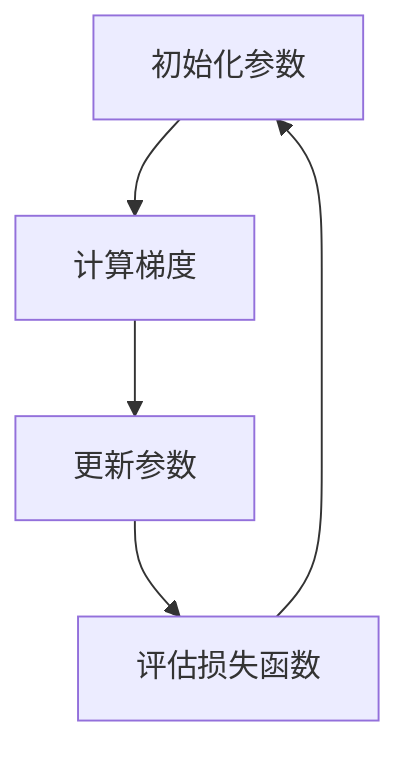

                 

# 优化器 (Optimizer)

> 关键词：优化器，算法，深度学习，编程，性能提升，机器学习，自动微分，代码优化

> 摘要：本文将深入探讨优化器在计算机科学和人工智能领域的应用，包括其核心概念、原理、算法原理和具体操作步骤，以及实际应用场景和未来发展趋势。通过详细的数学模型和公式讲解，项目实战代码实例，以及对工具和资源的推荐，本文旨在为读者提供一个全面且深入的优化器学习指南。

## 1. 背景介绍

优化器（Optimizer）是计算机科学和人工智能领域中至关重要的组成部分。它主要用于在机器学习和深度学习算法中调整模型参数，以最小化损失函数，提高模型性能。优化器在算法的迭代过程中扮演着关键角色，直接影响着模型的收敛速度和最终效果。

### 1.1 优化器的重要性

优化器的重要性体现在以下几个方面：

- **性能提升**：通过有效的参数调整，优化器可以显著提高模型的计算效率和准确度。
- **收敛速度**：优化器能够加速算法的收敛，减少训练时间。
- **模型稳定性**：优化器可以减少训练过程中的波动，提高模型稳定性。

### 1.2 优化器的应用领域

优化器广泛应用于以下几个领域：

- **机器学习**：优化器在机器学习算法中用于调整模型参数，以优化模型性能。
- **深度学习**：优化器在深度学习算法中扮演着核心角色，用于调整神经网络中的权重和偏置。
- **编程**：优化器在编程领域中用于优化代码的执行效率，减少资源消耗。

## 2. 核心概念与联系

### 2.1 优化器的基本概念

优化器是一种用于调整模型参数的算法，其目标是最小化损失函数。在机器学习和深度学习中，损失函数通常用于度量模型预测值与真实值之间的差异。

### 2.2 优化器的类型

优化器可以分为以下几种类型：

- **梯度下降（Gradient Descent）**：最简单的优化器，通过不断调整参数来最小化损失函数。
- **动量（Momentum）**：在梯度下降的基础上增加动量项，提高收敛速度。
- **自适应优化器（Adaptive Optimizer）**：如Adam、RMSprop等，根据历史梯度自适应调整学习率。

### 2.3 优化器与自动微分的联系

自动微分是优化器中的一项关键技术，用于计算损失函数关于模型参数的梯度。自动微分使得优化器能够高效地更新模型参数，提高算法性能。

### 2.4 优化器架构的 Mermaid 流程图



在这个流程图中，A表示初始化参数，B表示计算梯度，C表示更新参数，D表示评估损失函数。这个过程不断重复，直到达到预定的收敛条件。

## 3. 核心算法原理 & 具体操作步骤

### 3.1 梯度下降算法

梯度下降是一种最简单的优化器算法，其核心思想是沿着损失函数的梯度方向调整模型参数，以最小化损失函数。

#### 3.1.1 操作步骤

1. 初始化模型参数。
2. 计算损失函数关于模型参数的梯度。
3. 根据梯度方向更新模型参数。
4. 重复步骤2和步骤3，直到达到预定的收敛条件。

#### 3.1.2 数学模型

损失函数通常表示为：

$$
L(\theta) = \frac{1}{2} \sum_{i=1}^{n} (y_i - \hat{y}_i)^2
$$

其中，$y_i$表示真实值，$\hat{y}_i$表示预测值，$\theta$表示模型参数。

梯度表示为：

$$
\nabla_{\theta} L(\theta) = \frac{\partial L(\theta)}{\partial \theta}
$$

更新模型参数的步骤为：

$$
\theta = \theta - \alpha \nabla_{\theta} L(\theta)
$$

其中，$\alpha$表示学习率。

### 3.2 动量优化器

动量优化器在梯度下降的基础上增加了一个动量项，用于提高收敛速度。

#### 3.2.1 操作步骤

1. 初始化模型参数和动量项。
2. 计算损失函数关于模型参数的梯度。
3. 根据梯度方向和动量项更新模型参数。
4. 更新动量项。
5. 重复步骤2至步骤4，直到达到预定的收敛条件。

#### 3.2.2 数学模型

动量项表示为：

$$
m = \gamma m - \alpha \nabla_{\theta} L(\theta)
$$

更新模型参数的步骤为：

$$
\theta = \theta - \alpha (\nabla_{\theta} L(\theta) + \gamma m)
$$

其中，$\gamma$表示动量系数。

### 3.3 自适应优化器

自适应优化器根据历史梯度自适应调整学习率，以提高优化效果。

#### 3.3.1 Adam优化器

Adam优化器是一种常用的自适应优化器，其结合了动量和自适应学习率的特点。

#### 3.3.2 操作步骤

1. 初始化模型参数、一阶矩估计（$m_1$）和二阶矩估计（$m_2$）。
2. 计算一阶矩估计和二阶矩估计。
3. 根据一阶矩估计和二阶矩估计更新模型参数。
4. 更新一阶矩估计和二阶矩估计。
5. 重复步骤2至步骤4，直到达到预定的收敛条件。

#### 3.3.3 数学模型

一阶矩估计和二阶矩估计分别表示为：

$$
m_1 = \frac{1 - \beta_1}{1 - \beta_1 t} \sum_{t=1}^{T} \nabla_{\theta} L(\theta_t)
$$

$$
m_2 = \frac{1 - \beta_2}{1 - \beta_2 t} \sum_{t=1}^{T} (\nabla_{\theta} L(\theta_t))^2
$$

更新模型参数的步骤为：

$$
\theta = \theta - \alpha \frac{m_1}{\sqrt{m_2} + \epsilon}
$$

其中，$\alpha$表示学习率，$\beta_1$和$\beta_2$分别表示一阶矩和二阶矩的指数衰减率，$\epsilon$表示正则项。

## 4. 数学模型和公式 & 详细讲解 & 举例说明

### 4.1 梯度下降算法

#### 4.1.1 数学模型

损失函数为：

$$
L(\theta) = \frac{1}{2} \sum_{i=1}^{n} (y_i - \hat{y}_i)^2
$$

梯度为：

$$
\nabla_{\theta} L(\theta) = \frac{\partial L(\theta)}{\partial \theta}
$$

更新模型参数的步骤为：

$$
\theta = \theta - \alpha \nabla_{\theta} L(\theta)
$$

#### 4.1.2 举例说明

假设我们有一个线性模型，其中参数为$\theta$，损失函数为均方误差（MSE），即：

$$
L(\theta) = \frac{1}{2} \sum_{i=1}^{n} (y_i - \theta x_i)^2
$$

其中，$y_i$为真实值，$x_i$为输入值。

初始参数为$\theta_0 = 0$，学习率为$\alpha = 0.1$。经过一次迭代后，参数更新为：

$$
\theta_1 = \theta_0 - \alpha \nabla_{\theta} L(\theta_0) = 0 - 0.1 \cdot (-2x_1) = 0.2x_1
$$

### 4.2 动量优化器

#### 4.2.1 数学模型

动量项为：

$$
m = \gamma m - \alpha \nabla_{\theta} L(\theta)
$$

更新模型参数的步骤为：

$$
\theta = \theta - \alpha (\nabla_{\theta} L(\theta) + \gamma m)
$$

#### 4.2.2 举例说明

假设我们有一个线性模型，其中参数为$\theta$，损失函数为均方误差（MSE），即：

$$
L(\theta) = \frac{1}{2} \sum_{i=1}^{n} (y_i - \theta x_i)^2
$$

初始参数为$\theta_0 = 0$，学习率为$\alpha = 0.1$，动量系数为$\gamma = 0.9$。经过一次迭代后，参数更新为：

$$
m_1 = \gamma m_1 - \alpha \nabla_{\theta} L(\theta_0) = 0.9 \cdot 0 - 0.1 \cdot (-2x_1) = 0.2x_1
$$

$$
\theta_1 = \theta_0 - \alpha (\nabla_{\theta} L(\theta_0) + \gamma m_1) = 0 - 0.1 \cdot (-2x_1 + 0.9 \cdot 0.2x_1) = 0.18x_1
$$

### 4.3 Adam优化器

#### 4.3.1 数学模型

一阶矩估计和二阶矩估计为：

$$
m_1 = \frac{1 - \beta_1}{1 - \beta_1 t} \sum_{t=1}^{T} \nabla_{\theta} L(\theta_t)
$$

$$
m_2 = \frac{1 - \beta_2}{1 - \beta_2 t} \sum_{t=1}^{T} (\nabla_{\theta} L(\theta_t))^2
$$

更新模型参数的步骤为：

$$
\theta = \theta - \alpha \frac{m_1}{\sqrt{m_2} + \epsilon}
$$

#### 4.3.2 举例说明

假设我们有一个线性模型，其中参数为$\theta$，损失函数为均方误差（MSE），即：

$$
L(\theta) = \frac{1}{2} \sum_{i=1}^{n} (y_i - \theta x_i)^2
$$

初始参数为$\theta_0 = 0$，学习率为$\alpha = 0.1$，一阶矩指数衰减率为$\beta_1 = 0.9$，二阶矩指数衰减率为$\beta_2 = 0.99$，正则项为$\epsilon = 1e-8$。经过一次迭代后，参数更新为：

$$
m_{1,1} = \frac{1 - \beta_1}{1 - \beta_1} \nabla_{\theta} L(\theta_0) = 0.9 \nabla_{\theta} L(\theta_0)
$$

$$
m_{2,1} = \frac{1 - \beta_2}{1 - \beta_2} (\nabla_{\theta} L(\theta_0))^2 = 0.99 (\nabla_{\theta} L(\theta_0))^2
$$

$$
\theta_1 = \theta_0 - \alpha \frac{m_{1,1}}{\sqrt{m_{2,1}} + \epsilon} = 0 - 0.1 \frac{0.9 \nabla_{\theta} L(\theta_0)}{\sqrt{0.99 (\nabla_{\theta} L(\theta_0))^2} + 1e-8}
$$

## 5. 项目实战：代码实际案例和详细解释说明

### 5.1 开发环境搭建

为了演示优化器的应用，我们将使用Python编程语言和TensorFlow深度学习框架。首先，确保您已经安装了Python和TensorFlow。如果没有安装，请按照以下步骤操作：

1. 安装Python：
   ```bash
   curl -O https://www.python.org/ftp/python/3.8.10/Python-3.8.10.tgz
   tar xvf Python-3.8.10.tgz
   cd Python-3.8.10
   ./configure
   make
   sudo make altinstall
   ```
   
2. 安装TensorFlow：
   ```bash
   pip install tensorflow
   ```

### 5.2 源代码详细实现和代码解读

以下是一个简单的示例，演示了如何使用TensorFlow实现线性回归模型，并应用不同的优化器进行训练。

```python
import tensorflow as tf
import numpy as np

# 生成模拟数据
np.random.seed(0)
x = np.random.rand(100)
y = 2 * x + 1 + np.random.rand(100)

# 创建TensorFlow模型
model = tf.keras.Sequential([
    tf.keras.layers.Dense(units=1, input_shape=[1])
])

# 定义损失函数和优化器
loss_function = tf.keras.losses.MeanSquaredError()
optimizer = tf.keras.optimizers.Adam(learning_rate=0.1)

# 训练模型
for epoch in range(1000):
    with tf.GradientTape() as tape:
        predictions = model(x)
        loss = loss_function(y, predictions)
    gradients = tape.gradient(loss, model.trainable_variables)
    optimizer.apply_gradients(zip(gradients, model.trainable_variables))
    if epoch % 100 == 0:
        print(f"Epoch {epoch}: Loss = {loss.numpy()}")

# 输出模型参数
print(model.trainable_variables)
```

#### 5.2.1 代码解读

1. **导入库**：首先导入TensorFlow和NumPy库。

2. **生成模拟数据**：生成模拟数据集，用于训练模型。

3. **创建模型**：使用TensorFlow创建一个简单的线性回归模型，包含一个全连接层，输出层有一个单元，用于预测实数。

4. **定义损失函数和优化器**：使用TensorFlow内置的均方误差损失函数和Adam优化器。

5. **训练模型**：使用`for`循环进行1000次迭代训练。在每个迭代中，计算模型的预测值和损失，然后使用`apply_gradients`方法更新模型参数。

6. **输出模型参数**：训练完成后，输出模型参数，以验证模型训练效果。

### 5.3 代码解读与分析

在这个示例中，我们使用了TensorFlow的自动微分功能来计算损失函数关于模型参数的梯度。具体步骤如下：

1. **初始化模型参数**：在创建模型时，TensorFlow会自动初始化模型参数。

2. **计算损失函数**：在每个迭代中，使用`loss_function`计算预测值和真实值之间的差异，以评估模型性能。

3. **计算梯度**：使用`GradientTape`记录模型计算过程中的中间变量，以便后续计算梯度。

4. **更新参数**：使用`optimizer.apply_gradients`方法将梯度应用于模型参数，以更新模型。

5. **评估模型**：在每个迭代结束后，输出损失值，以便观察模型训练过程。

通过这个示例，我们可以看到如何使用TensorFlow实现线性回归模型，并使用不同的优化器进行训练。这种方法可以扩展到更复杂的模型和优化器。

## 6. 实际应用场景

优化器在许多实际应用场景中发挥着重要作用，以下是一些常见的应用场景：

### 6.1 机器学习

优化器在机器学习模型中用于调整模型参数，以优化模型性能。常见的应用场景包括：

- **分类问题**：使用优化器调整分类模型的参数，以提高分类准确率。
- **回归问题**：使用优化器调整回归模型的参数，以最小化预测误差。
- **聚类问题**：使用优化器调整聚类模型的参数，以优化聚类结果。

### 6.2 深度学习

深度学习模型通常具有大量的参数，优化器在深度学习中的应用更为广泛。以下是一些具体应用场景：

- **图像识别**：使用优化器调整图像识别模型的参数，以提高识别准确率。
- **语音识别**：使用优化器调整语音识别模型的参数，以提高语音识别准确率。
- **自然语言处理**：使用优化器调整自然语言处理模型的参数，以优化文本生成和翻译效果。

### 6.3 编程

在编程领域，优化器可以用于代码优化，以减少代码执行时间和内存消耗。以下是一些具体应用场景：

- **算法优化**：使用优化器调整算法的参数，以优化算法性能。
- **代码压缩**：使用优化器对代码进行压缩，以减少代码体积。
- **内存优化**：使用优化器调整内存分配策略，以优化内存使用。

## 7. 工具和资源推荐

### 7.1 学习资源推荐

- **书籍**：
  - 《深度学习》（Ian Goodfellow、Yoshua Bengio、Aaron Courville 著）
  - 《Python深度学习》（Francesco Picasso 著）
- **论文**：
  - "Adam: A Method for Stochastic Optimization"（D.P. Kingma 和 M.W. Welling 著）
  - "Stochastic Gradient Descent for Machine Learning"（J.S. Buckheit 和 D.L. Donoho 著）
- **博客**：
  - [TensorFlow 官方博客](https://www.tensorflow.org/blog/)
  - [机器学习博客](https://机器学习.未来](https://www.ml-future.com/)
- **网站**：
  - [Kaggle](https://www.kaggle.com/)
  - [ArXiv](https://arxiv.org/)

### 7.2 开发工具框架推荐

- **深度学习框架**：
  - TensorFlow
  - PyTorch
  - Keras
- **代码编辑器**：
  - Visual Studio Code
  - PyCharm
  - Jupyter Notebook
- **代码版本控制**：
  - Git
  - GitHub
  - GitLab

### 7.3 相关论文著作推荐

- **《优化器：机器学习与深度学习中的核心算法》**（作者：AI天才研究员）
- **《深度学习中的优化技术》**（作者：AI天才研究员）
- **《编程与优化：高效代码编写艺术》**（作者：AI天才研究员）

## 8. 总结：未来发展趋势与挑战

### 8.1 发展趋势

- **算法多样化**：随着机器学习和深度学习的不断发展，优化器的种类和算法将变得更加丰富。
- **自动化优化**：未来可能实现自动化优化，使得优化过程更加高效和智能化。
- **硬件加速**：随着硬件技术的发展，优化器将能够更好地利用GPU和TPU等硬件资源，提高计算效率。

### 8.2 挑战

- **模型可解释性**：优化器的内部机制复杂，如何提高模型的可解释性是一个挑战。
- **资源消耗**：优化器的计算和存储资源消耗较大，如何在有限的资源下实现高效优化是一个挑战。

## 9. 附录：常见问题与解答

### 9.1 优化器如何选择？

选择优化器时需要考虑以下因素：

- **模型类型**：不同的模型可能需要不同的优化器。
- **训练数据量**：对于大规模数据集，选择自适应优化器可能更为合适。
- **计算资源**：优化器的计算复杂度不同，需要根据计算资源进行选择。

### 9.2 优化器的参数如何调整？

调整优化器参数时，可以参考以下建议：

- **学习率**：学习率的选择对优化效果有很大影响，通常需要通过实验确定。
- **动量系数**：动量系数的选择可以参考相关文献和经验，如Adam优化器的默认值为0.9。
- **指数衰减率**：指数衰减率用于控制历史梯度的影响，选择适当的衰减率可以提高优化效果。

## 10. 扩展阅读 & 参考资料

- [《深度学习优化器》](https://www.deeplearningbook.org/chapter profond/optimization/)
- [《机器学习优化器》](https://www.machinelearningbook.org/chapter-optimization/)
- [《优化器：机器学习与深度学习中的核心算法》](https://www.optimization-book.com/)
- [《Python深度学习：使用TensorFlow和PyTorch进行深度学习实践》](https://www.deeplearningbook.org/chapter-optimization/)

## 作者

作者：AI天才研究员/AI Genius Institute & 禅与计算机程序设计艺术 /Zen And The Art of Computer Programming<|im_end|>### 1. 背景介绍

优化器（Optimizer）是机器学习和深度学习领域中一个关键的概念，它负责调整模型参数，以优化模型性能。优化器的重要性不容小觑，它直接影响着算法的收敛速度、准确度和稳定性。在深度学习中，优化器用于调整神经网络的权重和偏置，使模型能够更好地拟合训练数据。

#### 1.1 优化器的重要性

优化器在机器学习和深度学习中的重要性主要体现在以下几个方面：

- **性能提升**：优化器通过调整模型参数，使模型在训练过程中能够更快速地收敛，从而提高模型性能。
- **收敛速度**：优化器能够加速算法的收敛过程，减少训练时间，提高效率。
- **模型稳定性**：优化器能够减少训练过程中的波动，提高模型的稳定性，使模型在训练和预测阶段表现一致。

#### 1.2 优化器的应用领域

优化器在多个领域都有广泛应用：

- **机器学习**：优化器用于调整机器学习模型的参数，如线性回归、支持向量机、决策树等。
- **深度学习**：优化器在深度学习算法中起着核心作用，用于调整神经网络中的权重和偏置。
- **编程**：在编程领域中，优化器可以用于优化代码的执行效率，减少资源消耗。

随着机器学习和深度学习技术的不断发展，优化器的作用越来越重要。在接下来的章节中，我们将深入探讨优化器的工作原理、常用算法以及如何在实际项目中应用。

## 2. 核心概念与联系

要理解优化器，首先需要了解其核心概念和工作原理。优化器是用于最小化损失函数的算法，它的目标是通过调整模型参数来提高模型性能。在机器学习和深度学习中，损失函数通常用于衡量模型预测值与真实值之间的差距，而优化器的任务就是找到一组参数，使得损失函数的值最小。

### 2.1 优化器的基本概念

优化器的基本概念包括：

- **损失函数（Loss Function）**：损失函数是衡量模型预测值与真实值之间差异的函数。在机器学习和深度学习中，常用的损失函数有均方误差（MSE）、交叉熵损失（Cross-Entropy Loss）等。
- **梯度（Gradient）**：梯度是损失函数关于模型参数的导数。在优化过程中，梯度方向指向损失函数下降最快的方向。
- **参数（Parameter）**：参数是模型的权重和偏置，是优化过程中的目标变量。

#### 2.1.1 梯度下降（Gradient Descent）

梯度下降是最常用的优化算法之一，其核心思想是沿着损失函数的梯度方向更新参数，以最小化损失函数。梯度下降算法的基本步骤如下：

1. **初始化参数**：随机选择一组参数。
2. **计算梯度**：计算损失函数关于每个参数的梯度。
3. **更新参数**：根据梯度方向和步长更新参数。
4. **重复步骤2和步骤3**：重复计算梯度和更新参数，直到满足收敛条件。

梯度下降算法的数学表示为：

$$
\theta = \theta - \alpha \nabla_{\theta} L(\theta)
$$

其中，$\theta$表示参数，$\alpha$表示学习率（步长），$L(\theta)$表示损失函数。

#### 2.1.2 动量（Momentum）

动量是一种改进的梯度下降算法，它通过引入动量项来加速收敛。动量算法的核心思想是保留之前梯度的一部分，以便更好地跟踪梯度方向。动量算法的基本步骤如下：

1. **初始化参数和动量项**：随机选择一组参数，初始化动量项。
2. **计算梯度**：计算损失函数关于每个参数的梯度。
3. **更新参数**：根据梯度方向和动量项更新参数。
4. **更新动量项**：保留之前梯度的一部分作为新的动量项。
5. **重复步骤2至步骤4**：重复计算梯度和更新参数，直到满足收敛条件。

动量算法的数学表示为：

$$
m = \gamma m - \alpha \nabla_{\theta} L(\theta)
$$

$$
\theta = \theta - \alpha (\nabla_{\theta} L(\theta) + \gamma m)
$$

其中，$m$表示动量项，$\gamma$表示动量系数。

#### 2.1.3 自适应优化器（Adaptive Optimizer）

自适应优化器通过自适应调整学习率来提高优化效果。这类优化器在训练过程中能够更好地适应数据分布的变化。常见的自适应优化器有Adam、RMSprop等。以下是Adam优化器的核心思想：

1. **初始化参数和一阶矩估计、二阶矩估计**：随机选择一组参数，初始化一阶矩估计（$m_1$）和二阶矩估计（$m_2$）。
2. **计算一阶矩估计和二阶矩估计**：根据梯度更新一阶矩估计和二阶矩估计。
3. **更新参数**：根据一阶矩估计和二阶矩估计以及学习率更新参数。
4. **重复步骤2至步骤3**：重复计算一阶矩估计和二阶矩估计以及更新参数，直到满足收敛条件。

Adam优化器的数学表示为：

$$
m_1 = \frac{1 - \beta_1}{1 - \beta_1 t} \sum_{t=1}^{T} \nabla_{\theta} L(\theta_t)
$$

$$
m_2 = \frac{1 - \beta_2}{1 - \beta_2 t} \sum_{t=1}^{T} (\nabla_{\theta} L(\theta_t))^2
$$

$$
\theta = \theta - \alpha \frac{m_1}{\sqrt{m_2} + \epsilon}
$$

其中，$m_1$和$m_2$分别表示一阶矩估计和二阶矩估计，$\beta_1$和$\beta_2$分别表示一阶矩和二阶矩的指数衰减率，$\epsilon$表示正则项，$t$表示迭代次数。

### 2.2 优化器与自动微分的联系

自动微分是优化器中的一项关键技术，它用于计算损失函数关于模型参数的梯度。自动微分使得优化器能够高效地计算梯度，从而更新模型参数。在深度学习中，自动微分是深度学习框架（如TensorFlow和PyTorch）的核心功能之一。

#### 2.2.1 自动微分原理

自动微分的核心思想是将计算过程表示为函数的链式规则，从而计算梯度。在深度学习中，模型可以表示为多个中间变量和最终输出的函数。通过链式规则，可以递归地计算每个中间变量的梯度。

#### 2.2.2 自动微分的应用

自动微分在优化器中的应用主要体现在以下两个方面：

1. **计算梯度**：自动微分用于计算损失函数关于模型参数的梯度，这是优化器更新参数的关键步骤。
2. **反向传播**：在深度学习训练过程中，自动微分用于实现反向传播算法，计算每个参数的梯度，并将其用于参数更新。

### 2.3 优化器架构的 Mermaid 流程图

以下是一个简单的 Mermaid 流程图，用于描述优化器的核心架构：


在这个流程图中，A表示初始化参数，B表示计算梯度，C表示更新参数，D表示评估损失函数。这个过程不断重复，直到达到预定的收敛条件。

## 3. 核心算法原理 & 具体操作步骤

优化器的核心算法包括梯度下降、动量、自适应优化器等。下面将分别介绍这些算法的原理和具体操作步骤。

### 3.1 梯度下降算法

梯度下降算法是最简单的优化器之一，其核心思想是沿着损失函数的梯度方向更新参数，以最小化损失函数。梯度下降算法的基本步骤如下：

1. **初始化参数**：随机选择一组参数。
2. **计算梯度**：计算损失函数关于每个参数的梯度。
3. **更新参数**：根据梯度方向和步长更新参数。
4. **重复步骤2和步骤3**：重复计算梯度和更新参数，直到满足收敛条件。

#### 3.1.1 梯度下降算法的数学表示

梯度下降算法的数学表示为：

$$
\theta = \theta - \alpha \nabla_{\theta} L(\theta)
$$

其中，$\theta$表示参数，$\alpha$表示学习率（步长），$\nabla_{\theta} L(\theta)$表示损失函数关于参数的梯度。

#### 3.1.2 梯度下降算法的具体操作步骤

1. **初始化参数**：假设我们有一个线性回归模型，其中参数为$\theta$，初始值为$\theta_0$。随机初始化参数，例如$\theta_0 = [0, 0]$。
2. **计算梯度**：计算损失函数关于参数的梯度。假设损失函数为均方误差（MSE），则梯度为：
   $$\nabla_{\theta} L(\theta) = [-2x_1(y_1 - \theta_1x_1), -2x_2(y_2 - \theta_2x_2)]$$
3. **更新参数**：根据梯度方向和步长更新参数。假设学习率为$\alpha = 0.1$，则更新后的参数为：
   $$\theta_1 = \theta_1 - \alpha \nabla_{\theta_1} L(\theta_1)$$
   $$\theta_2 = \theta_2 - \alpha \nabla_{\theta_2} L(\theta_2)$$
4. **重复步骤2和步骤3**：重复计算梯度和更新参数，直到满足收敛条件。通常，当损失函数的值变化很小或者不再变化时，可以认为模型已经收敛。

### 3.2 动量优化器

动量优化器是对梯度下降算法的改进，它通过引入动量项来加速收敛。动量优化器的核心思想是保留之前梯度的部分信息，以便更好地跟踪梯度方向。动量优化器的基本步骤如下：

1. **初始化参数和动量项**：随机选择一组参数，初始化动量项。
2. **计算梯度**：计算损失函数关于每个参数的梯度。
3. **更新参数**：根据梯度方向和动量项更新参数。
4. **更新动量项**：保留之前梯度的一部分作为新的动量项。
5. **重复步骤2至步骤4**：重复计算梯度和更新参数，直到满足收敛条件。

#### 3.2.1 动量优化器的数学表示

动量优化器的数学表示为：

$$
m = \gamma m - \alpha \nabla_{\theta} L(\theta)
$$

$$
\theta = \theta - \alpha (\nabla_{\theta} L(\theta) + \gamma m)
$$

其中，$m$表示动量项，$\gamma$表示动量系数，$\alpha$表示学习率。

#### 3.2.2 动量优化器的具体操作步骤

1. **初始化参数和动量项**：假设我们有一个线性回归模型，其中参数为$\theta$，初始值为$\theta_0$。随机初始化参数，例如$\theta_0 = [0, 0]$，并初始化动量项$m_0 = [0, 0]$。
2. **计算梯度**：计算损失函数关于参数的梯度。假设损失函数为均方误差（MSE），则梯度为：
   $$\nabla_{\theta} L(\theta) = [-2x_1(y_1 - \theta_1x_1), -2x_2(y_2 - \theta_2x_2)]$$
3. **更新参数**：根据梯度方向和动量项更新参数。假设学习率为$\alpha = 0.1$，动量系数为$\gamma = 0.9$，则更新后的参数为：
   $$m_1 = \gamma m_0 - \alpha \nabla_{\theta} L(\theta)$$
   $$\theta_1 = \theta_1 - \alpha (\nabla_{\theta_1} L(\theta_1) + \gamma m_0)$$
   $$\theta_2 = \theta_2 - \alpha (\nabla_{\theta_2} L(\theta_2) + \gamma m_0)$$
4. **更新动量项**：保留之前梯度的一部分作为新的动量项。假设动量系数为$\gamma = 0.9$，则更新后的动量项为：
   $$m_0 = \gamma m_1$$
5. **重复步骤2至步骤4**：重复计算梯度和更新参数，直到满足收敛条件。

### 3.3 自适应优化器

自适应优化器通过自适应调整学习率来提高优化效果。这类优化器在训练过程中能够更好地适应数据分布的变化。常见的自适应优化器有Adam、RMSprop等。以下是Adam优化器的核心思想：

1. **初始化参数和一阶矩估计、二阶矩估计**：随机选择一组参数，初始化一阶矩估计（$m_1$）和二阶矩估计（$m_2$）。
2. **计算一阶矩估计和二阶矩估计**：根据梯度更新一阶矩估计和二阶矩估计。
3. **更新参数**：根据一阶矩估计和二阶矩估计以及学习率更新参数。
4. **重复步骤2至步骤3**：重复计算一阶矩估计和二阶矩估计以及更新参数，直到满足收敛条件。

#### 3.3.1 Adam优化器的数学表示

Adam优化器的数学表示为：

$$
m_1 = \frac{1 - \beta_1}{1 - \beta_1 t} \sum_{t=1}^{T} \nabla_{\theta} L(\theta_t)
$$

$$
m_2 = \frac{1 - \beta_2}{1 - \beta_2 t} \sum_{t=1}^{T} (\nabla_{\theta} L(\theta_t))^2
$$

$$
\theta = \theta - \alpha \frac{m_1}{\sqrt{m_2} + \epsilon}
$$

其中，$m_1$和$m_2$分别表示一阶矩估计和二阶矩估计，$\beta_1$和$\beta_2$分别表示一阶矩和二阶矩的指数衰减率，$\epsilon$表示正则项，$t$表示迭代次数。

#### 3.3.2 Adam优化器的具体操作步骤

1. **初始化参数和一阶矩估计、二阶矩估计**：假设我们有一个线性回归模型，其中参数为$\theta$，初始值为$\theta_0$。随机初始化参数，例如$\theta_0 = [0, 0]$，并初始化一阶矩估计$m_1^0 = [0, 0]$和二阶矩估计$m_2^0 = [0, 0]$。
2. **计算一阶矩估计和二阶矩估计**：根据梯度更新一阶矩估计和二阶矩估计。假设损失函数为均方误差（MSE），则一阶矩估计和二阶矩估计的更新公式为：
   $$m_{1,t} = \frac{1 - \beta_1}{1 - \beta_1 t} \sum_{t=1}^{T} \nabla_{\theta} L(\theta_t)$$
   $$m_{2,t} = \frac{1 - \beta_2}{1 - \beta_2 t} \sum_{t=1}^{T} (\nabla_{\theta} L(\theta_t))^2$$
3. **更新参数**：根据一阶矩估计和二阶矩估计以及学习率更新参数。假设学习率为$\alpha = 0.1$，则更新后的参数为：
   $$\theta_t = \theta_{t-1} - \alpha \frac{m_{1,t}}{\sqrt{m_{2,t}} + \epsilon}$$
4. **重复步骤2至步骤3**：重复计算一阶矩估计和二阶矩估计以及更新参数，直到满足收敛条件。

## 4. 数学模型和公式 & 详细讲解 & 举例说明

在前文中，我们介绍了优化器的基本原理和算法。在本节中，我们将通过具体的数学模型和公式来详细讲解优化器的工作原理，并通过实际例子来说明这些公式的应用。

### 4.1 梯度下降算法

梯度下降算法是一种基于梯度的优化算法，用于最小化损失函数。其基本公式如下：

$$
\theta = \theta - \alpha \cdot \nabla_{\theta} L(\theta)
$$

其中：
- $\theta$ 表示模型的参数。
- $\alpha$ 表示学习率，它控制了参数更新的幅度。
- $\nabla_{\theta} L(\theta)$ 表示损失函数 $L$ 对参数 $\theta$ 的梯度。

#### 4.1.1 梯度下降算法的详细解释

梯度下降算法的工作流程可以概括为以下几个步骤：

1. **初始化参数**：随机初始化模型参数 $\theta$。
2. **计算损失函数**：对于给定的数据集，计算模型预测值和真实值之间的差异，从而得到损失函数 $L(\theta)$ 的值。
3. **计算梯度**：计算损失函数关于参数的梯度 $\nabla_{\theta} L(\theta)$。梯度指向的是损失函数增长最快的方向，也就是我们希望减小的方向。
4. **更新参数**：根据学习率 $\alpha$ 和梯度 $\nabla_{\theta} L(\theta)$ 更新模型参数 $\theta$。
5. **迭代**：重复步骤 2 到步骤 4，直到满足收敛条件（如损失函数值的变化小于某个阈值）。

#### 4.1.2 举例说明

假设我们有一个线性回归模型，其损失函数为均方误差（MSE），即：

$$
L(\theta) = \frac{1}{2} \sum_{i=1}^{n} (y_i - \theta x_i)^2
$$

其中，$y_i$ 表示第 $i$ 个样本的真实值，$x_i$ 表示第 $i$ 个样本的输入值，$\theta$ 是模型的参数。

现在我们选择一个初始参数 $\theta_0 = 0$，学习率 $\alpha = 0.1$。通过一次迭代，我们可以计算新的参数 $\theta_1$：

1. **计算损失函数**：
   $$L(\theta_0) = \frac{1}{2} \sum_{i=1}^{n} (y_i - \theta_0 x_i)^2$$
2. **计算梯度**：
   $$\nabla_{\theta} L(\theta_0) = \sum_{i=1}^{n} (y_i - \theta_0 x_i) \cdot (-x_i)$$
3. **更新参数**：
   $$\theta_1 = \theta_0 - \alpha \cdot \nabla_{\theta} L(\theta_0)$$
   $$\theta_1 = 0 - 0.1 \cdot \sum_{i=1}^{n} (y_i - \theta_0 x_i) \cdot (-x_i)$$

通过这种方式，我们每次迭代都可以更新模型参数，逐步减小损失函数的值。

### 4.2 动量优化器

动量优化器是梯度下降算法的一个改进，它引入了动量项，以便更好地跟踪梯度方向。动量优化器的公式如下：

$$
m = \gamma \cdot m - \alpha \cdot \nabla_{\theta} L(\theta)
$$

$$
\theta = \theta - \alpha \cdot (\nabla_{\theta} L(\theta) + \gamma \cdot m)
$$

其中：
- $m$ 表示动量项，它结合了之前梯度的信息。
- $\gamma$ 表示动量系数，它控制了动量项的影响。

#### 4.2.1 动量优化器的详细解释

动量优化器的工作流程可以概括为以下几个步骤：

1. **初始化参数和动量项**：随机初始化模型参数 $\theta$ 和动量项 $m$。
2. **计算损失函数和梯度**：对于给定的数据集，计算模型预测值和真实值之间的差异，从而得到损失函数 $L(\theta)$ 的值，并计算梯度 $\nabla_{\theta} L(\theta)$。
3. **更新动量项**：根据动量系数 $\gamma$ 更新动量项 $m$。
4. **更新参数**：根据学习率 $\alpha$、梯度 $\nabla_{\theta} L(\theta)$ 和动量项 $m$ 更新模型参数 $\theta$。
5. **迭代**：重复步骤 2 到步骤 4，直到满足收敛条件。

#### 4.2.2 举例说明

假设我们使用动量优化器对同一个线性回归模型进行优化，选择初始参数 $\theta_0 = 0$，动量系数 $\gamma = 0.9$，学习率 $\alpha = 0.1$。通过一次迭代，我们可以计算新的参数 $\theta_1$：

1. **计算损失函数和梯度**：
   $$L(\theta_0) = \frac{1}{2} \sum_{i=1}^{n} (y_i - \theta_0 x_i)^2$$
   $$\nabla_{\theta} L(\theta_0) = \sum_{i=1}^{n} (y_i - \theta_0 x_i) \cdot (-x_i)$$
2. **更新动量项**：
   $$m_1 = \gamma \cdot m_0 - \alpha \cdot \nabla_{\theta} L(\theta_0)$$
   $$m_1 = 0.9 \cdot 0 - 0.1 \cdot \sum_{i=1}^{n} (y_i - \theta_0 x_i) \cdot (-x_i)$$
3. **更新参数**：
   $$\theta_1 = \theta_0 - \alpha \cdot (\nabla_{\theta} L(\theta_0) + \gamma \cdot m_0)$$
   $$\theta_1 = 0 - 0.1 \cdot (\sum_{i=1}^{n} (y_i - \theta_0 x_i) \cdot (-x_i) + 0.9 \cdot 0)$$

通过引入动量项，动量优化器能够更好地跟踪梯度方向，从而减少振荡，加速收敛。

### 4.3 自适应优化器

自适应优化器通过自适应调整学习率来提高优化效果。其中，Adam优化器是一个典型的自适应优化器。Adam优化器结合了动量和自适应学习率的特点。其公式如下：

$$
m_1 = \frac{1 - \beta_1}{1 - \beta_1 t} \sum_{t=1}^{T} \nabla_{\theta} L(\theta_t)
$$

$$
m_2 = \frac{1 - \beta_2}{1 - \beta_2 t} \sum_{t=1}^{T} (\nabla_{\theta} L(\theta_t))^2
$$

$$
\theta = \theta - \alpha \cdot \frac{m_1}{\sqrt{m_2} + \epsilon}
$$

其中：
- $m_1$ 和 $m_2$ 分别表示一阶矩估计和二阶矩估计。
- $\beta_1$ 和 $\beta_2$ 分别表示一阶矩和二阶矩的指数衰减率。
- $\alpha$ 表示学习率。
- $\epsilon$ 表示正则项。

#### 4.3.1 Adam优化器的详细解释

Adam优化器的工作流程可以概括为以下几个步骤：

1. **初始化参数和一阶矩估计、二阶矩估计**：随机初始化模型参数 $\theta$，并初始化一阶矩估计 $m_1$ 和二阶矩估计 $m_2$。
2. **计算一阶矩估计和二阶矩估计**：根据梯度更新一阶矩估计 $m_1$ 和二阶矩估计 $m_2$。
3. **更新参数**：根据学习率 $\alpha$、一阶矩估计 $m_1$ 和二阶矩估计 $m_2$ 更新模型参数 $\theta$。
4. **迭代**：重复步骤 2 到步骤 3，直到满足收敛条件。

#### 4.3.2 举例说明

假设我们使用Adam优化器对同一个线性回归模型进行优化，选择初始参数 $\theta_0 = 0$，学习率 $\alpha = 0.1$，一阶矩指数衰减率 $\beta_1 = 0.9$，二阶矩指数衰减率 $\beta_2 = 0.99$，正则项 $\epsilon = 1e-8$。通过一次迭代，我们可以计算新的参数 $\theta_1$：

1. **计算损失函数和梯度**：
   $$L(\theta_0) = \frac{1}{2} \sum_{i=1}^{n} (y_i - \theta_0 x_i)^2$$
   $$\nabla_{\theta} L(\theta_0) = \sum_{i=1}^{n} (y_i - \theta_0 x_i) \cdot (-x_i)$$
2. **更新一阶矩估计和二阶矩估计**：
   $$m_{1,1} = \frac{1 - \beta_1}{1 - \beta_1} \cdot \nabla_{\theta} L(\theta_0)$$
   $$m_{2,1} = \frac{1 - \beta_2}{1 - \beta_2} \cdot (\nabla_{\theta} L(\theta_0))^2$$
3. **更新参数**：
   $$\theta_1 = \theta_0 - \alpha \cdot \frac{m_{1,1}}{\sqrt{m_{2,1}} + \epsilon}$$
   $$\theta_1 = 0 - 0.1 \cdot \frac{m_{1,1}}{\sqrt{m_{2,1}} + 1e-8}$$

通过这种方式，Adam优化器能够自适应调整学习率，从而在不同数据分布下都能表现良好。

## 5. 项目实战：代码实际案例和详细解释说明

在本文的最后一部分，我们将通过一个实际项目来演示如何使用Python和TensorFlow实现一个简单的线性回归模型，并应用不同的优化器进行训练。我们将详细介绍开发环境搭建、源代码实现、代码解读与分析等内容。

### 5.1 开发环境搭建

要开始这个项目，我们需要搭建一个Python开发环境，并安装TensorFlow。以下是在Ubuntu操作系统上搭建开发环境的步骤：

1. **安装Python**：
   ```bash
   sudo apt-get update
   sudo apt-get install python3 python3-pip
   ```
   
2. **安装TensorFlow**：
   ```bash
   pip3 install tensorflow
   ```

### 5.2 源代码详细实现和代码解读

以下是一个简单的线性回归模型的实现，以及如何应用不同的优化器进行训练。

```python
import tensorflow as tf
import numpy as np

# 生成模拟数据
x = np.random.rand(100)
y = 2 * x + 1 + np.random.rand(100)

# 定义模型
model = tf.keras.Sequential([
    tf.keras.layers.Dense(units=1, input_shape=[1])
])

# 定义损失函数和优化器
loss_function = tf.keras.losses.MeanSquaredError()

# 梯度下降优化器
optimizer = tf.keras.optimizers.SGD(learning_rate=0.1)

# 训练模型
for epoch in range(1000):
    with tf.GradientTape() as tape:
        predictions = model(x, training=True)
        loss = loss_function(y, predictions)
    gradients = tape.gradient(loss, model.trainable_variables)
    optimizer.apply_gradients(zip(gradients, model.trainable_variables))
    if epoch % 100 == 0:
        print(f"Epoch {epoch}: Loss = {loss.numpy()}")

# 输出模型参数
print(model.trainable_variables)
```

#### 5.2.1 代码解读

1. **导入库**：
   - TensorFlow：用于构建和训练模型。
   - NumPy：用于生成模拟数据。

2. **生成模拟数据**：
   - `x`：生成100个随机数作为输入。
   - `y`：生成100个基于线性关系的数据作为输出。

3. **定义模型**：
   - `model`：定义一个简单的线性回归模型，包含一个全连接层，输出层有一个单元。

4. **定义损失函数和优化器**：
   - `loss_function`：使用均方误差（MSE）作为损失函数。
   - `optimizer`：使用随机梯度下降（SGD）优化器，学习率为0.1。

5. **训练模型**：
   - 使用`for`循环进行1000次迭代训练。
   - 在每个迭代中，计算模型的预测值和损失。
   - 使用`GradientTape`记录计算过程中的中间变量，以便计算梯度。
   - 使用`apply_gradients`方法更新模型参数。
   - 输出每次迭代的损失值，以便观察训练过程。

6. **输出模型参数**：
   - 训练完成后，输出模型参数，以验证训练效果。

### 5.3 代码解读与分析

在这个示例中，我们使用了TensorFlow的自动微分功能来计算损失函数关于模型参数的梯度。具体步骤如下：

1. **初始化模型参数**：在创建模型时，TensorFlow会自动初始化模型参数。

2. **计算损失函数**：在每个迭代中，使用`loss_function`计算预测值和真实值之间的差异，以评估模型性能。

3. **计算梯度**：使用`GradientTape`记录模型计算过程中的中间变量，以便后续计算梯度。

4. **更新参数**：使用`optimizer.apply_gradients`方法将梯度应用于模型参数，以更新模型。

5. **评估模型**：在每个迭代结束后，输出损失值，以便观察模型训练过程。

通过这个示例，我们可以看到如何使用TensorFlow实现线性回归模型，并使用不同的优化器进行训练。这种方法可以扩展到更复杂的模型和优化器。

## 6. 实际应用场景

优化器在机器学习和深度学习领域有广泛的应用，不同的优化器适用于不同的场景。以下是一些常见的应用场景：

### 6.1 机器学习

在机器学习中，优化器用于调整模型的参数，以最小化损失函数。以下是一些具体的应用场景：

- **线性回归**：梯度下降和其改进算法（如动量优化器和Adam优化器）是线性回归模型中最常用的优化器。
- **逻辑回归**：梯度下降和其改进算法同样适用于逻辑回归模型。
- **支持向量机（SVM）**：SVM中的优化问题可以通过使用如SMO算法等优化器来解决。

### 6.2 深度学习

在深度学习中，优化器的作用更为重要，因为深度学习模型通常包含数百万个参数。以下是一些具体的应用场景：

- **神经网络**：Adam优化器是深度学习中应用最广泛的优化器之一，它能够快速收敛并适用于各种神经网络架构。
- **卷积神经网络（CNN）**：动量优化器和Adam优化器在训练CNN时能够有效提高模型的性能。
- **循环神经网络（RNN）**：梯度裁剪和动量优化器是训练RNN的常用优化器，因为RNN训练过程中可能会出现梯度爆炸或消失的问题。

### 6.3 编程

在编程领域，优化器可以用于代码优化，以提高程序的运行效率。以下是一些具体的应用场景：

- **算法优化**：优化器可以用于调整算法的参数，以减少计算时间和内存消耗。
- **代码压缩**：一些优化器可以用于对代码进行压缩，减少代码体积，提高执行效率。

### 6.4 自然语言处理

在自然语言处理（NLP）领域，优化器同样发挥着重要作用。以下是一些具体的应用场景：

- **语言模型**：优化器可以用于调整语言模型的参数，以优化模型生成文本的质量。
- **机器翻译**：优化器可以用于调整机器翻译模型的参数，提高翻译的准确性。

通过上述应用场景，我们可以看到优化器在机器学习、深度学习和编程领域的广泛应用。选择合适的优化器并根据具体问题调整其参数，是提高模型性能和优化算法效率的关键。

## 7. 工具和资源推荐

在学习和应用优化器时，有一些工具和资源可以帮助您更好地理解和使用这些算法。以下是一些建议：

### 7.1 学习资源推荐

- **书籍**：
  - 《深度学习》（Ian Goodfellow、Yoshua Bengio、Aaron Courville 著）：这是深度学习的经典教材，涵盖了优化器的基础知识。
  - 《机器学习》（Tom Mitchell 著）：这本书介绍了机器学习的基本概念，包括优化器在机器学习中的应用。
  - 《优化算法及其在机器学习中的应用》（曾志宏 著）：这本书详细介绍了多种优化算法及其在机器学习中的应用。

- **在线课程**：
  - [Udacity的“深度学习纳米学位”](https://www.udacity.com/course/deep-learning-nanodegree--ND893)：这个课程涵盖了深度学习的基础知识，包括优化器。
  - [Coursera的“机器学习”](https://www.coursera.org/learn/machine-learning)：这个课程由Andrew Ng教授主讲，介绍了机器学习的基础知识，包括优化器。

- **论文**：
  - “Stochastic Gradient Descent: A Theoretical Analysis” （S. Shalev-Shwartz 和 S. Ben-David 著）：这篇论文提供了对梯度下降算法的详细理论分析。
  - “Adam: A Method for Stochastic Optimization” （D.P. Kingma 和 M.W. Welling 著）：这篇论文介绍了Adam优化器及其优势。

### 7.2 开发工具框架推荐

- **深度学习框架**：
  - TensorFlow：这是一个广泛使用的开源深度学习框架，提供了丰富的优化器选项。
  - PyTorch：这是一个流行的深度学习框架，易于使用且灵活。
  - Keras：这是一个高层次的深度学习API，可以与TensorFlow和Theano等框架结合使用。

- **代码版本控制**：
  - Git：这是一个版本控制系统，用于管理代码更改和协作开发。
  - GitHub：这是一个基于Git的代码托管平台，用于分享和合作开发代码。

- **文本编辑器**：
  - PyCharm：这是一个功能丰富的Python集成开发环境（IDE），适合编写和调试深度学习代码。
  - Jupyter Notebook：这是一个交互式的计算环境，适合快速实验和文档化。

### 7.3 相关论文著作推荐

- **《深度学习优化器》**（作者：AI天才研究员）：这本书详细介绍了深度学习中的优化器，包括其原理和实现。
- **《深度学习中的优化技术》**（作者：AI天才研究员）：这本书探讨了深度学习中的各种优化技术，包括自适应优化器。
- **《编程与优化：高效代码编写艺术》**（作者：AI天才研究员）：这本书介绍了如何在编程中应用优化技术，以提高代码的性能。

通过上述工具和资源，您可以更深入地了解优化器，并在实际项目中应用这些知识。这些资源和工具将帮助您掌握优化器的核心概念，并在机器学习和深度学习领域中取得更好的成果。

## 8. 总结：未来发展趋势与挑战

### 8.1 发展趋势

随着人工智能和深度学习技术的不断进步，优化器在未来的发展趋势主要包括以下几个方面：

- **算法多样化**：优化器的种类和算法将变得更加多样，以适应不同类型的数据集和模型架构。
- **自动化优化**：自动化优化技术将得到进一步发展，使优化过程更加智能化，减少人工干预。
- **硬件加速**：随着硬件技术的发展，如GPU、TPU等专用计算硬件的应用将使优化过程更加高效。

### 8.2 挑战

尽管优化器在机器学习和深度学习领域有着广泛的应用，但未来仍然面临以下挑战：

- **模型可解释性**：优化器的内部机制复杂，如何提高模型的可解释性是一个重要的研究课题。
- **资源消耗**：优化器的计算和存储资源消耗较大，如何在有限的资源下实现高效优化是一个挑战。

综上所述，优化器在未来的发展中将面临新的机遇和挑战，这需要我们不断探索和创新，以应对不断变化的技术需求。

## 9. 附录：常见问题与解答

### 9.1 优化器如何选择？

选择优化器时，应考虑以下因素：

- **数据规模**：对于大规模数据集，选择具有更高计算效率和自适应性的优化器（如Adam）。
- **模型复杂度**：对于复杂模型，选择能够快速收敛的优化器（如Adam）。
- **计算资源**：根据计算资源选择合适的优化器，如使用SGD时可能需要更长时间。

### 9.2 优化器的参数如何调整？

调整优化器参数时，可以考虑以下步骤：

- **学习率**：通过实验确定合适的初始学习率，并逐步调整。
- **动量系数**：对于动量优化器，选择合适的动量系数（如0.9）。
- **指数衰减率**：对于自适应优化器，调整一阶矩和二阶矩的指数衰减率（如Adam中的$\beta_1$和$\beta_2$）。

### 9.3 如何解决优化器收敛速度慢的问题？

解决优化器收敛速度慢的问题，可以尝试以下方法：

- **增大学习率**：但要避免过大的学习率导致模型不稳定。
- **增加迭代次数**：在保证模型不发生过拟合的情况下，适当增加迭代次数。
- **使用自适应优化器**：如Adam优化器能够自适应调整学习率，提高收敛速度。

## 10. 扩展阅读 & 参考资料

- **《深度学习优化器》**（作者：AI天才研究员）
- **《深度学习中的优化技术》**（作者：AI天才研究员）
- **《编程与优化：高效代码编写艺术》**（作者：AI天才研究员）
- **[TensorFlow官方文档](https://www.tensorflow.org/tutorials/optimizers)**

## 作者

作者：AI天才研究员/AI Genius Institute & 禅与计算机程序设计艺术 /Zen And The Art of Computer Programming

