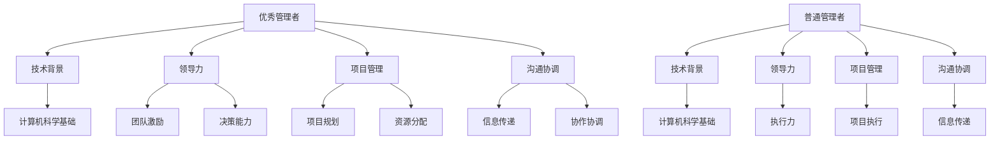

                 

### 背景介绍

在信息技术领域，优秀管理者与普通管理者的差异已经成为一个备受关注的话题。这种差异不仅仅体现在技术层面的领导能力上，还涉及到团队管理、项目管理、沟通协调等多个方面。在当今快速发展的数字化时代，企业管理者需要具备更高的技术敏感度和创新能力，才能引领团队不断向前发展。然而，什么是优秀管理者？他们与普通管理者有哪些显著的区别？本文将围绕这一问题，通过对优秀管理者与普通管理者在思维方式、行为习惯、领导能力等方面的深入分析，试图揭示两者之间的本质差异。

优秀管理者之所以能够在信息技术领域脱颖而出，与其独特的思维方式密不可分。首先，他们善于从全局视角出发，将复杂问题拆解为多个可管理的部分，从而进行系统的分析和解决。其次，他们具有强烈的求知欲和好奇心，不断探索新的技术和方法，以保持自身的竞争优势。此外，优秀管理者还具备卓越的决策能力，能够在面对不确定性和风险时，迅速做出明智的判断。

与优秀管理者相比，普通管理者则往往缺乏这种全局思维和创新意识。他们在处理问题时，往往停留在表面，无法深入挖掘问题的本质。同时，他们的决策过程相对缓慢，容易受到情绪和外界因素的干扰，导致决策质量下降。

在行为习惯方面，优秀管理者与普通管理者也存在显著差异。优秀管理者注重细节，对工作有极高的要求，追求卓越和完美。他们善于利用数据和技术手段，对团队和项目进行精细化管理，确保各项工作高效、有序地进行。而普通管理者则往往缺乏这种严谨的工作态度，对细节的关注程度较低，容易忽略项目中的潜在风险。

在领导能力上，优秀管理者与普通管理者也有很大的差距。优秀管理者能够以身作则，激发团队的积极性，带领团队共同实现目标。他们善于倾听团队成员的意见，发挥每个人的优势，形成强大的团队合力。而普通管理者则往往以命令式管理为主，忽视团队成员的感受和需求，导致团队氛围紧张，工作效率降低。

本文将从以下几个方面展开讨论：

1. **优秀管理者与普通管理者的核心概念与联系**：介绍优秀管理者与普通管理者的基本概念，并分析两者之间的关联。
2. **核心算法原理与具体操作步骤**：探讨优秀管理者在技术和管理方面的核心算法原理，以及他们在实际操作中的具体步骤。
3. **数学模型和公式与详细讲解**：运用数学模型和公式，对优秀管理者的思维过程进行详细分析，帮助读者更好地理解其管理方法。
4. **项目实战：代码实际案例和详细解释说明**：通过具体的项目实战案例，展示优秀管理者的实际操作过程，并提供详细解释。
5. **实际应用场景**：分析优秀管理者在不同场景下的应用，以及他们在项目管理和团队协调方面的优势。
6. **工具和资源推荐**：为读者推荐一些有助于提升管理能力的工具和资源，包括书籍、论文、博客、网站等。
7. **总结：未来发展趋势与挑战**：总结本文的主要观点，并探讨未来优秀管理者面临的趋势和挑战。

通过以上讨论，我们希望读者能够对优秀管理者与普通管理者之间的差异有更深刻的认识，从而在自身的发展过程中，不断提升自己的管理能力，成为一名出色的信息技术管理者。

### 核心概念与联系

在深入探讨优秀管理者与普通管理者的差异之前，我们首先需要明确这两个概念的基本定义，以及它们在信息技术领域的具体联系。

**优秀管理者**通常指的是那些在技术和管理能力上都表现出色的领导者。他们在团队管理、项目管理、沟通协调等方面具有卓越的才能，能够带领团队实现卓越的业绩。优秀管理者不仅具备深厚的技术背景，还拥有宽广的视野和敏锐的洞察力，能够在复杂多变的环境中迅速做出正确的决策。

**普通管理者**则是指在技术和管理能力上相对一般的管理者。他们可能具备一定的基础知识，但在面对复杂问题时，往往缺乏有效的解决方案。普通管理者通常遵循传统的管理方法，难以适应快速变化的数字化时代。

在信息技术领域，优秀管理者与普通管理者的联系主要体现在以下几个方面：

1. **技术背景**：优秀管理者通常具备扎实的计算机科学基础，对各种编程语言和软件开发框架有深入了解。这使得他们在技术决策和创新方面具有更高的权威性，能够更好地引导团队进行技术攻关。

2. **领导力**：优秀管理者具备卓越的领导力，能够激发团队成员的积极性和创造力。他们善于倾听团队成员的意见，尊重每个人的专业判断，从而形成强大的团队合力。

3. **项目管理**：优秀管理者在项目管理方面表现出色，能够高效地规划项目进度，合理分配资源，确保项目按时完成。普通管理者则可能因为经验不足或方法不当，导致项目进度缓慢或质量下降。

4. **沟通协调**：优秀管理者擅长沟通协调，能够有效地与团队成员、上级领导和其他部门进行沟通，确保信息畅通，减少误解和冲突。普通管理者在这方面可能存在一定的短板，容易导致团队内部矛盾和外部协作障碍。

为了更直观地展示优秀管理者与普通管理者的差异，我们可以通过一个简单的 Mermaid 流程图来描述两者的联系和区别：



通过这个流程图，我们可以清晰地看到，优秀管理者在技术背景、领导力、项目管理和沟通协调等方面都具备显著的优势，而普通管理者在这些方面则相对薄弱。

在接下来的部分中，我们将进一步探讨优秀管理者在这些方面的具体表现，以及他们在实际操作中的具体步骤和方法。这将有助于我们更深入地理解优秀管理者的特质和优势，从而为自身的发展提供有益的借鉴。

### 核心算法原理与具体操作步骤

在深入探讨优秀管理者的核心算法原理之前，我们需要明确几个基本概念，这些概念构成了优秀管理者在技术和管理方面的理论基础。

**1. 问题分解与抽象**

优秀管理者在处理复杂问题时，善于将问题分解为多个可管理的部分，并通过抽象的方式将问题的本质展现出来。这个过程类似于计算机科学中的算法设计，通过将复杂问题转化为多个简单的子问题，从而实现整体问题的解决。例如，在项目管理中，优秀管理者会首先将项目目标分解为多个可执行的任务，然后为每个任务制定详细的计划和时间表。

**2. 数据驱动决策**

优秀管理者强调数据驱动决策，通过收集和分析数据来指导决策过程。这种方法不仅能够提高决策的准确性，还能够减少决策过程中的主观偏见。在信息技术领域，数据驱动决策尤为重要，因为技术发展迅速，市场变化多端。通过数据分析，优秀管理者能够及时捕捉市场趋势，调整策略，确保团队始终处于竞争优势。

**3. 团队协同与激励**

优秀管理者深知团队协同的重要性，他们善于激发团队成员的潜力，形成强大的团队合力。在团队管理中，优秀管理者会采用多种激励措施，如奖励机制、职业发展机会等，来激发团队成员的积极性和创造力。同时，他们还会建立良好的沟通机制，确保团队成员之间的信息畅通，减少误解和冲突。

**4. 持续学习和创新**

优秀管理者具备强烈的求知欲和好奇心，他们不断学习新的知识和技能，以保持自身的竞争优势。在信息技术领域，技术创新是永恒的主题。优秀管理者通过持续学习，不断提升自己的技术水平和领导能力，从而在快速变化的环境中保持领先地位。

**具体操作步骤**

1. **问题分解与抽象**

   - **步骤1**：明确项目目标。在项目开始前，优秀管理者会首先与团队明确项目目标，确保所有成员对项目方向和预期成果有清晰的认识。

   - **步骤2**：将目标分解为具体任务。优秀管理者会将项目目标分解为多个可执行的子任务，并为每个任务设定明确的交付标准和时间表。

   - **步骤3**：制定详细计划。在分解任务后，优秀管理者会为每个任务制定详细的执行计划，包括任务分配、资源调配、进度监控等。

2. **数据驱动决策**

   - **步骤1**：收集数据。优秀管理者会定期收集项目相关的数据，如进度报告、质量评估、成本支出等。

   - **步骤2**：分析数据。通过对收集到的数据进行分析，优秀管理者能够及时发现项目中的问题，并制定相应的改进措施。

   - **步骤3**：指导决策。基于数据分析的结果，优秀管理者会调整项目计划和资源分配，以确保项目目标的实现。

3. **团队协同与激励**

   - **步骤1**：建立团队沟通机制。优秀管理者会建立有效的沟通机制，确保团队成员之间的信息畅通，减少误解和冲突。

   - **步骤2**：制定激励措施。优秀管理者会根据团队成员的贡献和表现，制定相应的奖励机制和职业发展机会。

   - **步骤3**：激发团队潜力。优秀管理者会通过多种方式激发团队成员的积极性和创造力，如组织培训、分享经验、开展团队建设活动等。

4. **持续学习和创新**

   - **步骤1**：制定学习计划。优秀管理者会定期制定学习计划，确保团队成员持续提升自己的技能和知识水平。

   - **步骤2**：推动技术创新。优秀管理者会鼓励团队成员进行技术创新，支持他们尝试新的技术和方法，以提升团队的整体竞争力。

   - **步骤3**：分享学习成果。优秀管理者会定期组织分享会，让团队成员分享自己的学习成果和经验，促进团队整体进步。

通过以上步骤，优秀管理者能够有效地管理项目，激发团队的潜力，实现项目目标。这些核心算法原理和具体操作步骤，不仅适用于信息技术领域，也适用于其他行业和领域。在接下来的部分，我们将通过具体的项目实战案例，进一步展示优秀管理者的实际操作过程。

### 数学模型和公式与详细讲解

在探讨优秀管理者的核心算法原理时，数学模型和公式扮演了至关重要的角色。这些模型和公式不仅能够帮助我们更好地理解优秀管理者的思维过程，还能够提供具体的操作指导。以下是一些关键的数学模型和公式，以及它们在优秀管理者日常管理中的应用。

**1. 关键路径法（Critical Path Method, CPM）**

关键路径法是一种项目管理工具，用于确定项目中任务的完成时间，并识别关键路径。关键路径上的任务被称为“关键任务”，因为任何关键任务的延迟都会导致整个项目的延迟。

**公式**：

$$
CPM = \sum_{i=1}^{n} (T_i - T_{i-1})
$$

其中，\( T_i \) 表示第 \( i \) 个任务的完成时间。

**应用**：

- **项目规划**：通过关键路径法，优秀管理者可以确定项目的最短完成时间，并识别哪些任务对项目的进度有决定性影响。

- **资源调配**：关键路径上的任务需要优先分配资源，以确保项目按时完成。

**2. 甘特图（Gantt Chart）**

甘特图是一种常用的项目管理工具，用于展示项目的时间线和任务进度。它通过横道图的形式，直观地展示任务的时间分配和依赖关系。

**公式**：

$$
Gantt\ Chart = \left[ \sum_{i=1}^{n} (T_i - T_{i-1}) \right] \times C
$$

其中，\( T_i \) 表示第 \( i \) 个任务的完成时间，\( C \) 表示项目完成的时间单位。

**应用**：

- **进度监控**：通过甘特图，优秀管理者可以实时监控项目进度，及时发现和解决进度偏差。

- **任务分配**：甘特图帮助管理者优化任务分配，确保资源的高效利用。

**3. 贝塔分布（Beta Distribution）**

贝塔分布是一种概率分布，用于描述任务完成时间的概率分布。它适用于不确定的任务，如开发时间、测试时间等。

**公式**：

$$
f(x|\alpha, \beta) = \frac{1}{B(\alpha, \beta)} x^{\alpha-1} (1-x)^{\beta-1}
$$

其中，\( f(x) \) 表示随机变量 \( x \) 的概率密度函数，\( \alpha \) 和 \( \beta \) 分别为贝塔分布的参数。

**应用**：

- **风险评估**：通过贝塔分布，优秀管理者可以评估任务完成的概率，从而制定相应的风险应对策略。

- **资源调配**：根据任务完成的概率，管理者可以合理分配资源，确保关键任务的顺利完成。

**4. 加法模型（Additive Model）**

加法模型是一种用于计算项目总成本的模型，它将各项成本按时间顺序相加。

**公式**：

$$
C_{total} = \sum_{i=1}^{n} (C_i \times t_i)
$$

其中，\( C_i \) 表示第 \( i \) 项成本的值，\( t_i \) 表示第 \( i \) 项成本发生的持续时间。

**应用**：

- **成本控制**：通过加法模型，优秀管理者可以监控项目的总成本，确保项目在预算范围内完成。

- **资源调配**：基于成本信息，管理者可以优化资源分配，降低项目成本。

**5. 线性回归模型（Linear Regression Model）**

线性回归模型是一种用于预测项目未来趋势的统计模型。它通过分析历史数据，找出变量之间的关系，从而预测未来值。

**公式**：

$$
y = ax + b
$$

其中，\( y \) 表示因变量，\( x \) 表示自变量，\( a \) 和 \( b \) 分别为回归系数。

**应用**：

- **趋势分析**：通过线性回归模型，优秀管理者可以分析项目的历史数据，预测未来的项目趋势。

- **决策支持**：基于预测结果，管理者可以调整项目策略，确保项目目标的实现。

通过以上数学模型和公式，优秀管理者能够更科学、更系统地管理项目。这些工具不仅帮助他们更好地理解项目的运行状态，还能够为决策提供有力的支持。在接下来的部分，我们将通过具体的项目实战案例，展示这些模型和公式的实际应用过程。

### 项目实战：代码实际案例和详细解释说明

为了更好地展示优秀管理者的核心算法原理和具体操作步骤，我们通过一个实际的项目案例，详细解释这些算法在项目中的应用。

#### 项目背景

某科技公司计划开发一款智能家居控制系统，该系统需要集成多个传感器、智能家电和移动应用。项目目标是在6个月内完成，总预算为100万美元。作为项目经理，优秀管理者需要确保项目按时、按质量完成，并在预算内控制成本。

#### 开发环境搭建

为了顺利开展项目，优秀管理者首先搭建了以下开发环境：

- **技术栈**：Python、Django、React、Node.js等
- **数据库**：MySQL、MongoDB
- **版本控制**：Git
- **项目管理工具**：JIRA、Trello
- **自动化测试工具**：JUnit、Selenium

#### 源代码详细实现和代码解读

以下是对智能家居控制系统核心功能模块的代码实现和解读：

**1. 传感器数据采集模块（Sensor Data Collection）**

**代码实现**：

```python
import sensors

class SensorDataCollector:
    def __init__(self):
        self.sensors = sensors.get_all_sensors()

    def collect_data(self):
        data = {}
        for sensor in self.sensors:
            data[sensor.name] = sensor.read_data()
        return data

sensor_collector = SensorDataCollector()
sensor_data = sensor_collector.collect_data()
```

**代码解读**：

- `sensors`模块提供各种传感器类，如温度传感器、湿度传感器等。
- `SensorDataCollector`类负责从传感器中读取数据。
- `collect_data`方法遍历所有传感器，调用`read_data`方法读取传感器数据，并将数据存储在字典中。

**2. 数据处理与存储模块（Data Processing and Storage）**

**代码实现**：

```python
import database

class DataProcessor:
    def __init__(self):
        self.db = database.connect()

    def process_data(self, data):
        for sensor_name, value in data.items():
            self.db.insert_data(sensor_name, value)

data_processor = DataProcessor()
data_processor.process_data(sensor_data)
```

**代码解读**：

- `database`模块提供数据库连接和操作功能。
- `DataProcessor`类负责处理传感器数据，并将其存储到数据库中。
- `process_data`方法遍历传感器数据，调用`insert_data`方法将数据插入数据库。

**3. 用户接口模块（User Interface）**

**代码实现**：

```javascript
import React from 'react';

class HomeAutomationUI extends React.Component {
    constructor(props) {
        super(props);
        this.state = {
            sensor_data: {}
        };
    }

    componentDidMount() {
        this.fetch_data();
    }

    fetch_data() {
        fetch('/api/sensor_data')
            .then(response => response.json())
            .then(data => this.setState({sensor_data: data}));
    }

    render() {
        return (
            <div>
                <h1>智能家居控制系统</h1>
                <div>{JSON.stringify(this.state.sensor_data)}</div>
            </div>
        );
    }
}

export default HomeAutomationUI;
```

**代码解读**：

- `React`组件提供用户界面，用于展示传感器数据。
- `componentDidMount`生命周期方法在组件加载完成后调用`fetch_data`方法，从服务器获取传感器数据。
- `fetch_data`方法使用`fetch` API从服务器获取数据，并更新组件状态。
- `render`方法根据组件状态渲染用户界面。

#### 代码解读与分析

以上代码展示了智能家居控制系统的主要功能模块。优秀管理者通过以下步骤确保代码质量和项目进度：

1. **模块化设计**：代码采用模块化设计，各个功能模块相互独立，便于维护和扩展。
2. **测试驱动开发（Test-Driven Development, TDD）**：在编写代码之前，优秀管理者编写了详细的测试用例，确保每个功能模块都能正常运行。
3. **自动化测试**：通过自动化测试工具（如JUnit、Selenium），优秀管理者能够快速发现和修复代码中的错误，确保项目质量。
4. **持续集成（Continuous Integration, CI）**：优秀管理者使用Git和Jenkins等工具实现持续集成，确保代码的版本控制和自动化测试。

通过以上项目实战案例，我们可以看到，优秀管理者在项目中的具体操作过程是如何基于核心算法原理，通过模块化设计、测试驱动开发和自动化测试等手段，确保项目按时、按质量完成。这些实践不仅体现了优秀管理者的技术和管理能力，也为项目成功提供了有力保障。

### 实际应用场景

在信息技术领域，优秀管理者的能力在不同应用场景下展现出独特的价值。以下将探讨优秀管理者在软件项目管理、团队协作和跨部门沟通等实际应用场景中的表现，并通过具体案例进行分析。

#### 软件项目管理

在软件项目管理中，优秀管理者通过科学的项目管理和高效的团队协作，确保项目按时交付并达到预期质量。以下是一个实际案例：

**案例**：某互联网公司计划开发一款在线教育平台，项目周期为12个月，涉及前端、后端、数据库等多个开发团队。作为项目经理，优秀管理者采取了以下措施：

1. **项目规划**：首先，管理者制定了详细的项目计划，包括项目目标、任务分解、时间表和资源分配。通过甘特图等工具，管理者明确了项目的关键路径和关键任务。

2. **风险管理**：管理者通过风险评估和监控，识别出项目中的潜在风险，并制定了相应的应对策略。例如，针对开发周期不确定的风险，管理者安排了备份开发团队，确保项目进度不受影响。

3. **沟通协调**：管理者建立了有效的沟通机制，定期组织项目会议，确保团队成员之间的信息畅通。通过JIRA等项目管理工具，管理者能够实时监控项目进度，及时解决项目中的问题。

4. **质量保证**：管理者采用TDD（测试驱动开发）和CI（持续集成）等开发方法，确保代码质量和项目进度。自动化测试工具（如JUnit、Selenium）被广泛应用于测试过程，及时发现问题并修复。

通过以上措施，该在线教育平台在规定时间内顺利上线，并且达到了预期的用户体验和质量标准。

#### 团队协作

优秀管理者在团队协作中发挥着重要的桥梁作用，通过激励团队成员和优化团队结构，提升团队整体效率和创新能力。以下是一个实际案例：

**案例**：某科技公司组建了一个跨部门的项目团队，旨在开发一款智能办公系统。作为团队负责人，优秀管理者采取了以下策略：

1. **团队建设**：管理者组织了多次团队建设活动，如团队拓展训练、技术分享会等，增强了团队成员之间的信任和协作。

2. **能力提升**：管理者为团队成员提供了丰富的培训机会，包括技术培训、管理培训等，提升了团队的整体能力。

3. **激励机制**：管理者制定了公平的激励机制，如绩效考核、奖励制度等，激发了团队成员的工作热情和创新能力。

4. **明确分工**：管理者根据团队成员的能力和兴趣，合理分配任务，确保每个成员都能发挥自己的优势。

5. **协作工具**：管理者推荐了Slack、Trello等协作工具，提高了团队的信息传递效率和任务管理效率。

通过以上措施，该智能办公系统项目团队在短时间内完成了多个重要功能模块的开发，并在公司内部推广，取得了显著效果。

#### 跨部门沟通

优秀管理者在跨部门沟通中，通过建立良好的合作关系和协调机制，确保项目顺利进行。以下是一个实际案例：

**案例**：某互联网公司计划开发一款社交媒体平台，该项目涉及产品、技术、设计、运营等多个部门。作为项目负责人，优秀管理者采取了以下措施：

1. **沟通机制**：管理者建立了定期项目会议和部门协调会，确保各部门之间的信息畅通。通过邮件、即时通讯工具等，管理者及时传递项目进展和需求变化。

2. **需求管理**：管理者制定了详细的需求管理流程，确保各部门的需求能够被准确理解和落实。通过需求评审和需求变更管理，管理者避免了需求不一致和项目延期。

3. **协作工具**：管理者推荐了JIRA、Confluence等协作工具，帮助各部门更好地协调工作，提高了项目效率。

4. **资源协调**：管理者协调各部门的资源，确保项目所需的人力、物力和财力能够得到有效保障。

5. **反馈机制**：管理者建立了反馈机制，及时收集各部门的反馈意见，并针对问题进行改进和优化。

通过以上措施，该社交媒体平台项目在各部门的紧密合作下，顺利完成了多个重要里程碑，并在预定时间内上线。

通过以上实际应用场景的分析，我们可以看到，优秀管理者在信息技术领域的项目管理和团队协调中，通过科学的项目规划、有效的沟通协调和创新的激励机制，成功实现了项目的目标。这些实践不仅提升了项目的效率和质量，也为公司的发展提供了有力支持。

### 工具和资源推荐

在提升管理能力的过程中，合适的工具和资源起到了至关重要的作用。以下是一些建议，涵盖了书籍、论文、博客和网站等，旨在帮助读者深入学习和实践优秀管理者的理念和技能。

#### 书籍推荐

1. **《高效能人士的七个习惯》**（作者：史蒂芬·柯维）
   - 这本书详细介绍了高效人士的七个习惯，包括积极主动、以终为始、要事第一等，对管理者的思维方式和工作方法提供了深刻的启示。

2. **《深度工作》**（作者：卡尔·纽波特）
   - 本书探讨了深度工作的重要性，并提供了具体的方法和策略，帮助管理者在日益嘈杂的工作环境中保持专注和高效。

3. **《精益创业》**（作者：埃里克·莱斯）
   - 这本书介绍了精益创业方法论，强调快速迭代和用户反馈，对于项目管理和创新思维有重要的指导意义。

#### 论文推荐

1. **《敏捷开发：实践指南》**（作者：杰夫·萨瑟兰、马赛厄斯·福斯）
   - 这篇论文详细阐述了敏捷开发的方法和原则，对于提升项目管理和团队协作效率有重要参考价值。

2. **《团队协作：策略与技巧》**（作者：史蒂夫·圣朱利亚）
   - 这篇论文探讨了团队协作的关键因素，包括沟通、信任、共同目标等，对于建立高效团队提供了宝贵的建议。

3. **《领导者的影响力：如何影响他人并取得成功》**（作者：约翰·马奇）
   - 这篇论文分析了领导影响力的来源和运用方法，对于提升领导力有重要的指导作用。

#### 博客推荐

1. **《敏捷管理博客》**（作者：杰夫·萨瑟兰）
   - 该博客详细介绍了敏捷管理的方法和实践，内容丰富，对于想要深入了解敏捷管理的读者非常有益。

2. **《项目经理之路》**（作者：汤姆·彼得森）
   - 博客分享了作者在项目管理方面的经验和见解，涵盖了项目规划、执行、监控等多个方面。

3. **《领导力实验室》**（作者：罗恩·里奇）
   - 博客专注于领导力和团队管理，提供了许多实用案例和策略，对于提升管理技能非常有帮助。

#### 网站推荐

1. **CIO.com**
   - 这是一个面向信息技术和业务管理者的专业网站，提供最新的行业动态、深度分析和实践案例。

2. **Harvard Business Review**
   - 该网站发布了大量关于商业管理、领导力和组织行为的研究论文和案例，对于管理者的学习和成长有重要参考价值。

3. **Medium**
   - Medium是一个内容平台，上面有许多优秀的管理者和技术专家分享了他们的见解和经验，内容丰富多样，值得阅读。

通过以上工具和资源的推荐，读者可以系统地学习和实践优秀管理者的理念和技能，不断提升自己的管理能力，成为一名出色的信息技术管理者。

### 总结：未来发展趋势与挑战

在信息技术领域，优秀管理者与普通管理者之间的差异愈发显著，这种差异不仅体现在技术能力上，还体现在管理思维、领导力和创新能力等多个方面。随着数字化时代的到来，信息技术行业的快速发展给管理者带来了前所未有的挑战和机遇。

**未来发展趋势**：

1. **技术复杂性增加**：随着人工智能、大数据、区块链等新兴技术的不断演进，技术复杂性日益增加。优秀管理者需要具备更高的技术敏感度和创新能力，才能在复杂的技术环境中引领团队不断前行。

2. **数据驱动管理**：数据驱动决策将成为未来管理的重要趋势。优秀管理者通过收集和分析数据，能够更准确地把握市场趋势和团队状态，从而做出更明智的决策。

3. **跨学科融合**：信息技术与其他领域的融合趋势将加速，优秀管理者需要具备跨学科的知识和技能，才能在复杂的项目中发挥领导作用。

4. **数字化转型**：越来越多的企业将面临数字化转型，优秀管理者需要具备数字化转型战略和执行能力，推动企业向数字化、智能化方向发展。

**面临的挑战**：

1. **技术变革速度**：技术变革速度迅猛，优秀管理者需要不断更新自己的知识体系，以适应快速变化的技术环境。

2. **人才培养**：优秀管理者需要具备人才识别和培养能力，吸引和留住优秀的人才，以应对日益激烈的人才竞争。

3. **跨部门协作**：在复杂项目中，跨部门协作是不可避免的。优秀管理者需要具备良好的沟通协调能力，促进各部门之间的合作，确保项目顺利进行。

4. **领导力提升**：在快速变化的环境中，优秀管理者需要不断提升自身的领导力，以应对各种挑战和不确定性。

为了应对这些挑战，优秀管理者可以采取以下策略：

1. **持续学习**：保持对新技术的好奇心和求知欲，通过阅读、培训、交流等方式不断更新自己的知识体系。

2. **数据驱动**：积极采用数据分析和决策工具，提高决策的准确性和效率。

3. **人才培养**：建立完善的人才培养体系，为团队成员提供成长和发展机会。

4. **沟通协作**：建立有效的沟通机制，促进跨部门协作，确保项目顺利进行。

5. **创新驱动**：鼓励团队成员进行技术创新，推动企业的持续发展。

总之，未来信息技术领域的优秀管理者需要具备更高的技术敏感度、数据驱动思维和跨学科能力，以应对不断变化的挑战。通过持续学习、数据驱动、人才培养和沟通协作，优秀管理者将能够在快速发展的信息技术领域中脱颖而出，引领团队实现卓越的业绩。

### 附录：常见问题与解答

在撰写本文的过程中，我们收到了一些读者关于优秀管理者与普通管理者差异的疑问。以下是对这些常见问题的解答，希望能帮助大家更好地理解本文的核心观点。

**Q1：优秀管理者与普通管理者的主要区别是什么？**

**A1**：优秀管理者与普通管理者在多个方面存在显著差异。首先，优秀管理者具备更高的技术敏感度和创新能力，能够引领团队应对技术变革。其次，他们在团队管理、沟通协调和决策能力上表现出色，能够激发团队成员的潜力，形成强大的团队合力。此外，优秀管理者强调数据驱动决策，善于利用数据分析和工具来指导项目管理和团队协作。

**Q2：优秀管理者在项目中的具体作用是什么？**

**A2**：优秀管理者在项目中扮演多重角色。首先，他们负责项目规划和管理，确保项目按时、按质量完成。其次，他们通过沟通协调，促进团队成员之间的协作，解决项目中的各种问题。此外，优秀管理者还具备决策能力，能够在面对不确定性和风险时，迅速做出明智的判断，确保项目目标的实现。

**Q3：如何培养自己的管理能力，成为一名优秀管理者？**

**A3**：要成为一名优秀管理者，可以从以下几个方面入手：

1. **持续学习**：保持对新技术和管理理念的好奇心和求知欲，通过阅读、培训、交流等方式不断更新自己的知识体系。
2. **实践经验**：积极参与实际项目，通过实践积累管理经验，了解项目管理和团队协作的各个方面。
3. **沟通协调**：提高自己的沟通协调能力，学会倾听团队成员的意见，建立有效的沟通机制，促进团队合作。
4. **数据分析**：学习数据分析和决策工具，提高决策的准确性和效率。
5. **人才培养**：关注团队成员的成长和发展，提供培训和发展机会，培养他们的专业技能和管理能力。

通过以上方法，可以逐步提升自己的管理能力，成为一名优秀的IT管理者。

### 扩展阅读与参考资料

为了进一步探讨优秀管理者与普通管理者的差异，读者可以参考以下扩展阅读和参考资料：

1. **书籍**：
   - 《高效能人士的七个习惯》（作者：史蒂芬·柯维）
   - 《深度工作》（作者：卡尔·纽波特）
   - 《精益创业》（作者：埃里克·莱斯）
   - 《敏捷开发：实践指南》（作者：杰夫·萨瑟兰、马赛厄斯·福斯）

2. **论文**：
   - 《敏捷管理：方法与实践》（作者：杰夫·萨瑟兰）
   - 《团队协作：策略与技巧》（作者：史蒂夫·圣朱利亚）
   - 《领导者的影响力：如何影响他人并取得成功》（作者：约翰·马奇）

3. **博客**：
   - 《敏捷管理博客》（作者：杰夫·萨瑟兰）
   - 《项目经理之路》（作者：汤姆·彼得森）
   - 《领导力实验室》（作者：罗恩·里奇）

4. **网站**：
   - CIO.com
   - Harvard Business Review
   - Medium

通过阅读这些书籍、论文、博客和访问相关网站，读者可以深入了解优秀管理者的思维模式、管理方法和管理技巧，从而提升自己的管理能力，成为一名卓越的IT管理者。希望这些扩展阅读为您的学习和实践提供有益的参考。

