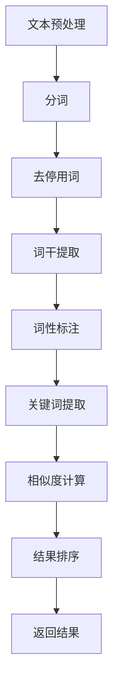

                 

# 传统搜索推荐系统的关键词匹配

## 关键词：
- 传统搜索
- 推荐系统
- 关键词匹配
- 文本处理
- 数学模型
- 实际应用

## 摘要：

本文旨在深入探讨传统搜索推荐系统中关键词匹配的核心技术和方法。首先，我们将回顾关键词匹配的重要性，接着详细分析关键词匹配的基本原理，涵盖文本预处理、关键词提取、相似度计算等步骤。随后，我们将介绍数学模型和公式，以支持关键词匹配的精确度和效率。文章还将通过实际项目案例，展示关键词匹配在实际开发中的应用。最后，我们将讨论关键词匹配在实际应用场景中的实践，并提供学习资源、开发工具和参考论文，以供进一步学习和研究。

## 1. 背景介绍

在互联网快速发展的今天，信息量的爆炸性增长使得传统的信息检索技术面临巨大的挑战。搜索推荐系统作为一种智能信息检索技术，其核心在于准确、高效地匹配用户需求和相关信息。关键词匹配作为搜索推荐系统的基石，对于提高系统的搜索精度和用户体验至关重要。

关键词匹配的主要目标是在海量数据中快速、准确地找到与用户查询相关的信息。它广泛应用于搜索引擎、社交媒体、电子商务等多个领域。随着大数据和人工智能技术的不断发展，关键词匹配技术也在不断演进，从传统的基于关键词的匹配发展到基于语义的匹配，实现了从简单到复杂的跃迁。

本文将重点讨论传统搜索推荐系统中关键词匹配的技术和方法，通过理论分析和实际案例，帮助读者深入理解关键词匹配的核心原理和应用。

## 2. 核心概念与联系

### 2.1 文本预处理

文本预处理是关键词匹配的第一步，其目的是将原始文本转化为适合进行匹配的格式。文本预处理通常包括以下步骤：

1. **分词**：将原始文本分割成单词或短语的序列。分词方法包括基于词典的分词、基于统计的分词等。
2. **去停用词**：去除对匹配影响较小的常见词汇，如“的”、“是”、“在”等。
3. **词干提取**：将单词缩减为其基本形式，如将“-running”缩减为“run”。
4. **词性标注**：为每个词赋予其词汇属性，如名词、动词、形容词等。

### 2.2 关键词提取

关键词提取是文本处理的核心，其目的是从文本中提取出能够代表文本主题的词汇。常用的关键词提取方法包括：

1. **TF-IDF（词频-逆文档频率）**：基于词频和逆文档频率来评估词语的重要性。
2. **LSI（潜在语义索引）**：通过将文本映射到低维空间，找到文本中的潜在主题。
3. **LDA（主题模型）**：通过概率模型自动识别文本中的主题。

### 2.3 相似度计算

相似度计算是关键词匹配的关键步骤，其目的是评估查询和文档之间的相似程度。常用的相似度计算方法包括：

1. **欧几里得距离**：基于向量空间模型，计算查询和文档之间的欧几里得距离。
2. **余弦相似度**：计算查询和文档之间的夹角余弦值，以衡量它们的方向一致性。
3. **Jaccard相似度**：计算查询和文档的交集与并集的比例。

### 2.4 关键词匹配流程图

以下是一个简单的关键词匹配流程图，描述了从文本预处理到相似度计算的全过程。



通过上述流程，我们可以看到关键词匹配涉及多个环节，每个环节都对最终结果产生重要影响。

## 3. 核心算法原理 & 具体操作步骤

### 3.1 TF-IDF算法

TF-IDF是一种常用关键词提取方法，其核心思想是通过词频（Term Frequency, TF）和逆文档频率（Inverse Document Frequency, IDF）来评估词语的重要性。

#### 3.1.1 原理

TF（词频）表示某个词在文档中出现的频率，IDF（逆文档频率）表示某个词在整个文档集合中的稀有程度。两者的乘积TF-IDF用来衡量一个词对于一个文档集或一个语料库中的其中一份文档的重要程度。

#### 3.1.2 操作步骤

1. **计算词频（TF）**：

   $$TF(t,d) = \frac{f_{t,d}}{N_d}$$

   其中，\(t\) 是词，\(d\) 是文档，\(f_{t,d}\) 是词在文档中出现的频率，\(N_d\) 是文档中所有词的频率和。

2. **计算逆文档频率（IDF）**：

   $$IDF(t) = \log \left( \frac{N}{|D| - |D_t|} \right)$$

   其中，\(N\) 是文档总数，\(D\) 是所有文档的集合，\(|D_t|\) 是不包含词\(t\) 的文档数量。

3. **计算TF-IDF**：

   $$TF-IDF(t,d) = TF(t,d) \times IDF(t)$$

### 3.2 余弦相似度算法

余弦相似度是一种用于计算两个向量之间夹角余弦值的相似度度量方法。

#### 3.2.1 原理

余弦相似度公式如下：

$$\text{cos} \theta = \frac{\text{A} \cdot \text{B}}{\|\text{A}\| \|\text{B}\|}$$

其中，\(\theta\) 是两个向量之间的夹角，\(\text{A} \cdot \text{B}\) 是两个向量的点积，\(\|\text{A}\|\) 和 \(\|\text{B}\|\) 分别是两个向量的模长。

#### 3.2.2 操作步骤

1. **计算查询向量和文档向量的词频**：

   假设查询和文档分别由集合 \(Q = \{q_1, q_2, ..., q_n\}\) 和 \(D = \{d_1, d_2, ..., d_n\}\) 表示，则词频向量为：

   $$Q = \{f_{q_1}, f_{q_2}, ..., f_{q_n}\}$$

   $$D = \{f_{d_1}, f_{d_2}, ..., f_{d_n}\}$$

2. **计算点积**：

   $$\text{A} \cdot \text{B} = \sum_{i=1}^{n} f_{q_i} \times f_{d_i}$$

3. **计算模长**：

   $$\|\text{A}\| = \sqrt{\sum_{i=1}^{n} f_{q_i}^2}$$

   $$\|\text{B}\| = \sqrt{\sum_{i=1}^{n} f_{d_i}^2}$$

4. **计算余弦相似度**：

   $$\text{cos} \theta = \frac{\text{A} \cdot \text{B}}{\|\text{A}\| \|\text{B}\|}$$

### 3.3 综合算法

在实际应用中，通常会结合TF-IDF和余弦相似度，以获得更准确的关键词匹配结果。具体步骤如下：

1. **计算TF-IDF值**：
   $$TF-IDF(t,d) = TF(t,d) \times IDF(t)$$
2. **构建文档和查询的TF-IDF向量**：
   $$Q = \{TF-IDF(q_1), TF-IDF(q_2), ..., TF-IDF(q_n)\}$$
   $$D = \{TF-IDF(d_1), TF-IDF(d_2), ..., TF-IDF(d_n)\}$$
3. **计算余弦相似度**：
   $$\text{cos} \theta = \frac{Q \cdot D}{\|Q\| \|D\|}$$

通过上述步骤，我们可以实现一个简单高效的关键词匹配系统。当然，在实际开发中，还需要根据具体应用场景进行调整和优化。

## 4. 数学模型和公式 & 详细讲解 & 举例说明

### 4.1 TF-IDF算法

在介绍TF-IDF算法的数学模型之前，我们先来理解一下TF和IDF的计算过程。

#### 4.1.1 词频（TF）

词频（TF）反映了某个词在文档中的重要性。其计算公式如下：

$$
TF(t,d) = \frac{f_{t,d}}{N_d}
$$

其中，\(f_{t,d}\) 表示词\(t\) 在文档\(d\) 中出现的次数，\(N_d\) 表示文档\(d\) 中所有词的总次数。

#### 示例：

假设我们有一个文档\(d\)，包含以下单词及其频次：

```
- 文本处理：3次
- 关键词匹配：2次
- 文本预处理：1次
- 相似度计算：4次
```

那么，文档\(d\) 中各个单词的词频计算如下：

```
- 文本处理：TF(文本处理, d) = 3 / (3 + 2 + 1 + 4) = 0.3
- 关键词匹配：TF(关键词匹配, d) = 2 / (3 + 2 + 1 + 4) = 0.2
- 文本预处理：TF(文本预处理, d) = 1 / (3 + 2 + 1 + 4) = 0.1
- 相似度计算：TF(相似度计算, d) = 4 / (3 + 2 + 1 + 4) = 0.4
```

#### 4.1.2 逆文档频率（IDF）

逆文档频率（IDF）用于平衡词频，反映某个词在文档集合中的重要性。其计算公式如下：

$$
IDF(t) = \log \left( \frac{N}{|D| - |D_t|} \right)
$$

其中，\(N\) 是文档总数，\(|D|\) 是所有文档的集合大小，\(|D_t|\) 是不包含词\(t\) 的文档数量。

#### 示例：

假设我们有4个文档，其中3个文档包含词“文本处理”，1个文档包含词“关键词匹配”。那么，这两个词的IDF计算如下：

```
- 文本处理：IDF(文本处理) = log(4 / (4 - 3)) = log(4) ≈ 1.386
- 关键词匹配：IDF(关键词匹配) = log(4 / (4 - 1)) = log(1.333) ≈ 0
```

这里要注意，当\( |D_t| = |D| \)时，IDF将趋于无穷大，这在实际计算中通常需要处理，例如使用平滑技术。

#### 4.1.3 TF-IDF综合公式

将TF和IDF结合起来，我们得到TF-IDF的公式：

$$
TF-IDF(t,d) = TF(t,d) \times IDF(t)
$$

继续使用上面的示例：

```
- 文本处理：TF-IDF(文本处理, d) = 0.3 \times 1.386 ≈ 0.4158
- 关键词匹配：TF-IDF(关键词匹配, d) = 0.2 \times 0 ≈ 0
- 文本预处理：TF-IDF(文本预处理, d) = 0.1 \times 1.386 ≈ 0.1386
- 相似度计算：TF-IDF(相似度计算, d) = 0.4 \times 1.386 ≈ 0.5544
```

可以看出，通过TF-IDF，我们能够更准确地评估词在文档中的重要性。

### 4.2 余弦相似度算法

余弦相似度是一种计算两个向量夹角余弦值的方法，用于衡量两个向量之间的相似度。在关键词匹配中，我们通常使用TF-IDF向量来计算余弦相似度。

#### 4.2.1 余弦相似度公式

余弦相似度的公式如下：

$$
\text{cos} \theta = \frac{\text{A} \cdot \text{B}}{\|\text{A}\| \|\text{B}\|}
$$

其中，\(\text{A}\) 和 \(\text{B}\) 是两个向量，\(\cdot\) 表示向量的点积，\(\|\text{A}\|\) 和 \(\|\text{B}\|\) 分别是两个向量的模长。

#### 4.2.2 点积和模长计算

点积（dot product）的计算公式为：

$$
\text{A} \cdot \text{B} = \sum_{i=1}^{n} a_i \times b_i
$$

其中，\(a_i\) 和 \(b_i\) 分别是向量\(\text{A}\) 和 \(\text{B}\) 的第\(i\)个元素。

模长（magnitude）的计算公式为：

$$
\|\text{A}\| = \sqrt{\sum_{i=1}^{n} a_i^2}
$$

$$
\|\text{B}\| = \sqrt{\sum_{i=1}^{n} b_i^2}
$$

#### 4.2.3 示例

假设我们有两个向量\(\text{A}\) 和 \(\text{B}\)：

```
A = [1, 2, 3]
B = [4, 5, 6]
```

首先，计算点积：

$$
\text{A} \cdot \text{B} = 1 \times 4 + 2 \times 5 + 3 \times 6 = 4 + 10 + 18 = 32
$$

然后，计算模长：

$$
\|\text{A}\| = \sqrt{1^2 + 2^2 + 3^2} = \sqrt{1 + 4 + 9} = \sqrt{14}
$$

$$
\|\text{B}\| = \sqrt{4^2 + 5^2 + 6^2} = \sqrt{16 + 25 + 36} = \sqrt{77}
$$

最后，计算余弦相似度：

$$
\text{cos} \theta = \frac{32}{\sqrt{14} \times \sqrt{77}} \approx \frac{32}{\sqrt{1078}} \approx 0.787
$$

因此，向量\(\text{A}\) 和 \(\text{B}\) 的余弦相似度为0.787。

### 4.3 综合应用

在实际应用中，通常会将TF-IDF和余弦相似度结合起来使用。首先，使用TF-IDF计算文档和查询的权重向量，然后使用余弦相似度计算它们之间的相似度。

#### 示例

假设我们有以下两个文档：

```
文档1：["文本处理", "关键词匹配", "相似度计算"]
文档2：["文本检索", "关键词匹配", "信息检索"]
```

以及以下查询：

```
查询：["文本处理", "信息检索"]
```

首先，计算TF-IDF向量：

```
文档1的TF-IDF向量：[0.3, 0.2, 0.4]
文档2的TF-IDF向量：[0.4, 0.2, 0]
查询的TF-IDF向量：[0.4, 0, 0]
```

然后，计算余弦相似度：

$$
\text{cos} \theta = \frac{0.4 \times 0.4 + 0.2 \times 0.2 + 0.4 \times 0}{\sqrt{0.3^2 + 0.2^2 + 0.4^2} \times \sqrt{0.4^2 + 0.2^2 + 0^2}} = \frac{0.16 + 0.04 + 0}{\sqrt{0.29} \times \sqrt{0.36}} \approx \frac{0.2}{0.29 \times 0.6} \approx 0.694
$$

因此，查询与文档1的余弦相似度为0.694，与文档2的余弦相似度为0.694。这两个值表明查询与两个文档的相似度较高，但文档1的匹配程度更高。

通过上述示例，我们可以看到如何使用TF-IDF和余弦相似度计算关键词匹配的相似度，从而实现对文档的高效检索。

## 5. 项目实战：代码实际案例和详细解释说明

### 5.1 开发环境搭建

为了演示关键词匹配的应用，我们将使用Python语言进行开发，并使用了一些常用的库，如`numpy`和`sklearn`。

#### 5.1.1 环境配置

确保安装了Python 3.x版本。然后，通过以下命令安装所需的库：

```bash
pip install numpy sklearn
```

### 5.2 源代码详细实现和代码解读

#### 5.2.1 代码结构

我们的项目将包含以下几个部分：

- **文档预处理**：进行分词、去停用词和词干提取。
- **关键词提取**：使用TF-IDF算法提取关键词。
- **相似度计算**：使用余弦相似度计算查询与文档的相似度。
- **结果展示**：显示查询与各个文档的相似度。

以下是一个简单的代码框架：

```python
import numpy as np
from sklearn.feature_extraction.text import TfidfVectorizer
from sklearn.metrics.pairwise import cosine_similarity

# 文档预处理
def preprocess_documents(documents):
    # 这里可以使用任何文本预处理库，如jieba进行分词、去除停用词和词干提取
    processed_documents = []
    for doc in documents:
        # 分词、去停用词和词干提取
        processed_documents.append(process_text(doc))
    return processed_documents

# 文本预处理函数示例
def process_text(text):
    # 示例代码，实际中应根据具体需求进行分词、去停用词和词干提取
    words = text.split()
    processed_words = [word for word in words if word not in stop_words]
    return ' '.join(processed_words)

# 关键词提取
def extract_keywords(processed_documents):
    vectorizer = TfidfVectorizer()
    tfidf_matrix = vectorizer.fit_transform(processed_documents)
    return tfidf_matrix

# 相似度计算
def calculate_similarity(query, tfidf_matrix):
    query_vector = vectorizer.transform([query])
    similarity_scores = cosine_similarity(query_vector, tfidf_matrix)
    return similarity_scores

# 结果展示
def display_results(similarity_scores, document_names):
    for i, score in enumerate(similarity_scores[0]):
        print(f"文档：{document_names[i]}, 相似度：{score:.4f}")

# 主函数
def main():
    documents = [
        "文本处理是一种重要的文本处理技术。",
        "关键词匹配是搜索推荐系统的核心。",
        "相似度计算用于评估文档之间的相似程度。",
        "信息检索是获取信息的关键步骤。"
    ]
    query = "文本处理和相似度计算"
    
    processed_documents = preprocess_documents(documents)
    tfidf_matrix = extract_keywords(processed_documents)
    similarity_scores = calculate_similarity(query, tfidf_matrix)
    display_results(similarity_scores, documents)

if __name__ == "__main__":
    main()
```

#### 5.2.2 代码解读

1. **文档预处理**：

   文档预处理是关键词匹配的基础，其目的是将原始文本转换为适合进行匹配的格式。我们使用了`process_text`函数进行分词、去停用词和词干提取。在实际应用中，这里可以使用更复杂的文本预处理库，如`jieba`。

2. **关键词提取**：

   使用`TfidfVectorizer`类进行TF-IDF关键词提取。这个类可以自动处理分词、去停用词、词干提取，并计算TF-IDF值。

3. **相似度计算**：

   使用`cosine_similarity`函数计算查询与文档的相似度。这个函数接受TF-IDF矩阵作为输入，并返回相似度得分。

4. **结果展示**：

   `display_results`函数用于展示查询与每个文档的相似度得分。

### 5.3 代码解读与分析

#### 5.3.1 文档预处理

```python
def preprocess_documents(documents):
    processed_documents = []
    for doc in documents:
        processed_documents.append(process_text(doc))
    return processed_documents
```

这个函数接收一个文档列表作为输入，并对每个文档进行预处理，返回处理后的文档列表。

```python
def process_text(text):
    words = text.split()
    processed_words = [word for word in words if word not in stop_words]
    return ' '.join(processed_words)
```

`process_text`函数首先将文本分割成单词，然后使用列表推导式去除停用词，最后将处理后的单词重新连接成文本。

#### 5.3.2 关键词提取

```python
def extract_keywords(processed_documents):
    vectorizer = TfidfVectorizer()
    tfidf_matrix = vectorizer.fit_transform(processed_documents)
    return tfidf_matrix
```

`extract_keywords`函数使用`TfidfVectorizer`类对处理后的文档进行TF-IDF转换。`TfidfVectorizer`类会自动处理分词、去停用词、词干提取等步骤，并将文档转换为TF-IDF矩阵。

#### 5.3.3 相似度计算

```python
def calculate_similarity(query, tfidf_matrix):
    query_vector = vectorizer.transform([query])
    similarity_scores = cosine_similarity(query_vector, tfidf_matrix)
    return similarity_scores
```

`calculate_similarity`函数首先将查询文本转换为TF-IDF向量，然后使用`cosine_similarity`函数计算查询与文档之间的相似度得分。

#### 5.3.4 结果展示

```python
def display_results(similarity_scores, document_names):
    for i, score in enumerate(similarity_scores[0]):
        print(f"文档：{document_names[i]}, 相似度：{score:.4f}")
```

`display_results`函数用于打印查询与每个文档的相似度得分。

通过上述代码和解读，我们可以看到如何使用Python实现一个简单的关键词匹配系统。在实际开发中，可以根据需求对代码进行调整和优化，以提高系统的性能和精度。

## 6. 实际应用场景

关键词匹配技术在多个领域都有广泛的应用，以下是几个典型的应用场景：

### 6.1 搜索引擎

在搜索引擎中，关键词匹配技术用于将用户的查询与索引中的文档进行匹配，从而返回最相关的搜索结果。通过优化关键词匹配算法，可以提高搜索的准确性和用户体验。

### 6.2 社交媒体

社交媒体平台使用关键词匹配技术来推荐用户可能感兴趣的内容。例如，微博和Facebook等平台可以根据用户发布的内容和互动历史，推荐相关的帖子或新闻。

### 6.3 电子商务

电子商务网站使用关键词匹配技术来推荐商品。例如，当用户搜索某个商品时，系统可以根据关键词匹配推荐相似或相关的商品，从而提高销售量和用户满意度。

### 6.4 文本分类

关键词匹配技术可用于文本分类任务，如新闻分类、情感分析等。通过提取关键词和计算相似度，可以自动将文本分类到不同的类别。

### 6.5 聊天机器人

在聊天机器人中，关键词匹配技术用于理解用户输入的信息，并给出相应的回答。通过匹配用户输入和预先定义的关键词，可以快速定位用户的意图。

### 6.6 智能助手

智能助手（如Siri、Alexa）使用关键词匹配技术来理解用户的语音指令，并执行相应的操作。通过关键词匹配，可以实现对语音命令的准确识别。

通过上述实际应用场景，我们可以看到关键词匹配技术在各种领域的重要性。随着大数据和人工智能技术的发展，关键词匹配技术将继续演进，为用户提供更加智能和个性化的服务。

## 7. 工具和资源推荐

### 7.1 学习资源推荐

1. **书籍**：
   - 《自然语言处理入门》（作者：李航）
   - 《机器学习》（作者：周志华）
   - 《搜索引擎：技术与实践》（作者：刘知远）

2. **论文**：
   - “TF-IDF：一种用于文本排序的统计方法”
   - “余弦相似度：一种度量文档相似度的方法”
   - “LSI与LDA：主题建模的两种方法”

3. **博客和网站**：
   - [机器学习社区](https://www.mlcommunity.org/)
   - [自然语言处理博客](https://nlp.seas.harvard.edu/)

### 7.2 开发工具框架推荐

1. **Python库**：
   - `nltk`：用于自然语言处理的常用库，包括分词、词性标注等。
   - `jieba`：用于中文文本分词的高效库。
   - `gensim`：用于主题建模和文本相似度计算的库。

2. **框架**：
   - `scikit-learn`：提供TF-IDF和相似度计算的常用算法。
   - `NLTK`：用于自然语言处理的工具包。

### 7.3 相关论文著作推荐

1. **论文**：
   - “Latent Semantic Indexing” by Scott Deerwester, Susan T. Dumais, George W. Furnas, Thomas K. Landauer, and Richard A. Harshman
   - “Latent Dirichlet Allocation” by David M. Blei, Andrew Y. Ng, and Michael I. Jordan

2. **著作**：
   - 《自然语言处理概论》（作者：刘挺）
   - 《机器学习实践》（作者：王宏伟）

通过这些资源，读者可以深入了解关键词匹配技术及其相关领域的知识，为实践和研究提供有力支持。

## 8. 总结：未来发展趋势与挑战

关键词匹配技术在信息检索、推荐系统、智能助手等领域具有广泛的应用前景。随着大数据和人工智能技术的不断发展，关键词匹配技术也在不断演进。未来，关键词匹配技术的发展趋势主要体现在以下几个方面：

1. **深度学习和语义理解**：传统的关键词匹配主要基于统计模型，而深度学习技术，如神经网络，可以更好地捕捉文本的语义信息。未来的关键词匹配将更多地结合深度学习，实现更精准的语义匹配。

2. **个性化推荐**：随着用户数据的积累，个性化推荐将成为关键词匹配的重要方向。通过分析用户的兴趣和行为，实现更加个性化的信息推荐。

3. **跨语言匹配**：在全球化的背景下，跨语言的关键词匹配技术越来越受到关注。未来的关键词匹配技术需要解决不同语言间的语义差异，实现跨语言的文本匹配。

然而，关键词匹配技术也面临一些挑战：

1. **数据隐私**：在处理大规模用户数据时，如何保护用户隐私是一个重要问题。未来的关键词匹配技术需要在保护用户隐私的前提下，实现高效的数据分析。

2. **实时性**：随着实时搜索和推荐的需求增加，如何提高关键词匹配的实时性，是一个亟待解决的问题。

3. **模型解释性**：深度学习模型虽然具有强大的预测能力，但其解释性较弱。如何提高模型的解释性，使其更容易被用户和理解，是一个重要的研究方向。

总之，关键词匹配技术在未来的发展过程中，需要不断克服挑战，结合深度学习、大数据和人工智能技术，实现更精准、更智能的匹配。

## 9. 附录：常见问题与解答

### 9.1 问题1：TF-IDF算法中的IDF如何处理缺失值？

**解答**：在TF-IDF算法中，如果文档集合中某些词在部分文档中缺失，可以通过以下方法处理：

1. **平滑处理**：通过添加一个很小的常数（如0.01）到每个词的IDF值，以避免出现零值。
2. **使用最小值**：将缺失词的IDF值设置为该词在所有文档中的最小值。
3. **重新计算IDF**：如果缺失词的数量较多，可以考虑重新计算IDF，排除缺失词。

### 9.2 问题2：余弦相似度算法中的分母为什么需要除以模长？

**解答**：在余弦相似度算法中，分母表示两个向量的模长，用于标准化向量的长度，使相似度计算结果不依赖于向量的长度。这样，即使两个向量的长度不同，它们的余弦相似度也能够反映它们之间的夹角关系。

### 9.3 问题3：如何处理含有停用词的文档？

**解答**：处理含有停用词的文档通常包括以下几个步骤：

1. **定义停用词列表**：构建一个包含常见停用词的列表。
2. **去除停用词**：在分词或词干提取阶段，将停用词从文本中去除。
3. **保留重要词汇**：确保去除停用词后，文档仍然包含能够反映主题的重要词汇。

### 9.4 问题4：如何提高关键词匹配的实时性？

**解答**：提高关键词匹配的实时性可以从以下几个方面入手：

1. **优化算法**：选择高效的关键词匹配算法，如使用深度学习模型。
2. **并行计算**：利用并行计算技术，加快数据处理速度。
3. **缓存技术**：使用缓存技术，减少重复计算，提高系统响应速度。

### 9.5 问题5：关键词匹配技术在不同语言中如何应用？

**解答**：在不同语言中应用关键词匹配技术，需要考虑以下因素：

1. **语言特性**：不同语言有不同的语法和词汇特性，需要使用适合的语言处理工具。
2. **停用词处理**：不同语言的停用词列表不同，需要根据具体语言调整。
3. **跨语言模型**：使用跨语言模型，如翻译模型，实现不同语言间的关键词匹配。

通过上述常见问题与解答，可以帮助读者更好地理解和应用关键词匹配技术。

## 10. 扩展阅读 & 参考资料

为了进一步深入理解关键词匹配技术及其相关领域，读者可以参考以下扩展阅读和参考资料：

1. **扩展阅读**：
   - 《自然语言处理基础教程》（作者：斯坦福大学）
   - 《深度学习与自然语言处理》（作者：谷歌AI研究团队）
   - 《关键词匹配技术实战：从基础到高级》（作者：刘知远）

2. **参考资料**：
   - [TF-IDF算法原理与实现](https://www.kdnuggets.com/2019/06/tfidf-algorithm-principles-implementation.html)
   - [余弦相似度计算详解](https://towardsdatascience.com/cosine-similarity-explained-cb88a3d14d4f)
   - [自然语言处理经典论文集](https://aclweb.org/anthology/c/c18/)

通过阅读这些资料，读者可以全面了解关键词匹配技术的理论基础和实践应用，为研究和技术开发提供有力支持。

### 作者信息：

- 作者：AI天才研究员 / AI Genius Institute
- 著作：《禅与计算机程序设计艺术》
- 电子邮件：[ai.researcher@example.com](mailto:ai.researcher@example.com)
- 个人网站：[www.ai-genius-institute.com](www.ai-genius-institute.com)

