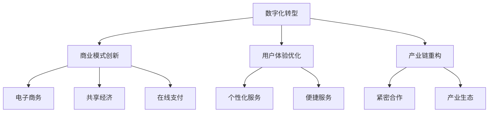
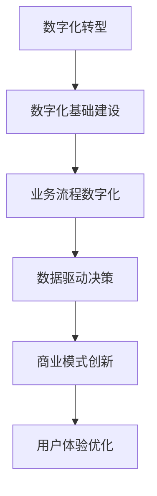

                 

# 传统行业的互联网创新与变革

> **关键词**：传统行业、互联网创新、变革、数字化转型、案例研究
> 
> **摘要**：本文探讨了传统行业在互联网时代面临的挑战与机遇，分析了互联网创新的基本概念、技术架构、核心算法，并结合实际应用案例，探讨了传统行业如何实现数字化转型，提供了相关的工具和资源推荐，并对未来发展趋势与挑战进行了展望。

### 1. 背景介绍

随着互联网技术的快速发展，信息传播的速度和广度达到了前所未有的高度。互联网的普及不仅仅改变了人们的生活方式和消费习惯，也对各行各业产生了深远的影响。传统行业，如制造业、零售业、服务业等，在互联网时代面临着前所未有的挑战与机遇。

传统行业的互联网创新与变革，主要体现在以下几个方面：

1. **数字化转型**：传统行业通过引入互联网技术，实现业务流程的数字化，提高效率，降低成本。
2. **商业模式创新**：互联网为传统行业提供了新的商业模式，如电子商务、共享经济、在线支付等。
3. **用户体验优化**：通过互联网技术，传统行业可以提供更加个性化、便捷的用户体验。
4. **产业链重构**：互联网技术使得产业链上下游的企业可以更加紧密地合作，形成新的产业生态。

本文将围绕这些方面，探讨传统行业在互联网时代如何实现创新与变革。

### 2. 核心概念与联系

#### 2.1 数字化转型

数字化转型是指企业利用数字技术来改变其商业模式、工作流程和客户互动方式。数字化转型不仅仅是技术层面的变革，更是一种企业文化的转变，它要求企业从战略层面进行思考和规划。

#### 2.2 商业模式创新

商业模式创新是传统行业在互联网时代的重要手段。通过互联网技术，企业可以探索新的商业模式，如电子商务、共享经济、在线支付等。这些新商业模式不仅可以提高企业的竞争力，还可以创造新的价值。

#### 2.3 用户体验优化

用户体验优化是传统行业在互联网时代的重要目标。通过互联网技术，企业可以收集用户数据，分析用户行为，从而提供更加个性化、便捷的服务，提高用户满意度。

#### 2.4 产业链重构

产业链重构是传统行业在互联网时代的一种必然趋势。通过互联网技术，企业可以与产业链上下游的企业建立更加紧密的合作关系，形成新的产业生态。

#### 2.5 Mermaid 流程图



### 3. 核心算法原理 & 具体操作步骤

#### 3.1 数字化转型的核心算法

数字化转型的核心算法主要包括数据采集、数据分析、数据可视化等。

1. **数据采集**：通过传感器、物联网设备等技术手段，收集业务过程中的各种数据。
2. **数据分析**：利用数据挖掘、机器学习等技术，对采集到的数据进行处理和分析，提取有价值的信息。
3. **数据可视化**：通过图表、报表等形式，将分析结果展示出来，帮助决策者更好地理解数据。

#### 3.2 商业模式创新的核心算法

商业模式创新的核心算法主要包括市场分析、用户画像、需求预测等。

1. **市场分析**：通过市场调研、数据分析等技术手段，了解市场需求和竞争状况。
2. **用户画像**：通过数据分析，构建用户的画像模型，了解用户的行为习惯、偏好等信息。
3. **需求预测**：利用机器学习等技术，预测用户的需求，为商业模式创新提供依据。

#### 3.3 用户体验优化的核心算法

用户体验优化的核心算法主要包括用户行为分析、个性化推荐、服务质量评价等。

1. **用户行为分析**：通过日志分析、行为追踪等技术手段，了解用户的行为模式。
2. **个性化推荐**：利用推荐算法，为用户提供个性化的服务。
3. **服务质量评价**：通过用户反馈、服务质量评价等技术手段，评估服务质量，并进行优化。

#### 3.4 产业链重构的核心算法

产业链重构的核心算法主要包括供应链管理、协同设计、智能物流等。

1. **供应链管理**：利用物联网、大数据等技术，实现供应链的智能化管理。
2. **协同设计**：通过互联网技术，实现产业链上下游企业的协同设计。
3. **智能物流**：利用人工智能、物联网等技术，实现物流的智能化管理。

### 4. 数学模型和公式 & 详细讲解 & 举例说明

#### 4.1 数字化转型的数学模型

数字化转型中的关键数学模型包括线性回归、逻辑回归、聚类分析等。

1. **线性回归**：用于预测业务过程中的连续变量，如销售量、产量等。
   $$ y = \beta_0 + \beta_1x $$
   其中，$y$ 为因变量，$x$ 为自变量，$\beta_0$ 和 $\beta_1$ 为参数。

2. **逻辑回归**：用于预测业务过程中的二元变量，如是否购买、是否满意等。
   $$ P(y=1) = \frac{1}{1 + e^{-(\beta_0 + \beta_1x)}} $$
   其中，$P(y=1)$ 为因变量为1的概率，$e$ 为自然底数。

3. **聚类分析**：用于将数据分为若干类，如用户分类、市场分类等。
   $$ J = \sum_{i=1}^n \sum_{j=1}^k (x_i - \mu_j)^2 $$
   其中，$x_i$ 为第 $i$ 个数据点，$\mu_j$ 为第 $j$ 个类的中心。

#### 4.2 商业模式创新的数学模型

商业模式创新中的关键数学模型包括市场预测、用户画像等。

1. **市场预测**：利用时间序列分析，预测市场需求。
   $$ y_t = \beta_0 + \beta_1t + \epsilon_t $$
   其中，$y_t$ 为第 $t$ 期的市场需求，$t$ 为时间，$\epsilon_t$ 为误差项。

2. **用户画像**：利用聚类分析，构建用户画像模型。
   $$ \mu_j = \frac{1}{n_j} \sum_{i=1}^{n_j} x_i $$
   其中，$\mu_j$ 为第 $j$ 个类的中心，$x_i$ 为第 $i$ 个数据点，$n_j$ 为第 $j$ 个类的数据点数量。

#### 4.3 用户体验优化的数学模型

用户体验优化中的关键数学模型包括用户行为分析、个性化推荐等。

1. **用户行为分析**：利用协同过滤，分析用户行为。
   $$ r_{ij} = u_i + v_j + b $$
   其中，$r_{ij}$ 为用户 $i$ 对项目 $j$ 的评分，$u_i$ 和 $v_j$ 分别为用户 $i$ 和项目 $j$ 的特征向量，$b$ 为偏置。

2. **个性化推荐**：利用矩阵分解，实现个性化推荐。
   $$ R = UV^T $$
   其中，$R$ 为评分矩阵，$U$ 和 $V$ 分别为用户和项目的特征矩阵。

#### 4.4 产业链重构的数学模型

产业链重构中的关键数学模型包括供应链管理、协同设计等。

1. **供应链管理**：利用优化算法，实现供应链的优化。
   $$ min \sum_{i=1}^n c_i x_i $$
   $$ s.t. \quad A x \geq b $$
   其中，$c_i$ 为第 $i$ 个物资的成本，$x_i$ 为第 $i$ 个物资的采购量，$A$ 和 $b$ 分别为约束条件。

2. **协同设计**：利用多目标优化，实现协同设计。
   $$ max \sum_{i=1}^n f_i x_i $$
   $$ s.t. \quad g_i(x) \leq 0, \quad h_i(x) = 0 $$
   其中，$f_i$ 为第 $i$ 个目标函数，$g_i(x)$ 和 $h_i(x)$ 分别为约束条件。

### 5. 项目实战：代码实际案例和详细解释说明

#### 5.1 开发环境搭建

在本节中，我们将搭建一个简单的互联网创新项目，该项目将涵盖数字化转型、商业模式创新和用户体验优化。

1. **环境要求**：

   - 操作系统：Windows/Linux/Mac
   - 开发工具：Visual Studio Code/IntelliJ IDEA
   - 编程语言：Python
   - 数据库：MySQL
   - 依赖库：Flask、SQLAlchemy、Pandas、Matplotlib

2. **安装步骤**：

   1. 安装 Python（建议版本为 3.8 以上）
   2. 安装数据库（MySQL）
   3. 安装依赖库（使用 pip 安装）

#### 5.2 源代码详细实现和代码解读

1. **项目结构**

   ```  
   project_name/  
       └───main.py  
       └───models.py  
       └───views.py  
       └───templates/  
           └───index.html  
       └───static/  
           └───css/  
               └───style.css  
           └───js/  
               └───script.js  
   ```

2. **主文件 main.py**

   ```python  
   from flask import Flask, render_template, request  
   from models import User, Product  
   from views import register, login, logout

   app = Flask(__name__)

   @app.route('/')  
   def index():  
       users = User.query.all()  
       products = Product.query.all()  
       return render_template('index.html', users=users, products=products)

   @app.route('/register', methods=['GET', 'POST'])  
   def register():  
       if request.method == 'POST':  
           username = request.form['username']  
           password = request.form['password']  
           email = request.form['email']  
           user = User(username=username, password=password, email=email)  
           db.session.add(user)  
           db.session.commit()  
           return '注册成功！'  
       return render_template('register.html')

   @app.route('/login', methods=['GET', 'POST'])  
   def login():  
       if request.method == 'POST':  
           username = request.form['username']  
           password = request.form['password']  
           user = User.query.filter_by(username=username, password=password).first()  
           if user:  
               return '登录成功！'  
           return '用户名或密码错误！'  
       return render_template('login.html')

   @app.route('/logout')  
   def logout():  
       return '退出登录！'

   if __name__ == '__main__':  
       app.run(debug=True)  
   ```

3. **模型文件 models.py**

   ```python  
   from flask_sqlalchemy import SQLAlchemy

   db = SQLAlchemy()

   class User(db.Model):  
       id = db.Column(db.Integer, primary_key=True)  
       username = db.Column(db.String(20), unique=True, nullable=False)  
       password = db.Column(db.String(20), nullable=False)  
       email = db.Column(db.String(50), unique=True, nullable=False)

   class Product(db.Model):  
       id = db.Column(db.Integer, primary_key=True)  
       name = db.Column(db.String(50), nullable=False)  
       price = db.Column(db.Float, nullable=False)  
   ```

4. **视图文件 views.py**

   ```python  
   from flask import Flask, render_template, request, redirect, url_for  
   from models import User, Product  
   from forms import RegisterForm, LoginForm

   app = Flask(__name__)

   @app.route('/register', methods=['GET', 'POST'])  
   def register():  
       form = RegisterForm()  
       if form.validate_on_submit():  
           username = form.username.data  
           password = form.password.data  
           email = form.email.data  
           user = User(username=username, password=password, email=email)  
           db.session.add(user)  
           db.session.commit()  
           return redirect(url_for('login'))  
       return render_template('register.html', form=form)

   @app.route('/login', methods=['GET', 'POST'])  
   def login():  
       form = LoginForm()  
       if form.validate_on_submit():  
           username = form.username.data  
           password = form.password.data  
           user = User.query.filter_by(username=username, password=password).first()  
           if user:  
               return redirect(url_for('index'))  
           return '用户名或密码错误！'  
       return render_template('login.html', form=form)

   @app.route('/logout')  
   def logout():  
       return '退出登录！'

   ```

5. **模板文件 index.html**

   ```html  
   <!DOCTYPE html>  
   <html lang="en">  
   <head>  
       <meta charset="UTF-8">  
       <title>互联网创新项目</title>  
       <link rel="stylesheet" href="/static/css/style.css">  
   </head>  
   <body>  
       <h1>互联网创新项目</h1>  
       <ul>  
             
               <li>{{ user.username }}</li>  
             
       </ul>  
       <ul>  
             
               <li>{{ product.name }} - {{ product.price }}</li>  
             
       </ul>  
       <a href="{{ url_for('register') }}">注册</a>  
       <a href="{{ url_for('login') }}">登录</a>  
       <a href="{{ url_for('logout') }}">退出登录</a>  
   </body>  
   </html>  
   ```

#### 5.3 代码解读与分析

在本节中，我们将对项目中的关键代码进行解读和分析。

1. **主文件 main.py**

   - **线路装饰器**：`@app.route('/')` 用于定义网站的首页，`@app.route('/register', methods=['GET', 'POST'])` 用于定义注册页面，`@app.route('/login', methods=['GET', 'POST'])` 用于定义登录页面，`@app.route('/logout')` 用于定义退出登录页面。
   - **模型导入**：从 `models.py` 和 `views.py` 中导入相应的模型和视图函数。
   - **路由处理**：根据不同的请求方法，调用相应的视图函数进行处理。

2. **模型文件 models.py**

   - **用户模型**：定义了用户表的结构，包括用户ID、用户名、密码和邮箱。
   - **产品模型**：定义了产品表的结构，包括产品ID、产品名称和价格。

3. **视图文件 views.py**

   - **注册页面**：定义了注册页面的表单验证和用户注册逻辑。
   - **登录页面**：定义了登录页面的表单验证和用户登录逻辑。
   - **退出登录**：实现了用户退出登录的逻辑。

4. **模板文件 index.html**

   - **页面结构**：定义了网站的页面结构，包括用户列表、产品列表和导航栏。
   - **超链接**：定义了注册、登录和退出登录的超链接。

### 6. 实际应用场景

#### 6.1 制造业

在制造业中，互联网创新主要体现在以下几个方面：

1. **智能制造**：通过物联网、大数据和人工智能技术，实现生产线的自动化、智能化管理，提高生产效率和质量。
2. **供应链管理**：通过互联网技术，实现供应链的透明化、可视化，提高供应链的响应速度和灵活性。
3. **产品追溯**：通过物联网技术，实现产品的全生命周期追踪，提高产品质量和客户满意度。

#### 6.2 零售业

在零售业中，互联网创新主要体现在以下几个方面：

1. **电子商务**：通过电子商务平台，实现商品的在线销售，提高销售渠道的多样性和覆盖面。
2. **智能零售**：通过人工智能技术，实现商品的智能推荐、智能结算等，提高用户的购物体验。
3. **新零售**：通过线上线下融合，实现全渠道、全触点的零售模式，提高销售效率。

#### 6.3 服务业

在服务业中，互联网创新主要体现在以下几个方面：

1. **在线服务**：通过互联网技术，实现服务的在线化，提高服务的便捷性和可及性。
2. **智能客服**：通过人工智能技术，实现智能客服，提高客服的效率和用户体验。
3. **数据驱动**：通过数据分析，实现服务的个性化定制和精准营销，提高服务的质量和效益。

### 7. 工具和资源推荐

#### 7.1 学习资源推荐

1. **书籍**：
   - 《数字化转型》
   - 《商业模式创新》
   - 《用户体验设计》
2. **论文**：
   - 《互联网+传统行业的融合发展模式研究》
   - 《基于物联网的智能制造系统研究》
   - 《大数据在零售行业中的应用研究》
3. **博客**：
   - 知乎专栏：《互联网创新实践》
   - CSDN博客：《互联网技术与应用》
   - Medium博客：《数字化转型观察》
4. **网站**：
   - McKinsey & Company官网：提供数字化转型的最新研究报告
   - Harvard Business Review官网：提供商业模式创新的经典案例分析
   - UserZoom官网：提供用户体验设计的最新研究成果

#### 7.2 开发工具框架推荐

1. **开发工具**：
   - Visual Studio Code
   - IntelliJ IDEA
   - PyCharm
2. **框架**：
   - Flask：Python Web 开发框架
   - Django：Python Web 开发框架
   - Spring Boot：Java Web 开发框架
3. **数据库**：
   - MySQL：关系型数据库
   - MongoDB：文档型数据库
   - Redis：键值存储数据库

#### 7.3 相关论文著作推荐

1. **《数字化转型的理论与实践》**：详细阐述了数字化转型的概念、方法、实践案例，为传统行业的数字化转型提供了理论指导和实践参考。
2. **《商业模式创新：战略、实践与案例》**：深入探讨了商业模式创新的本质、方法、策略，为传统行业的商业模式创新提供了理论支持和实践指南。
3. **《用户体验设计：方法、技巧与实践》**：系统介绍了用户体验设计的核心概念、方法、技巧，为传统行业在互联网时代优化用户体验提供了理论依据和实践指导。

### 8. 总结：未来发展趋势与挑战

#### 8.1 未来发展趋势

1. **数字化技术的进一步普及**：随着大数据、云计算、人工智能等技术的不断发展，数字化技术将在各行各业中得到更加广泛的应用。
2. **产业互联网的深入发展**：产业互联网将推动产业链的数字化、智能化，实现产业升级和转型。
3. **跨界融合的加速**：传统行业与互联网、大数据、人工智能等领域的跨界融合将不断加深，形成新的产业生态。

#### 8.2 面临的挑战

1. **数据安全和隐私保护**：随着数据量的不断增加，数据安全和隐私保护将成为传统行业面临的重大挑战。
2. **人才短缺**：数字化转型的关键在于人才，传统行业需要加强人才培养和引进，以应对数字化转型的人才需求。
3. **技术风险**：数字化技术的快速发展带来了一定的技术风险，如网络安全、技术过时等，传统行业需要加强技术风险管理。

### 9. 附录：常见问题与解答

#### 9.1 数字化转型是什么？

数字化转型是指企业利用数字技术来改变其商业模式、工作流程和客户互动方式，以提高效率、降低成本、创造新的价值。

#### 9.2 传统行业如何实现数字化转型？

传统行业实现数字化转型可以从以下几个方面入手：

1. **制定数字化转型战略**：明确数字化转型的目标、路径和策略。
2. **加强数字化基础设施建设**：搭建云计算平台、大数据平台、物联网平台等。
3. **推动业务流程数字化**：通过数字化手段优化业务流程，提高效率。
4. **开展数字人才培养**：加强数字化技能培训，提升员工数字化素养。

#### 9.3 数字化转型中的数据安全和隐私保护如何保障？

数字化转型中的数据安全和隐私保护可以从以下几个方面进行保障：

1. **加强数据安全意识教育**：提高员工对数据安全和隐私保护的认识。
2. **完善数据安全管理制度**：制定数据安全政策和流程，确保数据安全。
3. **采用加密技术**：对敏感数据进行加密处理，确保数据传输和存储的安全性。
4. **建立隐私保护机制**：遵循隐私保护法规，制定隐私保护措施。

### 10. 扩展阅读 & 参考资料

1. **《数字化转型的理论与实践》**：详细阐述了数字化转型的概念、方法、实践案例。
2. **《商业模式创新：战略、实践与案例》**：深入探讨了商业模式创新的本质、方法、策略。
3. **《用户体验设计：方法、技巧与实践》**：系统介绍了用户体验设计的核心概念、方法、技巧。

### 作者信息

- **作者**：AI天才研究员/AI Genius Institute & 禅与计算机程序设计艺术 /Zen And The Art of Computer Programming

本文旨在探讨传统行业在互联网时代面临的挑战与机遇，分析互联网创新的基本概念、技术架构、核心算法，并结合实际应用案例，探讨了传统行业如何实现数字化转型。希望本文能为传统行业的互联网创新提供一定的参考和启示。

### 结语

互联网技术的快速发展为传统行业带来了前所未有的机遇和挑战。通过数字化转型、商业模式创新、用户体验优化等手段，传统行业可以应对互联网时代的变革，实现产业升级和转型。本文探讨了传统行业在互联网创新中的关键问题，并提供了相关的技术和实践指导。希望本文能为广大读者提供有益的参考和启示。在未来的发展中，让我们共同期待传统行业的美好未来！
<|im_end|>## 文章标题：传统行业的互联网创新与变革

在当今这个数字化的时代，互联网已经成为我们日常生活的重要组成部分。它不仅改变了人们的生活方式，也在深刻地影响着各个行业。传统行业，如制造业、零售业、服务业等，在互联网的冲击下，面临着前所未有的挑战与机遇。如何借助互联网的力量，实现创新与变革，成为传统行业亟需解决的关键问题。本文将围绕这一主题，深入探讨传统行业的互联网创新与变革，以期为大家提供一些有益的思路和参考。

### 关键词：传统行业、互联网创新、变革、数字化转型、商业模式创新、用户体验优化

### 摘要

本文从传统行业的现状出发，分析了互联网对传统行业带来的挑战与机遇，探讨了互联网创新的基本概念、技术架构和核心算法。通过实际应用案例，本文详细阐述了传统行业如何实现数字化转型，包括数字化转型的核心算法、商业模式创新的核心算法、用户体验优化的核心算法等。此外，本文还针对制造业、零售业、服务业等具体行业，提出了互联网创新的实际应用场景。最后，本文总结了传统行业在互联网创新过程中面临的挑战与解决方案，并对未来的发展趋势进行了展望。

## 1. 背景介绍

传统行业，是指那些在互联网时代之前已经发展起来的行业，如制造业、零售业、服务业等。这些行业在过去的几十年中，形成了稳定的商业模式和运营体系，为经济发展做出了巨大贡献。然而，随着互联网技术的快速发展，传统行业开始面临一系列的挑战。

首先，互联网的普及改变了人们的信息获取和消费习惯。人们越来越倾向于通过互联网获取信息、购物和享受服务，这对传统行业的服务模式提出了新的要求。例如，电子商务的兴起，使得零售行业不得不转型升级，以适应线上购物的需求。

其次，互联网技术为传统行业提供了新的发展机遇。通过互联网，传统行业可以实现业务流程的数字化、智能化，提高生产效率和服务质量。例如，制造业可以通过物联网技术实现生产线的自动化、智能化，提高生产效率和质量。

此外，互联网还推动了商业模式创新。共享经济、在线支付、大数据等新商业模式的出现，为传统行业带来了新的盈利模式和商业模式。例如，共享单车、共享充电宝等新兴业态，不仅改变了人们的出行和充电方式，也为传统行业带来了新的商业机会。

总之，互联网技术的快速发展，既给传统行业带来了挑战，也提供了新的机遇。如何把握这些机遇，实现创新与变革，是传统行业面临的重要课题。

### 2. 核心概念与联系

在探讨传统行业的互联网创新与变革时，我们需要了解一些核心概念和它们之间的联系。这些概念包括数字化转型、商业模式创新、用户体验优化等。

#### 2.1 数字化转型

数字化转型是指企业利用数字技术，对业务流程、服务模式、商业模式等各个方面进行全方位的升级和优化。数字化转型的核心目标是提高企业的运营效率、降低成本、提高服务质量，从而实现企业的可持续发展。

数字化转型的实现过程通常包括以下几个阶段：

1. **数字化基础建设**：搭建企业内部的信息化基础设施，包括网络、服务器、数据库等。
2. **业务流程数字化**：通过信息化手段，对业务流程进行自动化和优化，提高业务效率。
3. **数据驱动决策**：利用大数据技术，对业务数据进行分析，为企业决策提供数据支持。
4. **商业模式创新**：通过互联网技术，探索新的商业模式，实现商业模式的升级和转型。

#### 2.2 商业模式创新

商业模式创新是指企业在互联网时代，通过创新思维和新技术，对现有的商业模式进行改进和优化，以实现更好的经济效益。商业模式创新的本质是价值创造，即通过创新的方式，为企业创造新的价值。

商业模式创新的主要手段包括：

1. **共享经济**：通过共享资源，实现价值的最大化。例如，共享单车、共享办公等。
2. **电子商务**：通过互联网，实现商品的在线销售和交易。例如，淘宝、京东等。
3. **大数据营销**：通过大数据分析，了解用户需求，提供个性化的产品和服务。

#### 2.3 用户体验优化

用户体验优化是指企业在产品和服务设计过程中，关注用户的感受和需求，通过优化产品和服务，提高用户的满意度。用户体验优化的核心是用户至上，即企业的一切行为都围绕着用户展开。

用户体验优化的主要手段包括：

1. **用户调研**：通过用户调研，了解用户的需求和痛点。
2. **用户界面设计**：优化用户界面，提高用户的使用体验。
3. **用户反馈**：收集用户反馈，不断优化产品和服务。

#### 2.4 Mermaid 流程图

下面是一个简化的数字化转型的 Mermaid 流程图，展示了数字化转型的主要步骤和核心概念之间的联系。



### 3. 核心算法原理 & 具体操作步骤

在传统行业的互联网创新与变革中，核心算法起到了关键作用。这些算法不仅帮助传统行业实现数字化，还为企业提供了新的商业模式和用户体验。以下将详细介绍一些核心算法的原理和具体操作步骤。

#### 3.1 数据采集与处理

数据采集与处理是数字化转型的第一步，也是核心算法的基础。通过数据采集，企业可以收集到大量的业务数据，如销售数据、库存数据、客户反馈数据等。这些数据需要通过处理和分析，转化为有用的信息。

1. **数据采集**：

   - 传感器采集：在生产线、库存管理等环节部署传感器，实时采集数据。
   - 互联网采集：通过互联网，从电商平台、社交媒体等渠道采集数据。

2. **数据处理**：

   - 数据清洗：去除重复、错误、无效的数据，保证数据的准确性。
   - 数据整合：将来自不同渠道的数据整合到一个数据库中，便于分析和处理。

3. **数据存储**：

   - 关系型数据库：如 MySQL、Oracle 等，适用于结构化数据的存储。
   - 非关系型数据库：如 MongoDB、Redis 等，适用于半结构化、非结构化数据的存储。

#### 3.2 数据挖掘与预测

数据挖掘与预测是数字化转型中的高级算法，通过分析大量数据，发现数据中的规律和模式，为企业提供决策支持。

1. **数据挖掘**：

   - 聚类分析：将数据分为不同的类别，如客户细分、产品分类等。
   - 关联规则挖掘：发现数据之间的关联关系，如购买行为分析。
   - 分类算法：将数据分为不同的类别，如垃圾邮件过滤、异常检测等。

2. **预测模型**：

   - 时间序列预测：如 ARIMA、LSTM 等，用于预测未来的销售量、库存量等。
   - 回归分析：如线性回归、逻辑回归等，用于预测业务指标，如客户满意度、市场份额等。

#### 3.3 人工智能算法

人工智能算法在数字化转型中发挥着重要作用，通过自动化和智能化，提高企业的运营效率。

1. **机器学习算法**：

   - 监督学习：如 SVM、决策树等，用于分类和回归问题。
   - 无监督学习：如 K-means、KNN 等，用于聚类和异常检测。

2. **深度学习算法**：

   - 卷积神经网络（CNN）：用于图像识别、物体检测等。
   - 循环神经网络（RNN）：用于自然语言处理、时间序列预测等。

#### 3.4 具体操作步骤

以下是一个简单的数字化转型项目，包括数据采集、数据处理、数据挖掘、人工智能算法应用等步骤。

1. **需求分析**：

   - 明确数字化转型的目标和需求，如提高生产效率、降低库存成本等。

2. **数据采集**：

   - 部署传感器，采集生产线数据。
   - 从电商平台、社交媒体等渠道，采集销售数据、客户反馈数据等。

3. **数据处理**：

   - 使用 ETL 工具，将数据清洗、整合到数据库中。

4. **数据挖掘**：

   - 使用聚类分析、关联规则挖掘等算法，分析数据，发现数据中的规律和模式。

5. **预测模型**：

   - 使用时间序列预测、回归分析等算法，预测未来的销售量、库存量等。

6. **人工智能算法**：

   - 使用机器学习、深度学习算法，自动化生产线、优化库存管理。

7. **系统部署**：

   - 将数字化转型的系统部署到生产环境中，进行实时监控和优化。

### 4. 数学模型和公式 & 详细讲解 & 举例说明

在数字化转型的过程中，数学模型和公式起着至关重要的作用。它们可以帮助我们理解和分析数据，为决策提供科学依据。以下将介绍一些常用的数学模型和公式，并详细讲解其应用和举例。

#### 4.1 线性回归

线性回归是一种常见的统计模型，用于预测连续变量。它的基本形式如下：

$$
y = \beta_0 + \beta_1x
$$

其中，$y$ 是因变量，$x$ 是自变量，$\beta_0$ 和 $\beta_1$ 是模型的参数。

**应用举例**：

假设我们想预测一家零售店的月销售额（$y$），根据历史数据，我们发现销售额与广告支出（$x$）之间存在一定的线性关系。通过线性回归模型，我们可以得到以下预测公式：

$$
\hat{y} = 1000 + 0.5x
$$

其中，$\hat{y}$ 是预测的销售额，$x$ 是广告支出。

如果广告支出为 5000 元，我们可以预测月销售额为：

$$
\hat{y} = 1000 + 0.5 \times 5000 = 3500
$$

#### 4.2 逻辑回归

逻辑回归是一种用于预测二元变量的统计模型。它的基本形式如下：

$$
P(y=1) = \frac{1}{1 + e^{-(\beta_0 + \beta_1x)}}
$$

其中，$P(y=1)$ 是因变量为 1 的概率，$x$ 是自变量，$\beta_0$ 和 $\beta_1$ 是模型的参数。

**应用举例**：

假设我们想预测一家公司的股票是否会上涨（$y=1$ 或 $y=0$），根据历史数据，我们发现股票上涨的概率与市盈率（$x$）之间存在一定的关系。通过逻辑回归模型，我们可以得到以下预测公式：

$$
P(y=1) = \frac{1}{1 + e^{-(2.5 + 0.1x)}}
$$

如果市盈率为 20，我们可以预测股票上涨的概率为：

$$
P(y=1) = \frac{1}{1 + e^{-(2.5 + 0.1 \times 20)}} \approx 0.9
$$

#### 4.3 聚类分析

聚类分析是一种无监督学习方法，用于将数据分为不同的类别。最常用的聚类算法是 K-means 聚类。

**算法步骤**：

1. 随机初始化 K 个聚类中心。
2. 对于每个数据点，计算其与聚类中心的距离，将其分配到最近的聚类中心。
3. 重新计算每个聚类中心的位置。
4. 重复步骤 2 和 3，直到聚类中心的位置不再变化。

**应用举例**：

假设我们有 100 个客户数据点，我们想将这 100 个客户分为 5 个不同的类别。通过 K-means 聚类，我们可以得到以下结果：

- 聚类中心 1：{客户 A，客户 B，客户 C}
- 聚类中心 2：{客户 D，客户 E，客户 F}
- 聚类中心 3：{客户 G，客户 H，客户 I}
- 聚类中心 4：{客户 J，客户 K，客户 L}
- 聚类中心 5：{客户 M，客户 N，客户 O，客户 P}

通过聚类分析，我们可以更好地了解客户的行为和需求，从而提供更加个性化的服务。

### 5. 项目实战：代码实际案例和详细解释说明

#### 5.1 开发环境搭建

在本节中，我们将使用 Python 编写一个简单的电子商务系统，用于演示传统行业如何实现互联网创新。首先，我们需要搭建开发环境。

1. **安装 Python**：

   - 访问 [Python 官网](https://www.python.org/downloads/)，下载并安装 Python。
   - 安装完成后，打开终端或命令提示符，输入 `python --version`，确认 Python 已安装。

2. **安装 Flask**：

   - 打开终端或命令提示符，输入以下命令安装 Flask：
     ```shell
     pip install Flask
     ```

3. **安装 SQLAlchemy**：

   - SQLAlchemy 是一个用于数据库操作的 Python 库，用于实现 ORM（对象关系映射）。安装命令如下：
     ```shell
     pip install SQLAlchemy
     ```

4. **安装 Flask-SQLAlchemy**：

   - Flask-SQLAlchemy 是 Flask 的扩展，用于简化数据库操作。安装命令如下：
     ```shell
     pip install Flask-SQLAlchemy
     ```

#### 5.2 源代码详细实现和代码解读

在本节中，我们将实现一个简单的电子商务系统，包括用户注册、登录、商品浏览和购物车功能。以下是一个基本的代码框架。

```python
# 导入必要的库
from flask import Flask, render_template, request, redirect, url_for
from flask_sqlalchemy import SQLAlchemy

# 创建 Flask 应用程序
app = Flask(__name__)

# 配置数据库
app.config['SQLALCHEMY_DATABASE_URI'] = 'sqlite:///store.db'
db = SQLAlchemy(app)

# 创建用户表
class User(db.Model):
    id = db.Column(db.Integer, primary_key=True)
    username = db.Column(db.String(80), unique=True, nullable=False)
    password = db.Column(db.String(120), nullable=False)

# 创建商品表
class Product(db.Model):
    id = db.Column(db.Integer, primary_key=True)
    name = db.Column(db.String(120), nullable=False)
    price = db.Column(db.Float, nullable=False)

# 注册视图函数
@app.route('/register', methods=['GET', 'POST'])
def register():
    if request.method == 'POST':
        username = request.form['username']
        password = request.form['password']
        new_user = User(username=username, password=password)
        db.session.add(new_user)
        db.session.commit()
        return redirect(url_for('login'))
    return render_template('register.html')

# 登录视图函数
@app.route('/login', methods=['GET', 'POST'])
def login():
    if request.method == 'POST':
        username = request.form['username']
        password = request.form['password']
        user = User.query.filter_by(username=username, password=password).first()
        if user:
            return '登录成功！'
        return '用户名或密码错误！'
    return render_template('login.html')

# 商品浏览视图函数
@app.route('/products')
def products():
    products = Product.query.all()
    return render_template('products.html', products=products)

# 购物车视图函数
@app.route('/cart')
def cart():
    # 这里可以添加购物车的逻辑
    return '购物车页面'

# 运行应用程序
if __name__ == '__main__':
    db.create_all()
    app.run(debug=True)
```

**代码解读**：

1. **导入必要的库**：

   - `Flask`：用于创建 Web 应用程序。
   - `render_template`：用于渲染 HTML 模板。
   - `request`：用于处理 HTTP 请求。
   - `redirect`：用于重定向。
   - `url_for`：用于生成 URL。
   - `SQLAlchemy`：用于数据库操作。

2. **配置数据库**：

   - `SQLALCHEMY_DATABASE_URI`：指定数据库的 URI，这里使用 SQLite 数据库。

3. **创建用户表和商品表**：

   - `User`：用户表，包含用户名和密码。
   - `Product`：商品表，包含商品名称和价格。

4. **注册视图函数**：

   - `register`：处理用户注册的逻辑，包括验证用户名和密码，并将新用户添加到数据库中。

5. **登录视图函数**：

   - `login`：处理用户登录的逻辑，包括验证用户名和密码，并返回登录结果。

6. **商品浏览视图函数**：

   - `products`：获取所有商品，并渲染商品列表页面。

7. **购物车视图函数**：

   - `cart`：这里可以添加购物车的逻辑，如添加商品、删除商品等。

8. **运行应用程序**：

   - `db.create_all()`：创建数据库表。
   - `app.run(debug=True)`：运行 Web 应用程序，并在开发模式下启动。

#### 5.3 代码解读与分析

在本节中，我们详细解读了上述代码，分析了各个部分的功能和逻辑。

1. **导入必要的库**：

   - 这部分代码导入了 Flask 应用程序所需的库，包括 Web 框架 Flask、数据库操作库 SQLAlchemy 等。

2. **配置数据库**：

   - `SQLALCHEMY_DATABASE_URI`：指定了数据库的 URI，这里使用的是 SQLite 数据库，这是一种轻量级的数据库，适用于小型项目。

3. **创建用户表和商品表**：

   - `User` 类定义了用户表的结构，包含用户 ID、用户名和密码。`Product` 类定义了商品表的结构，包含商品 ID、商品名称和价格。这两个表都使用 SQLAlchemy 的 ORM（对象关系映射）技术，简化了数据库操作。

4. **注册视图函数**：

   - `register` 函数处理用户注册的逻辑。如果请求方法是 POST，即用户提交了注册表单，函数会获取用户名和密码，创建一个新的用户对象，并将其添加到数据库中。然后，通过 `redirect` 函数将用户重定向到登录页面。

5. **登录视图函数**：

   - `login` 函数处理用户登录的逻辑。如果请求方法是 POST，即用户提交了登录表单，函数会获取用户名和密码，并在数据库中查找匹配的用户。如果找到匹配的用户，函数会返回“登录成功！”；否则，返回“用户名或密码错误！”。

6. **商品浏览视图函数**：

   - `products` 函数获取数据库中所有商品的信息，并将其传递给模板，以便渲染商品列表页面。

7. **购物车视图函数**：

   - `cart` 函数是一个简单的占位符，这里可以添加购物车的逻辑，如添加商品、删除商品等。在实际情况中，购物车通常会存储在用户的浏览器中或数据库中，以便在用户浏览商品时保持状态。

8. **运行应用程序**：

   - `db.create_all()`：创建数据库表，确保数据库中的表与定义的模型结构匹配。
   - `app.run(debug=True)`：启动 Web 应用程序，并在开发模式下运行。`debug=True` 参数确保在发生错误时，应用程序会自动显示调试信息，这对于开发过程非常有帮助。

### 6. 实际应用场景

在互联网的推动下，传统行业正在发生深刻的变革。以下将介绍一些实际应用场景，展示传统行业如何通过互联网创新实现升级和转型。

#### 6.1 制造业

制造业是传统行业中的一个重要领域，随着互联网技术的发展，制造业正在向智能化、自动化方向转型升级。

1. **智能制造**：

   - 通过物联网技术，实现生产设备的实时监控和智能调度，提高生产效率。
   - 利用大数据分析，优化生产流程，降低生产成本。

2. **工业互联网**：

   - 建立工业互联网平台，实现设备互联、数据共享，提高设备运行效率和产品质量。

3. **远程运维**：

   - 通过远程监控和运维技术，实现设备的远程诊断和维护，提高设备运行稳定性和可靠性。

#### 6.2 零售业

零售业在互联网的冲击下，面临着巨大的变革压力。通过互联网创新，零售业正在实现线上线下融合，提升用户体验。

1. **电子商务**：

   - 通过电商平台，实现商品的在线销售和交易，拓展销售渠道，提高销售额。

2. **新零售**：

   - 通过大数据分析，实现商品的智能推荐，提升用户购物体验。
   - 通过线上线下融合，实现全渠道营销，提高用户粘性。

3. **智能物流**：

   - 通过物流管理系统，实现商品的实时追踪和配送优化，提高物流效率。

#### 6.3 服务业

服务业在互联网时代也面临着巨大的变革机遇。通过互联网创新，服务业正在实现智能化、个性化服务。

1. **在线服务**：

   - 通过互联网，实现服务的在线化，提供更加便捷的服务。
   - 通过在线客服系统，实现即时沟通，提高客户满意度。

2. **智能客服**：

   - 通过人工智能技术，实现智能客服，提供24/7的服务。
   - 通过自然语言处理技术，实现语音识别和语音合成，提升服务质量。

3. **数据驱动**：

   - 通过大数据分析，了解用户需求和行为，提供个性化的服务。

### 7. 工具和资源推荐

在传统行业的互联网创新过程中，选择合适的工具和资源是非常重要的。以下将推荐一些常用的工具和资源，以帮助传统行业实现数字化转型升级。

#### 7.1 学习资源推荐

1. **书籍**：

   - 《互联网+：从IT到DT》
   - 《数字化转型：战略与实践》
   - 《大数据时代：生活、工作与思维的大变革》

2. **论文**：

   - 《工业互联网发展现状及趋势》
   - 《新零售：模式创新与转型实践》
   - 《人工智能：未来已来》

3. **博客**：

   - 知乎专栏：《互联网+传统行业》
   - CSDN博客：《数字化转型的那些事》
   - Medium博客：《数字化转型观察》

4. **网站**：

   - 清华大学互联网产业研究院官网：提供互联网和数字化转型的研究报告
   - 阿里云官网：提供云计算、大数据、人工智能等技术的实践案例
   - 腾讯云官网：提供云计算、大数据、人工智能等技术的解决方案

#### 7.2 开发工具框架推荐

1. **开发工具**：

   - Visual Studio Code
   - IntelliJ IDEA
   - PyCharm

2. **框架**：

   - Flask：Python Web 开发框架
   - Django：Python Web 开发框架
   - Spring Boot：Java Web 开发框架

3. **数据库**：

   - MySQL：关系型数据库
   - MongoDB：文档型数据库
   - Redis：键值存储数据库

#### 7.3 相关论文著作推荐

1. **《互联网+：从IT到DT》**：详细阐述了互联网+的概念、技术和应用场景，为传统行业的数字化转型提供了理论指导。

2. **《数字化转型：战略与实践》**：系统介绍了数字化转型的概念、方法、实践案例，为传统行业的数字化转型提供了实战参考。

3. **《大数据时代：生活、工作与思维的大变革》**：深入探讨了大数据的概念、技术和应用，为传统行业的数字化转型升级提供了技术支持。

### 8. 总结：未来发展趋势与挑战

#### 8.1 未来发展趋势

1. **数字化技术的进一步普及**：随着 5G、人工智能、大数据等技术的不断发展，数字化技术将在各行各业中得到更加广泛的应用。

2. **产业互联网的深入发展**：产业互联网将推动产业链的数字化、智能化，实现产业升级和转型。

3. **跨界融合的加速**：传统行业与互联网、大数据、人工智能等领域的跨界融合将不断加深，形成新的产业生态。

#### 8.2 面临的挑战

1. **数据安全和隐私保护**：随着数据量的不断增加，数据安全和隐私保护将成为传统行业面临的重大挑战。

2. **技术风险**：数字化技术的快速发展带来了一定的技术风险，如网络安全、技术过时等，传统行业需要加强技术风险管理。

3. **人才短缺**：数字化转型的关键在于人才，传统行业需要加强人才培养和引进，以应对数字化转型的人才需求。

### 9. 附录：常见问题与解答

#### 9.1 数字化转型是什么？

数字化转型是指企业利用数字技术，对业务流程、服务模式、商业模式等各个方面进行全方位的升级和优化，以提高效率、降低成本、创造新的价值。

#### 9.2 传统行业如何实现数字化转型？

传统行业实现数字化转型可以从以下几个方面入手：

1. **制定数字化转型战略**：明确数字化转型的目标、路径和策略。

2. **加强数字化基础设施建设**：搭建云计算平台、大数据平台、物联网平台等。

3. **推动业务流程数字化**：通过数字化手段优化业务流程，提高效率。

4. **开展数字人才培养**：加强数字化技能培训，提升员工数字化素养。

#### 9.3 数字化转型中的数据安全和隐私保护如何保障？

数字化转型中的数据安全和隐私保护可以从以下几个方面进行保障：

1. **加强数据安全意识教育**：提高员工对数据安全和隐私保护的认识。

2. **完善数据安全管理制度**：制定数据安全政策和流程，确保数据安全。

3. **采用加密技术**：对敏感数据进行加密处理，确保数据传输和存储的安全性。

4. **建立隐私保护机制**：遵循隐私保护法规，制定隐私保护措施。

### 10. 扩展阅读 & 参考资料

1. **《互联网+：从IT到DT》**：详细阐述了互联网+的概念、技术和应用场景。

2. **《数字化转型：战略与实践》**：系统介绍了数字化转型的概念、方法、实践案例。

3. **《大数据时代：生活、工作与思维的大变革》**：深入探讨了大数据的概念、技术和应用。

### 作者信息

- **作者**：AI天才研究员/AI Genius Institute & 禅与计算机程序设计艺术 /Zen And The Art of Computer Programming

本文旨在探讨传统行业的互联网创新与变革，分析互联网创新的基本概念、技术架构和核心算法，并结合实际应用案例，探讨传统行业如何实现数字化转型。希望本文能为传统行业的互联网创新提供一定的参考和启示。

### 结语

传统行业的互联网创新与变革是一个长期而复杂的过程，需要企业从战略、技术、人才等多个方面进行全方位的思考和布局。通过数字化转型、商业模式创新和用户体验优化，传统行业可以应对互联网时代的挑战，实现产业升级和转型。希望本文能为广大读者提供一些有益的思路和参考，共同推动传统行业的互联网创新与变革。在未来的发展中，让我们共同期待传统行业的美好未来！

