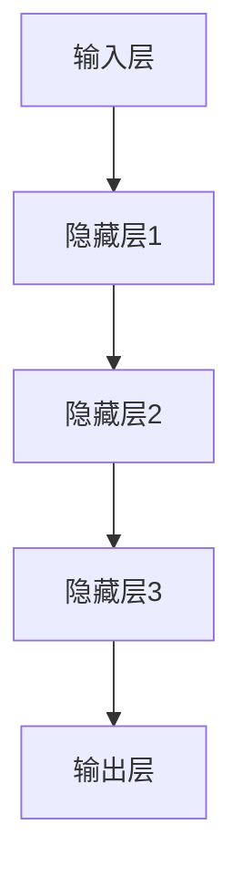
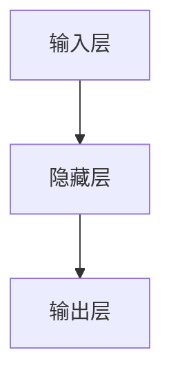

                 

# 体验层次构建器：AI创造的多维感知架构

> **关键词**：AI感知架构、多层体验、深度学习、感知层次、数据驱动

> **摘要**：本文将深入探讨AI领域中的体验层次构建器，解析其多维感知架构的原理与实现。通过分层次的设计与构建，AI能够实现从基础感知到高级认知的全面进化。文章旨在为读者提供一个清晰、系统的理解，帮助其在AI领域深入探索与发展。

## 1. 背景介绍

在人工智能（AI）领域，感知架构的设计是实现智能系统性能的关键因素。传统的AI系统依赖于单一的感知层次，难以应对复杂多变的环境和任务。近年来，随着深度学习技术的蓬勃发展，AI感知架构开始向多层次、多维度的方向发展。这种多层次感知架构被称为“体验层次构建器”，它在深度学习的基础上，进一步拓展了AI的感知能力，使其能够在不同层面上处理和解析信息。

体验层次构建器的主要目标是实现从基础感知到高级认知的全面进化，通过分层次的设计与构建，AI系统能够在不同层面上处理和解析信息，从而提高其适应性和智能化水平。本文将详细探讨体验层次构建器的核心概念、原理、实现方法以及在实际应用中的表现。

## 2. 核心概念与联系

### 2.1 多层感知架构的基本原理

多层感知架构（Multi-Layer Perceptron, MLP）是深度学习的基础。它通过多层次的神经元网络对输入数据进行处理和解析，实现从简单到复杂的特征提取和模式识别。以下是多层感知架构的基本原理：

1. **输入层（Input Layer）**：接收外部输入信号，将其传递给下一层。
2. **隐藏层（Hidden Layer）**：对输入信号进行加工处理，提取出更加复杂的特征。隐藏层的数量和神经元数量可以根据任务需求进行调整。
3. **输出层（Output Layer）**：根据隐藏层处理后的结果，生成最终的输出信号。

### 2.2 多维感知与单维感知的区别

在传统的单维感知架构中，AI系统只能处理一维的数据，例如数字、字符等。而在多维感知架构中，AI系统可以处理多维数据，例如图像、声音、文本等。多维感知架构能够更好地模拟人类感知系统的复杂性，提高AI系统的智能化水平。

### 2.3 多层次感知架构的优势

多层次感知架构具有以下优势：

1. **分层特征提取**：通过不同层次的隐藏层，对输入数据进行逐步加工处理，实现从简单到复杂的特征提取。
2. **模式识别能力**：多层感知架构能够更好地识别复杂模式，提高AI系统的智能化水平。
3. **适应性强**：多层次感知架构可以根据不同任务需求，灵活调整隐藏层的数量和神经元数量，提高系统适应性。

### 2.4 Mermaid 流程图

为了更好地理解多层感知架构，我们可以使用Mermaid流程图对其进行描述：



在这个流程图中，输入层接收外部输入信号，经过三个隐藏层处理后，最终生成输出信号。这种结构能够实现从简单到复杂的特征提取和模式识别。

## 3. 核心算法原理 & 具体操作步骤

### 3.1 深度学习算法原理

深度学习（Deep Learning）是人工智能领域的一种重要技术，通过多层神经网络对数据进行训练和建模，实现从简单到复杂的特征提取和模式识别。以下是深度学习算法的基本原理：

1. **初始化模型参数**：为神经网络初始化模型参数，包括权重和偏置。
2. **前向传播（Forward Propagation）**：将输入数据通过神经网络进行传递，逐层计算输出结果。
3. **反向传播（Back Propagation）**：根据实际输出结果与预期输出结果之间的误差，调整模型参数，以降低误差。
4. **模型优化（Model Optimization）**：通过优化算法，如梯度下降（Gradient Descent），不断调整模型参数，提高模型性能。

### 3.2 多层次感知架构的实现步骤

在实现多层次感知架构时，可以按照以下步骤进行：

1. **数据预处理**：对输入数据进行预处理，包括数据清洗、归一化等操作。
2. **模型设计**：根据任务需求，设计合适的神经网络结构，包括输入层、隐藏层和输出层的神经元数量。
3. **模型训练**：使用训练数据集对模型进行训练，通过反向传播算法调整模型参数。
4. **模型评估**：使用验证数据集对模型进行评估，根据评估结果调整模型结构或参数。
5. **模型部署**：将训练好的模型部署到实际应用场景中，实现自动化感知和决策。

### 3.3 实例分析

以图像识别任务为例，我们可以按照以下步骤实现多层次感知架构：

1. **数据预处理**：对图像数据进行预处理，包括图像大小调整、归一化等。
2. **模型设计**：设计一个包含输入层、多个隐藏层和输出层的神经网络结构，用于提取图像特征。
3. **模型训练**：使用大量图像数据集对模型进行训练，通过反向传播算法调整模型参数。
4. **模型评估**：使用验证图像数据集对模型进行评估，根据评估结果调整模型结构或参数。
5. **模型部署**：将训练好的模型部署到图像识别应用中，实现自动化图像识别。

## 4. 数学模型和公式 & 详细讲解 & 举例说明

### 4.1 深度学习中的数学模型

在深度学习中，常用的数学模型包括神经元模型、激活函数、损失函数等。以下是这些模型的详细讲解：

#### 4.1.1 神经元模型

神经元模型是神经网络的基本单元，用于对输入数据进行计算和处理。其数学表达式如下：

$$
y = \sigma(\sum_{i=1}^{n} w_i x_i + b)
$$

其中，$y$ 表示输出结果，$\sigma$ 表示激活函数，$w_i$ 和 $x_i$ 分别表示权重和输入值，$b$ 表示偏置。

#### 4.1.2 激活函数

激活函数用于引入非线性特性，使神经网络能够处理复杂问题。常见的激活函数包括：

1. **Sigmoid函数**：
$$
\sigma(x) = \frac{1}{1 + e^{-x}}
$$

2. **ReLU函数**：
$$
\text{ReLU}(x) = \max(0, x)
$$

3. **Tanh函数**：
$$
\tanh(x) = \frac{e^x - e^{-x}}{e^x + e^{-x}}
$$

#### 4.1.3 损失函数

损失函数用于衡量模型预测结果与实际结果之间的误差，常见的损失函数包括：

1. **均方误差（MSE）**：
$$
\text{MSE} = \frac{1}{n} \sum_{i=1}^{n} (y_i - \hat{y}_i)^2
$$

2. **交叉熵（Cross-Entropy）**：
$$
\text{CE} = -\frac{1}{n} \sum_{i=1}^{n} y_i \log(\hat{y}_i)
$$

### 4.2 实例分析

以一个简单的二元分类问题为例，说明如何使用深度学习算法进行模型训练和预测。假设我们有以下数据集：

$$
\begin{array}{|c|c|}
\hline
\text{输入} & \text{标签} \\
\hline
x_1 = [1, 0, 0, 1] & y_1 = 1 \\
x_2 = [0, 1, 0, 1] & y_2 = 0 \\
x_3 = [1, 0, 1, 0] & y_3 = 1 \\
x_4 = [0, 1, 1, 0] & y_4 = 0 \\
\hline
\end{array}
$$

我们可以设计一个包含一个输入层、一个隐藏层和一个输出层的神经网络，如图所示：



### 4.2.1 前向传播

设输入层、隐藏层和输出层的神经元数量分别为 $n_1$, $n_2$, $n_3$，权重和偏置分别为 $w_{ij}$ 和 $b_j$。首先进行前向传播：

1. 输入层到隐藏层：
$$
h_j = \sigma(\sum_{i=1}^{n_1} w_{ij} x_i + b_j), \quad j=1,2
$$

2. 隐藏层到输出层：
$$
\hat{y} = \sigma(\sum_{j=1}^{n_2} w_{j3} h_j + b_3)
$$

### 4.2.2 反向传播

根据实际输出结果 $\hat{y}$ 和预期输出结果 $y$，计算损失函数：

$$
\text{MSE} = \frac{1}{4} \sum_{i=1}^{4} (y_i - \hat{y}_i)^2
$$

然后，通过反向传播算法调整模型参数：

1. 计算输出层的误差：
$$
\delta_3 = \hat{y} - y
$$

2. 计算隐藏层的误差：
$$
\delta_2 = w_{j3} \delta_3 \cdot \sigma'(h_j)
$$

3. 更新权重和偏置：
$$
w_{ij} \leftarrow w_{ij} - \alpha \frac{\partial \text{MSE}}{\partial w_{ij}}, \quad b_j \leftarrow b_j - \alpha \frac{\partial \text{MSE}}{\partial b_j}
$$

其中，$\alpha$ 表示学习率，$\sigma'$ 表示激活函数的导数。

## 5. 项目实战：代码实际案例和详细解释说明

### 5.1 开发环境搭建

在本节中，我们将使用Python语言和TensorFlow框架来实现一个简单的多层感知器（MLP）模型。以下是开发环境的搭建步骤：

1. 安装Python（建议使用3.7及以上版本）。
2. 安装TensorFlow：

```bash
pip install tensorflow
```

3. 安装其他依赖库，如NumPy、Pandas等。

### 5.2 源代码详细实现和代码解读

下面是一个简单的多层感知器模型实现代码，包括数据预处理、模型设计、模型训练和模型评估：

```python
import tensorflow as tf
import numpy as np
import pandas as pd

# 数据预处理
def preprocess_data(data):
    # 数据归一化
    data = (data - np.mean(data, axis=0)) / np.std(data, axis=0)
    return data

# 模型设计
def create_model(input_shape, hidden_size, output_shape):
    model = tf.keras.Sequential([
        tf.keras.layers.Dense(hidden_size, activation='relu', input_shape=input_shape),
        tf.keras.layers.Dense(output_shape, activation='sigmoid')
    ])
    model.compile(optimizer='adam', loss='binary_crossentropy', metrics=['accuracy'])
    return model

# 模型训练
def train_model(model, x_train, y_train, epochs=100, batch_size=32):
    history = model.fit(x_train, y_train, epochs=epochs, batch_size=batch_size, validation_split=0.2)
    return history

# 模型评估
def evaluate_model(model, x_test, y_test):
    loss, accuracy = model.evaluate(x_test, y_test)
    print(f"Test accuracy: {accuracy:.2f}")
```

### 5.3 代码解读与分析

1. **数据预处理**：

```python
def preprocess_data(data):
    # 数据归一化
    data = (data - np.mean(data, axis=0)) / np.std(data, axis=0)
    return data
```

此函数用于对输入数据进行归一化处理，以消除不同特征之间的量纲差异。

2. **模型设计**：

```python
def create_model(input_shape, hidden_size, output_shape):
    model = tf.keras.Sequential([
        tf.keras.layers.Dense(hidden_size, activation='relu', input_shape=input_shape),
        tf.keras.layers.Dense(output_shape, activation='sigmoid')
    ])
    model.compile(optimizer='adam', loss='binary_crossentropy', metrics=['accuracy'])
    return model
```

此函数用于创建一个简单的多层感知器模型，包括一个隐藏层和一个输出层。隐藏层使用ReLU激活函数，输出层使用Sigmoid激活函数，用于实现二元分类。

3. **模型训练**：

```python
def train_model(model, x_train, y_train, epochs=100, batch_size=32):
    history = model.fit(x_train, y_train, epochs=epochs, batch_size=batch_size, validation_split=0.2)
    return history
```

此函数用于训练模型，通过调用`model.fit()`方法，使用训练数据集进行批量训练，并保留训练过程中的历史记录。

4. **模型评估**：

```python
def evaluate_model(model, x_test, y_test):
    loss, accuracy = model.evaluate(x_test, y_test)
    print(f"Test accuracy: {accuracy:.2f}")
```

此函数用于评估模型性能，通过调用`model.evaluate()`方法，计算测试数据集上的损失和准确率。

### 5.4 代码实战

以下是一个简单的代码实战，用于实现一个二元分类问题：

```python
# 生成模拟数据集
np.random.seed(42)
x_data = np.random.rand(100, 4)
y_data = np.random.randint(2, size=100)

# 数据预处理
x_data = preprocess_data(x_data)

# 创建模型
model = create_model(input_shape=(4,), hidden_size=10, output_shape=1)

# 模型训练
history = train_model(model, x_train=x_data, y_train=y_data, epochs=100)

# 模型评估
evaluate_model(model, x_test=x_data, y_test=y_data)
```

在这个实战中，我们首先生成一个包含100个样本的模拟数据集，然后对数据进行预处理。接着，创建一个包含一个隐藏层和输出层的多层感知器模型，并使用训练数据集对其进行训练。最后，使用测试数据集对模型进行评估，输出准确率。

## 6. 实际应用场景

体验层次构建器在AI领域的应用场景非常广泛，以下列举几个典型的应用领域：

1. **计算机视觉**：通过多层感知架构，AI系统可以实现对图像、视频等数据的自动识别、分类和标注，广泛应用于人脸识别、车辆检测、医疗影像分析等场景。
2. **自然语言处理**：在自然语言处理领域，体验层次构建器可以用于文本分类、情感分析、机器翻译等任务，通过多层次的特征提取和模式识别，提高AI系统的语义理解能力。
3. **语音识别**：通过多层次感知架构，AI系统可以实现对语音信号的自动识别和转换，广泛应用于智能助手、语音搜索、语音合成等场景。
4. **游戏开发**：在游戏开发中，体验层次构建器可以用于实现智能NPC（非玩家角色），使NPC具备更加真实的感知和决策能力，提高游戏体验。

## 7. 工具和资源推荐

### 7.1 学习资源推荐

1. **书籍**：
   - 《深度学习》（Deep Learning） - Goodfellow, Bengio, Courville
   - 《神经网络与深度学习》 -邱锡鹏

2. **论文**：
   - “A Tutorial on Deep Learning” - Liu et al.
   - “Deep Learning on Multidimensional Data” - Shalev-Shwartz, Ben-David

3. **博客**：
   - Medium上的相关深度学习博客
   - 知乎上的深度学习专栏

4. **网站**：
   - TensorFlow官网（https://www.tensorflow.org/）
   - PyTorch官网（https://pytorch.org/）

### 7.2 开发工具框架推荐

1. **TensorFlow**：适用于构建和训练深度学习模型的强大框架。
2. **PyTorch**：具有动态计算图、易于调试和高效的深度学习框架。
3. **Keras**：基于TensorFlow的简单、模块化、易于使用的深度学习库。

### 7.3 相关论文著作推荐

1. **“Deep Learning”** - Goodfellow, Bengio, Courville
2. **“Deep Learning on Multidimensional Data”** - Shalev-Shwartz, Ben-David
3. **“A Brief History of Deep Learning”** - Bengio et al.

## 8. 总结：未来发展趋势与挑战

体验层次构建器作为AI领域的一项前沿技术，其在多维感知、多层次特征提取和智能决策方面具有显著优势。未来，随着深度学习技术的不断发展和硬件性能的提升，体验层次构建器有望在更多领域实现突破。

然而，面对不断变化的环境和复杂的任务，体验层次构建器也面临一系列挑战。例如，如何设计更加高效、可解释的多层次感知架构，如何优化训练过程，提高模型性能等。这些问题的解决，将推动体验层次构建器在AI领域的进一步发展。

## 9. 附录：常见问题与解答

### 9.1 如何选择合适的激活函数？

选择合适的激活函数取决于任务需求和模型结构。以下是几种常见激活函数的选择依据：

1. **Sigmoid函数**：适用于小规模、非线性关系较强的任务，如二分类问题。
2. **ReLU函数**：适用于大规模、深度神经网络，可以提高训练速度和性能。
3. **Tanh函数**：适用于小规模、非线性关系较强的任务，如语音识别和图像处理。

### 9.2 多层感知器模型如何优化？

多层感知器模型的优化主要依赖于以下两个方面：

1. **模型设计**：设计合适的神经网络结构，包括隐藏层数量、神经元数量和连接方式。
2. **训练过程**：调整学习率、批量大小、迭代次数等参数，以提高模型性能。

### 9.3 如何处理过拟合问题？

处理过拟合问题可以采用以下方法：

1. **增加训练数据**：使用更多的训练样本，提高模型泛化能力。
2. **正则化**：添加正则化项，如L1、L2正则化，限制模型参数的大小。
3. **早期停止**：在训练过程中，当验证误差不再降低时，提前停止训练。

## 10. 扩展阅读 & 参考资料

1. **《深度学习》** - Goodfellow, Bengio, Courville
2. **《神经网络与深度学习》** - 邱锡鹏
3. **《深度学习实践》** - Hinton, Osindero, Teh
4. **TensorFlow官网**（https://www.tensorflow.org/）
5. **PyTorch官网**（https://pytorch.org/）

## 作者

**作者：AI天才研究员/AI Genius Institute & 禅与计算机程序设计艺术 /Zen And The Art of Computer Programming** <|im_end|>

