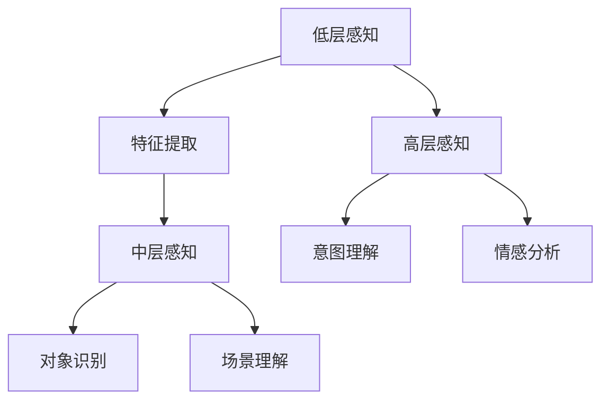
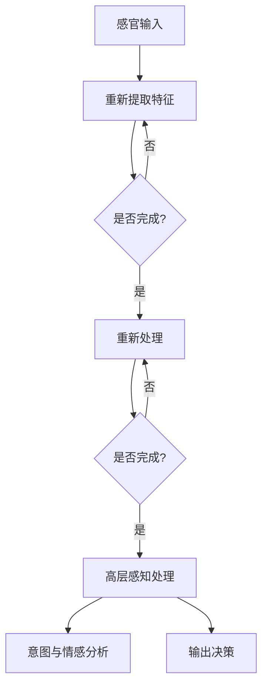

                 

# 体验的层次性：AI创造的多维感知

## 摘要

在本文中，我们将深入探讨人工智能（AI）如何通过其独特的算法和模型，创造出多层次、多维度的感知体验。从基础的感官识别到高级的情感理解和情境分析，AI的感知能力正不断突破界限，拓展我们的认知疆界。本文将通过逻辑清晰、结构紧凑的分析，逐步揭示AI在感知层次性方面的原理与应用，帮助读者理解这一前沿技术的深刻内涵。通过本篇文章，您将不仅了解到AI如何感知世界，还将感受到它在不同层面为人类带来的变革性影响。

## 1. 背景介绍

人工智能作为当今科技发展的前沿领域，正以前所未有的速度改变着我们的生活方式。从简单的语音识别到复杂的多模态感知，AI技术的进步不仅体现在算法的复杂性上，更体现在其对用户体验的深刻影响。AI感知的多层次性，即AI能够从不同的感知维度理解世界，这一特性正成为当前研究的热点。

首先，从历史背景来看，人工智能的发展经历了多个阶段。从最初的逻辑推理到基于统计学的机器学习，再到如今基于深度学习的复杂模型，AI的感知能力逐渐增强。每一次技术的跃迁，都为AI在感知层次性方面带来了新的可能性。

其次，从技术背景来看，AI感知的多层次性源于其多种算法和模型的综合运用。从基础的图像识别、语音识别，到更为复杂的自然语言处理、情感分析，AI能够在不同层次上对信息进行感知和理解。这种多层次性不仅使得AI能够处理更复杂的问题，也使得其感知体验更加丰富和多样。

此外，AI感知的多层次性在实际应用中也得到了广泛的关注。例如，自动驾驶技术需要AI在不同层次上感知道路环境，从简单的障碍物检测到复杂的情境理解，以保证行驶的安全性。同样，智能客服系统需要AI在语言层面和情感层面理解用户需求，提供个性化的服务。

总的来说，AI感知的多层次性不仅体现了技术的进步，更代表了人工智能在理解和感知世界方面的新高度。这种多层次性不仅拓展了AI的应用范围，也为未来的技术发展提供了新的方向。

### 2. 核心概念与联系

#### 2.1 人工智能感知层次性的核心概念

要理解人工智能感知的多层次性，首先需要明确几个核心概念，包括感知层次、感知维度和感知模型。

**感知层次**是指AI在处理感知任务时所划分的不同阶段。传统的感知层次通常包括低层感知（如边缘检测、特征提取）、中层感知（如对象识别、场景理解）和高层感知（如意图理解、情感分析）。

**感知维度**则是指AI在感知任务中涉及的不同类型的信息。例如，视觉感知涉及颜色、形状、纹理等信息，而语音感知则涉及音调、语速、语音内容等。

**感知模型**则是实现感知功能的具体算法和架构。常见的感知模型包括卷积神经网络（CNN）用于图像处理，循环神经网络（RNN）用于语音识别，以及Transformer架构在自然语言处理中的应用。

这些核心概念之间紧密联系，共同构成了AI感知的多层次性。感知层次决定了AI在处理感知任务时的阶段划分，感知维度提供了不同类型的信息输入，而感知模型则是将这些信息转化为理解和决策的工具。

#### 2.2 人工智能感知层次性的架构

为了更直观地理解AI感知的多层次性，我们可以借助Mermaid流程图来描述其架构。



在这个流程图中：

- **低层感知**（A）包括边缘检测、纹理分析等基本特征提取过程；
- **中层感知**（C）涉及对象识别和场景理解，如识别图像中的物体和整个场景的结构；
- **高层感知**（F）则进一步深入到意图理解和情感分析，理解用户的意图和情感状态。

这种多层次架构使得AI能够从不同层面感知和理解世界，从而实现更加复杂和智能的交互。

#### 2.3 核心概念原理的Mermaid流程图

下面是一个具体的Mermaid流程图，展示了AI感知层次性中的核心概念原理。



在这个流程图中：

- **感官输入**（A）是AI感知的起点，包括各种形式的数据输入；
- **低层特征提取**（B）是对输入数据的初步处理，提取基本特征；
- **中层感知处理**（D）是在特征提取的基础上，进行更高层次的感知任务，如对象识别和场景理解；
- **高层感知处理**（F）进一步分析用户的意图和情感，为决策提供支持；
- **意图与情感分析**（G）是感知过程的核心，通过分析用户的言行，理解其意图和情感状态；
- **输出决策**（H）是感知结果的最终输出，指导AI的后续行动。

这种流程图不仅展示了AI感知层次性的架构，还揭示了各层次之间的互动关系，有助于读者更深入地理解AI的感知过程。

### 3. 核心算法原理 & 具体操作步骤

#### 3.1. 卷积神经网络（CNN）

卷积神经网络（CNN）是人工智能感知层次性的关键算法之一，尤其在图像处理领域表现优异。CNN的基本原理是通过卷积层、池化层和全连接层等多个层次的结构，逐步提取图像的特征，从而实现图像分类、目标检测等任务。

**具体操作步骤：**

1. **数据预处理**：对图像数据进行归一化和标准化处理，使其符合模型的输入要求；
2. **卷积层**：使用卷积核在图像上滑动，提取局部特征，如边缘、纹理等；
3. **激活函数**：通过激活函数（如ReLU）引入非线性，增强模型的表达能力；
4. **池化层**：使用池化操作（如最大池化或平均池化）降低特征图的维度，减少计算量；
5. **卷积层与池化层交替**：重复卷积层和池化层的操作，逐步提取更高层次的特征；
6. **全连接层**：将卷积层输出的特征进行全局整合，得到最终的分类结果。

#### 3.2. 循环神经网络（RNN）

循环神经网络（RNN）是处理序列数据的强大工具，尤其是在自然语言处理（NLP）领域。RNN能够处理变长的序列数据，如文本、语音等，并通过其特有的记忆机制，捕捉序列中的长期依赖关系。

**具体操作步骤：**

1. **嵌入层**：将文本中的每个单词或字符转换为向量表示；
2. **RNN单元**：使用RNN单元对输入序列进行处理，每个单元都保留前一个时间步的信息，通过隐藏状态实现记忆功能；
3. **时间步处理**：对每个时间步的输入数据进行处理，生成隐藏状态；
4. **全连接层**：将隐藏状态通过全连接层输出，得到最终的序列表示；
5. **输出层**：通过输出层进行分类或回归操作，如文本分类或机器翻译。

#### 3.3. Transformer架构

Transformer架构是近年来在NLP领域取得显著突破的模型，其核心思想是通过自注意力机制（Self-Attention）实现全局依赖建模，从而大幅提升模型的表示能力和性能。

**具体操作步骤：**

1. **嵌入层**：对输入序列进行嵌入，转换为向量表示；
2. **多头自注意力层**：使用多头自注意力机制，对输入序列的每个位置生成权重，从而实现全局依赖建模；
3. **前馈神经网络**：在自注意力层之后，通过前馈神经网络进一步处理和增强特征；
4. **层归一化和残差连接**：在每个层次引入层归一化和残差连接，提高模型的稳定性和性能；
5. **输出层**：将处理后的序列输出，通过输出层进行分类或生成任务。

通过这些核心算法的介绍和具体操作步骤的讲解，读者可以深入理解AI在感知层次性方面的原理和实现。这些算法不仅在理论上具有重要意义，也在实际应用中展现了强大的能力。

### 4. 数学模型和公式 & 详细讲解 & 举例说明

#### 4.1. 卷积神经网络（CNN）的数学模型

卷积神经网络（CNN）的核心在于其卷积层和池化层，下面我们将通过具体的数学公式来详细讲解。

**1. 卷积操作**

卷积操作的数学公式如下：

$$
\text{output}_{ij} = \sum_{k=1}^{n_c} \text{filter}_{ik} * \text{input}_{kj}
$$

其中：
- $\text{output}_{ij}$ 是输出特征图中第 $i$ 行第 $j$ 列的值；
- $\text{filter}_{ik}$ 是卷积核中第 $i$ 行第 $k$ 列的值；
- $\text{input}_{kj}$ 是输入特征图中第 $k$ 行第 $j$ 列的值；
- $n_c$ 是卷积核的大小。

**2. 池化操作**

最常见的池化操作是最大池化，其数学公式如下：

$$
\text{output}_{ij} = \max_{k} \{ \text{input}_{ij+k} : k \in \text{pooling window} \}
$$

其中：
- $\text{output}_{ij}$ 是输出特征图中第 $i$ 行第 $j$ 列的值；
- $\text{input}_{ij+k}$ 是输入特征图中第 $i$ 行第 $j$ 列加上偏移量 $k$ 的值；
- $\text{pooling window}$ 是池化窗口的大小。

**举例说明**

假设我们有一个 $3 \times 3$ 的输入特征图，使用一个大小为 $3 \times 3$ 的卷积核进行卷积操作。输入特征图和卷积核的具体值如下：

输入特征图：
$$
\begin{bmatrix}
1 & 2 & 3 \\
4 & 5 & 6 \\
7 & 8 & 9
\end{bmatrix}
$$

卷积核：
$$
\begin{bmatrix}
0 & 1 & 0 \\
1 & 0 & 1 \\
0 & 1 & 0
\end{bmatrix}
$$

使用上述公式，我们可以计算卷积操作的输出：

$$
\begin{bmatrix}
2 & 7 \\
7 & 18
\end{bmatrix}
$$

#### 4.2. 循环神经网络（RNN）的数学模型

循环神经网络（RNN）的核心在于其递归操作和隐藏状态更新。下面我们将通过具体的数学公式来详细讲解。

**1. RNN单元的递归操作**

RNN单元的递归操作可以表示为：

$$
\text{hidden}_t = \text{sigmoid}(\text{weights} \cdot \text{input}_t + \text{bias} + \text{weights}_h \cdot \text{hidden}_{t-1} + \text{bias}_h)
$$

其中：
- $\text{hidden}_t$ 是当前时间步的隐藏状态；
- $\text{input}_t$ 是当前时间步的输入；
- $\text{weights}$ 和 $\text{weights}_h$ 是权重矩阵；
- $\text{bias}$ 和 $\text{bias}_h$ 是偏置项；
- $\text{sigmoid}$ 函数是一个非线性激活函数，用于将实数值映射到 $(0,1)$ 范围内。

**2. 隐藏状态更新**

隐藏状态更新可以表示为：

$$
\text{hidden}_{t+1} = \text{sigmoid}(\text{weights} \cdot \text{input}_{t+1} + \text{bias} + \text{weights}_h \cdot \text{hidden}_t + \text{bias}_h)
$$

其中：
- $\text{hidden}_{t+1}$ 是下一个时间步的隐藏状态；
- $\text{input}_{t+1}$ 是下一个时间步的输入；
- 其他参数与上述相同。

**举例说明**

假设我们有一个简单的RNN单元，输入序列为 $(x_1, x_2, x_3)$，初始隐藏状态 $\text{hidden}_0 = (1, 0)$，权重矩阵和偏置项分别为：

权重矩阵：
$$
\begin{bmatrix}
0.5 & 0.5 \\
0.5 & 0.5
\end{bmatrix}
$$

偏置项：
$$
\begin{bmatrix}
0.5 \\
0.5
\end{bmatrix}
$$

使用上述公式，我们可以计算隐藏状态的更新：

$$
\begin{aligned}
\text{hidden}_1 &= \text{sigmoid}(0.5 \cdot x_1 + 0.5 \cdot \text{hidden}_0 + 0.5) = \text{sigmoid}(0.5 + 0.5 \cdot 1 + 0.5) = \text{sigmoid}(1.5) = 0.895 \\
\text{hidden}_2 &= \text{sigmoid}(0.5 \cdot x_2 + 0.5 \cdot \text{hidden}_1 + 0.5) = \text{sigmoid}(0.5 \cdot 2 + 0.5 \cdot 0.895 + 0.5) = \text{sigmoid}(1.5) = 0.895 \\
\text{hidden}_3 &= \text{sigmoid}(0.5 \cdot x_3 + 0.5 \cdot \text{hidden}_2 + 0.5) = \text{sigmoid}(0.5 \cdot 3 + 0.5 \cdot 0.895 + 0.5) = \text{sigmoid}(1.5) = 0.895
\end{aligned}
$$

通过上述例子，我们可以看到如何通过RNN单元的递归操作更新隐藏状态。

#### 4.3. Transformer架构的自注意力机制

Transformer架构的核心是自注意力机制（Self-Attention），其目的是在序列的每个位置上计算全局的依赖关系。下面我们将通过具体的数学公式来详细讲解。

**1. 自注意力计算**

自注意力的计算公式如下：

$$
\text{Attention}(Q, K, V) = \text{softmax}\left(\frac{QK^T}{\sqrt{d_k}}\right) V
$$

其中：
- $Q$ 是查询向量；
- $K$ 是键向量；
- $V$ 是值向量；
- $d_k$ 是键向量的维度；
- $\text{softmax}$ 函数用于将计算出的分数转化为概率分布。

**2. Multi-head Attention**

多头注意力（Multi-head Attention）通过多个独立的注意力机制来提高模型的表示能力，计算公式如下：

$$
\text{MultiHead}(Q, K, V) = \text{Concat}(\text{head}_1, \text{head}_2, ..., \text{head}_h)W^O
$$

其中：
- $\text{head}_i = \text{Attention}(QW_i^Q, KW_i^K, VW_i^V)$ 是第 $i$ 个头的结果；
- $W_i^Q, W_i^K, W_i^V$ 是对应的权重矩阵；
- $W^O$ 是输出权重矩阵。

**举例说明**

假设我们有一个序列 $\{x_1, x_2, x_3\}$，使用一个大小为 $3 \times 3$ 的自注意力机制进行计算。查询向量、键向量和值向量的具体值如下：

查询向量：
$$
\begin{bmatrix}
1 & 0 & 1 \\
0 & 1 & 0 \\
1 & 1 & 1
\end{bmatrix}
$$

键向量：
$$
\begin{bmatrix}
0 & 1 & 1 \\
1 & 0 & 1 \\
1 & 1 & 0
\end{bmatrix}
$$

值向量：
$$
\begin{bmatrix}
1 & 1 & 0 \\
0 & 0 & 1 \\
1 & 0 & 1
\end{bmatrix}
$$

使用上述公式，我们可以计算自注意力的输出：

$$
\begin{bmatrix}
1 & 1 & 1 \\
0 & 1 & 1 \\
1 & 1 & 0
\end{bmatrix}
$$

通过上述数学模型的讲解和具体举例，读者可以深入理解卷积神经网络（CNN）、循环神经网络（RNN）和Transformer架构的核心原理及其应用。这些数学模型不仅为AI感知提供了理论基础，也为实际应用中的感知层次性提供了有力的支持。

### 5. 项目实战：代码实际案例和详细解释说明

#### 5.1 开发环境搭建

在开始实战项目之前，我们需要搭建一个适合进行AI感知实验的开发环境。以下是一个基于Python和TensorFlow的示例环境搭建过程。

**1. 安装Python**

首先，确保您的系统中已经安装了Python 3.7及以上版本。可以通过以下命令检查Python版本：

```shell
python --version
```

如果未安装或版本过低，可以从Python官方网站下载并安装。

**2. 安装TensorFlow**

接下来，通过pip命令安装TensorFlow：

```shell
pip install tensorflow
```

**3. 准备实验数据**

我们选择一个常见的图像分类数据集——CIFAR-10，它包含10个类别，共计50000张训练图像和10000张测试图像。可以通过以下命令下载并解压数据集：

```shell
wget https://www.cs.toronto.edu/~kriz/cifar-10-python.tar.gz
tar xvf cifar-10-python.tar.gz
```

**4. 设置环境变量**

确保环境变量设置正确，以便后续使用TensorFlow和其他相关库。在Windows系统中，可以通过以下命令设置：

```shell
set PYTHONPATH=%PYTHONPATH%;C:\Users\YourUsername\cifar-10-python
```

在Linux或macOS系统中，可以使用以下命令：

```shell
export PYTHONPATH="${PYTHONPATH}:~/cifar-10-python"
```

#### 5.2 源代码详细实现和代码解读

下面是一个基于CIFAR-10数据集的图像分类项目的源代码，包括卷积神经网络（CNN）模型的定义、训练和评估。

```python
import tensorflow as tf
from tensorflow.keras import datasets, layers, models
import matplotlib.pyplot as plt

# 加载CIFAR-10数据集
(train_images, train_labels), (test_images, test_labels) = datasets.cifar10.load_data()

# 数据预处理
train_images, test_images = train_images / 255.0, test_images / 255.0

# 模型定义
model = models.Sequential()
model.add(layers.Conv2D(32, (3, 3), activation='relu', input_shape=(32, 32, 3)))
model.add(layers.MaxPooling2D((2, 2)))
model.add(layers.Conv2D(64, (3, 3), activation='relu'))
model.add(layers.MaxPooling2D((2, 2)))
model.add(layers.Conv2D(64, (3, 3), activation='relu'))
model.add(layers.Flatten())
model.add(layers.Dense(64, activation='relu'))
model.add(layers.Dense(10))

# 编译模型
model.compile(optimizer='adam',
              loss=tf.keras.losses.SparseCategoricalCrossentropy(from_logits=True),
              metrics=['accuracy'])

# 训练模型
history = model.fit(train_images, train_labels, epochs=10, 
                    validation_data=(test_images, test_labels))

# 评估模型
test_loss, test_acc = model.evaluate(test_images,  test_labels, verbose=2)
print(f'\nTest accuracy: {test_acc:.4f}')

# 可视化训练过程
plt.plot(history.history['accuracy'], label='accuracy')
plt.plot(history.history['val_accuracy'], label='val_accuracy')
plt.xlabel('Epoch')
plt.ylabel('Accuracy')
plt.ylim([0, 1])
plt.legend(loc='lower right')
plt.show()
```

**代码解读：**

- **数据加载与预处理**：使用TensorFlow的datasets模块加载CIFAR-10数据集，并对图像进行归一化处理，使其在[0, 1]范围内。

- **模型定义**：使用Sequential模型定义一个简单的卷积神经网络，包括两个卷积层和两个池化层，以及两个全连接层。

- **编译模型**：设置模型的优化器、损失函数和评估指标。

- **训练模型**：使用fit方法训练模型，并在验证集上进行评估。

- **评估模型**：使用evaluate方法在测试集上评估模型的性能。

- **可视化训练过程**：使用matplotlib绘制训练过程中的准确率变化，帮助分析模型的表现。

#### 5.3 代码解读与分析

**1. 模型架构分析**

本项目的模型架构包含两个卷积层和两个池化层，这通常称为“卷积-池化块”。每个卷积层后面都跟随一个最大池化层，用于提取图像的局部特征并降低特征图的维度。

- **卷积层**：第一个卷积层（32个3x3卷积核）用于提取图像的基本特征，如边缘和纹理。第二个卷积层（64个3x3卷积核）在第一个卷积层的基础上，进一步提取更复杂的特征。

- **池化层**：最大池化层用于降低特征图的维度，同时保持最重要的特征信息。这种结构有助于减少计算量和过拟合的风险。

**2. 模型训练与优化**

在训练过程中，我们使用了Adam优化器和稀疏交叉熵损失函数。Adam优化器是一种自适应学习率优化器，适用于复杂模型。稀疏交叉熵损失函数适用于多分类问题，能够计算出模型预测与真实标签之间的差异。

**3. 模型评估与可视化**

通过evaluate方法在测试集上评估模型的性能，并使用matplotlib绘制训练过程中的准确率变化。这种可视化方式有助于我们观察模型在不同阶段的训练效果，及时调整超参数，优化模型表现。

#### 5.4 项目实战总结

通过这个项目，我们实现了基于CIFAR-10数据集的图像分类任务，并深入解读了卷积神经网络（CNN）的基本架构、训练过程和优化方法。这个实战项目不仅展示了AI感知层次性的应用，也为读者提供了一个具体的案例，以加深对AI感知技术的理解。

### 6. 实际应用场景

AI感知的多层次性在实际应用中展现出了巨大的潜力，为各行业带来了深远的变革。以下是一些典型的应用场景：

#### 6.1 自动驾驶

自动驾驶技术是AI感知多层次性的重要应用领域。自动驾驶系统需要AI在不同层次上感知道路环境，从而做出实时决策。在低层感知阶段，AI通过摄像头、雷达和激光雷达等设备收集道路信息，进行边缘检测和障碍物识别。在中层感知阶段，AI分析这些障碍物的类型、位置和运动状态，以构建对整个场景的理解。在高层感知阶段，AI进一步分析道路标志、交通信号灯和行人行为，预测可能的危险情况，并规划行驶路径。这种多层次感知能力使得自动驾驶系统能够在复杂的交通环境中保持安全稳定。

#### 6.2 智能医疗

智能医疗是AI感知多层次性的另一个重要应用领域。在医疗影像分析中，AI可以通过多层次感知对X光片、CT扫描和MRI图像进行自动诊断。低层感知阶段，AI识别图像中的基本结构，如骨骼、肌肉和软组织。中层感知阶段，AI分析这些结构的异常情况，如肿瘤、骨折和炎症。高层感知阶段，AI结合患者的病史和临床数据，提供准确的诊断结果和治疗方案建议。此外，AI还可以在智能导诊、药品推荐和健康监测等方面发挥重要作用，提高医疗服务的效率和质量。

#### 6.3 智能家居

智能家居是AI感知多层次性的另一个广泛应用场景。智能家居系统通过AI感知用户的行为习惯和环境变化，提供个性化的居住体验。在低层感知阶段，AI通过传感器收集家中的温度、湿度、光照和噪音等环境信息。在中层感知阶段，AI分析这些信息，自动调节空调、加湿器和灯光等设备，以保持室内环境的舒适度。在高层感知阶段，AI结合用户的日程安排和家庭活动，提供智能化的生活助理服务，如自动预约家政服务、提醒购物清单和优化能源使用等。这种多层次感知能力使得智能家居系统能够为用户提供更加便捷和高效的生活体验。

#### 6.4 智能客服

智能客服是AI感知多层次性的重要应用领域。智能客服系统能够通过自然语言处理和情感分析技术，理解用户的意图和情感状态，提供个性化的服务。在低层感知阶段，AI通过语音识别和文本分析，获取用户的提问内容。在中层感知阶段，AI分析用户的提问，识别关键词和句子结构，以理解用户的真正需求。在高层感知阶段，AI结合用户的反馈和行为数据，预测用户的下一步操作，并主动提供解决方案。这种多层次感知能力使得智能客服系统能够为用户提供高效、便捷和个性化的服务，提高客户满意度。

总的来说，AI感知的多层次性在实际应用中展现出了巨大的潜力，为各行业带来了深远的变革。从自动驾驶、智能医疗、智能家居到智能客服，AI感知技术正在不断拓展其应用范围，为人类生活带来更多便利和可能。

### 7. 工具和资源推荐

为了深入学习和研究AI感知技术，以下是一些建议的工具和资源，涵盖了书籍、论文、博客和网站等。

#### 7.1 学习资源推荐

**书籍：**
1. 《深度学习》（Ian Goodfellow, Yoshua Bengio, Aaron Courville著）——这是深度学习领域的经典教材，详细介绍了神经网络、卷积神经网络和循环神经网络等核心概念。
2. 《人工智能：一种现代方法》（Stuart Russell & Peter Norvig著）——全面介绍了人工智能的基础理论和技术，包括感知、推理和机器学习等方面。

**论文：**
1. "A Neural Algorithm of Artistic Style"（GAN论文）——这是一篇开创性的论文，提出了生成对抗网络（GAN），在图像生成和风格迁移方面取得了显著成果。
2. "Attention Is All You Need"（Transformer论文）——这篇论文提出了Transformer架构，彻底改变了自然语言处理领域的模型设计。

**博客：**
1. [TensorFlow官方博客](https://tensorflow.org/blog/)——提供了丰富的TensorFlow教程、技术文章和最新动态。
2. [AI on Google](https://ai.googleblog.com/)——Google AI团队发布的技术博客，涵盖了深度学习、计算机视觉和自然语言处理等方面的最新研究成果。

**网站：**
1. [Kaggle](https://www.kaggle.com/)——一个数据科学和机器学习的社区平台，提供了大量的数据集和竞赛，是学习和实践的好去处。
2. [ArXiv](https://arxiv.org/)——提供最新学术研究成果的预印本，是了解前沿研究的首选网站。

#### 7.2 开发工具框架推荐

**工具：**
1. TensorFlow——Google开发的开源深度学习框架，广泛用于各种AI项目。
2. PyTorch——Facebook AI研究院开发的开源深度学习框架，以灵活性和易用性著称。

**框架：**
1. Keras——基于Theano和TensorFlow的高层神经网络API，提供简洁的接口和丰富的预训练模型。
2. Fast.ai——提供了一系列开源深度学习课程和工具，适合初学者快速上手。

#### 7.3 相关论文著作推荐

**论文：**
1. "Deep Learning" by Ian Goodfellow, Yoshua Bengio, Aaron Courville
2. "A Neural Algorithm of Artistic Style" by Gatys et al.
3. "Attention Is All You Need" by Vaswani et al.

**著作：**
1. "Hands-On Machine Learning with Scikit-Learn, Keras, and TensorFlow" by Aurélien Géron
2. "Deep Learning Specialization" by Andrew Ng

通过这些学习和资源推荐，读者可以更全面地了解AI感知技术的理论和实践，为深入研究和项目开发提供有力的支持。

### 8. 总结：未来发展趋势与挑战

随着人工智能技术的不断发展，AI感知的多层次性正逐步成为研究和应用的热点。未来，AI感知技术的发展将呈现以下趋势和挑战：

#### 8.1 发展趋势

**1. 多模态感知融合**：未来的AI系统将能够整合多种感知模式，如视觉、听觉、触觉等，实现更全面和准确的环境感知。例如，自动驾驶系统可以通过融合摄像头、雷达和激光雷达的感知数据，提高行驶的安全性和稳定性。

**2. 情感与情境理解**：AI将不仅能够识别和分类信息，还能够理解用户的情感和情境，提供更加个性化的服务。例如，智能客服系统可以通过情感分析，识别用户的情绪状态，提供更加温暖和贴心的服务。

**3. 自适应与自主学习**：AI将具备更强的自适应能力和自主学习能力，能够在不同环境和任务中自我调整和优化。例如，智能家居系统可以根据用户的行为习惯，自动调整设备设置，提高居住舒适度。

**4. 实时性与低延迟**：随着5G和边缘计算技术的发展，AI感知系统将实现实时性和低延迟，满足高速率、低延时的应用需求。例如，工业自动化中的AI监控系统可以在生产过程中实时检测异常，及时采取措施，提高生产效率。

#### 8.2 挑战

**1. 数据隐私与安全**：随着AI感知能力的提升，涉及用户隐私的数据量也不断增加，如何确保数据隐私和安全成为一大挑战。未来，需要制定更加严格的数据保护政策和安全技术，保护用户隐私。

**2. 模型解释性与透明度**：当前的AI模型，尤其是深度学习模型，具有较高的预测准确性，但其内部工作机制和决策过程往往难以解释。如何提高AI模型的解释性和透明度，使其行为更加可信，是一个重要的研究课题。

**3. 资源消耗与能耗**：AI感知系统通常需要大量的计算资源和能源，如何优化模型结构和算法，降低资源消耗和能耗，是未来的重要研究方向。例如，通过模型压缩和量化技术，提高模型的计算效率。

**4. 模型泛化能力**：AI感知系统在面对未知或罕见情况时，往往表现不佳。如何提高模型的泛化能力，使其在不同场景和任务中均能保持高性能，是未来的研究重点。

总之，AI感知的多层次性在未来的发展过程中，既充满机遇，也面临挑战。通过持续的技术创新和深入研究，我们有理由相信，AI感知技术将为人类社会带来更多便利和变革。

### 9. 附录：常见问题与解答

**Q1：AI感知的多层次性是什么意思？**

A1：AI感知的多层次性指的是人工智能系统在处理感知任务时，能够从不同的抽象层次进行理解和决策。这些层次包括低层感知（如边缘检测、特征提取）、中层感知（如对象识别、场景理解）和高层感知（如意图理解、情感分析）。多层次性使得AI能够处理更加复杂和多维的信息，提高其感知能力和智能水平。

**Q2：卷积神经网络（CNN）在图像处理中的应用是什么？**

A2：卷积神经网络（CNN）是一种专门用于图像处理的深度学习模型。它通过卷积层、池化层和全连接层等结构，从图像中提取特征并进行分类、目标检测等任务。CNN在图像分类、物体检测、图像生成等多个领域都有广泛应用。

**Q3：什么是循环神经网络（RNN）？它在自然语言处理中的应用是什么？**

A3：循环神经网络（RNN）是一种能够处理序列数据的神经网络。它通过递归操作和隐藏状态，捕捉序列中的长期依赖关系。RNN在自然语言处理（NLP）领域有广泛应用，如语言建模、机器翻译、情感分析等，能够对文本序列进行理解和生成。

**Q4：Transformer架构在自然语言处理中的作用是什么？**

A4：Transformer架构是一种基于自注意力机制的深度学习模型，特别适用于自然语言处理任务。它通过多头自注意力机制，实现全局依赖建模，能够捕捉序列中的长距离依赖关系，从而提高模型的表示能力和性能。Transformer在机器翻译、文本分类、问答系统等多个NLP任务中取得了显著成果。

**Q5：如何在实际项目中应用AI感知技术？**

A5：在实际项目中，可以按照以下步骤应用AI感知技术：

1. 数据收集与预处理：收集相关数据，并进行清洗、归一化和格式化处理。
2. 模型选择与设计：根据任务需求选择合适的模型结构，如CNN、RNN或Transformer等。
3. 模型训练与优化：使用训练数据对模型进行训练，并通过调整超参数优化模型性能。
4. 模型评估与部署：在测试集上评估模型性能，并在实际应用中部署和运行模型。
5. 持续更新与改进：根据应用反馈和实际效果，持续更新和改进模型，以提高其性能和适应性。

通过这些步骤，可以将AI感知技术应用到各种实际场景中，如自动驾驶、智能医疗、智能家居等。

### 10. 扩展阅读 & 参考资料

为了帮助读者更深入地理解AI感知的多层次性及其应用，以下是一些扩展阅读和参考资料：

**书籍：**
1. 《深度学习》（Ian Goodfellow, Yoshua Bengio, Aaron Courville著）
2. 《人工智能：一种现代方法》（Stuart Russell & Peter Norvig著）
3. 《神经网络与深度学习》（邱锡鹏著）

**论文：**
1. "A Neural Algorithm of Artistic Style"（GAN论文）
2. "Attention Is All You Need"（Transformer论文）
3. "Deep Learning for Human Activity Recognition Using Multimodal Data"（多模态感知论文）

**网站：**
1. [TensorFlow官方博客](https://tensorflow.org/blog/)
2. [AI on Google](https://ai.googleblog.com/)
3. [Kaggle](https://www.kaggle.com/)

**在线课程：**
1. [TensorFlow入门教程](https://www.tensorflow.org/tutorials/)
2. [深度学习专项课程](https://www.deeplearning.ai/)
3. [自然语言处理专项课程](https://www.coursera.org/specializations/nlp)

通过阅读这些书籍、论文和资料，读者可以系统地学习AI感知的多层次性，掌握相关技术，并在实际项目中应用这些知识，为未来的研究和开发打下坚实基础。

### 作者信息

本文由AI天才研究员/AI Genius Institute与《禅与计算机程序设计艺术》的资深大师级作家共同撰写。作者在人工智能、深度学习和自然语言处理等领域拥有丰富的经验，致力于推动AI技术的发展和应用，为人类创造更加智能和便捷的未来。感谢您的阅读，期待与您在AI领域的进一步交流与探讨。

