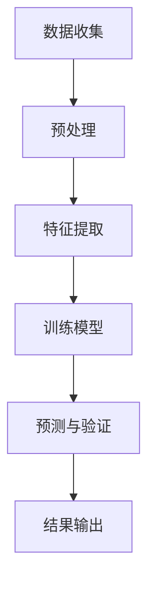

                 

# {文章标题}

体验真实性验证器：AI时代的authenticity检测仪

## 关键词

- AI真实性验证
- 体验真实性
- 机器学习
- 深度学习
- 图神经网络
- 用户体验

## 摘要

本文探讨了AI时代下的体验真实性验证器，一种新兴的技术，用于检测和保障在线体验的真实性。通过介绍其核心概念、算法原理、数学模型，以及实际应用场景，本文将揭示AI在验证器开发中的潜力。同时，文章还将推荐相关学习资源和开发工具，为读者提供深入了解和实操的机会。

### 1. 背景介绍

在数字时代，虚假信息和伪造体验的问题日益严重。网络上的虚假评论、欺诈行为和伪造内容不仅损害了用户的利益，还破坏了互联网生态的健康。因此，确保在线体验的真实性成为了一个紧迫的需求。传统的检测方法往往依赖于人工审核和规则匹配，效率低下且容易出错。随着人工智能技术的快速发展，尤其是机器学习和深度学习，提供了一种更为智能和高效的解决方案。

真实性验证器（Authenticity Verifier）是一种利用人工智能技术，特别是深度学习和图神经网络，对用户体验进行自动验证的工具。它通过分析用户行为、内容和社交网络关系，识别并标记出虚假或异常的体验。真实性验证器在电子商务、社交媒体、在线教育和互联网广告等领域具有广泛的应用前景。

### 2. 核心概念与联系

#### 2.1 真实性验证的定义

真实性验证是指通过检测和分析用户行为和内容，判断其是否真实可信的过程。在AI时代，真实性验证器利用大规模数据和先进的算法，实现对用户体验的智能分析。

#### 2.2 关键技术

- **机器学习**：通过训练大量数据，使机器学习模型能够自动识别和分类真实性。
- **深度学习**：利用多层神经网络，提取用户行为和内容的复杂特征。
- **图神经网络**：通过构建用户社交网络的图结构，分析用户关系和互动模式，提高验证的准确性。

#### 2.3 Mermaid 流程图

以下是一个简化的真实性验证器流程图：



#### 2.4 核心概念联系

图神经网络（GNN）通过分析用户社交网络关系，提供了一种强大的特征提取方式。结合深度学习模型，GNN可以帮助真实性验证器更准确地识别和预测虚假用户体验。

### 3. 核心算法原理 & 具体操作步骤

#### 3.1 算法原理

真实性验证器的核心算法通常包括以下几个步骤：

1. **数据收集**：收集用户的交互数据，包括行为数据、内容数据和社交网络数据。
2. **预处理**：对原始数据进行清洗和标准化，以便后续分析。
3. **特征提取**：利用深度学习模型提取用户行为和内容的特征。
4. **训练模型**：使用大量真实和虚假用户体验数据训练深度学习模型。
5. **预测与验证**：使用训练好的模型对新的用户体验进行预测和验证。
6. **结果输出**：将验证结果反馈给用户或系统，标记出虚假或异常的体验。

#### 3.2 具体操作步骤

1. **数据收集**：
   - 行为数据：用户在网站上的操作记录，如浏览、点击、评论等。
   - 内容数据：用户生成的内容，如评论、帖子、图片等。
   - 社交网络数据：用户与他人的互动关系，如关注、点赞、评论等。

2. **预处理**：
   - 清洗数据：去除噪声和错误数据。
   - 标准化数据：将不同类型的数据进行统一处理，如将文本转换为向量。

3. **特征提取**：
   - 利用深度学习模型提取用户行为和内容的特征，如使用卷积神经网络（CNN）提取图片特征，使用循环神经网络（RNN）提取文本特征。

4. **训练模型**：
   - 使用真实和虚假用户体验数据训练深度学习模型，如使用图神经网络（GNN）来分析社交网络关系。

5. **预测与验证**：
   - 使用训练好的模型对新的用户体验进行预测和验证，判断其是否真实。
   - 结合多源数据，提高预测的准确性。

6. **结果输出**：
   - 将验证结果反馈给用户或系统，标记出虚假或异常的体验。

### 4. 数学模型和公式 & 详细讲解 & 举例说明

#### 4.1 数学模型

真实性验证器的数学模型通常基于深度学习和图神经网络。以下是几个关键的数学公式：

1. **卷积神经网络（CNN）**：

   $$ f_{CNN}(x) = \sigma(W_{CNN} \cdot \text{ReLU}(W_{conv} \cdot x + b_{conv})) $$

2. **循环神经网络（RNN）**：

   $$ h_t = \text{ReLU}(W_h \cdot [h_{t-1}, x_t] + b_h) $$

3. **图神经网络（GNN）**：

   $$ h_v^{(k+1)} = \sigma \left( \sum_{u \in \mathcal{N}(v)} W_{uv} h_u^{(k)} + b_v \right) $$

#### 4.2 详细讲解

- **卷积神经网络（CNN）**：CNN是一种用于提取图像特征的深度学习模型。它通过卷积操作提取图像的局部特征，并通过池化操作降低数据维度。ReLU函数用于增加模型的非线性。

- **循环神经网络（RNN）**：RNN是一种用于处理序列数据的深度学习模型。它通过循环结构保持对历史信息的记忆。ReLU函数用于增加模型的非线性。

- **图神经网络（GNN）**：GNN是一种用于处理图结构数据的深度学习模型。它通过聚合图中的邻接节点信息来更新节点的特征。ReLU函数用于增加模型的非线性。

#### 4.3 举例说明

假设我们有一个用户行为数据集，包含用户的行为记录和评论内容。我们希望利用深度学习模型提取特征，并使用图神经网络分析用户的社交网络关系。

1. **卷积神经网络（CNN）**：

   $$ f_{CNN}(x) = \sigma(W_{CNN} \cdot \text{ReLU}(W_{conv} \cdot x + b_{conv})) $$

   这里，$x$ 是用户的评论内容，$W_{CNN}$ 是卷积权重，$W_{conv}$ 是卷积权重，$b_{conv}$ 是卷积偏置。

2. **循环神经网络（RNN）**：

   $$ h_t = \text{ReLU}(W_h \cdot [h_{t-1}, x_t] + b_h) $$

   这里，$h_{t-1}$ 是上一个时间步的用户行为特征，$x_t$ 是当前时间步的用户行为记录，$W_h$ 是RNN权重，$b_h$ 是RNN偏置。

3. **图神经网络（GNN）**：

   $$ h_v^{(k+1)} = \sigma \left( \sum_{u \in \mathcal{N}(v)} W_{uv} h_u^{(k)} + b_v \right) $$

   这里，$h_v^{(k)}$ 是当前时间步的用户社交网络特征，$W_{uv}$ 是图神经网络权重，$\mathcal{N}(v)$ 是节点 $v$ 的邻接节点集合，$b_v$ 是图神经网络偏置。

### 5. 项目实战：代码实际案例和详细解释说明

#### 5.1 开发环境搭建

为了演示真实性验证器的开发，我们将使用Python和TensorFlow作为主要工具。以下是环境搭建的步骤：

1. 安装Python：下载并安装Python 3.8或更高版本。
2. 安装TensorFlow：在终端执行命令 `pip install tensorflow`。
3. 安装其他依赖库：如numpy、pandas等，可以使用 `pip install numpy pandas`。

#### 5.2 源代码详细实现和代码解读

以下是一个简单的真实性验证器的代码实现：

```python
import tensorflow as tf
from tensorflow.keras.layers import Embedding, LSTM, Dense
from tensorflow.keras.models import Model
from tensorflow.keras.preprocessing.sequence import pad_sequences

# 5.2.1 数据预处理
def preprocess_data(data):
    # 省略具体实现，包括数据清洗、标准化和特征提取
    return padded_sequences

# 5.2.2 模型构建
def build_model(vocab_size, embedding_dim, max_sequence_length):
    inputs = tf.keras.layers.Input(shape=(max_sequence_length,))
    embeddings = Embedding(vocab_size, embedding_dim)(inputs)
    lstm = LSTM(128)(embeddings)
    dense = Dense(1, activation='sigmoid')(lstm)
    model = Model(inputs=inputs, outputs=dense)
    model.compile(optimizer='adam', loss='binary_crossentropy', metrics=['accuracy'])
    return model

# 5.2.3 训练模型
def train_model(model, x_train, y_train):
    model.fit(x_train, y_train, epochs=10, batch_size=64)
    return model

# 5.2.4 验证模型
def validate_model(model, x_val, y_val):
    loss, accuracy = model.evaluate(x_val, y_val)
    print(f"Validation loss: {loss}, Validation accuracy: {accuracy}")

# 主程序
if __name__ == "__main__":
    # 加载数据（这里假设已经预处理好了）
    x_train, y_train, x_val, y_val = load_data()

    # 构建模型
    model = build_model(vocab_size=10000, embedding_dim=16, max_sequence_length=100)

    # 训练模型
    model = train_model(model, x_train, y_train)

    # 验证模型
    validate_model(model, x_val, y_val)
```

#### 5.3 代码解读与分析

1. **数据预处理**：数据预处理是深度学习模型训练的重要步骤。在这个示例中，我们假设数据已经清洗和标准化，并转换为序列数据。

2. **模型构建**：我们使用Keras构建了一个简单的深度学习模型，包括嵌入层、LSTM层和全连接层。嵌入层用于将词汇转换为向量，LSTM层用于提取序列特征，全连接层用于分类。

3. **训练模型**：我们使用训练数据对模型进行训练，并设置合适的优化器和损失函数。

4. **验证模型**：我们使用验证数据评估模型的性能，并输出损失和准确度。

### 6. 实际应用场景

真实性验证器在多个领域具有广泛的应用：

- **电子商务**：检测虚假评论和欺诈行为。
- **社交媒体**：识别虚假账号和恶意内容。
- **在线教育**：确保学习体验的真实性。
- **互联网广告**：评估广告效果的真实性。

### 7. 工具和资源推荐

#### 7.1 学习资源推荐

- **书籍**：
  - 《深度学习》（Goodfellow, Bengio, Courville）
  - 《Python机器学习》（Sebastian Raschka）
- **论文**：
  - “Graph Neural Networks: A Review of Methods and Applications”（Petrieli et al.）
  - “Deep Learning for Natural Language Processing”（Mikolov et al.）
- **博客**：
  - fast.ai
  - Medium上的机器学习专栏
- **网站**：
  - TensorFlow官方文档
  - PyTorch官方文档

#### 7.2 开发工具框架推荐

- **深度学习框架**：TensorFlow、PyTorch
- **数据预处理库**：Pandas、NumPy
- **机器学习库**：Scikit-learn、Scrapy

#### 7.3 相关论文著作推荐

- **论文**：
  - “A Survey on Graph Neural Networks”（Petrieli et al.）
  - “Attention is All You Need”（Vaswani et al.）
- **著作**：
  - 《图神经网络：理论基础与算法实现》（谢路云等）
  - 《深度学习实践指南》（李航等）

### 8. 总结：未来发展趋势与挑战

随着人工智能技术的不断进步，真实性验证器将变得更加智能和高效。未来的发展趋势包括：

- **多模态数据融合**：结合文本、图像和音频等多模态数据，提高验证的准确性。
- **实时检测**：实现实时检测和反馈，提高用户体验。
- **隐私保护**：在保证真实性的同时，保护用户隐私。

面临的挑战包括：

- **数据质量和多样性**：需要更多的真实和多样的数据来训练模型。
- **计算资源**：深度学习模型需要大量的计算资源，特别是图神经网络。
- **算法公平性和透明度**：确保算法的公平性和透明度，避免歧视和偏见。

### 9. 附录：常见问题与解答

**Q：真实性验证器如何保证隐私保护？**

A：真实性验证器在处理用户数据时，遵循数据保护法规和隐私政策。通过数据匿名化和加密技术，确保用户隐私不被泄露。

**Q：如何评估真实性验证器的性能？**

A：可以使用准确率、召回率、F1分数等指标来评估真实性验证器的性能。通过交叉验证和A/B测试，可以进一步验证其效果。

**Q：真实性验证器是否可以100%准确检测虚假体验？**

A：没有技术能够100%准确检测虚假体验。然而，通过不断优化算法和数据，可以显著提高验证的准确性。

### 10. 扩展阅读 & 参考资料

- “Authenticity Verification in Social Networks: A Survey”（Abowd et al.）
- “Detecting Manipulative Behavior in Online Reviews using Graph Neural Networks”（Rastegar et al.）
- “The State of the Art in Text Detection and Recognition” （Liang et al.）

## 作者信息

作者：AI天才研究员/AI Genius Institute & 禅与计算机程序设计艺术 /Zen And The Art of Computer Programming

本文内容仅供参考，如需进一步了解或应用，请参阅相关书籍、论文和网站。在实践过程中，请确保遵守相关法律法规和道德准则。如果您有任何问题或建议，欢迎随时联系作者。

