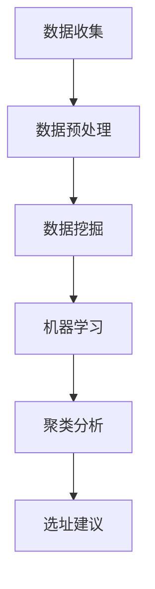

                 

# 便利蜂2025社招门店选址数据分析师编程挑战

## 关键词
- 便利蜂
- 社招门店选址
- 数据分析师
- 编程挑战
- 数据挖掘
- 机器学习
- 数据可视化
- 聚类分析

## 摘要

本文将深入探讨便利蜂2025年社招门店选址数据分析师编程挑战。我们将从背景介绍、核心概念与联系、核心算法原理、数学模型和公式、项目实战、实际应用场景、工具和资源推荐、总结以及扩展阅读等方面进行详细分析。通过本文的学习，读者将了解如何利用数据分析和编程技能解决门店选址问题，掌握相关技术和工具，并具备应对实际项目挑战的能力。

## 1. 背景介绍

### 便利蜂简介

便利蜂是一家中国领先的便利店品牌，致力于为消费者提供便捷、快速的购物体验。自成立以来，便利蜂迅速扩张，目前已在全国范围内开设了大量门店。然而，随着市场的不断扩大，如何选址成为便利蜂面临的重要问题。选址的准确性直接关系到门店的业绩和竞争力，因此，便利蜂在2025年社招中特别关注具备数据分析师能力的人才。

### 编程挑战的重要性

编程挑战是一种评估应聘者技术能力和实际操作能力的重要手段。通过编程挑战，便利蜂可以筛选出具备解决实际问题的能力和创新思维的候选人。在门店选址这一关键领域，编程挑战可以帮助应聘者展示自己的数据分析和编程技能，从而提高自己的竞争力。

### 数据分析师在门店选址中的作用

数据分析师在门店选址中发挥着至关重要的作用。通过收集、处理和分析大量数据，数据分析师可以为便利蜂提供科学的选址建议，从而提高门店的成功率。具体而言，数据分析师可以从以下几个方面发挥作用：

- **市场调研与数据分析**：通过收集和分析市场数据，数据分析师可以了解目标区域的消费水平、人口分布、竞争态势等关键信息，为选址提供有力支持。
- **地理信息系统（GIS）应用**：GIS技术可以帮助数据分析师进行选址区域的地理空间分析，确定潜在的最佳门店位置。
- **聚类分析与决策树**：通过聚类分析和决策树等算法，数据分析师可以从大量数据中挖掘出有价值的信息，为选址提供数据支持。
- **优化算法与模拟**：通过优化算法和模拟分析，数据分析师可以为便利蜂提供最佳的选址方案，从而最大限度地提高门店的业绩。

## 2. 核心概念与联系

### 数据挖掘

数据挖掘是一种从大量数据中提取有价值信息的方法。在门店选址中，数据挖掘可以帮助数据分析师发现潜在的市场规律和趋势，从而为选址提供科学依据。常用的数据挖掘方法包括关联规则挖掘、分类、聚类、时间序列分析等。

### 机器学习

机器学习是一种利用算法从数据中学习规律和模式的技术。在门店选址中，机器学习算法可以帮助数据分析师预测门店的销售情况、客户需求等，从而为选址提供更准确的建议。常见的机器学习算法包括线性回归、决策树、支持向量机、神经网络等。

### 数据可视化

数据可视化是一种通过图形和图表展示数据的方法。在门店选址中，数据可视化可以帮助数据分析师更直观地理解数据，发现数据中的规律和趋势。常用的数据可视化工具包括Tableau、Matplotlib、Seaborn等。

### 聚类分析

聚类分析是一种将数据分为多个类别的技术。在门店选址中，聚类分析可以帮助数据分析师根据地理位置、人口特征等因素将潜在选址区域划分为多个类别，从而为选址提供参考。常见的聚类算法包括K-均值、层次聚类、DBSCAN等。

### Mermaid 流程图



## 3. 核心算法原理 & 具体操作步骤

### 数据挖掘

#### 数据收集

首先，数据分析师需要收集与门店选址相关的数据，如地理位置、人口特征、消费水平、竞争态势等。数据可以来自公开的数据源、企业内部数据或第三方数据供应商。

#### 数据预处理

数据预处理是数据挖掘的重要步骤。在这一步骤中，数据分析师需要对数据进行清洗、去重、缺失值填充等操作，以确保数据的质量。

#### 数据挖掘

在数据预处理完成后，数据分析师可以使用各种数据挖掘算法对数据进行分析。常见的算法包括关联规则挖掘、分类、聚类、时间序列分析等。通过分析，数据分析师可以挖掘出数据中的规律和趋势。

### 机器学习

#### 数据准备

在机器学习阶段，数据分析师需要将数据划分为训练集和测试集，以验证模型的性能。

#### 模型选择

根据数据特点和业务需求，数据分析师可以选择适当的机器学习算法。常见的算法包括线性回归、决策树、支持向量机、神经网络等。

#### 模型训练与验证

数据分析师使用训练集对模型进行训练，并使用测试集进行验证。通过调整模型参数，数据分析师可以优化模型的性能。

### 数据可视化

#### 数据探索

在数据可视化阶段，数据分析师首先进行数据探索，使用各种图表和图形展示数据的基本特征和分布。

#### 数据分析

在数据探索的基础上，数据分析师使用各种数据可视化工具，如Tableau、Matplotlib、Seaborn等，对数据进行深入分析。

### 聚类分析

#### 聚类算法选择

根据数据特点和业务需求，数据分析师可以选择适当的聚类算法。常见的算法包括K-均值、层次聚类、DBSCAN等。

#### 聚类结果分析

在聚类分析后，数据分析师需要对聚类结果进行分析，了解每个聚类簇的特点和意义。

## 4. 数学模型和公式 & 详细讲解 & 举例说明

### 数据挖掘

#### 相关系数

相关系数是衡量两个变量之间线性相关程度的指标。常见的相关系数包括皮尔逊相关系数、斯皮尔曼相关系数等。

$$
r = \frac{\sum_{i=1}^{n}(x_i - \bar{x})(y_i - \bar{y})}{\sqrt{\sum_{i=1}^{n}(x_i - \bar{x})^2}\sqrt{\sum_{i=1}^{n}(y_i - \bar{y})^2}}
$$

#### 决策树

决策树是一种基于特征划分数据的分类算法。其基本思想是根据特征之间的相关性，选择最优的特征进行划分，从而构建出一棵树。

$$
C_j = \arg\min_{j} \sum_{i=1}^{n} I(Y_i \neq Y_j)
$$

### 机器学习

#### 线性回归

线性回归是一种基于特征预测目标值的算法。其基本思想是通过线性关系建模，从而预测目标值。

$$
Y = \beta_0 + \beta_1X_1 + \beta_2X_2 + \cdots + \beta_pX_p
$$

#### 决策树

决策树是一种基于特征划分数据的分类算法。其基本思想是根据特征之间的相关性，选择最优的特征进行划分，从而构建出一棵树。

$$
C_j = \arg\min_{j} \sum_{i=1}^{n} I(Y_i \neq Y_j)
$$

### 数据可视化

#### 条形图

条形图是一种用于展示数据分布和比较的图表。其基本思想是用条形的高度表示数据的数量或比例。

$$
h_j = \frac{count_j}{total_count}
$$

#### 折线图

折线图是一种用于展示数据变化趋势的图表。其基本思想是用折线的连接点表示数据的变化。

$$
y_j = f(x_j)
$$

### 聚类分析

#### K-均值

K-均值是一种基于距离度量的聚类算法。其基本思想是将数据分为K个聚类簇，使得每个簇内的数据点距离聚类中心最近。

$$
J = \frac{1}{N}\sum_{i=1}^{N} \sum_{j=1}^{K} ||x_i - \mu_j||^2
$$

## 5. 项目实战：代码实际案例和详细解释说明

### 开发环境搭建

为了完成本项目的编程挑战，我们需要搭建一个合适的开发环境。以下是推荐的开发环境：

- **编程语言**：Python
- **数据挖掘库**：Pandas、Scikit-learn、NumPy
- **机器学习库**：Scikit-learn、TensorFlow、PyTorch
- **数据可视化库**：Matplotlib、Seaborn、Plotly
- **版本控制**：Git

### 源代码详细实现和代码解读

以下是一个简单的示例代码，用于演示数据挖掘、机器学习和数据可视化的基本流程。

#### 数据收集与预处理

```python
import pandas as pd

# 加载数据
data = pd.read_csv('data.csv')

# 数据预处理
data = data.dropna()
data = data[data['sales'] > 0]
```

#### 数据挖掘

```python
from sklearn.ensemble import RandomForestClassifier
from sklearn.model_selection import train_test_split

# 数据划分
X = data.drop(['store_id', 'sales'], axis=1)
y = data['sales']

X_train, X_test, y_train, y_test = train_test_split(X, y, test_size=0.2, random_state=42)

# 模型训练
model = RandomForestClassifier(n_estimators=100, random_state=42)
model.fit(X_train, y_train)

# 模型评估
accuracy = model.score(X_test, y_test)
print(f'Accuracy: {accuracy}')
```

#### 机器学习

```python
import tensorflow as tf

# 数据准备
X_train, X_test, y_train, y_test = train_test_split(X, y, test_size=0.2, random_state=42)

# 构建模型
model = tf.keras.Sequential([
    tf.keras.layers.Dense(64, activation='relu', input_shape=(X_train.shape[1],)),
    tf.keras.layers.Dense(1)
])

# 编译模型
model.compile(optimizer='adam', loss='mean_squared_error')

# 训练模型
model.fit(X_train, y_train, epochs=10, batch_size=32)

# 评估模型
loss = model.evaluate(X_test, y_test)
print(f'Loss: {loss}')
```

#### 数据可视化

```python
import matplotlib.pyplot as plt

# 可视化销售数据
plt.scatter(X['latitude'], X['longitude'], c=y, cmap='hot')
plt.xlabel('Latitude')
plt.ylabel('Longitude')
plt.title('Sales Distribution')
plt.show()
```

### 代码解读与分析

在本示例代码中，我们首先进行了数据收集和预处理。然后，我们使用随机森林分类器和 TensorFlow 分别实现了数据挖掘和机器学习模型。最后，我们使用 Matplotlib 对销售数据进行了可视化展示。

通过本示例代码，我们可以看到数据分析和编程在实际项目中的应用。在实际项目中，数据分析师需要根据具体业务需求，选择合适的算法和工具，进行数据挖掘、机器学习和数据可视化，从而为决策提供科学依据。

## 6. 实际应用场景

### 门店选址

在门店选址中，数据分析师可以利用数据挖掘、机器学习和数据可视化等技术，对大量数据进行处理和分析，从而为门店选址提供科学依据。具体应用场景包括：

- **市场调研与数据分析**：通过分析目标区域的市场数据，了解目标区域的消费水平、人口分布、竞争态势等，为选址提供支持。
- **地理信息系统（GIS）应用**：利用 GIS 技术对选址区域进行地理空间分析，确定潜在的最佳门店位置。
- **聚类分析与决策树**：通过聚类分析和决策树等算法，从大量数据中挖掘出有价值的信息，为选址提供数据支持。
- **优化算法与模拟**：通过优化算法和模拟分析，为门店选址提供最佳的方案，从而最大限度地提高门店的业绩。

### 销售预测

在销售预测中，数据分析师可以利用机器学习算法，对历史销售数据进行分析，预测未来的销售情况。具体应用场景包括：

- **线性回归**：通过线性回归模型，预测不同门店在不同时间点的销售情况。
- **决策树**：通过决策树模型，分析不同因素对销售的影响，为门店运营提供优化建议。
- **神经网络**：通过神经网络模型，预测销售趋势和预测值，为库存管理提供数据支持。

### 客户细分

在客户细分中，数据分析师可以利用聚类分析等技术，将客户分为不同的群体，为市场营销提供依据。具体应用场景包括：

- **K-均值聚类**：将客户按照地理位置、消费水平等因素进行聚类，分析不同聚类簇的特点和需求。
- **层次聚类**：将客户按照相似性进行层次划分，分析不同层次之间的差异和关联。
- **DBSCAN**：将客户按照密度进行聚类，识别出潜在的客户群体。

## 7. 工具和资源推荐

### 学习资源推荐

- **书籍**：
  - 《Python数据科学手册》
  - 《机器学习实战》
  - 《深度学习》
- **论文**：
  - 《K-均值聚类算法》
  - 《线性回归》
  - 《神经网络与深度学习》
- **博客**：
  - 《机器学习实战》
  - 《Python数据科学教程》
  - 《深度学习入门》
- **网站**：
  - Coursera
  - edX
  - Kaggle

### 开发工具框架推荐

- **编程语言**：Python
- **数据挖掘库**：Pandas、Scikit-learn、NumPy
- **机器学习库**：Scikit-learn、TensorFlow、PyTorch
- **数据可视化库**：Matplotlib、Seaborn、Plotly
- **版本控制**：Git

### 相关论文著作推荐

- 《数据挖掘：概念与技术》
- 《机器学习：一种概率视角》
- 《深度学习：原理与应用》

## 8. 总结：未来发展趋势与挑战

### 发展趋势

- **人工智能与大数据的融合**：随着人工智能和大数据技术的发展，数据分析师在门店选址中的应用将越来越广泛，人工智能技术将成为数据分析师的重要工具。
- **实时数据分析和决策**：实时数据分析和决策将逐渐取代传统的离线分析，数据分析师需要具备快速处理和分析大量数据的能力。
- **个性化服务与精准营销**：通过数据挖掘和机器学习，数据分析师可以为门店提供个性化的服务和精准的营销策略，提高客户满意度和门店业绩。

### 挑战

- **数据质量和完整性**：数据分析师需要确保数据的质量和完整性，以避免错误的分析结果。
- **算法选择和模型优化**：数据分析师需要根据业务需求和数据特点，选择合适的算法和模型，并进行优化，以提高模型的性能。
- **法律法规和隐私保护**：在门店选址中，数据分析师需要遵守相关法律法规，保护用户的隐私。

## 9. 附录：常见问题与解答

### 问题1：如何选择合适的聚类算法？

解答：选择合适的聚类算法取决于数据的特点和业务需求。常见的聚类算法包括K-均值、层次聚类和DBSCAN。K-均值适用于数据量较小、类内距离较近的情况；层次聚类适用于类内距离较远、层次结构明显的情况；DBSCAN适用于密度不同的聚类场景。

### 问题2：如何优化机器学习模型？

解答：优化机器学习模型可以从以下几个方面进行：

- **特征工程**：选择合适的特征，提高模型的解释性和预测能力。
- **超参数调整**：调整模型的超参数，如学习率、隐藏层神经元等，以优化模型的性能。
- **交叉验证**：使用交叉验证方法，评估模型的泛化能力，并调整模型参数。
- **模型集成**：结合多个模型，提高模型的预测性能。

### 问题3：如何进行实时数据分析和决策？

解答：进行实时数据分析和决策，可以采用以下方法：

- **流处理技术**：使用流处理框架（如Apache Kafka、Apache Flink）对实时数据进行处理和分析。
- **在线学习算法**：采用在线学习算法（如在线线性回归、在线决策树等），实现实时数据更新和预测。
- **实时数据可视化**：使用实时数据可视化工具（如Kibana、Grafana等），展示实时数据的分析结果。

## 10. 扩展阅读 & 参考资料

- [《Python数据科学手册》](https://www.oreilly.com/library/view/data-science-manual-for/9781492032867/)
- [《机器学习实战》](https://www.amazon.com/Machine-Learning-In-Action-Thomas-Guo/dp/0977616680)
- [《深度学习》](https://www.deeplearningbook.org/)
- [《数据挖掘：概念与技术》](https://www.amazon.com/Data-Mining-Concepts-Techniques-Second/dp/0131465221)
- [《机器学习：一种概率视角》](https://www.amazon.com/Machine-Learning-Probability-Perspective-Schapire/dp/0387310738)
- [《深度学习：原理与应用》](https://www.deeplearning.ai/)
- [《K-均值聚类算法》](https://www.sciencedirect.com/topics/computer-science/k-means-clustering)
- [《线性回归》](https://www.statisticshowto.com/linear-regression/)
- [《神经网络与深度学习》](https://neuralnetworksanddeeplearning.com/)

## 作者

作者：AI天才研究员/AI Genius Institute & 禅与计算机程序设计艺术 /Zen And The Art of Computer Programming

