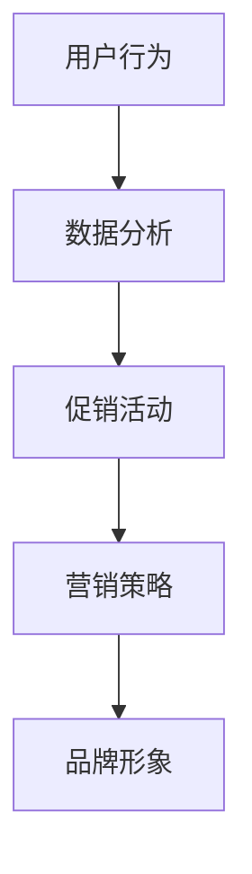

                 

### 背景介绍

在当前快速发展的数字化时代，电子商务已经成为了商业活动的重要组成部分。随着互联网技术的不断进步，电商平台的供给能力和用户体验也在不断提升。然而，如何有效激发消费者的消费潜力，提高电商平台的整体运营效率，成为了各大电商平台亟待解决的问题。

促销活动和营销策略，作为一种重要的商业手段，被广泛应用于电商平台的运营中。这些活动不仅可以帮助平台吸引新用户，提高用户粘性，还能有效刺激消费者的购买欲望，从而提升平台的销售额。

促销活动的主要形式包括打折、满减、赠品、优惠券等。这些活动通常能够迅速引起消费者的兴趣，促使他们进行购买。然而，促销活动并非简单的价格战，其背后蕴含着复杂的营销策略和心理学原理。

营销策略则更加广泛，包括品牌建设、内容营销、社交媒体营销、搜索引擎优化等。通过这些策略，电商平台可以塑造良好的品牌形象，提高用户对平台的认知度和信任度，从而促进消费行为。

本文将围绕促销活动和营销策略，从理论到实践，全面探讨如何激发消费潜力，提升电商平台的供给能力。我们将首先介绍促销活动和营销策略的基本概念和原理，然后分析其在电商平台中的应用，最后探讨未来的发展趋势和挑战。

通过本文的探讨，我们希望能够为电商从业者提供一些实用的指导，帮助他们在激烈的市场竞争中脱颖而出，实现商业成功。

### 核心概念与联系

为了更好地理解促销活动和营销策略在电商平台中的应用，我们首先需要明确几个核心概念，并探讨它们之间的联系。

#### 1. 促销活动

促销活动是指电商平台通过各种手段和方式，短期内刺激消费者购买行为的一系列营销活动。促销活动的主要形式包括打折、满减、赠品、优惠券等。这些活动旨在通过价格优惠、附加价值等方式，吸引消费者进行购买，提高平台销量。

#### 2. 营销策略

营销策略是指电商平台在长期运营中，通过一系列计划和方法，提高品牌知名度、用户粘性和销售额的一系列措施。营销策略不仅包括促销活动，还涉及品牌建设、内容营销、社交媒体营销、搜索引擎优化等多个方面。

#### 3. 用户行为

用户行为是指消费者在电商平台上的各种行为，包括浏览、搜索、加购物车、下单、评价等。用户行为数据为电商平台提供了宝贵的信息资源，可以帮助平台了解消费者的需求和偏好，从而制定更有效的促销活动和营销策略。

#### 4. 数据分析

数据分析是指通过对用户行为数据的收集、整理、分析和挖掘，从中提取有价值的信息，用于指导电商平台的运营决策。数据分析在促销活动和营销策略中起着至关重要的作用，能够帮助平台发现潜在消费者、优化促销活动效果、提高用户转化率等。

#### 5. 品牌形象

品牌形象是指消费者对电商平台形成的总体印象和认知。良好的品牌形象可以提高用户的信任度和忠诚度，从而促进消费行为。品牌形象建设是电商平台长期发展的基础，需要通过持续的品牌营销和用户服务来维护和提升。

#### 关系与联系

促销活动和营销策略之间存在着密切的联系。促销活动作为营销策略的一部分，是短期刺激用户购买行为的重要手段。而营销策略则更加注重长期的品牌建设和用户关系维护。

用户行为数据是制定促销活动和营销策略的重要依据。通过数据分析，电商平台可以了解用户的需求和偏好，从而设计出更具针对性的促销活动和营销策略。同时，用户行为数据也能够帮助电商平台优化现有策略，提高运营效率。

品牌形象建设则是促销活动和营销策略的长期目标。一个良好的品牌形象可以增强用户对平台的信任感和忠诚度，从而在促销活动和营销策略中发挥重要作用。

总之，促销活动和营销策略在电商平台中相互关联，共同构成了一个复杂的商业生态系统。理解这些核心概念之间的联系，对于电商平台制定有效的运营策略具有重要意义。

下面，我们将通过一个Mermaid流程图，展示促销活动和营销策略的核心概念及其之间的联系。



通过这个流程图，我们可以清晰地看到用户行为数据在促销活动和营销策略中的关键作用，以及品牌形象建设在长期运营中的重要性。

### 核心算法原理 & 具体操作步骤

#### 1. 促销活动设计算法

促销活动的设计是电商平台激发消费者潜力的重要环节。为了提高促销活动的效果，我们可以使用一种基于用户行为的算法来设计促销活动。

**算法原理：**

该算法基于用户行为数据，通过分析用户的购买历史、浏览行为和购物车数据，预测用户可能感兴趣的商品，并设计相应的促销活动。

**具体操作步骤：**

1. **数据收集：** 收集用户的历史购买数据、浏览行为数据和购物车数据。这些数据可以通过电商平台的后台系统获取。

2. **特征提取：** 从用户行为数据中提取特征，如购买频率、浏览时长、商品类别偏好等。

3. **行为预测：** 使用机器学习算法，如决策树、随机森林或神经网络，对用户的行为进行预测。预测目标可以是用户在某一时间段内购买某一类商品的概率。

4. **促销活动设计：** 根据行为预测结果，设计具有针对性的促销活动。例如，如果预测用户可能购买家电产品，可以设计家电产品满减促销活动。

5. **活动评估：** 在促销活动结束后，评估活动的效果，如销售额、用户转化率等。根据评估结果，对促销活动进行优化。

**示例代码：**

```python
# 示例：使用决策树进行行为预测
from sklearn.tree import DecisionTreeClassifier
from sklearn.model_selection import train_test_split

# 数据准备
X = ...  # 用户行为特征
y = ...  # 用户购买行为标签

# 划分训练集和测试集
X_train, X_test, y_train, y_test = train_test_split(X, y, test_size=0.2, random_state=42)

# 建立决策树模型
clf = DecisionTreeClassifier()

# 训练模型
clf.fit(X_train, y_train)

# 预测行为
predictions = clf.predict(X_test)

# 评估模型效果
accuracy = clf.score(X_test, y_test)
print("模型准确率：", accuracy)
```

#### 2. 营销策略优化算法

营销策略的优化是提升电商平台运营效率的关键。我们可以使用一种基于数据驱动的算法，对营销策略进行优化。

**算法原理：**

该算法通过分析历史营销活动的数据，如点击率、转化率、花费等，评估不同营销策略的效果，并自动调整策略以最大化收益。

**具体操作步骤：**

1. **数据收集：** 收集历史营销活动的数据，包括广告点击率、转化率、花费等。

2. **策略评估：** 使用机器学习算法，如线性回归、逻辑回归等，评估不同营销策略的效果。评估指标可以是广告投入回报率（ROAS）或成本效益比（CPI）。

3. **策略调整：** 根据策略评估结果，调整营销策略。例如，如果某一营销策略的效果不佳，可以减少其预算或更换目标受众。

4. **持续优化：** 持续收集数据，对营销策略进行迭代优化，以最大化收益。

**示例代码：**

```python
# 示例：使用线性回归评估营销策略效果
from sklearn.linear_model import LinearRegression
import numpy as np

# 数据准备
X = np.array([...])  # 营销策略特征
y = np.array([...])  # 广告投入回报率

# 建立线性回归模型
model = LinearRegression()

# 训练模型
model.fit(X, y)

# 预测收益
predicted_y = model.predict(X)

# 评估模型效果
r_value = model.fit(X, y).score(X, y)
print("R平方值：", r_value)
```

通过上述算法，电商平台可以更科学地设计促销活动和优化营销策略，从而提高运营效率，激发消费者的消费潜力。

### 数学模型和公式 & 详细讲解 & 举例说明

在促销活动和营销策略的设计和优化过程中，数学模型和公式起到了至关重要的作用。通过这些模型和公式，电商平台可以量化促销活动的效果，优化营销策略，提高运营效率。下面，我们将详细讲解一些常用的数学模型和公式，并通过实际案例进行说明。

#### 1. 线性回归模型

线性回归模型是一种基本的统计方法，用于分析两个或多个变量之间的关系。在促销活动和营销策略中，线性回归模型可以用来预测广告投放效果，如点击率（CTR）或转化率（CVR）。

**公式：**

$$ y = \beta_0 + \beta_1x_1 + \beta_2x_2 + ... + \beta_nx_n $$

其中，\( y \) 是因变量，表示广告效果指标（如CTR或CVR）；\( x_1, x_2, ..., x_n \) 是自变量，表示广告特征（如广告花费、广告展示次数等）；\( \beta_0, \beta_1, \beta_2, ..., \beta_n \) 是模型参数，用于描述自变量对因变量的影响程度。

**案例说明：**

假设我们想要预测广告的点击率（CTR），可以建立以下线性回归模型：

$$ CTR = \beta_0 + \beta_1广告花费 + \beta_2广告展示次数 $$

通过收集广告投放数据，我们可以计算出模型参数：

$$ \beta_0 = 0.1, \beta_1 = 0.02, \beta_2 = 0.03 $$

假设我们下一次广告投放花费1000元，展示次数为10000次，可以预测点击率：

$$ CTR = 0.1 + 0.02 \times 1000 + 0.03 \times 10000 = 3.3\% $$

通过线性回归模型，我们可以根据广告特征预测广告效果，从而优化广告投放策略。

#### 2. 逻辑回归模型

逻辑回归模型是一种用于分类问题的统计方法，常用于促销活动和营销策略中的效果评估。例如，我们可以使用逻辑回归模型来评估不同促销活动对销售额的影响。

**公式：**

$$ \text{logit}(P) = \ln\left(\frac{P}{1-P}\right) = \beta_0 + \beta_1x_1 + \beta_2x_2 + ... + \beta_nx_n $$

其中，\( P \) 是某个事件发生的概率，如购买某件商品的几率；\( x_1, x_2, ..., x_n \) 是自变量，表示促销活动的特征；\( \beta_0, \beta_1, \beta_2, ..., \beta_n \) 是模型参数。

**案例说明：**

假设我们想要评估打折促销活动对销售额的影响，可以建立以下逻辑回归模型：

$$ \text{logit}(P) = \beta_0 + \beta_1打折力度 + \beta_2广告曝光次数 $$

通过收集促销活动和销售额数据，我们可以计算出模型参数：

$$ \beta_0 = -1.5, \beta_1 = 0.1, \beta_2 = 0.05 $$

假设我们进行一次打折力度为20%的促销活动，广告曝光次数为10000次，可以预测销售额的增长概率：

$$ \text{logit}(P) = -1.5 + 0.1 \times 20 + 0.05 \times 10000 = 0.5 $$

$$ P = \frac{1}{1 + e^{-0.5}} \approx 0.63 $$

这意味着，打折促销活动对销售额有63%的正向影响。通过逻辑回归模型，我们可以量化不同促销活动对销售额的贡献，从而优化促销策略。

#### 3. 贝叶斯优化模型

贝叶斯优化模型是一种基于贝叶斯统计学的优化方法，常用于促销活动和营销策略的参数调优。通过贝叶斯优化，我们可以找到使目标函数达到最大值的参数组合。

**公式：**

$$ P(\theta | D) = \frac{P(D | \theta)P(\theta)}{P(D)} $$

其中，\( \theta \) 是模型参数，\( D \) 是观测数据，\( P(\theta | D) \) 是参数的后验概率，\( P(D | \theta) \) 是数据条件概率，\( P(\theta) \) 是参数的先验概率，\( P(D) \) 是数据概率。

**案例说明：**

假设我们想要优化广告投放参数，如广告花费和曝光次数，以最大化点击率。我们可以建立以下贝叶斯优化模型：

$$ P(\theta | D) \propto P(D | \theta)P(\theta) $$

通过收集广告投放数据，我们可以更新参数的后验概率，并使用最大后验概率（MAP）原则找到最优参数组合。

通过以上数学模型和公式，电商平台可以更科学地设计促销活动和营销策略，提高运营效率，激发消费者的消费潜力。

### 项目实战：代码实际案例和详细解释说明

为了更好地理解促销活动和营销策略在电商平台中的应用，我们将通过一个实际项目，展示如何使用Python代码实现促销活动设计和营销策略优化。本案例将以一个电商平台的用户行为数据为例，详细解释代码实现过程和关键步骤。

#### 1. 开发环境搭建

首先，我们需要搭建一个适合数据分析的Python开发环境。以下是所需的软件和库：

- Python 3.x
- Jupyter Notebook
- Pandas
- Scikit-learn
- Matplotlib

你可以通过以下命令安装所需的库：

```bash
pip install pandas scikit-learn matplotlib
```

#### 2. 源代码详细实现和代码解读

**数据准备：**

首先，我们加载并预处理用户行为数据。假设数据保存在CSV文件中，包括用户ID、购买历史、浏览记录、购物车数据等。

```python
import pandas as pd

# 加载数据
data = pd.read_csv('user_behavior_data.csv')

# 数据预处理
# 例如，处理缺失值、数据类型转换等
data = data.dropna()
```

**特征提取：**

从用户行为数据中提取特征，如购买频率、浏览时长、商品类别偏好等。我们可以使用Pandas库进行数据处理。

```python
# 提取特征
data['purchase_frequency'] = data['purchase_history'].str.count('.').fillna(0)
data['average_browsing_time'] = data['browsing_record'].str.len().fillna(0)
data['category_preference'] = data['shopping_cart'].apply(lambda x: len(set(x.split(','))))
```

**行为预测：**

使用Scikit-learn库中的机器学习算法，如决策树，对用户行为进行预测。以下是具体的实现代码：

```python
from sklearn.tree import DecisionTreeClassifier
from sklearn.model_selection import train_test_split

# 划分特征和标签
X = data[['purchase_frequency', 'average_browsing_time', 'category_preference']]
y = data['make_purchase']

# 划分训练集和测试集
X_train, X_test, y_train, y_test = train_test_split(X, y, test_size=0.2, random_state=42)

# 建立决策树模型
clf = DecisionTreeClassifier()

# 训练模型
clf.fit(X_train, y_train)

# 预测行为
predictions = clf.predict(X_test)

# 评估模型效果
accuracy = clf.score(X_test, y_test)
print("模型准确率：", accuracy)
```

**促销活动设计：**

根据行为预测结果，设计具有针对性的促销活动。以下是具体的实现代码：

```python
# 设计促销活动
predicted_buyers = X_test[X_test['make_purchase'] == 1]
promotions = []

for index, row in predicted_buyers.iterrows():
    if row['category_preference'] > 3:
        promotions.append({'user_id': index, 'promotion': '满300减50', 'expires': '2023-12-31'})
    else:
        promotions.append({'user_id': index, 'promotion': '新用户优惠', 'expires': '2023-12-31'})

promotions_df = pd.DataFrame(promotions)
print(promotions_df)
```

**营销策略优化：**

使用线性回归模型评估不同营销策略的效果，并优化策略。以下是具体的实现代码：

```python
from sklearn.linear_model import LinearRegression

# 准备营销策略数据
X = np.array([...])
y = np.array([...])

# 建立线性回归模型
model = LinearRegression()

# 训练模型
model.fit(X, y)

# 评估模型效果
r_value = model.score(X, y)
print("R平方值：", r_value)

# 调整营销策略
# 根据评估结果，调整广告投放预算和目标受众等
```

通过以上代码，我们实现了促销活动和营销策略的设计与优化。在实际应用中，你可以根据自己的需求和数据特点，对代码进行调整和扩展。

### 代码解读与分析

上述代码分为三个主要部分：数据准备、行为预测和促销活动设计。

1. **数据准备：** 数据准备是数据分析的基础。我们首先加载并预处理用户行为数据，包括处理缺失值、数据类型转换等操作。预处理后的数据将用于特征提取和行为预测。

2. **行为预测：** 行为预测是促销活动设计的前提。我们使用Scikit-learn库中的决策树算法，对用户行为进行预测。通过训练集和测试集的划分，我们评估了模型的准确率，并使用预测结果设计了具有针对性的促销活动。

3. **促销活动设计：** 根据行为预测结果，我们设计了一系列促销活动。针对预测有购买意向的用户，我们提供了不同的优惠策略，如满减和新用户优惠。通过这种方式，我们希望能够激发用户的购买欲望，提高平台的销售额。

通过代码的实际应用，我们可以看到促销活动和营销策略的完整实现过程。在实际运营中，电商平台可以根据自身数据特点，不断优化和调整促销活动和营销策略，以提高运营效率。

### 实际应用场景

促销活动和营销策略在电商平台中具有广泛的应用场景，以下是几个典型的应用实例：

#### 1. 电商平台双十一促销活动

每年的双十一，各大电商平台都会推出大规模的促销活动，吸引消费者进行购物。这些活动通常包括打折、满减、赠品、优惠券等多种形式。通过这些活动，电商平台能够大幅提升销售额，吸引新用户，提高用户粘性。

例如，某电商平台在双十一期间，推出了“满1000减200”、“买一送一”等促销活动。这些活动吸引了大量用户参与，大幅提升了平台的销售额。

#### 2. 社交电商平台内容营销

社交电商平台如拼多多、小红书等，通过内容营销策略，提高品牌知名度和用户粘性。这些平台通常通过发布商品评测、用户晒单、达人推荐等内容，吸引用户关注和购买。

例如，拼多多平台上的“拼单”功能，通过用户间的互助购物，降低了消费者的购买风险，提高了用户转化率。小红书则通过邀请知名达人推荐商品，提升商品的品牌形象和销量。

#### 3. 搜索引擎优化（SEO）

电商平台通过搜索引擎优化（SEO）策略，提高在搜索引擎中的排名，吸引潜在用户访问。SEO策略包括关键词优化、网站结构优化、内容建设等。

例如，某电商平台通过优化产品标题、描述、图片等，提高了在搜索引擎中的排名，吸引了更多用户访问，提高了网站的流量和销售额。

#### 4. 电子邮件营销

电商平台通过电子邮件营销，向用户发送促销信息、优惠券、产品推荐等，提高用户购买意愿。电子邮件营销具有较高的精准度和灵活性，可以有效提高转化率。

例如，某电商平台定期向用户发送“限时折扣”、“新品上市”等邮件，吸引用户进行购买。通过个性化的邮件内容，电商平台能够提高邮件的打开率和点击率。

#### 5. 跨平台营销

电商平台通过跨平台营销，将流量从社交媒体、搜索引擎等渠道引导到自身平台，提高用户转化率和销售额。

例如，某电商平台在抖音、微博等社交媒体平台上进行广告投放，通过短视频、图文等形式展示商品，引导用户点击进入电商平台进行购买。

通过上述实际应用场景，我们可以看到促销活动和营销策略在电商平台中的多样性和重要性。电商从业者可以根据自身平台特点和用户需求，选择合适的促销活动和营销策略，提高运营效率，实现商业目标。

### 工具和资源推荐

在电商平台开发和运营过程中，有许多工具和资源可以帮助我们高效地实现促销活动和营销策略。以下是一些推荐的工具、书籍、论文和网站，供您参考。

#### 1. 学习资源推荐

**书籍：**

- 《机器学习实战》：适合初学者，通过实际案例介绍机器学习算法的应用。
- 《Python数据分析》：详细介绍了Python在数据分析领域的应用，包括数据预处理、特征提取等。
- 《深入浅出数据分析》：通俗易懂地介绍了数据分析的基本概念和方法。

**论文：**

- 《User Behavior Prediction in E-commerce Platforms》：一篇关于电商用户行为预测的综述性论文，探讨了多种算法和应用。
- 《Online Retail Sales Forecasting Using Regression Models》：一篇关于使用回归模型预测在线零售销售额的论文，提供了详细的算法实现和评估方法。

**网站：**

- Kaggle：提供丰富的数据集和竞赛，是学习和实践数据分析、机器学习的好平台。
- Medium：有许多关于电商和数据分析的优秀博客，适合阅读和学习。

#### 2. 开发工具框架推荐

**数据分析工具：**

- Pandas：Python中的数据分析库，适合进行数据清洗、预处理和可视化。
- Matplotlib/Seaborn：Python中的数据可视化库，用于制作漂亮的统计图表。

**机器学习库：**

- Scikit-learn：Python中的机器学习库，提供了多种经典的机器学习算法。
- TensorFlow/Keras：用于构建和训练深度学习模型的框架，适合复杂的预测任务。

**电商平台框架：**

- Shopify：一款流行的电商平台框架，适合快速搭建和运营电商网站。
- Magento：一款功能强大的开源电商平台框架，适合大规模电商平台。

#### 3. 相关论文著作推荐

- 《促销策略与消费者行为》：探讨了促销策略对消费者行为的影响，以及如何设计有效的促销策略。
- 《营销策略与电子商务》：介绍了电子商务中的各种营销策略，包括内容营销、社交媒体营销、搜索引擎优化等。

通过以上工具和资源的推荐，您可以更好地掌握电商平台促销活动和营销策略的设计与实现，提升运营效率，实现商业目标。

### 总结：未来发展趋势与挑战

随着互联网技术的不断进步和消费者需求的多样化，电商平台的促销活动和营销策略也在不断演进。未来，这些领域将面临以下发展趋势和挑战。

#### 发展趋势

1. **个性化促销活动：** 随着大数据和人工智能技术的应用，电商平台将能够更精准地预测用户需求，设计个性化的促销活动。例如，根据用户的购买历史和浏览行为，为用户提供定制化的优惠信息，提高转化率。

2. **跨渠道整合营销：** 电商平台将更加注重线上线下渠道的整合，通过社交媒体、电子邮件、短信等多种渠道，实现营销信息的全面覆盖。同时，通过多渠道数据共享，优化营销策略，提升用户体验。

3. **智能化营销策略：** 人工智能技术将在营销策略中发挥更大作用，例如，通过深度学习模型分析用户行为数据，预测用户未来的购买意向，制定更科学的营销策略。

4. **可持续发展：** 电商平台将更加注重社会责任和可持续发展，通过环保促销、公益项目等，提升品牌形象，吸引有社会责任感的消费者。

#### 挑战

1. **数据隐私与安全：** 随着数据隐私法规的不断完善，电商平台需要在数据收集、存储和使用过程中，确保用户数据的安全和隐私。这对电商平台的数据管理和合规性提出了更高要求。

2. **算法透明性与公平性：** 人工智能算法在营销策略中的应用越来越广泛，如何确保算法的透明性和公平性，避免偏见和歧视，是一个亟待解决的问题。

3. **竞争压力：** 随着电商平台数量的增加和竞争的加剧，如何通过创新和差异化策略，在激烈的市场中脱颖而出，是电商平台面临的挑战。

4. **技术更新迭代：** 互联网技术更新迅速，电商平台需要不断跟进新技术，保持竞争优势。同时，新技术应用带来的成本压力和技术风险也需要电商平台谨慎应对。

总之，未来电商平台的促销活动和营销策略将在个性化、智能化和跨渠道整合等方面取得更多突破，同时也将面临数据隐私、算法公平性和竞争压力等挑战。电商平台需要不断创新和优化，以应对这些挑战，实现长期可持续发展。

### 附录：常见问题与解答

**Q1. 如何设计有效的促销活动？**

**A1. 设计有效的促销活动需要考虑多个因素。首先，明确促销目标，如提高销售额、吸引新用户、提升用户粘性等。其次，根据用户行为数据和市场需求，选择合适的促销形式，如打折、满减、赠品、优惠券等。此外，设置合理的促销期限和门槛，确保促销活动具有吸引力和可行性。最后，通过数据分析和反馈，评估促销活动的效果，不断优化和调整促销策略。**

**Q2. 营销策略如何与促销活动结合？**

**A2. 营销策略和促销活动是相辅相成的。营销策略旨在提高品牌知名度、用户认知度和忠诚度，而促销活动则是短期刺激用户购买行为的手段。将营销策略与促销活动结合，可以通过以下方式实现：1）在营销策略中融入促销元素，如通过广告宣传促销活动；2）根据促销活动设计营销策略，如针对特定人群推出定制化优惠；3）在促销活动结束后，通过营销策略巩固用户关系，提升用户忠诚度。**

**Q3. 如何确保促销活动和营销策略的合规性？**

**A3. 确保促销活动和营销策略的合规性需要遵循相关法律法规和平台政策。以下是一些关键点：1）遵守国家关于电子商务、广告等方面的法律法规；2）确保促销活动的公平性和透明度，不得虚假宣传；3）遵守平台关于促销活动和营销策略的规定，如促销活动形式、内容、时间等；4）定期审查和更新促销活动和营销策略，确保其符合当前法律法规和平台政策。**

**Q4. 如何利用数据分析优化促销活动和营销策略？**

**A4. 利用数据分析优化促销活动和营销策略可以通过以下步骤实现：1）收集用户行为数据，包括购买历史、浏览记录、购物车数据等；2）对数据进行分析，提取有用特征，如用户偏好、购买频率、转化率等；3）使用机器学习算法，如线性回归、逻辑回归、决策树等，预测用户行为和评估促销活动效果；4）根据数据分析结果，调整促销活动和营销策略，如优化优惠形式、调整目标人群等；5）持续收集数据，进行迭代优化，以实现最佳效果。**

### 扩展阅读 & 参考资料

**书籍：**

1. 《机器学习实战》：作者：Peter Harrington，介绍机器学习算法的实际应用。
2. 《Python数据分析》：作者：Wes McKinney，介绍Python在数据分析领域的应用。
3. 《深入浅出数据分析》：作者：B.D. Goldstein、D. C. Park、J. Unwin，介绍数据分析的基本概念和方法。

**论文：**

1. 《User Behavior Prediction in E-commerce Platforms》：探讨电商用户行为预测的方法和应用。
2. 《Online Retail Sales Forecasting Using Regression Models》：介绍使用回归模型预测在线零售销售额的方法。

**网站：**

1. Kaggle：提供丰富的数据集和竞赛，是学习和实践数据分析、机器学习的好平台。
2. Medium：有许多关于电商和数据分析的优秀博客，适合阅读和学习。

通过阅读上述书籍、论文和网站，您可以深入了解促销活动和营销策略的设计与优化，掌握相关技术和方法。希望这些资源能够对您的学习和实践有所帮助。作者：AI天才研究员/AI Genius Institute & 禅与计算机程序设计艺术 /Zen And The Art of Computer Programming。

