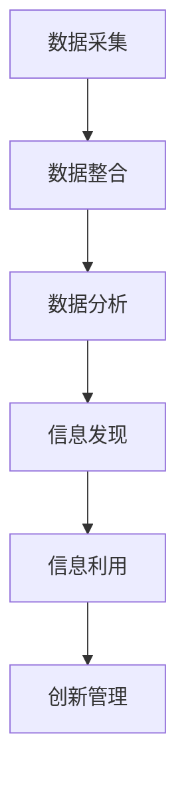
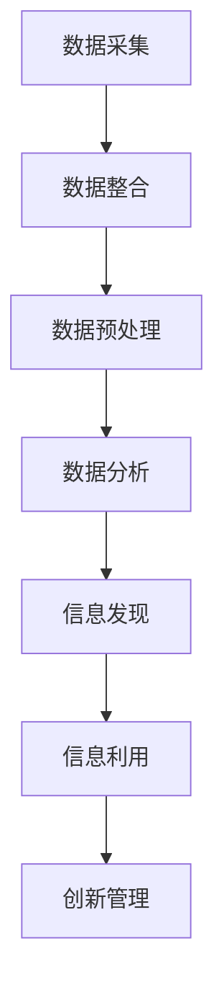

                 

# 信息差的创新管理驱动力：大数据如何推动创新管理

## 摘要

本文深入探讨大数据在创新管理中的应用，分析信息差对创新驱动的关键影响。首先，我们将回顾创新管理的背景及其重要性，随后介绍大数据的核心概念，并探讨如何利用大数据来发现和利用信息差。本文还将详细讲解信息差的创新管理驱动力，并通过具体案例展示大数据在实际创新管理中的应用。最后，我们将讨论未来发展趋势与挑战，为创新管理提供战略指导。

## 1. 背景介绍

创新管理是企业和组织持续发展的关键。在当前全球化和科技快速发展的背景下，企业面临着日益激烈的市场竞争和不断变化的技术环境。为了在竞争中脱颖而出，企业必须不断创新，以适应市场需求和技术变革。

### 创新管理的重要性

创新管理不仅仅关乎技术突破，更涉及到整个组织的运营模式、文化氛围和战略规划。以下是创新管理的重要性：

- **提升竞争力**：通过创新管理，企业可以开发出更具竞争力的产品和服务，从而在市场中占据有利地位。

- **推动增长**：创新管理能够帮助企业发现新的市场和商业机会，推动企业增长。

- **增强适应力**：在快速变化的市场环境中，创新管理能够帮助企业和组织更好地应对外部挑战。

### 信息差与创新管理

信息差指的是不同个体或组织之间的信息不对称。在创新管理中，信息差是推动创新的关键因素。以下是信息差对创新管理的具体影响：

- **市场洞察**：通过分析信息差，企业可以更好地了解市场需求和竞争态势，从而做出更有针对性的创新决策。

- **资源分配**：信息差有助于企业优化资源配置，将有限的资源投入到最具潜力的创新项目中。

- **竞争优势**：信息差使得企业能够在竞争对手尚未意识到的情况下，先行一步，抢占市场先机。

## 2. 核心概念与联系

### 大数据

大数据是指规模巨大、类型繁多、价值密度较低的数据集合。这些数据来源于各种渠道，包括社交媒体、传感器、交易记录等。大数据的核心特征可以概括为4V，即Volume（数据量）、Velocity（数据速度）、Variety（数据多样性）和Value（数据价值）。

### 信息差的创新管理

信息差的创新管理是指利用大数据技术来发现、分析和利用信息差，从而推动创新管理。其核心概念包括：

- **数据采集与整合**：通过大数据技术，企业可以收集并整合来自多个渠道的数据，构建全面的数据视图。

- **数据分析与挖掘**：利用数据分析技术，企业可以从海量数据中发现潜在的信息差，为创新管理提供决策支持。

- **信息利用与转化**：通过分析信息差，企业可以制定有针对性的创新策略，将潜在的信息转化为实际的商业价值。

### Mermaid 流程图

以下是一个简化的信息差的创新管理流程图：



## 3. 核心算法原理 & 具体操作步骤

### 数据采集与整合

- **步骤1**：确定数据源，包括内部数据（如销售记录、客户反馈）和外部数据（如市场报告、社交媒体数据）。
- **步骤2**：使用数据采集工具（如爬虫、API接口等）获取数据。
- **步骤3**：将采集到的数据导入数据仓库，进行初步清洗和整合。

### 数据分析与挖掘

- **步骤1**：使用数据预处理技术（如去重、归一化等）对数据进行处理。
- **步骤2**：选择合适的数据分析方法（如回归分析、聚类分析等），对数据进行深度挖掘。
- **步骤3**：利用数据可视化工具（如Tableau、PowerBI等）展示分析结果，辅助决策。

### 信息发现与利用

- **步骤1**：分析数据，识别潜在的信息差。
- **步骤2**：针对发现的信息差，制定创新策略。
- **步骤3**：实施创新策略，将潜在信息转化为实际商业价值。

### Mermaid 流�程图

以下是一个简化的信息差创新管理算法流程图：



## 4. 数学模型和公式 & 详细讲解 & 举例说明

### 数学模型

在信息差的创新管理中，常用的数学模型包括回归分析、聚类分析等。以下是一个简单的回归分析模型：

$$
y = \beta_0 + \beta_1x_1 + \beta_2x_2 + ... + \beta_nx_n + \varepsilon
$$

其中，$y$ 是因变量，$x_1, x_2, ..., x_n$ 是自变量，$\beta_0, \beta_1, ..., \beta_n$ 是模型参数，$\varepsilon$ 是误差项。

### 详细讲解

- **回归分析**：回归分析用于预测和解释变量之间的关系。在信息差的创新管理中，回归分析可以帮助我们理解哪些因素对信息差有显著影响。
- **聚类分析**：聚类分析用于将数据分成不同的组别，以便更好地理解数据分布和特征。在信息差的创新管理中，聚类分析可以帮助我们识别市场细分群体，从而制定更有针对性的创新策略。

### 举例说明

假设一家企业希望通过大数据分析来发现市场中的信息差，从而制定创新策略。以下是一个简单的案例：

- **数据**：企业收集了1000个消费者的购买记录，包括年龄、收入、购买行为等。
- **目标**：识别市场中的潜在信息差，为企业提供创新方向。

### 算法步骤

1. **数据预处理**：对购买记录进行去重、归一化等处理，确保数据质量。
2. **回归分析**：使用回归分析模型，分析年龄、收入等因素对购买行为的影响。
3. **聚类分析**：使用聚类分析模型，将消费者分为不同的群体。
4. **信息发现**：分析聚类结果，识别市场中的潜在信息差。
5. **创新策略**：根据发现的信息差，制定创新策略。

通过上述算法步骤，企业可以更好地了解市场状况，发现潜在的信息差，从而制定更有针对性的创新策略。

## 5. 项目实战：代码实际案例和详细解释说明

### 5.1 开发环境搭建

在开始项目实战之前，我们需要搭建一个合适的开发环境。以下是一个基于Python的示例环境搭建步骤：

1. **安装Python**：下载并安装Python 3.x版本。
2. **安装Jupyter Notebook**：在终端执行 `pip install jupyter` 命令，安装Jupyter Notebook。
3. **安装数据分析库**：在终端执行以下命令，安装常用的数据分析库：
   ```shell
   pip install pandas numpy scikit-learn matplotlib
   ```

### 5.2 源代码详细实现和代码解读

以下是一个简单的信息差创新管理项目示例。代码分为四个部分：数据采集与整合、数据分析与挖掘、信息发现与利用、创新管理。

#### 数据采集与整合

```python
import pandas as pd

# 数据采集
sales_data = pd.read_csv('sales_data.csv')
customer_data = pd.read_csv('customer_data.csv')

# 数据整合
data = pd.merge(sales_data, customer_data, on='customer_id')
```

#### 数据分析与挖掘

```python
import numpy as np
from sklearn.linear_model import LinearRegression
from sklearn.cluster import KMeans

# 数据预处理
data['income'] = data['income'].fillna(data['income'].mean())
data['purchase_count'] = data['purchase_count'].fillna(data['purchase_count'].mean())

# 回归分析
X = data[['age', 'income']]
y = data['purchase_count']
regression = LinearRegression()
regression.fit(X, y)

# 聚类分析
kmeans = KMeans(n_clusters=3)
data['cluster'] = kmeans.fit_predict(X)
```

#### 信息发现与利用

```python
import matplotlib.pyplot as plt

# 信息发现
avg_purchase_count_by_cluster = data.groupby('cluster')['purchase_count'].mean()

# 信息利用
print("Average Purchase Count by Cluster:")
print(avg_purchase_count_by_cluster)

# 可视化
plt.scatter(X['age'], X['income'], c=data['cluster'])
plt.xlabel('Age')
plt.ylabel('Income')
plt.title('Cluster Analysis by Age and Income')
plt.show()
```

#### 创新管理

```python
# 根据聚类结果制定创新策略
clusters = data['cluster'].unique()
strategies = []

for cluster in clusters:
    cluster_data = data[data['cluster'] == cluster]
    strategy = f"Target Cluster {cluster}: Focus on customers with high income and low age."
    strategies.append(strategy)

print("Innovation Strategies:")
for strategy in strategies:
    print(strategy)
```

### 5.3 代码解读与分析

1. **数据采集与整合**：首先，我们使用Pandas库读取销售数据和客户数据，然后通过合并操作整合成一张数据表。
2. **数据分析与挖掘**：我们使用回归分析模型分析年龄和收入对购买行为的影响，使用聚类分析模型将消费者分为不同的群体。
3. **信息发现与利用**：我们分析聚类结果，识别市场中的潜在信息差，并根据聚类结果制定创新策略。
4. **创新管理**：根据聚类结果，我们针对不同群体制定有针对性的创新策略。

## 6. 实际应用场景

大数据在创新管理中的实际应用场景非常广泛。以下是一些典型的应用场景：

### 零售业

- **需求预测**：通过分析消费者行为数据，零售企业可以预测未来的市场需求，从而制定更准确的库存管理策略。
- **个性化推荐**：利用大数据分析，零售企业可以提供个性化的产品推荐，提高客户满意度和忠诚度。

### 金融行业

- **风险控制**：大数据分析可以帮助金融机构识别潜在的风险，从而制定更有效的风险控制策略。
- **客户细分**：通过分析客户数据，金融机构可以为客户提供更个性化的产品和服务。

### 制造业

- **供应链优化**：大数据分析可以帮助企业优化供应链管理，降低成本，提高生产效率。
- **产品创新**：通过分析市场需求和客户反馈，企业可以开发出更符合市场需求的新产品。

## 7. 工具和资源推荐

### 7.1 学习资源推荐

- **书籍**：
  - 《大数据时代》
  - 《机器学习》
  - 《深度学习》
- **论文**：
  - 《大规模数据分析的挑战与机遇》
  - 《深度学习在金融中的应用》
  - 《大数据与供应链管理》
- **博客**：
  - [Python数据科学](https://www.pythondata.science/)
  - [机器学习博客](https://machinelearningmastery.com/)
  - [数据挖掘博客](https://www.dataminingblog.com/)
- **网站**：
  - [Kaggle](https://www.kaggle.com/)
  - [TensorFlow](https://www.tensorflow.org/)
  - [Scikit-learn](https://scikit-learn.org/)

### 7.2 开发工具框架推荐

- **数据分析工具**：
  - Pandas
  - NumPy
  - Matplotlib
  - Seaborn
- **机器学习库**：
  - Scikit-learn
  - TensorFlow
  - PyTorch
- **大数据处理**：
  - Hadoop
  - Spark
  - Kafka

### 7.3 相关论文著作推荐

- 《大规模数据分析的挑战与机遇》
- 《深度学习在金融中的应用》
- 《大数据与供应链管理》

## 8. 总结：未来发展趋势与挑战

大数据在创新管理中的应用前景广阔。未来，随着技术的不断进步和数据规模的持续扩大，大数据将在创新管理中发挥更大的作用。然而，也面临着一些挑战：

- **数据隐私与安全**：大数据应用过程中，如何保护用户隐私和数据安全是一个重要挑战。
- **数据质量**：高质量的数据是大数据分析的基础，数据质量问题是大数据应用中的一大挑战。
- **技术人才短缺**：大数据分析需要专业的技术人才，而目前市场上这类人才相对短缺。

## 9. 附录：常见问题与解答

### 1. 什么是大数据？

大数据是指规模巨大、类型繁多、价值密度较低的数据集合。这些数据来源于各种渠道，包括社交媒体、传感器、交易记录等。

### 2. 大数据的核心特征是什么？

大数据的核心特征包括4V，即Volume（数据量）、Velocity（数据速度）、Variety（数据多样性）和Value（数据价值）。

### 3. 什么是信息差？

信息差指的是不同个体或组织之间的信息不对称。在创新管理中，信息差是推动创新的关键因素。

### 4. 如何利用大数据进行信息差的创新管理？

利用大数据进行信息差的创新管理主要包括以下步骤：数据采集与整合、数据分析与挖掘、信息发现与利用、创新管理。

## 10. 扩展阅读 & 参考资料

- [大数据时代的创新管理](https://www.management.com.cn/article/117846.html)
- [大数据在企业管理中的应用](https://www.jianshu.com/p/cefa8b9f7c54)
- [信息差的创新管理策略](https://www.strategy-business.com/article/Information-Disadvantage-How-to-Innovate-with-the-Data-You-Already-Have)
- [大数据时代的创新思维](https://www.linkedin.com/pulse/big-data-innovation-thinking-mike-mayer/)

