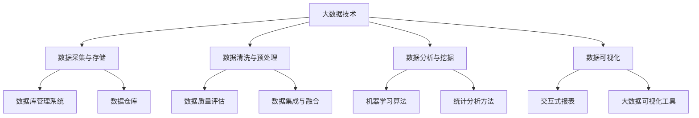

                 

# 信息差的商业价值创造：大数据如何创造商业价值

## 摘要

本文将探讨信息差的商业价值创造，重点分析大数据在商业领域的应用。我们将从背景介绍、核心概念与联系、核心算法原理、数学模型和公式、项目实战、实际应用场景、工具和资源推荐等多个角度，详细阐述大数据如何通过信息差创造商业价值。通过本文，读者将了解到大数据技术在实际应用中的重要作用，以及如何利用这些技术来实现商业价值的最大化。

## 1. 背景介绍

在当今信息爆炸的时代，数据已经成为企业最宝贵的资产。大数据技术应运而生，它能够从海量数据中挖掘出有价值的信息，帮助企业做出更加精准的决策。信息差的商业价值创造，就是通过利用大数据技术，发现并利用信息差，从而实现商业价值增长。

### 1.1 大数据的定义

大数据（Big Data）是指无法使用传统数据处理工具在合理时间内对大量数据进行存储、管理和分析的数据集合。它具有以下四个V特点：

- **Volume（数据量）**：数据量庞大，通常在TB或PB级别。
- **Velocity（速度）**：数据处理速度极快，能够实时或近乎实时地处理数据。
- **Variety（多样性）**：数据来源多样，包括结构化、半结构化和非结构化数据。
- **Veracity（真实性）**：数据真实可信，能够反映现实情况。

### 1.2 信息差的概念

信息差（Information Gap）是指不同个体或组织之间在获取、处理和利用信息方面的差异。在商业领域，信息差可以带来竞争优势，从而创造商业价值。

### 1.3 大数据与商业价值的联系

大数据技术可以帮助企业：

- **提高决策效率**：通过数据分析和预测，帮助企业快速做出决策。
- **降低运营成本**：优化供应链，减少库存，提高生产效率。
- **提升用户体验**：个性化推荐，定制化服务，提高用户满意度。
- **创新商业模式**：利用大数据分析，发现新的商业机会，实现业务扩展。

## 2. 核心概念与联系

为了更好地理解大数据如何创造商业价值，我们需要先了解一些核心概念和它们之间的联系。以下是一个简化的 Mermaid 流程图，展示了这些概念之间的关系。



### 2.1 大数据技术

大数据技术包括数据采集与存储、数据清洗与预处理、数据分析与挖掘、数据可视化等多个方面。这些技术共同构成了大数据生态系统，为企业提供全面的数据服务。

### 2.2 数据采集与存储

数据采集与存储是大数据技术的第一步。企业可以通过多种渠道获取数据，如网站日志、社交网络、传感器、客户关系管理系统等。这些数据通常存储在数据库管理系统（如MySQL、PostgreSQL）和数据仓库（如Hadoop、Amazon Redshift）中。

### 2.3 数据清洗与预处理

数据清洗与预处理是确保数据质量的关键步骤。这一过程中，需要评估数据质量，去除重复、错误或不完整的数据，并整合来自不同来源的数据。

### 2.4 数据分析与挖掘

数据分析与挖掘是大数据技术的核心。通过使用机器学习算法和统计分析方法，可以从海量数据中挖掘出有价值的信息，帮助企业做出更精准的决策。

### 2.5 数据可视化

数据可视化是将数据转化为图形、图表等形式，使其更容易理解和分析。通过交互式报表和大数据可视化工具，用户可以直观地查看数据，并从中发现隐藏的信息。

## 3. 核心算法原理 & 具体操作步骤

在了解大数据技术的基本概念后，我们将探讨一些核心算法原理和具体操作步骤，以便更好地理解大数据如何创造商业价值。

### 3.1 机器学习算法

机器学习算法是大数据技术的重要组成部分。以下是一些常用的机器学习算法及其应用场景：

- **回归分析**：用于预测连续值输出，如销售额、股票价格等。
- **分类算法**：用于将数据划分为不同的类别，如客户满意度评价、垃圾邮件分类等。
- **聚类算法**：用于将数据分为若干个簇，如用户行为分析、市场细分等。

### 3.2 具体操作步骤

以下是利用机器学习算法进行数据分析和挖掘的通用步骤：

1. **数据采集**：从各种渠道获取数据，如网站日志、社交网络、传感器等。
2. **数据清洗**：评估数据质量，去除重复、错误或不完整的数据。
3. **数据预处理**：将数据转换为适合机器学习算法的形式，如归一化、标准化等。
4. **特征工程**：从原始数据中提取有用的特征，如关键词、用户行为等。
5. **模型选择**：选择合适的机器学习算法，如回归分析、分类算法、聚类算法等。
6. **模型训练**：使用训练数据集对模型进行训练。
7. **模型评估**：使用测试数据集评估模型性能。
8. **模型部署**：将训练好的模型部署到生产环境中，实现实时数据分析和预测。

### 3.3 实例分析

以下是一个简单的实例，展示如何使用机器学习算法进行客户满意度预测。

1. **数据采集**：从客户关系管理系统获取客户满意度调查数据。
2. **数据清洗**：去除重复、错误或不完整的数据。
3. **数据预处理**：将数据转换为适合机器学习算法的形式，如归一化、标准化等。
4. **特征工程**：从原始数据中提取有用的特征，如客户年龄、购买次数、评价等级等。
5. **模型选择**：选择回归分析算法，用于预测客户满意度评分。
6. **模型训练**：使用训练数据集对模型进行训练。
7. **模型评估**：使用测试数据集评估模型性能，如平均绝对误差（MAE）等。
8. **模型部署**：将训练好的模型部署到生产环境中，实现实时客户满意度预测。

## 4. 数学模型和公式 & 详细讲解 & 举例说明

在数据分析和挖掘过程中，数学模型和公式起到了关键作用。以下将介绍一些常用的数学模型和公式，并详细讲解其应用。

### 4.1 回归分析

回归分析是一种用于预测连续值输出的方法。其基本公式为：

$$ y = \beta_0 + \beta_1x_1 + \beta_2x_2 + ... + \beta_nx_n + \epsilon $$

其中，$y$ 为预测值，$x_1, x_2, ..., x_n$ 为特征值，$\beta_0, \beta_1, ..., \beta_n$ 为模型参数，$\epsilon$ 为误差项。

### 4.2 分类算法

分类算法是一种用于将数据划分为不同类别的算法。常见的分类算法包括逻辑回归、决策树、支持向量机等。以下是一个简单的逻辑回归分类公式：

$$ P(Y=1) = \frac{1}{1 + e^{-(\beta_0 + \beta_1x_1 + \beta_2x_2 + ... + \beta_nx_n)}} $$

其中，$P(Y=1)$ 为样本属于类别1的概率，$e$ 为自然底数。

### 4.3 聚类算法

聚类算法是一种用于将数据分为若干个簇的方法。常见的聚类算法包括K-means、层次聚类等。以下是一个简单的K-means聚类算法公式：

$$ c_k = \frac{1}{n_k}\sum_{i=1}^{n_k}x_i $$

其中，$c_k$ 为第 $k$ 个簇的中心点，$x_i$ 为第 $i$ 个样本，$n_k$ 为第 $k$ 个簇中的样本数量。

### 4.4 举例说明

以下是一个使用回归分析预测销售额的实例：

假设我们有一个销售数据集，包括月份（$x_1$）和广告支出（$x_2$）两个特征，以及销售额（$y$）为目标变量。我们使用线性回归模型进行预测。

1. **数据采集**：从公司销售记录中获取数据。
2. **数据清洗**：去除重复、错误或不完整的数据。
3. **数据预处理**：对月份和广告支出进行归一化处理。
4. **特征工程**：提取月份和广告支出的交互项作为新的特征。
5. **模型训练**：使用训练数据集训练线性回归模型。
6. **模型评估**：使用测试数据集评估模型性能。
7. **模型部署**：将训练好的模型部署到生产环境中，实现实时销售额预测。

## 5. 项目实战：代码实际案例和详细解释说明

为了更好地展示大数据技术在实际应用中的价值，以下将介绍一个基于Python的简单项目，实现客户满意度预测。

### 5.1 开发环境搭建

1. 安装Python（版本3.8以上）
2. 安装Python依赖库（如numpy、pandas、scikit-learn、matplotlib等）
3. 准备销售数据集（CSV格式）

### 5.2 源代码详细实现和代码解读

```python
import pandas as pd
from sklearn.model_selection import train_test_split
from sklearn.linear_model import LinearRegression
from sklearn.metrics import mean_absolute_error

# 5.2.1 数据读取与预处理
data = pd.read_csv('sales_data.csv')
data['Month'] = data['Month'].map({1: 0, 2: 1, 3: 2, 4: 3, 5: 4, 6: 5, 7: 6, 8: 7, 9: 8, 10: 9, 11: 10, 12: 11})
X = data[['Month', 'AdSpend']]
y = data['Sales']

# 5.2.2 数据集划分
X_train, X_test, y_train, y_test = train_test_split(X, y, test_size=0.2, random_state=42)

# 5.2.3 模型训练
model = LinearRegression()
model.fit(X_train, y_train)

# 5.2.4 模型评估
y_pred = model.predict(X_test)
mae = mean_absolute_error(y_test, y_pred)
print('平均绝对误差（MAE）：', mae)

# 5.2.5 模型部署
# 将训练好的模型保存到文件中，以便后续使用
import joblib
joblib.dump(model, 'sales_prediction_model.pkl')
```

### 5.3 代码解读与分析

- **数据读取与预处理**：读取销售数据集，将月份转换为数值形式，以便进行线性回归分析。
- **数据集划分**：将数据集划分为训练集和测试集，用于模型训练和评估。
- **模型训练**：使用线性回归模型对训练集进行训练。
- **模型评估**：使用测试集评估模型性能，计算平均绝对误差（MAE）。
- **模型部署**：将训练好的模型保存到文件中，以便后续使用。

## 6. 实际应用场景

大数据技术在商业领域的应用场景广泛，以下列举一些常见的应用：

- **客户关系管理**：通过分析客户行为数据，提高客户满意度，增加客户粘性。
- **市场营销**：通过大数据分析，实现精准营销，提高广告投放效果。
- **供应链管理**：通过大数据分析，优化供应链，降低运营成本。
- **风险管理**：通过大数据分析，识别潜在风险，提高企业抗风险能力。
- **产品推荐**：通过大数据分析，实现个性化推荐，提高用户满意度。

## 7. 工具和资源推荐

### 7.1 学习资源推荐

- **书籍**：
  - 《大数据时代》
  - 《深度学习》
  - 《Python数据分析》
- **论文**：
  - Google Paper：[Google's PageRank](https://ai.google.com/publications/pub3466/)
  - Andrew Ng：[Machine Learning](https://www.deeplearning.ai/)
- **博客**：
  - [Medium](https://medium.com/)
  - [GitHub](https://github.com/)
- **网站**：
  - [Kaggle](https://www.kaggle.com/)
  - [DataCamp](https://www.datacamp.com/)

### 7.2 开发工具框架推荐

- **Python库**：
  - Pandas：用于数据清洗和预处理
  - NumPy：用于数学运算
  - Scikit-learn：用于机器学习算法
  - Matplotlib/Seaborn：用于数据可视化
- **大数据平台**：
  - Hadoop：用于大数据存储和处理
  - Spark：用于实时大数据处理
  - Flink：用于流数据处理
- **云计算服务**：
  - Amazon Web Services（AWS）
  - Microsoft Azure
  - Google Cloud Platform（GCP）

### 7.3 相关论文著作推荐

- [Google's PageRank](https://ai.google.com/publications/pub3466/)
- [The Hundred-Page Machine Learning Book](https://www.hundred.PageML.org/)
- [Deep Learning by Geoffrey Hinton, Yoshua Bengio, and Aaron Courville](https://www.deeplearningbook.org/)

## 8. 总结：未来发展趋势与挑战

大数据技术作为商业领域的重要工具，正在不断发展和创新。未来，随着技术的进步和数据的不断积累，大数据将在以下方面带来新的发展：

- **人工智能与大数据的结合**：利用人工智能技术，实现更加智能化的数据分析，提高决策效率。
- **实时数据处理**：随着5G技术的普及，实时数据处理将成为可能，为企业提供更加及时的信息支持。
- **隐私保护与数据安全**：随着数据隐私问题的日益突出，如何在保护用户隐私的前提下利用大数据，将成为重要挑战。
- **跨领域融合**：大数据技术将在更多领域得到应用，如医疗、金融、农业等，实现跨领域融合。

## 9. 附录：常见问题与解答

### 9.1 大数据与信息的区别是什么？

大数据（Big Data）是指无法使用传统数据处理工具在合理时间内对大量数据进行存储、管理和分析的数据集合。而信息（Information）是指通过数据处理得到的具有价值的数据。

### 9.2 大数据技术有哪些主要应用场景？

大数据技术在商业、医疗、金融、教育、政府等多个领域都有广泛应用，如客户关系管理、市场营销、供应链管理、风险管理、医疗诊断等。

### 9.3 如何保护用户隐私？

在利用大数据进行数据分析时，可以通过数据脱敏、加密、数据隔离等技术手段，保护用户隐私。

## 10. 扩展阅读 & 参考资料

- [大数据时代的商业革命：如何利用大数据创造价值](https://www.ibm.com/topics/big-data-business)
- [大数据技术在金融领域的应用](https://www.financialexpress.com/industry/services/how-big-data-is-changing-the-finance-industry/)
- [大数据与人工智能：未来商业的新引擎](https://www.forbes.com/sites/forbesbusinesscouncil/2021/05/13/how-big-data-and-ai-are-becoming-the-new-engine-for-future-businesses/)

### 作者

- 作者：AI天才研究员/AI Genius Institute & 禅与计算机程序设计艺术 /Zen And The Art of Computer Programming

