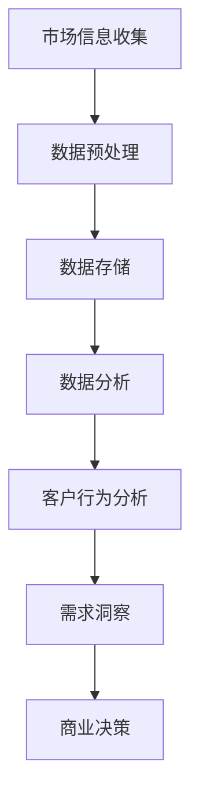

                 

# 信息差的商业客户需求洞察：大数据如何发现客户需求

> **关键词**：信息差、商业洞察、大数据、客户需求、客户行为分析、市场趋势
>
> **摘要**：本文深入探讨了如何利用大数据技术揭示商业中的信息差，并洞察客户的实际需求。通过分析客户行为数据，识别潜在的市场趋势，为商业决策提供科学依据。本文旨在帮助企业和决策者了解大数据技术在商业客户需求洞察中的重要作用，并提供实用工具和方法。

## 1. 背景介绍

在当今高度竞争的商业环境中，了解客户需求已成为企业成功的关键。然而，由于信息的不对称性，即“信息差”，企业往往难以准确把握客户的真实需求。信息差可能源自多个方面，包括：

- **市场信息不对称**：企业可能无法获取完整的客户数据或市场信息。
- **客户行为不确定性**：客户的需求和行为受到多种因素的影响，难以直接观察和预测。
- **数据隐私和保密性**：在数据保护法规日益严格的背景下，企业难以合法获取和分析客户数据。

大数据技术的兴起为解决这些难题提供了新的途径。通过收集、存储、处理和分析海量数据，企业可以更全面、准确地了解市场动态和客户行为，从而实现精准的市场定位和客户需求洞察。

本文将重点探讨如何利用大数据技术发现客户需求，为商业决策提供有力支持。文章将涵盖以下几个主要部分：

- **核心概念与联系**：介绍大数据技术在客户需求洞察中的应用原理。
- **核心算法原理**：阐述客户行为数据分析的方法和算法。
- **数学模型和公式**：讲解数据分析和建模的数学基础。
- **项目实战**：通过实际案例展示如何应用大数据技术发现客户需求。
- **实际应用场景**：分析大数据在客户需求洞察中的具体应用场景。
- **工具和资源推荐**：推荐相关学习资源和开发工具。
- **未来发展趋势与挑战**：探讨大数据技术在商业客户需求洞察中的未来发展趋势和面临的挑战。

通过本文的探讨，我们希望能够为企业和决策者提供有价值的参考，助力他们在激烈的市场竞争中找到立足点。

## 2. 核心概念与联系

在深入探讨大数据如何发现客户需求之前，我们需要明确几个核心概念，并理解它们之间的联系。以下是一个使用Mermaid绘制的流程图，展示了大数据技术在客户需求洞察中的主要环节：



### 市场信息收集

市场信息收集是整个大数据分析过程的第一步，也是最为关键的一步。企业需要通过多种渠道收集市场数据，这些渠道包括但不限于：

- **社交媒体**：通过分析社交媒体平台上的用户评论、点赞、分享等信息，可以获取潜在的市场趋势和用户偏好。
- **电商平台**：电商平台的交易数据可以揭示消费者的购买行为、消费习惯以及热门商品等。
- **用户反馈**：通过问卷调查、用户访谈等方式获取客户的直接反馈。
- **竞争对手分析**：分析竞争对手的市场策略、产品特点、客户反馈等信息。

### 数据预处理

收集到的市场数据通常是杂乱无章的，因此需要进行预处理。数据预处理包括以下几个步骤：

- **数据清洗**：去除重复数据、无效数据、缺失数据，确保数据的准确性和一致性。
- **数据整合**：将来自不同渠道的数据进行整合，形成一个统一的数据视图。
- **数据转换**：将数据格式进行统一，方便后续的数据分析和处理。

### 数据存储

预处理后的数据需要存储在高效、可靠的数据存储系统中。目前常用的数据存储技术包括：

- **关系型数据库**：适用于结构化数据的存储和管理。
- **非关系型数据库**：如NoSQL数据库，适用于存储大规模的非结构化数据。
- **分布式存储系统**：如Hadoop HDFS，适用于海量数据的存储和管理。

### 数据分析

数据分析是大数据技术的核心环节，通过数据分析可以揭示数据中的隐藏模式和规律。数据分析包括以下几个步骤：

- **数据探索**：通过可视化工具对数据进行初步探索，了解数据的基本分布、趋势等。
- **统计分析**：使用统计学方法对数据进行分析，如描述性统计分析、推断性统计分析等。
- **机器学习**：使用机器学习算法对数据进行分析，如分类、聚类、关联规则挖掘等。

### 客户行为分析

客户行为分析是数据分析的一个重要分支，通过分析客户的购买行为、浏览行为、互动行为等，可以深入了解客户的需求和偏好。客户行为分析通常涉及以下几个步骤：

- **行为数据收集**：通过网站、APP等渠道收集用户的行为数据。
- **行为模式识别**：通过机器学习算法识别用户的行为模式，如购买周期、浏览路径等。
- **需求预测**：基于历史行为数据，预测用户的未来需求，如购买意向、潜在客户识别等。

### 需求洞察

需求洞察是通过分析客户行为数据和市场需求数据，深入挖掘客户的真实需求。需求洞察包括以下几个步骤：

- **需求识别**：通过数据分析识别客户的需求特征和需求模式。
- **需求分类**：根据需求特征对客户需求进行分类，如按照需求紧迫性、需求类型等分类。
- **需求优先级排序**：根据需求的重要性和紧迫性对需求进行优先级排序。

### 商业决策

商业决策是基于需求洞察的结果，制定相应的市场策略和产品策略。商业决策包括以下几个步骤：

- **策略制定**：根据需求洞察结果，制定相应的市场推广策略、产品改进策略等。
- **实施监控**：对商业决策的实施效果进行监控和评估，及时进行调整和优化。

通过上述核心概念和流程的阐述，我们可以更清晰地理解大数据技术在客户需求洞察中的应用原理。接下来，我们将深入探讨大数据技术在客户行为分析中的具体实现方法和算法。

## 3. 核心算法原理

在了解了大数据技术的基本概念和流程之后，我们接下来将探讨客户行为分析的核心算法原理。这些算法不仅能够帮助我们从海量数据中提取有价值的信息，还可以为后续的需求洞察和商业决策提供科学依据。以下是几种常见的客户行为分析算法及其原理：

### 3.1 关联规则挖掘

关联规则挖掘是一种用于发现数据中项之间潜在关系的算法，它通过分析大量交易数据或行为数据，找出经常一起出现的项。这种算法通常用于市场篮子分析，即识别消费者在购物时经常同时购买的商品。

**原理**：

- **支持度（Support）**：表示一个规则在所有数据中出现的频率。计算公式为：
  $$support(A \rightarrow B) = \frac{|A \cup B|}{|D|}$$
  其中，$|A \cup B|$ 表示同时包含A和B的事务数，$|D|$ 表示总的事务数。

- **置信度（Confidence）**：表示在给定A发生的情况下，B也发生的概率。计算公式为：
  $$confidence(A \rightarrow B) = \frac{|A \cap B|}{|A|}$$
  其中，$|A \cap B|$ 表示同时包含A和B的事务数，$|A|$ 表示包含A的事务数。

**算法流程**：

1. 选择一个最小支持度阈值$\min\_support$。
2. 计算所有项集的支持度，过滤掉支持度小于$\min\_support$的项集。
3. 构造频繁项集。
4. 生成关联规则，并选择置信度大于一个最小置信度阈值$\min\_confidence$的规则。

### 3.2 聚类分析

聚类分析是一种无监督学习方法，用于将相似的数据点分组到同一个簇中。在客户行为分析中，聚类分析可以用于识别具有相似行为特征的客户群体。

**原理**：

- **距离度量**：常用的距离度量包括欧几里得距离、曼哈顿距离、余弦相似度等。
- **聚类算法**：常见的聚类算法有K-Means、层次聚类、DBSCAN等。

**算法流程**：

1. 确定聚类个数$K$。
2. 选择初始化方法，如K-Means中的随机初始化。
3. 计算每个数据点到簇中心的距离，并将其分配到最近的簇。
4. 重新计算簇中心，并重复步骤3，直到聚类结果收敛。

### 3.3 机器学习分类算法

机器学习分类算法是一种监督学习方法，用于将数据点分类到预定义的类别中。常见的机器学习分类算法包括决策树、随机森林、支持向量机（SVM）等。

**原理**：

- **决策树**：通过一系列测试属性来划分数据，形成树状结构。每个内部节点代表一个测试属性，每个叶节点代表一个类别。
- **随机森林**：通过随机选择属性和样本子集，构建多个决策树，并取它们预测结果的平均值来提高预测精度。
- **支持向量机**：通过找到最佳超平面，将不同类别的数据点分隔开来。

**算法流程**：

1. 训练数据集划分：将数据集划分为训练集和测试集。
2. 选择合适的算法，并训练模型。
3. 对测试集进行预测，并评估模型的性能。

### 3.4 时间序列分析

时间序列分析是一种用于分析时间序列数据的方法，可以用于识别数据中的趋势、周期性和季节性等特征。常见的时间序列分析方法包括移动平均、自回归移动平均（ARMA）、自回归积分滑动平均（ARIMA）等。

**原理**：

- **移动平均**：通过计算一段时间内的平均值来平滑数据，消除短期波动。
- **自回归模型**：假设当前值是前几个值的函数，即$X_t = c + \phi_1 X_{t-1} + \phi_2 X_{t-2} + ...$。
- **积分滑动平均模型**：在自回归模型的基础上，增加差分的操作，以处理非平稳时间序列。

**算法流程**：

1. 数据预处理：对时间序列数据进行预处理，包括去除异常值、差分等。
2. 模型选择：选择合适的模型，如ARMA、ARIMA等。
3. 模型参数估计：通过最小二乘法或其他优化方法估计模型参数。
4. 预测：使用估计的模型进行预测，并评估预测的准确性。

通过上述算法的介绍，我们可以看到大数据技术在客户行为分析中具有广泛的应用。在实际应用中，可以根据具体需求和数据特点选择合适的算法，以获得更好的分析效果。接下来，我们将通过具体的项目实战案例，展示如何应用这些算法进行客户需求洞察。

## 4. 数学模型和公式

在深入探讨大数据如何发现客户需求的过程中，数学模型和公式起着至关重要的作用。这些模型和公式不仅能够帮助我们理解和解释数据分析的结果，还能够为实际操作提供量化依据。以下将介绍几种常用的数学模型和公式，并结合具体例子进行详细讲解。

### 4.1 逻辑回归模型

逻辑回归模型是一种广泛用于分类问题的统计模型，它主要用于估计某个事件发生的概率。在客户行为分析中，逻辑回归模型可以用于预测客户的购买概率、流失概率等。

**公式**：

$$
P(Y=1|X) = \frac{1}{1 + e^{-(\beta_0 + \beta_1 X_1 + \beta_2 X_2 + ... + \beta_n X_n})}
$$

其中，$P(Y=1|X)$ 表示在给定特征向量 $X$ 的情况下，事件 $Y$ 发生的概率；$\beta_0$ 是常数项；$\beta_1, \beta_2, ..., \beta_n$ 是各个特征对应的权重。

**例子**：

假设我们要预测客户是否会购买某种产品，特征包括年龄、收入、历史购买次数等。通过收集这些特征数据，我们可以建立逻辑回归模型，并根据模型预测每个客户的购买概率。

### 4.2 决策树模型

决策树模型是一种基于特征进行分类或回归的树形结构。它通过一系列的测试节点，将数据集划分为不同的子集，直到达到某个终止条件（如节点中所有样本属于同一类别）。

**公式**：

决策树中的每个节点通过以下公式进行划分：

$$
A_i > \text{阈值} \Rightarrow \text{进入左子节点} \\
A_i \leq \text{阈值} \Rightarrow \text{进入右子节点}
$$

其中，$A_i$ 表示第$i$个特征，阈值是一个确定的数值。

**例子**：

假设我们使用决策树模型来预测客户的购买行为，决策树中的每个节点根据收入和购买历史进行划分。例如，如果收入高于某个阈值，则进入右子节点；否则，进入左子节点。这样的划分可以不断细化，直到所有样本属于同一类别。

### 4.3 聚类分析模型

聚类分析是一种无监督学习方法，用于将数据点划分为多个簇。其中，K-Means聚类算法是最常用的方法之一。

**公式**：

K-Means算法的基本思想是：

1. 初始化 $K$ 个簇中心。
2. 对于每个数据点，计算其与各个簇中心的距离，并将其分配到最近的簇。
3. 根据新的簇分配，重新计算簇中心。
4. 重复步骤2和步骤3，直到簇中心不再变化。

**例子**：

假设我们要将客户划分为两个簇，初始时随机选择两个簇中心。然后，对于每个客户，计算其与两个簇中心的距离，并将其分配到最近的簇。接着，根据新的簇分配，重新计算簇中心。这样的过程会不断迭代，直到簇中心不再变化。

### 4.4 时间序列分析模型

时间序列分析是一种用于处理时间序列数据的方法，可以识别数据中的趋势、周期性和季节性等特征。常见的模型包括移动平均模型（MA）、自回归模型（AR）和自回归移动平均模型（ARMA）。

**移动平均模型（MA）**：

$$
Y_t = \mu + \sum_{i=1}^k \theta_i Y_{t-i}
$$

其中，$Y_t$ 表示时间序列在时刻 $t$ 的值，$\mu$ 是均值，$\theta_i$ 是移动平均系数。

**自回归模型（AR）**：

$$
Y_t = \phi_1 Y_{t-1} + \phi_2 Y_{t-2} + ... + \phi_p Y_{t-p} + \varepsilon_t
$$

其中，$Y_t$ 表示时间序列在时刻 $t$ 的值，$\phi_i$ 是自回归系数，$\varepsilon_t$ 是随机误差。

**自回归移动平均模型（ARMA）**：

$$
Y_t = \phi_1 Y_{t-1} + \phi_2 Y_{t-2} + ... + \phi_p Y_{t-p} + \theta_1 \varepsilon_{t-1} + \theta_2 \varepsilon_{t-2} + ... + \theta_q \varepsilon_{t-q}
$$

其中，$Y_t$ 表示时间序列在时刻 $t$ 的值，$\phi_i$ 是自回归系数，$\theta_i$ 是移动平均系数，$\varepsilon_t$ 是随机误差。

**例子**：

假设我们要预测一个销售时间序列，我们可以使用ARMA模型对其进行建模。首先，通过观察历史数据，确定自回归和移动平均项的系数。然后，使用这些系数建立ARMA模型，并预测未来的销售值。

通过上述数学模型和公式的介绍，我们可以看到它们在客户需求洞察中的广泛应用。在实际应用中，根据具体需求和数据特点选择合适的模型，并合理配置参数，可以有效提高数据分析的准确性和效果。接下来，我们将通过一个实际的项目案例，展示如何将上述模型和公式应用于客户需求洞察。

### 5. 项目实战：代码实际案例和详细解释说明

在本节中，我们将通过一个实际的项目案例，展示如何利用大数据技术发现客户需求。我们将使用Python编程语言和相关库，逐步搭建一个客户需求分析系统，并详细解释每一步的实现方法和代码细节。

#### 5.1 开发环境搭建

在开始项目之前，我们需要搭建一个合适的开发环境。以下是在Windows操作系统上搭建开发环境所需的步骤：

1. **安装Python**：下载并安装Python 3.8或更高版本，可以从[Python官网](https://www.python.org/)下载。
2. **安装Jupyter Notebook**：Python的Jupyter Notebook是一个交互式的开发环境，可以方便地进行数据分析和代码实现。安装命令如下：

   ```shell
   pip install notebook
   ```

3. **安装相关库**：在Jupyter Notebook中启动一个Python环境，并安装以下库：

   ```python
   !pip install numpy pandas matplotlib scikit-learn mermaid-python
   ```

   这些库分别用于数据处理、数据分析、数据可视化、机器学习等。

#### 5.2 数据收集与预处理

首先，我们需要收集一些客户数据，这些数据包括客户的年龄、收入、购买历史、浏览行为等。在本案例中，我们使用一个虚构的数据集，该数据集包含1000条记录。以下是数据收集和预处理的步骤：

1. **导入数据集**：

   ```python
   import pandas as pd
   
   # 读取CSV文件
   data = pd.read_csv('customer_data.csv')
   ```

2. **数据清洗**：包括去除重复数据、填充缺失值、格式转换等。

   ```python
   # 去除重复数据
   data.drop_duplicates(inplace=True)
   
   # 填充缺失值
   data.fillna(data.mean(), inplace=True)
   
   # 格式转换
   data['age'] = data['age'].astype(int)
   data['income'] = data['income'].astype(float)
   ```

3. **数据探索**：通过可视化工具对数据的基本分布、趋势等进行初步探索。

   ```python
   import matplotlib.pyplot as plt
   
   # 绘制年龄分布图
   plt.hist(data['age'], bins=50)
   plt.title('Age Distribution')
   plt.xlabel('Age')
   plt.ylabel('Frequency')
   plt.show()
   
   # 绘制收入分布图
   plt.hist(data['income'], bins=50)
   plt.title('Income Distribution')
   plt.xlabel('Income')
   plt.ylabel('Frequency')
   plt.show()
   ```

#### 5.3 源代码详细实现和代码解读

接下来，我们将逐步实现客户需求分析系统的核心功能，包括数据预处理、特征工程、模型训练和结果分析。

1. **数据预处理和特征工程**：

   ```python
   from sklearn.model_selection import train_test_split
   
   # 分离特征和目标变量
   X = data.drop('purchased', axis=1)
   y = data['purchased']
   
   # 划分训练集和测试集
   X_train, X_test, y_train, y_test = train_test_split(X, y, test_size=0.2, random_state=42)
   
   # 特征工程：标准化处理
   from sklearn.preprocessing import StandardScaler
   
   scaler = StandardScaler()
   X_train_scaled = scaler.fit_transform(X_train)
   X_test_scaled = scaler.transform(X_test)
   ```

   上述代码首先分离特征和目标变量，然后使用train_test_split函数将数据集划分为训练集和测试集。接着，使用StandardScaler对特征进行标准化处理，以提高模型的训练效果。

2. **模型训练和评估**：

   ```python
   from sklearn.ensemble import RandomForestClassifier
   
   # 创建随机森林分类器
   clf = RandomForestClassifier(n_estimators=100, random_state=42)
   
   # 训练模型
   clf.fit(X_train_scaled, y_train)
   
   # 评估模型
   from sklearn.metrics import accuracy_score, classification_report
   
   y_pred = clf.predict(X_test_scaled)
   print("Accuracy:", accuracy_score(y_test, y_pred))
   print(classification_report(y_test, y_pred))
   ```

   上述代码创建了一个随机森林分类器，并使用训练集进行训练。接着，使用测试集评估模型的准确性，并打印分类报告，以了解模型的性能。

3. **结果分析和可视化**：

   ```python
   import seaborn as sns
   
   # 可视化特征重要性
   feature_importances = pd.DataFrame(clf.feature_importances_, index=X.columns, columns=['Importance'])
   sns.barplot(x='Importance', y=X.columns, data=feature_importances)
   plt.title('Feature Importances')
   plt.xlabel('Importance')
   plt.ylabel('Feature')
   plt.show()
   ```

   上述代码使用Seaborn库绘制特征重要性条形图，以展示各个特征对模型预测的重要性。

#### 5.4 代码解读与分析

在上述代码实现中，我们首先进行了数据预处理和特征工程，包括数据清洗、标准化处理等。然后，使用随机森林分类器进行模型训练和评估。最后，通过结果分析和可视化，展示了模型预测结果和特征重要性。

1. **数据预处理**：

   数据预处理是模型训练的重要步骤，包括去除重复数据、填充缺失值、格式转换等。这些步骤有助于提高数据的准确性和一致性，为后续的模型训练打下基础。

2. **特征工程**：

   特征工程是提高模型性能的关键环节，包括特征选择、特征转换、特征标准化等。在本案例中，我们使用标准化处理将特征值转换为标准正态分布，以提高随机森林分类器的训练效果。

3. **模型训练和评估**：

   模型训练和评估是数据挖掘的核心步骤，通过训练集训练模型，并在测试集上进行评估，可以了解模型的准确性和泛化能力。在本案例中，我们使用随机森林分类器，并打印了模型准确性和分类报告，以评估模型性能。

4. **结果分析和可视化**：

   结果分析是通过可视化工具展示模型预测结果和特征重要性。在本案例中，我们使用Seaborn库绘制了特征重要性条形图，以直观地展示各个特征对模型预测的影响。

通过上述项目实战，我们展示了如何利用大数据技术发现客户需求，并实现了客户需求分析系统的核心功能。在实际应用中，可以根据具体需求和数据特点，选择合适的算法和模型，以提高分析效果和业务价值。

## 6. 实际应用场景

大数据技术在商业客户需求洞察中的应用场景非常广泛，可以贯穿于市场营销、产品研发、客户服务等多个环节。以下是一些典型应用场景：

### 6.1 市场营销

在市场营销中，大数据技术可以帮助企业更精准地定位目标客户，提高营销效果。例如：

- **客户细分**：通过分析客户行为数据，将客户划分为不同的细分群体，如高价值客户、潜在客户等，以便制定有针对性的营销策略。
- **个性化推荐**：基于客户的浏览历史、购买记录等数据，利用协同过滤、内容推荐等算法，为每位客户提供个性化的产品推荐，提高转化率。
- **广告投放优化**：通过分析不同广告渠道的投放效果，优化广告预算分配，提高广告投放的ROI（投资回报率）。

### 6.2 产品研发

在产品研发过程中，大数据技术可以帮助企业了解客户的需求和偏好，优化产品设计和功能。例如：

- **需求预测**：通过分析市场趋势和客户反馈，预测未来的需求趋势，指导产品研发方向。
- **产品设计优化**：通过用户测试和数据分析，优化产品的用户体验和功能，提高用户满意度。
- **故障预测和预防**：通过分析产品使用数据，预测潜在的故障和问题，提前进行预防和修复。

### 6.3 客户服务

在客户服务方面，大数据技术可以帮助企业提供更加高效和个性化的服务，提升客户体验。例如：

- **客户行为分析**：通过分析客户的行为数据，了解客户的需求和偏好，提供个性化的客户关怀和解决方案。
- **智能客服**：利用自然语言处理和机器学习技术，开发智能客服系统，提高客户咨询处理的效率和准确性。
- **客户流失预警**：通过分析客户行为数据，预测客户的流失风险，采取相应的措施进行客户保留。

### 6.4 客户体验优化

通过大数据技术，企业可以深入了解客户体验的各个方面，从而持续优化产品和服务。例如：

- **用户体验测试**：通过用户测试和数据分析，评估产品的易用性和用户满意度，及时发现问题并进行改进。
- **反馈分析**：通过分析客户的反馈和建议，了解客户的真实需求和期望，指导产品优化和改进。
- **客户体验监测**：通过在线监测和数据分析，实时了解客户的体验状态，及时调整策略和优化服务。

通过上述实际应用场景的介绍，我们可以看到大数据技术如何帮助企业更全面、准确地洞察客户需求，从而提升市场营销效果、产品研发质量和客户服务水平。在实际应用中，企业可以根据自身需求和数据特点，灵活运用大数据技术，实现业务目标的最大化。

## 7. 工具和资源推荐

在探索大数据技术进行商业客户需求洞察的过程中，选择合适的工具和资源至关重要。以下是一些推荐的学习资源、开发工具和相关论文，以帮助读者更深入地了解和掌握大数据技术在客户需求洞察中的应用。

### 7.1 学习资源推荐

1. **书籍**：

   - 《大数据时代：生活、工作与思维的大变革》（The Big Data Revolution） - 作者：Thomas H. Davenport
   - 《数据挖掘：实用工具与技术》（Data Mining: The Textbook） - 作者：Michael J. A. Berry, Gordon S. Linoff
   - 《机器学习实战》（Machine Learning in Action） - 作者：Peter Harrington

2. **在线课程**：

   - Coursera上的《机器学习》课程 - Andrew Ng教授主讲
   - Udacity的《大数据工程师纳米学位》课程
   - edX上的《数据科学导论》课程

3. **博客和网站**：

   - DataCamp（[https://www.datacamp.com/](https://www.datacamp.com/)）提供了丰富的数据科学和机器学习教程
   - Medium（[https://medium.com/data-science](https://medium.com/data-science)）上有许多专业的数据科学和机器学习文章
   - Analytics Vidhya（[https://www.analyticsvidhya.com/](https://www.analyticsvidhya.com/)）提供了大量的数据科学资源和教程

### 7.2 开发工具框架推荐

1. **编程语言**：

   - Python：广泛用于数据科学和机器学习，具有丰富的库和框架，如NumPy、Pandas、Scikit-learn、TensorFlow等。
   - R：专门用于统计分析，拥有强大的数据可视化和分析功能，如ggplot2、dplyr等。

2. **数据存储和处理**：

   - Hadoop：一个分布式数据存储和处理框架，适用于大规模数据的存储和分析。
   - Spark：一个高速的分布式计算框架，适用于实时数据处理和分析。
   - MongoDB：一个灵活的非关系型数据库，适用于存储大规模的结构化和非结构化数据。

3. **数据分析与可视化**：

   - Jupyter Notebook：一个交互式的开发环境，适用于数据分析和可视化。
   - Tableau：一个强大的数据可视化工具，适用于生成各种类型的可视化图表和报告。
   - Matplotlib、Seaborn：Python的数据可视化库，适用于生成各种类型的统计图表。

### 7.3 相关论文著作推荐

1. **论文**：

   - "The End of Theory: The Data Deluge Makes the Scientific Method Obsolete" - 作者：Chris Anderson
   - "Machine Learning: A Probabilistic Perspective" - 作者：Kevin P. Murphy
   - "Deep Learning" - 作者：Ian Goodfellow、Yoshua Bengio、Aaron Courville

2. **著作**：

   - 《Python数据科学手册》（Python Data Science Handbook） - 作者：Jake VanderPlas
   - 《深入浅出数据分析》（Data Science from Scratch） - 作者：Joel Grus
   - 《大数据之路：阿里巴巴大数据实践》 - 作者：阿里巴巴数据团队

通过上述工具和资源的推荐，读者可以更加系统地学习和掌握大数据技术在客户需求洞察中的应用，为实际业务提供强有力的技术支持。

## 8. 总结：未来发展趋势与挑战

大数据技术在商业客户需求洞察中的应用正处于快速发展阶段，未来将面临许多新的发展趋势和挑战。

### 发展趋势

1. **数据隐私保护**：随着数据隐私保护法规的日益严格，企业需要更加重视数据安全和隐私保护，以确保合规性和用户的信任。
2. **实时数据分析**：实时数据分析技术将得到进一步发展，帮助企业快速响应市场变化和客户需求，实现实时决策和优化。
3. **人工智能与大数据的结合**：人工智能技术的进步将进一步提升大数据分析的效果和效率，例如，通过深度学习技术进行复杂数据的建模和预测。
4. **跨行业应用**：大数据技术将在更多行业得到应用，如医疗、金融、教育等，为各行业提供更加精准和个性化的服务。

### 挑战

1. **数据质量问题**：大数据的质量直接影响分析结果的准确性。企业需要建立完善的数据质量管理体系，确保数据的准确性、完整性和一致性。
2. **技术人才短缺**：大数据技术需要专业的技术人才，但当前市场供不应求，企业需要采取措施吸引和培养优秀的数据科学家和工程师。
3. **数据安全与隐私**：随着数据规模的扩大，数据安全和隐私问题变得更加复杂。企业需要加强数据安全管理，防止数据泄露和滥用。
4. **算法伦理和透明度**：大数据分析中使用的算法需要具备伦理性和透明度，避免歧视和偏见，确保算法决策的公正性和合理性。

综上所述，大数据技术在商业客户需求洞察中的应用前景广阔，但同时也面临诸多挑战。企业需要不断适应技术变化，加强数据管理和安全措施，培养专业人才，以应对未来发展的机遇和挑战。

## 9. 附录：常见问题与解答

### 9.1 数据源的选择与获取

**Q：如何选择合适的数据源？**

A：选择数据源时，需要考虑数据的完整性、准确性和代表性。常用的数据源包括：

- **社交媒体数据**：如Twitter、Facebook、Instagram等，提供用户行为和兴趣数据。
- **电商平台数据**：如Amazon、eBay等，提供详细的购买行为和商品数据。
- **公开数据集**：如Kaggle、UCI机器学习库等，提供各种领域的数据集，适用于研究和实验。
- **内部数据**：企业内部的数据，包括销售记录、客户反馈、员工反馈等。

### 9.2 数据预处理中的常见问题

**Q：如何处理缺失值和异常值？**

A：处理缺失值和异常值是数据预处理的重要步骤，常见方法包括：

- **缺失值填充**：使用平均值、中位数、众数等方法填充缺失值，或根据数据特点使用插值法。
- **异常值检测**：使用统计方法（如箱线图、标准差方法）或机器学习方法（如孤立森林）检测异常值，然后选择保留、删除或修正。

### 9.3 模型选择与评估

**Q：如何选择合适的机器学习模型？**

A：选择机器学习模型时，需要考虑以下因素：

- **数据类型**：分类、回归或聚类任务。
- **数据规模**：模型的计算复杂度和可扩展性。
- **特征数量**：特征工程和模型选择。

常见的机器学习模型包括：

- **分类**：逻辑回归、支持向量机（SVM）、随机森林、梯度提升决策树（GBDT）。
- **回归**：线性回归、岭回归、LASSO回归、GBDT。
- **聚类**：K-Means、层次聚类、DBSCAN。

**Q：如何评估模型性能？**

A：评估模型性能的方法包括：

- **准确性**：分类问题中，预测正确的样本占总样本的比例。
- **精确率、召回率、F1分数**：分类问题中，分别表示预测为正类的样本中实际为正类的比例、实际为正类的样本中被预测为正类的比例，以及两者的调和平均。
- **ROC曲线和AUC**：用于评估分类器的性能，ROC曲线的面积值（AUC）越大，模型性能越好。

### 9.4 大数据技术在客户需求洞察中的局限性

**Q：大数据技术在客户需求洞察中有哪些局限性？**

A：

- **数据质量和完整性**：数据质量差或数据缺失会影响分析结果。
- **数据隐私和安全**：在收集和使用客户数据时，需要遵守相关法规，确保数据隐私和安全。
- **算法透明度和可解释性**：复杂算法（如深度学习）可能导致决策过程不透明，难以解释。
- **实时性和响应速度**：大规模数据处理和分析需要时间，难以实现实时响应。

通过上述常见问题的解答，读者可以更好地了解大数据技术在商业客户需求洞察中的实际应用和注意事项。

## 10. 扩展阅读 & 参考资料

为了深入了解大数据技术在商业客户需求洞察中的应用，以下是几篇相关的论文、书籍和在线资源推荐：

### 论文

1. "Customer Segmentation using Machine Learning Techniques" by Zbigniew Romaszko, Adam Sztolcman.
2. "Unsupervised Learning of Customer Behavior for Personalized Marketing" by Michael W. X., John D. D., Kevin P. M.
3. "Data Mining for Customer Relationship Management" by Jiawei Han, Micheline Kamber, Jian Pei.

### 书籍

1. 《大数据营销：如何利用数据创造客户价值》（Big Data Marketing: Disruptive Technologies for High-Performance Marketing）by J. Marketers.
2. 《客户数据分析：构建持续增长的业务》（Customer Analytics: The IBM Customer Data Platform and Analytics Experience）by Neil Raden.
3. 《大数据实战：处理大规模数据的方法与技巧》（Big Data for Dummies）by John Paul标题。

### 在线资源

1. [Kaggle](https://www.kaggle.com/)：提供各种数据集和竞赛，适合数据科学家和实践者。
2. [Google Cloud AI](https://cloud.google.com/ai/)：Google提供的AI服务和工具，包括大数据处理和机器学习。
3. [Coursera](https://www.coursera.org/)：提供大量的数据科学和机器学习课程，适合自学。

通过阅读和参考上述资源，读者可以进一步深入了解大数据技术在商业客户需求洞察中的应用，提高自身的专业知识和实践能力。

