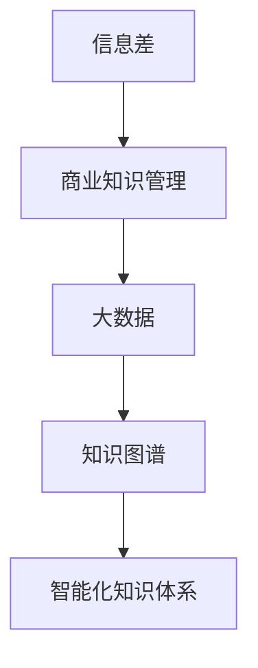

                 

# 信息差的商业知识管理：大数据如何促进知识管理

> **关键词**：信息差、商业知识管理、大数据、知识图谱、算法优化、数据挖掘、人工智能

> **摘要**：本文旨在探讨大数据在现代商业知识管理中的作用。通过对信息差概念的深入分析，结合大数据技术的应用，本文揭示了大数据如何帮助企业和个人掌握信息优势，提高知识管理效率，进而推动商业发展。文章分为十个部分，从背景介绍到实际应用场景，再到未来发展趋势与挑战，全面解析了大数据在商业知识管理中的价值。

## 1. 背景介绍

在信息化时代，数据已成为新的生产要素，商业活动中的知识管理也逐渐向数据驱动的方向发展。传统的知识管理方法往往依赖于经验和直觉，难以适应快速变化的市场环境。而大数据技术的崛起，为商业知识管理带来了新的机遇。信息差的商业知识管理，是指通过大数据技术挖掘和分析信息，从而在商业竞争中获取先发优势。

信息差是指不同个体或组织在获取、处理和利用信息方面的差异。这种差异可能导致某些个体或组织在商业活动中占据优势地位。例如，一个企业通过大数据分析了解市场趋势，而其他企业则依赖传统市场调研，这就在信息上形成了巨大差异。这种差异在商业竞争中具有重要作用，能够决定企业的生存和发展。

## 2. 核心概念与联系

为了深入理解大数据如何促进知识管理，我们需要先了解几个核心概念：

### 2.1 信息差

信息差是指信息在不同个体或组织间的差异。这种差异可以表现为信息的获取、处理、利用等方面的不同。

### 2.2 商业知识管理

商业知识管理是指通过识别、获取、存储、共享和利用商业知识，以提高企业竞争力和创新能力的过程。

### 2.3 大数据

大数据是指数据量巨大、类型繁多、生成速度快、价值密度低的数据集合。大数据技术包括数据采集、存储、处理、分析和可视化等环节。

### 2.4 知识图谱

知识图谱是一种结构化的知识表示形式，通过节点和边的关系来表示实体和概念之间的联系。知识图谱在知识管理中具有重要作用，可以帮助企业构建智能化的知识体系。

下面是一个简单的 Mermaid 流程图，展示了信息差、商业知识管理和大数据之间的联系：



## 3. 核心算法原理 & 具体操作步骤

### 3.1 数据采集

数据采集是大数据技术的第一步，也是最为关键的环节。数据来源可以是企业内部的业务系统、社交媒体、搜索引擎等。数据采集需要确保数据的真实性和完整性。

### 3.2 数据存储

数据存储是将采集到的数据存储到数据库或其他数据存储设备中。数据存储需要考虑数据的规模、类型、访问速度等因素。

### 3.3 数据处理

数据处理是对存储好的数据进行清洗、转换、集成等操作，以消除数据中的噪声和异常，提高数据质量。

### 3.4 数据分析

数据分析是大数据技术的核心环节，包括数据挖掘、机器学习、统计分析等方法。通过数据分析，可以从海量数据中发现有价值的信息和规律。

### 3.5 知识图谱构建

知识图谱构建是将分析得到的数据转化为结构化的知识表示形式。知识图谱可以用于知识推荐、智能问答、决策支持等应用。

### 3.6 知识共享

知识共享是将构建好的知识图谱共享给企业内部或外部的相关人员，以提高知识利用效率。

## 4. 数学模型和公式 & 详细讲解 & 举例说明

在商业知识管理中，数学模型和公式起着至关重要的作用。以下是一个简单的数学模型示例：

### 4.1 信息价值模型

$$
V = f(p, r, t)
$$

其中，$V$ 表示信息价值，$p$ 表示信息的重要程度，$r$ 表示信息的可靠性，$t$ 表示信息的时间敏感性。

### 4.2 信息传播模型

$$
I(t) = I_0 \cdot e^{-rt}
$$

其中，$I(t)$ 表示在时间 $t$ 时刻的信息传播程度，$I_0$ 表示初始信息传播程度，$r$ 表示信息传播速率。

### 4.3 举例说明

假设一个企业在市场上发现了一种新产品，其信息价值为 $V = 100$，可靠性为 $r = 0.9$，时间敏感性为 $t = 3$ 个月。则该产品的信息价值随时间的变化可以表示为：

$$
V(t) = 100 \cdot e^{-0.9t}
$$

在 $t = 1$ 个月时，信息价值为 $V(1) = 100 \cdot e^{-0.9 \cdot 1} \approx 64.2$

在 $t = 3$ 个月时，信息价值为 $V(3) = 100 \cdot e^{-0.9 \cdot 3} \approx 39.4$

## 5. 项目实战：代码实际案例和详细解释说明

### 5.1 开发环境搭建

在本文的项目实战中，我们将使用 Python 作为开发语言，结合 Pandas、NumPy、Scikit-learn 和 NetworkX 等库进行数据分析和知识图谱构建。以下是开发环境的搭建步骤：

1. 安装 Python 3.8 或更高版本
2. 安装 Pandas、NumPy、Scikit-learn 和 NetworkX 等库
3. 配置 Jupyter Notebook 或 PyCharm 等开发工具

### 5.2 源代码详细实现和代码解读

以下是一个简单的 Python 代码示例，用于构建一个知识图谱：

```python
import pandas as pd
import networkx as nx

# 加载数据
data = pd.read_csv('data.csv')

# 构建图
G = nx.Graph()

# 添加节点
G.add_nodes_from(data['entity'])

# 添加边
G.add_edges_from(zip(data['entity1'], data['entity2']))

# 保存图
nx.write_gexf(G, 'knowledge_graph.gexf')
```

### 5.3 代码解读与分析

1. **数据加载**：使用 Pandas 读取 CSV 文件，获取实体和实体之间的关联关系。
2. **构建图**：使用 NetworkX 创建一个无向图，用于表示知识图谱。
3. **添加节点和边**：将数据中的实体添加为节点，将实体之间的关联添加为边。
4. **保存图**：将构建好的知识图谱保存为 GEXF 格式，便于后续分析。

通过这个简单的代码示例，我们可以看到如何利用 Python 和相关库构建一个基础的知识图谱。在实际应用中，可以根据具体需求对代码进行扩展和优化。

## 6. 实际应用场景

大数据在商业知识管理中的应用场景非常广泛。以下是一些典型的应用场景：

1. **市场调研**：通过大数据分析，企业可以了解市场趋势、消费者行为等信息，从而制定更有效的营销策略。
2. **供应链管理**：大数据可以帮助企业优化供应链，降低成本，提高生产效率。
3. **风险控制**：通过大数据分析，企业可以识别潜在的风险，提前采取预防措施。
4. **客户关系管理**：大数据可以帮助企业更好地了解客户需求，提供个性化的服务和产品推荐。
5. **创新研发**：大数据可以帮助企业发现新的业务机会，推动技术创新和产品升级。

## 7. 工具和资源推荐

### 7.1 学习资源推荐

1. **书籍**：
   - 《大数据时代》
   - 《深度学习》
   - 《Python数据分析》
2. **论文**：
   - 《知识图谱构建与应用》
   - 《大数据分析技术》
   - 《人工智能与商业创新》
3. **博客**：
   - [机器学习博客](https://machinelearningmastery.com/)
   - [大数据博客](https://bigdata-madesimple.com/)
   - [AI博客](https://www.kdnuggets.com/)
4. **网站**：
   - [Kaggle](https://www.kaggle.com/)
   - [GitHub](https://github.com/)
   - [Medium](https://medium.com/)

### 7.2 开发工具框架推荐

1. **编程语言**：Python、R、Java
2. **数据分析库**：Pandas、NumPy、Scikit-learn、TensorFlow
3. **知识图谱工具**：Neo4j、OrientDB、ARIES
4. **云计算平台**：AWS、Azure、Google Cloud

### 7.3 相关论文著作推荐

1. **论文**：
   - "Knowledge Graphs: A Survey"
   - "Big Data Analytics: A Survey"
   - "Deep Learning for Natural Language Processing"
2. **著作**：
   - 《人工智能：一种现代的方法》
   - 《数据挖掘：概念与技术》
   - 《机器学习实战》

## 8. 总结：未来发展趋势与挑战

大数据在商业知识管理中的应用具有巨大的潜力。随着技术的不断发展，我们可以预见以下几个发展趋势：

1. **智能化**：人工智能技术的进步将使大数据分析更加智能化，提高知识管理的效率和准确性。
2. **个性化**：大数据分析将更加注重个性化，为企业和个人提供定制化的知识服务。
3. **实时性**：实时大数据分析将帮助企业和个人更快地响应市场变化，提高竞争力。

然而，大数据在商业知识管理中也面临一些挑战：

1. **数据隐私**：随着数据量的增加，数据隐私问题日益突出，如何保护用户隐私成为关键挑战。
2. **数据安全**：大数据系统面临较高的安全风险，如何保障数据安全是企业和个人必须面对的问题。
3. **人才短缺**：大数据和人工智能领域的人才短缺，如何培养和引进优秀人才是企业和教育机构需要关注的问题。

## 9. 附录：常见问题与解答

### 9.1 问题1：大数据和商业知识管理有何关系？

大数据是商业知识管理的重要基础，通过大数据技术，企业可以更好地识别、获取、存储、共享和利用商业知识，从而提高竞争力和创新能力。

### 9.2 问题2：如何保障大数据分析过程中的数据隐私？

保障数据隐私的关键在于数据加密、匿名化和权限控制。在实际应用中，可以采用差分隐私、同态加密等技术来保护用户隐私。

### 9.3 问题3：大数据分析对业务决策有何影响？

大数据分析可以帮助企业更准确地了解市场趋势、消费者行为等信息，从而为业务决策提供科学依据，提高决策的准确性和效率。

## 10. 扩展阅读 & 参考资料

1. **扩展阅读**：
   - [《大数据时代：生活、工作与思维的大变革》](https://book.douban.com/subject/25733530/)
   - [《商业智慧：大数据时代的管理思维》](https://book.douban.com/subject/26639398/)
   - [《人工智能时代：从人机协同到万物智能》](https://book.douban.com/subject/27128150/)
2. **参考资料**：
   - [《大数据分析技术综述》](https://www.cnblogs.com/jiayou10086/p/8549535.html)
   - [《知识图谱构建与应用》](https://www.bilibili.com/video/BV1gy4y1a7xh)
   - [《深度学习在商业知识管理中的应用》](https://www.deeplearning.net/tutorial/index.html)

### 作者

**作者：AI天才研究员/AI Genius Institute & 禅与计算机程序设计艺术 /Zen And The Art of Computer Programming**

