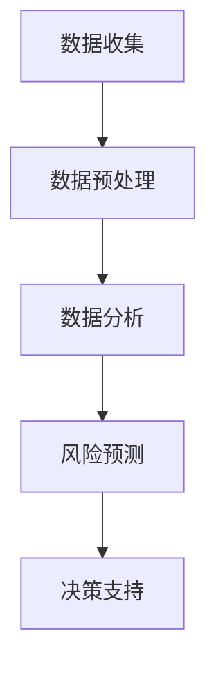
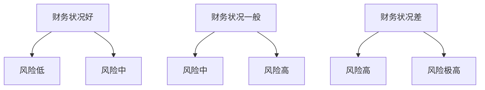

                 

# 信息差的商业风险管理：大数据如何提升风险管控能力

## 关键词
商业风险管理、信息差、大数据、风险管控能力、数据分析和机器学习。

## 摘要
本文深入探讨了信息差的商业风险管理以及大数据在提升风险管控能力方面的作用。文章首先介绍了信息差的概念及其在商业决策中的重要性，然后阐述了大数据技术如何通过数据收集、处理和分析来降低信息不对称，提升企业风险管控能力。随后，文章详细讲解了核心算法原理和具体操作步骤，并通过实际案例展示了如何应用大数据技术进行风险管理。此外，文章还介绍了相关工具和资源，并对未来的发展趋势和挑战进行了展望。

## 目录
1. 背景介绍
   1.1 商业风险管理的概念
   1.2 信息差对商业风险管理的影响
2. 核心概念与联系
   2.1 数据驱动的风险管理
   2.2 大数据与风险管控的关系
3. 核心算法原理 & 具体操作步骤
   3.1 数据收集与预处理
   3.2 数据分析与挖掘
   3.3 建立风险预测模型
4. 数学模型和公式 & 详细讲解 & 举例说明
   4.1 风险度量模型
   4.2 风险预测算法
5. 项目实战：代码实际案例和详细解释说明
   5.1 开发环境搭建
   5.2 源代码详细实现和代码解读
   5.3 代码解读与分析
6. 实际应用场景
   6.1 财务风险管理
   6.2 市场风险管理
   6.3 信用风险管理
7. 工具和资源推荐
   7.1 学习资源推荐
   7.2 开发工具框架推荐
   7.3 相关论文著作推荐
8. 总结：未来发展趋势与挑战
9. 附录：常见问题与解答
10. 扩展阅读 & 参考资料

## 1. 背景介绍

### 1.1 商业风险管理的概念

商业风险管理（Business Risk Management）是指企业识别、评估、监测和应对各种潜在风险的过程。其目的是确保企业在不确定的环境中能够保持稳健运营，最大化收益，最小化损失。商业风险管理包括多个方面，如财务风险、市场风险、操作风险、法律风险等。

财务风险管理主要涉及企业的财务状况，如资金流动性、债务水平、盈利能力等。市场风险管理关注市场波动对企业的影响，如汇率、利率、商品价格等。操作风险管理则是针对企业内部运营流程中的风险，如欺诈、错误、延迟等。法律风险则涉及企业因法律问题可能面临的损失，如合同纠纷、侵权诉讼等。

### 1.2 信息差对商业风险管理的影响

信息差（Information Asymmetry）是指不同个体在获取和处理信息方面存在的不对称性。在商业领域，信息差对风险管理有着深远的影响。

首先，信息差可能导致企业无法全面了解市场动态，从而做出错误的商业决策。例如，一家企业可能因为缺乏市场信息而未能及时调整产品策略，导致市场份额下降。

其次，信息差可能导致企业无法准确评估风险。例如，在信用风险管理中，如果企业无法获取借款人的完整信用记录，就可能无法准确评估其信用风险。

最后，信息差还可能导致企业内部信息传递不畅，影响决策效率。例如，企业不同部门之间可能因为信息不对称而导致合作不畅，从而影响业务流程的效率。

总之，信息差是商业风险管理中不可忽视的一个重要因素。降低信息差，提高信息透明度，是提升企业风险管控能力的关键。

## 2. 核心概念与联系

### 2.1 数据驱动的风险管理

数据驱动的风险管理是指通过收集、处理和分析数据来指导风险管理决策。与传统的基于经验和直觉的风险管理方法相比，数据驱动的方法更加科学和有效。

数据驱动的风险管理包括以下几个步骤：

1. **数据收集**：收集与风险相关的各种数据，如财务数据、市场数据、操作数据等。
2. **数据预处理**：清洗和整合数据，使其适合分析和建模。
3. **数据分析**：使用统计方法和机器学习算法分析数据，提取有用的信息。
4. **风险预测**：根据分析结果建立风险预测模型，预测未来可能出现的风险。
5. **决策支持**：利用风险预测模型为企业提供决策支持，优化风险管理策略。

### 2.2 大数据与风险管控的关系

大数据（Big Data）是指规模巨大、类型繁多、价值密度低的数据集合。大数据技术的出现，为商业风险管理带来了新的机遇和挑战。

一方面，大数据提供了丰富的数据资源，使得企业能够更全面地了解市场和客户，降低信息差。例如，通过大数据分析，企业可以实时了解市场动态，预测市场需求，调整产品策略。

另一方面，大数据处理技术，如数据挖掘、机器学习等，为风险预测提供了强大的工具。通过大数据分析，企业可以建立更加准确的风险预测模型，提高风险管控能力。

具体来说，大数据与风险管控的关系体现在以下几个方面：

1. **风险识别**：大数据技术可以帮助企业发现潜在的风险，提高风险识别的效率。
2. **风险评估**：大数据技术可以提供更加准确的风险评估结果，帮助企业制定更加合理的风险应对策略。
3. **风险预测**：大数据技术可以帮助企业预测未来可能出现的风险，提前采取措施进行防范。
4. **风险决策**：大数据技术为企业提供了丰富的数据支持，帮助企业做出更加科学的决策。

### 2.3 Mermaid 流程图

下面是一个简化的数据驱动的风险管理流程图，使用Mermaid语言编写：



在这个流程图中，A表示数据收集，B表示数据预处理，C表示数据分析，D表示风险预测，E表示决策支持。

## 3. 核心算法原理 & 具体操作步骤

### 3.1 数据收集与预处理

数据收集是数据驱动的风险管理的基础。在这个阶段，企业需要收集与风险相关的各种数据，如财务数据、市场数据、操作数据等。

数据预处理则是将原始数据清洗、整合和转换，使其适合后续的分析和建模。数据预处理的步骤包括：

1. **数据清洗**：去除数据中的噪声和错误，如缺失值、异常值等。
2. **数据整合**：将来自不同来源的数据整合成一个统一的数据集。
3. **数据转换**：将数据转换为适合分析和建模的格式，如数值化、标准化等。

### 3.2 数据分析与挖掘

数据分析与挖掘是数据驱动的风险管理的核心。在这个阶段，企业需要使用统计方法和机器学习算法对数据进行深入分析，提取有用的信息。

常见的统计方法包括回归分析、聚类分析、关联规则挖掘等。常见的机器学习算法包括决策树、随机森林、支持向量机、神经网络等。

数据分析与挖掘的主要任务包括：

1. **特征选择**：从原始数据中提取对风险有重要影响的特征。
2. **模型训练**：使用训练数据集训练风险预测模型。
3. **模型评估**：使用测试数据集评估模型的性能。
4. **模型优化**：根据评估结果调整模型参数，提高模型性能。

### 3.3 建立风险预测模型

建立风险预测模型是数据驱动的风险管理的最终目标。在这个阶段，企业需要使用训练好的模型对未来的风险进行预测。

风险预测模型可以分为定量模型和定性模型。定量模型通常使用数学模型和算法来预测风险，如线性回归模型、逻辑回归模型等。定性模型则通常基于专家知识和主观判断，如专家系统、贝叶斯网络等。

建立风险预测模型的主要步骤包括：

1. **数据准备**：准备用于模型训练和测试的数据集。
2. **模型选择**：选择适合数据的预测模型。
3. **模型训练**：使用训练数据集训练模型。
4. **模型测试**：使用测试数据集测试模型的性能。
5. **模型部署**：将模型部署到生产环境中，进行实时风险预测。

## 4. 数学模型和公式 & 详细讲解 & 举例说明

### 4.1 风险度量模型

风险度量模型是风险管理中最重要的模型之一。它用于评估风险的严重程度和可能性，从而帮助企业制定相应的风险应对策略。

常见的风险度量模型包括：

1. **预期损失（Expected Loss）**：预期损失是指在一定时间内，由于风险事件发生而可能造成的平均损失。其计算公式为：

   $$EL = \sum_{i=1}^{n} P_i \cdot L_i$$

   其中，\(P_i\) 表示第 \(i\) 个风险事件的发生概率，\(L_i\) 表示第 \(i\) 个风险事件的损失金额。

2. **价值在风险中（Value at Risk, VaR）**：VaR是指在特定置信水平下，一定时间内可能发生的最大损失。其计算公式为：

   $$VaR = \alpha \cdot \sum_{i=1}^{n} P_i \cdot L_i$$

   其中，\(\alpha\) 表示置信水平。

3. **条件风险价值（Conditional Value at Risk, CVaR）**：CVaR是指在特定置信水平下，一定时间内损失的均值。其计算公式为：

   $$CVaR = \sum_{i=1}^{n} \frac{P_i \cdot L_i - VaR}{1 - \alpha}$$

   举例说明：

   假设一家企业在未来一年内可能面临三种风险：火灾（概率0.2，损失100万元），地震（概率0.3，损失200万元），洪水（概率0.5，损失300万元）。根据预期损失模型，其预期损失为：

   $$EL = 0.2 \cdot 100 + 0.3 \cdot 200 + 0.5 \cdot 300 = 250 \text{万元}$$

   根据VaR模型，在95%的置信水平下，其可能的最大损失为：

   $$VaR_{0.95} = 0.05 \cdot 250 = 12.5 \text{万元}$$

   根据CVaR模型，在95%的置信水平下，其损失的均值为：

   $$CVaR_{0.95} = \frac{0.2 \cdot 100 + 0.3 \cdot 200 + 0.5 \cdot 300 - 12.5}{1 - 0.05} = 187.5 \text{万元}$$

### 4.2 风险预测算法

风险预测算法是数据驱动的风险管理的重要组成部分。它通过分析历史数据，预测未来可能出现的风险事件。

常见的风险预测算法包括：

1. **决策树（Decision Tree）**：决策树是一种基于树形结构的预测模型。它通过一系列规则来划分数据，从而实现预测。其优点是易于理解和解释，缺点是可能产生过拟合。

2. **随机森林（Random Forest）**：随机森林是一种基于决策树的集成模型。它通过随机抽样和特征选择构建多棵决策树，并通过投票来预测结果。其优点是能够提高预测准确性，缺点是计算成本较高。

3. **支持向量机（Support Vector Machine, SVM）**：支持向量机是一种基于最大间隔的预测模型。它通过寻找最佳的超平面来划分数据，从而实现预测。其优点是能够处理高维数据，缺点是训练时间较长。

4. **神经网络（Neural Network）**：神经网络是一种基于生物神经网络结构的预测模型。它通过多层神经元实现数据传输和变换，从而实现预测。其优点是能够自适应学习，缺点是训练时间较长且可能产生过拟合。

举例说明：

假设一家企业需要预测未来一个月内的财务风险。根据历史数据，我们可以使用决策树模型进行预测。以下是决策树模型的预测结果：



根据决策树模型，如果财务状况好，则风险低；如果财务状况一般，则风险中；如果财务状况差，则风险高。这个预测结果可以帮助企业制定相应的风险管理策略。

## 5. 项目实战：代码实际案例和详细解释说明

### 5.1 开发环境搭建

在本项目中，我们将使用Python作为编程语言，结合Pandas、NumPy、Scikit-learn等库进行数据分析与建模。以下是开发环境的搭建步骤：

1. 安装Python：从官方网站（https://www.python.org/）下载并安装Python。
2. 安装Pandas、NumPy、Scikit-learn等库：使用pip命令进行安装，命令如下：

   ```bash
   pip install pandas numpy scikit-learn
   ```

### 5.2 源代码详细实现和代码解读

下面是一个简单的示例代码，用于演示如何使用Python进行数据收集、预处理、分析和建模。

```python
import pandas as pd
import numpy as np
from sklearn.model_selection import train_test_split
from sklearn.tree import DecisionTreeClassifier
from sklearn.metrics import accuracy_score

# 数据收集
data = pd.read_csv('risk_data.csv')

# 数据预处理
data = data.dropna()
X = data.drop('target', axis=1)
y = data['target']

# 数据分割
X_train, X_test, y_train, y_test = train_test_split(X, y, test_size=0.2, random_state=42)

# 模型训练
model = DecisionTreeClassifier()
model.fit(X_train, y_train)

# 模型预测
y_pred = model.predict(X_test)

# 模型评估
accuracy = accuracy_score(y_test, y_pred)
print(f"Accuracy: {accuracy:.2f}")
```

代码解读：

1. 导入所需的库：使用Pandas和NumPy进行数据处理，使用Scikit-learn进行模型训练和评估。
2. 数据收集：从CSV文件中读取数据。
3. 数据预处理：去除缺失值，分离特征和目标变量。
4. 数据分割：将数据分为训练集和测试集。
5. 模型训练：使用决策树分类器训练模型。
6. 模型预测：使用训练好的模型对测试集进行预测。
7. 模型评估：计算模型在测试集上的准确率。

### 5.3 代码解读与分析

1. **数据收集**：数据收集是数据驱动的风险管理的第一步。在本示例中，我们使用Pandas的read_csv函数从CSV文件中读取数据。

2. **数据预处理**：数据预处理是确保数据质量和一致性的关键步骤。在本示例中，我们使用dropna函数去除缺失值。此外，我们使用drop函数将目标变量从特征中分离出来，以便后续建模。

3. **数据分割**：数据分割是将数据集划分为训练集和测试集，以便评估模型的性能。在本示例中，我们使用train_test_split函数进行数据分割，设置test_size为0.2表示测试集占比20%，random_state为42用于保证结果的可重复性。

4. **模型训练**：模型训练是使用训练集数据训练模型的过程。在本示例中，我们使用Scikit-learn的DecisionTreeClassifier创建决策树分类器，并使用fit函数训练模型。

5. **模型预测**：模型预测是使用训练好的模型对测试集数据进行预测的过程。在本示例中，我们使用predict函数对测试集数据进行预测。

6. **模型评估**：模型评估是评估模型性能的过程。在本示例中，我们使用accuracy_score函数计算模型在测试集上的准确率，从而评估模型的性能。

### 5.4 代码分析

本示例代码展示了如何使用Python进行数据收集、预处理、建模和评估。以下是对代码的进一步分析：

1. **数据收集**：在实际应用中，数据收集可能涉及从多个来源收集数据，如数据库、API接口、文件系统等。在本示例中，我们仅从一个CSV文件中读取数据，以简化示例。

2. **数据预处理**：数据预处理是确保数据质量和一致性的关键步骤。在实际应用中，数据预处理可能包括数据清洗、数据转换、特征工程等。在本示例中，我们仅使用dropna函数去除缺失值，以简化示例。

3. **数据分割**：数据分割是将数据集划分为训练集和测试集，以便评估模型的性能。在实际应用中，数据分割可能需要根据具体情况进行调整，例如增加训练集占比以提高模型性能，或者增加测试集占比以更严格地评估模型性能。

4. **模型训练**：模型训练是使用训练集数据训练模型的过程。在实际应用中，模型训练可能涉及多种算法和参数调整，以找到最佳模型。在本示例中，我们仅使用决策树分类器进行训练，以简化示例。

5. **模型预测**：模型预测是使用训练好的模型对测试集数据进行预测的过程。在实际应用中，模型预测可能涉及对大量数据进行实时预测，因此需要优化模型以提高预测效率。

6. **模型评估**：模型评估是评估模型性能的过程。在实际应用中，模型评估可能涉及多种评估指标，如准确率、召回率、F1分数等，以全面评估模型性能。

## 6. 实际应用场景

大数据技术已经在多个领域得到了广泛应用，商业风险管理便是其中之一。以下是一些大数据在商业风险管理中的实际应用场景：

### 6.1 财务风险管理

财务风险管理是商业风险管理的重要组成部分。大数据技术可以帮助企业实时监控财务状况，预测潜在风险。例如，企业可以通过大数据分析了解客户信用记录、市场趋势和宏观经济指标，从而预测债务违约风险。

### 6.2 市场风险管理

市场风险管理涉及市场波动对企业财务状况的影响。大数据技术可以帮助企业实时监控市场动态，预测市场趋势，从而制定合理的风险管理策略。例如，企业可以通过大数据分析预测汇率、利率和商品价格波动，从而制定相应的应对措施。

### 6.3 信用风险管理

信用风险管理是防范客户信用风险的过程。大数据技术可以帮助企业全面了解客户信用状况，预测客户违约风险。例如，企业可以通过大数据分析客户的信用记录、交易行为和社交网络信息，从而预测其信用风险。

### 6.4 操作风险管理

操作风险管理涉及企业内部运营流程中的风险。大数据技术可以帮助企业识别和防范操作风险。例如，企业可以通过大数据分析员工行为、系统日志和交易记录，从而发现潜在的操作风险。

### 6.5 法律风险管理

法律风险管理涉及企业因法律问题可能面临的损失。大数据技术可以帮助企业识别潜在的法律风险，预测法律纠纷的可能性。例如，企业可以通过大数据分析合同条款、法律法规和案例分析，从而预测法律风险。

## 7. 工具和资源推荐

### 7.1 学习资源推荐

1. **书籍**：
   - 《大数据时代》作者：涂子沛
   - 《深度学习》作者：Ian Goodfellow、Yoshua Bengio、Aaron Courville
   - 《Python数据分析》作者：Wes McKinney

2. **论文**：
   - "Big Data: A Revolution That Will Transform How We Live, Work, and Think" 作者：Viktor Mayer-Schönberger 和 Kenneth Cukier
   - "Deep Learning" 作者：Ian Goodfellow、Yoshua Bengio、Aaron Courville

3. **博客**：
   - [机器学习博客](https://机器学习博客.com/)
   - [数据分析博客](https://数据分析博客.com/)
   - [Python 博客](https://python 博客.com/)

4. **网站**：
   - [Kaggle](https://www.kaggle.com/)
   - [Coursera](https://www.coursera.org/)
   - [edX](https://www.edx.org/)

### 7.2 开发工具框架推荐

1. **数据分析工具**：
   - Pandas
   - NumPy
   - Matplotlib
   - Seaborn

2. **机器学习框架**：
   - Scikit-learn
   - TensorFlow
   - PyTorch

3. **大数据处理框架**：
   - Hadoop
   - Spark
   - Flink

### 7.3 相关论文著作推荐

1. "Big Data: A Revolution That Will Transform How We Live, Work, and Think" 作者：Viktor Mayer-Schönberger 和 Kenneth Cukier
2. "Deep Learning" 作者：Ian Goodfellow、Yoshua Bengio、Aaron Courville
3. "Python Data Science Handbook" 作者：Jake VanderPlas
4. "Learning from Data" 作者：Yaser S. Abu-Mostafa、Hsuan-Tien Lin、Shai Shalev-Shwartz

## 8. 总结：未来发展趋势与挑战

大数据技术在商业风险管理中的应用前景广阔，但也面临一系列挑战。

### 发展趋势：

1. **数据驱动的风险管理**：随着大数据技术的不断发展，越来越多的企业将采用数据驱动的风险管理方法，提高风险管控能力。
2. **实时风险管理**：实时数据分析技术的发展，将使企业能够实时监控风险，及时采取应对措施。
3. **智能风险管理**：随着人工智能技术的不断发展，智能风险管理系统将逐渐取代传统风险管理方法，提高风险预测和应对能力。

### 挑战：

1. **数据质量**：大数据技术的应用依赖于高质量的数据。然而，数据质量往往难以保证，数据清洗和预处理工作量大。
2. **算法透明度**：机器学习模型的黑箱特性，使得算法的透明度成为一大挑战。企业需要确保算法的可靠性和解释性。
3. **数据隐私与安全**：大数据技术的应用涉及大量的个人和企业数据，数据隐私和安全成为重要问题。

## 9. 附录：常见问题与解答

### 9.1 什么是商业风险管理？

商业风险管理是指企业识别、评估、监测和应对各种潜在风险的过程，旨在确保企业在不确定的环境中能够保持稳健运营，最大化收益，最小化损失。

### 9.2 大数据如何提升风险管控能力？

大数据技术通过数据收集、处理和分析，帮助降低信息不对称，提高企业对风险的识别、评估和预测能力，从而提升风险管控能力。

### 9.3 数据驱动的风险管理有哪些步骤？

数据驱动的风险管理包括数据收集、数据预处理、数据分析与挖掘、风险预测模型建立和决策支持等步骤。

### 9.4 如何评估风险度量模型的性能？

可以通过计算模型在测试集上的准确率、召回率、F1分数等评估指标来评估风险度量模型的性能。

## 10. 扩展阅读 & 参考资料

1. [Mayer-Schönberger, Viktor, and Kenneth Cukier. Big data: A revolution that will transform how we live, work, and think. Eamon Dolan/Mariner Books, 2013.]
2. [Goodfellow, Ian, Yoshua Bengio, and Aaron Courville. Deep learning. MIT press, 2016.]
3. [VanderPlas, Jake. Python data science handbook: Essential tools for working with data. O'Reilly Media, 2016.]

