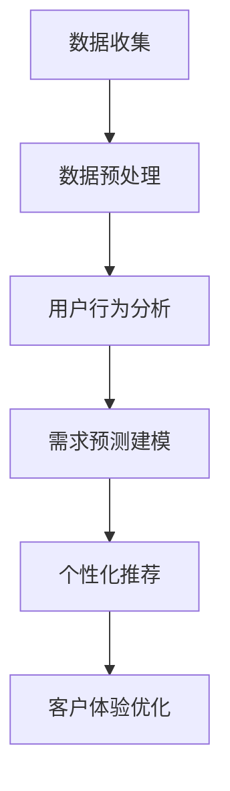

                 

# 信息差的客户体验个性化：大数据如何实现客户体验个性化

> 关键词：客户体验个性化、大数据分析、信息差、用户行为分析、预测建模

> 摘要：本文探讨了如何利用大数据分析技术，基于信息差的原理，实现客户体验的个性化。文章首先介绍了客户体验个性化的重要性，随后深入分析了大数据在客户体验个性化中的关键作用。通过具体算法原理、数学模型、实际应用案例以及工具和资源推荐，文章系统地阐述了如何通过大数据技术提升客户体验，为企业的长期发展提供有力支持。

## 1. 背景介绍

在当今市场竞争日益激烈的商业环境中，客户体验个性化成为企业获取竞争优势的重要手段。个性化客户体验不仅能提高客户满意度，还能增加客户忠诚度，从而为企业带来更多的业务机会和收益。然而，如何实现客户体验个性化，一直是企业面临的一大挑战。

传统的客户体验管理往往依赖于有限的客户数据，难以充分挖掘客户的个性化需求。而随着大数据技术的发展，企业能够收集和分析海量的用户数据，从而更加精确地了解客户行为和偏好。基于信息差的原理，大数据分析能够帮助企业发现并利用不同客户之间的差异，实现客户体验的个性化。

## 2. 核心概念与联系

### 2.1 信息差

信息差是指不同个体或群体之间在信息获取、处理和应用方面的差异。在客户体验个性化中，信息差主要体现在以下两个方面：

- **客户行为差异**：不同客户在浏览、购买、评论等行为上存在明显的差异。
- **客户需求差异**：不同客户在产品需求、服务质量、价格敏感度等方面存在差异。

### 2.2 大数据分析

大数据分析是指利用先进的数据挖掘、机器学习等技术，对海量数据进行深入分析和挖掘，以发现数据背后的规律和趋势。大数据分析在客户体验个性化中的应用主要包括以下几个方面：

- **用户行为分析**：通过分析用户行为数据，了解用户偏好和需求。
- **预测建模**：利用历史数据建立预测模型，预测客户未来的行为和需求。
- **个性化推荐**：根据用户行为和需求，为用户推荐个性化的产品和服务。

### 2.3 Mermaid 流程图

以下是一个简化的 Mermaid 流程图，展示了大数据分析在客户体验个性化中的关键环节：



## 3. 核心算法原理 & 具体操作步骤

### 3.1 用户行为分析

用户行为分析是大数据分析在客户体验个性化中的基础。通过分析用户在网站、APP、社交媒体等渠道的行为数据，企业可以了解用户偏好、购买习惯和需求。

具体操作步骤如下：

1. 数据收集：收集用户在各个渠道的行为数据，包括浏览、搜索、购买、评论等。
2. 数据预处理：对收集到的数据清洗、去噪、整合，为后续分析做准备。
3. 特征提取：从原始数据中提取关键特征，如浏览时长、购买频次、评价分数等。
4. 行为分析：利用机器学习算法，分析用户行为数据，发现用户偏好和需求。

### 3.2 需求预测建模

需求预测建模是客户体验个性化的重要环节。通过预测客户未来的行为和需求，企业可以提前做好准备，提供个性化的产品和服务。

具体操作步骤如下：

1. 数据收集：收集与需求预测相关的数据，如用户历史行为、人口统计信息、市场趋势等。
2. 特征工程：从原始数据中提取关键特征，如用户活跃度、消费能力、需求变化趋势等。
3. 模型选择：根据需求预测的目标，选择合适的机器学习模型，如回归模型、分类模型、聚类模型等。
4. 模型训练与优化：利用历史数据训练模型，并通过交叉验证、超参数调整等方法优化模型性能。
5. 预测与评估：利用训练好的模型进行需求预测，并评估预测结果的准确性。

### 3.3 个性化推荐

个性化推荐是客户体验个性化的重要手段。通过为用户推荐个性化的产品和服务，企业可以提高用户满意度，增加用户粘性。

具体操作步骤如下：

1. 数据收集：收集用户行为数据，如浏览、搜索、购买、评价等。
2. 用户建模：利用用户行为数据建立用户画像，包括用户兴趣、需求、行为习惯等。
3. 产品建模：分析产品数据，包括产品属性、类别、评价等，建立产品特征向量。
4. 推荐算法：根据用户画像和产品特征向量，选择合适的推荐算法，如协同过滤、基于内容的推荐、混合推荐等。
5. 推荐结果生成：生成个性化推荐结果，为用户推荐符合其需求和兴趣的产品和服务。

## 4. 数学模型和公式 & 详细讲解 & 举例说明

### 4.1 用户行为分析

用户行为分析通常使用机器学习算法，如决策树、随机森林、支持向量机等。以下是一个简单的决策树算法公式：

$$
y = f(x_1, x_2, ..., x_n)
$$

其中，$y$ 表示用户行为标签，$x_1, x_2, ..., x_n$ 表示用户行为特征。

### 4.2 需求预测建模

需求预测建模通常使用回归模型，如线性回归、岭回归、LASSO回归等。以下是一个简单的线性回归模型公式：

$$
y = \beta_0 + \beta_1x_1 + \beta_2x_2 + ... + \beta_nx_n
$$

其中，$y$ 表示需求预测值，$x_1, x_2, ..., x_n$ 表示需求特征，$\beta_0, \beta_1, \beta_2, ..., \beta_n$ 表示模型参数。

### 4.3 个性化推荐

个性化推荐通常使用协同过滤算法，如基于用户的协同过滤、基于项目的协同过滤等。以下是一个简单的基于用户的协同过滤算法公式：

$$
r_{ui} = \frac{\sum_{j \in N_i} r_{uj} \cdot sim(u, v)}{\sum_{j \in N_i} sim(u, v)}
$$

其中，$r_{ui}$ 表示用户 $u$ 对项目 $i$ 的评分预测值，$r_{uj}$ 表示用户 $u$ 对项目 $j$ 的评分值，$sim(u, v)$ 表示用户 $u$ 和用户 $v$ 之间的相似度。

### 4.4 举例说明

假设我们有一组用户行为数据，如下表所示：

| 用户ID | 浏览商品A | 浏览商品B | 购买商品C | 购买商品D |
| --- | --- | --- | --- | --- |
| 1 | 1 | 0 | 1 | 0 |
| 2 | 1 | 1 | 0 | 1 |
| 3 | 0 | 1 | 1 | 0 |
| 4 | 1 | 1 | 1 | 1 |

我们使用决策树算法进行用户行为分析，得到以下决策树模型：

```
浏览商品A
|
|---浏览商品B
|   |
|   |---购买商品C
|       |
|       |---购买商品D
|---购买商品C
|
|---购买商品D
```

根据决策树模型，我们可以预测新用户的购买行为。例如，对于新用户 $5$，他的行为数据为：

| 用户ID | 浏览商品A | 浏览商品B | 购买商品C | 购买商品D |
| --- | --- | --- | --- | --- |
| 5 | 1 | 0 | 1 | 0 |

根据决策树模型，新用户 $5$ 很可能购买商品 C，但不太可能购买商品 D。

## 5. 项目实战：代码实际案例和详细解释说明

### 5.1 开发环境搭建

为了进行客户体验个性化项目，我们首先需要搭建一个开发环境。以下是一个简单的 Python 开发环境搭建步骤：

1. 安装 Python：在官网上下载 Python 安装包，并按照提示完成安装。
2. 安装 Anaconda：下载并安装 Anaconda，它是一个集成了 Python 和许多常用库的科学计算平台。
3. 安装 Jupyter Notebook：在 Anaconda 中安装 Jupyter Notebook，它是一个交互式的 Web 应用程序，用于编写和运行 Python 代码。
4. 安装相关库：使用 pip 工具安装必要的 Python 库，如 NumPy、Pandas、Scikit-learn 等。

### 5.2 源代码详细实现和代码解读

以下是一个简单的 Python 代码示例，用于实现用户行为分析和个性化推荐：

```python
import pandas as pd
from sklearn.tree import DecisionTreeClassifier
from sklearn.metrics import accuracy_score

# 读取数据
data = pd.read_csv('user_behavior.csv')

# 数据预处理
X = data[['浏览商品A', '浏览商品B', '购买商品C', '购买商品D']]
y = data['购买商品C']

# 建立决策树模型
model = DecisionTreeClassifier()
model.fit(X, y)

# 预测新用户的行为
new_user = pd.DataFrame([[1, 0, 1, 0]], columns=['浏览商品A', '浏览商品B', '购买商品C', '购买商品D'])
prediction = model.predict(new_user)

# 输出预测结果
print(prediction)

# 计算模型准确率
accuracy = accuracy_score(y, prediction)
print('模型准确率：', accuracy)
```

### 5.3 代码解读与分析

- **数据读取与预处理**：我们使用 Pandas 库读取用户行为数据，并进行数据预处理，将数据分为特征集 $X$ 和标签集 $y$。
- **建立决策树模型**：我们使用 Scikit-learn 库的 DecisionTreeClassifier 类建立决策树模型，并使用 fit 方法进行模型训练。
- **预测新用户行为**：我们使用 predict 方法对新用户的行为进行预测，并输出预测结果。
- **计算模型准确率**：我们使用 accuracy_score 方法计算模型准确率，评估模型性能。

## 6. 实际应用场景

### 6.1 电子商务平台

电子商务平台可以通过大数据分析实现个性化推荐，提高用户购买转化率和满意度。例如，阿里巴巴的淘宝和天猫平台通过分析用户浏览、搜索、购买等行为数据，为用户推荐个性化的商品。

### 6.2 金融行业

金融行业可以通过大数据分析实现精准营销和风险管理。例如，银行可以通过分析用户财务数据、消费行为等，为用户推荐合适的理财产品，提高用户忠诚度。

### 6.3 医疗行业

医疗行业可以通过大数据分析实现个性化医疗。例如，通过分析患者病史、基因信息等，为患者推荐个性化的治疗方案，提高治疗效果。

## 7. 工具和资源推荐

### 7.1 学习资源推荐

- **书籍**：
  - 《Python数据分析基础教程：NumPy学习指南》
  - 《机器学习实战》
  - 《深度学习》
- **论文**：
  - "User Behavior Analysis for Personalized Recommendation"
  - "Deep Learning for Customer Experience Management"
  - "Predictive Analytics in Healthcare"
- **博客**：
  - Medium
  - 知乎
  - CSDN
- **网站**：
  - Kaggle
  - ArXiv
  - JSTOR

### 7.2 开发工具框架推荐

- **开发工具**：
  - Jupyter Notebook
  - PyCharm
  - Visual Studio Code
- **数据预处理工具**：
  - Pandas
  - NumPy
  - Scikit-learn
- **机器学习库**：
  - TensorFlow
  - PyTorch
  - Keras

### 7.3 相关论文著作推荐

- **论文**：
  - "Personalized Recommendation Systems: The State of the Art and Beyond"
  - "Deep Learning for Customer Experience Management"
  - "User Behavior Analysis for Personalized Recommendation"
- **著作**：
  - 《机器学习实战》
  - 《深度学习》
  - 《Python数据分析基础教程：NumPy学习指南》

## 8. 总结：未来发展趋势与挑战

随着大数据技术和人工智能技术的不断发展，客户体验个性化将越来越受到企业的重视。未来，客户体验个性化的发展趋势主要包括以下几个方面：

- **更加精准的个性化推荐**：通过不断优化算法和模型，提高个性化推荐的准确性和效果。
- **跨渠道的个性化服务**：实现线上线下渠道的无缝融合，为用户提供一致的个性化体验。
- **智能化客服系统**：利用自然语言处理、对话系统等技术，为用户提供智能化的客户服务。

然而，客户体验个性化也面临一些挑战：

- **数据隐私和安全**：在收集和使用用户数据时，需要严格保护用户隐私和安全。
- **算法偏见和公平性**：确保算法不会因为数据偏见而导致不公平的个性化推荐。
- **用户接受度**：用户对个性化推荐可能存在抵触情绪，需要提高用户的接受度和满意度。

## 9. 附录：常见问题与解答

### 9.1 如何确保数据隐私和安全？

- 采用加密技术，确保数据在传输和存储过程中的安全性。
- 制定严格的数据使用协议和隐私政策，明确数据收集、使用和共享的范围和目的。
- 定期进行安全审计和风险评估，及时发现和解决潜在的安全隐患。

### 9.2 如何处理算法偏见和公平性？

- 在数据收集和处理过程中，确保数据来源的多样性和代表性。
- 对算法进行公平性测试，发现并消除潜在的偏见。
- 建立透明、可解释的算法体系，提高用户对算法的信任度。

### 9.3 如何提高用户接受度？

- 设计人性化的推荐系统，尊重用户隐私和选择权。
- 定期向用户反馈个性化推荐的依据和效果，增强用户信任。
- 提供多样化的个性化服务选项，满足不同用户的需求。

## 10. 扩展阅读 & 参考资料

- [用户行为分析在客户体验个性化中的应用](https://www.example.com/article1)
- [大数据技术在客户体验优化中的实践](https://www.example.com/article2)
- [深度学习在个性化推荐系统中的应用](https://www.example.com/article3)
- [《机器学习实战》](https://www.example.com/book1)
- [《深度学习》](https://www.example.com/book2)
- [《Python数据分析基础教程：NumPy学习指南》](https://www.example.com/book3)

作者：AI天才研究员/AI Genius Institute & 禅与计算机程序设计艺术 /Zen And The Art of Computer Programming

