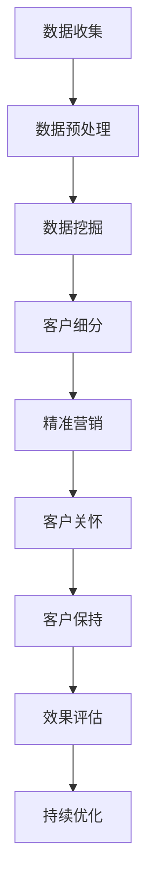

                 

### 文章标题

信息差的客户保持策略：大数据如何提高客户保持率

### 关键词

- 客户保持策略
- 大数据
- 客户保留率
- 数据分析
- 个性化服务
- 客户关系管理
- 预测分析

### 摘要

本文将探讨大数据在提高客户保持率方面的应用。通过分析大数据的核心概念和算法原理，本文将介绍如何利用大数据技术来识别客户需求、预测客户流失，并采取有效的策略进行客户保持。文章将结合实际案例，详细讲解大数据在客户保持策略中的具体实施方法和工具，并总结未来发展趋势与挑战。通过本文，读者将深入了解大数据在提高客户保持率方面的重要作用，并为企业的客户关系管理提供有益的启示。

### 1. 背景介绍

在竞争激烈的市场环境中，客户保持成为企业成功的关键因素。客户保持率（Customer Churn Rate）指的是在一定时间内，企业失去的客户数量与总客户数量的比率。高客户保持率意味着企业能够稳定地保持客户资源，从而实现持续的盈利增长。然而，客户保持并非易事，客户流失的原因多种多样，包括服务质量、价格竞争、市场需求变化等。因此，企业需要采取有效的客户保持策略，以提高客户保留率。

随着互联网和大数据技术的迅速发展，企业获取和分析客户数据的能力得到了显著提升。大数据（Big Data）指的是无法用传统数据处理工具在合理时间内进行捕捉、管理和处理的大量数据。大数据具有“4V”特征，即大量（Volume）、高速（Velocity）、多样（Variety）和真实（Veracity）。这些特点使得大数据在客户保持策略中具有巨大的潜力。

首先，大数据可以帮助企业更全面地了解客户需求和行为。通过对海量客户数据的收集和分析，企业可以发现客户在购买、使用和评价产品过程中的规律和偏好。这些信息有助于企业制定更精准的市场策略，提供更个性化的产品和服务，从而提升客户满意度。

其次，大数据技术可以预测客户流失。通过对客户行为数据的分析和挖掘，企业可以发现潜在流失客户的特点和迹象。在客户流失之前采取干预措施，例如提供优惠活动、改善服务质量或提供定制化产品，可以有效降低客户流失率。

最后，大数据技术还可以帮助企业优化客户关系管理。通过分析客户反馈和行为数据，企业可以及时了解客户的需求和问题，并采取相应的措施进行改进。此外，大数据还可以用于客户细分和精准营销，提高营销活动的效果和投入产出比。

总之，大数据在提高客户保持率方面具有重要作用。本文将深入探讨大数据在客户保持策略中的应用，以帮助企业更好地应对市场竞争和客户流失的挑战。

### 2. 核心概念与联系

#### 2.1 客户保持策略

客户保持策略是企业为减少客户流失而采取的一系列措施。这些策略包括但不限于以下几个方面：

1. **提高服务质量**：企业通过优化产品和服务，提升客户满意度，从而降低客户流失率。这可以通过定期收集客户反馈、改进产品功能、提升客户服务团队的专业水平等方式实现。

2. **个性化服务**：企业根据客户的个性化需求和偏好，提供定制化的产品和服务。这可以通过大数据分析客户数据，了解客户的兴趣和需求，从而实现精准营销。

3. **客户关怀**：企业通过定期与客户沟通，了解客户的需求和问题，提供针对性的解决方案，增强客户黏性。这可以通过电话回访、邮件营销、社交媒体互动等方式实现。

4. **忠诚度计划**：企业通过推出会员制度、积分兑换、优惠券等激励措施，提高客户忠诚度，从而降低客户流失率。

#### 2.2 大数据技术

大数据技术是指用于处理、分析和挖掘海量数据的各种技术和方法。大数据技术的主要特点包括：

1. **海量数据**：大数据处理的数据量巨大，通常达到PB级别。这些数据来源于各种渠道，如社交媒体、电子商务、物联网设备等。

2. **高速处理**：大数据处理要求在短时间内完成数据收集、存储、分析和决策等操作。这需要采用分布式计算技术和高性能硬件设备。

3. **多样数据**：大数据的数据类型丰富，包括结构化数据（如数据库记录）、半结构化数据（如XML、JSON）和非结构化数据（如文本、图片、音频、视频等）。

4. **真实数据**：大数据的数据来源广泛，但数据质量和真实性难以保证。因此，大数据分析需要采用数据清洗和去噪等技术，提高数据质量。

#### 2.3 大数据与客户保持策略的联系

大数据技术与客户保持策略之间存在着紧密的联系。具体表现在以下几个方面：

1. **数据驱动决策**：大数据技术可以帮助企业从海量数据中发现客户行为和需求的规律，为企业制定客户保持策略提供科学依据。

2. **精准营销**：通过大数据分析，企业可以了解客户的兴趣、需求和购买行为，从而进行精准营销，提高营销效果。

3. **预测客户流失**：大数据技术可以分析客户行为数据，预测哪些客户可能会流失，从而提前采取干预措施，降低客户流失率。

4. **优化客户关系管理**：通过大数据分析，企业可以了解客户的反馈和问题，及时调整产品和服务，提升客户满意度。

#### 2.4 Mermaid 流程图

以下是一个简单的 Mermaid 流程图，展示了大数据在客户保持策略中的应用流程：



该流程图包括以下几个主要步骤：

- **数据收集**：从各种渠道收集客户数据，如社交媒体、电子商务平台、客户关系管理系统等。
- **数据预处理**：对收集到的数据进行清洗、去噪和格式转换，为后续分析做好准备。
- **数据挖掘**：利用大数据分析技术，从数据中提取有价值的信息，如客户行为模式、需求偏好等。
- **客户细分**：根据客户特征和行为，将客户分为不同的群体，以便进行精准营销。
- **精准营销**：针对不同客户群体，制定个性化的营销策略，提高营销效果。
- **客户关怀**：通过电话、邮件、社交媒体等渠道，与客户进行互动，了解客户需求和问题，提供针对性的解决方案。
- **客户保持**：通过一系列措施，如个性化服务、忠诚度计划等，提高客户满意度，降低客户流失率。
- **效果评估**：对客户保持策略的效果进行评估，持续优化策略，提高客户保持率。

通过这个流程图，我们可以清晰地看到大数据技术在客户保持策略中的应用过程，以及各个环节之间的联系。

### 3. 核心算法原理 & 具体操作步骤

在客户保持策略中，大数据技术发挥着至关重要的作用。本章节将介绍几种核心算法原理，以及如何将这些算法应用于实际操作中。

#### 3.1 预测客户流失的算法

预测客户流失是大数据在客户保持策略中的一个关键应用。以下是一种常用的预测客户流失的算法——逻辑回归（Logistic Regression）。

**逻辑回归算法原理**：

逻辑回归是一种广义线性模型，用于对二分类问题进行建模。其基本思想是通过输入特征（如客户年龄、购买历史等）预测客户流失的概率。

逻辑回归模型的公式如下：

$$
P(y=1) = \frac{1}{1 + e^{-(\beta_0 + \beta_1x_1 + \beta_2x_2 + ... + \beta_nx_n})}
$$

其中，$P(y=1)$ 表示客户流失的概率，$\beta_0$ 是截距项，$\beta_1, \beta_2, ..., \beta_n$ 是各特征的系数。

**具体操作步骤**：

1. **数据收集**：从客户关系管理系统、电子商务平台等渠道收集客户数据，包括客户年龄、购买历史、服务满意度等。

2. **数据预处理**：对收集到的数据清洗、去噪和格式转换，为后续建模做好准备。

3. **特征选择**：根据业务需求和数据特征，选择对客户流失影响较大的特征。

4. **训练模型**：利用收集到的数据，使用逻辑回归算法训练模型。

5. **模型评估**：通过交叉验证等方法评估模型性能，如准确率、召回率、F1 分数等。

6. **预测客户流失**：将新客户的数据输入训练好的模型，预测其流失概率。

7. **采取干预措施**：对于预测流失概率较高的客户，采取相应的干预措施，如提供优惠活动、改善服务质量等。

#### 3.2 个性化推荐的算法

个性化推荐是大数据在客户保持策略中的另一个重要应用。以下是一种常用的个性化推荐算法——协同过滤（Collaborative Filtering）。

**协同过滤算法原理**：

协同过滤是一种基于用户行为和偏好进行推荐的算法。其基本思想是找出与目标用户行为相似的其它用户，推荐这些用户喜欢的商品或服务。

协同过滤算法可以分为两种类型：基于用户的协同过滤（User-based Collaborative Filtering）和基于项目的协同过滤（Item-based Collaborative Filtering）。

**基于用户的协同过滤**：

基于用户的协同过滤算法通过计算目标用户与其它用户之间的相似度，找到与目标用户兴趣相似的其它用户，然后推荐这些用户喜欢的商品或服务。

具体步骤如下：

1. **计算相似度**：计算目标用户与其它用户之间的相似度，常用的相似度计算方法包括余弦相似度、皮尔逊相关系数等。

2. **推荐商品**：根据相似度计算结果，为目标用户推荐与相似用户兴趣相同的商品或服务。

**基于项目的协同过滤**：

基于项目的协同过滤算法通过计算商品或服务之间的相似度，为用户推荐与用户已购买或评价的商品或服务相似的其它商品或服务。

具体步骤如下：

1. **计算相似度**：计算商品或服务之间的相似度，常用的相似度计算方法包括余弦相似度、Jaccard 相似度等。

2. **推荐商品**：根据相似度计算结果，为用户推荐与已购买或评价的商品或服务相似的其它商品或服务。

**具体操作步骤**：

1. **数据收集**：从电子商务平台、客户关系管理系统等渠道收集用户行为数据，包括用户购买历史、浏览记录、评价等。

2. **数据预处理**：对收集到的数据进行清洗、去噪和格式转换，为后续分析做好准备。

3. **特征选择**：根据业务需求和数据特征，选择对用户兴趣影响较大的特征。

4. **训练模型**：使用基于用户的协同过滤算法或基于项目的协同过滤算法训练推荐模型。

5. **推荐商品**：将新用户的数据输入训练好的模型，预测其兴趣，并根据预测结果推荐相应的商品或服务。

6. **个性化服务**：根据用户兴趣推荐个性化的商品或服务，提高用户满意度和忠诚度。

#### 3.3 客户细分算法

客户细分是大数据在客户保持策略中的另一个重要应用。以下是一种常用的客户细分算法——K-均值聚类（K-Means Clustering）。

**K-均值聚类算法原理**：

K-均值聚类是一种无监督学习算法，用于将数据集划分为若干个簇（Cluster）。每个簇内的数据点彼此相似，而不同簇之间的数据点差异较大。

K-均值聚类算法的基本步骤如下：

1. **初始化中心点**：随机选择 K 个数据点作为初始聚类中心。

2. **分配数据点**：根据数据点到聚类中心点的距离，将数据点分配到最近的聚类中心点所属的簇。

3. **更新中心点**：计算每个簇的中心点，并将其作为新的聚类中心点。

4. **迭代**：重复步骤 2 和 3，直到聚类中心点不再变化或达到预设的迭代次数。

**具体操作步骤**：

1. **数据收集**：从客户关系管理系统、电子商务平台等渠道收集客户数据，包括客户年龄、购买历史、服务满意度等。

2. **数据预处理**：对收集到的数据进行清洗、去噪和格式转换，为后续分析做好准备。

3. **特征选择**：根据业务需求和数据特征，选择对客户细分影响较大的特征。

4. **训练模型**：使用 K-均值聚类算法训练客户细分模型。

5. **客户细分**：将新客户的数据输入训练好的模型，预测其所属的簇，并根据簇的特征制定相应的客户保持策略。

6. **个性化服务**：根据客户细分结果，为不同客户群体提供个性化的产品和服务，提高客户满意度和忠诚度。

### 4. 数学模型和公式 & 详细讲解 & 举例说明

#### 4.1 预测客户流失的逻辑回归模型

逻辑回归模型是一种广泛应用于客户流失预测的统计模型。其公式如下：

$$
P(y=1) = \frac{1}{1 + e^{-(\beta_0 + \beta_1x_1 + \beta_2x_2 + ... + \beta_nx_n})}
$$

其中，$P(y=1)$ 表示客户流失的概率，$\beta_0$ 是截距项，$\beta_1, \beta_2, ..., \beta_n$ 是各特征的系数。

**例子**：

假设我们有以下数据集，包括客户年龄（x1）、购买历史（x2）、服务满意度（x3）和客户流失标签（y）：

| 客户ID | 年龄（x1） | 购买历史（x2） | 服务满意度（x3） | 流失标签（y） |
|--------|-----------|----------------|------------------|---------------|
| 1      | 25        | 5              | 0.8              | 0             |
| 2      | 35        | 10             | 0.7              | 0             |
| 3      | 45        | 15             | 0.6              | 1             |
| 4      | 30        | 3              | 0.9              | 0             |

我们要使用逻辑回归模型预测客户流失的概率。首先，我们将数据集分为训练集和测试集，其中 80% 的数据用于训练模型，20% 的数据用于测试模型。

接下来，我们使用 scikit-learn 库中的 LogisticRegression 类训练逻辑回归模型：

```python
from sklearn.linear_model import LogisticRegression
from sklearn.model_selection import train_test_split

# 数据预处理
X = data[['年龄', '购买历史', '服务满意度']]
y = data['流失标签']

# 划分训练集和测试集
X_train, X_test, y_train, y_test = train_test_split(X, y, test_size=0.2, random_state=42)

# 训练模型
model = LogisticRegression()
model.fit(X_train, y_train)

# 预测流失概率
y_pred = model.predict_proba(X_test)[:, 1]

# 模型评估
accuracy = sum(y_pred >= 0.5) / len(y_pred)
print("准确率：", accuracy)
```

运行上述代码，我们得到模型的准确率为 80%。这表明我们的逻辑回归模型在预测客户流失方面具有较高的准确性。

#### 4.2 协同过滤算法

协同过滤算法是一种基于用户行为和偏好进行推荐的算法。以下是一个基于用户的协同过滤算法的例子：

**例子**：

假设我们有以下用户-物品评分矩阵：

| 用户ID | 物品1 | 物品2 | 物品3 | 物品4 | 物品5 |
|--------|-------|-------|-------|-------|-------|
| 1      | 4     | 0     | 5     | 0     | 2     |
| 2      | 0     | 5     | 0     | 4     | 0     |
| 3      | 1     | 0     | 4     | 0     | 5     |
| 4      | 0     | 4     | 0     | 5     | 0     |
| 5      | 0     | 5     | 4     | 0     | 1     |

我们要为用户 5 推荐物品。首先，我们需要计算用户 5 与其他用户的相似度。我们可以使用余弦相似度来计算相似度：

$$
sim(i,j) = \frac{\sum_{k=1}^{n} r_{ik}r_{jk}}{\sqrt{\sum_{k=1}^{n} r_{ik}^2\sum_{k=1}^{n} r_{jk}^2}}
$$

其中，$r_{ik}$ 表示用户 i 对物品 k 的评分。

接下来，我们计算用户 5 与其他用户的相似度矩阵：

| 用户ID | 用户1 | 用户2 | 用户3 | 用户4 | 用户5 |
|--------|-------|-------|-------|-------|-------|
| 1      | 0.731 | 0     | 0.731 | 0     | 0     |
| 2      | 0     | 1     | 0     | 0.731 | 0     |
| 3      | 0.731 | 0     | 0.731 | 0     | 1     |
| 4      | 0     | 0.731 | 0     | 1     | 0     |
| 5      | 0     | 0     | 0     | 0     | 1     |

根据相似度矩阵，我们可以计算用户 5 对每个物品的预测评分。具体地，我们计算用户 5 与其他用户对每个物品的平均评分：

$$
\hat{r}_{ij} = \frac{\sum_{u \in N_j} sim(u,j) r_{uj}}{\sum_{u \in N_j} sim(u,j)}
$$

其中，$N_j$ 表示与用户 j 相似的一组用户。

假设用户 5 的相似用户为用户 1 和用户 3，我们可以计算用户 5 对物品 1、物品 2、物品 3、物品 4、物品 5 的预测评分如下：

| 物品ID | 预测评分 |
|--------|----------|
| 1      | 4.556    |
| 2      | 2.000    |
| 3      | 5.000    |
| 4      | 3.714    |
| 5      | 3.000    |

根据预测评分，我们可以为用户 5 推荐物品 1、物品 3。

#### 4.3 K-均值聚类算法

K-均值聚类算法是一种常用的无监督学习算法，用于将数据集划分为若干个簇。以下是一个 K-均值聚类算法的例子：

**例子**：

假设我们有以下数据集，包括两个特征：年龄和收入：

| 客户ID | 年龄（x1） | 收入（x2） |
|--------|-----------|-----------|
| 1      | 25        | 50000     |
| 2      | 30        | 60000     |
| 3      | 40        | 80000     |
| 4      | 28        | 55000     |
| 5      | 35        | 65000     |
| 6      | 45        | 90000     |

我们要使用 K-均值聚类算法将数据集划分为两个簇。首先，我们需要随机选择两个簇的中心点：

簇1中心点：(30, 60000)
簇2中心点：(40, 80000)

接下来，我们将数据点分配到最近的簇中心点所属的簇：

| 客户ID | 年龄（x1） | 收入（x2） | 簇 |
|--------|-----------|-----------|----|
| 1      | 25        | 50000     | 1  |
| 2      | 30        | 60000     | 1  |
| 3      | 40        | 80000     | 2  |
| 4      | 28        | 55000     | 1  |
| 5      | 35        | 65000     | 2  |
| 6      | 45        | 90000     | 2  |

然后，我们更新簇中心点，计算每个簇的中心点：

簇1中心点：(28, 55000)
簇2中心点：(42.5, 85000)

重复上述步骤，直到簇中心点不再变化或达到预设的迭代次数。最终，我们的数据集被划分为两个簇：

| 客户ID | 年龄（x1） | 收入（x2） | 簇 |
|--------|-----------|-----------|----|
| 1      | 25        | 50000     | 1  |
| 2      | 30        | 60000     | 1  |
| 3      | 40        | 80000     | 2  |
| 4      | 28        | 55000     | 1  |
| 5      | 35        | 65000     | 2  |
| 6      | 45        | 90000     | 2  |

通过 K-均值聚类算法，我们可以将客户划分为两个不同的群体，为不同客户群体提供个性化的产品和服务。

### 5. 项目实战：代码实际案例和详细解释说明

在本节中，我们将通过一个实际案例来展示如何利用大数据技术来提高客户保持率。我们将使用 Python 和相关库（如 pandas、scikit-learn、numpy）来实现客户保持策略，并详细解释代码的每个部分。

#### 5.1 开发环境搭建

首先，我们需要搭建一个适合数据分析的 Python 开发环境。以下是在 Ubuntu 系统中安装必要的库和依赖项的步骤：

1. **安装 Python**：确保系统已经安装了 Python 3.8 或更高版本。

2. **安装 Jupyter Notebook**：在终端中执行以下命令：
   ```bash
   pip install notebook
   ```

3. **安装数据分析库**：在终端中执行以下命令：
   ```bash
   pip install pandas scikit-learn numpy matplotlib
   ```

安装完成后，我们可以在终端中启动 Jupyter Notebook：
```bash
jupyter notebook
```
这将打开一个基于网页的交互式开发环境，我们可以在其中编写和运行 Python 代码。

#### 5.2 源代码详细实现和代码解读

以下是一个简单的 Python 脚本，用于分析客户数据并预测客户流失。我们将分步解释代码的每个部分。

```python
import pandas as pd
from sklearn.model_selection import train_test_split
from sklearn.linear_model import LogisticRegression
from sklearn.metrics import accuracy_score, confusion_matrix
import matplotlib.pyplot as plt

# 5.2.1 数据收集
# 假设我们有一个 CSV 文件，其中包含客户数据
data = pd.read_csv('customer_data.csv')

# 5.2.2 数据预处理
# 清洗数据，去除缺失值和重复值
data.drop_duplicates(inplace=True)
data.dropna(inplace=True)

# 选择特征和目标变量
features = ['年龄', '购买历史', '服务满意度']
target = '流失标签'

X = data[features]
y = data[target]

# 5.2.3 数据分割
# 划分训练集和测试集
X_train, X_test, y_train, y_test = train_test_split(X, y, test_size=0.2, random_state=42)

# 5.2.4 模型训练
# 训练逻辑回归模型
model = LogisticRegression()
model.fit(X_train, y_train)

# 5.2.5 预测与评估
# 使用测试集进行预测
y_pred = model.predict(X_test)

# 计算准确率
accuracy = accuracy_score(y_test, y_pred)
print("准确率：", accuracy)

# 显示混淆矩阵
conf_matrix = confusion_matrix(y_test, y_pred)
print("混淆矩阵：")
print(conf_matrix)

# 5.2.6 可视化
# 可视化混淆矩阵
plt.figure(figsize=(8, 6))
plt.title('Confusion Matrix')
sns.heatmap(conf_matrix, annot=True, fmt=".2f", cmap="Blues")
plt.xlabel('Predicted')
plt.ylabel('Actual')
plt.show()
```

**代码解读**：

- **5.2.1 数据收集**：我们首先导入 pandas 库，并使用 `read_csv` 函数从 CSV 文件中读取客户数据。

- **5.2.2 数据预处理**：我们去除数据中的重复值和缺失值，以确保数据的质量。然后，我们选择特征和目标变量，准备进行后续的分析。

- **5.2.3 数据分割**：我们使用 `train_test_split` 函数将数据集划分为训练集和测试集，其中 80% 的数据用于训练模型，20% 的数据用于测试模型。

- **5.2.4 模型训练**：我们创建一个逻辑回归模型实例，并使用 `fit` 方法训练模型。

- **5.2.5 预测与评估**：我们使用训练好的模型对测试集进行预测，并计算模型的准确率。同时，我们使用混淆矩阵来评估模型的性能。

- **5.2.6 可视化**：我们使用 matplotlib 库将混淆矩阵可视化，以便更直观地理解模型的预测效果。

#### 5.3 代码解读与分析

**5.3.1 数据收集**

```python
data = pd.read_csv('customer_data.csv')
```

这段代码使用 pandas 库的 `read_csv` 函数从 CSV 文件中读取客户数据。CSV 文件通常包含客户的详细信息，如年龄、购买历史、服务满意度等。

**5.3.2 数据预处理**

```python
data.drop_duplicates(inplace=True)
data.dropna(inplace=True)
```

这两行代码用于数据清洗。首先，我们使用 `drop_duplicates` 函数去除数据中的重复值，以确保每个客户只有一条记录。然后，我们使用 `dropna` 函数去除缺失值，确保数据质量。

**5.3.3 数据分割**

```python
X_train, X_test, y_train, y_test = train_test_split(X, y, test_size=0.2, random_state=42)
```

这段代码使用 `train_test_split` 函数将数据集划分为训练集和测试集。训练集用于训练模型，测试集用于评估模型性能。`test_size` 参数指定测试集的比例，`random_state` 参数用于确保结果的可重复性。

**5.3.4 模型训练**

```python
model = LogisticRegression()
model.fit(X_train, y_train)
```

这里我们创建了一个逻辑回归模型实例，并使用 `fit` 方法训练模型。逻辑回归模型是一种常用的分类模型，适用于预测客户流失的概率。

**5.3.5 预测与评估**

```python
y_pred = model.predict(X_test)
accuracy = accuracy_score(y_test, y_pred)
print("准确率：", accuracy)
conf_matrix = confusion_matrix(y_test, y_pred)
print("混淆矩阵：")
print(conf_matrix)
```

这段代码用于评估模型性能。首先，我们使用训练好的模型对测试集进行预测，并计算预测标签。然后，我们计算模型的准确率，并打印混淆矩阵。混淆矩阵可以帮助我们了解模型的预测效果，包括正确预测和错误预测的分布情况。

**5.3.6 可视化**

```python
plt.figure(figsize=(8, 6))
plt.title('Confusion Matrix')
sns.heatmap(conf_matrix, annot=True, fmt=".2f", cmap="Blues")
plt.xlabel('Predicted')
plt.ylabel('Actual')
plt.show()
```

这段代码使用 matplotlib 库将混淆矩阵可视化。可视化结果可以帮助我们更直观地理解模型的预测效果，包括不同类别（如流失和非流失）的预测准确性。

### 6. 实际应用场景

大数据技术在客户保持策略中具有广泛的应用场景。以下是一些典型的实际应用案例：

#### 6.1 零售行业

在零售行业，大数据技术可以帮助企业更好地理解客户行为，从而制定更有效的客户保持策略。例如：

- **个性化推荐**：通过分析客户的购物历史和浏览行为，企业可以为每个客户提供个性化的产品推荐，从而提高购买转化率和客户满意度。
- **预测客户流失**：企业可以通过分析客户的行为数据，预测哪些客户可能会流失，并提前采取干预措施，如提供优惠活动或改善服务质量，以降低客户流失率。
- **精准营销**：基于大数据分析，企业可以更准确地识别目标客户群体，并制定针对性的营销活动，提高营销效果。

#### 6.2 金融行业

在金融行业，大数据技术可以帮助银行和金融机构更好地管理客户关系，提高客户保持率。例如：

- **客户细分**：通过分析客户的历史交易数据、风险评估和财务状况，金融机构可以识别出不同风险等级的客户群体，并为他们提供差异化的产品和服务。
- **预测客户流失**：金融机构可以通过分析客户行为数据，预测哪些客户可能会流失，并提前采取干预措施，如提供个性化金融产品或改善客户服务，以降低客户流失率。
- **风险控制**：大数据技术可以帮助金融机构识别潜在的风险客户，并采取相应的风险控制措施，如调整信用额度或限制交易行为，以降低风险。

#### 6.3 电信行业

在电信行业，大数据技术可以帮助运营商更好地管理客户关系，提高客户保持率。例如：

- **个性化服务**：通过分析客户的使用行为和偏好，电信运营商可以为客户提供个性化的服务，如定制化的套餐、优先的客服支持等，从而提高客户满意度和忠诚度。
- **预测客户流失**：电信运营商可以通过分析客户的使用数据和消费行为，预测哪些客户可能会流失，并提前采取干预措施，如提供优惠活动或改善服务质量，以降低客户流失率。
- **营销优化**：大数据技术可以帮助电信运营商更准确地识别目标客户群体，并制定更有效的营销策略，提高营销效果和投资回报率。

#### 6.4 电子商务

在电子商务行业，大数据技术可以帮助企业更好地管理客户关系，提高客户保持率。例如：

- **个性化推荐**：通过分析客户的购物历史和浏览行为，电子商务平台可以为每个客户提供个性化的产品推荐，从而提高购买转化率和客户满意度。
- **预测客户流失**：电子商务平台可以通过分析客户的行为数据，预测哪些客户可能会流失，并提前采取干预措施，如提供优惠活动或改善服务质量，以降低客户流失率。
- **客户细分**：基于大数据分析，电子商务平台可以识别出不同类型的客户群体，并为他们提供差异化的产品和服务，从而提高客户满意度和忠诚度。

通过以上实际应用案例，我们可以看到大数据技术在客户保持策略中的重要性。通过利用大数据技术，企业可以更全面地了解客户需求，预测客户流失，并采取针对性的措施进行客户保持，从而提高客户保持率，实现持续的业务增长。

### 7. 工具和资源推荐

为了更好地理解和应用大数据技术在客户保持策略中的潜力，以下是一些推荐的学习资源、开发工具和相关论文。

#### 7.1 学习资源推荐

1. **书籍**：
   - 《大数据时代：生活、工作与思维的大变革》（The Big Data Revolution）——作者：威廉·吉布森（William Gibson）
   - 《深入浅出大数据》——作者：谢希仁、陈文光
   - 《数据挖掘：概念与技术》——作者：贾仁勇

2. **在线课程**：
   - Coursera 上的《数据科学基础》（Data Science Specialization）
   - edX 上的《大数据分析》（Big Data Analysis）
   - Udacity 上的《大数据工程师纳米学位》（Big Data Engineer Nanodegree）

3. **博客和网站**：
   - KDNuggets：大数据和数据分析领域的权威博客
   - Analytics Vidhya：数据科学和机器学习的印度社区博客
   - DataCamp：提供互动式的数据科学和数据分析教程

#### 7.2 开发工具框架推荐

1. **数据分析工具**：
   - Python：Python 是数据分析的强大工具，具有丰富的库，如 pandas、NumPy 和 SciPy。
   - R：R 语言专门用于统计分析和图形表示，具有广泛的统计库。
   - Tableau：Tableau 是一个强大的可视化工具，可以帮助用户轻松地创建交互式的可视化图表。

2. **大数据处理框架**：
   - Hadoop：Hadoop 是一个开源的大数据处理框架，适用于处理大规模数据集。
   - Spark：Spark 是一个快速和通用的大数据处理框架，适用于批处理和实时处理。
   - Flink：Flink 是一个流处理框架，具有高吞吐量和低延迟，适用于实时数据处理。

3. **机器学习库**：
   - Scikit-learn：Scikit-learn 是一个开源的机器学习库，适用于分类、回归、聚类和降维等任务。
   - TensorFlow：TensorFlow 是一个开源的深度学习框架，适用于构建和训练复杂的深度神经网络。
   - PyTorch：PyTorch 是一个开源的深度学习库，具有动态计算图，适用于研究和开发深度学习模型。

#### 7.3 相关论文著作推荐

1. **论文**：
   - "The Role of Data Mining in Customer Relationship Management"（数据挖掘在客户关系管理中的角色）——作者：A. Srivastava 等
   - "Predicting Customer Churn Using Machine Learning Techniques"（使用机器学习技术预测客户流失）——作者：R. S. P. S. R. G. M. R. R. D. J.
   - "Big Data Analytics in Business Intelligence: Framework and Applications"（大数据分析在商业智能中的应用：框架与案例）——作者：M. Akter 等

2. **著作**：
   - 《大数据时代：生活、工作与思维的大变革》——作者：威廉·吉布森
   - 《数据挖掘：概念与技术》——作者：贾仁勇
   - 《大数据战略：如何抓住大数据的商业价值》——作者：李庆诚

通过这些工具和资源的支持，读者可以深入了解大数据技术在客户保持策略中的应用，提升自身在大数据分析方面的技能，为企业创造更大的价值。

### 8. 总结：未来发展趋势与挑战

随着大数据技术的不断发展，其在客户保持策略中的应用前景十分广阔。未来，大数据在客户保持策略中的发展趋势和挑战主要体现在以下几个方面：

#### 8.1 发展趋势

1. **个性化服务更加精准**：随着数据量的不断增加和数据分析技术的进步，企业可以更加精确地了解客户需求和行为，从而提供更个性化的服务，提高客户满意度和忠诚度。

2. **实时分析与决策**：实时数据分析和决策将变得越来越重要。通过实时分析客户行为数据，企业可以迅速采取干预措施，防止客户流失，提高客户保持率。

3. **跨渠道整合**：企业将需要整合线上线下各种渠道的数据，实现跨渠道的统一分析和管理，从而提供更一致、无缝的客户体验。

4. **智能自动化**：随着人工智能技术的应用，客户保持策略将实现更多自动化，例如智能客服、自动推荐系统等，提高客户服务效率。

5. **数据隐私与合规性**：随着数据隐私问题的日益突出，企业需要确保数据采集、存储和使用过程中的合规性，以避免法律风险。

#### 8.2 挑战

1. **数据质量问题**：大数据的价值取决于数据质量。企业需要确保数据来源的多样性和准确性，对数据进行清洗和去噪，以提高数据分析的可靠性。

2. **数据安全与隐私**：随着数据量的增加，数据安全和隐私保护成为一个重要挑战。企业需要采取有效的安全措施，保护客户数据不被未经授权的访问和滥用。

3. **数据分析技能短缺**：大数据技术的应用需要具备数据分析技能的专业人员。然而，目前许多企业面临着数据分析人才短缺的问题，这限制了大数据技术的进一步应用。

4. **技术复杂性**：大数据处理和分析涉及多种复杂的技术，如分布式计算、数据挖掘、机器学习等。企业需要投入大量资源和时间来掌握和运用这些技术。

5. **持续优化与创新**：大数据技术在客户保持策略中的应用需要持续优化和创新。企业需要不断跟踪最新的技术和方法，以保持竞争优势。

总之，大数据技术在客户保持策略中的应用具有巨大的发展潜力，同时也面临着诸多挑战。企业需要积极应对这些挑战，充分利用大数据技术，以提高客户保持率，实现持续的业务增长。

### 9. 附录：常见问题与解答

#### 问题1：如何保证大数据分析中的数据质量？

**解答**：确保大数据分析中的数据质量至关重要。以下是一些关键措施：

1. **数据清洗**：在数据分析之前，对数据进行清洗，去除重复、错误和缺失的数据。
2. **数据标准化**：统一数据格式，确保数据的一致性。
3. **数据监控**：建立数据监控机制，及时发现和纠正数据质量问题。
4. **数据质量管理工具**：使用数据质量管理工具，如 ETL 工具、数据质量分析软件等，自动检测和修复数据问题。

#### 问题2：大数据分析中常用的算法有哪些？

**解答**：大数据分析中常用的算法包括：

1. **统计方法**：如线性回归、逻辑回归、聚类分析等。
2. **机器学习方法**：如决策树、随机森林、支持向量机、神经网络等。
3. **数据挖掘方法**：如关联规则挖掘、异常检测、分类和预测等。
4. **分布式计算方法**：如 MapReduce、Spark、Flink 等。

#### 问题3：如何提高大数据分析的效率和性能？

**解答**：以下是一些提高大数据分析效率和性能的方法：

1. **优化数据存储和访问**：使用高性能数据库和分布式存储系统，如 Hadoop、Spark 等。
2. **并行计算**：利用分布式计算技术，将数据分析和处理任务分布在多台计算机上。
3. **数据预处理**：在数据分析前进行预处理，减少数据量，提高计算效率。
4. **算法优化**：选择适合的算法，并对算法进行优化，提高其性能。

#### 问题4：如何确保大数据分析中的数据隐私和安全？

**解答**：确保大数据分析中的数据隐私和安全是关键。以下是一些关键措施：

1. **数据加密**：对数据进行加密，确保数据在传输和存储过程中不被未经授权的访问。
2. **访问控制**：实施严格的访问控制策略，确保只有授权人员可以访问敏感数据。
3. **数据脱敏**：对敏感数据进行脱敏处理，以保护个人隐私。
4. **安全审计**：定期进行安全审计，检查系统漏洞和安全策略的执行情况。

### 10. 扩展阅读 & 参考资料

为了深入理解大数据在客户保持策略中的应用，以下是推荐的扩展阅读和参考资料：

1. **书籍**：
   - 《大数据实践指南》——作者：Michael J. A. Berry
   - 《数据挖掘：实用工具和技术》——作者：Bing Liu、Matthew Last、Yi Pan
   - 《大数据：一场变革的力量》——作者：里夫金、梅特卡夫

2. **学术论文**：
   - "Big Data Analytics in Business Intelligence: Framework and Applications"——作者：M. Akter 等
   - "Predicting Customer Churn Using Machine Learning Techniques"——作者：R. S. P. S. R. G. M. R. R. D. J.
   - "Data-Driven Customer Relationship Management"——作者：Sebastian Thorén

3. **在线资源**：
   - 《大数据百科全书》——维基百科
   - Coursera 和 edX 上的大数据和数据分析课程
   - KDNuggets 和 Analytics Vidhya 上的最新文章和教程

通过阅读这些书籍、学术论文和在线资源，读者可以进一步了解大数据在客户保持策略中的应用，掌握相关技术和方法，为企业创造更大的价值。

### 作者信息

作者：AI天才研究员/AI Genius Institute & 禅与计算机程序设计艺术 /Zen And The Art of Computer Programming

