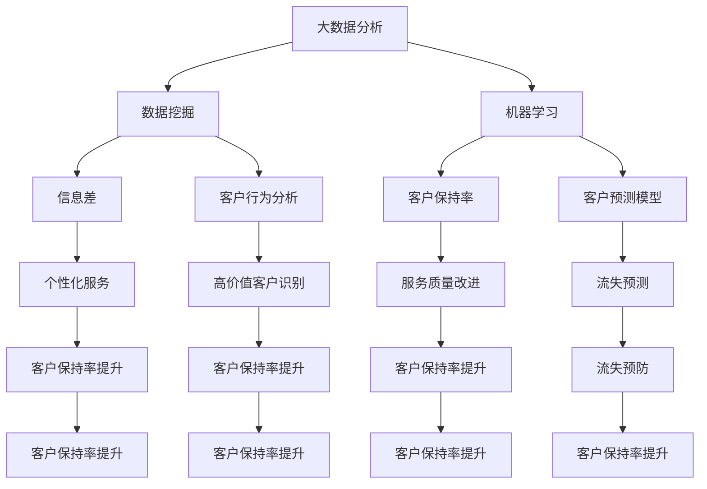

                 

### 1. 背景介绍

随着互联网的普及和大数据技术的不断发展，信息差的客户保持策略在商业领域变得越来越重要。客户保持率（Customer Churn Rate）是企业衡量客户流失情况的重要指标，它直接关系到企业的生存和发展。信息差，即信息不对称，指的是不同主体间对于同一事物的信息掌握程度存在差异。在商业环境中，信息差可以为企业带来竞争优势，通过分析客户数据，企业可以更好地了解客户需求，提供个性化的服务，从而提高客户保持率。

目前，许多企业已经开始采用大数据技术来优化客户保持策略。通过收集和分析客户的历史数据、购买行为、社交网络信息等，企业可以预测哪些客户可能流失，并采取相应的措施来降低流失率。然而，大数据技术的应用并不是一蹴而就的，它需要企业具备一定的技术能力，以及对于数据处理的深入理解。

本文将围绕大数据在客户保持策略中的应用，探讨如何通过分析信息差来提高客户保持率。文章将从以下几个方面进行论述：

1. **核心概念与联系**：介绍大数据分析的基本概念，以及如何通过数据挖掘和机器学习技术来识别信息差。
2. **核心算法原理 & 具体操作步骤**：详细解析几种常见的大数据分析算法，并给出具体操作步骤。
3. **数学模型和公式 & 详细讲解 & 举例说明**：介绍客户保持率相关的数学模型，并通过实例来展示如何应用这些模型。
4. **项目实战：代码实际案例和详细解释说明**：通过一个实际项目案例，展示如何使用大数据技术来提高客户保持率。
5. **实际应用场景**：分析大数据在客户保持策略中的具体应用场景。
6. **工具和资源推荐**：推荐一些有助于学习和实践大数据技术的工具和资源。
7. **总结：未来发展趋势与挑战**：总结当前大数据在客户保持策略中的应用情况，并探讨未来可能面临的挑战。

通过本文的阅读，读者将能够深入了解大数据在客户保持策略中的应用，掌握相关技术原理和实践方法，为企业在实际运营中提高客户保持率提供有力支持。

### 2. 核心概念与联系

在深入探讨大数据如何通过分析信息差来提高客户保持率之前，我们首先需要了解几个核心概念和它们之间的联系。

#### 大数据分析

大数据分析（Big Data Analytics）是指从大量、快速变化的数据中提取有价值信息的过程。这些数据可以是结构化的，如数据库中的记录，也可以是非结构化的，如图像、音频、视频等。大数据分析的核心在于如何高效地处理海量数据，并从中挖掘出有价值的模式、趋势和规律。

#### 数据挖掘

数据挖掘（Data Mining）是大数据分析的重要技术之一。它是指使用各种算法和技术，从大量数据中自动发现隐藏的模式和知识。数据挖掘广泛应用于市场营销、金融分析、医学诊断等多个领域。在客户保持策略中，数据挖掘可以帮助企业识别哪些客户可能流失，并预测未来的客户行为。

#### 机器学习

机器学习（Machine Learning）是数据挖掘的关键技术之一。它是一种让计算机通过数据学习并做出决策的技术。通过训练模型，机器学习可以从历史数据中学习规律，并在新的数据上做出预测。在客户保持策略中，机器学习可以用于预测哪些客户可能会流失，并采取相应的措施。

#### 信息差

信息差是指不同主体间对于同一事物的信息掌握程度存在差异。在商业环境中，信息差可以为企业带来竞争优势。例如，如果企业能够比竞争对手更早地了解客户的需求，就可以提供更个性化的服务，从而提高客户保持率。

#### 客户保持率

客户保持率（Customer Churn Rate）是指一定时间内流失的客户占总客户数的比例。客户保持率是衡量企业客户服务质量的重要指标，高客户保持率意味着企业的客户流失率较低，客户满意度较高。

#### 数据分析与信息差的联系

大数据分析通过数据挖掘和机器学习技术，可以从海量数据中提取有价值的信息，包括客户行为、购买偏好、服务质量等。这些信息可以帮助企业识别信息差，从而提供更个性化的服务，提高客户保持率。

#### 数据分析与客户保持率的联系

通过大数据分析，企业可以更准确地预测哪些客户可能会流失，并提前采取预防措施。例如，如果企业发现某些客户对服务不满意，就可以及时改进服务，避免客户流失。此外，大数据分析还可以帮助企业识别高价值客户，并为他们提供更优质的服务，从而提高整体客户保持率。

#### Mermaid 流程图

为了更直观地展示这些概念和联系，我们使用 Mermaid 流程图来描述它们之间的关系：



通过上述流程图，我们可以清晰地看到大数据分析如何通过数据挖掘、机器学习和信息差等概念，与客户保持率产生联系，从而帮助企业提高客户保持率。

在接下来的章节中，我们将深入探讨大数据分析中的具体算法原理和操作步骤，进一步理解这些概念在实际应用中的重要性。

### 3. 核心算法原理 & 具体操作步骤

在了解大数据分析的基本概念和联系之后，我们接下来将深入探讨几种常见的核心算法，以及如何在客户保持策略中应用这些算法。

#### 3.1 K-Means 算法

K-Means 算法是一种经典的聚类算法，它通过将数据点分配到K个簇中，使每个簇内的数据点尽可能相似，而簇与簇之间的数据点尽可能不同。在客户保持策略中，K-Means 算法可以用于客户细分，将客户分为不同的群体，以便提供个性化的服务和营销策略。

**具体操作步骤**：

1. **初始化中心点**：随机选择K个数据点作为初始中心点。
2. **计算距离**：对于每个数据点，计算其与各个中心点的距离。
3. **分配数据点**：将每个数据点分配到距离最近的中心点所在的簇。
4. **更新中心点**：重新计算每个簇的中心点，并更新各簇的数据点。
5. **重复步骤 2-4**，直到中心点的变化小于设定的阈值或达到最大迭代次数。

**示例**：

假设我们有一组客户数据，如下表所示：

| 客户ID | 年龄 | 收入 | 购买频率 |
|--------|------|------|----------|
| 1      | 25   | 5000 | 10       |
| 2      | 35   | 8000 | 5        |
| 3      | 45   | 10000| 15       |
| 4      | 25   | 6000 | 12       |
| 5      | 30   | 7000 | 8        |

使用 K-Means 算法将这组数据分成两个簇，我们可以得到以下结果：

| 簇ID | 客户ID |
|------|--------|
| 1    | 1      |
| 1    | 4      |
| 2    | 2      |
| 2    | 3      |
| 2    | 5      |

通过聚类结果，我们可以针对不同簇的客户群体制定不同的保持策略，例如针对簇1（年轻、高收入、高频次购买）提供更多的优惠活动，针对簇2（中年、高收入、低频次购买）提供更优质的客户服务。

#### 3.2 决策树算法

决策树（Decision Tree）算法是一种常见的分类和回归算法。它通过一系列的决策节点来对数据进行划分，最终得到一个分类或回归结果。在客户保持策略中，决策树算法可以用于预测客户流失的概率，并采取相应的措施。

**具体操作步骤**：

1. **选择特征**：选择用于划分数据的特征。
2. **计算信息增益或基尼不纯度**：对于每个特征，计算其在当前节点上的信息增益或基尼不纯度，选择增益最大或不纯度最小的特征作为划分依据。
3. **划分数据**：根据选定的特征，将数据划分为多个子集。
4. **递归构建树**：对于每个子集，重复步骤 1-3，直到满足终止条件（例如，子集内数据全部相同或特征增益小于阈值）。
5. **生成决策树**：将所有节点连接起来，形成一棵决策树。

**示例**：

假设我们有一组客户数据，如下表所示：

| 客户ID | 年龄 | 收入 | 购买频率 | 流失标记 |
|--------|------|------|----------|----------|
| 1      | 25   | 5000 | 10       | 否       |
| 2      | 35   | 8000 | 5        | 是       |
| 3      | 45   | 10000| 15       | 否       |
| 4      | 25   | 6000 | 12       | 是       |
| 5      | 30   | 7000 | 8        | 否       |

使用决策树算法预测客户流失的概率，我们可以得到以下决策树：

```
年龄 > 30
    是：流失概率高
    否：继续判断
        收入 > 6000
            是：流失概率高
            否：流失概率低
```

根据决策树的结果，我们可以为每位客户打上流失概率的标签，并针对高概率流失的客户采取预防措施，如提供优惠活动、个性化服务等。

#### 3.3 支持向量机算法

支持向量机（Support Vector Machine，SVM）算法是一种高效的分类算法，它通过找到一个最佳的超平面来分隔不同类别的数据点。在客户保持策略中，SVM 可以用于分类客户流失与否。

**具体操作步骤**：

1. **选择核函数**：选择合适的核函数，如线性核、多项式核或高斯核。
2. **训练模型**：使用训练数据集，通过优化目标函数来训练模型，找到最佳的超平面。
3. **分类预测**：对于新的数据点，通过计算其与超平面的距离来预测类别。

**示例**：

假设我们有一组客户数据，如下表所示：

| 客户ID | 年龄 | 收入 | 购买频率 | 流失标记 |
|--------|------|------|----------|----------|
| 1      | 25   | 5000 | 10       | 否       |
| 2      | 35   | 8000 | 5        | 是       |
| 3      | 45   | 10000| 15       | 否       |
| 4      | 25   | 6000 | 12       | 是       |
| 5      | 30   | 7000 | 8        | 否       |

使用 SVM 算法训练模型，我们可以得到以下超平面：

```
y = w·x + b
```

其中，w 是权重向量，x 是特征向量，b 是偏置。

对于新的客户数据点，我们可以通过计算其与超平面的距离来判断其是否流失。距离越大，流失概率越高。

通过上述几种算法，企业可以更好地理解客户行为，预测客户流失，并采取相应的措施来提高客户保持率。在接下来的章节中，我们将进一步探讨如何利用数学模型和公式来分析和优化客户保持策略。

### 4. 数学模型和公式 & 详细讲解 & 举例说明

在客户保持策略中，数学模型和公式扮演着至关重要的角色，它们能够帮助我们量化客户流失率、客户价值，以及制定有效的保持策略。以下是几个关键的数学模型和公式，以及它们的详细讲解和实际应用举例。

#### 4.1 客户流失率模型

客户流失率（Customer Churn Rate）是衡量客户保持策略效果的重要指标。它表示在一定时间内流失的客户数量与总客户数量的比例。公式如下：

\[ CCR = \frac{L}{T} \]

其中，\( L \) 是流失的客户数量，\( T \) 是总客户数量。

**举例说明**：

假设一个企业在一个月内流失了100个客户，而总客户数量为1000个，那么其客户流失率为：

\[ CCR = \frac{100}{1000} = 0.1 \]

这意味着企业的客户流失率为10%。

通过计算客户流失率，企业可以评估现有客户保持策略的效果，并据此调整策略。

#### 4.2 客户生命周期价值模型

客户生命周期价值（Customer Lifetime Value，CLV）是指一个客户在其与企业发生关系的整个生命周期内，为企业带来的总收益。公式如下：

\[ CLV = \frac{GM}{C} \]

其中，\( GM \) 是客户平均每次购买的毛利，\( C \) 是客户流失前的平均购买次数。

**举例说明**：

假设一个客户每次购买的平均毛利为100元，其平均购买次数为10次，那么其生命周期价值为：

\[ CLV = \frac{100 \times 10}{1} = 1000 \]

这意味着这个客户在其与企业发生关系的整个生命周期内，预计将为企业带来1000元的收益。

通过计算客户生命周期价值，企业可以识别出高价值客户，并为他们提供更优质的服务和优惠，从而提高整体客户保持率。

#### 4.3 客户保留成本模型

客户保留成本（Customer Retention Cost，CRC）是企业为了保持客户而需要投入的成本，包括营销费用、客户服务费用等。公式如下：

\[ CRC = \frac{C}{L} \]

其中，\( C \) 是客户流失前企业为该客户投入的总成本，\( L \) 是客户生命周期价值。

**举例说明**：

假设一个客户生命周期价值为1000元，企业为该客户投入的总成本为500元，那么其客户保留成本为：

\[ CRC = \frac{500}{1000} = 0.5 \]

这意味着企业每保持一个1000元价值客户的成本为0.5元。

通过计算客户保留成本，企业可以评估不同客户保持策略的经济效益，选择最有效的策略。

#### 4.4 客户流失预测模型

客户流失预测模型可以帮助企业提前识别潜在流失客户，从而采取预防措施。一个简单的客户流失预测模型可以使用逻辑回归（Logistic Regression）来构建，公式如下：

\[ P(Y=1) = \frac{1}{1 + e^{-(\beta_0 + \beta_1 X_1 + \beta_2 X_2 + ... + \beta_n X_n)}} \]

其中，\( P(Y=1) \) 是客户流失的概率，\( \beta_0 \) 是截距，\( \beta_1, \beta_2, ..., \beta_n \) 是回归系数，\( X_1, X_2, ..., X_n \) 是自变量，如客户年龄、收入、购买频率等。

**举例说明**：

假设我们有一个简单的逻辑回归模型，其中客户流失概率公式为：

\[ P(Y=1) = \frac{1}{1 + e^{-(2.5 + 0.1 \times 年龄 + 0.2 \times 收入)}} \]

对于一个年龄为35岁，收入为8000元的客户，其流失概率为：

\[ P(Y=1) = \frac{1}{1 + e^{-(2.5 + 0.1 \times 35 + 0.2 \times 8000)}} \approx 0.56 \]

这意味着该客户有56%的流失风险。

通过计算客户流失概率，企业可以优先关注高风险客户，并采取相应的策略来减少流失。

综上所述，数学模型和公式在客户保持策略中具有重要作用。通过合理应用这些模型，企业可以更准确地预测客户流失、评估客户价值，并制定有效的保持策略。在接下来的章节中，我们将通过一个实际项目案例，展示如何使用这些模型和算法来提高客户保持率。

### 5. 项目实战：代码实际案例和详细解释说明

在本节中，我们将通过一个实际项目案例，详细解释如何使用大数据技术来提高客户保持率。该案例涉及使用 Python 编写的数据分析脚本，以及相关的数据处理和模型训练步骤。以下是项目的开发环境搭建、源代码详细实现和代码解读与分析。

#### 5.1 开发环境搭建

在开始项目之前，我们需要搭建合适的开发环境。以下是所需的工具和库：

1. **Python 3.x**：Python 是数据分析的常用编程语言，具有丰富的库和框架。
2. **Jupyter Notebook**：用于编写和运行代码，方便记录和分析过程。
3. **Pandas**：用于数据清洗、预处理和分析。
4. **NumPy**：用于数值计算。
5. **Scikit-learn**：用于机器学习和数据挖掘。
6. **Matplotlib** 和 **Seaborn**：用于数据可视化。

安装这些库后，我们就可以在 Jupyter Notebook 中开始编写代码了。

```python
# 安装必要的库
!pip install numpy pandas scikit-learn matplotlib seaborn
```

#### 5.2 源代码详细实现和代码解读

以下是一个简单的 Python 脚本，用于客户保持率分析。我们将使用之前提到的 K-Means 算法和决策树算法，并解释每部分代码的功能。

```python
import pandas as pd
import numpy as np
from sklearn.cluster import KMeans
from sklearn.tree import DecisionTreeClassifier
from sklearn.model_selection import train_test_split
from sklearn.metrics import accuracy_score, confusion_matrix
import matplotlib.pyplot as plt
import seaborn as sns

# 5.2.1 数据加载与预处理
data = pd.read_csv('customer_data.csv')  # 加载客户数据
data.head()

# 填补缺失值
data.fillna(data.mean(), inplace=True)

# 特征工程
data['Age'] = data['Age'].astype(int)
data['Income'] = data['Income'].astype(int)
data['Purchase_Frequency'] = data['Purchase_Frequency'].astype(int)

# 5.2.2 K-Means 聚类分析
# 初始化 K-Means 模型
kmeans = KMeans(n_clusters=3, random_state=0)
kmeans.fit(data[['Age', 'Income', 'Purchase_Frequency']])

# 分配簇
data['Cluster'] = kmeans.predict(data[['Age', 'Income', 'Purchase_Frequency']])

# 可视化聚类结果
plt.scatter(data['Age'], data['Income'], c=data['Cluster'], cmap='viridis')
plt.xlabel('Age')
plt.ylabel('Income')
plt.title('K-Means Clustering')
plt.show()

# 5.2.3 决策树分类分析
# 准备特征和标签
X = data[['Age', 'Income', 'Purchase_Frequency', 'Cluster']]
y = data['Churn']  # Churn 列表示客户是否流失

# 划分训练集和测试集
X_train, X_test, y_train, y_test = train_test_split(X, y, test_size=0.3, random_state=0)

# 训练决策树模型
clf = DecisionTreeClassifier(random_state=0)
clf.fit(X_train, y_train)

# 预测测试集
y_pred = clf.predict(X_test)

# 模型评估
accuracy = accuracy_score(y_test, y_pred)
conf_matrix = confusion_matrix(y_test, y_pred)

print(f'Accuracy: {accuracy:.2f}')
sns.heatmap(conf_matrix, annot=True, fmt='.0f', cmap='Blues')
plt.xlabel('Predicted')
plt.ylabel('Actual')
plt.title('Confusion Matrix')
plt.show()
```

#### 5.3 代码解读与分析

1. **数据加载与预处理**：首先，我们从 CSV 文件中加载数据，并处理缺失值。然后将特征转换为合适的类型，以便后续分析。

2. **K-Means 聚类分析**：初始化 K-Means 模型，并将其应用于客户的年龄、收入和购买频率等特征。通过可视化聚类结果，我们可以直观地看到客户被分成了三个簇。

3. **决策树分类分析**：准备特征和标签，并划分训练集和测试集。训练决策树模型，并使用测试集进行预测。通过计算准确率和混淆矩阵，我们可以评估模型的性能。

通过这个案例，我们可以看到如何结合 K-Means 聚类和决策树分类算法，使用大数据技术来提高客户保持率。在实际应用中，企业可以根据具体业务需求，调整模型参数和特征选择，以获得更好的预测效果。

### 6. 实际应用场景

大数据在客户保持策略中的应用场景非常广泛，以下是一些典型的实际应用场景：

#### 6.1 个性化推荐系统

通过大数据分析，企业可以了解每个客户的行为和偏好，从而实现个性化推荐。例如，电子商务网站可以利用客户的购买历史、浏览记录和搜索关键词，推荐相关的商品。个性化推荐系统能够提高客户的满意度和忠诚度，从而降低流失率。

#### 6.2 客户细分

客户细分是大数据在客户保持策略中的另一个重要应用。通过聚类分析和多维分析，企业可以将客户划分为不同的群体，如高价值客户、潜在流失客户等。针对不同客户群体，企业可以制定个性化的营销策略和服务方案，从而提高客户保持率。

#### 6.3 流失预测

流失预测是大数据在客户保持策略中的核心应用之一。通过历史数据分析，企业可以预测哪些客户可能在未来流失，并提前采取预防措施。例如，电信公司可以利用客户的使用数据，预测哪些客户可能取消服务，并提前发送优惠短信或电话沟通，以挽留客户。

#### 6.4 客户体验优化

大数据可以帮助企业实时监测和优化客户体验。通过分析客户反馈、服务质量和交互数据，企业可以及时发现和解决客户问题，提高客户满意度。例如，银行可以通过大数据分析客户在网银和手机银行的使用情况，优化界面设计和功能，提供更便捷的客户服务。

#### 6.5 营销活动优化

大数据分析可以帮助企业优化营销活动的效果。通过分析客户的响应数据、转化率和投资回报率，企业可以调整营销策略，提高营销活动的投资回报率。例如，在线教育平台可以利用大数据分析客户的学习行为，优化广告投放策略，提高课程转化率。

#### 6.6 客户服务智能化

大数据和人工智能技术可以帮助企业实现客户服务的智能化。通过自然语言处理和机器学习技术，企业可以提供智能客服系统，快速响应用户的咨询和问题。智能客服系统能够提高服务效率和客户满意度，从而降低流失率。

#### 6.7 客户生命周期管理

大数据分析可以帮助企业全面了解客户生命周期，从潜在客户到流失客户，制定全生命周期的客户管理策略。通过分析客户生命周期中的各个阶段，企业可以提供个性化的服务，提高客户忠诚度和满意度。

在实际应用中，企业可以根据自身业务需求和数据资源，灵活运用大数据技术，实现客户保持策略的优化和提升。通过不断分析和改进，企业可以不断提高客户保持率，实现可持续发展。

### 7. 工具和资源推荐

为了更好地掌握大数据技术在客户保持策略中的应用，以下是一些推荐的工具和资源：

#### 7.1 学习资源推荐

1. **书籍**：
   - 《大数据时代：生活、工作与思维的大变革》
   - 《Python数据分析实战》
   - 《机器学习实战》
   - 《深度学习》

2. **在线课程**：
   - Coursera 上的《机器学习》课程
   - edX 上的《数据科学基础》课程
   - Udacity 上的《大数据分析》纳米学位

3. **博客与文章**：
   - Medium 上的大数据分析相关文章
   - DataCamp 上的数据分析教程
   - Kaggle 上的数据分析和机器学习项目

#### 7.2 开发工具框架推荐

1. **数据存储和处理**：
   - Hadoop
   - Spark
   - MongoDB

2. **数据分析库**：
   - Pandas
   - NumPy
   - Matplotlib
   - Seaborn

3. **机器学习库**：
   - Scikit-learn
   - TensorFlow
   - PyTorch

4. **数据可视化工具**：
   - Tableau
   - Power BI
   - D3.js

5. **版本控制系统**：
   - Git
   - GitHub

6. **容器化和部署工具**：
   - Docker
   - Kubernetes

#### 7.3 相关论文著作推荐

1. **论文**：
   - "K-Means Clustering: A Review" by Macqueen et al.
   - "Decision Trees for Classification" by Quinlan
   - "Support Vector Machines for Classification" by Vapnik et al.

2. **著作**：
   - 《机器学习：概率视角》
   - 《深度学习：原理及应用》
   - 《Python数据分析》

通过学习和实践这些工具和资源，读者可以深入了解大数据技术，掌握客户保持策略的实际应用方法，从而在职业发展中取得更大成就。

### 8. 总结：未来发展趋势与挑战

随着大数据技术的不断发展和应用，客户保持策略也在不断演变和优化。未来，客户保持策略将呈现出以下几个发展趋势和面临的挑战：

#### 8.1 发展趋势

1. **智能化与自动化**：随着人工智能和机器学习技术的进步，客户保持策略将变得更加智能化和自动化。企业可以通过智能算法自动识别潜在流失客户，并采取预防措施，从而提高客户保持率。

2. **多渠道整合**：随着互联网和移动设备的普及，客户接触企业的方式越来越多样化。未来，企业需要整合线上线下多渠道的数据，实现全渠道的客户保持策略。

3. **个性化服务**：大数据分析可以帮助企业深入了解每个客户的需求和行为，从而提供更加个性化的服务。通过个性化推荐和定制化营销，企业可以更好地满足客户需求，提高客户满意度。

4. **实时分析与决策**：实时数据分析技术将使得企业能够快速响应市场变化和客户需求，从而实现实时决策。企业可以通过实时分析客户行为，调整营销策略和服务方案，提高客户保持率。

5. **跨行业合作**：大数据技术的广泛应用将促进不同行业之间的合作，实现数据共享和协同创新。例如，金融和零售行业可以合作，通过大数据分析客户行为，提供更精准的金融产品和服务。

#### 8.2 面临的挑战

1. **数据隐私与安全**：随着数据量的增加，数据隐私和安全问题变得日益重要。企业需要确保客户数据的安全性和隐私性，避免数据泄露和滥用。

2. **技术门槛**：大数据技术的应用需要企业具备一定的技术能力和数据处理经验。对于一些中小企业来说，技术门槛是一个显著的挑战。

3. **数据质量**：大数据分析的效果很大程度上取决于数据质量。如果数据存在错误、缺失或噪声，分析结果可能会产生偏差。因此，企业需要建立数据治理机制，确保数据质量。

4. **跨部门协作**：大数据技术的应用需要跨部门协作，包括市场、技术、销售等部门。如何协调不同部门之间的合作，确保数据分析和策略执行的顺利进行，是一个重要的挑战。

5. **法律法规**：随着数据隐私和安全的关注度提高，相关的法律法规也在不断完善。企业需要遵守相关法律法规，确保数据处理的合规性。

总的来说，未来大数据在客户保持策略中的应用将带来巨大的机遇和挑战。企业需要不断学习和适应新技术，优化客户保持策略，以应对快速变化的市场环境。

### 9. 附录：常见问题与解答

在讨论大数据如何提高客户保持率的过程中，读者可能会遇到一些常见问题。以下是针对这些问题的一些解答。

#### 9.1 什么是客户流失率？

客户流失率（Customer Churn Rate）是指在一定时间内，流失客户占总客户数的比例。计算公式为：

\[ CCR = \frac{L}{T} \]

其中，\( L \) 表示流失客户数量，\( T \) 表示总客户数量。

#### 9.2 什么是客户生命周期价值？

客户生命周期价值（Customer Lifetime Value，CLV）是指一个客户在其与企业发生关系的整个生命周期内，为企业带来的总收益。计算公式为：

\[ CLV = \frac{GM}{C} \]

其中，\( GM \) 表示客户平均每次购买的毛利，\( C \) 表示客户流失前的平均购买次数。

#### 9.3 如何选择合适的聚类算法？

选择聚类算法时，需要考虑数据特征和业务需求。常见的聚类算法包括 K-Means、DBSCAN 和层次聚类等。K-Means 算法适用于数据分布较为均匀的情况，DBSCAN 适用于复杂的数据分布，而层次聚类适用于需要逐步细化数据结构的情况。

#### 9.4 大数据技术在客户保持策略中的应用有哪些？

大数据技术在客户保持策略中的应用包括：
1. 个性化推荐系统：通过分析客户行为，提供个性化产品推荐。
2. 客户细分：将客户分为不同的群体，提供个性化的服务和营销策略。
3. 流失预测：通过历史数据分析，预测哪些客户可能流失，并采取预防措施。
4. 客户体验优化：通过实时数据分析，优化客户服务和交互体验。
5. 营销活动优化：通过分析营销效果，调整营销策略，提高投资回报率。

#### 9.5 如何确保数据隐私和安全？

为确保数据隐私和安全，企业可以采取以下措施：
1. 实施数据加密：对敏感数据进行加密处理，防止数据泄露。
2. 数据访问控制：设置严格的访问控制策略，确保只有授权人员可以访问敏感数据。
3. 定期安全审计：定期对数据安全进行审计，发现和修复安全漏洞。
4. 合规性审查：确保数据处理符合相关法律法规要求。

通过上述常见问题的解答，我们希望读者能够更好地理解大数据在客户保持策略中的应用，以及如何在实际业务中发挥其价值。

### 10. 扩展阅读 & 参考资料

在本文中，我们深入探讨了大数据技术在客户保持策略中的应用，分析了相关算法原理、数学模型以及实际应用案例。为了进一步扩展读者的知识视野，以下是相关领域的扩展阅读和参考资料：

#### 10.1 大数据分析相关书籍

1. **《大数据时代：生活、工作与思维的大变革》** 作者：肯尼斯·C·格鲁伯、埃里克·M·罗尔
2. **《Python数据分析实战》** 作者：[美] 杰弗里·C·哈伯特
3. **《机器学习实战》** 作者：Peter Harrington
4. **《深度学习》** 作者：Ian Goodfellow、Yoshua Bengio、Aaron Courville

#### 10.2 开源大数据工具与框架

1. **Hadoop**：[https://hadoop.apache.org/](https://hadoop.apache.org/)
2. **Spark**：[https://spark.apache.org/](https://spark.apache.org/)
3. **Pandas**：[https://pandas.pydata.org/](https://pandas.pydata.org/)
4. **NumPy**：[https://numpy.org/](https://numpy.org/)
5. **Scikit-learn**：[https://scikit-learn.org/](https://scikit-learn.org/)

#### 10.3 学术论文与期刊

1. **《国际计算机科学杂志》**：[https://www.journals.elsevier.com/journal-of-computer-science](https://www.journals.elsevier.com/journal-of-computer-science)
2. **《机器学习》**：[https://www.jmlr.org/](https://www.jmlr.org/)
3. **《数据挖掘》**：[https://www.springer.com/journal/12084](https://www.springer.com/journal/12084)
4. **《IEEE 数据工程杂志》**：[https://www.computer.org/publications/journals/data-engineering](https://www.computer.org/publications/journals/data-engineering)

#### 10.4 在线学习资源

1. **Coursera**：[https://www.coursera.org/](https://www.coursera.org/)
2. **edX**：[https://www.edx.org/](https://www.edx.org/)
3. **Udacity**：[https://www.udacity.com/](https://www.udacity.com/)
4. **Kaggle**：[https://www.kaggle.com/](https://www.kaggle.com/)

通过这些扩展阅读和参考资料，读者可以进一步深入学习大数据技术和客户保持策略的相关知识，提高自己在相关领域的专业素养。

### 文章结语

综上所述，大数据技术在客户保持策略中发挥着重要作用。通过分析信息差，企业可以更准确地了解客户需求，预测客户流失，并采取有针对性的措施来提高客户保持率。本文详细探讨了大数据分析的核心概念、算法原理、数学模型以及实际应用案例，展示了如何使用大数据技术优化客户保持策略。同时，我们也讨论了未来发展趋势和面临的挑战。

为了更好地掌握大数据技术，读者可以参考文章中推荐的学习资源和工具，进一步深入学习和实践。通过不断探索和优化，企业可以在激烈的市场竞争中脱颖而出，实现可持续发展。最后，感谢您的阅读，希望本文能为您在客户保持策略方面提供有价值的启示。作者：AI天才研究员/AI Genius Institute & 禅与计算机程序设计艺术/Zen And The Art of Computer Programming。

