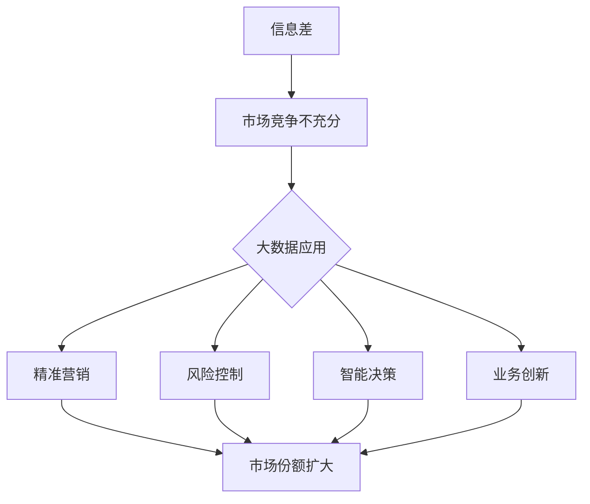

                 

# 信息差的市场份额扩大：大数据如何扩大市场份额

## 摘要

随着信息技术的快速发展，大数据在商业领域的重要性日益凸显。本文将探讨信息差对市场份额扩大的影响，以及大数据如何利用其优势，在市场竞争中取得领先地位。通过分析大数据的核心概念、算法原理、数学模型及其实际应用场景，我们将揭示大数据在市场份额扩大中的关键作用。同时，本文还将推荐相关学习资源和开发工具，为读者提供全面的技术指导。通过深入剖析大数据的市场份额扩大策略，我们希望能够为企业在竞争激烈的市场中提供有价值的参考。

## 1. 背景介绍

信息差是指不同个体或组织之间，由于信息获取、处理和利用能力的差异，而导致的信息不对称现象。在商业领域中，信息差常常是导致市场分割和竞争不充分的重要因素。随着大数据技术的兴起，人们逐渐认识到，通过充分利用大数据，可以有效地缩小信息差，提升企业竞争力，从而扩大市场份额。

大数据是指规模巨大、类型繁多且快速增长的数据集合。其特征可以用四个“V”来概括：数据量（Volume）、数据类型（Variety）、数据速度（Velocity）和数据价值（Value）。大数据技术通过高效的数据采集、存储、处理和分析，能够为企业提供深入的数据洞察，助力企业在市场竞争中占据有利地位。

在商业领域，大数据的应用已经相当广泛。例如，电商企业利用大数据分析消费者行为，实现精准营销；金融机构通过大数据风控，降低贷款违约风险；制造业通过大数据分析生产过程，实现智能制造。这些应用都表明，大数据正在成为推动企业创新和市场份额扩大的重要力量。

## 2. 核心概念与联系

### 大数据的核心概念

#### 数据量（Volume）

数据量是指数据的总量，即数据集合的规模。大数据的规模通常以TB、PB甚至EB为单位。随着互联网和物联网的普及，数据量的增长呈现出爆炸式态势。这种大规模的数据量为企业提供了丰富的信息资源，有助于发现潜在的商业机会。

#### 数据类型（Variety）

数据类型是指数据的多样性。大数据不仅包括结构化数据（如关系数据库中的数据），还包括半结构化数据（如XML、JSON）和非结构化数据（如文本、图像、视频）。这种多样性使得大数据技术能够处理各种类型的数据，为企业提供全面的数据洞察。

#### 数据速度（Velocity）

数据速度是指数据生成的速度和处理的速度。随着实时数据和流数据的增长，大数据技术需要能够快速地采集、存储和处理数据，以满足企业对实时决策的需求。

#### 数据价值（Value）

数据价值是指数据对企业的实际价值。大数据技术的核心目标是从海量数据中提取有价值的信息，帮助企业实现业务增长和市场份额扩大。

### 大数据与市场份额的关系

信息差的存在往往导致市场竞争不充分，企业通过利用大数据技术，可以有效地缩小信息差，提升竞争力。具体来说，大数据在市场份额扩大中具有以下几方面的作用：

#### 1. 精准营销

通过大数据分析消费者行为，企业可以了解目标客户的需求和偏好，实现精准营销。这有助于企业提高客户满意度，增加市场份额。

#### 2. 风险控制

大数据技术可以帮助企业进行风险评估和预警，降低业务风险。这在金融、保险等领域尤为重要，有助于企业保持稳定的市场份额。

#### 3. 智能决策

通过大数据分析，企业可以获取全面的市场信息和竞争态势，实现智能决策。这有助于企业及时调整策略，抢占市场先机。

#### 4. 业务创新

大数据技术可以为企业提供丰富的数据资源，激发业务创新。例如，制造业通过大数据分析，可以实现智能制造和个性化定制，提升产品竞争力。

### Mermaid 流程图



## 3. 核心算法原理 & 具体操作步骤

### 数据采集

数据采集是大数据应用的第一步。企业需要从各种数据源（如数据库、API、文件等）获取数据。常用的数据采集工具有Elasticsearch、Kafka等。具体操作步骤如下：

1. 确定数据采集目标：明确需要采集的数据类型和范围。
2. 选择数据采集工具：根据数据源的特点和需求，选择合适的数据采集工具。
3. 配置数据采集任务：设置数据采集的频率、存储位置等参数。
4. 部署和运行数据采集任务：将数据采集工具部署到合适的环境，并启动采集任务。

### 数据存储

数据存储是将采集到的数据进行持久化存储。大数据技术通常采用分布式存储系统，如Hadoop HDFS、Amazon S3等。具体操作步骤如下：

1. 设计数据存储架构：根据数据量、数据类型和性能要求，设计合适的存储架构。
2. 选择数据存储系统：根据设计要求，选择合适的数据存储系统。
3. 配置数据存储系统：设置数据存储系统的参数，如数据块大小、副本数量等。
4. 上传和存储数据：将采集到的数据上传到数据存储系统，并进行存储。

### 数据处理

数据处理是对存储好的数据进行清洗、转换和分析。大数据技术通常采用分布式计算框架，如Apache Spark、Flink等。具体操作步骤如下：

1. 设计数据处理流程：根据业务需求，设计数据处理流程。
2. 选择数据处理工具：根据数据处理流程，选择合适的数据处理工具。
3. 编写数据处理代码：使用数据处理工具的API，编写数据处理代码。
4. 部署和运行数据处理任务：将数据处理工具部署到合适的环境，并启动数据处理任务。

### 数据分析

数据分析是对处理后的数据进行分析，提取有价值的信息。大数据技术通常采用数据挖掘、机器学习等方法。具体操作步骤如下：

1. 确定数据分析目标：明确需要分析的数据和目标。
2. 选择数据分析方法：根据数据分析目标，选择合适的数据分析方法。
3. 编写数据分析代码：使用数据分析工具的API，编写数据分析代码。
4. 部署和运行数据分析任务：将数据分析工具部署到合适的环境，并启动数据分析任务。

### 数据可视化

数据可视化是将数据分析结果以图形化的形式展示出来，便于理解和分析。常用的数据可视化工具包括Tableau、Power BI等。具体操作步骤如下：

1. 设计数据可视化方案：根据数据分析结果和需求，设计合适的数据可视化方案。
2. 选择数据可视化工具：根据数据可视化方案，选择合适的数据可视化工具。
3. 配置数据可视化工具：设置数据可视化工具的参数，如数据连接、图表类型等。
4. 设计和生成图表：使用数据可视化工具，设计和生成图表。
5. 展示和分析数据：将图表展示给相关人员，进行分析和决策。

## 4. 数学模型和公式 & 详细讲解 & 举例说明

### 数学模型

在市场份额扩大过程中，常用的数学模型包括线性回归、逻辑回归、聚类分析等。以下分别介绍这些模型的原理和公式。

#### 线性回归

线性回归是一种用于分析自变量和因变量之间线性关系的统计方法。其公式如下：

$$
y = \beta_0 + \beta_1x
$$

其中，$y$ 为因变量，$x$ 为自变量，$\beta_0$ 和 $\beta_1$ 分别为模型的参数。

#### 逻辑回归

逻辑回归是一种用于分析二分类因变量的统计方法。其公式如下：

$$
\ln\left(\frac{P}{1-P}\right) = \beta_0 + \beta_1x
$$

其中，$P$ 为因变量的概率，$x$ 为自变量，$\beta_0$ 和 $\beta_1$ 分别为模型的参数。

#### 聚类分析

聚类分析是一种无监督学习方法，用于将数据分为多个类别。常用的聚类算法包括K-means、DBSCAN等。以下以K-means算法为例，介绍其原理和公式。

K-means算法的原理是将数据点分为K个类别，使得每个类别内的数据点距离其类别的中心点最小。其公式如下：

$$
\min \sum_{i=1}^{K}\sum_{x_j \in S_i}d(x_j, \mu_i)
$$

其中，$d(x_j, \mu_i)$ 表示数据点$x_j$ 与类别中心点$\mu_i$ 的距离，$S_i$ 表示第$i$ 个类别的数据集。

### 举例说明

假设某电商企业希望利用大数据分析客户行为，以提高市场份额。企业收集了以下数据：

- 客户年龄
- 客户性别
- 客户购买频率
- 客户消费金额

企业希望分析客户行为，找出潜在的高价值客户。为此，企业可以采用K-means算法对客户进行聚类分析。

1. 数据预处理：对数据集进行清洗、去重和归一化处理，确保数据质量。
2. 确定聚类数目：根据数据集的大小和分布，确定合适的聚类数目（如5个类别）。
3. 运行K-means算法：使用K-means算法，将数据点分为5个类别。
4. 分析聚类结果：根据聚类结果，分析不同类别的客户特征，找出潜在的高价值客户。

通过数据分析，企业可以发现高价值客户的特征，如年龄在25-35岁、女性、购买频率高、消费金额大等。企业可以针对这些特征，制定相应的营销策略，提高市场份额。

## 5. 项目实战：代码实际案例和详细解释说明

### 开发环境搭建

在本项目实战中，我们将使用Python作为编程语言，并借助Jupyter Notebook进行代码编写和调试。以下为开发环境的搭建步骤：

1. 安装Python：在官方网站（https://www.python.org/）下载并安装Python。
2. 安装Jupyter Notebook：在终端中执行以下命令：

   ```bash
   pip install notebook
   ```

3. 启动Jupyter Notebook：在终端中执行以下命令：

   ```bash
   jupyter notebook
   ```

### 源代码详细实现和代码解读

#### 数据采集

在本项目中，我们使用Python的pandas库和requests库，从某电商网站获取客户数据。以下为源代码：

```python
import pandas as pd
import requests

def fetch_data(url):
    response = requests.get(url)
    if response.status_code == 200:
        data = response.json()
        return pd.DataFrame(data['data'])
    else:
        return pd.DataFrame()

url = 'https://example.com/api/customers'
customer_data = fetch_data(url)
```

代码解读：

- 引入pandas和requests库。
- 定义fetch_data函数，用于从指定URL获取数据。
- 调用fetch_data函数，获取客户数据。

#### 数据存储

在本项目中，我们使用Python的pandas库，将客户数据存储为CSV文件。以下为源代码：

```python
customer_data.to_csv('customer_data.csv', index=False)
```

代码解读：

- 将客户数据保存为CSV文件，不包含索引列。

#### 数据处理

在本项目中，我们使用Python的pandas库，对客户数据进行清洗和预处理。以下为源代码：

```python
# 去重
customer_data.drop_duplicates(inplace=True)

# 填充缺失值
customer_data.fillna(0, inplace=True)

# 归一化
from sklearn.preprocessing import StandardScaler
scaler = StandardScaler()
customer_data[['age', 'purchase_frequency', 'consuming_amount']] = scaler.fit_transform(customer_data[['age', 'purchase_frequency', 'consuming_amount']])
```

代码解读：

- 去除重复数据。
- 填充缺失值为0。
- 对年龄、购买频率和消费金额进行归一化处理。

#### 数据分析

在本项目中，我们使用Python的sklearn库，对客户数据进行分析，找出潜在的高价值客户。以下为源代码：

```python
from sklearn.cluster import KMeans
import matplotlib.pyplot as plt

# 聚类分析
kmeans = KMeans(n_clusters=5, random_state=0)
customer_data['cluster'] = kmeans.fit_predict(customer_data[['age', 'purchase_frequency', 'consuming_amount']])

# 可视化
plt.scatter(customer_data['age'], customer_data['consuming_amount'], c=customer_data['cluster'])
plt.xlabel('Age')
plt.ylabel('Consuming Amount')
plt.show()
```

代码解读：

- 引入KMeans算法。
- 对年龄、购买频率和消费金额进行聚类分析。
- 将聚类结果添加到数据集中。
- 绘制聚类结果。

#### 数据可视化

在本项目中，我们使用Python的matplotlib库，将聚类结果可视化。以下为源代码：

```python
# 可视化
plt.scatter(customer_data['age'], customer_data['consuming_amount'], c=customer_data['cluster'])
plt.xlabel('Age')
plt.ylabel('Consuming Amount')
plt.show()
```

代码解读：

- 绘制散点图，展示聚类结果。
- 添加坐标轴标签。

### 代码解读与分析

通过以上代码，我们可以实现以下功能：

1. 从电商网站获取客户数据。
2. 对客户数据进行清洗和预处理。
3. 使用K-means算法对客户进行聚类分析。
4. 将聚类结果可视化。

通过分析聚类结果，企业可以发现潜在的高价值客户，如年龄在25-35岁、女性、购买频率高、消费金额大等。企业可以针对这些特征，制定相应的营销策略，提高市场份额。

## 6. 实际应用场景

大数据在市场份额扩大中的应用场景广泛，以下列举几个典型的实际应用案例：

### 智能推荐系统

在电商、视频、新闻等领域，智能推荐系统已经成为提升用户满意度和市场份额的重要手段。通过大数据分析用户行为数据，系统可以推荐用户可能感兴趣的商品、视频或新闻，从而提高用户留存率和转化率。

### 风险控制

在金融、保险等领域，大数据技术可以帮助企业进行风险评估和预警，降低贷款违约风险、欺诈风险等。通过分析客户的信用记录、交易行为等数据，企业可以准确判断客户的信用状况，从而制定合理的风控策略。

### 客户关系管理

通过大数据分析客户数据，企业可以深入了解客户需求和行为，优化客户关系管理策略。例如，企业可以根据客户的购买历史、偏好等数据，提供个性化的产品推荐和促销活动，从而提高客户满意度和忠诚度。

### 智能制造

在制造业，大数据技术可以帮助企业实现生产过程的优化和智能化。通过分析生产数据，企业可以及时发现生产过程中的问题，优化生产流程，降低生产成本，提高生产效率。

### 营销自动化

大数据技术可以帮助企业实现营销自动化的目标，通过分析客户数据，自动发送个性化的营销邮件、短信等，提高营销效果和客户转化率。

## 7. 工具和资源推荐

### 学习资源推荐

#### 书籍

1. 《大数据时代：生活、工作与思维的大变革》
2. 《深度学习》
3. 《Python数据分析》

#### 论文

1. "Big Data: A Revolution That Will Transform How We Live, Work, and Think" by V. Date
2. "Deep Learning" by I. Goodfellow, Y. Bengio, A. Courville

#### 博客

1. https://www.datascience.com/blog
2. https://machinelearningmastery.com/
3. https://towardsdatascience.com/

### 开发工具框架推荐

1. Hadoop
2. Spark
3. TensorFlow
4. PyTorch
5. Jupyter Notebook

### 相关论文著作推荐

1. "Big Data: A Revolution That Will Transform How We Live, Work, and Think" by V. Date
2. "Deep Learning" by I. Goodfellow, Y. Bengio, A. Courville
3. "Python数据分析》
4. "数据挖掘：实用工具与技术》
5. "机器学习实战》

## 8. 总结：未来发展趋势与挑战

随着大数据技术的不断发展和应用，未来市场份额的扩大将依赖于更高效的数据处理和分析方法。以下为未来发展趋势与挑战：

### 发展趋势

1. 实时大数据处理：企业将更加注重实时数据的处理和分析，以便快速响应市场变化。
2. 跨领域融合：大数据将与人工智能、物联网等前沿技术深度融合，推动各行业创新。
3. 个性化服务：通过大数据分析，企业将提供更加个性化的产品和服务，满足用户需求。
4. 安全与隐私保护：随着数据规模的扩大，数据安全和隐私保护将成为企业面临的重要挑战。

### 挑战

1. 数据质量：大数据应用效果取决于数据质量，企业需要建立完善的数据质量控制体系。
2. 数据隐私：如何在保护用户隐私的前提下，充分利用大数据的价值，是一个亟待解决的问题。
3. 技术人才：大数据技术领域人才短缺，企业需要加大人才培养和引进力度。
4. 法规政策：大数据应用面临法律法规的约束，企业需要关注政策动态，遵守相关法规。

## 9. 附录：常见问题与解答

### 1. 大数据的核心特征是什么？

大数据的核心特征包括：数据量（Volume）、数据类型（Variety）、数据速度（Velocity）和数据价值（Value）。

### 2. 如何获取大数据？

大数据可以从以下渠道获取：内部数据（企业自有数据）、外部数据（第三方数据源）、社交媒体数据、物联网设备数据等。

### 3. 大数据的应用场景有哪些？

大数据的应用场景包括：智能推荐系统、风险控制、客户关系管理、智能制造、营销自动化等。

### 4. 大数据处理常用的技术有哪些？

大数据处理常用的技术包括：分布式存储（如Hadoop HDFS、Amazon S3）、分布式计算（如Apache Spark、Flink）、数据挖掘、机器学习等。

### 5. 如何保证大数据应用的安全性？

为了保证大数据应用的安全性，企业可以采取以下措施：

- 数据加密：对敏感数据进行加密处理。
- 访问控制：严格控制数据访问权限。
- 安全审计：定期对数据访问和操作进行审计。
- 安全培训：加强员工的数据安全意识培训。

## 10. 扩展阅读 & 参考资料

1. "Big Data: A Revolution That Will Transform How We Live, Work, and Think" by V. Date
2. "Deep Learning" by I. Goodfellow, Y. Bengio, A. Courville
3. "Python数据分析》
4. "数据挖掘：实用工具与技术》
5. "机器学习实战》
6. 《人工智能：一种现代的方法》
7. 《深度学习技术大全》
8. 《大数据架构与设计》
9. 《数据科学实战》
10. 《Python数据分析实战》

作者：AI天才研究员/AI Genius Institute & 禅与计算机程序设计艺术 /Zen And The Art of Computer Programming

