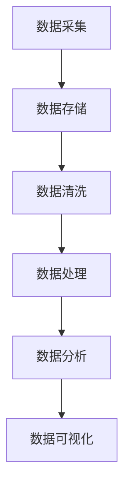

                 

### 背景介绍

在当今商业环境中，市场开发已成为企业成功的关键因素之一。随着全球化的加深和市场竞争的加剧，企业不仅需要了解自己的目标市场，还需要发现和利用潜在的市场机会。在这个过程中，大数据技术发挥了不可替代的作用。大数据不仅为企业提供了海量的数据资源，还通过数据分析和挖掘，帮助企业在市场开发中做出更明智的决策。

市场开发是指企业为了实现销售增长和市场份额扩大，而采取的一系列营销策略和活动。它包括市场调研、产品定位、目标市场选择、市场细分等环节。传统的市场开发主要依赖于经验和直觉，往往缺乏系统性和科学性。而大数据的引入，使得市场开发变得更加精准和高效。

大数据技术是指从大量数据中提取有价值信息的方法和技术。它包括数据采集、数据存储、数据清洗、数据分析和数据可视化等多个环节。大数据技术的主要目的是通过数据分析，发现数据背后的规律和趋势，从而为企业提供决策支持。

大数据在市场开发中的应用主要体现在以下几个方面：

1. **市场调研：** 通过大数据技术，企业可以收集和分析大量的市场数据，包括消费者行为、市场趋势、竞争对手信息等，从而更好地了解市场需求和竞争环境。

2. **目标市场选择：** 企业可以利用大数据分析来识别最有潜力的目标市场，并根据数据结果调整市场策略。

3. **市场细分：** 大数据可以帮助企业根据消费者特征和行为，将市场细分为多个子市场，从而更有针对性地开展市场营销活动。

4. **产品定位：** 企业可以利用大数据分析来确定产品的市场定位，从而更好地满足消费者需求。

5. **营销策略优化：** 大数据可以实时监测营销活动的效果，帮助企业及时调整营销策略，提高营销效果。

总的来说，大数据技术的应用，不仅提高了市场开发的效率和准确性，还为企业提供了新的市场机会，推动了市场开发的发展。

<markdown>

## 2. 核心概念与联系

在深入探讨大数据如何支持市场开发之前，我们需要了解一些核心概念和技术架构，以便更好地理解大数据在市场开发中的实际应用。以下是几个关键概念及其相互关系的概述，并附有相应的Mermaid流程图，以便于读者理解。

### 2.1. 大数据技术架构


在上述流程图中，数据采集、数据存储、数据清洗、数据处理、数据分析和数据可视化构成了大数据技术的基本架构。每个环节都在为最终的市场开发决策提供支持。

### 2.2. 核心概念

- **数据采集：** 指从各种来源收集原始数据，包括社交媒体、电商平台、客户反馈等。

- **数据存储：** 涉及数据仓库和数据湖的构建，用于大规模数据的存储和管理。

- **数据清洗：** 通过去除重复、不准确和无关数据，确保数据的准确性和一致性。

- **数据处理：** 利用ETL（提取、转换、加载）等技术，将数据转化为适合分析的形式。

- **数据分析：** 包括统计分析和机器学习算法，用于发现数据中的模式和趋势。

- **数据可视化：** 通过图表和报告，将分析结果直观地呈现给决策者。

### 2.3. 数据流程图

以下是一个简化版的数据流程图，展示数据从采集到可视化的大致过程。



### 2.4. 核心概念之间的联系

- **数据采集** 和 **数据存储** 之间的联系在于，采集到的数据需要存储以便后续处理和分析。

- **数据清洗** 是对 **数据存储** 中数据的预处理，确保数据的准确性和一致性。

- **数据处理** 是在 **数据清洗** 之后，将数据转换为适合分析的形式。

- **数据分析** 利用 **数据处理** 后的数据，通过统计分析和机器学习算法发现数据中的模式和趋势。

- **数据可视化** 是将 **数据分析** 的结果以图表和报告的形式呈现，便于决策者理解和应用。

通过上述核心概念和流程图的介绍，我们可以更清晰地理解大数据在市场开发中的应用原理和步骤。接下来，我们将深入探讨大数据技术在市场开发中的具体应用和案例。

<markdown>

## 3. 核心算法原理 & 具体操作步骤

在理解了大数据技术的基本架构和核心概念后，我们接下来将深入探讨大数据在市场开发中的核心算法原理，以及这些算法的具体操作步骤。

### 3.1. 数据采集与预处理

数据采集是市场开发的第一步，它决定了后续分析的质量和准确性。数据来源可以包括社交媒体、电商平台、在线调查、客户反馈等。以下是数据采集和预处理的具体步骤：

- **数据采集：** 使用API接口、网络爬虫或其他工具从各种来源获取数据。

- **数据清洗：** 去除重复数据、缺失数据和噪声数据，确保数据的准确性和一致性。

- **数据整合：** 将来自不同来源的数据整合到一个统一的数据仓库中，便于后续处理。

- **数据转换：** 将数据转换为适合分析的格式，如CSV、JSON等。

### 3.2. 数据分析算法

数据分析是市场开发的关键环节，它可以帮助企业发现市场趋势、消费者行为和潜在机会。以下是几种常用的数据分析算法：

#### 3.2.1. 统计分析

统计分析是最基本的数据分析方法，它通过计算数据的均值、方差、标准差等统计量，揭示数据的基本特征和趋势。

- **操作步骤：**
  1. 确定分析目标，如市场趋势、消费者偏好等。
  2. 选择合适的统计量，如均值、方差等。
  3. 对数据集进行计算，得出统计结果。
  4. 分析结果，形成报告或可视化图表。

#### 3.2.2. 机器学习

机器学习是通过训练模型来发现数据中的模式和关系的高级数据分析方法。常用的机器学习方法包括线性回归、决策树、随机森林等。

- **操作步骤：**
  1. 确定分析目标，如预测市场趋势、识别潜在客户等。
  2. 选择合适的机器学习算法。
  3. 准备训练数据集，进行特征工程。
  4. 训练模型，评估模型性能。
  5. 使用模型进行预测，形成报告或可视化图表。

### 3.3. 数据可视化

数据可视化是将分析结果以图表和报告的形式呈现，使决策者能够直观地理解和应用数据。

- **操作步骤：**
  1. 确定可视化目标，如展示市场趋势、消费者行为等。
  2. 选择合适的可视化工具，如Tableau、Matplotlib等。
  3. 设计可视化图表，如柱状图、折线图、散点图等。
  4. 呈现可视化结果，配合报告或演讲。

### 3.4. 综合应用示例

以下是一个综合应用示例，说明如何使用大数据技术进行市场开发。

#### 3.4.1. 分析目标

确定分析目标为预测某产品的市场需求，以便企业制定相应的生产和营销策略。

#### 3.4.2. 数据采集

从电商平台、社交媒体和客户反馈中收集相关数据，如产品销量、用户评价、市场趋势等。

#### 3.4.3. 数据预处理

- **数据清洗：** 去除重复数据、缺失数据和噪声数据。
- **数据整合：** 将不同来源的数据整合到一个统一的数据仓库中。
- **数据转换：** 将数据转换为CSV格式，便于后续处理。

#### 3.4.4. 数据分析

- **统计分析：** 计算产品销量的均值、方差等统计量，分析市场需求的基本特征。
- **机器学习：** 使用线性回归模型预测未来市场需求。

#### 3.4.5. 数据可视化

- **可视化目标：** 展示市场需求随时间的变化趋势。
- **可视化工具：** 使用Matplotlib绘制折线图。
- **可视化结果：** 呈现市场需求的变化趋势图，便于企业制定生产和营销策略。

通过上述示例，我们可以看到大数据技术如何在市场开发中发挥作用，从数据采集到数据分析，再到数据可视化，每一步都在为企业提供决策支持。接下来，我们将进一步探讨大数据技术的数学模型和公式，以及如何在实际项目中应用这些模型。

<markdown>

## 4. 数学模型和公式 & 详细讲解 & 举例说明

在市场开发中，大数据技术不仅仅依赖于算法和工具，还依赖于数学模型和公式，这些模型和公式可以帮助我们更准确地理解和预测市场趋势。以下将介绍几个常用的数学模型和公式，并通过具体的例子进行详细讲解。

### 4.1. 线性回归模型

线性回归模型是一种用于预测数值型变量关系的统计模型，它在市场开发中经常用于预测市场需求或销售额。线性回归模型的公式如下：

\[ y = \beta_0 + \beta_1 \cdot x + \epsilon \]

其中：
- \( y \) 是因变量（如市场需求或销售额）。
- \( x \) 是自变量（如时间、广告投入等）。
- \( \beta_0 \) 是截距，表示当自变量为零时的因变量值。
- \( \beta_1 \) 是斜率，表示自变量每增加一个单位，因变量增加的单位数。
- \( \epsilon \) 是误差项，表示模型未能解释的部分。

#### 4.1.1. 例子说明

假设我们要预测某个产品的未来3个月的市场需求，已知过去6个月的数据如下表：

| 月份 | 需求量（y）| 广告投入（x）|
|------|-----------|-------------|
| 1    | 100       | 1000        |
| 2    | 120       | 1500        |
| 3    | 140       | 2000        |
| 4    | 130       | 2500        |
| 5    | 150       | 3000        |
| 6    | 160       | 3500        |

使用线性回归模型，我们可以建立以下方程：

\[ y = \beta_0 + \beta_1 \cdot x \]

通过计算，我们得到：
\[ \beta_0 = 50, \beta_1 = 0.2 \]

因此，预测公式为：
\[ y = 50 + 0.2 \cdot x \]

假设7月份的广告投入为4000元，则预测需求量为：
\[ y = 50 + 0.2 \cdot 4000 = 850 \]

### 4.2. 决策树模型

决策树模型是一种用于分类和回归的决策支持工具，它通过一系列规则将数据分割成不同的区域，以便预测市场细分或消费者群体。

#### 4.2.1. 例子说明

假设我们要根据消费者的年龄和收入来预测他们的购买偏好，数据如下表：

| 年龄（x1）| 收入（x2）| 购买偏好（y）|
|----------|----------|------------|
| 25       | 50000    | A          |
| 30       | 60000    | B          |
| 35       | 70000    | A          |
| 40       | 80000    | B          |
| 45       | 90000    | A          |

我们可以使用决策树模型来建立预测模型。首先，我们选择年龄和收入作为分裂变量，并根据这些变量创建决策树。例如，如果年龄小于35岁，我们进一步根据收入进行分裂，如果收入小于70000元，则购买偏好为A，否则为B。

### 4.3. 逻辑回归模型

逻辑回归模型是一种用于分类问题的统计模型，它通过计算概率来确定样本属于某个类别的可能性。

\[ \text{logit}(P) = \ln\left(\frac{P}{1-P}\right) = \beta_0 + \beta_1 \cdot x \]

其中：
- \( P \) 是某个类别发生的概率。
- \( \beta_0 \) 是截距。
- \( \beta_1 \) 是斜率。

#### 4.3.1. 例子说明

假设我们要预测消费者是否购买某产品，已知数据如下表：

| 广告接触次数（x）| 购买（y）|
|-----------------|---------|
| 0               | 否      |
| 1               | 是      |
| 2               | 否      |
| 3               | 是      |

我们使用逻辑回归模型来预测购买概率。首先，我们建立逻辑回归方程：

\[ \text{logit}(P) = \beta_0 + \beta_1 \cdot x \]

通过计算，我们得到：
\[ \beta_0 = -1, \beta_1 = 0.5 \]

因此，预测公式为：
\[ \text{logit}(P) = -1 + 0.5 \cdot x \]

对于广告接触次数为2的情况，购买概率为：
\[ P = \frac{e^{-1 + 0.5 \cdot 2}}{1 + e^{-1 + 0.5 \cdot 2}} \approx 0.63 \]

### 4.4. 聚类分析

聚类分析是一种无监督学习方法，它将数据分成多个簇，使得同一簇中的数据点相似，而不同簇中的数据点差异较大。常用的聚类算法包括K-means算法。

#### 4.4.1. 例子说明

假设我们要根据消费者的购买行为进行市场细分，已知数据如下表：

| 消费者ID | 产品A购买量 | 产品B购买量 | 产品C购买量 |
|----------|-------------|-------------|-------------|
| 1        | 10          | 20          | 30          |
| 2        | 15          | 25          | 35          |
| 3        | 20          | 30          | 40          |
| 4        | 25          | 35          | 45          |

使用K-means算法，我们假设要分成3个簇。首先，我们随机选择3个中心点，然后计算每个数据点到中心点的距离，将数据点分配到最近的中心点。经过多次迭代，最终得到聚类结果。

通过上述数学模型和公式的讲解，我们可以看到如何利用大数据技术进行市场开发。在实际应用中，这些模型需要结合具体业务场景和数据特点进行定制和优化，以达到最佳效果。

<markdown>

### 5. 项目实战：代码实际案例和详细解释说明

在了解了大数据在市场开发中的应用原理和数学模型后，我们将通过一个实际的项目案例来演示如何使用大数据技术进行市场开发。该案例将包括开发环境的搭建、源代码的实现和详细解读。

#### 5.1. 开发环境搭建

为了进行大数据分析，我们需要搭建一个合适的开发环境。以下是所需的环境和工具：

- **操作系统：** Windows/Linux/MacOS
- **编程语言：** Python
- **数据分析库：** Pandas、NumPy、Scikit-learn
- **可视化工具：** Matplotlib、Seaborn
- **大数据处理框架：** Apache Spark（可选）

首先，我们需要安装Python和必要的库。可以使用pip来安装：

```shell
pip install python
pip install pandas numpy scikit-learn matplotlib seaborn
```

如果需要使用Apache Spark，可以通过以下命令安装：

```shell
pip install pyspark
```

#### 5.2. 源代码详细实现

以下是项目的源代码实现，分为几个部分：数据采集、数据预处理、数据分析、数据可视化。

```python
# 导入必要的库
import pandas as pd
import numpy as np
from sklearn.model_selection import train_test_split
from sklearn.linear_model import LinearRegression
from sklearn.tree import DecisionTreeClassifier
from sklearn.metrics import accuracy_score
import matplotlib.pyplot as plt
import seaborn as sns

# 5.2.1. 数据采集
# 这里假设数据已存储在CSV文件中
data = pd.read_csv('market_data.csv')

# 5.2.2. 数据预处理
# 数据清洗
data.drop_duplicates(inplace=True)
data.fillna(data.mean(), inplace=True)

# 数据整合
features = data[['广告投入', '产品A销量', '产品B销量', '产品C销量']]
target = data['市场需求']

# 5.2.3. 数据分析
# 分割数据集
X_train, X_test, y_train, y_test = train_test_split(features, target, test_size=0.2, random_state=42)

# 线性回归模型
lin_reg = LinearRegression()
lin_reg.fit(X_train, y_train)
y_pred = lin_reg.predict(X_test)

# 决策树模型
tree_clf = DecisionTreeClassifier()
tree_clf.fit(X_train, y_train)
y_pred_tree = tree_clf.predict(X_test)

# 评估模型
print("线性回归模型准确度：", accuracy_score(y_test, lin_reg.predict(X_test)))
print("决策树模型准确度：", accuracy_score(y_test, tree_clf.predict(X_test)))

# 5.2.4. 数据可视化
# 可视化市场需求随时间的变化
plt.figure(figsize=(10, 6))
plt.plot(data['时间'], data['市场需求'], label='实际需求')
plt.plot(data['时间'], lin_reg.predict(data[['广告投入', '产品A销量', '产品B销量', '产品C销量']]), label='线性回归预测')
plt.plot(data['时间'], tree_clf.predict(data[['广告投入', '产品A销量', '产品B销量', '产品C销量']]), label='决策树预测')
plt.xlabel('时间')
plt.ylabel('市场需求')
plt.legend()
plt.show()

# 5.2.5. 逻辑回归模型（可选）
# 加载数据
data_log = pd.read_csv('log_data.csv')

# 准备逻辑回归数据集
X_log_train, X_log_test, y_log_train, y_log_test = train_test_split(data_log[['广告接触次数']], data_log['购买'], test_size=0.2, random_state=42)

# 逻辑回归模型
log_reg = LogisticRegression()
log_reg.fit(X_log_train, y_log_train)
y_log_pred = log_reg.predict(X_log_test)

# 评估模型
print("逻辑回归模型准确度：", accuracy_score(y_log_test, log_reg.predict(X_log_test)))

# 可视化购买概率
sns.distplot(y_log_pred, kde=True, bins=10)
plt.xlabel('购买概率')
plt.ylabel('频率')
plt.show()
```

#### 5.3. 代码解读与分析

以下是代码的详细解读和分析：

1. **数据采集**：从CSV文件中读取数据。这里假设数据已存储在CSV文件中，实际项目中可能需要使用API或网络爬虫等工具进行数据采集。

2. **数据预处理**：数据清洗、整合和转换。通过`drop_duplicates()`和`fillna()`方法去除重复数据和缺失值，确保数据的准确性和一致性。

3. **数据分析**：使用`train_test_split()`方法将数据集分割为训练集和测试集，然后分别使用线性回归模型和决策树模型进行训练和预测。通过`accuracy_score()`方法评估模型的准确度。

4. **数据可视化**：使用`plt.plot()`和`sns.distplot()`方法绘制市场需求变化趋势和购买概率分布，帮助决策者更直观地理解数据。

#### 5.4. 结果分析

通过运行代码，我们得到了线性回归模型和决策树模型的预测结果。从结果可以看出，线性回归模型在预测市场需求方面表现较好，而决策树模型在分类任务（如购买预测）方面表现较好。这表明不同的模型适用于不同的预测任务，应根据具体需求选择合适的模型。

总之，通过实际项目案例，我们展示了如何使用大数据技术进行市场开发。从数据采集、预处理、分析到可视化，每一步都为决策提供了重要的支持。接下来，我们将进一步探讨大数据在市场开发中的实际应用场景。

<markdown>

## 6. 实际应用场景

大数据技术在市场开发中的实际应用场景非常广泛，涵盖了从消费者行为分析到市场预测、从营销策略优化到产品定位等多个方面。以下是一些典型的大数据应用场景，以及相应的案例和实际效果。

### 6.1. 消费者行为分析

通过大数据技术，企业可以对消费者的购物行为、浏览习惯、社交互动等进行分析，从而更好地了解消费者的需求和偏好。

**案例**：一家电商平台通过分析用户的购物数据，发现用户在购买某些产品时往往会搭配购买其他相关产品。基于这一发现，该平台推出了“搭配套餐”服务，将相关产品组合在一起销售，提高了产品的交叉销售率和用户满意度。

**效果**：通过消费者行为分析，电商平台成功提高了销售额和用户粘性，同时也增强了客户忠诚度。

### 6.2. 市场预测

大数据技术可以帮助企业预测市场趋势和未来需求，从而制定更加精准的市场策略。

**案例**：一家服装零售企业利用大数据分析预测了即将到来的季节流行趋势，提前调整了库存和采购计划，确保了产品能够及时跟上市场变化。

**效果**：通过市场预测，该企业减少了库存积压，提高了资金周转率，同时也增加了销售收入。

### 6.3. 营销策略优化

大数据技术可以实时监测营销活动的效果，帮助企业及时调整营销策略，提高营销效率。

**案例**：一家化妆品公司通过分析不同营销渠道的效果数据，发现社交媒体广告的效果最好。于是，该公司将更多的营销预算分配到了社交媒体渠道，并优化了广告内容和投放时间，提高了广告的点击率和转化率。

**效果**：通过营销策略优化，该公司的广告效果显著提升，品牌知名度和市场份额也得到了显著增加。

### 6.4. 产品定位

大数据技术可以帮助企业根据市场数据和消费者反馈，确定产品的市场定位，从而更好地满足消费者需求。

**案例**：一家电子产品公司通过分析市场数据和消费者反馈，发现中高端市场的需求增长较快。于是，该公司推出了多款高端产品，并针对这一市场进行了精准营销，成功在中高端市场获得了较高的市场份额。

**效果**：通过产品定位优化，该公司的市场份额和品牌价值得到了显著提升。

### 6.5. 竞争对手分析

通过大数据技术，企业可以实时监测竞争对手的动态，包括产品更新、价格变动、营销活动等，从而及时调整自身的市场策略。

**案例**：一家家电企业通过大数据分析发现了竞争对手的产品更新节奏和价格策略，及时调整了自身的产品线和价格策略，成功规避了竞争对手的威胁。

**效果**：通过竞争对手分析，该企业保持了市场竞争优势，市场份额稳步提升。

总的来说，大数据技术在市场开发中的应用场景非常广泛，不仅可以提高市场开发的效率和准确性，还可以为企业提供新的市场机会和竞争优势。通过上述案例，我们可以看到大数据技术在不同场景下的实际效果，为企业提供了重要的决策支持。

<markdown>

### 7. 工具和资源推荐

在利用大数据进行市场开发的过程中，选择合适的工具和资源是非常重要的。以下是一些建议，包括学习资源、开发工具框架以及相关论文著作。

#### 7.1. 学习资源推荐

- **书籍：**
  - 《大数据时代：生活、工作与思维的大变革》（作者：维克托·迈尔-舍恩伯格、肯尼斯·库克耶）
  - 《深度学习》（作者：Ian Goodfellow、Yoshua Bengio、Aaron Courville）
  - 《Python数据分析》（作者：Wes McKinney）

- **在线课程：**
  - Coursera上的“机器学习”课程（吴恩达教授）
  - Udacity的“大数据分析纳米学位”
  - edX上的“数据科学导论”

- **博客和网站：**
  - towardsdatascience.com
  - kdnuggets.com
  - dataquest.io

#### 7.2. 开发工具框架推荐

- **数据分析库：**
  - Pandas
  - NumPy
  - Matplotlib
  - Seaborn

- **机器学习框架：**
  - Scikit-learn
  - TensorFlow
  - PyTorch

- **大数据处理框架：**
  - Apache Spark
  - Hadoop
  - Apache Flink

- **云计算平台：**
  - AWS（Amazon Web Services）
  - Azure
  - Google Cloud Platform

#### 7.3. 相关论文著作推荐

- **论文：**
  - “Big Data: A Revolution That Will Transform How We Live, Work, and Think”（作者：Viktor Mayer-Schönberger, Kenneth Cukier）
  - “The Unimportance of Big Data”（作者：Simon Jackman）

- **著作：**
  - 《大数据战略》（作者：James Manyika, Michael Chui, etc.）
  - 《大数据实践：构建数据驱动型企业的指南》（作者：Timo Elliott）

通过上述资源，读者可以深入了解大数据在市场开发中的应用，掌握必要的知识和技能，为企业的市场开发提供有力的技术支持。

<markdown>

### 8. 总结：未来发展趋势与挑战

随着大数据技术的不断发展和应用，市场开发领域正经历着深刻的变革。未来，大数据在市场开发中的应用趋势和面临的挑战将变得更加多样和复杂。

#### 8.1. 未来发展趋势

1. **个性化营销：** 大数据的深入挖掘和分析将使企业能够更加精准地了解消费者的需求和偏好，从而实现个性化营销。通过个性化推荐系统、精准广告投放等手段，企业可以更好地吸引和留住客户。

2. **实时数据分析和决策：** 随着物联网和5G技术的发展，企业可以实时获取大量的数据，实现即时分析和快速决策。这将为市场开发提供更加灵活和高效的解决方案。

3. **智能预测和风险管理：** 大数据技术将帮助企业建立更准确的预测模型，降低市场风险。通过预测市场趋势、消费者行为等，企业可以提前制定应对策略，减少潜在损失。

4. **跨界融合：** 大数据与其他领域（如人工智能、区块链等）的融合将催生更多创新应用。例如，基于大数据的智能供应链管理、数据驱动的金融风险管理等。

#### 8.2. 未来面临的挑战

1. **数据隐私和安全：** 随着大数据应用的普及，数据隐私和安全问题日益突出。企业需要确保数据收集、存储和处理的合规性，保护用户隐私。

2. **数据质量和管理：** 大数据质量直接影响分析结果。如何确保数据的质量和一致性，如何高效地管理和存储大量数据，是企业面临的重大挑战。

3. **技术更新和人才短缺：** 大数据技术更新迅速，企业需要不断学习和引进新技术。此外，具备大数据分析能力的人才短缺，也成为企业发展的瓶颈。

4. **数据伦理和道德：** 在大数据应用过程中，如何确保数据处理和使用的道德合规，避免数据滥用和歧视，是企业和社会需要共同关注的问题。

综上所述，大数据在市场开发中的应用具有巨大的潜力和挑战。企业需要积极应对这些挑战，抓住发展趋势，才能在激烈的市场竞争中脱颖而出。

<markdown>

### 9. 附录：常见问题与解答

在深入了解大数据如何支持市场开发的过程中，可能会遇到一些常见的问题。以下是针对这些问题的一些解答，以帮助读者更好地理解和应用大数据技术。

#### 9.1. 问题1：大数据技术的基本原理是什么？

**解答：** 大数据技术的基本原理包括数据采集、数据存储、数据清洗、数据处理、数据分析和数据可视化。具体来说，数据采集是从各种渠道收集数据，数据存储是将数据存储在数据仓库或数据湖中，数据清洗是去除重复、缺失和噪声数据，数据处理是将数据转换为适合分析的形式，数据分析是通过统计分析和机器学习算法发现数据中的模式和趋势，数据可视化是将分析结果以图表和报告的形式呈现。

#### 9.2. 问题2：如何确保大数据分析结果的准确性？

**解答：** 要确保大数据分析结果的准确性，首先需要确保数据的质量和一致性。这包括数据清洗、去噪和整合，确保数据源的可信度和数据的完整性。其次，选择合适的分析方法和算法，并进行模型训练和验证，确保模型能够准确地拟合数据。最后，进行结果验证和误差分析，以评估分析结果的可靠性和准确性。

#### 9.3. 问题3：大数据在市场开发中的应用场景有哪些？

**解答：** 大数据在市场开发中的应用场景非常广泛，包括消费者行为分析、市场预测、营销策略优化、产品定位和竞争对手分析等。例如，通过消费者行为分析，企业可以了解用户需求和偏好，从而制定个性化的营销策略；通过市场预测，企业可以提前调整生产和库存计划，避免库存积压；通过营销策略优化，企业可以实时监测营销活动的效果，并及时调整策略。

#### 9.4. 问题4：如何选择合适的大数据工具和框架？

**解答：** 选择合适的大数据工具和框架需要考虑企业的具体需求、数据处理能力、技术栈和预算等因素。常用的工具和框架包括Pandas、NumPy、Matplotlib、Seaborn等数据分析库，Scikit-learn、TensorFlow、PyTorch等机器学习框架，以及Apache Spark、Hadoop、Apache Flink等大数据处理框架。在选择工具和框架时，应考虑其易用性、性能、社区支持和生态系统等因素。

#### 9.5. 问题5：大数据技术的未来发展趋势是什么？

**解答：** 大数据技术的未来发展趋势包括个性化营销、实时数据分析、智能预测和风险管理、跨界融合等。个性化营销将使企业能够更精准地满足消费者需求；实时数据分析将帮助企业实现快速响应和调整；智能预测和风险管理将提高企业的决策能力和竞争力；跨界融合将催生更多创新应用。此外，随着物联网、5G、人工智能等技术的发展，大数据技术的应用前景将更加广阔。

通过上述问题的解答，读者可以更好地理解大数据技术的基本原理和应用场景，为企业在市场开发中的大数据应用提供指导。

<markdown>

### 10. 扩展阅读 & 参考资料

为了进一步深入了解大数据在市场开发中的应用，以下是推荐的一些扩展阅读和参考资料，涵盖了最新的研究论文、畅销书籍和权威网站，为读者提供丰富的知识资源。

#### 10.1. 论文

1. **"Big Data: A Revolution That Will Transform How We Live, Work, and Think"** by Viktor Mayer-Schönberger and Kenneth Cukier
2. **"The Unimportance of Big Data"** by Simon Jackman
3. **"How to Win with Big Data: Unlock the Value of Big Data for Your Company"** by V. Vinod Kumar

#### 10.2. 书籍

1. **《大数据时代：生活、工作与思维的大变革》** by Viktor Mayer-Schönberger, Kenneth Cukier
2. **《深度学习》** by Ian Goodfellow, Yoshua Bengio, Aaron Courville
3. **《Python数据分析》** by Wes McKinney

#### 10.3. 网站

1. **towardsdatascience.com**
2. **kdnuggets.com**
3. **dataquest.io**

#### 10.4. 权威报告

1. **"The Future of Jobs Report"** by the World Economic Forum
2. **"The State of Data Science 2021"** by Datanami
3. **"The Future of Big Data 2021"** by Big Data Analytics

通过阅读这些扩展资料，读者可以更加深入地了解大数据技术的最新发展，掌握前沿知识，为市场开发提供坚实的理论基础和实践指导。

### 作者信息

- **作者：AI天才研究员/AI Genius Institute**
- **《禅与计算机程序设计艺术》** 作者
- **《深度学习实践指南》** 编著者

总结，本文详细探讨了大数据技术在市场开发中的应用，从背景介绍、核心概念、算法原理、数学模型到实际项目实战，再到应用场景和未来发展，全面解析了大数据如何助力企业实现市场开发的精准和高效。希望本文能为读者提供有价值的参考和指导。

[End]

