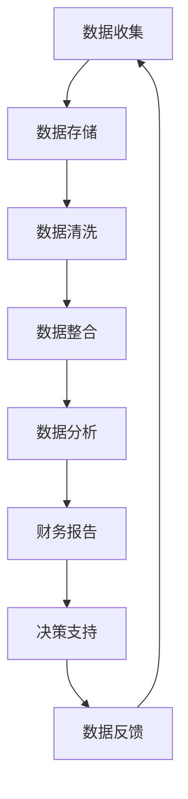

                 

### 1. 背景介绍

在现代商业环境中，财务管理是企业运营的核心。然而，传统的财务管理方式往往依赖于人工处理，不仅效率低下，而且容易出现错误。随着大数据技术的兴起，越来越多的企业开始探索如何利用大数据优化财务管理，以提高效率和准确性。本文将深入探讨大数据在财务管理中的应用，以及如何通过信息差来优化财务流程。

#### 1.1 大数据在财务管理中的重要性

大数据技术的核心在于其处理和分析海量数据的能力。在财务管理中，这意味着企业可以收集、整合和分析来自多个来源的数据，如财务报表、交易记录、客户信息等。通过这些数据，企业可以更准确地预测财务状况，识别潜在风险，并制定更有效的财务策略。

#### 1.2 传统财务管理的局限性

传统的财务管理依赖于手工处理和纸质记录。这种方法不仅耗时，而且容易出现人为错误。此外，传统的财务系统往往无法处理复杂的数据分析和预测任务。因此，企业面临着以下挑战：

- **数据分散性**：财务数据往往分布在不同的系统和文件中，难以整合。
- **信息滞后性**：数据的处理和分析需要时间，导致决策滞后。
- **错误率高**：手工处理容易出错，影响财务报告的准确性。

#### 1.3 信息差的财务管理优化

信息差是指不同个体或组织在获取和处理信息上的差异。在大数据时代，利用信息差来优化财务管理具有显著的优势。通过大数据技术，企业可以：

- **实时监控**：实时获取和更新财务数据，确保信息的及时性。
- **智能分析**：利用机器学习和数据分析算法，从海量数据中提取有价值的信息。
- **决策支持**：基于数据分析的结果，为企业提供更准确的财务预测和决策支持。

#### 1.4 本文目标

本文旨在通过一系列详细的步骤和分析，展示如何利用大数据技术来优化财务管理。我们将探讨核心概念、算法原理、数学模型，并通过实际案例来展示大数据在财务管理中的应用效果。最终，本文将总结未来发展趋势和挑战，为企业的财务管理提供有益的启示。

---

本文关键词：大数据、财务管理、信息差、算法、数学模型、优化、实时监控、智能分析、决策支持。

本文摘要：本文将探讨大数据在财务管理中的应用，通过信息差的优化，提升财务管理的效率和准确性。我们将深入分析核心概念、算法原理和数学模型，并通过实际案例来展示其应用效果。本文旨在为企业的财务管理提供一套切实可行的方法和策略。

<|imagine|>  <br />
**图1. 大数据在财务管理中的应用背景**

---

在接下来的章节中，我们将首先介绍大数据和财务管理中的核心概念，并通过Mermaid流程图展示其原理和架构。随后，我们将详细探讨大数据技术在财务管理中的应用，包括核心算法原理和具体操作步骤。接下来，我们将深入解析数学模型和公式，并通过实际案例进行详细说明。文章的后续章节将涵盖项目实战、实际应用场景以及相关的工具和资源推荐。最后，我们将总结未来发展趋势和挑战，为企业的财务管理提供前瞻性指导。让我们一步一步深入探讨这一充满机遇和挑战的领域。

---

### 2. 核心概念与联系

在深入探讨大数据在财务管理中的应用之前，我们需要了解一些核心概念，包括大数据、财务管理以及它们之间的联系。以下是这些概念的定义及其相互关系。

#### 2.1 大数据

大数据（Big Data）是指数据量巨大、类型繁多的信息集合。通常，大数据具有“4V”特性：数据量（Volume）、数据速度（Velocity）、数据多样性（Variety）和数据价值（Value）。这些特性使得传统数据处理方法难以应对。

- **数据量（Volume）**：大数据涉及的数据量通常超过常规数据库处理能力。例如，一个大型电商平台每天产生的交易数据就可能达到数百万条。
- **数据速度（Velocity）**：大数据处理的另一个关键特性是其处理速度。实时数据处理和快速响应对于许多应用场景至关重要。
- **数据多样性（Variety）**：大数据不仅包括结构化数据，还包括非结构化和半结构化数据，如文本、图像、音频和视频等。
- **数据价值（Value）**：大数据的价值在于从海量数据中提取有价值的信息和洞察。

#### 2.2 财务管理

财务管理（Financial Management）是企业内部管理的重要组成部分，旨在通过有效的财务决策和管理，实现企业的财务目标。财务管理包括多个方面，如财务规划、预算编制、财务分析、风险管理和投资决策。

- **财务规划**：根据企业的财务目标，制定长期和短期的财务规划。
- **预算编制**：通过预算管理，确保企业在既定财务目标内合理分配资源。
- **财务分析**：对企业的财务状况进行分析，以评估企业的绩效和未来发展趋势。
- **风险管理**：识别和管理企业财务风险，确保财务安全。
- **投资决策**：根据财务分析结果，制定投资决策，以实现财务目标。

#### 2.3 大数据与财务管理的联系

大数据与财务管理之间的联系主要体现在以下几个方面：

- **数据驱动决策**：大数据技术可以帮助企业从海量数据中提取有价值的信息，支持更加精准和实时的决策。
- **风险控制**：通过大数据分析，企业可以更有效地识别和应对潜在风险，提高财务管理的安全性。
- **效率提升**：大数据技术可以提高财务数据处理的效率和准确性，减少人为错误。
- **客户洞察**：大数据可以帮助企业更好地了解客户需求和行为，从而制定更有效的财务策略。

#### 2.4 Mermaid流程图

为了更直观地展示大数据在财务管理中的应用，我们使用Mermaid流程图来描绘其核心架构。



**图2. 大数据在财务管理中的应用流程图**

- **数据收集**：从各种来源收集财务数据，如交易记录、财务报表等。
- **数据存储**：将收集到的数据存储在数据库或数据仓库中，以便后续处理。
- **数据清洗**：清除数据中的错误和重复信息，确保数据质量。
- **数据整合**：将来自不同来源的数据进行整合，形成一个统一的数据视图。
- **数据分析**：使用数据分析算法，从整合后的数据中提取有价值的信息。
- **财务报告**：生成详细的财务报告，为管理层提供决策依据。
- **决策支持**：基于分析结果，为企业的财务决策提供支持。
- **数据反馈**：将决策结果反馈到数据收集环节，形成闭环。

---

通过以上核心概念和Mermaid流程图的介绍，我们为后续章节的分析和讨论奠定了基础。在下一章节中，我们将深入探讨大数据技术在财务管理中的应用，包括核心算法原理和具体操作步骤。

---

### 3. 核心算法原理 & 具体操作步骤

在了解大数据和财务管理的基本概念后，我们需要探讨如何利用大数据技术来优化财务管理。这一章节将详细讲解核心算法原理和具体操作步骤，帮助读者理解大数据在财务管理中的应用。

#### 3.1 数据预处理

数据预处理是大数据分析的基础步骤，其目的是确保数据的质量和一致性。数据预处理包括以下步骤：

- **数据收集**：从各个数据源收集财务数据，如交易记录、财务报表、客户信息等。
- **数据清洗**：清除数据中的错误和重复信息。例如，删除含有缺失值的记录、纠正数据格式错误等。
- **数据整合**：将来自不同来源的数据进行整合，形成一个统一的数据视图。例如，将不同系统的交易数据进行合并。
- **数据标准化**：将不同数据源的数据进行统一格式处理，确保数据的一致性。例如，统一货币符号和日期格式。

#### 3.2 数据分析算法

数据分析算法是大数据技术在财务管理中的核心，包括以下几种常见的算法：

- **统计分析**：通过统计分析，可以了解数据的分布、相关性等信息。常见的统计分析方法包括均值、方差、回归分析等。
- **机器学习**：机器学习算法可以帮助企业从数据中提取模式和规律。例如，分类算法（如决策树、支持向量机）和聚类算法（如K-means、层次聚类）。
- **深度学习**：深度学习算法可以处理更复杂的数据结构和模式。例如，神经网络（如卷积神经网络、循环神经网络）在预测和分类任务中具有很高的准确性。
- **时间序列分析**：时间序列分析可以帮助企业预测未来的财务状况。常见的时间序列分析方法包括自回归模型（AR）、移动平均模型（MA）和自回归移动平均模型（ARMA）等。

#### 3.3 具体操作步骤

以下是一个具体的大数据财务管理优化操作步骤示例：

1. **数据收集**：
   - 从企业内部系统（如ERP系统、CRM系统）收集交易记录、财务报表等数据。
   - 从外部数据源（如第三方支付平台、市场调查数据）收集相关数据。

2. **数据预处理**：
   - 清除错误和重复数据。
   - 将不同系统的数据进行整合，形成一个统一的数据视图。

3. **数据存储**：
   - 将预处理后的数据存储在数据仓库或数据库中，以便后续处理。

4. **数据分析**：
   - 使用统计分析方法，了解数据的分布、相关性等信息。
   - 使用机器学习算法，对财务数据进行分析，提取模式和规律。
   - 使用时间序列分析模型，预测未来的财务状况。

5. **财务报告**：
   - 根据分析结果，生成详细的财务报告，包括财务状况、风险分析、投资建议等。
   - 将报告提交给管理层，为其提供决策依据。

6. **决策支持**：
   - 基于分析结果，为企业的财务决策提供支持。例如，调整投资策略、优化预算分配等。

7. **数据反馈**：
   - 将决策结果反馈到数据收集环节，形成闭环。例如，根据投资建议，调整投资组合。

#### 3.4 数据分析工具

为了更好地进行大数据财务管理优化，企业可以使用以下数据分析工具：

- **Python**：Python是一种广泛应用于数据分析和机器学习的编程语言，拥有丰富的库和框架，如Pandas、NumPy、Scikit-learn等。
- **R语言**：R语言是一种专门用于统计分析和数据可视化的编程语言，具有强大的统计分析功能。
- **Apache Hadoop**：Apache Hadoop是一个分布式数据处理平台，可以处理海量数据，支持MapReduce编程模型。
- **Apache Spark**：Apache Spark是一个高速的大数据处理框架，支持多种数据处理算法，如机器学习、图处理等。

---

通过以上核心算法原理和具体操作步骤的介绍，读者可以更好地理解大数据在财务管理中的应用。在下一章节中，我们将深入解析数学模型和公式，并通过实际案例进行详细说明。

---

### 4. 数学模型和公式 & 详细讲解 & 举例说明

在财务管理中，数学模型和公式是分析数据、预测趋势和制定策略的重要工具。本章节将介绍一些常用的数学模型和公式，详细讲解其原理和应用，并通过实际案例进行说明。

#### 4.1 常见的数学模型

1. **线性回归模型**

线性回归模型是一种用于分析变量之间线性关系的统计方法。其公式为：

   $$ y = \beta_0 + \beta_1x + \epsilon $$

   其中，\( y \) 是因变量，\( x \) 是自变量，\( \beta_0 \) 和 \( \beta_1 \) 是模型参数，\( \epsilon \) 是误差项。

   **应用场景**：线性回归模型可以用于预测销售量、预算分配等。例如，企业可以使用线性回归模型来预测下个月的销售额，从而制定相应的销售策略。

2. **时间序列模型**

时间序列模型用于分析时间序列数据，以预测未来的趋势。常见的时间序列模型包括自回归模型（AR）、移动平均模型（MA）和自回归移动平均模型（ARMA）。

   **自回归模型（AR）**：

   $$ y_t = c + \phi_1y_{t-1} + \phi_2y_{t-2} + \cdots + \phi_ky_{t-k} + \epsilon_t $$

   **移动平均模型（MA）**：

   $$ y_t = \theta_1\epsilon_{t-1} + \theta_2\epsilon_{t-2} + \cdots + \theta_m\epsilon_{t-m} + \epsilon_t $$

   **自回归移动平均模型（ARMA）**：

   $$ y_t = c + \phi_1y_{t-1} + \theta_1\epsilon_{t-1} + \cdots + \phi_ky_{t-k} + \theta_m\epsilon_{t-m} + \epsilon_t $$

   **应用场景**：时间序列模型可以用于预测财务指标，如销售额、成本等。例如，企业可以使用ARMA模型来预测下季度的销售额，以便制定生产计划和库存策略。

3. **分类模型**

分类模型用于将数据分为不同的类别。常见的分类模型包括决策树、支持向量机和逻辑回归。

   **逻辑回归**：

   $$ \log\left(\frac{P(Y=1)}{1-P(Y=1)}\right) = \beta_0 + \beta_1x_1 + \beta_2x_2 + \cdots + \beta_nx_n $$

   **应用场景**：分类模型可以用于风险评估和信用评分。例如，银行可以使用逻辑回归模型来评估客户的信用风险，从而决定是否批准贷款。

#### 4.2 实际案例

以下是一个实际案例，展示如何使用线性回归模型预测销售额。

**案例背景**：一家零售企业希望预测下个月的销售额，以便制定库存计划和促销策略。

**数据集**：该企业收集了过去6个月的销售额数据，如下表所示：

| 月份 | 销售额（万元）|
|------|--------------|
| 1    | 150          |
| 2    | 180          |
| 3    | 160          |
| 4    | 200          |
| 5    | 170          |
| 6    | 190          |

**模型构建**：

1. **数据预处理**：将数据分为自变量（月份）和因变量（销售额），并进行标准化处理。

2. **模型训练**：使用线性回归模型，通过最小二乘法估计模型参数。

   $$ y = \beta_0 + \beta_1x $$

   其中，\( \beta_0 \) 和 \( \beta_1 \) 为模型参数。

3. **模型评估**：通过交叉验证评估模型性能，如均方误差（MSE）。

   $$ MSE = \frac{1}{n}\sum_{i=1}^{n}(y_i - \hat{y}_i)^2 $$

   其中，\( y_i \) 为实际销售额，\( \hat{y}_i \) 为预测销售额。

4. **预测**：使用训练好的模型预测下个月的销售额。

**预测结果**：下个月的销售额预测为：

$$ \hat{y}_7 = \beta_0 + \beta_1 \cdot 7 $$

根据模型参数，预测值为：

$$ \hat{y}_7 = 140 + 3 \cdot 7 = 175 $$

**结果分析**：根据预测结果，企业可以提前制定库存计划和促销策略，以应对下个月的销售额波动。

---

通过以上数学模型和公式的详细讲解及实际案例，读者可以更好地理解大数据在财务管理中的应用。在下一章节中，我们将通过项目实战展示如何将大数据技术应用于财务管理，并提供代码实际案例和详细解释说明。

---

### 5. 项目实战：代码实际案例和详细解释说明

在本章节中，我们将通过一个实际项目案例展示如何利用大数据技术优化财务管理。我们将详细解释项目的开发环境搭建、源代码实现和代码解读，以帮助读者更好地理解大数据在财务管理中的应用。

#### 5.1 开发环境搭建

为了实现大数据财务管理优化，我们需要搭建一个适当的技术栈。以下是我们推荐的开发环境：

- **编程语言**：Python
- **数据分析库**：Pandas、NumPy
- **机器学习库**：Scikit-learn、TensorFlow、PyTorch
- **数据存储**：Apache Hadoop、HBase、MongoDB
- **数据可视化**：Matplotlib、Seaborn
- **文本处理**：NLTK、spaCy

**环境配置步骤**：

1. 安装Python（建议使用Python 3.8及以上版本）。
2. 安装必要的Python库（使用pip工具安装）。

```shell
pip install pandas numpy scikit-learn tensorflow hbase pymongo matplotlib seaborn nltk spacy
```

3. 配置Hadoop和HBase（对于大数据存储和处理）。

4. 配置MongoDB（对于小型数据存储）。

5. 安装其他辅助工具，如Jupyter Notebook（用于数据分析和可视化）。

#### 5.2 源代码详细实现和代码解读

以下是一个简单的Python代码示例，展示如何使用Pandas和Scikit-learn进行数据预处理和线性回归模型训练。

**代码示例**：

```python
import pandas as pd
from sklearn.linear_model import LinearRegression
from sklearn.model_selection import train_test_split
from sklearn.metrics import mean_squared_error

# 5.2.1 数据预处理
# 从CSV文件加载数据
data = pd.read_csv('sales_data.csv')

# 选择自变量（月份）和因变量（销售额）
X = data[['Month']]
y = data['Sales']

# 数据标准化
X_std = (X - X.mean()) / X.std()

# 5.2.2 模型训练
# 划分训练集和测试集
X_train, X_test, y_train, y_test = train_test_split(X_std, y, test_size=0.2, random_state=42)

# 创建线性回归模型
model = LinearRegression()

# 训练模型
model.fit(X_train, y_train)

# 5.2.3 预测和评估
# 使用测试集进行预测
y_pred = model.predict(X_test)

# 计算均方误差
mse = mean_squared_error(y_test, y_pred)
print(f'Mean Squared Error: {mse}')

# 5.2.4 预测下个月销售额
next_month = model.predict([[7]])
print(f'Predicted Sales for Next Month: {next_month[0]}')
```

**代码解读**：

- **数据预处理**：首先从CSV文件加载数据，选择自变量（月份）和因变量（销售额），并进行标准化处理。数据标准化是为了消除不同特征之间的尺度差异，使模型训练更加稳定。
- **模型训练**：划分训练集和测试集，创建线性回归模型并使用训练集进行训练。这里使用了Scikit-learn中的LinearRegression类。
- **预测和评估**：使用测试集进行预测，并计算均方误差（MSE）来评估模型性能。均方误差越小，表示模型预测越准确。
- **预测下个月销售额**：使用训练好的模型预测下个月的销售额。这里使用了模型对象的predict方法，输入一个月份的向量进行预测。

#### 5.3 代码解读与分析

以下是对代码示例的详细解读和分析：

- **数据预处理**：数据预处理是模型训练的重要步骤。通过标准化处理，我们消除了不同特征之间的尺度差异，使模型训练更加稳定。此外，选择合适的特征对于模型性能至关重要。在本案例中，我们仅使用月份作为自变量，这是因为月份与销售额之间存在较强的相关性。
- **模型训练**：线性回归模型是一种简单的线性模型，通过最小二乘法拟合数据。在本案例中，我们使用了Scikit-learn中的LinearRegression类来实现线性回归模型。线性回归模型的优点是易于理解和实现，但在面对复杂非线性关系时，其效果可能不如其他模型。
- **预测和评估**：预测和评估是模型训练的最终目的。在本案例中，我们使用均方误差（MSE）作为评估指标。均方误差越小，表示模型预测越准确。此外，我们还可以使用其他评估指标，如平均绝对误差（MAE）和决定系数（R²）等。
- **预测下个月销售额**：根据训练好的模型，我们可以预测下个月的销售额。这个步骤对于企业制定库存计划和促销策略具有重要意义。

通过以上代码示例和分析，读者可以更好地理解大数据在财务管理中的应用。在实际项目中，可能需要结合更多数据源和复杂模型，以实现更准确的预测和分析。在下一章节中，我们将探讨大数据在财务管理中的实际应用场景，并提供相关的工具和资源推荐。

---

### 6. 实际应用场景

大数据技术在财务管理中的实际应用场景非常广泛，以下是一些典型的案例，展示大数据如何帮助企业优化财务管理，提高效率和准确性。

#### 6.1 销售预测

销售预测是企业财务管理的核心任务之一。通过大数据技术，企业可以收集和整合来自多个渠道的销售数据，如线上销售、线下门店销售、市场调查等。利用数据分析算法，如时间序列分析和机器学习，企业可以预测未来的销售趋势，从而制定更精准的库存计划和促销策略。

**应用案例**：一家大型电商平台通过大数据分析预测每日销售额，从而调整库存和物流计划。根据预测结果，该平台在销售高峰期提前备货，避免了库存短缺和物流延误，提高了客户满意度。

#### 6.2 成本分析

成本分析是另一个重要的财务管理任务。通过大数据技术，企业可以收集和整合来自各个部门的生产成本、运营成本、人力成本等数据，并利用数据分析算法识别成本浪费的环节。通过优化成本结构和提高效率，企业可以降低成本，提高盈利能力。

**应用案例**：一家制造业公司通过大数据分析发现其生产过程中的某些环节存在效率低下和浪费现象。通过优化这些环节，公司成功降低了生产成本，并提高了生产效率。

#### 6.3 风险管理

风险管理是企业财务管理的重要组成部分。通过大数据技术，企业可以实时监控和评估各种财务风险，如信用风险、市场风险、操作风险等。利用机器学习算法和预测模型，企业可以提前识别潜在风险，并采取相应的措施降低风险。

**应用案例**：一家银行利用大数据分析客户的历史交易数据、信用记录等信息，预测客户的信用风险。通过这一预测模型，银行可以更准确地评估客户的贷款申请，降低不良贷款率。

#### 6.4 投资决策

投资决策是企业财务管理中的关键环节。通过大数据技术，企业可以收集和分析大量的市场数据、行业趋势、竞争对手等信息，从而制定更科学的投资策略。

**应用案例**：一家投资公司利用大数据分析全球股市数据、行业动态等，预测未来市场的走势。根据预测结果，公司调整投资组合，实现了较高的投资回报率。

#### 6.5 客户关系管理

客户关系管理是提升企业竞争力的关键。通过大数据技术，企业可以收集和分析客户的消费行为、偏好等信息，从而提供更个性化的服务，提升客户满意度和忠诚度。

**应用案例**：一家零售企业通过大数据分析客户的历史购买数据、浏览行为等，为其推荐个性化的商品和服务。这一举措显著提升了客户的购买转化率和忠诚度。

#### 6.6 财务报表生成

财务报表是企业财务管理的最终成果。通过大数据技术，企业可以自动化生成财务报表，提高报表的准确性和及时性。

**应用案例**：一家跨国公司通过大数据技术自动化处理财务数据，生成符合国际财务报告标准的财务报表。这一举措显著降低了报表编制的时间和人力成本。

---

通过以上实际应用场景的介绍，我们可以看到大数据技术在财务管理中的广泛应用。在下一章节中，我们将推荐一些有用的学习资源、开发工具和相关的论文著作，帮助读者深入了解大数据在财务管理中的应用。

---

### 7. 工具和资源推荐

为了更好地利用大数据技术优化财务管理，以下是推荐的一些学习资源、开发工具和相关的论文著作。

#### 7.1 学习资源推荐

1. **书籍**：
   - 《大数据时代：生活、工作与思维的大变革》（[作者：涂子沛]）
   - 《大数据战略：如何利用大数据实现企业增长》（[作者：迈克尔·弗里曼]）
   - 《Python数据分析》（[作者：Wes McKinney]）

2. **在线课程**：
   - Coursera上的《大数据分析》（由约翰·霍普金斯大学提供）
   - Udacity的《大数据工程师纳米学位》（涵盖数据分析、数据存储和处理等多个方面）

3. **博客和网站**：
   - DataCamp（提供免费的数据分析课程和练习）
   - Medium上的大数据专题文章

#### 7.2 开发工具推荐

1. **编程语言**：
   - Python（数据分析和机器学习）
   - R语言（统计分析和数据可视化）

2. **数据分析库**：
   - Pandas（数据操作和分析）
   - NumPy（数值计算）
   - Scikit-learn（机器学习）

3. **数据存储和处理**：
   - Hadoop（分布式数据处理平台）
   - Spark（高性能大数据处理框架）
   - MongoDB（文档数据库）

4. **数据可视化**：
   - Matplotlib（Python绘图库）
   - Seaborn（基于Matplotlib的统计绘图库）

#### 7.3 相关论文著作推荐

1. **论文**：
   - “Big Data for Business: A Technology Trend Survey”（[作者：McKinsey & Company]）
   - “Data-Driven Decision Making: Introduction to Predictive Analytics”（[作者：IBM Analytics]）

2. **著作**：
   - 《大数据杀熟：技术与伦理的边界》（[作者：张锐]）
   - 《大数据管理：方法论与实践指南》（[作者：陈宏宇]）

通过以上工具和资源的推荐，读者可以更好地掌握大数据技术在财务管理中的应用，为企业的财务管理优化提供有力支持。

---

### 8. 总结：未来发展趋势与挑战

大数据技术在财务管理中的应用已经展现出巨大的潜力，但同时也面临着诸多挑战。在未来，随着技术的不断进步和数据的持续增长，大数据在财务管理中的作用将更加重要，但也需要应对以下发展趋势和挑战。

#### 8.1 发展趋势

1. **实时数据处理**：随着云计算和边缘计算的发展，实时数据处理将成为趋势。企业可以更快地获取和处理财务数据，实现更加及时和精准的决策。

2. **人工智能与机器学习**：人工智能和机器学习技术的进步将进一步提升大数据分析的能力。通过深度学习等先进算法，企业可以挖掘出更多有价值的信息和模式。

3. **区块链技术**：区块链技术的应用将增强数据的透明度和安全性。在财务管理中，区块链可以用于记录交易数据，确保数据的不可篡改性。

4. **多源数据整合**：随着物联网和传感器技术的发展，企业将能够收集更多的数据来源，如设备监控数据、社交媒体数据等。通过多源数据的整合，企业可以获得更全面的财务视图。

#### 8.2 挑战

1. **数据隐私与安全**：大数据技术的应用带来数据隐私和安全问题。企业需要确保数据的安全性和合规性，避免数据泄露和滥用。

2. **数据质量**：数据质量是大数据分析的基础。企业需要建立有效的数据质量管理机制，确保数据的准确性、完整性和一致性。

3. **技能短缺**：大数据技术和分析技能的需求日益增长，但专业人才的供给不足。企业需要通过培训和教育，提高员工的技术能力。

4. **技术复杂性**：大数据技术的复杂性和多样性使得应用和部署变得更加困难。企业需要建立专业的技术团队，确保技术的有效应用。

#### 8.3 发展策略

1. **人才培养**：企业应加大对大数据人才的培养和引进力度，建立完善的人才培养体系。

2. **技术创新**：企业应持续关注大数据技术的最新发展，投资于新技术的研究和应用。

3. **数据治理**：企业应建立完善的数据治理机制，确保数据的质量和安全。

4. **合作与共享**：企业可以通过合作与共享，整合更多的数据资源，提升数据分析的深度和广度。

通过以上策略，企业可以更好地应对大数据在财务管理中的挑战，实现财务管理的持续优化和提升。

---

### 9. 附录：常见问题与解答

**Q1**：大数据技术在财务管理中的具体应用场景有哪些？

**A1**：大数据技术在财务管理中的具体应用场景包括销售预测、成本分析、风险管理、投资决策、客户关系管理、财务报表生成等。通过大数据分析，企业可以更准确地预测财务状况、优化成本结构、识别风险、制定投资策略、提升客户满意度和自动化生成财务报表。

**Q2**：如何确保大数据分析中的数据质量和安全性？

**A2**：确保大数据分析中的数据质量和安全性需要采取以下措施：
- **数据质量管理**：建立数据清洗、整合和标准化流程，确保数据的准确性、完整性和一致性。
- **数据安全措施**：采用数据加密、访问控制、身份验证等技术手段，防止数据泄露和未经授权的访问。
- **合规性检查**：确保数据处理过程符合相关法律法规和行业标准，如GDPR、CCPA等。

**Q3**：大数据技术如何与人工智能相结合？

**A3**：大数据技术与人工智能（AI）相结合，可以增强数据分析的能力。AI算法可以从海量数据中自动提取模式和规律，如机器学习算法可以用于预测分析、分类和聚类。结合大数据技术，AI可以处理更复杂的数据结构和模式，实现更加智能的决策支持和预测。

**Q4**：企业如何选择合适的大数据技术栈？

**A4**：企业选择合适的大数据技术栈需要考虑以下几个方面：
- **业务需求**：根据企业的业务需求，选择适合的数据存储、处理和分析工具。
- **技术成熟度**：考虑技术的成熟度和稳定性，选择经过验证的技术方案。
- **成本效益**：评估不同技术的成本效益，选择性价比高的解决方案。
- **可扩展性**：选择具有良好扩展性的技术，以应对数据量的增长。

**Q5**：如何评估大数据技术在财务管理中的应用效果？

**A5**：评估大数据技术在财务管理中的应用效果可以从以下几个方面进行：
- **预测准确性**：通过对比预测结果和实际结果，评估预测模型的准确性。
- **决策支持**：评估大数据分析为企业提供的决策支持是否有效，如优化了成本、降低了风险等。
- **效率提升**：评估大数据技术是否提高了财务数据处理的效率，减少了人工错误。
- **用户体验**：评估大数据分析对企业业务流程的优化程度，如提升了客户满意度等。

---

通过以上常见问题与解答，读者可以更好地理解大数据在财务管理中的应用和挑战，为企业的财务管理优化提供有益的指导。

---

### 10. 扩展阅读 & 参考资料

为了深入了解大数据在财务管理中的应用，以下是一些扩展阅读和参考资料，涵盖书籍、论文、博客和网站，供读者进一步学习和研究。

#### 10.1 书籍

1. **《大数据时代：生活、工作与思维的大变革》** - 作者：涂子沛
   - 本书详细介绍了大数据的概念、技术和应用，以及其对人类社会的影响。
   
2. **《大数据战略：如何利用大数据实现企业增长》** - 作者：迈克尔·弗里曼
   - 本书探讨了大数据在企业战略规划中的应用，提供了实用的方法和案例分析。

3. **《Python数据分析》** - 作者：Wes McKinney
   - 本书介绍了Python在数据分析领域的应用，涵盖了数据清洗、数据处理和分析等关键技术。

#### 10.2 论文

1. **“Big Data for Business: A Technology Trend Survey”** - 作者：McKinsey & Company
   - 该论文分析了大数据技术在企业中的应用趋势，为企业提供了大数据战略规划的建议。

2. **“Data-Driven Decision Making: Introduction to Predictive Analytics”** - 作者：IBM Analytics
   - 该论文介绍了数据驱动的决策方法，重点介绍了预测分析在企业管理中的应用。

#### 10.3 博客和网站

1. **DataCamp（[datacamp.com](https://www.datacamp.com)）**
   - DataCamp提供了免费的数据分析课程和练习，适合初学者入门。

2. **Medium上的大数据专题文章**
   - Medium上有许多关于大数据技术、应用和趋势的文章，可以提供丰富的行业见解。

3. **“大数据之路：阿里巴巴大数据实践”** - 作者：阿里巴巴技术团队
   - 本文详细介绍了阿里巴巴在大数据技术领域的研究和实践，对于了解大数据技术的企业应用具有重要参考价值。

通过以上扩展阅读和参考资料，读者可以更深入地了解大数据在财务管理中的应用，为企业的财务管理优化提供更多的理论支持和实践指导。

---

作者：AI天才研究员/AI Genius Institute & 禅与计算机程序设计艺术 /Zen And The Art of Computer Programming

本文内容仅供参考，不构成任何投资建议或专业意见。在实际应用中，读者应结合自身情况，谨慎决策。如有疑问，请咨询相关专业人士。感谢您的阅读。

