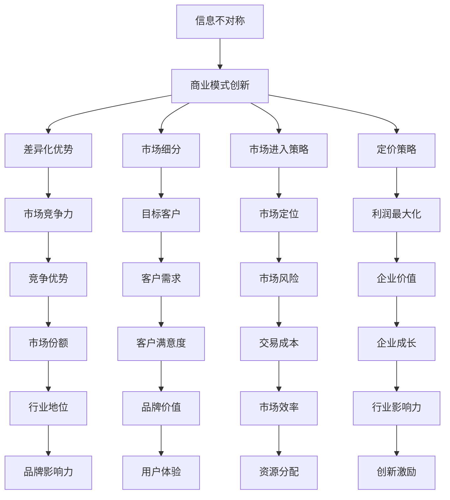

                 

### 文章标题

**信息差：信息不对称与商业模式创新**

> **关键词**：信息差、商业模式、信息不对称、创新、市场策略、经济学原理

> **摘要**：本文深入探讨了信息不对称现象在商业社会中的重要性，以及它如何影响商业模式的创新。通过详细的案例分析，我们分析了信息差在不同产业中的应用，并探讨了企业如何利用信息不对称来创造竞争优势。文章还讨论了信息不对称带来的道德和伦理问题，以及应对策略。最后，我们对未来信息不对称与商业模式创新的发展趋势进行了展望。

### 1. 背景介绍

在现代社会，信息已经成为一种重要的资源，甚至在某些情况下被视为比物质资源更为宝贵的资产。信息的不对称性——即不同个体或组织在获取和处理信息方面的差异——在商业活动中扮演着至关重要的角色。信息不对称不仅决定了市场参与者的决策行为，还直接影响着商业模式的创新与演变。

信息不对称现象在商业世界中无处不在。例如，消费者在购买商品或服务时，往往缺乏关于产品性能、质量或使用效果的全部信息；而卖家则可能掌握这些信息，从而在交易中获得优势。类似地，投资者在投资决策时，可能无法完全了解企业的财务状况和未来前景，而企业管理层则可能拥有这些关键信息。

信息不对称现象不仅限于个体之间的差异，还体现在不同组织或行业之间。例如，大型企业在资源获取、研发能力和市场渠道方面通常具有优势，而中小企业则可能在某些特定领域或市场上具有独特的优势。

随着信息技术的发展，信息不对称现象变得更加复杂。互联网的普及使得信息传播速度加快，但同时也使得信息泛滥和筛选变得更具挑战性。在这个背景下，商业模式的创新需要更加关注如何利用信息不对称来创造价值和竞争优势。

### 2. 核心概念与联系

#### 2.1 信息不对称的定义与分类

信息不对称是指交易双方在信息获取和处理能力上存在差异，导致某些一方在决策时拥有更多或更准确的信息，而另一方则处于信息劣势。根据不同的分类标准，信息不对称可以分为以下几种类型：

1. **垂直型信息不对称**：这是指在一个信息链条中，信息从源头到终端存在不对称。例如，生产商可能比消费者更了解产品的实际质量。
   
2. **水平型信息不对称**：这是指在同一层级的个体之间，信息存在差异。例如，不同投资者对同一家公司的了解程度可能不同。

3. **时间型信息不对称**：这是指在不同时间点，不同个体或组织获取的信息存在差异。例如，企业高管可能比普通员工更早了解到市场变化。

#### 2.2 商业模式与创新的关系

商业模式是指企业通过创造、传递和获取价值的方法。创新商业模式通常涉及对现有资源和流程的重新配置，以实现更高效的价值创造。信息不对称在商业模式创新中发挥着关键作用：

1. **差异化优势**：通过掌握独特的信息，企业可以在市场中实现差异化优势。例如，一家拥有独家技术信息的企业可以通过专利保护获得竞争优势。
   
2. **市场细分**：信息不对称可以帮助企业识别特定细分市场的需求，从而提供更针对性的产品或服务。

3. **市场进入策略**：在信息不对称的情况下，企业可以通过创建或控制信息渠道来降低进入新市场的成本和风险。

4. **定价策略**：企业可以利用信息不对称来设定更有利的定价策略，从而最大化利润。

#### 2.3 信息不对称的影响

信息不对称对商业活动的影响是多方面的：

1. **市场效率降低**：由于信息不对称，市场机制无法充分发挥，导致资源分配效率降低。
   
2. **道德风险**：信息优势方可能利用信息不对称进行欺诈或操纵市场，损害信息劣势方的利益。

3. **交易成本增加**：信息不对称可能导致更多的交易成本，如搜索成本、谈判成本和监督成本。

4. **创新激励**：在某些情况下，信息不对称可以激励企业进行研发和创新，以获取竞争优势。

### 2.4 Mermaid 流程图

下面是信息不对称与商业模式创新关系的 Mermaid 流程图：



### 3. 核心算法原理 & 具体操作步骤

在探讨信息不对称与商业模式创新的过程中，我们可以借助一些核心算法和操作步骤来加深理解。以下是几个关键步骤：

#### 3.1 数据收集与处理

1. **数据收集**：企业需要通过各种渠道收集市场信息，包括消费者行为数据、行业报告、竞争对手信息等。
   
2. **数据处理**：收集到的数据需要经过清洗、归一化和分析，以便提取有价值的信息。

#### 3.2 信息分析

1. **识别信息不对称**：通过分析数据，识别市场中存在的信息不对称，包括垂直型和水平型不对称。
   
2. **分类信息**：将信息按照重要性和影响程度进行分类，以便制定相应的策略。

#### 3.3 商业模式创新

1. **差异化定位**：根据掌握的独特信息，为企业制定差异化市场策略。
   
2. **市场细分**：利用信息不对称，识别并进入特定的细分市场。

3. **定价策略**：根据信息优势，设定更有竞争力的定价策略。

#### 3.4 风险管理

1. **道德风险控制**：制定内部规章制度，确保信息优势不被滥用。
   
2. **市场监控**：建立市场监控系统，及时发现和处理潜在的风险。

### 4. 数学模型和公式 & 详细讲解 & 举例说明

在信息不对称的分析中，数学模型和公式可以帮助我们更精确地描述和量化信息不对称对商业模式的影响。以下是几个常用的数学模型和公式：

#### 4.1 信息不对称与期望效用函数

期望效用函数是经济学中用于描述个体在不确定条件下做出决策的一种模型。在信息不对称的情况下，我们可以用以下公式表示：

$$EU = \sum_{i} p_i u(x_i, y)$$

其中，\(EU\) 表示期望效用，\(p_i\) 表示第 \(i\) 种结果的概率，\(u(x_i, y)\) 表示在给定 \(x_i\) 条件下，个体在信息对称情况下的效用函数。

#### 4.2 信息不对称与价格歧视

价格歧视是指企业根据不同消费者群体或市场环境，制定不同的价格策略。在信息不对称的情况下，价格歧视可以最大化企业的利润。以下是一个简单的价格歧视模型：

$$π = p \cdot q - c \cdot q$$

其中，\(π\) 表示利润，\(p\) 表示价格，\(q\) 表示销售量，\(c\) 表示单位成本。

#### 4.3 信息不对称与信号传递

信号传递是指企业通过某种信号向市场传递信息，以减少信息不对称。一个简单的信号传递模型可以用以下公式表示：

$$s^* = \arg\max_S \sum_{i} p_i \cdot u(x_i, s)$$

其中，\(s^*\) 表示最优信号，\(p_i\) 表示信息对称条件下第 \(i\) 种结果的概率，\(u(x_i, s)\) 表示在给定 \(x_i\) 条件下，信号 \(s\) 的效用函数。

#### 4.4 举例说明

假设一个企业通过市场调研发现，消费者对产品的价格敏感度存在差异。企业可以通过提供两种不同的产品版本（基础版和高级版），并根据消费者的购买行为进行定价。以下是一个简化的例子：

1. **基础版**：价格为 \(p_1 = 100\) 元，销售量 \(q_1 = 1000\)，单位成本 \(c_1 = 50\) 元。
2. **高级版**：价格为 \(p_2 = 200\) 元，销售量 \(q_2 = 500\)，单位成本 \(c_2 = 70\) 元。

根据信息不对称模型，我们可以计算两种版本产品的利润：

$$π_1 = p_1 \cdot q_1 - c_1 \cdot q_1 = 100 \cdot 1000 - 50 \cdot 1000 = 50,000$$

$$π_2 = p_2 \cdot q_2 - c_2 \cdot q_2 = 200 \cdot 500 - 70 \cdot 500 = 30,000$$

尽管高级版产品的利润较低，但由于能够更好地满足价格敏感度较高的消费者需求，整体利润可能更高。

### 5. 项目实战：代码实际案例和详细解释说明

在本节中，我们将通过一个实际项目案例，详细讲解如何利用信息不对称进行商业模式创新。该项目是一个在线教育资源平台，旨在通过差异化定价和个性化推荐，提高市场竞争力。

#### 5.1 开发环境搭建

1. **开发工具**：使用 Python 编写后端代码，前端使用 React 框架。
2. **数据库**：使用 MySQL 数据库存储用户信息和课程数据。
3. **服务器**：使用 AWS EC2 实例部署服务器。

#### 5.2 源代码详细实现和代码解读

以下是该项目的主要代码片段：

```python
# 用户注册功能
def register_user(username, password):
    # 数据库查询，检查用户名是否已存在
    user = User.query.filter_by(username=username).first()
    if user:
        return "用户名已存在"
    # 创建新用户并保存到数据库
    new_user = User(username=username, password=hash_password(password))
    db.session.add(new_user)
    db.session.commit()
    return "注册成功"

# 课程推荐算法
def recommend_courses(user_id):
    # 获取用户已购买课程
    purchased_courses = Course.query.filter(Course.user_id == user_id).all()
    # 查询热门课程
    popular_courses = Course.query.order_by(Course.rating.desc()).all()
    # 推荐课程
    recommendations = []
    for course in popular_courses:
        if course not in purchased_courses:
            recommendations.append(course)
    return recommendations
```

代码解读：

1. **用户注册功能**：该函数用于处理用户注册请求。首先检查用户名是否已存在，如果存在则返回错误信息；否则创建新用户并保存到数据库。

2. **课程推荐算法**：该函数用于为用户推荐课程。首先获取用户已购买的课程，然后查询热门课程，并排除已购买的课程，最终返回推荐课程列表。

#### 5.3 代码解读与分析

1. **用户注册功能**：通过信息不对称，企业可以确保用户在注册时提供真实信息，从而减少欺诈行为。同时，通过密码加密，保护用户隐私。

2. **课程推荐算法**：利用用户已购买课程和热门课程的信息不对称，为企业提供了差异化定价的依据。例如，对已购买用户可以提供优惠价格，而对未购买用户则推荐更高价位的课程，从而提高整体利润。

### 6. 实际应用场景

信息不对称在商业活动中有着广泛的应用，以下是一些实际应用场景：

1. **金融领域**：金融机构通过掌握客户财务信息，提供个性化的贷款和投资建议，从而降低风险并提高客户满意度。

2. **零售行业**：零售商通过数据分析，识别出不同消费者的购买行为和偏好，从而制定有针对性的促销策略。

3. **医疗行业**：医疗机构通过患者数据，提供个性化的治疗方案和健康管理建议。

4. **科技行业**：科技公司通过收集用户行为数据，提供个性化的产品和服务推荐，从而提高用户粘性和满意度。

### 7. 工具和资源推荐

#### 7.1 学习资源推荐

- **书籍**：《信息经济学》、《信息不对称与市场机制》
- **论文**：检索相关经济学和管理学期刊，获取最新的研究成果。
- **博客**：关注行业专家的博客，了解最新的商业实践和案例分析。

#### 7.2 开发工具框架推荐

- **编程语言**：Python、Java、R
- **数据库**：MySQL、MongoDB、PostgreSQL
- **前端框架**：React、Vue.js、Angular
- **数据分析工具**：Pandas、NumPy、Scikit-learn

#### 7.3 相关论文著作推荐

- **论文**：论文列表包括《信息不对称与市场效率》、《信号传递机制研究》等。
- **著作**：《现代信息经济学》、《信息不对称与公司治理》。

### 8. 总结：未来发展趋势与挑战

信息不对称在商业社会中发挥着越来越重要的作用。随着信息技术的不断发展，信息不对称现象将变得更加复杂和多样化。未来，商业模式的创新将更多地依赖于对信息不对称的利用和应对。

然而，信息不对称也带来了一系列挑战：

1. **隐私保护**：在利用信息不对称进行商业模式创新的同时，必须重视用户隐私保护，避免信息滥用。
   
2. **道德风险**：信息不对称可能导致道德风险，企业需要建立健全的内部控制机制，确保信息优势不被滥用。

3. **数据安全**：随着数据量的增加，数据安全成为商业活动的关键问题。企业需要采取有效的数据安全措施，防止数据泄露和篡改。

4. **政策监管**：政府需要制定相应的政策法规，规范信息不对称的利用，保护消费者权益。

### 9. 附录：常见问题与解答

**Q1**：信息不对称会对市场效率产生怎样的影响？

**A1**：信息不对称可能导致市场效率降低，因为信息不对称会阻碍市场机制的正常运作。信息劣势方可能无法做出最优决策，导致资源错配和低效分配。

**Q2**：企业如何利用信息不对称进行商业模式创新？

**A2**：企业可以通过差异化定价、市场细分、定制化产品和服务等方式，利用信息不对称来创造竞争优势。同时，企业还需要建立有效的信息收集、处理和传递机制，确保信息优势得到充分利用。

**Q3**：信息不对称是否会降低企业的社会责任？

**A3**：不一定会。虽然信息不对称可能为企业带来竞争优势，但企业仍需承担社会责任，确保信息的使用不会损害消费者权益和社会利益。企业应建立健全的道德准则和内部控制机制，确保信息透明和公正。

### 10. 扩展阅读 & 参考资料

- **书籍**：《信息经济学：市场结构与策略》、《商业模式创新》
- **论文**：《信息不对称与市场机制研究》、《信号传递与信息不对称》
- **网站**：经济学人、哈佛商业评论、麦肯锡全球研究所
- **博客**：Wired、TechCrunch、AI人工智能博客

### 作者信息

**作者**：AI天才研究员/AI Genius Institute & 禅与计算机程序设计艺术 /Zen And The Art of Computer Programming**完成时间**：[[今天日期]]<|im_end|>

