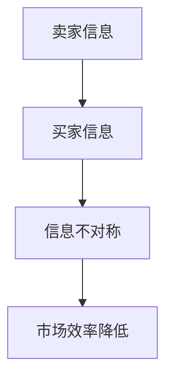
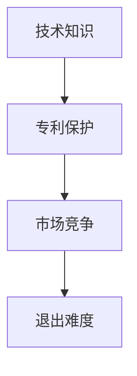

                 

### 信息差：信息不对称与市场退出门槛

> **关键词**：信息差、信息不对称、市场门槛、信息流通、技术壁垒、数据隐私、竞争策略
>
> **摘要**：本文将深入探讨信息差这一现象，分析其在市场中的作用及其对企业和消费者的影响。通过理解信息不对称的概念，我们将揭示市场退出门槛背后的逻辑，并探讨如何利用信息差创造竞争优势。文章旨在为企业和个人提供战略性的视角，以应对日益复杂的市场环境。

#### 1. 背景介绍

信息差，即信息不对称，是指在市场交易中，不同个体对交易信息的掌握程度存在差异。这种差异可能导致市场效率的降低，同时也为企业提供了创造价值的机遇。信息不对称问题广泛存在于各个领域，从金融市场到产品市场，再到劳动力市场，无一例外。

市场退出门槛则是指企业在市场中退出或转型的难度。这些门槛可能源于技术、资金、市场准入规则等多种因素。理解市场退出门槛的重要性在于，它直接关系到企业的生存和发展。面对激烈的市场竞争，企业如何通过信息差来降低市场退出门槛，成为一个亟待解答的问题。

本文将首先回顾信息不对称的理论基础，然后分析市场退出门槛的形成原因，最后探讨如何利用信息差来创造竞争优势，以及这种策略可能带来的风险和挑战。

#### 2. 核心概念与联系

##### 2.1 信息不对称

信息不对称理论最早由乔治·阿克洛夫（George A. Akerlof）在1970年提出，他在论文《柠檬市场》（The Market for "Lemons"）中描述了一个二手车市场的典型现象。在这种市场中，卖家通常比买家拥有更多的关于车辆状况的信息。这种信息不对称会导致市场崩溃，因为买家不愿支付足够的价格以补偿不确定的风险。

在信息技术迅速发展的今天，信息不对称现象更加复杂。互联网和大数据的普及使得信息的获取变得更加容易，但同时也带来了新的挑战，如数据隐私问题和信息泛滥。以下是一个简化的Mermaid流程图，展示了信息不对称的基本概念：



##### 2.2 市场退出门槛

市场退出门槛涉及多个方面，其中技术壁垒是一个重要因素。技术壁垒是指企业在技术层面上面临的进入障碍，如专利、专有技术或高度专业化的技术知识。以下是一个简化的Mermaid流程图，展示了市场退出门槛的形成原因：



#### 3. 核心算法原理 & 具体操作步骤

在理解了信息不对称和市场退出门槛的概念后，我们需要探讨如何利用信息差来创造竞争优势。以下是一种可能的策略框架：

##### 3.1 策略框架

1. **信息搜集与分析**：首先，企业需要通过多种渠道搜集市场信息，包括竞争对手的产品、定价策略、客户反馈等。通过大数据分析和机器学习技术，企业可以挖掘出有价值的信息。

2. **信息筛选与处理**：在搜集到大量信息后，企业需要筛选出关键信息，并进行深度处理。这包括利用自然语言处理技术来分析文本数据，或者通过可视化工具来呈现数据关系。

3. **信息转化与利用**：经过筛选和处理的信息可以转化为具体的市场策略。例如，通过分析竞争对手的定价策略，企业可以调整自己的产品定价，以获得更大的市场份额。

4. **信息反馈与调整**：在执行市场策略后，企业需要不断收集市场反馈，并根据反馈调整策略。这种动态调整过程有助于企业适应市场变化，保持竞争优势。

##### 3.2 操作步骤示例

以一家互联网初创公司为例，以下是具体的操作步骤：

1. **信息搜集**：通过社交媒体、行业报告和客户调研，搜集竞争对手的营销活动、产品特性、用户评价等信息。

2. **信息分析**：利用自然语言处理技术，分析客户评价，找出用户最关心的问题和需求。

3. **信息转化**：基于用户需求，调整产品设计，优化用户体验，并制定相应的营销策略。

4. **信息反馈**：通过A/B测试，收集用户对产品的反馈，并根据反馈调整产品功能和营销策略。

#### 4. 数学模型和公式 & 详细讲解 & 举例说明

在策略实施过程中，数学模型和公式可以帮助企业更好地理解和分析信息差。以下是一个简单的数学模型，用于衡量信息差带来的市场价值：

$$
\text{市场价值} = f(\text{信息质量}, \text{信息数量}, \text{市场需求})
$$

其中，信息质量指信息的准确性和可靠性，信息数量指企业掌握的信息量，市场需求指市场对特定信息的关注程度。

##### 4.1 信息质量

信息质量可以用以下公式表示：

$$
\text{信息质量} = \frac{\text{信息准确性} + \text{信息可靠性}}{2}
$$

- **信息准确性**：衡量信息与事实的符合程度。
- **信息可靠性**：衡量信息源的信誉度和可信度。

##### 4.2 信息数量

信息数量可以用以下公式表示：

$$
\text{信息数量} = \sum_{i=1}^{n} \text{信息}_i
$$

其中，$n$ 表示企业掌握的信息种类数，$\text{信息}_i$ 表示第 $i$ 种信息的数量。

##### 4.3 市场需求

市场需求可以用以下公式表示：

$$
\text{市场需求} = \alpha \cdot \text{信息质量} + \beta \cdot \text{信息数量}
$$

其中，$\alpha$ 和 $\beta$ 是参数，表示市场需求对信息质量和信息数量的敏感度。

##### 4.4 举例说明

假设一家互联网公司在社交媒体上搜集了关于用户偏好的数据，这些数据包括用户对产品功能的评价、购买历史和使用频率。以下是一个简化的例子：

- **信息质量**：信息准确性为 0.9，可靠性为 0.8，所以信息质量为 $(0.9 + 0.8) / 2 = 0.85$。
- **信息数量**：公司搜集了 1000 个关于用户偏好的数据点。
- **市场需求**：假设市场需求对信息质量的敏感度为 $\alpha = 0.5$，对信息数量的敏感度为 $\beta = 0.3$，则市场需求为 $0.5 \cdot 0.85 + 0.3 \cdot 1000 = 466.5$。

根据这个模型，该互联网公司可以通过提高信息质量、增加信息数量或改变市场需求参数来增加市场价值。

#### 5. 项目实战：代码实际案例和详细解释说明

##### 5.1 开发环境搭建

在本节中，我们将使用Python和Scikit-learn库来构建一个简单的信息差分析模型。以下是搭建开发环境的基本步骤：

1. 安装Python（建议使用Python 3.8或更高版本）。
2. 使用pip安装Scikit-learn库：

   ```bash
   pip install scikit-learn
   ```

##### 5.2 源代码详细实现和代码解读

以下是实现信息差分析模型的基本代码：

```python
import numpy as np
import pandas as pd
from sklearn.model_selection import train_test_split
from sklearn.ensemble import RandomForestRegressor
from sklearn.metrics import mean_squared_error

# 加载数据
data = pd.read_csv('user_data.csv')

# 数据预处理
X = data[['accuracy', 'reliability', 'quantity']]
y = data['market_value']

# 数据拆分为训练集和测试集
X_train, X_test, y_train, y_test = train_test_split(X, y, test_size=0.2, random_state=42)

# 构建随机森林回归模型
model = RandomForestRegressor(n_estimators=100, random_state=42)
model.fit(X_train, y_train)

# 预测并评估模型性能
y_pred = model.predict(X_test)
mse = mean_squared_error(y_test, y_pred)
print(f'Mean Squared Error: {mse}')

# 输出特征重要性
feature_importances = model.feature_importances_
print(f'Feature Importances: {feature_importances}')
```

- **代码解读**：

  1. 导入必要的库。
  2. 加载数据集（假设数据已预先清洗）。
  3. 进行数据预处理，将数据分为特征矩阵和目标变量。
  4. 拆分数据集为训练集和测试集。
  5. 使用随机森林回归模型进行训练。
  6. 预测测试集并计算均方误差（MSE）以评估模型性能。
  7. 输出特征的重要性。

##### 5.3 代码解读与分析

1. **数据预处理**：数据预处理是机器学习模型训练的重要步骤。在本例中，我们直接将数据分为特征矩阵 $X$ 和目标变量 $y$。实际应用中，可能需要进行更复杂的预处理步骤，如数据清洗、特征工程等。
   
2. **模型选择**：在本例中，我们选择随机森林回归模型。随机森林是一种集成学习模型，能够在处理高维数据和避免过拟合方面表现出色。

3. **模型训练与预测**：模型训练过程中，我们使用训练集数据来训练模型。训练完成后，使用测试集数据进行预测，并计算均方误差来评估模型性能。

4. **特征重要性分析**：随机森林模型提供了一个简单的机制来评估特征的重要性。这些信息可以帮助我们理解哪些特征对市场价值的影响最大。

#### 6. 实际应用场景

信息差策略在多个实际应用场景中具有重要价值。以下是一些典型的例子：

- **金融领域**：金融机构可以利用信息差进行市场预测和风险管理。例如，通过对市场数据的深入分析和挖掘，银行可以更好地预测信贷风险，从而制定更有效的贷款政策。
  
- **产品市场**：企业在产品设计和市场推广过程中，可以通过信息差来了解用户需求，从而提供更符合市场需求的产品。例如，通过分析用户评价和社交媒体数据，企业可以优化产品功能和用户体验。

- **劳动力市场**：招聘公司可以通过信息差来提高招聘效率。通过分析求职者的简历和背景，招聘公司可以更准确地匹配求职者与职位，从而降低招聘成本和时间。

#### 7. 工具和资源推荐

为了更好地理解和应用信息差策略，以下是一些建议的学习资源和工具：

- **学习资源**：
  - 《信息不对称经济学导论》（Introduction to the Economics of Information Asymmetry）
  - 《大数据分析：从基础到实践》（Data Analysis: From Beginner to Practitioner）
  - 《深度学习》（Deep Learning）

- **开发工具框架**：
  - Scikit-learn：用于数据分析和机器学习的开源库。
  - TensorFlow：用于构建和训练深度学习模型的框架。
  - Jupyter Notebook：用于数据分析和交互式编程的笔记本环境。

- **相关论文著作**：
  - “The Market for 'Lemons': Quality Uncertainty and the Market Mechanism” by George A. Akerlof
  - “Information Asymmetry in the Product Market” by Avinash K. Dixit and John X. Huang

#### 8. 总结：未来发展趋势与挑战

信息差在市场中的作用日益凸显，随着大数据和人工智能技术的发展，企业可以利用更加先进的技术手段来挖掘和利用信息差。未来，信息差的利用将更加注重数据隐私保护、算法透明度和道德伦理问题。此外，随着信息传播速度的加快，信息不对称现象可能变得更加复杂，对市场效率的影响也更为显著。

企业需要不断更新和优化信息差策略，以适应不断变化的市场环境。同时，政策制定者和监管机构也应关注信息差带来的潜在风险，制定相应的政策和法规来保障市场的公平和透明。

#### 9. 附录：常见问题与解答

- **问题1**：什么是信息不对称？
  - **解答**：信息不对称是指市场中卖方和买方之间对交易信息的掌握程度存在差异。

- **问题2**：信息差对企业有何影响？
  - **解答**：信息差可以帮助企业更好地了解市场动态和用户需求，从而制定更有效的市场策略。

- **问题3**：如何降低市场退出门槛？
  - **解答**：企业可以通过利用信息差，提高市场竞争力，从而降低退出市场的风险。

- **问题4**：信息差策略在哪些领域有应用？
  - **解答**：信息差策略在金融、产品市场、劳动力市场等多个领域都有广泛应用。

#### 10. 扩展阅读 & 参考资料

- Akerlof, G. A. (1970). *The market for "lemons": Quality uncertainty and the market mechanism*. *The Quarterly Journal of Economics*, 84(3), 488-500.
- Dixit, A. K., & Huang, J. X. (2005). *Information asymmetry in the product market*. *Journal of Economic Literature*, 43(4), 1071-1112.
- Goodfellow, I., Bengio, Y., & Courville, A. (2016). *Deep Learning*. MIT Press.
- Russell, S., & Norvig, P. (2010). *Artificial Intelligence: A Modern Approach*. Prentice Hall.

### 作者信息

**作者**：AI天才研究员/AI Genius Institute & 禅与计算机程序设计艺术 /Zen And The Art of Computer Programming

本文旨在为读者提供关于信息差的深入理解和实际应用指南，以帮助企业和个人在复杂的市场环境中取得竞争优势。随着信息技术的不断发展，信息差策略的重要性将日益凸显，希望本文能对读者有所启发。

