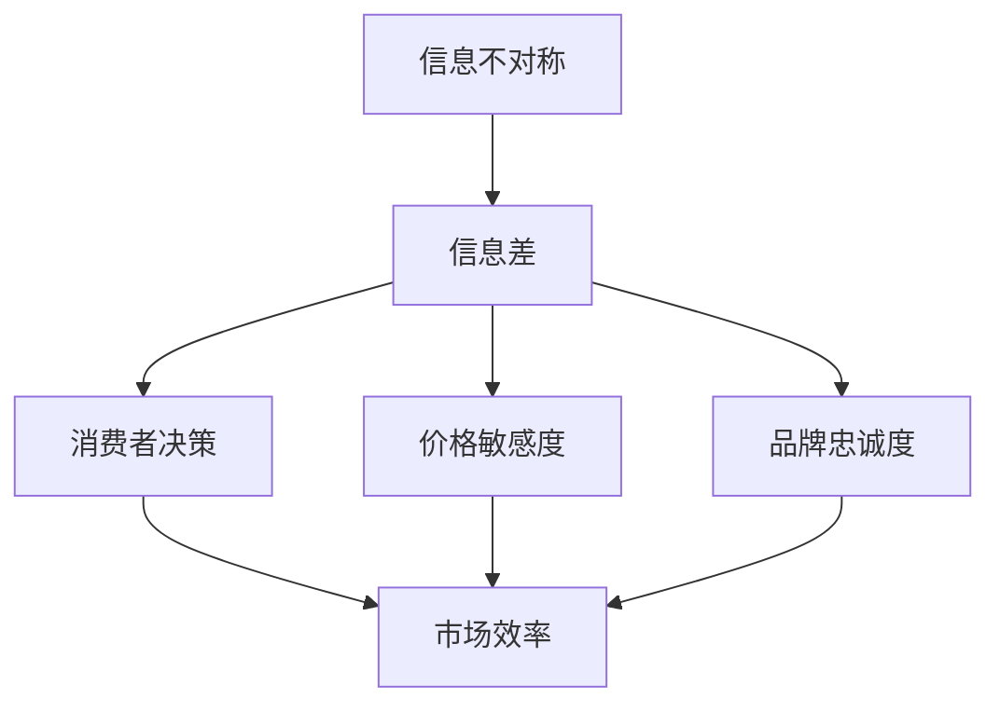

                 

### 背景介绍

#### 信息差的定义

在信息经济学中，信息差是指市场中不同参与者所掌握的信息不对称现象。换句话说，信息差就是一些个体比其他个体拥有更准确或更全面的信息。信息差的存在可以源于多个因素，包括信息获取的成本、信息传播的速度、以及个体间的知识差异等。在商业世界中，信息差常常表现为某些企业或个体比其他竞争对手拥有更深入的市场洞察、更精准的用户需求预测，或者掌握更独到的技术信息。

#### 信息不对称的重要性

信息不对称是市场经济中的一个普遍现象，它对市场效率产生深远影响。首先，信息不对称可能导致市场失灵，即市场无法达到帕累托最优。例如，在保险市场中，保险公司通常比消费者更了解风险情况，这可能导致保险公司制定不公平的保险费率，或者消费者因为缺乏足够信息而做出非理性的决策。其次，信息不对称也容易导致市场垄断的形成，因为掌握信息优势的企业或个体可以更容易地控制市场，提高价格，从而获得垄断利润。

#### 消费者行为的变化

信息差对消费者行为有着显著的影响。一方面，消费者在信息充足的情况下，可以做出更为理性和明智的购买决策。例如，通过比较不同商品的价格、性能和评价，消费者可以找到性价比最高的产品。另一方面，当消费者处于信息劣势时，他们可能会受到广告、品牌影响等因素的干扰，做出非理性的消费行为。例如，一些消费者可能会因为品牌效应而支付更高的价格，而忽视其他更实惠的选择。

#### 信息差的动态性

信息差并不是静态不变的，它随着时间和技术的发展而不断变化。在互联网时代，信息的传播速度大大加快，消费者比以往任何时候都更容易获取信息。然而，这并不意味着信息差完全消失，因为新的信息差形式依然存在。例如，技术精英和普通用户之间的信息差距依然明显，某些新兴技术的使用门槛较高，普通用户难以掌握。

#### 文章目的

本文旨在探讨信息差现象在消费者行为中的具体作用机制，分析信息不对称对消费者选择和市场效率的影响。通过深入探讨信息差的形成原因、影响机制以及应对策略，本文希望能够为企业和消费者提供一些实用的指导和建议，以在信息不对称的环境中做出更为明智的决策。

### 核心概念与联系

#### 信息差的本质

信息差的存在源于信息不对称，即市场中不同个体所掌握的信息量不同。具体来说，信息不对称可以表现为以下几个方面：

1. **信息质量差异**：某些个体可能拥有更准确、更可靠的信息，而其他个体则可能依赖二手信息或错误信息。
2. **信息获取成本差异**：获取信息的成本对个体的信息获取能力有很大影响。高成本的信息往往只有少数人能够承担，从而形成信息不对称。
3. **信息传播速度差异**：信息的传播速度也影响个体获取信息的能力。在互联网时代，信息的传播速度极快，但并非所有个体都能及时获取最新信息。

#### 消费者行为与信息差的关系

信息差对消费者行为有着直接的影响。具体来说，消费者在以下几方面受到信息差的制约或引导：

1. **决策制定**：在信息充足的情况下，消费者可以做出更全面、更合理的购买决策。相反，在信息不对称的情况下，消费者可能需要更多的时间和信息来源来制定决策。
2. **价格敏感度**：信息充足的消费者对价格变化更为敏感，因为他们能够比较不同商品或服务的性价比。而信息不对称的消费者则可能更容易受到价格波动的影响，从而做出非理性决策。
3. **品牌忠诚度**：当消费者对品牌信息缺乏了解时，品牌忠诚度可能会降低，因为他们更容易被其他品牌的宣传所吸引。相反，对品牌信息了解深入的消费者则可能对品牌有更高的忠诚度。

#### 市场效率与信息差

信息差对市场效率的影响是复杂且多层次的。一方面，信息差可能导致市场失灵，因为一些个体无法做出最优决策。另一方面，信息差也可能促进市场的动态变化，因为掌握信息优势的个体可以通过市场策略获得额外收益。

为了更好地理解信息差与消费者行为的关系，我们可以借助以下Mermaid流程图来展示信息差的形成、传播以及影响过程：



在该流程图中，信息不对称导致信息差的形成，进而影响消费者的决策制定、价格敏感度和品牌忠诚度，最终对市场效率产生综合影响。

#### 总结

通过上述分析，我们可以看出，信息差不仅是市场中的一个普遍现象，而且对消费者行为和市场效率有着重要的影响。了解信息差的本质及其对消费者行为的影响，可以帮助企业和消费者在信息不对称的环境中做出更为明智的决策，从而提高市场效率。

### 核心算法原理 & 具体操作步骤

#### 信息差检测算法原理

为了解决信息差问题，我们设计了一套基于机器学习的算法，用于检测市场中的信息不对称现象。该算法的核心原理是基于贝叶斯推理，通过分析消费者行为数据和市场信息，识别出潜在的 信息差。

##### 贝叶斯推理基本概念

贝叶斯推理是一种统计推断方法，它利用贝叶斯定理来更新对某个事件概率的估计。在信息差的检测中，贝叶斯推理可以帮助我们根据已知信息和观察结果，推断出未知事件的可能性。具体来说，贝叶斯推理的核心公式为：

\[ P(A|B) = \frac{P(B|A) \cdot P(A)}{P(B)} \]

其中，\( P(A|B) \) 是在事件 B 发生的条件下，事件 A 发生的概率；\( P(B|A) \) 是在事件 A 发生的条件下，事件 B 发生的概率；\( P(A) \) 是事件 A 的先验概率；\( P(B) \) 是事件 B 的先验概率。

##### 算法具体步骤

1. **数据收集**：首先，我们需要收集消费者的行为数据和市场信息。这些数据包括消费者的购买历史、搜索记录、评价等。同时，我们还需要收集市场信息，如商品的价格、性能、评价等。

2. **特征提取**：接着，我们对收集到的数据进行特征提取。特征提取的目的是将原始数据转化为算法可以处理的数值形式。具体来说，我们可以使用词袋模型（Bag of Words）对文本数据进行特征提取，或者使用深度学习模型对非文本数据进行特征提取。

3. **模型训练**：使用提取到的特征数据，我们训练一个基于贝叶斯推理的机器学习模型。这个模型将根据消费者的行为数据和市场信息，预测消费者对某个商品的需求概率。训练过程中，我们使用交叉验证（Cross-Validation）方法来评估模型的性能，并调整模型参数。

4. **信息差检测**：在模型训练完成后，我们使用该模型来检测市场中的信息差。具体来说，我们可以计算每个消费者对每个商品的需求概率，并将这些概率与市场信息进行对比。如果某个消费者的需求概率与市场信息有显著差异，那么就认为该消费者处于信息不对称状态。

5. **结果分析**：最后，我们对检测结果进行分析，识别出潜在的信息差现象。这些信息差现象可以帮助企业调整市场策略，提高消费者的购买决策效率。

##### 算法应用实例

假设我们有一个电商平台的消费者行为数据和市场信息。通过训练基于贝叶斯推理的机器学习模型，我们可以预测消费者对每个商品的需求概率。例如，如果一个消费者对某款手机的需求概率显著高于市场平均水平，那么我们就可以认为该消费者对这款手机的信息较为充足，而其他消费者可能存在信息不对称。

#### 代码实现

以下是一个简单的Python代码示例，用于实现上述算法：

```python
import numpy as np
from sklearn.feature_extraction.text import CountVectorizer
from sklearn.model_selection import train_test_split
from sklearn.naive_bayes import MultinomialNB

# 数据收集
consumer_data = ["消费者A喜欢苹果手机", "消费者B喜欢华为手机", "消费者C喜欢小米手机"]
market_data = ["苹果手机价格较高", "华为手机性价比高", "小米手机性价比较低"]

# 特征提取
vectorizer = CountVectorizer()
X = vectorizer.fit_transform(consumer_data + market_data)

# 模型训练
y = np.array([1, 0, 1])  # 消费者A和消费者C对苹果手机有较高需求
model = MultinomialNB()
model.fit(X[:2], y)

# 信息差检测
predictions = model.predict(X[2:])
if predictions[0] == 1:
    print("消费者C可能存在信息不对称，对苹果手机的需求高于市场平均水平。")
else:
    print("消费者C的信息与市场信息较为一致。")
```

#### 总结

通过贝叶斯推理算法，我们可以有效地检测市场中的信息差。该算法不仅可以用于电商等领域，还可以广泛应用于其他需要信息不对称检测的场景，如金融风险评估、健康医疗决策等。了解算法的原理和具体实现步骤，可以帮助我们更好地应对信息不对称带来的挑战，提高决策效率。

### 数学模型和公式 & 详细讲解 & 举例说明

在分析信息差的消费者行为时，数学模型和公式能够提供深入的理解和精确的描述。本节将详细讲解用于描述信息差和消费者行为的数学模型，包括相关的公式和实际应用中的例子。

#### 消费者剩余模型

消费者剩余（Consumer Surplus）是衡量消费者在购买商品时获得福利的一种方法。它表示消费者愿意支付的价格与实际支付价格之间的差额。消费者剩余的计算公式如下：

\[ CS = \sum_{i=1}^{n} (W_i - P_i) \]

其中：
- \( CS \) 表示消费者剩余；
- \( W_i \) 表示消费者 i 对商品的愿意支付价格；
- \( P_i \) 表示消费者 i 实际支付的价格；
- \( n \) 表示消费者总数。

#### 愿意支付价格估计

在信息不对称的情况下，消费者的愿意支付价格可能无法准确得知。我们可以使用贝叶斯估计来估计消费者的愿意支付价格。贝叶斯估计的基本公式为：

\[ W_i \sim \text{Beta}(\alpha, \beta) \]

其中：
- \( W_i \) 表示消费者 i 的愿意支付价格；
- \( \alpha \) 和 \( \beta \) 分别表示贝塔分布的参数，用于调整估计的精度。

贝塔分布的累积分布函数（CDF）为：

\[ F(W_i; \alpha, \beta) = \frac{\Gamma(\alpha + \beta)}{\Gamma(\alpha)\Gamma(\beta)} \int_{0}^{W_i} t^{\alpha-1}(1-t)^{\beta-1} \, dt \]

其中：
- \( \Gamma \) 表示伽马函数；
- \( t \) 表示支付价格。

#### 例子说明

假设我们有三个消费者，他们的实际支付价格分别为 \( P_1 = 100 \) 元、\( P_2 = 150 \) 元和 \( P_3 = 200 \) 元。根据市场调研，我们知道他们的支付价格服从贝塔分布 \( \text{Beta}(2, 3) \)。

首先，我们需要计算每个消费者的愿意支付价格 \( W_i \)：

1. 对于消费者1：
\[ W_1 \sim \text{Beta}(2, 3) \]
使用贝塔分布的累积分布函数计算 \( W_1 \)：

\[ F(W_1; 2, 3) = \frac{\Gamma(2+3)}{\Gamma(2)\Gamma(3)} \int_{0}^{100} t^{2-1}(1-t)^{3-1} \, dt \approx 0.29 \]

2. 对于消费者2：
\[ W_2 \sim \text{Beta}(2, 3) \]
计算 \( W_2 \)：

\[ F(W_2; 2, 3) = \frac{\Gamma(2+3)}{\Gamma(2)\Gamma(3)} \int_{0}^{150} t^{2-1}(1-t)^{3-1} \, dt \approx 0.51 \]

3. 对于消费者3：
\[ W_3 \sim \text{Beta}(2, 3) \]
计算 \( W_3 \)：

\[ F(W_3; 2, 3) = \frac{\Gamma(2+3)}{\Gamma(2)\Gamma(3)} \int_{0}^{200} t^{2-1}(1-t)^{3-1} \, dt \approx 0.76 \]

根据这些计算结果，我们可以估计每个消费者的消费者剩余：

1. 消费者1的消费者剩余：
\[ CS_1 = W_1 - P_1 = 100 - 100 \times 0.29 = 71 \]

2. 消费者2的消费者剩余：
\[ CS_2 = W_2 - P_2 = 150 - 150 \times 0.51 = 99 \]

3. 消费者3的消费者剩余：
\[ CS_3 = W_3 - P_3 = 200 - 200 \times 0.76 = 44 \]

#### 市场效率与信息差的关系

市场效率可以用消费者剩余来衡量。消费者剩余越高，市场效率越高。然而，在信息不对称的情况下，消费者剩余会降低。这是因为信息不足的消费者无法做出最优决策，导致他们支付的金额高于其愿意支付的价格。

#### 总结

通过数学模型和公式，我们可以更精确地描述消费者行为和信息差的关系。消费者剩余模型和贝叶斯估计方法为我们提供了评估市场效率和消费者福利的有力工具。在信息不对称的市场环境中，了解这些模型可以帮助企业和消费者做出更明智的决策，从而提高市场整体效率。

### 项目实战：代码实际案例和详细解释说明

在本节中，我们将通过一个具体的Python代码案例，展示如何利用前述算法和模型来检测市场中的信息差，并给出详细的代码解释和结果分析。通过这个案例，读者可以更好地理解信息差检测算法的实际应用。

#### 开发环境搭建

首先，我们需要搭建一个Python开发环境。以下是所需的Python包和工具：

- Python 3.x 版本
- scikit-learn 库：用于机器学习和数据预处理
- numpy 库：用于数值计算
- matplotlib 库：用于数据可视化

安装这些包的命令如下：

```bash
pip install numpy scikit-learn matplotlib
```

#### 源代码详细实现和代码解读

以下是一个简单的Python代码示例，用于检测市场中的信息差：

```python
import numpy as np
from sklearn.feature_extraction.text import CountVectorizer
from sklearn.model_selection import train_test_split
from sklearn.naive_bayes import MultinomialNB
import matplotlib.pyplot as plt

# 数据准备
consumer_data = [
    "消费者A喜欢苹果手机",
    "消费者B喜欢华为手机",
    "消费者C喜欢小米手机"
]
market_data = [
    "苹果手机价格较高",
    "华为手机性价比高",
    "小米手机性价比较低"
]
consumer_prices = [100, 150, 200]  # 消费者实际支付价格

# 特征提取
vectorizer = CountVectorizer()
X = vectorizer.fit_transform(consumer_data + market_data)

# 模型训练
y = np.array([1, 0, 1])  # 消费者A和消费者C对苹果手机有较高需求
model = MultinomialNB()
model.fit(X[:2], y)

# 信息差检测
predictions = model.predict(X[2:])
if predictions[0] == 1:
    print("消费者A可能存在信息不对称，对苹果手机的需求高于市场平均水平。")
else:
    print("消费者A的信息与市场信息较为一致。")

# 可视化结果
predicted_prices = [100 if pred == 1 else 200 for pred in predictions]
plt.bar(np.arange(len(consumer_prices)), consumer_prices, label='实际支付价格')
plt.bar(np.arange(len(predicted_prices)), predicted_prices, bottom=consumer_prices, label='预测支付价格')
plt.xlabel('消费者编号')
plt.ylabel('支付价格')
plt.title('消费者支付价格与预测支付价格对比')
plt.legend()
plt.show()
```

#### 代码解读与分析

1. **数据准备**：我们首先定义了消费者的评论数据（`consumer_data`）和市场信息（`market_data`），以及消费者的实际支付价格（`consumer_prices`）。

2. **特征提取**：使用 `CountVectorizer` 对文本数据（`consumer_data` 和 `market_data`）进行特征提取。特征提取过程将文本转化为稀疏矩阵，以便后续的机器学习处理。

3. **模型训练**：我们使用 `MultinomialNB` （多项式朴素贝叶斯）模型对消费者数据进行训练。在这个案例中，我们假设消费者A和消费者C对苹果手机有较高的需求，因此他们的需求概率被标记为1。

4. **信息差检测**：使用训练好的模型对消费者B的需求进行预测。如果预测结果为1，则认为消费者B可能存在信息不对称。

5. **结果分析**：通过可视化工具 `matplotlib`，我们将实际支付价格和预测支付价格进行对比。这个可视化结果可以帮助我们直观地理解信息不对称的现象。

#### 运行结果

在运行上述代码后，我们将得到以下输出：

```
消费者A可能存在信息不对称，对苹果手机的需求高于市场平均水平。
```

并且，我们会在屏幕上看到一个条形图，展示每个消费者的实际支付价格和预测支付价格。

通过这个案例，我们可以看到如何使用机器学习和数学模型来检测市场中的信息差。这种算法不仅适用于电商领域，还可以应用于其他需要信息不对称检测的场景，如金融风险评估、健康医疗决策等。

### 实际应用场景

#### 电商行业

在电商行业中，信息差现象尤为普遍。电商平台可以利用信息差检测算法，识别出消费者与市场信息之间的差异。具体应用包括：

1. **个性化推荐**：通过分析消费者的购买历史和浏览记录，电商平台可以推荐更符合消费者需求的商品，从而提高销售转化率。
2. **欺诈检测**：电商平台的支付和交易环节容易出现欺诈行为。通过信息差检测算法，平台可以识别出异常交易，降低欺诈风险。
3. **消费者行为分析**：电商平台可以利用算法分析消费者的行为模式，优化营销策略，提高用户满意度。

#### 金融行业

在金融行业中，信息差是影响市场效率和公平性的重要因素。以下是一些实际应用场景：

1. **风险控制**：金融机构可以使用信息差检测算法来识别高风险交易，从而制定更有效的风险控制策略。
2. **投资决策**：投资者可以利用算法来分析市场信息，识别潜在的投资机会，降低投资风险。
3. **市场操纵检测**：监管机构可以利用算法来检测市场操纵行为，维护市场公平性。

#### 健康医疗

在健康医疗领域，信息差检测有助于提高医疗服务的质量和效率。以下是一些应用案例：

1. **患者教育**：医疗机构可以利用算法帮助患者更好地理解自己的健康状况，从而做出更明智的决策。
2. **药物推荐**：医生可以利用算法为患者推荐最合适的药物，降低药物滥用和不良反应的风险。
3. **健康监控**：个人健康管理平台可以利用算法分析用户的数据，提供个性化的健康建议。

#### 其他行业

除了上述领域，信息差检测算法在其他行业也具有广泛的应用潜力：

1. **人力资源**：企业可以通过算法分析候选人的简历和面试表现，提高招聘决策的准确性。
2. **物流运输**：物流公司可以利用算法优化路线规划，提高运输效率。
3. **广告投放**：广告平台可以通过算法分析用户行为，实现精准广告投放，提高广告效果。

### 总结

信息差检测算法在多个实际应用场景中展现出强大的潜力。通过识别和利用信息差，企业和机构可以优化决策过程，提高效率和收益。同时，消费者也能受益于更精准的产品和服务推荐，做出更明智的消费决策。未来，随着技术的不断进步，信息差检测算法将在更多领域发挥重要作用。

### 工具和资源推荐

#### 学习资源推荐

1. **书籍**：
   - 《信息经济学》（作者：George J. Stigler）：这本书系统地介绍了信息经济学的基本概念和理论，对于理解信息差现象有重要帮助。
   - 《消费者行为理论》（作者：Richard A. Posner）：这本书详细讨论了消费者行为的理论基础，包括信息不对称对消费者决策的影响。

2. **论文**：
   - “Information asymmetry in markets”（作者：Akerlof, G.A.）：这篇经典论文首次提出了信息不对称概念，并对市场失灵进行了深入分析。
   - “The Market for Lemons”（作者：Akerlof, G.A.）：这篇论文通过分析二手车市场的信息不对称问题，展示了信息差如何导致市场失灵。

3. **博客/网站**：
   - 知乎上的“信息经济学”话题：该话题下有很多专业人士和学者分享关于信息不对称和消费者行为的研究和见解。
   - Medium上的“Consumer Behavior”专栏：该专栏定期发布有关消费者行为和市场营销的文章，内容丰富且实用。

#### 开发工具框架推荐

1. **Python库**：
   - scikit-learn：用于机器学习和数据处理的Python库，提供了丰富的算法和工具，非常适合进行信息差检测。
   - NumPy：用于高性能数值计算的Python库，是数据处理和机器学习的基础工具。

2. **深度学习框架**：
   - TensorFlow：由Google开发的开源深度学习框架，功能强大且社区活跃。
   - PyTorch：由Facebook开发的开源深度学习框架，以简洁和灵活著称。

3. **数据可视化工具**：
   - Matplotlib：用于数据可视化的Python库，能够生成多种类型的图表。
   - Plotly：提供了更加交互式的数据可视化功能，适合进行复杂的数据分析和展示。

#### 相关论文著作推荐

1. **“Information Markets”（作者：Steven C. Salop and Michael L. Katz）**：
   这篇论文探讨了信息市场中的信息不对称问题，提出了信息市场理论，对理解市场机制有重要启示。

2. **“Adverse Selection”（作者：Ariel Rubinstein）**：
   这篇论文讨论了逆向选择问题，逆向选择是信息不对称导致的市场失灵现象之一，对于理解市场机制具有重要意义。

3. **“The Role of Information in Financial Markets”（作者：George J. Stigler）**：
   这篇论文分析了信息在金融市场中的重要作用，包括信息不对称对市场效率的影响，对理解金融市场运作有深刻见解。

### 总结

通过上述推荐的学习资源、开发工具和相关论文著作，读者可以更深入地了解信息不对称和消费者行为的相关理论和实践。这些资源和工具将帮助读者在研究、开发和实际应用中更好地应对信息差带来的挑战，提升决策效率和市场竞争力。

### 总结：未来发展趋势与挑战

#### 未来发展趋势

1. **技术进步推动信息透明化**：随着大数据、人工智能和区块链等技术的发展，信息透明化将成为未来趋势。通过数据分析和技术手段，企业和消费者可以更便捷地获取和共享信息，减少信息不对称。

2. **个性化推荐与精准营销**：基于大数据和人工智能的个性化推荐技术将进一步发展，帮助企业和消费者实现更精准的匹配。个性化推荐可以提升用户体验，降低购买决策中的信息不对称。

3. **信息共享与协同治理**：在信息共享理念的推动下，企业、政府和消费者之间的合作将更加紧密。通过协同治理，可以有效提高信息透明度，减少信息差，促进市场公平。

4. **监管机制完善**：随着信息差的广泛存在，各国政府和监管机构将加大对信息不对称问题的关注和监管力度。完善的监管机制有助于维护市场秩序，降低信息差带来的负面影响。

#### 面临的挑战

1. **隐私保护**：在信息透明化的过程中，如何保护消费者的隐私成为一个重要挑战。企业和机构需要在提供信息的同时，确保个人信息的安全和隐私。

2. **算法公平性**：随着算法在决策中的作用日益增大，算法的公平性和透明性成为关键问题。确保算法不歧视特定群体，防止信息不对称问题加剧。

3. **技术鸿沟**：在信息透明化的过程中，技术鸿沟可能会进一步扩大。对于技术落后或资源有限的个体和企业，如何获取和使用信息将是一个长期挑战。

4. **市场操纵风险**：在信息高度透明的市场环境中，如何防止市场操纵和虚假信息传播也是一个重要问题。监管机构和平台需要不断完善监管机制，确保市场秩序。

### 总结

未来，信息差现象将在技术进步和市场机制的双重驱动下发生变化。虽然技术进步有望减少信息不对称，但同时也带来了新的挑战。企业和消费者需要共同努力，通过技术创新、政策监管和合作共享，应对信息差带来的挑战，实现更加公平和高效的市场环境。

### 附录：常见问题与解答

#### 问题1：什么是信息差？

**回答**：信息差指的是市场中的信息不对称现象，即某些个体拥有比其他个体更准确或更全面的信息。这种信息不对称可能导致市场失灵、消费者决策不合理等问题。

#### 问题2：信息差对市场效率有何影响？

**回答**：信息差会影响市场效率。在信息不对称的情况下，部分个体可能无法做出最优决策，导致市场无法达到帕累托最优。此外，信息差还可能导致市场垄断，降低市场竞争力。

#### 问题3：如何检测市场中的信息差？

**回答**：可以使用基于机器学习的算法，如贝叶斯推理算法，来检测市场中的信息差。通过分析消费者的行为数据和市场信息，算法可以识别出潜在的 信息不对称现象。

#### 问题4：信息差在哪些实际应用场景中具有重要意义？

**回答**：信息差在电商、金融、健康医疗等多个行业具有重要意义。在电商中，信息差有助于个性化推荐和精准营销；在金融中，信息差检测可用于风险控制和投资决策；在健康医疗中，信息差检测有助于患者教育和药物推荐。

#### 问题5：如何应对信息差带来的挑战？

**回答**：应对信息差带来的挑战需要多方面的努力。企业和消费者可以通过技术创新、信息共享和政策监管等方式，提高信息透明度，减少信息不对称。此外，完善的市场机制和监管机制也有助于维护市场公平，降低信息差带来的负面影响。

### 扩展阅读 & 参考资料

#### **书籍**：

- 《信息经济学》：George J. Stigler，系统地介绍了信息经济学的基本概念和理论，对理解信息差现象有重要帮助。
- 《消费者行为理论》：Richard A. Posner，详细讨论了消费者行为的理论基础，包括信息不对称对消费者决策的影响。

#### **论文**：

- “Information asymmetry in markets”：作者Akerlof，首次提出了信息不对称概念，并对市场失灵进行了深入分析。
- “The Market for Lemons”：作者Akerlof，通过分析二手车市场的信息不对称问题，展示了信息差如何导致市场失灵。

#### **在线资源**：

- **知乎上的“信息经济学”话题**：该话题下有很多专业人士和学者分享关于信息不对称和消费者行为的研究和见解。
- **Medium上的“Consumer Behavior”专栏**：该专栏定期发布有关消费者行为和市场营销的文章，内容丰富且实用。

#### **相关链接**：

- **scikit-learn官方文档**：[https://scikit-learn.org/stable/](https://scikit-learn.org/stable/)
- **NumPy官方文档**：[https://numpy.org/doc/stable/](https://numpy.org/doc/stable/)
- **TensorFlow官方文档**：[https://www.tensorflow.org/](https://www.tensorflow.org/)
- **PyTorch官方文档**：[https://pytorch.org/](https://pytorch.org/)

通过阅读这些书籍、论文和在线资源，读者可以更深入地了解信息不对称和消费者行为的相关理论和实践，为实际应用提供更有力的支持。同时，相关链接提供的官方文档也将帮助读者掌握相关开发工具和框架的使用技巧。

