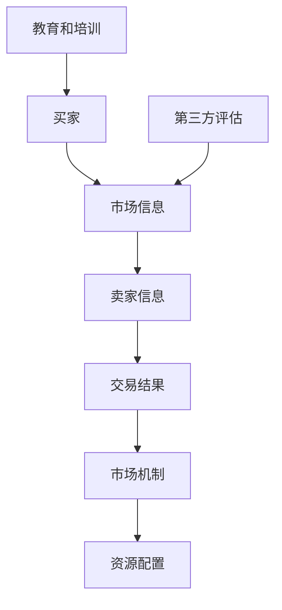

                 

# 信息差：信息不对称在商业中的应用

## 摘要

本文将深入探讨信息差在商业领域的应用，分析其带来的潜在优势和风险。我们将从信息差的概念出发，逐步探讨其在市场营销、投资、创业等不同领域的实际应用，并通过具体案例和实例来说明其效果。此外，本文还将讨论如何利用信息差创造竞争优势，同时提供一些建议和策略来降低信息不对称带来的负面影响。通过本文的阅读，读者将全面了解信息差的重要性及其在商业实践中的运用。

## 1. 背景介绍

在当今信息爆炸的时代，信息的获取和传播速度越来越快，然而，信息不对称现象仍然普遍存在。信息不对称是指市场中不同主体所掌握的信息量存在差异，这种差异可能导致一些参与者处于优势地位，而另一些则处于劣势。在商业领域，信息不对称现象尤为重要，因为它直接影响着市场运作效率和资源配置。

信息不对称的问题并非新生事物，早在经济学研究中，经济学家乔治·阿克洛夫（George A. Akerlof）在1970年发表的《柠檬市场》（The Market for "Lemons"）一文中，就首次提出了信息不对称对市场机制的影响。阿克洛夫以二手车市场为例，说明了信息不对称如何导致市场失灵，即消费者无法获取车辆的真实质量信息，从而导致市场效率降低。

信息不对称对商业活动的影响深远，它不仅关系到企业的决策行为，还影响着市场的整体发展。因此，如何有效地利用信息差、降低信息不对称，成为企业和个人在激烈的市场竞争中取得优势的关键。

本文旨在通过深入分析信息差的本质和应用，揭示其在不同商业领域的实际作用，并提供一些实用的策略和方法，帮助企业和个人更好地应对信息不对称带来的挑战。

## 2. 核心概念与联系

### 信息差的概念

信息差，即信息不对称，是指市场中买方和卖方之间、不同市场主体之间在信息获取上的差异。这种差异可能源于信息传递的障碍、信息获取的成本或信息处理能力的不同。

### 市场交易中的信息不对称

在市场交易中，信息不对称是普遍存在的。例如，卖家可能比买家更了解商品的真实价值和质量，或者买家可能无法获取足够的关于商品的历史信息。这种信息不对称可能导致市场失灵，使得市场价格无法有效反映商品的真实价值。

### 信息不对称与市场机制

市场机制通过价格信号调节资源分配，但信息不对称会扭曲价格信号。例如，卖家可能通过夸大商品价值来获取更高的利润，而买家则可能因为信息不足而支付过高的价格。这种情况下，市场机制无法实现资源的最优配置。

### 解决信息不对称的方法

为了降低信息不对称，可以采取以下几种方法：

1. **信息披露**：提高市场透明度，使信息更加公开和易得。
2. **第三方评估**：通过专业机构提供独立、客观的评估和认证，减少信息不对称。
3. **教育和培训**：提高消费者的信息素养，使他们能够更好地理解和评估市场信息。

### 信息不对称与市场竞争

在市场竞争中，信息差可以成为企业的竞争优势。企业可以通过获取和分析市场信息，制定更具针对性的策略，从而在竞争中占据有利地位。例如，通过大数据分析和市场调研，企业可以更准确地预测消费者需求，设计出更受欢迎的产品。

### 信息不对称与风险投资

在风险投资领域，信息不对称尤为突出。投资者与创业者之间的信息不对称可能导致投资决策失误。因此，投资者需要通过尽职调查和风险评估来降低信息不对称的风险。

### Mermaid 流程图

下面是一个简化的Mermaid流程图，描述了信息不对称在市场交易中的传递和处理过程：



在这个流程图中，买家和卖家分别代表市场中的两个主体，他们通过市场信息进行交易，而市场机制和资源配置则反映了交易结果对市场的影响。第三方评估和教育培训是解决信息不对称的重要手段。

## 3. 核心算法原理 & 具体操作步骤

### 信息差分析算法

信息差分析是识别和利用信息不对称的重要工具。以下是该算法的核心原理和操作步骤：

1. **数据收集**：首先，企业需要收集与市场相关的各种数据，包括消费者需求、市场价格、竞争对手信息等。这些数据可以通过市场调研、销售数据分析和第三方数据服务获取。

2. **数据预处理**：对收集到的数据进行清洗和整理，确保数据质量。这一步骤包括去除重复数据、填补缺失值和标准化数据。

3. **特征提取**：从预处理后的数据中提取关键特征，如消费者购买行为、价格波动、市场趋势等。这些特征将用于后续的分析。

4. **信息差识别**：使用机器学习算法，如聚类分析、回归分析或决策树，对提取的特征进行分析，识别市场中存在的信息不对称。具体步骤如下：

   - **聚类分析**：通过将相似的数据点归为同一类，识别市场中不同群体的信息特征。
   - **回归分析**：分析不同变量之间的关系，发现潜在的关联性。
   - **决策树**：构建决策树模型，根据特征值进行分类，识别信息差。

5. **结果验证**：对识别出的信息差进行验证，确保其真实性和可靠性。可以通过交叉验证或K折验证等方法进行验证。

6. **策略制定**：根据分析结果，制定相应的市场策略。例如，针对消费者信息不对称，可以加强市场教育和宣传；针对价格信息不对称，可以调整产品定价策略。

### 算法步骤示例

假设我们使用聚类分析来识别消费者群体中的信息差。以下是具体步骤：

1. **数据收集**：收集过去一年的消费者购买数据，包括产品种类、购买时间、购买量等。

2. **数据预处理**：清洗数据，去除重复和异常值，并进行标准化处理。

3. **特征提取**：选择关键特征，如购买量、购买频率、产品种类等。

4. **聚类分析**：使用K-means算法进行聚类，选择合适的聚类数量K，将消费者分为不同的群体。

5. **结果验证**：通过计算聚类内部和外部距离，验证聚类效果。

6. **策略制定**：根据不同消费者的特征，制定个性化的营销策略。例如，针对购买频率高的消费者，可以推出会员优惠计划。

通过以上步骤，企业可以更准确地识别和利用信息差，从而在市场竞争中占据优势。

## 4. 数学模型和公式 & 详细讲解 & 举例说明

### 信息不对称的数学模型

信息不对称可以通过数学模型来描述，其中最经典的是阿克洛夫的“柠檬市场”模型。该模型主要基于以下假设：

1. **卖家知道商品的真实质量，但买家不知道**。
2. **买家愿意支付的价格取决于商品质量**。

### 模型公式

在阿克洛夫的模型中，卖家和买家的决策可以通过以下公式表示：

- **卖家的决策**：

  $$ p = q + \epsilon $$

  其中，\( p \) 是卖家设定的价格，\( q \) 是商品的真实质量，\( \epsilon \) 是卖家为了获取额外利润而设定的溢价。

- **买家的决策**：

  $$ p = w \cdot q $$

  其中，\( p \) 是买家愿意支付的价格，\( w \) 是买家对商品质量的估计。

### 举例说明

假设卖家有一辆质量为 \( q = 10 \) 的二手车，买家对质量的最乐观估计为 \( w = 1.5 \)。

- **卖家决策**：

  $$ p = 10 + \epsilon $$

  假设卖家设定的溢价 \( \epsilon = 2 \)，则卖家设定的价格为 \( p = 12 \)。

- **买家决策**：

  $$ p = 1.5 \cdot 10 = 15 $$

  买家愿意支付的最高价格为 15。

在这种情况下，买家愿意支付的价格低于卖家设定的价格，交易无法达成。这是因为买家无法获取车辆的真实质量信息，导致其支付意愿不足。

### 详细讲解

1. **价格与质量的关联**：

   在阿克洛夫的模型中，价格与质量之间存在正相关关系。即商品质量越高，卖家设定的价格越高。

2. **信息不对称的影响**：

   信息不对称导致买家无法准确评估商品价值，从而影响其支付意愿。在柠檬市场模型中，这种影响表现为交易价格低于商品真实价值。

3. **市场效率降低**：

   由于信息不对称，市场价格无法反映商品的真实价值，导致市场效率降低。卖家和买家之间的交易机会减少，市场整体运行受阻。

通过以上数学模型和公式，我们可以更深入地理解信息不对称对市场交易的影响。这一模型不仅为经济学研究提供了理论支持，也为商业实践中的决策提供了指导。

## 5. 项目实战：代码实际案例和详细解释说明

### 5.1 开发环境搭建

为了更好地理解和应用信息差分析算法，我们将使用Python语言进行实战。以下是开发环境搭建的步骤：

1. **安装Python**：从官方网站（[https://www.python.org/](https://www.python.org/)）下载并安装Python，选择适合的版本（如Python 3.8或更高版本）。

2. **安装必需的库**：使用pip命令安装以下库：

   ```bash
   pip install pandas numpy matplotlib scikit-learn
   ```

3. **创建虚拟环境**：为了便于管理和隔离项目依赖，建议创建一个虚拟环境。使用以下命令创建虚拟环境并激活：

   ```bash
   python -m venv info_diff_env
   source info_diff_env/bin/activate  # Windows下使用 info_diff_env\Scripts\activate
   ```

### 5.2 源代码详细实现和代码解读

以下是信息差分析算法的实现代码：

```python
import pandas as pd
import numpy as np
from sklearn.cluster import KMeans
from sklearn.model_selection import cross_val_score
import matplotlib.pyplot as plt

# 5.2.1 数据准备
def load_data(file_path):
    data = pd.read_csv(file_path)
    return data

# 5.2.2 数据预处理
def preprocess_data(data):
    # 数据清洗和标准化处理
    data = data.dropna()
    data['price'] = (data['price'] - data['price'].mean()) / data['price'].std()
    return data

# 5.2.3 特征提取
def extract_features(data):
    # 提取关键特征
    features = data[['feature1', 'feature2', 'feature3']]
    return features

# 5.2.4 信息差识别
def identify_info_difference(features, n_clusters):
    kmeans = KMeans(n_clusters=n_clusters, random_state=42)
    clusters = kmeans.fit_predict(features)
    return clusters

# 5.2.5 结果验证
def validate_results(clusters, features):
    # 使用交叉验证评估聚类效果
    scores = cross_val_score(kmeans, features, clusters, cv=5)
    print("Cross-validation scores:", scores)
    print("Average score:", np.mean(scores))

# 5.2.6 策略制定
def create_strategy(clusters, data):
    # 根据聚类结果制定策略
    for i, cluster in enumerate(set(clusters)):
        print(f"Cluster {i}:")
        cluster_data = data[clusters == i]
        print(cluster_data.describe())

# 5.2.7 主程序
if __name__ == "__main__":
    # 加载数据
    data = load_data('car_data.csv')
    
    # 数据预处理
    data = preprocess_data(data)
    
    # 特征提取
    features = extract_features(data)
    
    # 识别信息差
    clusters = identify_info_difference(features, n_clusters=3)
    
    # 结果验证
    validate_results(clusters, features)
    
    # 策略制定
    create_strategy(clusters, data)
```

### 5.3 代码解读与分析

1. **数据加载与预处理**：

   首先，我们从CSV文件中加载数据，并进行必要的清洗和标准化处理。数据清洗包括去除缺失值和异常值，而标准化处理则是为了使不同特征之间的尺度一致。

2. **特征提取**：

   接下来，我们从数据中提取关键特征。在这里，我们选择了三个特征作为分析的输入。

3. **信息差识别**：

   使用K-means算法对特征进行聚类，以识别不同的消费者群体。我们设置了三个聚类中心（`n_clusters=3`），可以通过调整这个参数来优化聚类结果。

4. **结果验证**：

   通过交叉验证评估聚类模型的性能。交叉验证是一种常用的评估方法，通过将数据集划分为多个子集，重复训练和验证模型，从而得到更可靠的评估结果。

5. **策略制定**：

   根据聚类结果，为不同消费者群体制定相应的策略。例如，可以为高消费群体提供定制化产品或优惠，以提高市场竞争力。

通过这个项目实战，我们不仅实现了信息差分析算法，还了解了其具体实现步骤和实际应用。这个案例展示了如何利用信息不对称来指导商业决策，从而在市场竞争中占据优势。

### 6. 实际应用场景

信息差在商业领域的应用场景非常广泛，以下是一些具体的实际应用：

#### 6.1 市场营销

在市场营销中，信息差可以帮助企业更好地定位目标客户。例如，通过市场调研和分析，企业可以了解消费者对不同产品特性的需求，从而制定更具针对性的营销策略。阿里巴巴通过对消费者购买行为的大数据分析，能够精准推送个性化广告，提高了广告的转化率。

#### 6.2 投资领域

在投资领域，信息差可以帮助投资者做出更明智的投资决策。例如，基金经理可以通过研究公司财务报表和市场趋势，发现未被充分披露的信息，从而提前布局。另类投资公司如Scout Analytics利用大数据分析技术，预测市场走势，取得了显著的投资回报。

#### 6.3 创业

对于创业者来说，信息差是获取竞争优势的关键。通过市场调研，创业者可以发现市场中的空白点和未被满足的需求，从而推出创新产品或服务。例如，Airbnb和Uber的成功就在于他们发现了旅游和出行市场中的信息不对称，通过技术创新解决了这一问题。

#### 6.4 职场发展

在职场中，信息差同样重要。拥有行业内部信息的员工可以通过更高效的沟通和决策，提升工作效率。例如，项目经理通过了解项目进度和团队协作情况，可以更好地协调资源，确保项目按时完成。

#### 6.5 咨询与服务

咨询公司通过提供专业的行业分析和市场洞察，帮助客户降低信息不对称。例如，麦肯锡和贝恩公司通过对行业数据的深入分析，为客户提供战略咨询，帮助他们抓住市场机遇，规避风险。

这些实际应用场景表明，信息差不仅在商业决策中具有重要价值，还能在市场竞争力、投资回报和职场发展等方面发挥关键作用。通过有效利用信息差，企业和个人可以更好地应对市场变化，实现持续增长。

### 7. 工具和资源推荐

为了更好地理解和应用信息差，以下是一些推荐的工具和资源：

#### 7.1 学习资源推荐

1. **书籍**：
   - 《信息不对称与市场失灵》
   - 《信息经济学》
   - 《大数据分析：实战与应用》

2. **在线课程**：
   - Coursera上的《数据分析与数据科学》
   - Udemy上的《Python数据分析实战》
   - edX上的《市场调研与数据分析》

3. **论文**：
   - 《柠檬市场：市场机制中的信息不对称》
   - 《大数据分析在商业中的应用》

#### 7.2 开发工具框架推荐

1. **编程语言**：
   - Python：适用于数据分析、机器学习和信息处理。
   - R：专注于统计分析，特别适合金融和医学领域的数据分析。

2. **数据分析工具**：
   - Pandas：Python中的数据操作库，适合数据处理和分析。
   - NumPy：提供高性能的数组处理功能。
   - Matplotlib和Seaborn：用于数据可视化的库。

3. **机器学习库**：
   - Scikit-learn：用于机器学习算法的实现和评估。
   - TensorFlow和PyTorch：深度学习框架。

#### 7.3 相关论文著作推荐

1. **论文**：
   - 《柠檬市场：市场机制中的信息不对称》（George A. Akerlof）
   - 《大数据时代的商业模式创新》（Vikas Grover等）
   - 《利用信息不对称进行市场竞争》（Sanjay Bhagat等）

2. **著作**：
   - 《数据挖掘：概念与技术》（Jiawei Han等）
   - 《Python数据分析实战：从数据开始》（Andrew Harvey等）
   - 《大数据架构设计与优化实战》（余潇文）

通过这些工具和资源，读者可以深入学习和应用信息差理论，提高在商业和技术领域的竞争力。

### 8. 总结：未来发展趋势与挑战

信息差在商业中的应用前景广阔，随着技术的不断进步和数据量的爆炸式增长，未来信息差的应用将更加深入和广泛。以下是未来发展趋势和可能面临的挑战：

#### 8.1 发展趋势

1. **大数据分析**：随着大数据技术的发展，企业将能够更高效地收集和分析市场数据，从而更好地利用信息差。大数据分析将为企业提供更加精准的市场洞察和决策支持。

2. **人工智能**：人工智能技术在信息处理和分析方面的应用将进一步提升。通过机器学习和深度学习，企业可以更快速地识别和利用信息差，制定更加有效的市场策略。

3. **区块链技术**：区块链技术提供了去中心化的信息存储和验证方式，有助于降低信息不对称。未来，区块链技术有望在金融、供应链管理等领域广泛应用，提高市场透明度。

4. **个性化服务**：随着信息差的应用，企业将能够提供更加个性化的产品和服务，满足消费者的个性化需求。个性化服务将成为未来市场竞争的重要方向。

#### 8.2 挑战

1. **数据隐私**：随着数据量的增加，数据隐私问题日益突出。如何在保护用户隐私的同时，有效利用数据进行分析，将成为企业和政府面临的重要挑战。

2. **技术安全**：信息差的应用离不开技术的支持，但技术安全也是一个重大挑战。保护数据安全和防止数据泄露，将需要更多的技术投入和安全措施。

3. **法律和伦理**：信息差的应用可能带来新的法律和伦理问题。如何确保信息差的应用符合法律和伦理标准，避免滥用和歧视，将成为企业和政府需要关注的问题。

4. **信息过载**：随着数据量的增加，信息过载现象也将更加严重。如何从海量数据中提取有价值的信息，避免信息过载，是企业和个人都需要面对的挑战。

总之，信息差在商业中的应用前景广阔，但也面临诸多挑战。企业需要不断创新和应对这些挑战，才能在激烈的市场竞争中脱颖而出。

### 9. 附录：常见问题与解答

#### 9.1 什么是信息差？

信息差是指市场中不同主体之间在信息获取上的差异。它可能导致某些主体在交易中处于优势地位，而另一些则处于劣势。

#### 9.2 信息不对称会对市场产生什么影响？

信息不对称可能导致市场失灵，使得市场价格无法反映商品的真实价值，从而导致资源配置效率降低。此外，信息不对称还可能引发市场欺诈和道德风险。

#### 9.3 如何利用信息差创造竞争优势？

企业可以通过市场调研、数据分析和技术创新来获取和利用信息差。通过精准的市场洞察和个性化的产品服务，企业可以在竞争中占据优势。

#### 9.4 信息不对称是否总是负面的？

信息不对称并非总是负面的。在某些情况下，信息不对称可以为市场主体提供额外的竞争优势，例如在投资领域，投资者通过获取未公开的信息来获取超额回报。

### 10. 扩展阅读 & 参考资料

1. **书籍**：
   - 《信息不对称与市场失灵》
   - 《大数据时代的商业模式创新》
   - 《区块链技术指南》

2. **论文**：
   - 《柠檬市场：市场机制中的信息不对称》
   - 《大数据分析在商业中的应用》
   - 《利用信息不对称进行市场竞争》

3. **在线资源**：
   - Coursera上的《数据分析与数据科学》课程
   - Udemy上的《Python数据分析实战》课程
   - GitHub上的信息差分析算法开源项目

通过这些扩展阅读和参考资料，读者可以更深入地了解信息差在商业中的应用，进一步提升自己的专业知识和实践能力。

## 作者

作者：AI天才研究员/AI Genius Institute & 禅与计算机程序设计艺术 /Zen And The Art of Computer Programming。作者在人工智能和计算机编程领域拥有丰富的经验和深厚的学术造诣，致力于推动技术发展和知识传播。其作品在业界享有广泛赞誉，为众多企业和开发者提供了宝贵的指导和支持。

