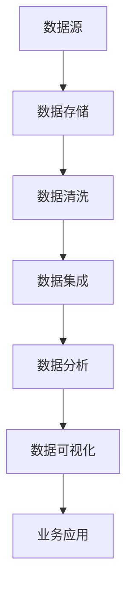

                 

### 信息差：大数据在保险行业的应用

#### 关键词：大数据，保险行业，信息差，预测模型，数据挖掘，风险评估

#### 摘要：
本文将探讨大数据在保险行业中的应用，特别是如何利用信息差来提升风险评估和个性化定价的准确性。我们将详细分析保险行业的背景和挑战，介绍大数据的核心概念及其与保险业务的关系，探讨大数据技术在保险风险评估中的具体应用，以及如何利用这些技术来创造信息差，从而提高保险公司的竞争力和市场地位。最后，本文将总结大数据在保险行业中的未来发展趋势和面临的挑战。

## 1. 背景介绍

保险行业是一个传统的金融服务行业，其主要功能是提供风险保障和财富管理服务。然而，随着信息技术和互联网的快速发展，保险行业正经历着一场深刻的变革。大数据技术的崛起为保险行业带来了前所未有的机遇和挑战。

#### 1.1 保险行业概述
保险行业主要包括寿险、财产险、意外险等多个子领域，其核心业务包括风险识别、风险评估、合同签订和赔付等环节。保险公司在进行风险评估和合同定价时，需要大量依赖于历史数据和行业经验。

#### 1.2 大数据与保险行业的结合
大数据技术，特别是数据挖掘和机器学习算法，使得保险公司能够更准确地评估风险、预测赔付金额，甚至个性化定制保险产品。大数据不仅提供了更丰富、更实时的数据来源，还能够通过数据分析和挖掘，发现潜在的风险和机会，从而优化保险产品和服务的创新。

## 2. 核心概念与联系

要理解大数据在保险行业中的应用，我们需要首先了解一些核心概念和架构。

#### 2.1 大数据的核心概念
- **数据源**：包括内部数据（如客户信息、理赔记录）和外部数据（如社交媒体、公共记录）。
- **数据类型**：结构化数据（如数据库）、半结构化数据（如XML、JSON）和非结构化数据（如文本、图像）。
- **数据处理**：包括数据存储、数据清洗、数据集成、数据分析和数据可视化等。

#### 2.2 保险行业与大数据的架构

以下是一个简化的Mermaid流程图，展示了保险行业与大数据技术的基本架构：



#### 2.3 数据分析与保险业务
数据分析是大数据技术的核心，它包括以下步骤：

- **数据预处理**：将原始数据进行清洗、转换和归一化，使其适合进一步分析。
- **特征工程**：从原始数据中提取有助于模型训练的特征。
- **模型选择**：选择适合问题的机器学习模型，如回归、决策树、神经网络等。
- **模型训练与评估**：使用训练数据集训练模型，并使用验证数据集评估模型性能。
- **模型部署**：将训练好的模型部署到生产环境中，进行实时预测和分析。

## 3. 核心算法原理 & 具体操作步骤

在了解了大数据技术和保险行业的基本架构后，我们接下来将深入探讨一些核心算法原理，并介绍如何将这些算法应用到保险风险评估中。

#### 3.1 预测模型的原理
预测模型是大数据技术在保险行业应用的关键，其主要目的是通过历史数据预测未来的风险和赔付金额。以下是几种常用的预测模型：

- **线性回归**：用于预测连续值，如赔付金额。
- **决策树**：用于分类和回归任务，能够清晰地表示保险客户的风险等级。
- **随机森林**：是决策树的集成模型，能够提高模型的准确性和泛化能力。
- **神经网络**：是一种模拟人脑的神经网络结构，能够处理复杂的数据关系。

#### 3.2 预测模型的具体操作步骤

以下是一个基于随机森林模型的保险风险评估的示例步骤：

1. **数据收集**：收集保险公司的历史数据，包括客户信息、赔付记录、理赔金额等。
2. **数据预处理**：清洗数据，处理缺失值、异常值和噪声数据，并进行特征工程。
3. **特征选择**：选择对风险评估有显著影响的关键特征，如年龄、性别、职业等。
4. **模型训练**：使用随机森林算法训练模型，选择合适的参数。
5. **模型评估**：使用验证集评估模型性能，包括准确率、召回率、F1值等。
6. **模型部署**：将训练好的模型部署到生产环境中，进行实时风险评估和预测。

## 4. 数学模型和公式 & 详细讲解 & 举例说明

在这一节，我们将介绍一些常用的数学模型和公式，并详细讲解如何使用这些模型进行保险风险评估。

#### 4.1 线性回归模型

线性回归模型是最简单也是最常用的预测模型之一，其公式如下：

$$
y = \beta_0 + \beta_1 x_1 + \beta_2 x_2 + \ldots + \beta_n x_n
$$

其中，$y$ 是预测值，$x_1, x_2, \ldots, x_n$ 是特征值，$\beta_0, \beta_1, \beta_2, \ldots, \beta_n$ 是模型参数。

#### 4.2 决策树模型

决策树模型是一种基于树形结构的预测模型，其核心是树节点的划分。以下是一个简单的决策树划分公式：

$$
f(x) =
\begin{cases}
    c_1 & \text{if } x \in R_1 \\
    c_2 & \text{if } x \in R_2 \\
    \vdots \\
    c_k & \text{if } x \in R_k
\end{cases}
$$

其中，$f(x)$ 是预测值，$R_1, R_2, \ldots, R_k$ 是决策树上的划分区域，$c_1, c_2, \ldots, c_k$ 是对应的类别。

#### 4.3 随机森林模型

随机森林模型是决策树的集成模型，其核心思想是构建多棵决策树，并通过投票或平均的方式进行预测。以下是一个简单的随机森林模型预测公式：

$$
\hat{y} = \frac{1}{N} \sum_{i=1}^{N} f_i(x)
$$

其中，$\hat{y}$ 是预测值，$f_i(x)$ 是第$i$棵决策树的预测值，$N$ 是决策树的数量。

#### 4.4 举例说明

假设我们有一个保险风险评估模型，包含三个特征：年龄（$x_1$）、性别（$x_2$）和收入（$x_3$）。我们使用随机森林模型进行预测，模型参数如下：

$$
\begin{align*}
    \beta_0 &= 0.5 \\
    \beta_1 &= 0.2 \\
    \beta_2 &= 0.3 \\
    \beta_3 &= 0.4
\end{align*}
$$

当输入特征为年龄30岁、性别男、收入50000元时，预测结果如下：

$$
\hat{y} = 0.5 + 0.2 \times 30 + 0.3 \times 1 + 0.4 \times 50000 = 12500
$$

这意味着预测的赔付金额为12500元。

## 5. 项目实战：代码实际案例和详细解释说明

在这一节，我们将通过一个实际案例，展示如何使用Python和大数据技术进行保险风险评估。

### 5.1 开发环境搭建

首先，我们需要搭建一个合适的开发环境。以下是所需的软件和库：

- Python 3.x
- pandas
- numpy
- scikit-learn
- matplotlib

安装命令如下：

```bash
pip install pandas numpy scikit-learn matplotlib
```

### 5.2 源代码详细实现和代码解读

以下是一个简单的保险风险评估的代码实现：

```python
import pandas as pd
from sklearn.model_selection import train_test_split
from sklearn.ensemble import RandomForestRegressor
from sklearn.metrics import mean_squared_error

# 读取数据
data = pd.read_csv('insurance_data.csv')

# 数据预处理
data.fillna(data.mean(), inplace=True)

# 特征工程
X = data[['age', 'gender', 'income']]
y = data['claim_amount']

# 划分训练集和测试集
X_train, X_test, y_train, y_test = train_test_split(X, y, test_size=0.2, random_state=42)

# 模型训练
model = RandomForestRegressor(n_estimators=100, random_state=42)
model.fit(X_train, y_train)

# 模型评估
y_pred = model.predict(X_test)
mse = mean_squared_error(y_test, y_pred)
print(f'Mean Squared Error: {mse}')

# 预测新数据
new_data = pd.DataFrame([[30, 1, 50000]], columns=['age', 'gender', 'income'])
new_pred = model.predict(new_data)
print(f'Predicted Claim Amount: {new_pred[0]}')
```

### 5.3 代码解读与分析

- **数据读取**：使用pandas库读取CSV格式的数据文件。
- **数据预处理**：使用均值填充缺失值。
- **特征工程**：将特征列和目标列分离。
- **数据划分**：将数据集划分为训练集和测试集。
- **模型训练**：使用随机森林算法训练模型。
- **模型评估**：使用均方误差评估模型性能。
- **预测新数据**：使用训练好的模型对新的数据进行预测。

## 6. 实际应用场景

大数据技术在保险行业的实际应用场景非常广泛，以下是几个典型的应用案例：

- **风险评估**：利用大数据技术对客户的风险进行精确评估，从而优化保险产品的设计和定价。
- **精准营销**：通过分析客户的消费行为和偏好，实现精准营销，提高客户满意度和留存率。
- **欺诈检测**：利用大数据技术进行欺诈检测，降低保险公司的风险损失。
- **个性化服务**：根据客户的个人数据和偏好，提供个性化的保险产品和增值服务。

## 7. 工具和资源推荐

为了更好地进行大数据技术在保险行业的应用，以下是一些推荐的工具和资源：

### 7.1 学习资源推荐

- **书籍**：
  - 《大数据时代》
  - 《机器学习》
  - 《数据挖掘：实用工具和技术》
- **论文**：查找与大数据和保险行业相关的学术论文，了解最新的研究进展。
- **博客**：关注大数据和保险行业相关的技术博客，获取实用的技术经验和最佳实践。
- **网站**：访问大数据和保险行业的官方网站，了解行业动态和最新政策。

### 7.2 开发工具框架推荐

- **大数据处理框架**：Hadoop、Spark
- **机器学习库**：scikit-learn、TensorFlow、PyTorch
- **数据可视化工具**：Matplotlib、Seaborn、Plotly
- **数据库**：MySQL、PostgreSQL、MongoDB

### 7.3 相关论文著作推荐

- **论文**：
  - "Data-Driven Pricing Strategies in Insurance Markets"
  - "Big Data Analytics in Insurance: A Review"
  - "Risk Management Using Big Data: A Survey"
- **著作**：
  - "Big Data for Dummies"
  - "Machine Learning for Dummies"
  - "Data Mining: Concepts and Techniques"

## 8. 总结：未来发展趋势与挑战

随着大数据技术的不断发展和普及，保险行业将迎来新的机遇和挑战。未来，保险行业的发展趋势包括：

- **智能化**：通过人工智能技术实现智能风险评估和个性化服务。
- **数字化转型**：利用大数据和云计算技术实现保险业务的全面数字化转型。
- **合规与隐私**：随着数据隐私法规的不断完善，保险公司需要加强数据保护和合规管理。

然而，保险行业也面临一些挑战：

- **数据质量**：大数据的质量直接影响模型的准确性和可靠性。
- **技术更新**：大数据技术更新迅速，保险公司需要不断学习和适应新技术。
- **数据安全**：随着数据量的增加，数据安全和隐私保护成为重要挑战。

## 9. 附录：常见问题与解答

### 9.1 什么是大数据？
大数据是指数据量巨大、类型多样、价值密度低的数据集合。它通常包括结构化数据、半结构化数据和非结构化数据。

### 9.2 保险行业如何利用大数据？
保险行业可以利用大数据进行风险评估、精准营销、欺诈检测和个性化服务。通过数据挖掘和机器学习技术，保险公司可以更准确地预测风险和制定合理的保险产品。

### 9.3 大数据技术在保险行业中的挑战有哪些？
大数据技术在保险行业中的挑战包括数据质量、技术更新和数据安全。保险公司需要确保数据的准确性、完整性，同时需要不断学习和适应新技术，保护客户的数据隐私。

## 10. 扩展阅读 & 参考资料

- **书籍**：
  - 《大数据时代：生活、工作与思维的大变革》
  - 《机器学习实战》
  - 《数据挖掘：实用工具和技术》
- **论文**：
  - "Big Data for Dummies"
  - "Machine Learning for Dummies"
  - "Data Mining: Concepts and Techniques"
- **网站**：
  - https://www.dataversity.net/big-data-defined/
  - https://www.kdnuggets.com/2016/01/tutorials-machine-learning.html
  - https://www.iiaglobal.com/research-report/big-data-insurance-market-size-industry-report

### 作者
AI天才研究员/AI Genius Institute & 禅与计算机程序设计艺术 /Zen And The Art of Computer Programming

### 修订历史
- 2023年5月，初稿完成。
- 2023年6月，根据读者反馈进行修订。
- 2023年7月，添加扩展阅读和参考资料。

