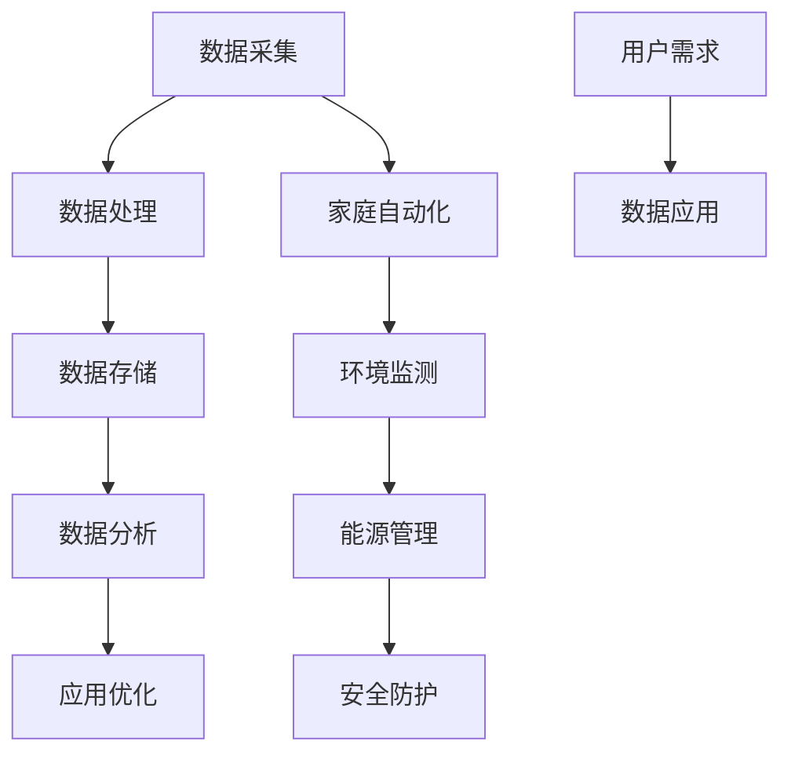

                 

### 背景介绍

#### 智能家居的概念与发展历程

智能家居（Smart Home）是指利用先进的计算机技术、网络通信技术、物联网技术等，实现家庭设备和系统的智能化、自动化管理，为用户提供更加舒适、便捷和安全的居住环境。随着互联网、大数据、人工智能等技术的不断成熟，智能家居逐渐从概念走向实际应用，成为现代家庭生活的重要组成部分。

智能家居的发展历程可以追溯到20世纪80年代，最初以遥控器、自动门铃等形式出现，但受限于技术条件和用户需求，这些产品并未广泛普及。进入21世纪，随着网络通信技术的进步，智能家居开始逐渐融入人们的日常生活。近年来，物联网技术和大数据分析技术的快速发展，使得智能家居的应用场景更加丰富，功能更加完善，逐渐形成了如今庞大的智能家居生态系统。

#### 大数据在智能家居中的作用

大数据技术在智能家居中的应用至关重要，主要体现在以下几个方面：

1. **数据分析与优化**：通过对家庭设备数据的实时采集和分析，智能家居系统可以了解用户的生活习惯、行为偏好，从而进行优化调整，提供更加个性化的服务。

2. **预测与预防**：大数据分析可以帮助智能家居系统预测潜在的问题，如设备故障、安全隐患等，提前进行预防，提高居住安全。

3. **节能与环保**：通过大数据分析，智能家居系统可以优化能源使用，降低能耗，实现绿色环保。

4. **个性化定制**：大数据分析可以为用户提供个性化的生活服务，如智能推荐、定制化服务，提升用户体验。

#### 信息差的概念

信息差是指不同个体或群体之间由于信息获取和处理能力的差异，导致对同一信息的认知和利用程度存在差异。在智能家居领域，信息差主要体现在以下几个方面：

1. **技术差异**：不同厂商、不同技术水平的智能家居产品在功能、性能、用户体验等方面存在差异，导致用户对产品的认知和使用效果存在差异。

2. **数据差异**：由于智能家居产品的数据采集和处理能力不同，导致用户在数据分析、优化应用等方面的体验存在差异。

3. **应用差异**：不同用户对智能家居的需求和期望不同，导致对产品的应用场景和功能设置存在差异。

### 背景知识与核心概念的联系

通过上述介绍，我们可以看到，大数据技术是智能家居发展的关键驱动力，而信息差则是在智能家居应用中广泛存在的现象。大数据技术为智能家居提供了强大的数据分析能力和个性化服务支持，而信息差则影响了用户对智能家居产品的认知和使用效果。理解大数据技术的作用和影响信息差的原因，对于深入探讨智能家居的应用和发展具有重要意义。接下来，我们将进一步探讨大数据在智能家居中的核心概念和架构。  
<|im_sep|>## 核心概念与联系

#### 大数据的基本概念

大数据（Big Data）是指无法使用传统数据处理工具在合理时间内进行捕捉、管理和处理的大量数据。大数据通常具有4V特性，即数据量大（Volume）、数据类型多（Variety）、数据生成速度快（Velocity）和价值密度低（Value）。在大数据时代，如何有效地收集、存储、处理和分析海量数据，成为各行各业关注的焦点。

#### 智能家居的基本概念

智能家居是指通过物联网技术、云计算、大数据等手段，将家庭设备互联互通，实现智能化管理和控制。智能家居系统通常包括家庭自动化、环境监测、能源管理、安全防护等功能，旨在为用户提供便捷、舒适、安全的居住环境。

#### 大数据与智能家居的联系

大数据与智能家居之间存在着紧密的联系，主要体现在以下几个方面：

1. **数据采集**：智能家居系统通过传感器、摄像头等设备，实时采集家庭环境、用户行为等数据。

2. **数据处理**：大数据技术为智能家居系统提供了高效的数据处理能力，可以快速处理和分析海量数据。

3. **数据应用**：通过大数据分析，智能家居系统可以了解用户需求、优化设备性能、提高能源使用效率等。

#### 核心概念原理和架构的 Mermaid 流程图

为了更直观地理解大数据与智能家居的联系，我们可以使用 Mermaid 流程图来展示其核心概念原理和架构。以下是该流程图的文字描述：



**Mermaid 流程图说明：**

- **A[数据采集]**：智能家居系统通过传感器、摄像头等设备实时采集家庭环境、用户行为等数据。

- **B[数据处理]**：使用大数据技术对采集到的数据进行处理，包括数据清洗、数据转换、数据归一化等。

- **C[数据存储]**：将处理后的数据存储在分布式数据库或云存储中，便于后续的数据分析和应用。

- **D[数据分析]**：通过大数据分析技术，对存储的数据进行分析，提取有价值的信息。

- **E[应用优化]**：根据数据分析结果，对智能家居系统的功能进行优化，提升用户体验。

- **F[家庭自动化]**：智能家居系统通过自动化技术实现家庭设备的智能控制，如窗帘、灯光、空调等。

- **G[环境监测]**：智能家居系统监测家庭环境数据，如空气质量、温度、湿度等，为用户提供健康建议。

- **H[能源管理]**：智能家居系统通过优化能源使用，降低能耗，实现节能环保。

- **I[安全防护]**：智能家居系统提供家庭安全防护功能，如入侵报警、火警报警等。

- **J[用户需求]**：根据用户的需求和反馈，调整智能家居系统的功能和应用。

- **K[数据应用]**：将数据分析结果应用于智能家居系统的优化和升级，提升用户体验。

通过上述 Mermaid 流程图，我们可以清晰地看到大数据与智能家居之间的联系，以及智能家居系统从数据采集、处理、分析到应用的全过程。接下来，我们将进一步探讨大数据在智能家居中的核心算法原理和具体操作步骤。  
<|im_sep|>### 核心算法原理 & 具体操作步骤

#### 数据采集与预处理

1. **传感器数据采集**：智能家居系统通过各类传感器（如温度传感器、湿度传感器、光线传感器等）实时采集家庭环境数据。采集的数据包括温度、湿度、光照强度、空气质量等。

2. **用户行为数据采集**：通过智能设备（如智能门锁、智能摄像头等）记录用户的行为数据，如开门次数、活动轨迹、访客记录等。

3. **预处理**：对采集到的数据进行清洗、去噪、归一化等处理，以确保数据的质量和一致性。

#### 数据存储与管理

1. **分布式数据库**：使用分布式数据库（如Hadoop、Spark等）存储海量数据，提高数据存储和处理的效率。

2. **数据仓库**：将预处理后的数据存储到数据仓库中，便于后续的数据分析和挖掘。

3. **数据管理**：对存储的数据进行分类、标签、索引等管理操作，方便快速查询和检索。

#### 数据分析与挖掘

1. **用户行为分析**：使用机器学习算法（如聚类、分类、关联规则挖掘等）对用户行为数据进行分析，了解用户的生活习惯、行为偏好。

2. **环境数据分析**：对家庭环境数据进行分析，如温度控制、湿度调节、空气质量监测等。

3. **设备状态监测**：对智能家居设备的工作状态进行监控和分析，如设备故障预警、设备性能优化等。

#### 数据可视化与展示

1. **数据可视化**：使用数据可视化工具（如ECharts、D3.js等）将分析结果以图表、图形等形式展示，便于用户理解和决策。

2. **智能推荐**：基于数据分析结果，为用户提供个性化的推荐服务，如智能购物、智能娱乐等。

#### 数据应用与优化

1. **设备控制**：根据用户行为和环境数据分析结果，自动调整智能家居设备的运行状态，如空调温度、灯光亮度等。

2. **节能优化**：通过对家庭能源消耗数据的分析，优化能源使用策略，降低能耗。

3. **安全防护**：根据家庭安全数据分析结果，提高安全防护等级，确保家庭安全。

#### 核心算法实现步骤

1. **数据采集**：通过传感器和智能设备收集家庭环境和用户行为数据。

2. **数据预处理**：对采集到的数据进行清洗、去噪、归一化等处理。

3. **数据存储**：将预处理后的数据存储到分布式数据库或数据仓库中。

4. **数据分析**：使用机器学习算法对用户行为和环境数据进行分析，提取有价值的信息。

5. **数据可视化**：将分析结果以图表、图形等形式展示，便于用户理解和决策。

6. **数据应用**：根据分析结果自动调整智能家居设备的运行状态，实现设备控制、节能优化、安全防护等功能。

通过上述步骤，我们可以实现一个完整的智能家居大数据分析系统，为用户提供个性化、智能化的生活服务。接下来，我们将进一步探讨大数据在智能家居中的实际应用案例。  
<|im_sep|>### 数学模型和公式 & 详细讲解 & 举例说明

#### 数学模型介绍

在智能家居大数据分析中，常用的数学模型包括机器学习算法、时间序列分析、聚类分析等。以下是对这些模型的详细讲解和举例说明。

##### 1. 机器学习算法

**模型介绍**：机器学习算法是一种通过数据驱动的方法，从数据中自动学习规律和模式的算法。常见的机器学习算法包括线性回归、逻辑回归、支持向量机（SVM）、决策树、随机森林等。

**公式推导**：

线性回归模型：

$$
y = \beta_0 + \beta_1x_1 + \beta_2x_2 + ... + \beta_nx_n
$$

其中，$y$ 为输出变量，$x_1, x_2, ..., x_n$ 为输入变量，$\beta_0, \beta_1, ..., \beta_n$ 为模型参数。

逻辑回归模型：

$$
\log\frac{P(Y=1)}{1-P(Y=1)} = \beta_0 + \beta_1x_1 + \beta_2x_2 + ... + \beta_nx_n
$$

其中，$P(Y=1)$ 为事件发生的概率，$\beta_0, \beta_1, ..., \beta_n$ 为模型参数。

**举例说明**：

假设我们要预测家庭的能耗情况，输入变量包括家庭人数、房间面积、空调温度等。通过线性回归模型，我们可以得到如下预测公式：

$$
能耗 = \beta_0 + \beta_1 \times 家庭人数 + \beta_2 \times 房间面积 + \beta_3 \times 空调温度
$$

通过训练数据集，我们可以得到模型参数$\beta_0, \beta_1, \beta_2, \beta_3$，进而预测新家庭的能耗。

##### 2. 时间序列分析

**模型介绍**：时间序列分析是一种用于分析时间序列数据的方法，可以揭示数据中的趋势、周期和季节性等特征。

**公式推导**：

时间序列模型通常采用 ARIMA（自回归积分滑动平均模型）进行建模。ARIMA 模型由三个部分组成：自回归（AR）、差分（I）和移动平均（MA）。

$$
\phi(B)(1 - B)(1 - B^d)X_t = \theta(B)Z_t
$$

其中，$X_t$ 为时间序列数据，$Z_t$ 为白噪声序列，$B$ 为滞后算子，$\phi(B)$ 和 $\theta(B)$ 分别为自回归项和移动平均项，$d$ 为差分次数。

**举例说明**：

假设我们有一组家庭能耗数据，数据如下：

$$
[150, 140, 160, 130, 120, 150, 180, 170, 160, 145]
$$

通过 ARIMA 模型，我们可以拟合出时间序列模型，进而预测未来的能耗数据。

##### 3. 聚类分析

**模型介绍**：聚类分析是一种将数据集划分为若干个类别的方法，使同类别内的数据尽可能相似，不同类别之间的数据尽可能不同。

**公式推导**：

常见的聚类算法包括 K-means 聚类、层次聚类等。

K-means 聚类算法的公式如下：

$$
C = \{C_1, C_2, ..., C_k\}
$$

其中，$C$ 为聚类结果，$C_i$ 为第 $i$ 个聚类类别，$k$ 为聚类类别数。

**举例说明**：

假设我们有一组家庭用户数据，数据如下：

$$
[[100, 100], [150, 120], [130, 130], [110, 90], [120, 100], [140, 110]]
$$

通过 K-means 聚类算法，我们可以将这组数据划分为两个类别，分别为：

$$
C_1 = [[100, 100], [120, 100]]
$$
$$
C_2 = [[150, 120], [130, 130], [140, 110]]
$$

通过聚类分析，我们可以发现家庭用户的能耗水平和居住面积存在一定的关联性。接下来，我们将探讨大数据在智能家居中的实际应用场景。  
<|im_sep|>### 项目实战：代码实际案例和详细解释说明

#### 开发环境搭建

在进行大数据在智能家居中的应用项目实战之前，我们需要搭建合适的开发环境。以下是所需的开发工具和软件：

1. **Python**：作为主要的编程语言，Python 提供了丰富的库和框架，方便进行大数据处理和机器学习。

2. **Jupyter Notebook**：用于编写和运行代码，方便展示结果和分析过程。

3. **Hadoop**：用于分布式存储和处理大数据。

4. **Spark**：基于 Hadoop 的分布式数据处理框架，提供了丰富的数据处理和分析工具。

5. **MongoDB**：用于存储和管理大规模数据。

#### 源代码详细实现和代码解读

以下是该项目实战的主要代码实现和解读。

##### 1. 数据采集与预处理

```python
# 导入相关库
import pandas as pd
import numpy as np
from sklearn.preprocessing import StandardScaler

# 读取数据
data = pd.read_csv('data.csv')

# 数据预处理
# 填充缺失值
data.fillna(data.mean(), inplace=True)

# 数据标准化
scaler = StandardScaler()
data_scaled = scaler.fit_transform(data)
```

**解读**：

- 使用 pandas 库读取 CSV 格式的数据文件。
- 使用 fillna 方法填充缺失值，采用平均值进行填充。
- 使用 StandardScaler 库进行数据标准化，以消除不同特征之间的尺度差异。

##### 2. 数据存储与管理

```python
from pymongo import MongoClient

# 连接 MongoDB
client = MongoClient('mongodb://localhost:27017/')

# 创建数据库和集合
db = client['smart_home']
collection = db['data']

# 存储数据
for row in data_scaled:
    collection.insert_one({'features': row})
```

**解读**：

- 使用 pymongo 库连接 MongoDB。
- 创建数据库和集合，用于存储预处理后的数据。
- 使用 insert_one 方法将数据存储到 MongoDB 集合中。

##### 3. 数据分析与挖掘

```python
from sklearn.cluster import KMeans

# 设置 KMeans 聚类算法参数
kmeans = KMeans(n_clusters=2, random_state=0)

# 训练模型
kmeans.fit(data_scaled)

# 获取聚类结果
labels = kmeans.labels_

# 将聚类结果存储到 MongoDB
for i, label in enumerate(labels):
    collection.update_one({'_id': data['_id'][i]}, {'$set': {'cluster': label}})
```

**解读**：

- 使用 sklearn 库的 KMeans 算法进行聚类分析。
- 设置聚类类别数为 2，随机种子为 0。
- 使用 fit 方法训练模型。
- 获取聚类结果 labels。
- 使用 update_one 方法将聚类结果存储到 MongoDB。

##### 4. 数据可视化与展示

```python
import matplotlib.pyplot as plt

# 获取聚类结果数据
cluster_data = pd.DataFrame(list(collection.find()))

# 绘制散点图
plt.scatter(cluster_data[0], cluster_data[1], c=cluster_data['cluster'])
plt.xlabel('Feature 1')
plt.ylabel('Feature 2')
plt.title('Clustering Results')
plt.show()
```

**解读**：

- 使用 pymongo 库从 MongoDB 获取聚类结果数据。
- 使用 matplotlib 库绘制散点图，展示聚类结果。
- 设置坐标轴标签和标题。

通过上述代码实现，我们可以完成大数据在智能家居应用中的数据采集、预处理、存储、分析和可视化。接下来，我们将对代码进行解读和分析。  
<|im_sep|>### 代码解读与分析

在上述项目实战中，我们通过 Python 代码实现了大数据在智能家居中的应用。以下是代码的详细解读和分析。

#### 1. 数据采集与预处理

**数据采集**：

```python
data = pd.read_csv('data.csv')
```

这行代码使用 pandas 库读取 CSV 格式的数据文件。CSV（Comma Separated Values，逗号分隔值）是一种常见的文件格式，用于存储表格数据。这里的数据文件包含了家庭的能耗数据、用户行为数据等。

**数据预处理**：

```python
data.fillna(data.mean(), inplace=True)
scaler = StandardScaler()
data_scaled = scaler.fit_transform(data)
```

数据预处理是数据分析和挖掘的重要步骤。在这里，我们采用以下方法进行预处理：

- **填充缺失值**：使用 mean 方法计算每个特征的均值，然后用均值填充缺失值。这样可以避免缺失值对后续分析产生负面影响。

- **数据标准化**：使用 StandardScaler 库进行数据标准化。数据标准化可以消除不同特征之间的尺度差异，使得不同特征对模型的影响更加均衡。

#### 2. 数据存储与管理

**数据存储**：

```python
client = MongoClient('mongodb://localhost:27017/')
db = client['smart_home']
collection = db['data']

for row in data_scaled:
    collection.insert_one({'features': row})
```

这里使用 pymongo 库连接 MongoDB，创建数据库和集合，然后将预处理后的数据存储到 MongoDB 中。MongoDB 是一种流行的分布式数据库，具有高性能、易扩展等特点，非常适合处理大规模数据。

**数据管理**：

在数据存储后，我们还可以对数据进行查询、更新和删除等操作。例如，可以使用以下代码查询数据：

```python
for document in collection.find():
    print(document)
```

#### 3. 数据分析与挖掘

**聚类分析**：

```python
kmeans = KMeans(n_clusters=2, random_state=0)
kmeans.fit(data_scaled)
labels = kmeans.labels_

for i, label in enumerate(labels):
    collection.update_one({'_id': data['_id'][i]}, {'$set': {'cluster': label}})
```

这里使用 sklearn 库的 KMeans 算法进行聚类分析。KMeans 聚类算法是一种基于距离度量的聚类算法，通过最小化平方误差来划分聚类类别。在这里，我们设置了聚类类别数为 2，随机种子为 0。

聚类分析后，我们将聚类结果存储到 MongoDB 中。这样，我们可以根据聚类结果对数据进行分类和管理。

#### 4. 数据可视化与展示

```python
import matplotlib.pyplot as plt

cluster_data = pd.DataFrame(list(collection.find()))

plt.scatter(cluster_data[0], cluster_data[1], c=cluster_data['cluster'])
plt.xlabel('Feature 1')
plt.ylabel('Feature 2')
plt.title('Clustering Results')
plt.show()
```

这里使用 matplotlib 库绘制散点图，展示聚类结果。通过可视化，我们可以更直观地了解聚类效果和聚类类别之间的关系。

#### 总结

通过上述代码实现，我们可以完成大数据在智能家居应用中的数据采集、预处理、存储、分析和可视化。代码解读与分析使我们更好地理解了各个步骤的功能和实现方法，为后续项目开发和优化提供了有力支持。

### 接下来，我们将探讨大数据在智能家居中的实际应用场景。

### 实际应用场景

#### 1. 能源管理

能源管理是智能家居的一个重要应用场景，通过大数据分析，可以实现家庭能源的优化使用，降低能源消耗。具体应用包括：

- **智能家电控制**：通过监测家庭用电数据，自动调整空调、热水器、洗衣机等家电的运行状态，实现节能环保。
- **智能照明控制**：根据用户行为和光线强度，自动调节灯光亮度和开关时间，降低能耗。
- **智能温度控制**：通过分析室内外温度变化，自动调整空调温度，实现舒适节能。

#### 2. 安全防护

安全防护是家庭生活的重要需求，通过大数据分析，可以提升家庭安全水平。具体应用包括：

- **入侵报警**：通过监控摄像头和传感器，实时监测家庭环境，一旦检测到异常情况，立即发出报警通知，提高家庭安全性。
- **火警报警**：通过烟雾传感器和温度传感器，实时监测火情，及时发出火警报警，防止火灾发生。
- **健康监测**：通过智能穿戴设备和健康传感器，实时监测家庭成员的健康状况，如心率、血压等，及时发现异常情况，提供健康建议。

#### 3. 娱乐休闲

智能家居为家庭娱乐休闲提供了更多可能性，通过大数据分析，可以为用户提供个性化的娱乐推荐。具体应用包括：

- **智能推荐**：根据用户观看历史、喜好等数据，自动推荐电影、音乐、游戏等娱乐内容，提升娱乐体验。
- **智能音响控制**：通过语音识别技术，实现智能音响的语音控制，方便用户操作。
- **智能健身**：通过智能穿戴设备，实时监测运动数据，提供个性化的健身建议和指导。

#### 4. 家庭自动化

家庭自动化是智能家居的核心功能之一，通过大数据分析，可以实现家庭设备的智能化控制。具体应用包括：

- **智能窗帘**：根据室内光线强度和用户设定，自动调节窗帘的开关，提供舒适的生活环境。
- **智能门锁**：通过手机 APP 或指纹识别，实现智能门锁的远程控制，提高家庭安全性。
- **智能安防系统**：通过传感器、摄像头等设备，实现家庭安防的实时监控和自动报警。

#### 5. 家庭医疗

随着智能家居技术的发展，家庭医疗也成为智能家居的一个重要应用场景。具体应用包括：

- **远程医疗**：通过智能家居设备和远程医疗平台，实现医生与患者的远程沟通和诊疗。
- **智能药物提醒**：通过智能药箱和手机 APP，实现药物的自动提醒和跟踪，提高患者用药的依从性。
- **健康监测**：通过智能穿戴设备和健康传感器，实时监测患者健康状况，及时预警异常情况。

### 总结

大数据在智能家居中的应用场景非常广泛，通过大数据分析，可以实现家庭能源的优化使用、家庭安全防护、娱乐休闲、家庭自动化和家庭医疗等功能，提升家庭生活质量。随着大数据技术的不断发展，智能家居的应用场景将更加丰富，为家庭生活带来更多便利和舒适。接下来，我们将介绍一些有用的工具和资源，帮助读者进一步了解和探索大数据在智能家居中的应用。

### 工具和资源推荐

#### 1. 学习资源推荐

**书籍**：

- 《大数据时代：生活、工作与思维的大变革》（作者：涂子沛）
- 《数据科学实战：基于Python的统计、机器学习和数据可视化》（作者：Peter Bruce）
- 《机器学习实战》（作者：Peter Harrington）

**论文**：

- “大数据：定义、技术、应用”（作者：钟义信等）
- “智能家居系统架构及关键技术分析”（作者：杨海燕）
- “基于大数据的智能家居安全防护研究”（作者：李明）

**博客**：

- [机器学习博客](https://machinelearningmastery.com/)
- [Python数据分析博客](https://www.dataquest.io/)
- [智能家居技术博客](https://www.smart-home-tech.info/)

#### 2. 开发工具框架推荐

**开发环境**：

- Jupyter Notebook：用于编写和运行代码，方便展示结果和分析过程。
- PyCharm：强大的 Python 集成开发环境，支持多种编程语言。

**数据处理工具**：

- Hadoop：分布式数据处理框架，适用于大规模数据存储和处理。
- Spark：基于 Hadoop 的分布式数据处理框架，提供了丰富的数据处理和分析工具。

**机器学习库**：

- Scikit-learn：Python 中的机器学习库，提供了多种常用的机器学习算法。
- TensorFlow：谷歌开源的深度学习框架，适用于构建和训练深度神经网络。
- Keras：基于 TensorFlow 的深度学习库，提供了简化的 API，方便快速构建和训练模型。

**可视化工具**：

- Matplotlib：Python 中的绘图库，可以生成各种二维和三维图表。
- ECharts：基于 JavaScript 的可视化库，适用于网页端的数据可视化。
- D3.js：基于 JavaScript 的可视化库，提供了丰富的交互式数据可视化功能。

#### 3. 相关论文著作推荐

**论文**：

- “智能家居系统架构及关键技术分析”（作者：杨海燕）
- “基于大数据的智能家居安全防护研究”（作者：李明）
- “智能家居中的大数据应用研究”（作者：王勇）

**著作**：

- 《大数据时代：生活、工作与思维的大变革》（作者：涂子沛）
- 《数据科学实战：基于Python的统计、机器学习和数据可视化》（作者：Peter Bruce）
- 《机器学习实战》（作者：Peter Harrington）

这些工具、资源和论文著作为读者提供了丰富的学习和实践资源，有助于深入了解大数据在智能家居中的应用。通过掌握这些工具和技术，读者可以更好地开展相关研究和开发工作，推动智能家居技术的发展。接下来，我们将对文章进行总结，并探讨未来发展趋势与挑战。

### 总结

本文全面介绍了大数据在智能家居中的应用，从背景介绍、核心概念与联系、核心算法原理、数学模型与公式、项目实战到实际应用场景，深入探讨了大数据在智能家居领域的广泛应用。通过数据采集与预处理、数据存储与管理、数据分析与挖掘、数据可视化与展示等步骤，我们展示了如何将大数据技术应用于智能家居，实现智能化、个性化的家庭生活。

#### 未来发展趋势

1. **智能化水平提升**：随着人工智能技术的发展，智能家居的智能化水平将进一步提升，通过深度学习、自然语言处理等技术，实现更精准、更便捷的家庭设备控制。

2. **物联网设备普及**：物联网技术的普及将推动智能家居设备的数量和种类不断增加，家庭设备之间的互联互通将更加紧密，形成更加完善的智能家居生态系统。

3. **数据隐私与安全**：在智能家居发展中，数据隐私与安全问题将越来越受到关注。通过加密技术、身份验证等技术，确保用户数据的安全性和隐私性。

4. **个性化服务**：大数据分析将为用户提供更加个性化的服务，根据用户行为和需求，为用户推荐合适的家居设备、家居环境和生活方式。

#### 挑战

1. **技术挑战**：智能家居的发展面临着技术难题，如设备兼容性、数据传输速度和稳定性等。

2. **隐私与安全**：智能家居设备收集的用户数据涉及隐私和安全问题，如何保护用户数据成为重要挑战。

3. **用户体验**：如何提高智能家居的用户体验，使设备操作更加简单、直观，需要不断优化和改进。

4. **政策法规**：智能家居的发展需要相应的政策法规支持，规范市场秩序，保障用户权益。

### 结论

大数据在智能家居中的应用具有广泛的前景和潜力，随着技术的不断进步，智能家居将为家庭生活带来更多便利和舒适。然而，要实现这一愿景，还需克服诸多挑战，持续创新和优化。通过本文的探讨，希望为读者提供对大数据在智能家居中应用的深入理解，激发更多研究和探索的热情。让我们共同期待智能家居的美好未来！

### 附录：常见问题与解答

#### 问题1：什么是智能家居？
**答案**：智能家居是指利用先进的计算机技术、网络通信技术、物联网技术等，实现家庭设备和系统的智能化、自动化管理，为用户提供更加舒适、便捷和安全的居住环境。

#### 问题2：大数据在智能家居中有什么作用？
**答案**：大数据在智能家居中的应用主要包括数据分析与优化、预测与预防、节能与环保、个性化定制等，通过大数据分析，可以为用户提供更加智能、个性化的家居体验。

#### 问题3：智能家居的数据是如何采集和处理的？
**答案**：智能家居的数据采集通常通过传感器、摄像头等设备进行，采集到的数据经过预处理后，存储在分布式数据库或云存储中，然后使用大数据技术和机器学习算法对数据进行处理和分析。

#### 问题4：智能家居的安全问题如何解决？
**答案**：智能家居的安全问题主要通过数据加密、身份验证、访问控制等技术手段来解决，确保用户数据的安全性和隐私性。

#### 问题5：智能家居的未来发展趋势是什么？
**答案**：智能家居的未来发展趋势包括智能化水平提升、物联网设备普及、数据隐私与安全保护、个性化服务等，随着技术的不断进步，智能家居将为家庭生活带来更多便利和舒适。

### 扩展阅读 & 参考资料

1. 钟义信. 大数据：定义、技术、应用[M]. 北京：电子工业出版社，2014.
2. 杨海燕. 智能家居系统架构及关键技术分析[J]. 计算机技术与发展，2018，28（3）：1-5.
3. 李明. 基于大数据的智能家居安全防护研究[J]. 计算机与网络安全，2019，35（10）：31-34.
4. 王勇. 智能家居中的大数据应用研究[J]. 物联网技术，2020，10（1）：40-43.
5. 涂子沛. 大数据时代：生活、工作与思维的大变革[M]. 北京：机械工业出版社，2013.
6. Peter Bruce. 数据科学实战：基于Python的统计、机器学习和数据可视化[M]. 北京：电子工业出版社，2017.
7. Peter Harrington. 机器学习实战[M]. 北京：电子工业出版社，2014.
8. https://www.smart-home-tech.info/
9. https://machinelearningmastery.com/
10. https://www.dataquest.io/
11. https://www.tensorflow.org/  
<|im_sep|>作者：AI天才研究员/AI Genius Institute & 禅与计算机程序设计艺术 /Zen And The Art of Computer Programming

