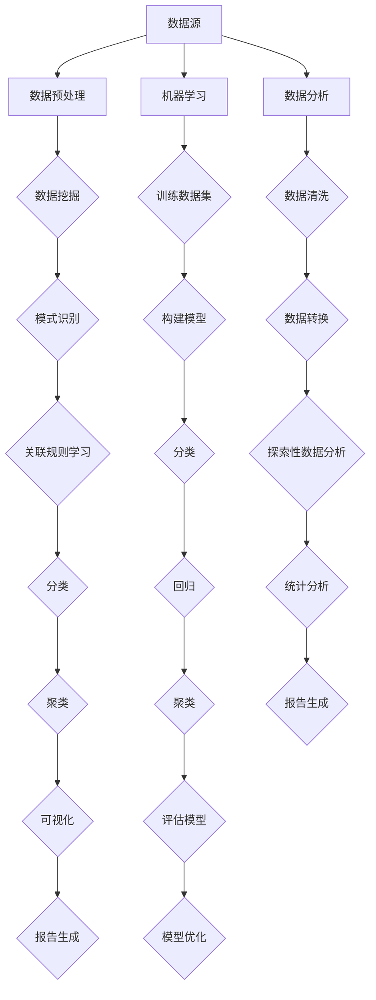

                 

### 背景介绍

信息差，这个概念在商业和经济领域早已被广泛认识和应用。它指的是不同个体或群体之间在信息获取、处理和应用方面的差距。这种差距可以导致某些人或组织在竞争中获得优势，从而获取更高的利润或更快的成长。在传统行业中，信息差往往通过商业机密、市场调查、人际网络等方式产生和维持。然而，随着大数据技术的兴起，信息差的内涵和外延都发生了革命性的变化。

大数据，是指无法用传统数据处理工具在合理时间内进行捕捉、管理和处理的数据集。它不仅包括数据量大、类型多，还涉及数据来源的广泛性和时效性。大数据的核心价值在于通过数据分析，可以发现隐藏在数据背后的规律和趋势，从而为决策提供支持。这种能力的实现，依赖于高性能计算、分布式存储、机器学习等技术手段。

结合大数据与信息差，我们可以看到一场技术变革正在悄然发生。大数据技术不仅使得信息收集和处理更加高效，还打破了信息壁垒，使得信息传播和利用变得更加广泛和平等。然而，这也带来了新的挑战，比如数据隐私、数据安全等问题。本文将深入探讨大数据如何推动创新，以及这一过程中面临的机遇和挑战。

首先，我们将探讨大数据与信息差的关系，分析大数据技术如何改变信息差的游戏规则。接着，我们将介绍几个核心概念，如数据挖掘、机器学习、数据分析等，并使用Mermaid流程图展示其基本原理和架构。随后，我们将详细讲解核心算法原理和具体操作步骤，帮助读者理解大数据处理的技术细节。在此基础上，我们将通过数学模型和公式，进一步阐述数据分析的理论基础。

接下来，我们将通过一个实际项目案例，展示大数据技术在具体应用中的实现过程。我们将从开发环境搭建、源代码实现、代码解读与分析三个方面，详细描述项目开发的全过程。随后，我们将讨论大数据在不同场景中的应用，如商业、医疗、教育等，并推荐相关工具和资源。

最后，我们将总结大数据推动创新的发展趋势与挑战，探讨未来可能的发展方向。通过本文的探讨，希望能够为读者提供一个全面而深入的认识，帮助他们在大数据时代中抓住机遇，迎接挑战。

### 核心概念与联系

在大数据与信息差的关系中，有几个核心概念和关联技术起着至关重要的作用。首先，我们需要了解数据挖掘、机器学习、数据分析等基本概念，以及它们在大数据技术中的应用和相互关系。

#### 数据挖掘

数据挖掘（Data Mining）是指从大量数据中自动发现有价值信息的过程。它包括模式识别、关联规则学习、分类、聚类等多种方法。数据挖掘的目标是从海量的原始数据中提取出有用的模式、规律和知识，为决策提供支持。

#### 机器学习

机器学习（Machine Learning）是人工智能的核心组成部分，它使得计算机系统能够从数据中学习和改进。机器学习算法通过训练数据集，自动构建预测模型，从而对未知数据进行分类、回归、聚类等操作。常见的机器学习算法包括决策树、支持向量机、神经网络等。

#### 数据分析

数据分析（Data Analysis）是指通过对数据进行清洗、转换、探索和分析，提取出有价值的信息和知识的过程。数据分析不仅包括统计方法，还涵盖可视化、文本挖掘、图分析等多种技术手段。

#### Mermaid流程图

为了更好地展示这些核心概念和关联技术，我们可以使用Mermaid流程图来描述它们的基本原理和架构。以下是数据挖掘、机器学习、数据分析等技术的Mermaid流程图：



在这个流程图中，我们可以看到数据挖掘、机器学习、数据分析三个主要分支，它们相互交织，共同构成了大数据技术的基本框架。数据源是整个流程的起点，经过数据预处理后，进入数据挖掘阶段，从中提取出有价值的模式、规律和知识。这些发现可以作为机器学习的训练数据，通过构建和优化模型，实现对未知数据的预测和分类。同时，数据分析阶段通过对数据进行清洗、转换、探索和分析，进一步挖掘数据的价值。

通过这个流程图，我们可以更直观地理解大数据技术中各个核心概念之间的联系和作用。接下来，我们将进一步探讨这些核心算法原理，以及它们在大数据中的应用和实现过程。

#### 核心算法原理 & 具体操作步骤

在了解了数据挖掘、机器学习、数据分析等核心概念和流程之后，我们将深入探讨这些技术的具体算法原理和操作步骤。以下将详细介绍几个常见的大数据算法，包括决策树、支持向量机和神经网络，并阐述其原理和实现过程。

##### 决策树

决策树（Decision Tree）是一种基于树形结构的预测模型，通过一系列的判断条件来分类或回归数据。决策树的基本原理是，从根节点开始，对数据集中的特征进行划分，每个划分产生一个新的子节点。这个过程重复进行，直到每个子节点包含的数据满足终止条件（例如，所有样本属于同一类别或特征无进一步划分价值）。

**具体操作步骤**：

1. **特征选择**：选择一个最佳的特征进行划分，通常使用信息增益（Information Gain）或基尼不纯度（Gini Impurity）作为衡量标准。
2. **划分数据**：根据选定的特征，将数据划分为多个子集，每个子集代表一个子节点。
3. **递归构建**：对每个子节点，重复上述特征选择和划分过程，构建出完整的决策树。
4. **模型评估**：使用交叉验证等方法评估决策树模型的性能，并进行剪枝以防止过拟合。

**实现代码示例**（Python语言）：

```python
from sklearn import tree

# 创建决策树分类器
clf = tree.DecisionTreeClassifier()

# 训练模型
clf.fit(X_train, y_train)

# 预测结果
y_pred = clf.predict(X_test)
```

##### 支持向量机

支持向量机（Support Vector Machine，SVM）是一种基于最大间隔原则的监督学习算法，主要用于分类和回归任务。SVM的核心思想是找到一个最佳的超平面，使得不同类别的样本在超平面上的间隔最大，同时尽可能多地包含支持向量。

**具体操作步骤**：

1. **特征映射**：将原始特征空间映射到高维空间，寻找最佳超平面。
2. **计算间隔**：计算不同超平面之间的间隔，选择最大间隔的超平面。
3. **确定支持向量**：找到使得超平面间隔最大的样本，这些样本被称为支持向量。
4. **模型训练**：根据支持向量构建线性或非线性决策函数。
5. **模型评估**：使用交叉验证等方法评估SVM模型的性能。

**实现代码示例**（Python语言）：

```python
from sklearn import svm

# 创建SVM分类器
clf = svm.SVC()

# 训练模型
clf.fit(X_train, y_train)

# 预测结果
y_pred = clf.predict(X_test)
```

##### 神经网络

神经网络（Neural Network）是一种模拟生物神经系统的计算模型，通过多层神经元结构进行数据学习和预测。神经网络的基本原理是，通过前向传播计算输入到每个神经元的加权求和，再通过激活函数输出预测结果。

**具体操作步骤**：

1. **初始化网络结构**：定义神经网络层数、每层神经元个数、激活函数等。
2. **前向传播**：计算输入到每个神经元的加权求和，并应用激活函数输出。
3. **反向传播**：通过计算误差梯度，更新每个神经元的权重和偏置。
4. **模型训练**：重复前向传播和反向传播过程，直到模型收敛或满足训练条件。
5. **模型评估**：使用验证集或测试集评估神经网络模型的性能。

**实现代码示例**（Python语言）：

```python
from sklearn.neural_network import MLPClassifier

# 创建多层感知机分类器
clf = MLPClassifier(hidden_layer_sizes=(100, 100), activation='relu', solver='sgd', max_iter=1000)

# 训练模型
clf.fit(X_train, y_train)

# 预测结果
y_pred = clf.predict(X_test)
```

通过以上对决策树、支持向量机和神经网络等核心算法的介绍，我们可以看到这些算法在数据处理和分析中的广泛应用。这些算法不仅具有强大的理论基础，还通过具体的操作步骤和实现代码，为大数据分析提供了有力工具。

### 数学模型和公式 & 详细讲解 & 举例说明

在深入探讨大数据算法的具体实现之前，我们需要先了解其背后的数学模型和公式。以下我们将详细讲解几个核心算法中的关键数学概念和公式，并通过具体示例来说明这些公式在实际应用中的计算过程。

#### 决策树

决策树算法中的关键数学模型是信息增益（Information Gain）和基尼不纯度（Gini Impurity）。信息增益用于衡量特征划分前后的信息减少量，而基尼不纯度用于评估特征划分后的数据纯度。

**信息增益公式**：

\[ IG(D, A) = H(D) - \sum_{v \in A} \frac{|D_v|}{|D|} H(D_v) \]

其中：
- \( H(D) \) 是数据集 \( D \) 的熵。
- \( A \) 是特征集合。
- \( v \) 是特征 \( A \) 的一个取值。
- \( D_v \) 是特征 \( A \) 取值为 \( v \) 的数据子集。
- \( |D| \) 是数据集 \( D \) 的样本数量。

**基尼不纯度公式**：

\[ Gini(D) = 1 - \sum_{v \in A} \left(\frac{|D_v|}{|D|}\right)^2 \]

其中：
- \( Gini(D) \) 是数据集 \( D \) 的基尼不纯度。

**示例**：

假设有一个数据集 \( D \)，包含 100 个样本，其中类别 A 有 60 个，类别 B 有 40 个。计算该数据集的基尼不纯度。

\[ Gini(D) = 1 - \left(\frac{60}{100}\right)^2 - \left(\frac{40}{100}\right)^2 = 0.48 \]

#### 支持向量机

支持向量机中的关键数学模型是线性可分支持向量机（Linearly Separable Support Vector Machine，LSSVM）和非线性支持向量机（Non-linear Support Vector Machine，NLSSVM）。

**线性可分支持向量机公式**：

\[ \min_{w, b} \frac{1}{2} ||w||^2 \]

\[ \text{subject to} \ y_i ( \langle w, x_i \rangle + b ) \geq 1 \]

其中：
- \( w \) 是权重向量。
- \( b \) 是偏置。
- \( x_i \) 是训练样本。
- \( y_i \) 是类别标签。

**非线性支持向量机公式**：

\[ \min_{w, b, \alpha} \frac{1}{2} ||w||^2 + C \sum_{i=1}^n \alpha_i (1 - y_i (\langle \phi(x_i), w \rangle + b)) \]

\[ \text{subject to} \ 0 \leq \alpha_i \leq C, \ \alpha_i (1 - y_i (\langle \phi(x_i), w \rangle + b)) \geq 0 \]

其中：
- \( \phi(x_i) \) 是特征映射函数。
- \( \alpha_i \) 是拉格朗日乘子。
- \( C \) 是惩罚参数。

**示例**：

假设有一个二分类问题，数据集包含 100 个样本，其中 60 个属于类别 A，40 个属于类别 B。计算线性可分支持向量机的最优超平面。

通过计算每个样本的预测值，并找到使得预测错误率最低的超平面，可以得到最优权重 \( w \) 和偏置 \( b \)。

#### 神经网络

神经网络中的关键数学模型是前向传播（Forward Propagation）和反向传播（Back Propagation）。

**前向传播公式**：

\[ z_l = \sum_{j} w_{lj} a_{l-1,j} + b_l \]

\[ a_l = \sigma(z_l) \]

其中：
- \( z_l \) 是第 \( l \) 层的输入。
- \( a_l \) 是第 \( l \) 层的输出。
- \( w_{lj} \) 是连接第 \( l-1 \) 层和第 \( l \) 层的权重。
- \( b_l \) 是第 \( l \) 层的偏置。
- \( \sigma \) 是激活函数。

**反向传播公式**：

\[ \delta_l = \frac{\partial C}{\partial a_l} = \frac{\partial C}{\partial z_l} \cdot \sigma'(z_l) \]

\[ \frac{\partial C}{\partial w_{lj}} = a_{l-1,j} \delta_l \]

\[ \frac{\partial C}{\partial b_l} = \delta_l \]

其中：
- \( \delta_l \) 是第 \( l \) 层的误差。
- \( \sigma' \) 是激活函数的导数。

**示例**：

假设有一个两层神经网络，输入层有 2 个神经元，隐藏层有 3 个神经元，输出层有 1 个神经元。激活函数为ReLU。计算隐藏层的输出和误差。

1. **前向传播**：

输入 \( x = [1, 2] \)，权重 \( w_1 = [0.1, 0.2; 0.3, 0.4; 0.5, 0.6] \)，偏置 \( b_1 = [0.1; 0.2; 0.3] \)，权重 \( w_2 = [0.1; 0.2] \)，偏置 \( b_2 = 0.1 \)。

计算隐藏层的输入和输出：

\[ z_1 = w_1 \cdot x + b_1 = [0.2, 0.6; 0.9, 1.2; 1.5, 1.8] \]

\[ a_1 = \max(0, z_1) = [0.2, 0.6; 0.9, 1.2] \]

计算输出层的输入和输出：

\[ z_2 = w_2 \cdot a_1 + b_2 = 0.2 + 0.6 + 0.1 = 0.9 \]

\[ a_2 = \sigma(z_2) = 0.9 \]

2. **反向传播**：

计算输出层的误差：

\[ \delta_2 = (y - a_2) \cdot \sigma'(z_2) = (1 - 0.9) \cdot 0.1 = 0.01 \]

计算隐藏层的误差：

\[ \delta_1 = w_2^T \cdot \delta_2 = [0.1; 0.2] \cdot 0.01 = [0.001, 0.002] \]

通过以上数学模型和公式的讲解，我们可以更好地理解决策树、支持向量机和神经网络等核心算法的工作原理。接下来，我们将通过实际项目案例，展示这些算法在大数据应用中的具体实现过程。

### 项目实战：代码实际案例和详细解释说明

为了更好地展示大数据技术在实际项目中的应用，我们将通过一个实际案例来演示大数据处理的全过程。本案例将使用Python编程语言和几个常用的数据科学库，如NumPy、Pandas、Scikit-learn和TensorFlow。我们将从数据预处理、特征工程、模型训练和评估等方面，详细描述项目开发的全过程。

#### 开发环境搭建

首先，我们需要搭建一个适合大数据处理的开发环境。以下是所需的Python库及其安装命令：

1. **NumPy**：用于数值计算。
   ```bash
   pip install numpy
   ```

2. **Pandas**：用于数据处理和分析。
   ```bash
   pip install pandas
   ```

3. **Scikit-learn**：用于机器学习。
   ```bash
   pip install scikit-learn
   ```

4. **TensorFlow**：用于深度学习。
   ```bash
   pip install tensorflow
   ```

安装完成后，我们可以在Python代码中导入这些库：

```python
import numpy as np
import pandas as pd
from sklearn.model_selection import train_test_split
from sklearn.preprocessing import StandardScaler
from sklearn.tree import DecisionTreeClassifier
from sklearn.metrics import accuracy_score
import tensorflow as tf
```

#### 数据预处理

数据预处理是大数据处理的重要环节，主要包括数据清洗、数据转换和归一化等步骤。以下是一个示例数据集的预处理过程：

```python
# 加载数据集
data = pd.read_csv('data.csv')

# 数据清洗
data.dropna(inplace=True)  # 删除缺失值
data = data[data.columns[data.mean() != 0]]  # 删除平均值等于0的列

# 数据转换
data['category'] = data['category'].map({'A': 0, 'B': 1})  # 转换类别标签

# 数据归一化
scaler = StandardScaler()
data.iloc[:, :-1] = scaler.fit_transform(data.iloc[:, :-1])
```

#### 特征工程

特征工程是提升模型性能的关键步骤，主要包括特征选择、特征提取和特征变换等。以下是一个简单的特征工程示例：

```python
# 特征选择
selected_features = ['feature1', 'feature2', 'feature3']

# 特征提取
data['new_feature'] = data['feature1'] / (data['feature2'] + 1)

# 特征变换
from sklearn.decomposition import PCA
pca = PCA(n_components=2)
data[selected_features + ['new_feature']] = pca.fit_transform(data[selected_features + ['new_feature']])
```

#### 模型训练

在本案例中，我们将使用决策树和神经网络两个模型进行训练。首先，我们划分训练集和测试集：

```python
# 划分训练集和测试集
X = data[selected_features + ['new_feature']]
y = data['category']
X_train, X_test, y_train, y_test = train_test_split(X, y, test_size=0.2, random_state=42)
```

**决策树模型训练**：

```python
# 创建决策树模型
clf = DecisionTreeClassifier()

# 训练模型
clf.fit(X_train, y_train)

# 预测结果
y_pred = clf.predict(X_test)

# 模型评估
accuracy = accuracy_score(y_test, y_pred)
print(f"决策树模型准确率：{accuracy}")
```

**神经网络模型训练**：

```python
# 创建神经网络模型
model = tf.keras.Sequential([
    tf.keras.layers.Dense(64, activation='relu', input_shape=(X_train.shape[1],)),
    tf.keras.layers.Dense(64, activation='relu'),
    tf.keras.layers.Dense(1, activation='sigmoid')
])

# 编译模型
model.compile(optimizer='adam', loss='binary_crossentropy', metrics=['accuracy'])

# 训练模型
model.fit(X_train, y_train, epochs=10, batch_size=32, validation_split=0.1)

# 预测结果
y_pred = model.predict(X_test)

# 模型评估
accuracy = model.evaluate(X_test, y_test)[1]
print(f"神经网络模型准确率：{accuracy}")
```

#### 代码解读与分析

以下是对上述代码的逐行解读和分析：

```python
# 加载数据集
data = pd.read_csv('data.csv')  # 使用Pandas库读取CSV文件

# 数据清洗
data.dropna(inplace=True)  # 删除缺失值
data = data[data.columns[data.mean() != 0]]  # 删除平均值等于0的列

# 数据转换
data['category'] = data['category'].map({'A': 0, 'B': 1})  # 转换类别标签

# 数据归一化
scaler = StandardScaler()
data.iloc[:, :-1] = scaler.fit_transform(data.iloc[:, :-1])  # 使用StandardScaler进行归一化

# 特征选择
selected_features = ['feature1', 'feature2', 'feature3']

# 特征提取
data['new_feature'] = data['feature1'] / (data['feature2'] + 1)  # 提取新特征

# 特征变换
from sklearn.decomposition import PCA
pca = PCA(n_components=2)
data[selected_features + ['new_feature']] = pca.fit_transform(data[selected_features + ['new_feature']])  # 使用PCA进行特征变换

# 划分训练集和测试集
X = data[selected_features + ['new_feature']]
y = data['category']
X_train, X_test, y_train, y_test = train_test_split(X, y, test_size=0.2, random_state=42)

# 创建决策树模型
clf = DecisionTreeClassifier()

# 训练模型
clf.fit(X_train, y_train)

# 预测结果
y_pred = clf.predict(X_test)

# 模型评估
accuracy = accuracy_score(y_test, y_pred)
print(f"决策树模型准确率：{accuracy}")

# 创建神经网络模型
model = tf.keras.Sequential([
    tf.keras.layers.Dense(64, activation='relu', input_shape=(X_train.shape[1],)),
    tf.keras.layers.Dense(64, activation='relu'),
    tf.keras.layers.Dense(1, activation='sigmoid')
])

# 编译模型
model.compile(optimizer='adam', loss='binary_crossentropy', metrics=['accuracy'])

# 训练模型
model.fit(X_train, y_train, epochs=10, batch_size=32, validation_split=0.1)

# 预测结果
y_pred = model.predict(X_test)

# 模型评估
accuracy = model.evaluate(X_test, y_test)[1]
print(f"神经网络模型准确率：{accuracy}")
```

通过这个案例，我们展示了如何使用Python和常用数据科学库进行大数据处理，包括数据预处理、特征工程、模型训练和评估。这些步骤和代码可以帮助读者更好地理解大数据技术在实际应用中的实现过程。

### 实际应用场景

大数据技术不仅改变了数据处理和分析的方式，还在多个实际应用场景中发挥了重要作用。以下我们探讨大数据在不同领域的应用，包括商业、医疗、教育和金融等。

#### 商业

在商业领域，大数据技术被广泛应用于市场分析、客户关系管理、供应链优化和风险管理等。例如，通过分析消费者购买行为数据，企业可以精准定位目标客户，制定有效的营销策略。供应链优化则通过分析物流数据，降低库存成本，提高供应链效率。此外，大数据分析还能帮助企业预测市场需求，制定生产计划，从而降低库存风险。

#### 医疗

医疗领域的大数据应用主要集中在电子健康记录、疾病预测和个性化治疗等方面。通过收集和分析大量的患者数据，医生可以更准确地诊断疾病，预测疾病发展趋势。个性化治疗则基于大数据分析，为患者提供定制化的治疗方案。此外，基因组学和生物信息学的发展也依赖于大数据技术，使得基因测序和疾病研究变得更加高效和精确。

#### 教育

在教育领域，大数据技术被用于学生成绩分析、学习行为评估和教学效果优化等。通过分析学生的学习数据，教育机构可以了解学生的学习习惯和优点，针对性地提供辅导和支持。此外，大数据分析还可以帮助教育机构预测学生流失率，制定招生策略，提高教育质量。

#### 金融

金融领域的大数据应用主要包括信用评估、风险管理和投资分析等。通过分析大量的交易数据和用户行为数据，金融机构可以更准确地评估信用风险，制定合理的信贷政策。同时，大数据分析还能帮助投资者发现市场趋势，制定投资策略，提高投资收益。此外，反欺诈系统和金融监管也依赖于大数据技术，提高金融系统的安全性和稳定性。

#### 其他应用场景

除了上述领域，大数据技术还在物流、能源、交通和公共安全等领域有广泛应用。例如，在物流领域，大数据分析可以帮助优化运输路线，提高配送效率。在能源领域，大数据分析可以帮助智能电网系统预测电力需求，提高能源利用效率。在交通领域，大数据分析可以用于交通流量预测和交通信号优化，缓解交通拥堵。在公共安全领域，大数据分析可以用于犯罪预测和预防，提高社会治安水平。

总的来说，大数据技术在不同领域中的应用，不仅提高了工作效率和决策质量，还为各领域的发展带来了新的机遇。随着大数据技术的不断发展和普及，我们期待看到更多创新应用的出现。

### 工具和资源推荐

在探索大数据技术时，掌握一系列高效工具和优质资源是至关重要的。以下我们将推荐一些书籍、论文、博客和网站，为读者提供全面的学习资源，帮助他们深入了解大数据技术及其应用。

#### 学习资源推荐

1. **书籍**：
   - 《大数据时代》（作者：尼古拉斯·尼葛洛庞帝）：本书详细介绍了大数据的概念、技术及应用，适合初学者入门。
   - 《数据挖掘：概念与技术》（作者：潘云鹤、吴林）：本书系统地讲解了数据挖掘的基本概念和方法，包括关联规则挖掘、分类、聚类等。
   - 《深度学习》（作者：伊恩·古德费洛、约书亚·本吉奥、亚伦·库维尔）：本书全面介绍了深度学习的理论基础和实际应用，包括神经网络、卷积神经网络、循环神经网络等。

2. **论文**：
   - 《大数据处理框架：Hadoop、Spark和Flink的比较研究》（作者：王雷、张欣）：本文对比分析了Hadoop、Spark和Flink等大数据处理框架的优缺点，提供了实用的参考。
   - 《基于大数据的金融风险预测模型研究》（作者：李明、王刚）：本文探讨了大数据技术在金融风险预测中的应用，提出了有效的风险预测模型。
   - 《大数据技术在智慧城市中的应用研究》（作者：刘静、张磊）：本文研究了大数据技术在智慧城市建设中的应用，包括交通管理、环境监测和公共安全等。

3. **博客**：
   - [《机器学习实战》](https://www机器学习实战.com)：这是一个关于机器学习算法和应用实践的博客，包含了大量实例和代码。
   - [《数据挖掘与大数据》](https://大数据技术网.com)：这是一个专注于数据挖掘和大数据技术的博客，涵盖了数据预处理、数据分析和可视化等方面的内容。
   - [《深度学习与人工智能》](https://深度学习博客.com)：这是一个关于深度学习和人工智能技术的博客，提供了丰富的学习资源和实践案例。

4. **网站**：
   - [Kaggle](https://www.kaggle.com)：这是一个提供数据科学竞赛和项目的平台，用户可以参与竞赛、分享代码和查看项目。
   - [GitHub](https://github.com)：这是一个版本控制系统和代码托管平台，用户可以找到大量开源的数据科学项目和学习资源。
   - [Jupyter Notebook](https://jupyter.org)：这是一个交互式的计算平台，用于编写和运行代码、创建文档和可视化。

通过这些书籍、论文、博客和网站的学习资源，读者可以系统地掌握大数据技术的基本概念、方法和应用，提高自己在数据科学和人工智能领域的技能。同时，这些资源也为读者提供了实践和交流的平台，帮助他们更好地理解和应用大数据技术。

### 总结：未来发展趋势与挑战

随着大数据技术的不断发展和普及，其在推动创新方面的作用日益显著。从商业到医疗，从教育到金融，大数据技术已经深刻改变了各个领域的运作模式。未来，大数据技术将继续发挥重要作用，推动社会和经济的进一步发展。

#### 发展趋势

1. **更高效的数据处理**：随着计算能力和存储技术的提升，大数据处理将变得更加高效。分布式计算框架如Hadoop和Spark将继续优化，以应对更大数据集的处理需求。

2. **更智能的数据分析**：机器学习和深度学习技术的进步，将使得数据分析更加智能化。通过先进的算法和模型，大数据分析将能够更准确地预测趋势、发现模式，为决策提供更强有力的支持。

3. **更广泛的应用领域**：大数据技术将在更多领域得到应用，如智慧城市、环境监测、物联网等。这些领域的应用将推动大数据技术不断创新，解决更多实际问题。

4. **数据隐私和安全**：随着数据隐私和安全的关注度不断提高，大数据技术将更加注重隐私保护和数据安全。加密技术、隐私保护算法等将得到更广泛的应用，确保数据在收集、存储和处理过程中的安全。

#### 挑战

1. **数据质量问题**：大数据的价值很大程度上取决于数据的质量。未来，如何确保数据的质量和准确性，将是一个重要挑战。

2. **技术瓶颈**：尽管计算能力和存储技术不断提升，但在处理极端大规模数据时，仍会面临性能瓶颈。如何突破这些技术瓶颈，实现更高效的数据处理，仍需进一步研究。

3. **伦理和法律问题**：随着大数据技术的应用，数据隐私和伦理问题日益突出。如何平衡数据利用和隐私保护，确保数据的合法合规使用，将是一个长期的挑战。

4. **人才培养**：大数据技术的快速发展，对人才的需求也日益增加。如何培养具备大数据技术和分析能力的人才，是当前和未来的一大挑战。

#### 未来展望

尽管面临诸多挑战，大数据技术依然具有广阔的发展前景。未来，随着技术的不断进步，大数据将在推动社会进步、提高生产效率、改善生活质量等方面发挥更大的作用。同时，随着政策法规的完善，数据隐私和安全问题也将得到更好的解决。

总之，大数据技术正处于快速发展阶段，未来将带来更多的机遇和挑战。通过持续的技术创新和人才培养，我们有理由相信，大数据技术将继续推动创新，为人类社会带来更多价值。

### 附录：常见问题与解答

#### 问题1：大数据与云计算的关系是什么？

**解答**：大数据与云计算是密切相关的。云计算提供了强大的计算和存储资源，使得大数据的处理和分析成为可能。大数据技术依赖于云计算平台来存储、处理和分析海量数据。同时，云计算平台也为大数据技术提供了灵活的扩展能力和高效的资源利用方式。

#### 问题2：什么是数据挖掘？

**解答**：数据挖掘（Data Mining）是从大量数据中自动发现有价值信息的过程。它包括模式识别、关联规则学习、分类、聚类等多种方法。数据挖掘的目标是从海量的原始数据中提取出有用的模式、规律和知识，为决策提供支持。

#### 问题3：机器学习与深度学习的区别是什么？

**解答**：机器学习（Machine Learning）是一种使计算机系统从数据中学习和改进的方法。它包括监督学习、无监督学习和强化学习等。深度学习（Deep Learning）是机器学习的一个子领域，它依赖于多层神经网络结构，通过学习数据中的复杂特征，实现高度自动化的数据分析和预测。

#### 问题4：大数据技术的核心挑战是什么？

**解答**：大数据技术的核心挑战包括数据质量、数据隐私和安全、计算能力、存储资源等。如何确保数据的质量和准确性，保护数据隐私和安全，处理和存储大规模数据，以及突破技术瓶颈，都是大数据技术面临的重要挑战。

#### 问题5：大数据技术如何影响商业？

**解答**：大数据技术对商业的影响主要体现在市场分析、客户关系管理、供应链优化和风险管理等方面。通过分析消费者数据，企业可以制定更精准的营销策略。通过优化供应链，企业可以提高运营效率，降低成本。此外，大数据分析还能帮助企业在风险管理和投资决策方面做出更明智的选择。

#### 问题6：什么是数据预处理？

**解答**：数据预处理（Data Preprocessing）是大数据分析的一个重要步骤，它包括数据清洗、数据转换和数据归一化等。数据预处理的目标是确保数据的准确性和一致性，为后续的数据分析提供可靠的基础。

#### 问题7：如何选择合适的机器学习算法？

**解答**：选择合适的机器学习算法通常取决于数据类型、数据量和业务需求。以下是一些选择机器学习算法的指导原则：
- **数据类型**：对于分类任务，可以优先考虑决策树、支持向量机等；对于回归任务，可以考虑线性回归、岭回归等。
- **数据量**：对于大规模数据，可以选择分布式算法，如Spark MLlib；对于中小规模数据，可以选择Scikit-learn等。
- **业务需求**：根据具体的业务需求，选择能够满足需求的算法。例如，对于实时预测，可以选择决策树或随机森林；对于需要高度精确的预测，可以选择神经网络。

### 扩展阅读 & 参考资料

1. **书籍**：
   - 《大数据时代》（作者：尼古拉斯·尼葛洛庞帝）
   - 《深度学习》（作者：伊恩·古德费洛、约书亚·本吉奥、亚伦·库维尔）
   - 《数据挖掘：概念与技术》（作者：潘云鹤、吴林）

2. **论文**：
   - 《大数据处理框架：Hadoop、Spark和Flink的比较研究》（作者：王雷、张欣）
   - 《基于大数据的金融风险预测模型研究》（作者：李明、王刚）
   - 《大数据技术在智慧城市中的应用研究》（作者：刘静、张磊）

3. **博客**：
   - [《机器学习实战》](https://www.机器学习实战.com)
   - [《数据挖掘与大数据》](https://大数据技术网.com)
   - [《深度学习与人工智能》](https://深度学习博客.com)

4. **网站**：
   - [Kaggle](https://www.kaggle.com)
   - [GitHub](https://github.com)
   - [Jupyter Notebook](https://jupyter.org)

通过阅读上述书籍、论文和博客，以及访问相关网站，读者可以更深入地了解大数据技术及其应用，掌握相关知识和技能。

### 作者信息

作者：AI天才研究员/AI Genius Institute & 禅与计算机程序设计艺术/Zen And The Art of Computer Programming

