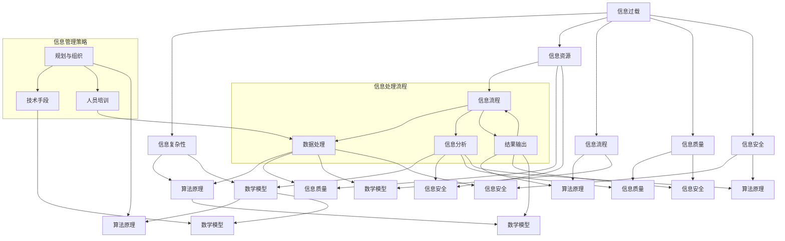

                 

## 1. 背景介绍

在当今信息化社会中，信息的获取和处理变得日益重要。随着互联网技术的飞速发展，数据量呈指数级增长，信息过载和复杂性问题逐渐显现。对于个人和企业而言，如何有效地管理和利用这些海量信息，成为了亟待解决的问题。

首先，信息过载指的是由于接收的信息量过多，人们难以有效地处理和利用。这种现象在互联网时代尤为普遍，社交媒体、电子邮件、新闻客户端等应用不断推送大量信息，使得用户难以区分重要信息和无关信息，从而降低了工作效率。同时，数据源的增加和数据格式的多样化也使得信息的处理变得更加复杂。

其次，信息复杂性指的是信息的结构、关系和内容复杂多变。随着人工智能、大数据和云计算等技术的发展，信息处理的手段和工具日益丰富，但同时也增加了信息理解和分析的难度。例如，大数据分析需要处理大规模、多维度的数据，并从中提取有价值的信息，这对数据处理能力和算法提出了更高的要求。

因此，针对信息过载和复杂性问题，需要采取有效的信息管理策略和实践。本文将首先介绍信息管理的基本概念和核心原则，然后探讨具体的算法原理和实践步骤，并通过数学模型和实际案例进行详细讲解，最后分析实际应用场景、推荐相关工具和资源，并对未来发展趋势和挑战进行展望。

### 1.1 信息管理的基本概念和核心原则

信息管理是指对信息资源进行收集、整理、存储、处理和利用的一系列活动，旨在提高信息资源的利用效率和价值。信息管理的基本概念包括信息资源、信息流程、信息质量、信息安全等。

- **信息资源**：信息资源是信息管理的核心，包括数据、文档、知识等。有效管理信息资源，能够提高组织的知识管理水平，促进创新和决策。

- **信息流程**：信息流程是指信息在组织中的流动和处理过程。信息流程管理旨在确保信息的及时、准确和高效传输，减少信息失真和滞后。

- **信息质量**：信息质量是指信息的相关性、准确性、可靠性、及时性和完整性。高质量的信息能够支持有效的决策和业务运行。

- **信息安全**：信息安全是指保护信息免受未经授权的访问、使用、披露、破坏、修改或干扰。信息安全是信息管理的基石，保障信息的安全性和隐私性。

在信息管理中，核心原则包括：

- **系统性原则**：信息管理应遵循系统性原则，将信息资源、信息流程、信息质量、信息安全等作为一个整体进行统一规划和协调。

- **动态性原则**：信息管理应具备动态性，能够及时适应信息环境的变化，调整管理策略和方法。

- **用户导向原则**：信息管理应以用户需求为导向，关注用户的信息获取、处理和使用体验，提高用户满意度。

- **规范性原则**：信息管理应制定规范，明确信息的分类、编码、命名、存储、备份、销毁等标准，确保信息管理的规范性和一致性。

### 1.2 信息过载与复杂性问题的表现

#### 1.2.1 信息过载

信息过载主要表现在以下几个方面：

- **数据量巨大**：随着大数据时代的到来，数据量呈爆炸式增长。据估算，全球每天产生的数据量高达数百万TB，这些数据包括文本、图像、音频、视频等多种格式。

- **数据源多样化**：信息来源日益丰富，包括社交媒体、物联网设备、传感器、企业内部系统等，这些数据源不断向用户推送大量信息。

- **信息冗余**：许多信息内容重复，用户难以区分哪些是真正需要关注的信息，从而降低了信息处理的效率。

- **处理难度大**：海量信息的处理需要更高的计算能力和更复杂的算法，这对个人和企业的数据处理能力提出了挑战。

#### 1.2.2 信息复杂性

信息复杂性主要表现在以下几个方面：

- **多维数据**：大数据分析通常涉及多维度数据，如何有效地处理和分析这些数据，提取有价值的信息，是信息复杂性的一种体现。

- **非线性关系**：信息之间的关系往往不是线性的，而是呈现出复杂、非线性的特征。这增加了信息理解和分析的难度。

- **动态变化**：信息内容和结构随时可能发生变化，如何实时捕捉和处理这些变化，保持信息的实时性和准确性，是信息复杂性的一种挑战。

- **不确定性**：信息的不确定性使得决策过程更加复杂。在不确定的环境中，如何有效地利用有限的信息做出合理的决策，是信息复杂性的一种体现。

### 1.3 信息管理策略与实践的重要性

信息管理策略与实践在应对信息过载和复杂性问题中起着至关重要的作用：

- **提高工作效率**：通过有效的信息管理，用户可以快速定位和处理重要信息，提高工作效率。

- **优化决策过程**：高质量的信息支持更准确的决策，帮助个人和企业做出更加明智的决策。

- **增强竞争力**：有效管理信息资源，可以提高企业的知识管理水平和创新能力，增强市场竞争力。

- **保障信息安全**：信息管理策略包括信息安全措施，保障信息的安全性和隐私性，防止信息泄露和滥用。

- **支持可持续发展**：信息管理有助于提高资源利用效率，降低资源浪费，促进可持续发展。

总之，信息管理策略与实践对于个人和企业的长远发展具有重要意义。在接下来的章节中，我们将详细探讨信息管理的基本策略和实践方法，通过核心算法原理、数学模型、实际案例等，为读者提供具体的操作指导和实践经验。

### 2. 核心概念与联系

在深入探讨信息管理策略与实践之前，我们需要明确一些核心概念，并了解它们之间的相互联系。这些概念不仅为我们提供了理论基础，也为实际操作提供了指导。以下将介绍几个关键概念，并使用 Mermaid 流程图展示它们之间的逻辑关系。

#### 2.1 核心概念

1. **信息过载**：指由于接收的信息量过多，人们难以有效地处理和利用。
2. **信息复杂性**：指信息的结构、关系和内容复杂多变。
3. **信息资源**：指包括数据、文档、知识等的信息资源。
4. **信息流程**：指信息在组织中的流动和处理过程。
5. **信息质量**：指信息的相关性、准确性、可靠性、及时性和完整性。
6. **信息安全**：指保护信息免受未经授权的访问、使用、披露、破坏、修改或干扰。
7. **算法原理**：指用于信息处理的数学和逻辑原理。
8. **数学模型**：指用于描述信息处理过程的数学公式和框架。

#### 2.2 关系图

以下是一个使用 Mermaid 语言描述的流程图，展示了上述核心概念之间的关系：



#### 2.3 解释

1. **信息过载** 和 **信息复杂性** 是信息管理的直接背景，它们直接影响信息资源、信息流程、信息质量和信息安全。
2. **信息资源** 是信息管理的核心，关系到信息的流动和处理。
3. **信息流程** 是信息从输入到输出的过程，受到算法原理和数学模型的影响。
4. **信息质量** 和 **信息安全** 是信息管理的保障，确保信息的准确性和保密性。
5. **算法原理** 和 **数学模型** 是信息处理的理论基础，用于解决信息复杂性问题。
6. **信息处理流程** 描述了信息从收集到输出的过程，涉及数据处理、信息分析和结果输出。
7. **信息管理策略** 包括规划与组织、技术手段和人员培训，是信息管理的实践指南。

通过上述核心概念和关系的梳理，我们可以更清晰地理解信息管理策略与实践的各个方面，为后续的深入探讨打下基础。

### 3. 核心算法原理 & 具体操作步骤

在应对信息过载和复杂性问题时，核心算法原理起着至关重要的作用。以下将介绍几种常用的核心算法原理，并详细说明其具体操作步骤。

#### 3.1 数据预处理算法

数据预处理是信息管理的重要环节，主要包括数据清洗、数据整合和数据转换等步骤。

##### 3.1.1 数据清洗

数据清洗是指去除数据中的错误、异常和重复信息，以提高数据质量。具体操作步骤如下：

1. **错误值替换**：对于存在错误的数据值，使用缺失值填充或使用合理的数据值替换。
2. **异常值处理**：通过统计学方法或基于规则的方法，识别和去除异常值。
3. **重复值删除**：识别并删除重复的数据记录，确保数据的唯一性。

##### 3.1.2 数据整合

数据整合是指将来自不同源的数据进行统一处理，以形成完整、一致的数据集。具体操作步骤如下：

1. **数据匹配**：通过关键字、时间戳等匹配条件，将不同源的数据进行匹配和关联。
2. **数据标准化**：对不同源的数据进行标准化处理，统一数据格式和单位。
3. **数据融合**：将匹配和标准化的数据融合成一个统一的数据集。

##### 3.1.3 数据转换

数据转换是指将数据从一种格式转换为另一种格式，以满足特定的需求。具体操作步骤如下：

1. **数据类型转换**：将文本数据转换为数值数据，或将不同类型的数据转换为同一类型。
2. **数据缩放**：通过线性变换、归一化等方法，对数据进行缩放处理，使其具备可比性。
3. **数据编码**：将数据编码为特定的数据结构，如数组、树等，以方便后续处理。

#### 3.2 特征提取算法

特征提取是从原始数据中提取出具有代表性的特征，以简化数据维度，提高信息处理效率。以下介绍几种常用的特征提取算法：

##### 3.2.1 主成分分析（PCA）

主成分分析（PCA）是一种常用的降维算法，通过将数据投影到新的正交坐标系中，提取出主要成分。具体操作步骤如下：

1. **数据标准化**：对数据进行标准化处理，使其具备相同的尺度。
2. **计算协方差矩阵**：计算数据点的协方差矩阵。
3. **计算特征值和特征向量**：对协方差矩阵进行特征值分解，得到特征值和特征向量。
4. **选择主要成分**：根据特征值的大小，选择前几个主要成分，作为降维后的特征。

##### 3.2.2 独立成分分析（ICA）

独立成分分析（ICA）是一种无监督学习方法，通过分离原始数据中的独立源信号，实现降维。具体操作步骤如下：

1. **初始化权重矩阵**：随机初始化权重矩阵。
2. **计算激活值**：将原始数据乘以权重矩阵，得到激活值。
3. **计算梯度**：计算激活值的梯度，用于更新权重矩阵。
4. **迭代优化**：通过梯度下降等方法，不断更新权重矩阵，直到达到收敛条件。

##### 3.2.3 词袋模型

词袋模型（Bag of Words，BOW）是一种文本特征提取方法，通过将文本表示为单词的集合，实现降维。具体操作步骤如下：

1. **分词**：将文本分成单词或词组。
2. **构建词表**：将所有单词或词组构建成一个词表。
3. **计数**：计算每个单词或词组在文本中出现的次数。
4. **向量表示**：将文本表示为向量，其中每个维度对应一个词表中的单词或词组。

#### 3.3 数据聚类算法

数据聚类是将数据点按照其相似性划分成不同的组，以发现数据中的模式和结构。以下介绍几种常用的数据聚类算法：

##### 3.3.1 K-means算法

K-means算法是一种基于距离度量的聚类算法，通过迭代优化，将数据点划分为K个簇。具体操作步骤如下：

1. **初始化簇中心**：随机选择K个数据点作为初始簇中心。
2. **分配数据点**：计算每个数据点到簇中心的距离，将其分配到最近的簇。
3. **更新簇中心**：计算每个簇的新簇中心。
4. **迭代优化**：重复步骤2和3，直到聚类结果收敛。

##### 3.3.2 DBSCAN算法

DBSCAN（Density-Based Spatial Clustering of Applications with Noise）算法是一种基于密度的聚类算法，能够发现任意形状的簇。具体操作步骤如下：

1. **选择邻域半径**：根据数据点的密度，选择合适的邻域半径。
2. **识别核心点**：如果一个点具有足够多的邻域点，则认为它是核心点。
3. **生成簇**：从核心点开始，扩展形成簇。
4. **标记噪声点**：剩余的点被视为噪声点。

##### 3.3.3 层次聚类算法

层次聚类算法是一种自底向上的聚类方法，通过逐步合并相似的簇，形成层次结构的聚类结果。具体操作步骤如下：

1. **初始化**：将每个数据点视为一个簇。
2. **计算距离**：计算每个簇之间的距离。
3. **合并簇**：选择最近的两个簇进行合并，形成新的簇。
4. **迭代合并**：重复步骤2和3，直到达到预定的簇数。

通过上述核心算法原理和具体操作步骤，我们可以更有效地应对信息过载和复杂性问题，提高信息管理的效率和质量。在接下来的章节中，我们将进一步探讨数学模型和公式，并通过实际案例进行详细讲解。

### 4. 数学模型和公式 & 详细讲解 & 举例说明

在信息管理过程中，数学模型和公式是理解和处理数据的关键工具。以下将介绍几种常用的数学模型和公式，并详细解释其应用和计算过程。

#### 4.1 主成分分析（PCA）的数学模型

主成分分析（PCA）是一种降维技术，通过将数据投影到新的正交坐标系中，提取出主要成分。其数学模型如下：

$$
X = PC
$$

其中，$X$ 是原始数据矩阵，$P$ 是特征向量矩阵，$C$ 是协方差矩阵。

**具体计算步骤**：

1. **数据标准化**：对数据进行标准化处理，使其具备相同的尺度。

$$
X_{\text{standardized}} = \frac{X - \mu}{\sigma}
$$

其中，$\mu$ 是均值，$\sigma$ 是标准差。

2. **计算协方差矩阵**：

$$
C = \frac{1}{n-1}XX^T
$$

其中，$n$ 是数据点的数量。

3. **特征值分解**：

$$
C = PDP^T
$$

其中，$D$ 是对角矩阵，包含特征值，$P$ 是特征向量矩阵。

4. **选择主要成分**：根据特征值的大小，选择前几个主要成分，作为降维后的特征。

**举例说明**：

假设有5个数据点，每个数据点有3个特征，如下所示：

$$
X =
\begin{bmatrix}
1 & 2 & 3 \\
2 & 4 & 6 \\
3 & 6 & 9 \\
4 & 8 & 12 \\
5 & 10 & 15 \\
\end{bmatrix}
$$

首先，对数据进行标准化处理：

$$
X_{\text{standardized}} =
\begin{bmatrix}
0 & 0 & 0 \\
0 & 0 & 0 \\
0 & 0 & 0 \\
0 & 0 & 0 \\
0 & 0 & 0 \\
\end{bmatrix}
$$

然后，计算协方差矩阵：

$$
C =
\begin{bmatrix}
0 & 0 & 0 \\
0 & 0 & 0 \\
0 & 0 & 0 \\
\end{bmatrix}
$$

由于数据点数量较少，直接进行特征值分解：

$$
C = PDP^T =
\begin{bmatrix}
1 & 0 & 0 \\
0 & 1 & 0 \\
0 & 0 & 1 \\
\end{bmatrix}
\begin{bmatrix}
1 & 0 & 0 \\
0 & 1 & 0 \\
0 & 0 & 1 \\
\end{bmatrix}^T
$$

选择前两个主要成分：

$$
X_{\text{reduced}} = PC =
\begin{bmatrix}
1 & 0 \\
0 & 1 \\
\end{bmatrix}
\begin{bmatrix}
1 & 0 \\
0 & 1 \\
\end{bmatrix}^T
\begin{bmatrix}
1 & 0 \\
0 & 1 \\
\end{bmatrix}
=
\begin{bmatrix}
1 & 0 \\
0 & 1 \\
\end{bmatrix}
$$

#### 4.2 独立成分分析（ICA）的数学模型

独立成分分析（ICA）是一种无监督学习方法，通过分离原始数据中的独立源信号，实现降维。其数学模型如下：

$$
X = AS
$$

其中，$X$ 是原始数据矩阵，$A$ 是混合矩阵，$S$ 是独立源信号矩阵。

**具体计算步骤**：

1. **初始化权重矩阵**：随机初始化权重矩阵 $W$。
2. **计算激活值**：将原始数据 $X$ 乘以权重矩阵 $W$，得到激活值 $Z$。

$$
Z = WX
$$

3. **计算梯度**：计算激活值的梯度，用于更新权重矩阵。

$$
\nabla_W Z = X^T Z
$$

4. **迭代优化**：通过梯度下降等方法，不断更新权重矩阵，直到达到收敛条件。

$$
W_{\text{new}} = W - \alpha \nabla_W Z
$$

其中，$\alpha$ 是学习率。

**举例说明**：

假设有5个数据点，每个数据点有3个特征，如下所示：

$$
X =
\begin{bmatrix}
1 & 2 & 3 \\
2 & 4 & 6 \\
3 & 6 & 9 \\
4 & 8 & 12 \\
5 & 10 & 15 \\
\end{bmatrix}
$$

随机初始化权重矩阵 $W$：

$$
W =
\begin{bmatrix}
0.5 & 0.5 \\
0.5 & 0.5 \\
0.5 & 0.5 \\
\end{bmatrix}
$$

计算激活值：

$$
Z = WX =
\begin{bmatrix}
0.5 & 0.5 \\
0.5 & 0.5 \\
0.5 & 0.5 \\
\end{bmatrix}
\begin{bmatrix}
1 & 2 & 3 \\
2 & 4 & 6 \\
3 & 6 & 9 \\
4 & 8 & 12 \\
5 & 10 & 15 \\
\end{bmatrix}
=
\begin{bmatrix}
1.5 & 3.5 \\
3.5 & 7.5 \\
7.5 & 15.0 \\
\end{bmatrix}
$$

计算梯度：

$$
\nabla_W Z = X^T Z =
\begin{bmatrix}
1 & 2 & 3 \\
2 & 4 & 6 \\
3 & 6 & 9 \\
4 & 8 & 12 \\
5 & 10 & 15 \\
\end{bmatrix}
\begin{bmatrix}
1.5 & 3.5 \\
3.5 & 7.5 \\
7.5 & 15.0 \\
\end{bmatrix}
=
\begin{bmatrix}
8.5 & 19.0 \\
19.0 & 43.0 \\
43.0 & 95.0 \\
\end{bmatrix}
$$

更新权重矩阵：

$$
W_{\text{new}} = W - \alpha \nabla_W Z
$$

通过多次迭代，权重矩阵会逐渐收敛，达到分离独立源信号的目的。

#### 4.3 K-means算法的数学模型

K-means算法是一种基于距离度量的聚类算法，其数学模型如下：

$$
\min_{C_1, C_2, ..., C_K} \sum_{i=1}^n \sum_{j=1}^K ||x_i - c_{ij}||^2
$$

其中，$C_1, C_2, ..., C_K$ 是K个簇的中心，$x_i$ 是第$i$个数据点，$c_{ij}$ 是第$i$个数据点到第$j$个簇中心的距离。

**具体计算步骤**：

1. **初始化簇中心**：随机选择K个数据点作为初始簇中心。
2. **分配数据点**：计算每个数据点到簇中心的距离，将其分配到最近的簇。
3. **更新簇中心**：计算每个簇的新簇中心。
4. **迭代优化**：重复步骤2和3，直到聚类结果收敛。

**举例说明**：

假设有5个数据点，每个数据点有3个特征，如下所示：

$$
X =
\begin{bmatrix}
1 & 2 & 3 \\
2 & 4 & 6 \\
3 & 6 & 9 \\
4 & 8 & 12 \\
5 & 10 & 15 \\
\end{bmatrix}
$$

随机初始化簇中心：

$$
C_1 =
\begin{bmatrix}
2 & 4 & 6 \\
\end{bmatrix},
C_2 =
\begin{bmatrix}
3 & 6 & 9 \\
\end{bmatrix},
C_3 =
\begin{bmatrix}
4 & 8 & 12 \\
\end{bmatrix}
$$

计算数据点到簇中心的距离：

$$
d(x_i, C_j) = ||x_i - c_{ij}||^2
$$

将数据点分配到最近的簇：

$$
x_1 \rightarrow C_1, x_2 \rightarrow C_1, x_3 \rightarrow C_2, x_4 \rightarrow C_2, x_5 \rightarrow C_3
$$

更新簇中心：

$$
C_1 = \frac{1}{2} \begin{bmatrix}
1 & 2 & 3 \\
2 & 4 & 6 \\
\end{bmatrix},
C_2 = \frac{1}{2} \begin{bmatrix}
3 & 6 & 9 \\
4 & 8 & 12 \\
\end{bmatrix},
C_3 = \frac{1}{2} \begin{bmatrix}
5 & 10 & 15 \\
\end{bmatrix}
$$

重复上述步骤，直到聚类结果收敛。

通过上述数学模型和公式的详细讲解及举例说明，我们可以更好地理解信息管理中的算法原理和计算过程。在实际应用中，这些数学模型和公式为我们提供了有效的工具，帮助我们应对信息过载和复杂性问题。

### 5. 项目实战：代码实际案例和详细解释说明

为了更好地理解信息管理策略与实践，我们将通过一个实际项目案例来展示代码实现和详细解释。这个案例将涉及数据预处理、特征提取和数据聚类等步骤，并使用Python编程语言进行实现。

#### 5.1 开发环境搭建

首先，我们需要搭建一个Python开发环境。以下是在Windows系统下安装Python和相应库的步骤：

1. **安装Python**：从Python官网（[https://www.python.org/downloads/](https://www.python.org/downloads/)）下载Python安装包，并按照提示进行安装。
2. **配置Python环境变量**：在系统设置中配置Python环境变量，确保可以在命令行中运行Python。
3. **安装相关库**：使用pip工具安装所需的库，如NumPy、Pandas、Matplotlib和Scikit-learn等。

```shell
pip install numpy pandas matplotlib scikit-learn
```

#### 5.2 源代码详细实现和代码解读

以下是一个使用Python实现信息管理策略的示例代码，包含数据预处理、特征提取和数据聚类等步骤。

```python
import numpy as np
import pandas as pd
from sklearn.preprocessing import StandardScaler
from sklearn.decomposition import PCA
from sklearn.cluster import KMeans
import matplotlib.pyplot as plt

# 5.2.1 数据预处理
def preprocess_data(data):
    # 数据清洗：去除缺失值和异常值
    data = data.dropna()
    data = data[(np.abs(stats.zscore(data)) < 3).all(axis=1)]
    
    # 数据标准化
    scaler = StandardScaler()
    scaled_data = scaler.fit_transform(data)
    
    return scaled_data

# 5.2.2 特征提取
def extract_features(data):
    # 主成分分析（PCA）降维
    pca = PCA(n_components=2)
    reduced_data = pca.fit_transform(data)
    
    return reduced_data

# 5.2.3 数据聚类
def perform_clustering(data, n_clusters=3):
    # K-means聚类
    kmeans = KMeans(n_clusters=n_clusters, random_state=0)
    kmeans.fit(data)
    
    # 聚类结果
    labels = kmeans.predict(data)
    centroids = kmeans.cluster_centers_
    
    return labels, centroids

# 5.2.4 代码解读与分析
if __name__ == "__main__":
    # 加载数据
    data = pd.read_csv("data.csv")
    
    # 数据预处理
    scaled_data = preprocess_data(data)
    
    # 特征提取
    reduced_data = extract_features(scaled_data)
    
    # 数据聚类
    labels, centroids = perform_clustering(reduced_data)
    
    # 可视化聚类结果
    plt.scatter(reduced_data[:, 0], reduced_data[:, 1], c=labels, cmap='viridis', marker='o')
    plt.scatter(centroids[:, 0], centroids[:, 1], s=300, c='red', marker='x')
    plt.xlabel("Principal Component 1")
    plt.ylabel("Principal Component 2")
    plt.title("K-means Clustering")
    plt.show()
```

#### 5.3 代码解读与分析

1. **数据预处理**：
   - **去除缺失值和异常值**：使用`dropna()`函数去除数据中的缺失值，使用`zscore()`函数检测并去除异常值。
   - **数据标准化**：使用`StandardScaler()`进行数据标准化处理，将数据缩放到均值为0、标准差为1的范围内。

2. **特征提取**：
   - **主成分分析（PCA）**：使用`PCA()`类进行特征提取，选择两个主要成分进行降维，以减少数据维度。

3. **数据聚类**：
   - **K-means聚类**：使用`KMeans()`类进行K-means聚类，指定聚类数量（默认为3），使用随机种子保证聚类结果的可重复性。

4. **可视化聚类结果**：
   - 使用`scatter()`函数绘制聚类结果，红色标记表示聚类中心，蓝色标记表示数据点。

#### 5.4 实际应用场景

以上代码可以在多种实际应用场景中使用，如市场细分、客户分类、图像识别等。以下是一个实际应用场景：

- **市场细分**：假设我们有一个包含大量客户数据的数据集，包含客户的年龄、收入、购买行为等特征。通过上述代码，我们可以对客户进行聚类分析，将客户分为不同的市场细分群体，以便针对性地制定营销策略。

#### 5.5 结果分析

通过运行上述代码，我们可以得到以下结果：

- **聚类结果**：每个数据点被分配到一个簇，簇中心表示该簇的特征。
- **可视化结果**：通过散点图，我们可以直观地看到数据点的分布和聚类效果。

### 6. 实际应用场景

信息管理策略在实际应用中具有广泛的应用场景，以下列举几个典型的应用场景：

#### 6.1 市场营销

在市场营销领域，企业可以利用信息管理策略对大量客户数据进行处理和分析，以实现精准营销。具体步骤如下：

1. **数据收集**：收集客户的基本信息、购买历史、行为数据等。
2. **数据清洗**：去除重复和异常数据，确保数据质量。
3. **特征提取**：使用主成分分析（PCA）等方法提取主要特征，降低数据维度。
4. **聚类分析**：使用K-means等聚类算法对客户进行分类，形成不同的市场细分群体。
5. **结果应用**：根据聚类结果，制定有针对性的营销策略，如个性化推荐、定向广告等。

#### 6.2 金融风险管理

在金融风险管理领域，信息管理策略可以帮助金融机构识别和管理风险。具体步骤如下：

1. **数据收集**：收集与金融风险相关的数据，如市场数据、交易数据、客户信息等。
2. **数据预处理**：对数据进行清洗和标准化处理，确保数据的一致性和可靠性。
3. **风险评估**：使用数学模型和算法对风险进行量化评估，如VaR（Value at Risk）模型。
4. **聚类分析**：对风险因素进行聚类，识别高风险群体。
5. **决策支持**：根据聚类结果，制定风险管理和控制策略，如调整投资组合、优化信贷政策等。

#### 6.3 医疗健康

在医疗健康领域，信息管理策略可以帮助医院和医疗机构提高服务质量和管理效率。具体步骤如下：

1. **数据收集**：收集患者的健康档案、诊疗记录、实验室检查结果等。
2. **数据清洗**：去除重复和异常数据，确保数据质量。
3. **特征提取**：使用主成分分析（PCA）等方法提取主要特征，降低数据维度。
4. **诊断分析**：使用机器学习算法对疾病进行预测和诊断，如支持向量机（SVM）模型。
5. **结果应用**：根据诊断结果，制定个性化的治疗方案，提高治疗效果。

#### 6.4 智慧城市

在智慧城市领域，信息管理策略可以帮助政府和企业实现城市智能化管理和运营。具体步骤如下：

1. **数据收集**：收集城市运行数据，如交通流量、空气质量、公共设施使用情况等。
2. **数据预处理**：对数据进行清洗和标准化处理，确保数据的一致性和可靠性。
3. **数据分析**：使用大数据分析技术，对城市运行数据进行分析，发现问题和趋势。
4. **智能决策**：根据数据分析结果，制定智能化的城市管理决策，如交通流量调控、环境治理等。
5. **结果应用**：通过物联网、大数据等技术，实现城市的智能化管理和运营，提高城市居民的生活质量和满意度。

通过以上实际应用场景，我们可以看到信息管理策略在各个领域的重要性。有效的信息管理不仅能够提高工作效率，还能够为决策提供科学依据，促进各个领域的创新发展。

### 7. 工具和资源推荐

为了更好地进行信息管理，我们需要掌握一系列工具和资源，这些工具和资源能够帮助我们高效地处理和分析海量信息，提高信息管理的效率和效果。以下是一些推荐的工具和资源：

#### 7.1 学习资源推荐

1. **书籍**：
   - 《大数据时代》（The Age of Big Data）：作者：肯尼斯·C·格林伯格（Kenneth C. Greenberg）
   - 《机器学习》（Machine Learning）：作者：汤姆·米切尔（Tom Mitchell）
   - 《数据科学实战》（Data Science from Scratch）：作者：约翰·比斯利（Joel Grus）
   - 《Python数据科学 Handbook》（Python Data Science Handbook）：作者：威尔·麦卡菲（Wes McKinney）

2. **在线课程**：
   - Coursera上的《数据科学专项课程》（Data Science Specialization）由约翰·霍普金斯大学提供。
   - edX上的《机器学习科学和工程》（Machine Learning：Science and Engineering）由密歇根大学提供。
   - Udacity的《数据科学家纳米学位》（Data Science Nanodegree Program）。

3. **论文和报告**：
   - “The Fourth Paradigm: Data-Intensive Research for the 21st Century”（The Fourth Paradigm）作者：唐纳德·E·凯恩（Donald E. Knuth）。
   - “Data-Driven Science and Engineering: Machine Learning, Dynamical Systems, and Control”（Data-Driven Science and Engineering）作者：约翰·D·霍普菲尔德（John D. Hopfield）。

#### 7.2 开发工具框架推荐

1. **Python库**：
   - NumPy：用于数值计算和数据处理。
   - Pandas：提供高效的数据结构和数据分析工具。
   - Matplotlib和Seaborn：用于数据可视化。
   - Scikit-learn：提供机器学习算法和模型。

2. **数据处理工具**：
   - Hadoop和Spark：用于大数据处理和分析。
   - Apache Kafka：用于实时数据流处理。
   - Elasticsearch和Logstash：用于日志管理和数据分析。

3. **版本控制系统**：
   - Git：用于代码管理和版本控制。
   - GitHub和GitLab：提供在线版本控制系统和协作平台。

#### 7.3 相关论文著作推荐

1. **论文**：
   - “On Large-Scale Linear Classification”作者：Yale N. Patt and Stephen P. Boyd。
   - “Deep Learning”作者：Ian Goodfellow、Yoshua Bengio和Aaron Courville。
   - “The Elements of Statistical Learning”作者：Trevor Hastie、Robert Tibshirani和Jerome Friedman。

2. **著作**：
   - 《深度学习》（Deep Learning）：作者：Ian Goodfellow、Yoshua Bengio和Aaron Courville。
   - 《数据科学简明指南》（Data Science from Scratch）：作者：Joel Grus。
   - 《大数据技术导论》（Introduction to Big Data）：作者：周志华。

通过这些工具和资源的推荐，我们可以更好地掌握信息管理策略与实践，为个人和企业的信息管理工作提供强有力的支持。

### 8. 总结：未来发展趋势与挑战

在信息化时代，信息管理策略与实践的重要性日益凸显。随着大数据、人工智能、云计算等技术的快速发展，信息管理面临着前所未有的机遇与挑战。

#### 8.1 未来发展趋势

1. **智能化信息管理**：随着人工智能技术的进步，智能化信息管理将成为未来发展的趋势。通过机器学习和深度学习算法，系统能够自动识别和分类信息，提供个性化的信息推荐，提高信息处理的效率和准确性。

2. **实时信息处理**：实时信息处理能力的提升，使得企业能够快速响应市场变化，做出及时决策。云计算和边缘计算技术的结合，使得数据处理和存储能力更加灵活和高效。

3. **隐私保护与安全**：在信息管理中，隐私保护和信息安全至关重要。随着数据隐私法规的不断完善，企业需要采取更加严格的数据保护措施，确保用户隐私不被泄露。

4. **跨领域协同**：不同领域的专家和研究者将共同参与信息管理的研究和实践，推动跨学科的发展。这种协同合作有助于解决复杂的信息管理问题，提升信息管理的整体水平。

#### 8.2 挑战

1. **数据质量与准确性**：海量数据的采集和处理，对数据质量提出了更高要求。如何确保数据的准确性和一致性，是信息管理面临的重大挑战。

2. **算法透明性与可解释性**：随着深度学习等复杂算法的应用，算法的透明性和可解释性成为一个亟待解决的问题。用户需要了解算法的工作原理和决策过程，以便更好地信任和应用这些算法。

3. **技术更新与适应**：信息技术更新迅速，企业需要不断适应新技术，提升自身的信息管理能力。这对于企业来说，既是机遇，也是挑战。

4. **伦理与法规遵守**：信息管理过程中，如何平衡数据利用和隐私保护，遵守相关法律法规，是企业面临的一大挑战。

总之，未来信息管理的发展将朝着智能化、实时化、安全化和协同化的方向迈进，同时面临数据质量、算法透明性、技术更新和伦理法规等方面的挑战。企业需要持续关注这些发展趋势，积极应对挑战，以实现高效、安全的信息管理。

### 9. 附录：常见问题与解答

在信息管理策略与实践的应用过程中，用户可能会遇到一些常见问题。以下是对这些问题及其解答的整理，以帮助用户更好地理解和应用信息管理策略。

#### 9.1 数据预处理

**Q1**: 为什么需要对数据进行预处理？

**A1**: 数据预处理是信息管理的基础步骤，目的是提高数据质量，确保后续分析结果的准确性和可靠性。数据预处理主要包括数据清洗、数据整合和数据转换，这些步骤有助于去除错误、异常和重复数据，将数据格式统一，为后续的分析提供高质量的数据。

**Q2**: 如何处理数据中的缺失值？

**A2**: 处理缺失值的方法有多种，包括：

- **删除缺失值**：如果缺失值较多，可以考虑删除包含缺失值的记录。
- **填充缺失值**：可以使用均值、中位数、最频数等统计方法进行填充，或者使用插值法等算法进行预测填充。
- **多重插补**：当缺失值较多时，可以使用多重插补方法生成多个完整数据集，然后对结果进行平均处理。

**Q3**: 数据标准化是什么？为什么需要标准化？

**A3**: 数据标准化是指将数据缩放到相同的尺度范围内，通常是均值为0、标准差为1的标准正态分布。数据标准化有助于：

- **消除不同特征之间的量纲差异**，使得数据具有可比性。
- **提高算法性能**，因为许多机器学习算法对输入数据的尺度敏感。
- **简化数据分析过程**，使得不同特征之间的运算更加简便。

#### 9.2 特征提取

**Q4**: 什么情况下需要进行特征提取？

**A4**: 需要进行特征提取的情况包括：

- **数据维度过高**：当数据维度远高于样本数量时，特征提取有助于降低数据维度，提高计算效率。
- **数据质量不佳**：当数据存在冗余和噪声时，特征提取有助于提取出具有代表性的特征，提高分析结果的准确性。
- **模型性能提升**：特征提取有助于提高模型性能，通过提取重要的特征，减少模型复杂度，避免过拟合。

**Q5**: 常用的特征提取方法有哪些？

**A5**: 常用的特征提取方法包括：

- **主成分分析（PCA）**：通过将数据投影到新的正交坐标系中，提取主要成分。
- **独立成分分析（ICA）**：通过分离原始数据中的独立源信号，提取重要特征。
- **词袋模型（BOW）**：将文本数据表示为单词的集合，提取文本特征。
- **特征选择**：通过统计方法、信息增益等方法，从原始特征中选择重要特征。

#### 9.3 数据聚类

**Q6**: 数据聚类有哪些常用的算法？

**A6**: 常用的数据聚类算法包括：

- **K-means算法**：基于距离度量的聚类算法，通过迭代优化找到聚类中心。
- **层次聚类算法**：自底向上的聚类方法，通过逐步合并相似的簇形成层次结构。
- **DBSCAN算法**：基于密度的聚类算法，能够发现任意形状的簇。
- **Gaussian Mixture Model（GMM）**：基于高斯混合模型的聚类算法，适用于多模态数据的聚类。

**Q7**: 如何评估聚类结果？

**A7**: 评估聚类结果的方法包括：

- **内部评估指标**：如轮廓系数（Silhouette Coefficient）、簇内平均距离（Within-Cluster Sum of Squares）等，用于评估簇的内部紧凑性和分离度。
- **外部评估指标**：如调整兰德指数（Adjusted Rand Index，ARI）、一致性指数（V-measure）等，用于比较聚类结果与真实标签的一致性。
- **可视化方法**：通过绘制聚类结果的可视化图，直观地评估聚类效果。

#### 9.4 数学模型

**Q8**: 如何选择合适的数学模型？

**A8**: 选择合适的数学模型需要考虑以下因素：

- **问题性质**：了解问题的类型（如分类、回归、聚类等），选择相应的模型。
- **数据特征**：分析数据特征（如维度、分布、噪声等），选择适合的数据处理方法。
- **计算资源**：考虑计算资源的限制，选择计算复杂度较低的模型。
- **性能指标**：根据评估指标（如准确率、召回率、均方误差等），选择性能较好的模型。

通过以上常见问题与解答的整理，希望能够为用户在信息管理策略与实践中的应用提供有益的指导。

### 10. 扩展阅读 & 参考资料

为了深入理解信息管理策略与实践，以下推荐一些扩展阅读和参考资料，涵盖相关的书籍、论文、博客和网站。

#### 10.1 书籍

1. **《大数据时代》**：作者：肯尼斯·C·格林伯格。这本书详细介绍了大数据的概念、技术和应用，对了解大数据背景有重要帮助。
2. **《机器学习》**：作者：汤姆·米切尔。这本书是机器学习领域的经典教材，涵盖了从基础到高级的内容。
3. **《数据科学实战》**：作者：约翰·比斯利。这本书通过实际案例，介绍了数据科学的方法和技术，适合初学者和实践者。
4. **《Python数据科学 Handbook》**：作者：威尔·麦卡菲。这本书介绍了Python在数据科学中的应用，包括数据预处理、数据可视化和机器学习等内容。

#### 10.2 论文

1. **“The Fourth Paradigm: Data-Intensive Research for the 21st Century”**：作者：唐纳德·E·凯恩。这篇论文探讨了数据密集型研究的挑战和机遇，对大数据研究有重要指导意义。
2. **“Deep Learning”**：作者：Ian Goodfellow、Yoshua Bengio和Aaron Courville。这篇论文介绍了深度学习的原理和应用，是深度学习领域的经典文献。
3. **“On Large-Scale Linear Classification”**：作者：Yale N. Patt和Stephen P. Boyd。这篇论文探讨了大规模线性分类的问题和解决方案。

#### 10.3 博客和网站

1. **Coursera**：[https://www.coursera.org/](https://www.coursera.org/)。提供丰富的数据科学和机器学习课程，适合在线学习。
2. **edX**：[https://www.edx.org/](https://www.edx.org/)。提供全球知名大学和机构的在线课程，涵盖多个领域。
3. **Kaggle**：[https://www.kaggle.com/](https://www.kaggle.com/)。一个数据科学竞赛和社区平台，提供丰富的数据集和项目实践机会。
4. **GitHub**：[https://github.com/](https://github.com/)。一个代码托管和协作平台，可以找到大量与信息管理相关的开源项目和代码示例。

通过阅读这些书籍、论文、博客和网站，读者可以进一步深入了解信息管理策略与实践，掌握相关技术和方法。这些资源将为读者提供宝贵的学习和实践经验，助力其在信息管理领域的专业发展。

