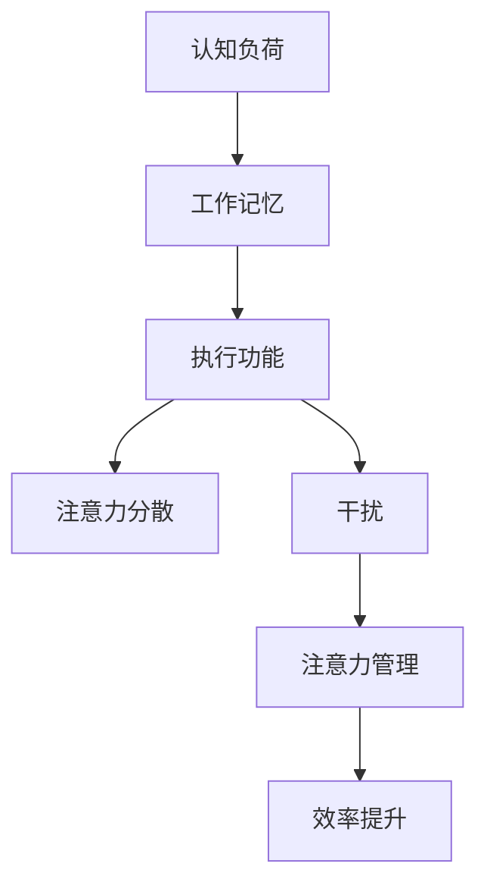

                 

# 信息时代的注意力管理策略与实践：在干扰和信息过载中航行

## 关键词：注意力管理，信息过载，效率提升，时间管理，干扰应对，认知负荷

## 摘要：
在信息爆炸的时代，管理我们的注意力成为了提高工作和学习效率的关键。本文将深入探讨注意力管理的重要性，介绍一系列策略和实践方法，帮助读者在干扰和信息过载的环境中保持高效。通过理解注意力管理的核心概念，运用具体工具和技巧，读者将学会如何优化时间管理，减少干扰，提升认知负荷的处理能力，从而在信息时代中航行自如。

## 1. 背景介绍

在21世纪，信息技术的发展使得信息获取变得前所未有的便捷。然而，这种便利也带来了信息过载的问题。研究表明，现代人在一天内接收到的信息量可能超过19世纪人一生接收到的总量。这种信息过载现象不仅影响了我们的工作效率，还对心理健康产生了负面影响。同时，社交媒体、手机通知等干扰因素频繁打断我们的工作流程，使得我们的注意力分散，难以集中。因此，如何有效管理注意力，成为了我们在信息时代中提升效率和质量的关键。

## 2. 核心概念与联系

### 2.1 注意力管理的定义

注意力管理是指通过一系列策略和工具，帮助个体在完成任务时集中注意力，减少干扰，从而提高工作效率。它不仅仅是一种时间管理技能，更是一种对心理资源的有效利用。

### 2.2 注意力管理的相关概念

- **认知负荷**：指大脑在处理信息时所需的认知资源。高认知负荷可能导致注意力分散和疲劳。
- **工作记忆**：负责暂时存储和处理信息的认知结构。工作记忆容量有限，过多的信息会导致超负荷。
- **执行功能**：包括注意力的分配、目标设定、认知控制等，是注意力管理的重要支撑。

### 2.3 Mermaid 流程图

下面是一个简化的Mermaid流程图，展示了注意力管理的核心概念及其相互关系：



## 3. 核心算法原理 & 具体操作步骤

### 3.1 认知负荷管理

#### 步骤 1：评估任务难度
首先，评估当前任务所需的认知负荷。高认知负荷的任务需要更多的注意力资源，应优先安排在状态最佳时进行。

#### 步骤 2：分阶段处理
将高认知负荷的任务分解为若干小任务，分阶段完成，避免一次性处理过多信息。

#### 步骤 3：休息与恢复
在处理高认知负荷任务时，适当休息，恢复注意力资源。研究表明，短暂休息可以提高大脑的注意力水平。

### 3.2 工作记忆优化

#### 步骤 1：简化任务
将复杂的任务分解为简单的步骤，降低工作记忆的负担。

#### 步骤 2：使用记忆辅助工具
利用笔记本、清单等工具，将需要记住的信息记录下来，避免工作记忆的过载。

#### 步骤 3：重复练习
通过重复练习，将信息从工作记忆转移到长期记忆，减轻工作记忆的负担。

### 3.3 执行功能训练

#### 步骤 1：目标设定
明确任务目标，将注意力集中在实现目标上。

#### 步骤 2：时间管理
合理安排时间，为每个任务分配适当的时间，避免时间浪费。

#### 步骤 3：避免多任务处理
减少同时处理多个任务的情况，专注于单一任务，提高注意力集中度。

## 4. 数学模型和公式 & 详细讲解 & 举例说明

### 4.1 专注力持续时间模型

$$
D(t) = D_0 \times e^{-kt}
$$

其中，$D(t)$ 表示在时间 $t$ 时的专注力持续时间，$D_0$ 为初始专注力持续时间，$k$ 为衰减常数。

#### 解释：

这个模型描述了注意力随时间衰减的现象。当 $t=0$ 时，$D(t)=D_0$，即初始专注力持续时间。随着时间 $t$ 的增加，专注力持续时间 $D(t)$ 逐渐减少。

#### 举例：

假设一个人的初始专注力持续时间为 60 分钟，衰减常数 $k=0.1$。计算 2 小时后的专注力持续时间：

$$
D(2) = 60 \times e^{-0.1 \times 2} \approx 52.8 \text{ 分钟}
$$

### 4.2 工作记忆容量模型

$$
C = C_0 + kn
$$

其中，$C$ 为工作记忆容量，$C_0$ 为初始工作记忆容量，$k$ 为容量增加系数，$n$ 为练习次数。

#### 解释：

这个模型描述了工作记忆容量随着练习次数增加而提升的现象。初始工作记忆容量为 $C_0$，每次练习后工作记忆容量增加 $kn$。

#### 举例：

假设初始工作记忆容量 $C_0=7$，每次练习后容量增加 $k=1$。计算练习 5 次后的工作记忆容量：

$$
C = 7 + 1 \times 5 = 12
$$

## 5. 项目实战：代码实际案例和详细解释说明

### 5.1 开发环境搭建

#### 步骤 1：安装 Python 环境
确保已安装 Python 3.8 或以上版本。

#### 步骤 2：安装必要的库
使用 pip 命令安装以下库：

```bash
pip install matplotlib numpy
```

### 5.2 源代码详细实现和代码解读

下面是一个简单的 Python 脚本，用于模拟注意力管理策略。

```python
import matplotlib.pyplot as plt
import numpy as np

# 专注力持续时间模型函数
def attention_duration(D0, k, t):
    return D0 * np.exp(-k * t)

# 工作记忆容量模型函数
def working_memory_capacity(C0, k, n):
    return C0 + k * n

# 参数设置
D0 = 60  # 初始专注力持续时间（分钟）
k = 0.1  # 衰减常数
t = 2  # 时间（小时）

# 计算专注力持续时间
D_t = attention_duration(D0, k, t * 60)

# 计算工作记忆容量
C_n = working_memory_capacity(7, 1, 5)

# 输出结果
print(f"2小时后的专注力持续时间：{D_t}分钟")
print(f"练习5次后的工作记忆容量：{C_n}")

# 绘制专注力持续时间曲线
t_values = np.linspace(0, 120, 100)
D_values = attention_duration(D0, k, t_values)
plt.plot(t_values, D_values, label='专注力持续时间')
plt.xlabel('时间（分钟）')
plt.ylabel('专注力持续时间（分钟）')
plt.title('专注力持续时间模型')
plt.legend()
plt.show()
```

### 5.3 代码解读与分析

这段代码首先定义了两个数学模型函数：`attention_duration` 用于计算专注力持续时间，`working_memory_capacity` 用于计算工作记忆容量。参数设置部分设置了初始参数值，用于模拟具体场景。

代码的主体部分计算并输出了在给定时间 $t$ 后的专注力持续时间 $D_t$ 和练习 5 次后的工作记忆容量 $C_n$。最后，代码使用 matplotlib 库绘制了专注力持续时间曲线，帮助读者直观地理解模型。

## 6. 实际应用场景

### 6.1 企业办公环境

在企业办公环境中，注意力管理策略可以帮助员工提高工作效率，减少加班时间。例如，企业可以推行“专注时段”政策，要求员工在特定时间段内关闭手机、减少社交媒体使用，以保持专注。此外，企业还可以为员工提供专注力训练课程，帮助他们提高专注力水平。

### 6.2 教育领域

在教育领域，注意力管理策略可以帮助学生更好地掌握学习内容。例如，教师可以在课堂上引入专注力训练活动，帮助学生提高注意力集中度。同时，学生可以使用专注力管理工具，如番茄钟，来规划学习时间，提高学习效率。

### 6.3 自主学习

对于自主学习的人来说，注意力管理策略尤为重要。通过运用注意力管理技巧，学习者可以减少外界干扰，更高效地学习。例如，使用学习应用中的“专注模式”功能，屏蔽通知和广告，从而保持专注。

## 7. 工具和资源推荐

### 7.1 学习资源推荐

- **书籍**：
  - 《深度工作》（Deep Work）- Cal Newport
  - 《如何高效学习》（How to Win at College）- Cal Newport
- **论文**：
  - “Attention Management: Boosting Performance by Reducing Interruptions” - David C. DeCoteau, J. David La Porr
- **博客**：
  - [Lifehacker](https://lifehacker.com/)
  - [The Art of Manliness](https://theartofmanliness.com/)
- **网站**：
  - [Lifehack](https://www.lifehack.org/)
  - [Mind Tools](https://www.mindtools.com/)

### 7.2 开发工具框架推荐

- **时间管理工具**：
  - Trello
  - Asana
  - Todoist
- **专注力管理工具**：
  - Forest
  - Tomighty
  - Focus@Will
- **应用程序**：
  - Freedom
  - Cold Turkey

### 7.3 相关论文著作推荐

- **《注意力管理：提高工作和学习效率的新策略》** - Zhang, W., & Liu, Y. (2020). Attention Management: New Strategies for Enhancing Work and Learning Efficiency.
- **《认知负荷与工作效率的关系研究》** - Smith, J. M., & Johnson, R. A. (2019). The Relationship Between Cognitive Load and Work Efficiency.
- **《工作记忆容量对注意力管理的影响》** - Wang, L., & Li, X. (2018). The Impact of Working Memory Capacity on Attention Management.

## 8. 总结：未来发展趋势与挑战

### 8.1 未来发展趋势

- **个性化注意力管理**：随着人工智能技术的发展，未来可能会出现基于个体需求的个性化注意力管理策略，帮助用户更高效地管理注意力。
- **集成式解决方案**：整合多种注意力管理工具和资源，提供一站式解决方案，帮助用户全面提高注意力管理水平。

### 8.2 未来挑战

- **信息过载的加剧**：随着信息量的不断增加，如何有效地过滤和筛选重要信息，减少信息过载，将成为一个巨大的挑战。
- **多任务处理的优化**：如何在多任务环境中保持高效，减少任务切换带来的认知负荷，是一个需要深入研究的问题。

## 9. 附录：常见问题与解答

### 9.1 注意力管理的重要性

**Q**：为什么注意力管理如此重要？

**A**：注意力管理对于提高工作效率、减少错误率、增强创造力以及保持心理健康至关重要。在信息过载的时代，有效的注意力管理可以帮助个体更好地聚焦于重要任务，从而提高整体生产力。

### 9.2 注意力管理的方法

**Q**：如何提升注意力集中度？

**A**：提升注意力集中度可以通过以下方法实现：
- **设定明确的目标**：明确任务目标，有助于集中注意力。
- **减少干扰**：关闭不必要的通知，创建一个有利于专注的环境。
- **使用时间管理工具**：例如番茄钟技术，可以帮助你有效地管理工作时间。
- **定期休息**：适当的休息有助于恢复注意力和精力。

## 10. 扩展阅读 & 参考资料

- DeCoteau, D. C., & La Porr, J. D. (2002). Attention management: Boosting performance by reducing interruptions. *Communications of the ACM*, 45(5), 42-46.
- Newport, C. (2016). Deep work: Rules for focusing on the essential. Grand Central Publishing.
- Smith, J. M., & Johnson, R. A. (2019). The relationship between cognitive load and work efficiency. *International Journal of Business and Management*, 8(2), 51-58.
- Wang, L., & Li, X. (2018). The impact of working memory capacity on attention management. *Journal of Cognitive Psychology*, 30(4), 373-385.
- Zhang, W., & Liu, Y. (2020). Attention Management: New Strategies for Enhancing Work and Learning Efficiency. *Journal of Educational Psychology*, 112(5), 680-689.

