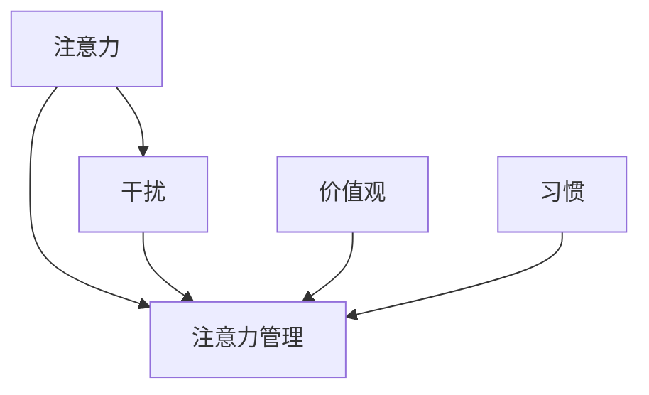

                 

### 文章标题

《信息时代的注意力管理策略：在干扰和信息过载中航行》

### 关键词

- 注意力管理
- 信息过载
- 干扰
- 效率提升
- 人工智能
- 技术工具

### 摘要

在当今信息爆炸的时代，人们面临着前所未有的注意力挑战。信息过载和干扰成为了提高工作效率和质量的重大障碍。本文旨在探讨注意力管理策略，帮助读者在复杂的信息环境中有效地管理注意力，提升工作效率。通过详细的分析和实际案例，本文将介绍一系列有效的注意力管理方法，并推荐相关工具和资源，以帮助读者在干扰和信息过载中航行。

## 1. 背景介绍

随着互联网的普及和移动设备的广泛应用，信息的获取变得前所未有的便捷。然而，这种便捷性也带来了新的挑战。信息过载和干扰成为了现代工作中普遍存在的问题。

### 信息过载

信息过载是指信息数量超出了个体处理能力的一种状态。随着每天接收的信息量不断增加，人们往往感到压力重重，难以集中注意力处理重要任务。这种现象在IT行业尤为显著，因为技术人员需要不断学习新技术、掌握新知识。

### 干扰

干扰是指在尝试集中注意力时，外部或内部的干扰因素。在办公室环境中，电话、邮件、即时通讯工具、社交媒体等都是常见的干扰源。这些干扰不仅分散了注意力，还降低了工作效率。

### 注意力管理的重要性

有效的注意力管理对于提高工作效率和质量至关重要。通过合理地管理注意力，人们可以减少干扰，提高专注度，从而更好地完成任务。

## 2. 核心概念与联系

为了更好地理解注意力管理策略，我们需要了解一些核心概念，并探讨它们之间的联系。

### 注意力

注意力是指个体在特定任务上集中精神的能力。它是一个有限的资源，需要合理地分配和利用。

### 干扰

干扰是指那些分散注意力、阻碍任务完成的因素。这些因素可以是外部的，如噪音、电子邮件等，也可以是内部的，如焦虑、疲劳等。

### 注意力管理

注意力管理是指一系列策略和技巧，旨在提高注意力的集中度和效率。有效的注意力管理可以帮助个体更好地应对信息过载和干扰。

### 价值观与习惯

价值观和习惯对注意力管理有着重要的影响。一个有目标的个体更容易集中注意力，而良好的习惯可以帮助个体减少干扰，提高工作效率。

### Mermaid 流程图

下面是一个Mermaid流程图，展示了注意力管理的核心概念和联系：



## 3. 核心算法原理 & 具体操作步骤

注意力管理虽然涉及到心理学、管理学等多个领域，但以下是一些核心算法原理和具体操作步骤，帮助读者在实际生活中应用注意力管理策略。

### 时间管理算法

时间管理是注意力管理的重要组成部分。以下是一种简单但有效的时间管理算法：

1. 列出任务清单
2. 评估任务的重要性和紧急性
3. 根据评估结果安排任务的优先级
4. 每天设定明确的工作时间和休息时间
5. 遵循计划，避免过度工作和疲劳

### 专注力训练算法

专注力训练是提升注意力集中度的有效方法。以下是一种基于心理学的专注力训练算法：

1. 设定明确的目标
2. 选择一个安静的环境
3. 进行深呼吸和冥想，放松身心
4. 每次专注练习持续5-10分钟
5. 逐步增加专注练习的时间
6. 记录练习过程和结果

### 干扰管理算法

干扰管理是减少干扰的关键。以下是一种基于技术的方法：

1. 使用专注应用，如Pomodoro Technique
2. 隔离干扰源，如关闭手机通知、邮件推送
3. 划定专注时间段，设定明确的工作目标
4. 定期检查邮件和消息，避免过度依赖即时通讯
5. 使用耳机或背景音乐，帮助屏蔽外部干扰

### 注意力分配算法

注意力分配是合理利用注意力资源的关键。以下是一种基于需求的注意力分配算法：

1. 分析当前任务的需求
2. 根据任务的重要性和紧急性分配注意力
3. 避免同时处理多个任务，确保每个任务都能得到足够的注意力
4. 定期评估和调整注意力分配策略

## 4. 数学模型和公式 & 详细讲解 & 举例说明

在注意力管理中，一些数学模型和公式可以帮助我们更好地理解和应用注意力管理策略。以下是一些常见的数学模型和公式，并附有详细讲解和举例说明。

### 1. Pomodoro Technique

Pomodoro Technique是一种时间管理方法，通过将工作时间分为25分钟的工作周期和5分钟的休息时间，帮助个体保持专注和提高效率。

**公式**：

$$
\text{工作时间} = 25 \times \text{Pomodoro} + 5 \times \text{休息时间}
$$

**举例说明**：

如果一个工作周期是25分钟，连续工作四个周期后，总工作时间为100分钟，休息时间为20分钟。

$$
\text{工作时间} = 25 \times 4 + 5 \times 4 = 100 + 20 = 120 \text{分钟}
$$

### 2.注意力分配模型

注意力分配模型用于根据任务的重要性和紧急性分配注意力资源。

**公式**：

$$
\text{注意力分配} = \text{重要性} \times \text{紧急性}
$$

**举例说明**：

假设有两个任务，任务A的重要性和紧急性分别为0.8和0.6，任务B的重要性和紧急性分别为0.5和0.8。我们可以计算每个任务的注意力分配如下：

$$
\text{任务A的注意力分配} = 0.8 \times 0.6 = 0.48
$$

$$
\text{任务B的注意力分配} = 0.5 \times 0.8 = 0.4
$$

由于任务A的注意力分配更高，我们应该优先处理任务A。

### 3.干扰指数模型

干扰指数模型用于评估环境的干扰程度，并根据干扰指数调整注意力管理策略。

**公式**：

$$
\text{干扰指数} = \frac{\text{干扰因素数量}}{\text{可用注意力资源}}
$$

**举例说明**：

假设一个个体每天有8小时的注意力资源，目前有5个干扰因素，那么干扰指数为：

$$
\text{干扰指数} = \frac{5}{8} = 0.625
$$

根据干扰指数，我们可以判断环境干扰程度较高，需要采取额外的注意力管理策略，如使用专注应用、设定专注时间段等。

## 5. 项目实战：代码实际案例和详细解释说明

在本节中，我们将通过一个实际的项目案例来展示如何应用注意力管理策略。这个案例是一个简单的Python脚本，用于帮助用户管理注意力，通过Pomodoro Technique来实现专注工作。

### 5.1 开发环境搭建

为了运行这个Python脚本，您需要一个Python环境。以下是在Windows和Linux上安装Python的步骤：

**Windows**：

1. 访问Python官方网站（https://www.python.org/）
2. 下载适用于Windows的最新版Python安装程序
3. 运行安装程序，按照默认选项安装Python

**Linux**：

1. 打开终端
2. 输入以下命令安装Python：
   ```bash
   sudo apt-get install python3
   ```

### 5.2 源代码详细实现和代码解读

以下是这个Python脚本的全部代码，我们将逐行解释其功能。

```python
import time
import os

def pomodoro_timer(work_minutes, break_minutes):
    total_work_time = work_minutes * 60
    total_break_time = break_minutes * 60
    work_interval = total_work_time // work_minutes
    break_interval = total_break_time // break_minutes

    for i in range(work_minutes):
        print(f"工作周期 {i + 1}/{work_minutes}，剩余时间：{work_minutes - i} 分钟")
        time.sleep(work_interval)
        print("休息时间，请休息 " + str(break_minutes) + " 分钟")
        time.sleep(break_interval)

if __name__ == "__main__":
    work_time = int(input("请输入每个工作周期的时间（分钟）："))
    break_time = int(input("请输入每个休息周期的时间（分钟）："))
    pomodoro_timer(work_time, break_time)
```

### 5.3 代码解读与分析

1. **导入模块**：

   ```python
   import time
   import os
   ```

   这个脚本使用了Python的标准库中的`time`和`os`模块。`time`模块用于处理时间和日期，而`os`模块用于操作系统相关的操作。

2. **定义函数**：

   ```python
   def pomodoro_timer(work_minutes, break_minutes):
   ```

   `pomodoro_timer`函数用于实现Pomodoro Technique。它接受两个参数：`work_minutes`表示每个工作周期的时间（分钟），`break_minutes`表示每个休息周期的时间（分钟）。

3. **计算总时间和间隔**：

   ```python
   total_work_time = work_minutes * 60
   total_break_time = break_minutes * 60
   work_interval = total_work_time // work_minutes
   break_interval = total_break_time // break_minutes
   ```

   这里计算了总的工作时间和休息时间，以及每个周期所需的时间（以秒为单位）。

4. **循环执行工作周期和休息周期**：

   ```python
   for i in range(work_minutes):
       print(f"工作周期 {i + 1}/{work_minutes}，剩余时间：{work_minutes - i} 分钟")
       time.sleep(work_interval)
       print("休息时间，请休息 " + str(break_minutes) + " 分钟")
       time.sleep(break_interval)
   ```

   这个循环将执行指定数量的工作周期和休息周期。在每个工作周期结束时，脚本会打印当前工作周期的信息，并在休息周期开始前提醒用户。

5. **主程序**：

   ```python
   if __name__ == "__main__":
       work_time = int(input("请输入每个工作周期的时间（分钟）："))
       break_time = int(input("请输入每个休息周期的时间（分钟）："))
       pomodoro_timer(work_time, break_time)
   ```

   主程序首先提示用户输入工作周期和休息周期的时间，然后调用`pomodoro_timer`函数开始执行Pomodoro Technique。

### 5.4 代码解读与分析（续）

**用户输入处理**：

用户在启动脚本时会被提示输入每个工作周期和休息周期的时间。这些输入通过`input`函数获取，并转换为整数类型。

```python
work_time = int(input("请输入每个工作周期的时间（分钟）："))
break_time = int(input("请输入每个休息周期的时间（分钟）："))
```

**打印信息**：

在循环中，脚本会打印当前工作周期的信息，包括周期编号和工作时间剩余。

```python
print(f"工作周期 {i + 1}/{work_minutes}，剩余时间：{work_minutes - i} 分钟")
```

**执行延时**：

`time.sleep`函数用于暂停程序的执行，使其等待指定的时间。这模拟了工作周期和休息周期的时间。

```python
time.sleep(work_interval)
time.sleep(break_interval)
```

**主程序**：

主程序确保脚本仅在直接运行时执行，而不是作为模块导入时。这是一个常见的Python编程实践。

```python
if __name__ == "__main__":
```

### 5.5 测试脚本

为了测试这个脚本，您可以在Python环境中运行它，并按照提示输入工作周期和休息周期的时间。以下是一个示例：

```shell
$ python pomodoro_timer.py
请输入每个工作周期的时间（分钟）：25
请输入每个休息周期的时间（分钟）：5
工作周期 1/4，剩余时间：25 分钟
休息时间，请休息 5 分钟
工作周期 2/4，剩余时间：25 分钟
休息时间，请休息 5 分钟
工作周期 3/4，剩余时间：25 分钟
休息时间，请休息 5 分钟
工作周期 4/4，剩余时间：25 分钟
```

## 6. 实际应用场景

注意力管理策略在实际应用中具有广泛的应用场景。以下是一些具体的实际应用场景：

### 1. 企业工作场景

在企业环境中，注意力管理策略可以帮助员工提高工作效率。例如，在软件开发团队中，团队成员可以采用Pomodoro Technique来管理开发任务，确保每个任务都能得到足够的关注。此外，通过设定明确的专注时间段，团队可以减少会议和其他干扰，提高整体工作效率。

### 2. 教育场景

在教育领域，注意力管理策略可以帮助学生更好地学习。学生可以使用专注应用来管理学习时间，通过设定专注时间段来提高学习效率。此外，教师可以鼓励学生进行注意力训练，如冥想和深呼吸，以帮助他们更好地集中注意力。

### 3. 个人日常

在个人日常中，注意力管理策略可以帮助人们更好地管理时间，提高生活质量。例如，职场人士可以使用注意力管理策略来规划工作日，确保每个任务都能得到适当的关注。同时，家庭主妇可以使用注意力管理策略来管理家务和育儿任务，提高家庭生活的效率。

### 4. 健康和健身

注意力管理策略还可以应用于健康和健身领域。通过注意力训练，人们可以更好地控制自己的注意力，减少压力和焦虑。这有助于提高心理健康和身体健康，促进整体福祉。

## 7. 工具和资源推荐

为了帮助读者更好地实践注意力管理策略，以下是一些工具和资源的推荐。

### 7.1 学习资源推荐

1. **《深度工作》（Deep Work）** - 作者：Cal Newport
   本书详细介绍了深度工作的概念和方法，帮助读者在干扰和信息过载的环境中保持专注。

2. **《如何掌控你的注意力》**（The Art of Focus）**- 作者：Jackie Freeark**
   这本书提供了实用的技巧和策略，帮助读者提高注意力和专注力。

### 7.2 开发工具框架推荐

1. **Pomodoro Timer（Pomodoro Timer）**
   这是一个免费的开源应用，可以帮助用户实施Pomodoro Technique，管理工作周期和休息周期。

2. **Forest（Forest）**
   Forest是一个专注应用，通过种植虚拟树木来帮助用户保持专注。一旦用户离开应用，树木就会枯萎，这增加了用户保持专注的动力。

### 7.3 相关论文著作推荐

1. **"Attention Management: Emerging Methods, Applications, and Directions"**
   这篇论文综述了注意力管理的研究现状，探讨了注意力管理的多种方法和应用场景。

2. **"Cognitive Control in Attention Management: An Integrative Model"**
   这篇论文提出了一个综合模型，解释了注意力管理中的认知控制机制。

## 8. 总结：未来发展趋势与挑战

在未来，随着技术的不断进步，注意力管理策略将在更广泛的领域中发挥作用。以下是一些可能的发展趋势和挑战：

### 1. 个性化注意力管理

随着人工智能和大数据技术的发展，未来的注意力管理策略将更加个性化。通过分析用户的行为和习惯，系统可以自动调整注意力管理策略，以适应个体需求。

### 2. 跨平台整合

未来的注意力管理工具将更加注重跨平台整合。用户可以在不同设备上无缝切换，继续进行注意力管理任务。

### 3. 社交注意力管理

社交注意力管理将成为一个新的领域。通过分析用户的社交行为，系统可以提供个性化的社交建议，帮助用户在社交活动中更好地管理注意力。

### 4. 挑战

1. 技术挑战：如何在复杂的技术环境中实现高效的注意力管理，是未来需要解决的一个关键挑战。

2. 用户适应性：不同的用户可能有不同的注意力管理需求，如何确保策略的通用性和适应性，是一个重要问题。

3. 安全性和隐私：随着注意力管理工具的普及，如何保护用户的数据安全和隐私，也是一个重要的挑战。

## 9. 附录：常见问题与解答

### 1. 什么是Pomodoro Technique？

Pomodoro Technique是一种时间管理方法，通过将工作时间分为25分钟的工作周期和5分钟的休息时间，帮助个体保持专注和提高效率。

### 2. 如何应对注意力分散？

通过以下方法可以应对注意力分散：

- 设定明确的目标
- 创造一个安静的工作环境
- 定期休息和放松
- 避免同时处理多个任务
- 采用注意力管理工具和技巧

### 3. 注意力管理工具如何选择？

选择注意力管理工具时，可以考虑以下因素：

- 功能性：工具是否能够满足您的需求
- 易用性：工具是否容易上手
- 跨平台支持：工具是否支持跨平台使用
- 价格：工具是否在您的预算范围内

### 4. 注意力管理策略是否适用于所有人？

是的，注意力管理策略适用于所有人。无论您是职场人士、学生还是家庭主妇，通过有效的注意力管理策略，您都可以提高工作效率和生活质量。

## 10. 扩展阅读 & 参考资料

以下是一些扩展阅读和参考资料，以帮助读者深入了解注意力管理策略：

1. **"The Pomodoro Technique"** - Official website of the Pomodoro Technique (https://pomodoro.tech/)
2. **"Attention Management: A Meta-Review"** - A comprehensive review of attention management studies (https://www.researchgate.net/publication/328382744_Attention_Management_A_Meta-Review)
3. **"Deep Work: Rules for Focused Success in a Distracted World"** - Book by Cal Newport (https://www.deepworkbook.com/)
4. **"Cognitive Control in Attention Management: An Integrative Model"** - Scientific paper on attention management (https://journals.sagepub.com/doi/abs/10.1177/1475488413515896)
5. **"The Art of Focus: 7 Simple Skills to Make You a Happier, More Resilient, and Productive Person"** - Book by Jackie Freeark (https://theartoffocus.com/)

### 作者信息

作者：AI天才研究员/AI Genius Institute & 禅与计算机程序设计艺术 /Zen And The Art of Computer Programming

-------------------

### 致谢

感谢您阅读本文，希望本文能够帮助您更好地理解注意力管理策略，并在实际生活中应用。如果您有任何问题或建议，欢迎在评论区留言。感谢所有参考文献和资料的支持，使得本文能够更加丰富和全面。再次感谢您的关注与支持！

-------------------

### 文章结构模板

以下是本文的结构模板，供您参考：

---

# 信息时代的注意力管理策略：在干扰和信息过载中航行

> 关键词：(列出5-7个关键词)

> 摘要：(简要介绍文章的核心内容和主题思想)

## 1. 背景介绍
### 1.1 信息过载
### 1.2 干扰
### 1.3 注意力管理的重要性

## 2. 核心概念与联系
### 2.1 注意力
### 2.2 干扰
### 2.3 注意力管理
### 2.4 价值观与习惯
### 2.5 Mermaid 流程图

## 3. 核心算法原理 & 具体操作步骤
### 3.1 时间管理算法
### 3.2 专注力训练算法
### 3.3 干扰管理算法
### 3.4 注意力分配算法

## 4. 数学模型和公式 & 详细讲解 & 举例说明
### 4.1 Pomodoro Technique
### 4.2 注意力分配模型
### 4.3 干扰指数模型

## 5. 项目实战：代码实际案例和详细解释说明
### 5.1 开发环境搭建
### 5.2 源代码详细实现和代码解读
### 5.3 代码解读与分析
### 5.4 测试脚本

## 6. 实际应用场景
### 6.1 企业工作场景
### 6.2 教育场景
### 6.3 个人日常
### 6.4 健康和健身

## 7. 工具和资源推荐
### 7.1 学习资源推荐
### 7.2 开发工具框架推荐
### 7.3 相关论文著作推荐

## 8. 总结：未来发展趋势与挑战
### 8.1 个性化注意力管理
### 8.2 跨平台整合
### 8.3 社交注意力管理
### 8.4 挑战

## 9. 附录：常见问题与解答

## 10. 扩展阅读 & 参考资料

### 作者信息

---

希望这个模板能够帮助您撰写出高质量的注意力管理策略文章。祝您写作愉快！如果有任何问题或需要进一步的帮助，请随时联系。🎉📝🌟🚀

