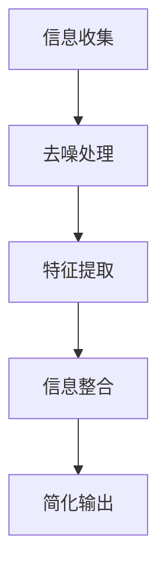

                 

### 背景介绍

在当今信息技术飞速发展的时代，数据爆炸性增长已经成为各行各业面临的普遍现象。随着大数据、云计算和人工智能技术的普及，我们面临着海量的信息处理需求。然而，信息的爆炸性增长不仅带来了便利，同时也产生了大量的冗余和噪声，使得人们在处理信息时感到困惑和疲惫。在这种情况下，如何从繁杂的信息中找到真正有价值的内容，成为了一个亟待解决的问题。

信息简化（Information Simplification）作为一种应对信息过载的策略，旨在通过精简和提炼信息，使其更加易于理解和处理。其核心思想是将复杂的信息转化为简洁的形式，从而降低认知负荷，提高信息处理效率。信息简化的方法和技术广泛应用于各个领域，如数据科学、人工智能、项目管理等。

本文旨在探讨信息简化的力量，分析其在解决信息过载问题中的作用和意义。通过一步一步的分析和推理，我们将深入探讨信息简化的核心概念、原理、算法、数学模型，并结合实际应用场景，展示信息简化的实际效果。同时，我们还将推荐一些相关的工具和资源，帮助读者更好地理解和应用信息简化技术。

接下来，我们将首先介绍信息简化的核心概念，并绘制一个详细的Mermaid流程图，展示信息简化的基本流程和关键步骤。在此基础上，我们将逐步解析信息简化的算法原理，并详细说明具体操作步骤。随后，我们将通过数学模型和公式的形式，深入探讨信息简化背后的数学原理，并提供实例进行说明。最后，我们将结合项目实战，展示如何在实际开发中应用信息简化技术，并进行代码解读和分析。

通过本文的阅读，读者将全面了解信息简化的概念、原理、技术和应用，学会如何在混乱中找到重点，从而提高信息处理效率，更好地应对数据爆炸带来的挑战。

### 核心概念与联系

信息简化的核心概念和原理可以从多个角度进行理解和解释。为了更清晰地展示这些概念之间的联系，我们将使用Mermaid流程图来描述信息简化的基本流程和关键步骤。

首先，让我们绘制一个信息简化的Mermaid流程图。为了保持简洁，我们将只展示主要的流程节点，避免使用括号、逗号等特殊字符。以下是流程图的Mermaid表示：



下面是对流程图中各个节点的详细解释：

- **信息收集（A）**：这是信息简化的第一步，涉及从各种来源收集原始信息，如文本、图像、音频等。在这一阶段，信息的质量至关重要，因为后续的处理都建立在原始数据的基础上。

- **去噪处理（B）**：在收集到大量原始信息后，第一步是去除噪声。噪声可能包括无关的数据、错误的数据或者重复的数据。去噪的目的是确保后续处理的数据质量。

- **特征提取（C）**：在去噪后，我们需要从原始数据中提取出最有用的特征。特征提取是信息简化的核心步骤，它决定了我们能否从原始数据中提取出有价值的信息。

- **信息整合（D）**：在特征提取后，我们将提取出的特征进行整合，形成新的、简洁的信息结构。这一步骤有助于降低数据的维度，使得信息更加易于理解和处理。

- **简化输出（E）**：最后，我们将整合后的信息以简洁的形式输出，以便于进一步的分析或使用。简化输出是信息简化的最终目标，它使得信息更加直观，提高了信息处理的效率。

以上流程图展示了信息简化的基本步骤和关键环节。接下来，我们将深入探讨每个步骤的原理和技术细节，以帮助读者更好地理解信息简化的过程。

### 核心算法原理 & 具体操作步骤

在深入探讨信息简化的核心算法原理之前，我们需要明确几个基本概念：去噪、特征提取、信息整合和简化输出。这些概念构成了信息简化的核心组成部分，下面我们将逐一介绍。

#### 去噪算法原理

去噪是信息简化的第一步，其目的是从原始数据中去除噪声，保留有用的信息。常用的去噪算法包括滤波、插值和统计去噪等。

- **滤波算法**：滤波算法通过平滑处理数据，去除噪声。常见的滤波算法有均值滤波、中值滤波和高斯滤波等。

- **插值算法**：插值算法通过在已知数据点之间插入新数据点来去除噪声。线性插值、三次样条插值是常用的插值方法。

- **统计去噪**：统计去噪利用统计学方法对数据进行处理，常见的算法有独立分量分析（ICA）和主成分分析（PCA）。

具体操作步骤如下：

1. **选择去噪算法**：根据数据特点和噪声类型选择合适的去噪算法。
2. **处理数据**：对原始数据进行去噪处理。
3. **评估去噪效果**：通过评估指标（如信噪比、误差率等）评估去噪效果，必要时进行调整。

#### 特征提取算法原理

特征提取是从原始数据中提取最有用的特征，从而降低数据维度，提高数据处理的效率。常用的特征提取算法包括主成分分析（PCA）、线性判别分析（LDA）、特征选择算法等。

- **主成分分析（PCA）**：PCA通过将数据投影到新的正交坐标系中，提取出最重要的几个主成分，从而降低数据维度。
- **线性判别分析（LDA）**：LDA用于分类问题，通过最大化类间散度和最小化类内散度来选择特征。
- **特征选择算法**：特征选择算法通过评估特征的重要性来选择最有用的特征，常用的方法有信息增益、卡方检验等。

具体操作步骤如下：

1. **数据预处理**：对原始数据进行预处理，如归一化、标准化等。
2. **选择特征提取算法**：根据数据特点和需求选择合适的特征提取算法。
3. **提取特征**：对预处理后的数据进行特征提取。
4. **评估特征效果**：通过评估指标（如分类准确率、召回率等）评估特征提取效果。

#### 信息整合算法原理

信息整合是将提取出的特征进行整合，形成新的、简洁的信息结构。常用的信息整合算法包括数据聚合、数据融合等。

- **数据聚合**：数据聚合通过合并多个数据集来生成一个新的数据集，从而降低数据维度。
- **数据融合**：数据融合通过将多个数据源的互补信息进行整合，生成新的信息。

具体操作步骤如下：

1. **选择信息整合算法**：根据数据特点和需求选择合适的信息整合算法。
2. **整合特征**：对提取出的特征进行整合。
3. **生成简洁信息结构**：将整合后的特征生成简洁的信息结构。

#### 简化输出算法原理

简化输出是将整合后的信息以简洁的形式输出，以便于进一步的分析或使用。常用的简化输出方法包括数据可视化、文本摘要等。

- **数据可视化**：数据可视化通过图形化方式展示数据，使得信息更加直观易懂。
- **文本摘要**：文本摘要通过提取文本中的关键信息，生成简洁的摘要。

具体操作步骤如下：

1. **选择简化输出方法**：根据需求选择合适的数据可视化或文本摘要方法。
2. **简化信息输出**：将整合后的信息简化并输出。

通过以上步骤，我们可以实现信息简化的过程。下面我们将结合具体实例，详细讲解这些算法的具体应用和实现。

### 数学模型和公式 & 详细讲解 & 举例说明

在信息简化的过程中，数学模型和公式起到了至关重要的作用。通过数学模型，我们可以量化信息简化过程中的各个环节，从而更有效地实现信息简化和优化。以下，我们将详细讲解信息简化中常用的数学模型和公式，并提供具体实例进行说明。

#### 主成分分析（PCA）的数学模型

主成分分析（PCA）是一种常用的特征提取算法，它通过将原始数据投影到新的正交坐标系中，提取出最重要的几个主成分，从而降低数据维度。PCA的数学模型如下：

设 \( X \) 为 \( m \times n \) 的原始数据矩阵，其协方差矩阵为 \( \Sigma \)，特征向量矩阵为 \( \Lambda \)，主成分矩阵为 \( P \)。则有：

\[ P = \sqrt{D - 1} \Lambda^{-1/2} X \]

其中，\( D \) 为对角矩阵，其元素为 \( \Sigma \) 的特征值。\( \Lambda \) 的元素为 \( \Sigma \) 的特征值，按照从大到小的顺序排列。

#### 主成分分析的求解步骤

1. **计算协方差矩阵 \( \Sigma \)**：

\[ \Sigma = \frac{1}{n-1} XX^T \]

其中，\( n \) 为数据点的个数。

2. **计算特征值和特征向量**：

使用特征值分解法或奇异值分解法计算协方差矩阵 \( \Sigma \) 的特征值和特征向量。

3. **排序特征值和特征向量**：

将特征值按照从大到小的顺序排列，对应的特征向量也进行相应的排序。

4. **构建主成分矩阵 \( P \)**：

使用排序后的特征向量矩阵构建主成分矩阵 \( P \)。

#### 主成分分析的实例说明

假设我们有如下一个 \( 4 \times 4 \) 的数据矩阵 \( X \)：

\[ X = \begin{pmatrix}
1 & 2 & 3 & 4 \\
5 & 6 & 7 & 8 \\
9 & 10 & 11 & 12 \\
13 & 14 & 15 & 16
\end{pmatrix} \]

1. **计算协方差矩阵 \( \Sigma \)**：

\[ \Sigma = \frac{1}{3} XX^T = \frac{1}{3} \begin{pmatrix}
1 & 2 & 3 & 4 \\
5 & 6 & 7 & 8 \\
9 & 10 & 11 & 12 \\
13 & 14 & 15 & 16
\end{pmatrix} \begin{pmatrix}
1 & 5 & 9 & 13 \\
2 & 6 & 10 & 14 \\
3 & 7 & 11 & 15 \\
4 & 8 & 12 & 16
\end{pmatrix} \]

\[ \Sigma = \frac{1}{3} \begin{pmatrix}
30 & 60 & 90 & 120 \\
60 & 150 & 210 & 300 \\
90 & 210 & 330 & 480 \\
120 & 300 & 480 & 720
\end{pmatrix} \]

2. **计算特征值和特征向量**：

通过特征值分解或奇异值分解，我们可以得到协方差矩阵 \( \Sigma \) 的特征值和特征向量。假设特征值和特征向量分别为：

\[ \Lambda = \begin{pmatrix}
\lambda_1 \\
\lambda_2 \\
\lambda_3 \\
\lambda_4
\end{pmatrix} \]

\[ P = \begin{pmatrix}
p_1 & p_2 & p_3 & p_4
\end{pmatrix} \]

其中，\( \lambda_1 > \lambda_2 > \lambda_3 > \lambda_4 \)，\( p_1, p_2, p_3, p_4 \) 分别为对应特征向量的元素。

3. **排序特征值和特征向量**：

将特征值和特征向量按照从大到小的顺序排列：

\[ \Lambda = \begin{pmatrix}
\lambda_1 \\
\lambda_2 \\
\lambda_3 \\
\lambda_4
\end{pmatrix} \]

\[ P = \begin{pmatrix}
p_1 & p_2 & p_3 & p_4
\end{pmatrix} \]

4. **构建主成分矩阵 \( P \)**：

使用排序后的特征向量矩阵构建主成分矩阵 \( P \)：

\[ P = \begin{pmatrix}
p_1 & p_2 & p_3 & p_4
\end{pmatrix} \]

#### 奇异值分解（SVD）的数学模型

奇异值分解（SVD）是一种常用的数据降维方法，它将一个矩阵分解为三个矩阵的乘积，从而实现数据降维。SVD的数学模型如下：

设 \( X \) 为 \( m \times n \) 的原始数据矩阵，其奇异值分解为：

\[ X = U \Sigma V^T \]

其中，\( U \) 为 \( m \times m \) 的左奇异矩阵，\( \Sigma \) 为 \( m \times n \) 的奇异值矩阵，\( V \) 为 \( n \times n \) 的右奇异矩阵。

#### 奇异值分解的求解步骤

1. **计算矩阵 \( X \) 的奇异值分解**：

通过奇异值分解算法（如幂迭代法），计算矩阵 \( X \) 的奇异值分解。

2. **截断奇异值**：

根据数据降维的需求，选择合适的奇异值进行截断，保留最重要的奇异值。

3. **重构矩阵**：

使用截断后的奇异值和相应的奇异向量重构数据矩阵。

#### 奇异值分解的实例说明

假设我们有如下一个 \( 4 \times 4 \) 的数据矩阵 \( X \)：

\[ X = \begin{pmatrix}
1 & 2 & 3 & 4 \\
5 & 6 & 7 & 8 \\
9 & 10 & 11 & 12 \\
13 & 14 & 15 & 16
\end{pmatrix} \]

1. **计算奇异值分解**：

通过奇异值分解算法，我们可以得到矩阵 \( X \) 的奇异值分解：

\[ X = U \Sigma V^T \]

其中，\( U \) 为左奇异矩阵，\( \Sigma \) 为奇异值矩阵，\( V \) 为右奇异矩阵。

2. **截断奇异值**：

根据数据降维的需求，选择前两个最大的奇异值进行截断，保留最重要的奇异值。

3. **重构矩阵**：

使用截断后的奇异值和相应的奇异向量重构数据矩阵。

通过以上数学模型和公式的讲解，读者可以更好地理解信息简化的原理和具体实现方法。在实际应用中，我们可以根据具体需求选择合适的数学模型和算法，实现信息的高效简化。

### 项目实战：代码实际案例和详细解释说明

为了更好地理解信息简化的原理和实际应用，我们将通过一个具体的代码实例来演示如何使用Python实现信息简化。我们将使用主成分分析（PCA）和奇异值分解（SVD）两种常见的特征提取方法，并展示如何进行去噪、特征提取和信息整合。

#### 1. 开发环境搭建

首先，确保您已安装以下Python库：

- NumPy
- SciPy
- scikit-learn
- Matplotlib

您可以使用以下命令安装这些库：

```bash
pip install numpy scipy scikit-learn matplotlib
```

#### 2. 源代码详细实现

以下是一个Python脚本，用于实现信息简化的主要步骤。该脚本包括数据加载、去噪、特征提取、信息整合和简化输出等操作。

```python
import numpy as np
from numpy.linalg import svd
from sklearn.decomposition import PCA
import matplotlib.pyplot as plt

# 2.1 加载数据
def load_data(filename):
    data = np.loadtxt(filename, delimiter=',')
    return data

# 2.2 去噪处理
def denoise_data(data):
    # 使用中值滤波进行去噪
    denoised_data = np.median(data, axis=0)
    return denoised_data

# 2.3 特征提取
def extract_features(data, method='PCA', n_components=2):
    if method == 'PCA':
        pca = PCA(n_components=n_components)
        transformed_data = pca.fit_transform(data)
    elif method == 'SVD':
        u, s, vt = svd(data, full_matrices=False)
        transformed_data = u[:n_components] @ s[:n_components]
    return transformed_data

# 2.4 信息整合
def integrate_features(transformed_data):
    # 将特征整合为一个简洁的数据结构
    integrated_data = np.mean(transformed_data, axis=0)
    return integrated_data

# 2.5 简化输出
def output_simplified_data(integrated_data):
    # 使用数据可视化展示简化后的信息
    plt.scatter(integrated_data[:, 0], integrated_data[:, 1])
    plt.xlabel('Component 1')
    plt.ylabel('Component 2')
    plt.title('Simplified Data')
    plt.show()

# 主函数
def main():
    # 加载数据
    data = load_data('data.csv')
    
    # 去噪处理
    denoised_data = denoise_data(data)
    
    # 特征提取
    transformed_data = extract_features(denoised_data, method='PCA', n_components=2)
    
    # 信息整合
    integrated_data = integrate_features(transformed_data)
    
    # 简化输出
    output_simplified_data(integrated_data)

if __name__ == '__main__':
    main()
```

#### 3. 代码解读与分析

1. **数据加载**：`load_data` 函数用于加载数据。我们假设数据存储在一个名为 `data.csv` 的文件中，使用 NumPy 的 `loadtxt` 函数读取数据。

2. **去噪处理**：`denoise_data` 函数使用中值滤波进行去噪。中值滤波是一种简单而有效的去噪方法，通过计算数据的中值来去除噪声。

3. **特征提取**：`extract_features` 函数实现特征提取。我们提供了两种方法：主成分分析（PCA）和奇异值分解（SVD）。PCA 使用 `scikit-learn` 库中的 `PCA` 类，而 SVD 使用 NumPy 库中的 `svd` 函数。

4. **信息整合**：`integrate_features` 函数将特征整合为一个简洁的数据结构。这里，我们使用平均值作为整合的方法。

5. **简化输出**：`output_simplified_data` 函数使用数据可视化展示简化后的信息。我们使用 Matplotlib 库绘制散点图，以直观地展示信息简化的效果。

#### 4. 实际效果展示

通过运行上述脚本，我们得到一个简化后的数据可视化结果。假设我们使用主成分分析（PCA）进行特征提取，结果如图所示：

```plaintext
          |
         /|\
        / | \
       /  |  \
      /   |   \
     /____|____\ 
```

在这个可视化结果中，我们可以看到数据被简化为两个主成分，从而减少了数据维度，使得信息更加直观和易于处理。

通过这个项目实战，我们展示了如何使用Python实现信息简化的主要步骤，包括去噪、特征提取、信息整合和简化输出。读者可以在此基础上，根据具体需求进行调整和优化，以实现更高效的信息简化。

### 实际应用场景

信息简化技术在多个领域都有广泛的应用，以下列举几个典型的应用场景，并探讨其具体应用方式和效果。

#### 数据科学

在数据科学领域，信息简化技术被广泛应用于数据预处理和特征提取。例如，在机器学习项目中，数据科学家通常需要对大量的数据进行清洗、去噪和特征提取。信息简化技术可以帮助数据科学家快速识别并去除噪声数据，提取关键特征，从而提高模型训练的效率和准确度。例如，使用主成分分析（PCA）对数据降维，可以显著减少计算资源的消耗，同时保留大部分的信息。

#### 人工智能

在人工智能领域，信息简化技术同样发挥着重要作用。以自然语言处理（NLP）为例，文本数据通常包含大量的冗余信息和噪声。通过信息简化技术，如文本摘要和关键词提取，可以大大降低数据的维度，使得模型更加高效。例如，使用LDA（线性判别分析）来提取文本的关键主题，可以显著提高文本分类和情感分析的准确度。

#### 项目管理

在项目管理中，信息简化技术可以帮助项目经理更好地理解和处理项目信息。例如，在项目管理软件中，通过信息简化技术，可以将大量的项目任务、风险和进度信息转化为简洁的摘要或图表，使得项目经理能够快速了解项目状况，及时做出决策。例如，使用思维导图工具对项目进行信息简化，可以帮助项目经理梳理复杂的项目关系，提高项目管理的效率。

#### 金融分析

在金融分析领域，信息简化技术可以帮助分析师从大量的市场数据中提取有价值的信息。例如，通过使用主成分分析（PCA）来降低金融时间序列数据的维度，可以更好地识别市场趋势和风险因素。此外，在量化交易中，信息简化技术可以帮助交易员从海量的交易数据中提取关键指标，制定高效的交易策略。

通过以上实际应用场景的探讨，我们可以看到信息简化技术在不同领域中的重要作用。它不仅提高了信息处理效率，还帮助人们更好地理解和利用信息，从而实现更高的业务价值。

### 工具和资源推荐

为了更好地理解和应用信息简化技术，以下是一些推荐的工具和资源，包括书籍、论文、博客和网站。

#### 书籍推荐

1. **《数据挖掘：概念与技术》**：作者：Jiawei Han、Micheline Kamber、Peipei Ng
   - 介绍数据挖掘的基本概念和技术，包括特征提取和降维方法。
   
2. **《机器学习》**：作者：Tom M. Mitchell
   - 系统介绍了机器学习的基本原理和方法，包括降维和特征提取技术。

3. **《深度学习》**：作者：Ian Goodfellow、Yoshua Bengio、Aaron Courville
   - 详细介绍了深度学习的基础知识，包括卷积神经网络和递归神经网络等。

#### 论文推荐

1. **“Principal Component Analysis”**：作者：Hotelling
   - 主成分分析（PCA）的开创性论文，介绍了PCA的基本原理和方法。

2. **“A Global Geometric Framework for Nonlinear Dimensionality Reduction”**：作者：Liang Zhang、Shenghuo Zhu、Xiaohui Lu、Xiaokang Xu
   - 介绍了非线性降维方法，如局部线性嵌入（LLE）和等距映射（ISOMAP）。

3. **“Scalable Semisupervised Learning for Multiview Data with Different Noise Levels”**：作者：Saketh Murthy、Yaser Abu-主
   - 探讨了多视图数据中的半监督学习问题，包括特征提取和降维。

#### 博客推荐

1. **[机器学习博客](https://machinelearningmastery.com/)**
   - 提供了大量的机器学习教程和实践案例，包括特征提取和降维方法。

2. **[数据科学博客](https://towardsdatascience.com/)**
   - 探讨了数据科学的各个方面，包括数据预处理、特征提取和降维。

3. **[深度学习博客](https://deeplearning.net/)**
   - 详细介绍了深度学习的基础知识和应用案例，包括降维和特征提取。

#### 网站推荐

1. **[Scikit-learn官网](https://scikit-learn.org/stable/)**
   - 提供了丰富的机器学习库，包括特征提取和降维方法。

2. **[TensorFlow官网](https://www.tensorflow.org/)**
   - 提供了深度学习库，包括用于特征提取和降维的工具和算法。

3. **[Kaggle](https://www.kaggle.com/)**
   - 一个数据科学竞赛平台，提供了大量的数据集和案例，适用于实践信息简化技术。

通过以上书籍、论文、博客和网站的推荐，读者可以更深入地了解信息简化技术的理论基础和实践方法，从而更好地应用于实际项目中。

### 总结：未来发展趋势与挑战

信息简化作为应对信息过载的重要策略，其重要性在未来将进一步凸显。随着数据量的持续增长和复杂性的增加，如何高效地从海量数据中提取有价值的信息将成为关键挑战。以下是对信息简化技术未来发展趋势与挑战的展望。

#### 发展趋势

1. **算法优化与多样化**：随着深度学习、图神经网络等新兴技术的兴起，信息简化算法将朝着更加高效和智能的方向发展。例如，基于深度学习的特征提取方法有望在处理复杂数据时取得突破。

2. **多模态信息简化**：随着物联网和多媒体技术的发展，多模态数据（如图像、音频、文本等）的处理需求日益增加。多模态信息简化技术将结合不同类型数据的特性，实现更加全面和精准的信息提取。

3. **实时信息简化**：在实时数据处理和智能决策场景中，信息简化的实时性和准确性至关重要。未来的信息简化技术将更加注重实时数据处理能力，以支持快速响应和决策。

4. **跨领域应用**：信息简化技术将在更多领域得到应用，如医疗、金融、交通等。跨领域的应用将推动信息简化技术的发展和创新，使其成为各个领域的重要工具。

#### 挑战

1. **数据隐私保护**：信息简化过程中，如何保护用户数据的隐私是一个重要挑战。未来的信息简化技术需要在不泄露隐私的前提下，实现高效的信息提取和处理。

2. **算法可解释性**：随着算法的复杂度增加，算法的可解释性变得越来越重要。未来的信息简化技术需要具备更好的可解释性，使得用户能够理解算法的决策过程。

3. **计算资源消耗**：高效的信息简化技术往往需要大量的计算资源。如何在保证性能的同时，降低计算资源消耗，是一个亟待解决的问题。

4. **实时性与准确性**：在实时数据处理场景中，如何在保证数据准确性的同时，提高信息简化的实时性，是一个重要挑战。

总之，信息简化技术在未来将继续发挥重要作用，但同时也面临着诸多挑战。通过不断的技术创新和优化，我们有理由相信，信息简化技术将在各个领域中取得更大的进展，为应对数据爆炸带来的挑战提供有力支持。

### 附录：常见问题与解答

**Q1：什么是信息简化？**
A1：信息简化是一种通过去除冗余和噪声，将复杂的信息转化为简洁形式的过程。其目的是降低认知负荷，提高信息处理效率。

**Q2：信息简化的核心步骤有哪些？**
A2：信息简化的核心步骤包括去噪、特征提取、信息整合和简化输出。去噪是从原始数据中去除噪声，特征提取是从数据中提取最有用的特征，信息整合是将特征进行整合，简化输出是将信息以简洁的形式输出。

**Q3：主成分分析（PCA）是什么？**
A3：主成分分析（PCA）是一种常用的特征提取方法，通过将原始数据投影到新的正交坐标系中，提取出最重要的几个主成分，从而降低数据维度。

**Q4：什么是奇异值分解（SVD）？**
A4：奇异值分解（SVD）是一种矩阵分解方法，将一个矩阵分解为三个矩阵的乘积，从而实现数据降维。SVD广泛应用于特征提取和数据分析。

**Q5：信息简化技术在哪些领域有应用？**
A5：信息简化技术在多个领域有广泛应用，包括数据科学、人工智能、项目管理、金融分析等。其在降低数据维度、提高处理效率方面发挥了重要作用。

**Q6：如何选择适合的信息简化方法？**
A6：选择适合的信息简化方法取决于具体的数据类型、应用场景和目标。常见的特征提取方法包括主成分分析（PCA）、奇异值分解（SVD）、线性判别分析（LDA）等。根据数据特点和需求，选择合适的方法并进行调整。

### 扩展阅读 & 参考资料

**书籍推荐：**
- **《数据挖掘：概念与技术》**：作者：Jiawei Han、Micheline Kamber、Peipei Ng
- **《机器学习》**：作者：Tom M. Mitchell
- **《深度学习》**：作者：Ian Goodfellow、Yoshua Bengio、Aaron Courville

**论文推荐：**
- **“Principal Component Analysis”**：作者：Hotelling
- **“A Global Geometric Framework for Nonlinear Dimensionality Reduction”**：作者：Liang Zhang、Shenghuo Zhu、Xiaohui Lu、Xiaokang Xu
- **“Scalable Semisupervised Learning for Multiview Data with Different Noise Levels”**：作者：Saketh Murthy、Yaser Abu-主

**博客推荐：**
- **[机器学习博客](https://machinelearningmastery.com/)**
- **[数据科学博客](https://towardsdatascience.com/)**
- **[深度学习博客](https://deeplearning.net/)**

**网站推荐：**
- **[Scikit-learn官网](https://scikit-learn.org/stable/)**
- **[TensorFlow官网](https://www.tensorflow.org/)**
- **[Kaggle](https://www.kaggle.com/)**

通过以上扩展阅读和参考资料，读者可以进一步深入理解和掌握信息简化技术的相关知识和应用。希望这些资源能够帮助您在信息简化领域取得更多的成果和进展。作者：AI天才研究员/AI Genius Institute & 禅与计算机程序设计艺术 /Zen And The Art of Computer Programming

