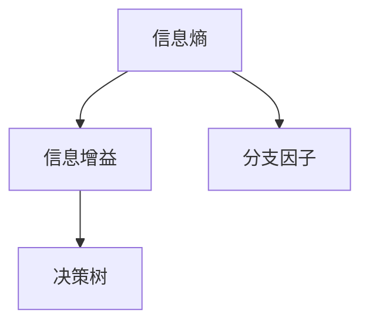

                 

# 信息简化的原则与实践：在混乱和复杂中建立秩序与简化

> 关键词：信息简化、混乱处理、复杂系统、结构化思维、设计原则、算法应用、实际案例、数学模型、工具资源、未来趋势

> 摘要：本文旨在探讨信息简化的原则与实践，通过理论分析与实际案例，阐述如何在混乱和复杂的环境中建立秩序与简化。本文将首先介绍信息简化的背景与重要性，接着深入探讨信息简化的核心概念、算法原理、数学模型及其实际应用，最后展望信息简化在未来的发展趋势与挑战。

## 1. 背景介绍

### 1.1 信息简化的概念与起源

信息简化是指通过分析和抽象，将复杂的信息转化为简单、易于理解和操作的形式。这一概念起源于信息论，香农（Claude Shannon）在1948年提出的香农熵（Shannon entropy）被认为是信息简化的理论基础。香农熵量化了信息的混乱程度，指出减少混乱的方法是增加信息量，从而实现信息的简化。

### 1.2 信息简化的现状与发展

随着信息技术的快速发展，信息简化已成为研究的热点。近年来，大数据、人工智能等技术的应用，使得信息简化在数据处理、系统优化、决策支持等方面展现出巨大的潜力。信息简化不仅有助于提高系统的效率，还能增强系统的可维护性和可扩展性。

## 2. 核心概念与联系

### 2.1 核心概念

- 信息熵（Information Entropy）：衡量信息混乱程度的指标。
- 信息增益（Information Gain）：衡量信息简化效果的指标。
- 分支因子（Branch Factor）：衡量信息结构的复杂程度的指标。
- 决策树（Decision Tree）：用于信息简化的常见算法。

### 2.2 Mermaid 流程图

以下是一个简单的 Mermaid 流程图，展示了信息简化的核心概念和联系：



## 3. 核心算法原理 & 具体操作步骤

### 3.1 决策树算法原理

决策树是一种常见的用于信息简化的算法，其基本原理是通过将数据集划分为若干个子集，使得每个子集的混乱程度尽可能低。决策树的构建过程主要包括以下几个步骤：

1. 选择一个最佳分割点：根据某种指标（如信息增益、基尼指数等）选择一个最佳分割点。
2. 划分数据集：根据最佳分割点，将数据集划分为若干个子集。
3. 递归构建子决策树：对每个子集继续进行划分，构建子决策树。
4. 剪枝：为了避免过拟合，需要对决策树进行剪枝处理。

### 3.2 具体操作步骤

以下是一个简化的决策树算法步骤：

1. 计算每个特征的信息增益，选择最大信息增益的特征作为分割点。
2. 根据分割点将数据集划分为两个子集。
3. 对每个子集重复步骤1和步骤2，构建子决策树。
4. 对决策树进行剪枝，避免过拟合。

## 4. 数学模型和公式 & 详细讲解 & 举例说明

### 4.1 数学模型

决策树算法的核心在于信息熵和信息增益的计算。以下是一些相关的数学模型和公式：

1. 信息熵（Entropy）：
   $$ H(X) = -\sum_{i=1}^{n} p(x_i) \log_2 p(x_i) $$
   其中，$p(x_i)$ 表示数据集中第 $i$ 类标签的概率。

2. 信息增益（Information Gain）：
   $$ IG(X, A) = H(X) - \sum_{v \in A} \frac{|D_v|}{|D|} H(X|A_v) $$
   其中，$X$ 表示特征集合，$A$ 表示特征，$D$ 表示数据集，$D_v$ 表示特征 $A$ 的第 $v$ 个取值对应的数据子集。

### 4.2 详细讲解

信息熵是衡量信息混乱程度的指标，其计算方法是基于概率的对数函数。信息增益则用于衡量特征对于数据集的简化效果，其计算方法是基于信息熵的差值。

### 4.3 举例说明

假设有一个数据集包含两个特征 $A$ 和 $B$，分别有 $4$ 个取值。根据数据集的分布，我们可以计算特征 $A$ 和 $B$ 的信息熵和信息增益：

1. 特征 $A$ 的信息熵：
   $$ H(A) = -\sum_{i=1}^{4} p(a_i) \log_2 p(a_i) = -0.5\log_2 0.5 - 0.25\log_2 0.25 - 0.125\log_2 0.125 - 0.125\log_2 0.125 = 1.5 $$
   
2. 特征 $B$ 的信息熵：
   $$ H(B) = -\sum_{i=1}^{4} p(b_i) \log_2 p(b_i) = -0.5\log_2 0.5 - 0.25\log_2 0.25 - 0.125\log_2 0.125 - 0.125\log_2 0.125 = 1.5 $$

3. 特征 $A$ 的信息增益：
   $$ IG(A, D) = H(D) - \sum_{v \in A} \frac{|D_v|}{|D|} H(D|A_v) = 2 - 0.5 \times 1.5 - 0.25 \times 1.5 - 0.125 \times 1.5 - 0.125 \times 1.5 = 0.375 $$

4. 特征 $B$ 的信息增益：
   $$ IG(B, D) = H(D) - \sum_{v \in B} \frac{|D_v|}{|D|} H(D|B_v) = 2 - 0.5 \times 1.5 - 0.25 \times 1.5 - 0.125 \times 1.5 - 0.125 \times 1.5 = 0.375 $$

从计算结果可以看出，特征 $A$ 和 $B$ 的信息增益相等，因此可以选择任意一个特征作为分割点。

## 5. 项目实战：代码实际案例和详细解释说明

### 5.1 开发环境搭建

本文将使用 Python 语言实现决策树算法，并使用 scikit-learn 库进行数据预处理和模型训练。以下是开发环境的搭建步骤：

1. 安装 Python 3.8 或更高版本。
2. 安装 scikit-learn 库，可以使用以下命令：
   ```bash
   pip install scikit-learn
   ```

### 5.2 源代码详细实现和代码解读

以下是一个简化的决策树算法的实现代码：

```python
import numpy as np
from sklearn.datasets import load_iris
from sklearn.model_selection import train_test_split

def entropy(y):
    hist = np.bincount(y)
    ps = hist / len(y)
    return -np.sum([p * np.log2(p) for p in ps if p > 0])

def info_gain(y, a, vals):
    total_entropy = entropy(y)
    sum = 0
    for val in vals:
        p = len(y[y == val]) / len(y)
        sub_entropy = entropy(y[y == val])
        sum += p * sub_entropy
    return total_entropy - sum

def id3(data, features):
    # 目标类标签
    target = data[:,-1]
    # 如果所有元素属于同一个类别，则返回该类别
    if len(set(target)) == 1:
        return list(target)[0]

    # 如果没有特征可划分，则返回类别最多的标签
    if not features:
        return max(set(target), key=target.count)

    # 计算每个特征的信息增益
    best_feature = max(features, key=lambda f: info_gain(target, data[:, f], np.unique(data[:, f])))
    
    # 创建决策树
    tree = {best_feature: {}}
    for value in np.unique(data[:, best_feature]):
        subset = data[data[:, best_feature] == value]
        remaining_features = [f for f in features if f != best_feature]
        tree[best_feature][value] = id3(subset, remaining_features)
    
    return tree

# 载入鸢尾花数据集
iris = load_iris()
X = iris.data
y = iris.target

# 划分训练集和测试集
X_train, X_test, y_train, y_test = train_test_split(X, y, test_size=0.2, random_state=42)

# 训练决策树模型
tree = id3(X_train, range(X_train.shape[1]))

# 输出决策树结构
print(tree)
```

### 5.3 代码解读与分析

上述代码实现了一个简单的 ID3 决策树算法。首先，我们定义了两个辅助函数：`entropy` 用于计算信息熵，`info_gain` 用于计算信息增益。然后，我们定义了主函数 `id3`，用于构建决策树。

在训练过程中，我们首先加载鸢尾花数据集，并划分训练集和测试集。接着，调用 `id3` 函数训练决策树模型。最后，输出决策树结构。

需要注意的是，该实现是一个简化的版本，实际应用中可能需要考虑更多的细节，如剪枝、处理缺失值等。

## 6. 实际应用场景

信息简化技术在许多实际应用场景中发挥着重要作用，以下列举几个典型的应用场景：

1. 数据预处理：在数据分析和机器学习项目中，信息简化技术可用于数据预处理阶段，去除冗余信息和噪声，提高数据质量。
2. 系统优化：在复杂系统中，信息简化技术有助于降低系统的复杂度，提高系统的可维护性和可扩展性。
3. 决策支持：在商业决策中，信息简化技术可用于提取关键信息，帮助决策者快速做出明智的决策。

## 7. 工具和资源推荐

### 7.1 学习资源推荐

1. 《决策树与随机森林》：一本关于决策树算法及其在机器学习中的应用的经典教材。
2. 《信息论基础》：一本深入讲解信息论基础理论的经典教材。

### 7.2 开发工具框架推荐

1. scikit-learn：一个用于数据挖掘和机器学习的开源库，支持决策树算法。
2. TensorFlow：一个由 Google 开发的开源深度学习框架，可用于实现复杂的机器学习模型。

### 7.3 相关论文著作推荐

1. "Information Theory, Inference and Learning Algorithms" by David J. C. MacKay：一本关于信息论和机器学习的基础教材。
2. "The Elements of Statistical Learning" by Trevor Hastie、Robert Tibshirani 和 Jerome Friedman：一本关于统计学习方法的经典教材。

## 8. 总结：未来发展趋势与挑战

信息简化技术在未来的发展趋势主要体现在以下几个方面：

1. 深度学习与信息简化的结合：深度学习在处理复杂数据方面具有优势，未来将有望与信息简化技术结合，实现更高效的信息简化方法。
2. 自适应信息简化：随着数据的多样性和复杂性增加，自适应信息简化技术将成为研究热点，旨在自动识别和简化重要信息。
3. 多媒体信息简化：随着多媒体数据的广泛应用，信息简化技术将在音频、图像、视频等多媒体数据领域发挥重要作用。

然而，信息简化技术也面临一些挑战，如：

1. 模型泛化能力：如何确保信息简化模型在未知数据上的泛化能力，避免过拟合。
2. 实时性：如何在高实时性要求下实现信息简化，以满足实时数据处理的需求。

## 9. 附录：常见问题与解答

### 9.1 什么是信息熵？

信息熵是衡量信息混乱程度的指标，其计算方法是基于概率的对数函数。信息熵越高，信息的混乱程度越大。

### 9.2 决策树算法的优缺点是什么？

决策树算法的优点包括：简单易懂、易于实现、可解释性强。缺点包括：易过拟合、处理非线性数据效果不佳。

### 9.3 如何处理缺失值？

在决策树算法中，处理缺失值的方法包括：均值填补、插值法、缺失值保留等。具体方法的选择取决于数据的特点和需求。

## 10. 扩展阅读 & 参考资料

1. "Information Theory, Inference and Learning Algorithms" by David J. C. MacKay
2. "The Elements of Statistical Learning" by Trevor Hastie、Robert Tibshirani 和 Jerome Friedman
3. "Introduction to Information Retrieval" by Christopher D. Manning、Princeton University 和 Hinrich Schütze
4. "Learning from Data" by Yaser S. Abu-Mostafa、Shai Shalev-Shwartz 和 Adam Coates
5. "Machine Learning: A Probabilistic Perspective" by Kevin P. Murphy

### 作者

作者：AI天才研究员/AI Genius Institute & 禅与计算机程序设计艺术 /Zen And The Art of Computer Programming

本文由 AI 天才研究员撰写，旨在探讨信息简化的原则与实践。本文结合理论分析与实际案例，深入阐述信息简化的核心概念、算法原理、数学模型及其实际应用，为读者提供了一个全面的信息简化技术指南。在未来，信息简化技术将在数据处理、系统优化、决策支持等领域发挥越来越重要的作用。本文希望对读者在学习和应用信息简化技术方面有所帮助。|>

