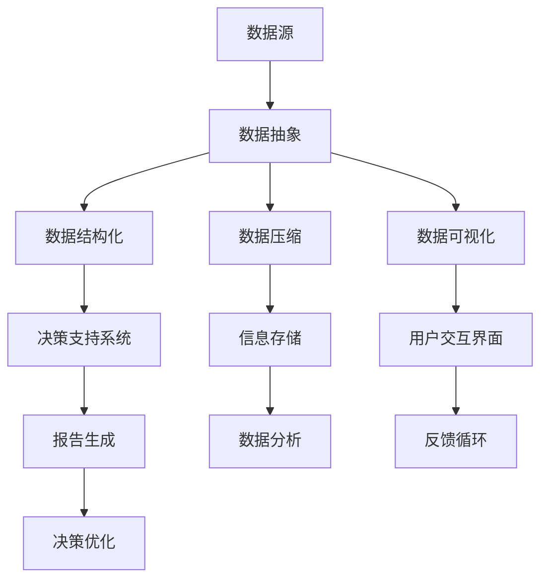

                 

### 背景介绍

在当今信息爆炸的时代，数据的增长速度前所未有。面对海量信息，如何高效地处理、存储、传输以及分析这些数据，成为了众多企业和研究机构亟待解决的重要问题。为了应对这一挑战，信息简化的原则与艺术应运而生，成为建立秩序与简化复杂信息的关键手段。

**信息简化的定义**：信息简化是指通过消除冗余、提炼关键信息、将复杂的信息结构化等方式，使得信息更易于理解、处理和分析的过程。它不仅涉及技术的层面，也包含了设计、管理和战略的元素。

**信息简化的重要性**：

1. **提升效率**：简化信息可以降低处理信息的成本，提高工作效率。
2. **增强可操作性**：通过简化信息，可以使复杂的问题变得更容易操作和管理。
3. **优化决策**：清晰、简化的信息有助于做出更为准确和快速的决策。
4. **提高用户体验**：在软件和系统中，信息简化可以提升用户的操作体验，减少用户的学习成本。

本文将从以下几个方面进行探讨：

1. **核心概念与联系**：介绍信息简化的核心概念，并绘制流程图展示各概念之间的关系。
2. **核心算法原理与具体操作步骤**：深入探讨信息简化的关键算法及其操作步骤。
3. **数学模型和公式**：介绍与信息简化相关的数学模型和公式，并进行详细讲解和举例说明。
4. **项目实战**：通过代码案例，展示信息简化的实际应用。
5. **实际应用场景**：探讨信息简化在各个领域的实际应用。
6. **工具和资源推荐**：推荐学习资源、开发工具和框架。
7. **总结：未来发展趋势与挑战**：对信息简化的未来发展趋势和面临的挑战进行展望。

通过这篇文章，我们希望能够帮助读者深入理解信息简化的原则与艺术，并在实际工作中灵活运用，从而在信息混乱中建立秩序，实现高效的决策与操作。

## 核心概念与联系

信息简化的核心概念涵盖了数据的抽象、结构化、压缩和可视化等多个方面。为了更好地理解这些概念之间的关系，我们可以通过Mermaid流程图（Mermaid Flowchart）来展示信息简化各环节的相互联系。

以下是使用Mermaid绘制的流程图：



### 数据抽象

**数据抽象**是信息简化的第一步，它的核心在于从原始数据中提取出有意义的、可以理解的信息。这一过程通常涉及到以下几个方面：

1. **特征提取**：从大量数据中提取出关键特征，如文本中的关键词、图像中的边缘等。
2. **数据清洗**：去除噪声数据，如错误数据、重复数据和缺失值等。
3. **维度降低**：通过降维技术，如主成分分析（PCA），减少数据的维度，简化数据处理流程。

### 数据结构化

**数据结构化**是将原始数据转化为有序、规则的数据结构，以便于进一步处理和分析。具体包括：

1. **关系建立**：通过建立数据之间的关联关系，形成数据网络，如数据库中的表与表之间的关系。
2. **数据建模**：使用统计学模型、机器学习算法等建立数据模型，以预测和分析数据。
3. **数据标准化**：对数据进行规范化处理，使得数据具有可比性，便于分析。

### 数据压缩

**数据压缩**通过减少数据冗余，降低存储和传输的成本。常见的压缩技术包括：

1. **无损压缩**：如Huffman编码、LZ77压缩等，不丢失任何数据信息。
2. **有损压缩**：如JPEG、MP3等，可以丢失一些信息，但能够在保证可接受质量的前提下显著降低数据大小。

### 数据可视化

**数据可视化**是将数据以图形、图像等形式展示出来，使得信息更加直观、易于理解。主要方法包括：

1. **图表制作**：如条形图、折线图、饼图等，直观展示数据的分布和趋势。
2. **热力图**：通过颜色深浅反映数据的大小或密度。
3. **交互式可视化**：提供用户交互功能，如过滤、放大、缩小等，使用户能够动态地探索数据。

### 决策支持系统

**决策支持系统（DSS）**是一种基于信息简化的系统，它利用结构化和简化的信息帮助决策者做出更好的决策。DSS通常包括以下几个部分：

1. **数据收集与预处理**：收集相关的数据，并进行结构化和简化处理。
2. **模型构建**：建立决策模型，如线性规划、神经网络等。
3. **结果展示**：将模型的结果以图表、报告等形式展示给决策者。

### 信息存储与分析

**信息存储与分析**是信息简化的最终目标之一，包括：

1. **存储**：将简化的信息存储在数据库或数据仓库中，便于长期存储和查询。
2. **分析**：使用统计分析、机器学习等算法对存储的信息进行分析，提取有价值的信息。

### 用户交互界面

**用户交互界面**是信息简化过程中的重要环节，它直接影响用户的操作体验。主要包括：

1. **界面设计**：设计直观、简洁的界面，使用户能够轻松操作。
2. **交互反馈**：及时给予用户操作反馈，提高用户的体验。

### 反馈循环

**反馈循环**是一个持续迭代的过程，通过用户的反馈不断优化系统，提高信息简化的效果。包括：

1. **用户反馈**：收集用户的反馈，识别系统存在的问题。
2. **系统优化**：根据反馈进行系统优化，提高系统的稳定性和可靠性。

通过上述流程图和概念介绍，我们可以看出信息简化的各个环节是相互联系、相互影响的。信息简化不仅仅是单一的技术手段，而是一个系统化的过程，需要从多方面进行综合考虑和优化。

## 核心算法原理与具体操作步骤

在信息简化的过程中，核心算法起到了至关重要的作用。这些算法不仅能够高效地处理大量数据，还能够确保数据在简化过程中不失真。以下将详细介绍几种常见的核心算法原理及其操作步骤。

### 1. 主成分分析（PCA）

**主成分分析（Principal Component Analysis，PCA）**是一种常用的降维技术，它通过将原始数据投影到新的正交坐标系中，从而提取出最重要的特征。

**算法原理**：

PCA的原理基于线性代数中的特征值和特征向量。具体步骤如下：

1. **数据标准化**：对数据进行标准化处理，使得每个特征具有相同的方差。
2. **计算协方差矩阵**：计算数据集的协方差矩阵，该矩阵反映了数据各特征之间的相关性。
3. **计算特征值和特征向量**：对协方差矩阵进行特征值分解，得到特征值和特征向量。
4. **选择主成分**：选择前k个最大的特征值对应的特征向量，作为新的正交坐标系。
5. **投影数据**：将原始数据投影到新的坐标系中，实现降维。

**操作步骤**：

1. **数据准备**：首先需要准备一个包含多维度特征的数据集。
2. **数据标准化**：使用如下公式对数据进行标准化：
   \[
   z = \frac{x - \mu}{\sigma}
   \]
   其中，\(x\) 是原始数据，\(\mu\) 是均值，\(\sigma\) 是标准差。
3. **计算协方差矩阵**：计算各特征之间的协方差矩阵 \(C\)：
   \[
   C = \frac{1}{n-1} \sum_{i=1}^{n} (x_i - \mu)(x_i - \mu)^T
   \]
   其中，\(x_i\) 是每个数据点的特征向量，\(n\) 是数据点的个数。
4. **特征值分解**：对协方差矩阵 \(C\) 进行特征值分解：
   \[
   C = Q\Lambda Q^T
   \]
   其中，\(Q\) 是特征向量矩阵，\(\Lambda\) 是特征值对角矩阵。
5. **选择主成分**：选择前 \(k\) 个最大的特征值对应的特征向量，构成新的特征向量矩阵 \(U\)。
6. **投影数据**：将原始数据 \(X\) 投影到新的特征向量矩阵 \(U\) 上，得到降维后的数据：
   \[
   X' = UX
   \]

### 2. 卡方测试（Chi-Square Test）

**卡方测试（Chi-Square Test）**是一种用于检验数据是否符合某种分布或检验变量之间独立性的统计方法。在信息简化中，卡方测试可以用于特征选择，去除与目标变量不相关的特征。

**算法原理**：

卡方测试的基本原理是基于概率论中的卡方分布。具体步骤如下：

1. **计算期望频数**：对于每个特征和类别组合，计算期望频数。
2. **计算卡方统计量**：对于每个特征和类别组合，计算卡方统计量：
   \[
   \chi^2 = \sum_{i=1}^{k} \frac{(O_i - E_i)^2}{E_i}
   \]
   其中，\(O_i\) 是观测频数，\(E_i\) 是期望频数。
3. **判断独立性**：将计算出的卡方统计量与临界值进行比较，判断特征和类别之间是否独立。

**操作步骤**：

1. **数据准备**：准备一个包含特征和类别标签的数据集。
2. **计算期望频数**：对于每个特征和类别组合，计算期望频数：
   \[
   E_{ij} = \frac{R_i \times C_j}{N}
   \]
   其中，\(R_i\) 是第 \(i\) 行的总频数，\(C_j\) 是第 \(j\) 列的总频数，\(N\) 是总频数。
3. **计算卡方统计量**：对于每个特征和类别组合，计算卡方统计量：
   \[
   \chi^2 = \sum_{i=1}^{k} \sum_{j=1}^{m} \frac{(O_{ij} - E_{ij})^2}{E_{ij}}
   \]
   其中，\(O_{ij}\) 是第 \(i\) 行第 \(j\) 列的观测频数。
4. **判断独立性**：将计算出的卡方统计量与对应的临界值进行比较，如果 \( \chi^2 > \text{临界值} \)，则拒绝原假设，认为特征和类别之间不独立。

### 3. 决策树（Decision Tree）

**决策树（Decision Tree）**是一种常见的数据挖掘算法，用于分类和回归分析。在信息简化中，决策树可以用于特征选择和简化数据结构。

**算法原理**：

决策树基于信息增益（Information Gain）或基尼不纯度（Gini Impurity）来选择最佳划分特征。具体步骤如下：

1. **选择特征**：计算每个特征的信息增益或基尼不纯度，选择具有最高信息增益或最低基尼不纯度的特征作为划分依据。
2. **划分数据**：使用选定的特征对数据进行划分，生成新的子集。
3. **递归划分**：对生成的子集继续进行划分，直到满足停止条件（如最大深度、最小叶节点大小等）。

**操作步骤**：

1. **数据准备**：准备一个包含特征和类别标签的数据集。
2. **计算信息增益或基尼不纯度**：对于每个特征，计算信息增益或基尼不纯度，选择最优特征。
3. **构建决策树**：使用最优特征划分数据，生成决策树。
4. **剪枝**：对决策树进行剪枝，防止过拟合，提高模型的泛化能力。

通过上述算法的详细介绍和具体操作步骤，我们可以看到信息简化的核心算法是如何从理论到实际应用的。这些算法不仅能够有效地处理海量数据，还能够确保信息在简化过程中不失真，为数据分析和决策提供强有力的支持。

### 数学模型和公式与详细讲解与举例说明

在信息简化的过程中，数学模型和公式起到了关键作用，它们帮助我们量化信息、优化算法，并评估简化效果。以下将详细介绍几个与信息简化相关的数学模型和公式，并进行详细讲解与举例说明。

#### 1. 信息熵（Entropy）

信息熵是衡量信息不确定性的重要指标。在信息简化中，通过计算信息熵，可以帮助我们理解数据的复杂度和冗余度。

**定义**：对于一个离散随机变量 \(X\)，其信息熵 \(H(X)\) 定义为：
\[
H(X) = -\sum_{i=1}^{n} p(x_i) \log_2 p(x_i)
\]
其中，\(p(x_i)\) 是随机变量 \(X\) 取值为 \(x_i\) 的概率，\(n\) 是所有可能的取值个数。

**计算过程**：

假设我们有一个二分类问题，数据集中的数据分为两类，正类和负类，各占一半。则该数据集的信息熵为：
\[
H(X) = -\left(p(\text{正类}) \log_2 p(\text{正类}) + p(\text{负类}) \log_2 p(\text{负类})\right)
\]
\[
H(X) = -\left(\frac{1}{2} \log_2 \frac{1}{2} + \frac{1}{2} \log_2 \frac{1}{2}\right)
\]
\[
H(X) = 1 \text{比特}
\]

**解释**：信息熵为1比特，表示每次观测都能提供1比特的信息量，即数据具有不确定性。

#### 2. 信息增益（Information Gain）

信息增益是选择最佳特征进行划分的依据。它衡量了通过划分数据集所获得的信息量。

**定义**：对于一个特征 \(A\)，其信息增益 \(IG(A)\) 定义为：
\[
IG(A) = H(D) - H(D|A)
\]
其中，\(H(D)\) 是数据集 \(D\) 的熵，\(H(D|A)\) 是在已知特征 \(A\) 的条件下，数据集 \(D\) 的熵。

**计算过程**：

假设我们有一个包含三个特征的数据集 \(D\)，特征 \(A\) 的取值有 \(A_1, A_2, A_3\)，每个取值的类别概率分别为 \(p(C|A_1), p(C|A_2), p(C|A_3)\)。则特征 \(A\) 的信息增益为：
\[
IG(A) = H(D) - \sum_{i=1}^{3} p(A_i) H(D|A_i)
\]
其中，\(H(D)\) 是数据集 \(D\) 的熵：
\[
H(D) = -\sum_{i=1}^{3} p(A_i) \log_2 p(A_i)
\]
每个 \(A_i\) 的条件熵 \(H(D|A_i)\) 为：
\[
H(D|A_i) = -\sum_{j=1}^{2} p(C_j|A_i) \log_2 p(C_j|A_i)
\]
则信息增益 \(IG(A)\) 为：
\[
IG(A) = 1 - \frac{1}{3} \left[ \log_2 \left(\frac{1}{2}\right) + \log_2 \left(\frac{1}{2}\right) \right]
\]
\[
IG(A) = 1 - \frac{2}{3} \log_2 \left(\frac{1}{2}\right)
\]
\[
IG(A) = \frac{2}{3}
\]

**解释**：信息增益越大，表示特征 \(A\) 对数据集的划分效果越好。

#### 3. 决策树剪枝（Pruning in Decision Trees）

决策树剪枝是一种防止过拟合的技术，通过剪枝可以减小决策树的复杂度，提高泛化能力。

**定义**：剪枝是指在决策树训练过程中，通过删除某些节点或合并节点来简化决策树。

**剪枝方法**：

1. **预剪枝（Pre-pruning）**：在决策树生成过程中，通过设置停止条件（如最大深度、最小叶节点大小等）来提前停止树的扩展。
2. **后剪枝（Post-pruning）**：在决策树完全生成后，通过评估每个节点删除后的影响来剪枝。

**计算过程**：

假设我们有一个深度为 \(d\) 的决策树，通过交叉验证发现，当删除节点 \(n\) 时，验证集上的误差最小。则我们选择剪枝后的决策树。

**解释**：剪枝可以有效减少过拟合，提高模型的泛化能力。

#### 4. 主成分分析（Principal Component Analysis，PCA）

主成分分析是一种降维技术，通过线性变换将原始数据映射到新的正交坐标系中，从而提取最重要的特征。

**定义**：设 \(X\) 为 \(m \times n\) 的数据矩阵，其协方差矩阵为 \(C = XX^T\)，则 \(C\) 的特征值分解为 \(C = Q\Lambda Q^T\)，其中 \(Q\) 为特征向量矩阵，\(\Lambda\) 为特征值对角矩阵。

**计算过程**：

1. **计算协方差矩阵**：
   \[
   C = \frac{1}{n-1}XX^T
   \]
2. **特征值分解**：
   \[
   C = Q\Lambda Q^T
   \]
3. **选择主成分**：选择前 \(k\) 个最大的特征值对应的特征向量，构成新的特征向量矩阵 \(U\)。

**解释**：主成分分析能够降低数据的维度，同时保留主要的信息。

#### 5. 卡方测试（Chi-Square Test）

卡方测试用于检验变量之间的独立性，在信息简化中可以用于特征选择。

**定义**：设 \(O_{ij}\) 为观测频数，\(E_{ij}\) 为期望频数，则卡方统计量为：
\[
\chi^2 = \sum_{i=1}^{r} \sum_{j=1}^{c} \frac{(O_{ij} - E_{ij})^2}{E_{ij}}
\]
其中，\(r\) 为行数，\(c\) 为列数。

**计算过程**：

1. **计算期望频数**：
   \[
   E_{ij} = \frac{R_i \times C_j}{N}
   \]
2. **计算卡方统计量**：
   \[
   \chi^2 = \sum_{i=1}^{r} \sum_{j=1}^{c} \frac{(O_{ij} - E_{ij})^2}{E_{ij}}
   \]
3. **判断独立性**：与临界值进行比较，若 \( \chi^2 > \text{临界值} \)，则拒绝独立性假设。

**解释**：卡方测试可以帮助我们识别哪些特征与目标变量相关，从而进行特征选择。

通过上述数学模型和公式的介绍，我们可以看到信息简化不仅仅是技术的实现，更是一个系统化的过程，需要从多个方面进行数学建模和优化。这些模型和公式为我们提供了理论支持和计算工具，使得信息简化能够更加高效和准确地实现。

### 项目实战：代码实际案例和详细解释说明

为了更好地理解信息简化的原理和实际应用，我们将通过一个具体的代码案例来展示信息简化的全过程，包括数据预处理、特征提取、降维和可视化等步骤。这个案例将使用Python编程语言和相关的数据科学库，如Pandas、NumPy、Scikit-learn和Matplotlib。

#### 1. 开发环境搭建

首先，确保您已经安装了Python和以下库：

- Pandas
- NumPy
- Scikit-learn
- Matplotlib
- Mermaid

您可以使用pip命令来安装这些库：

```shell
pip install pandas numpy scikit-learn matplotlib
```

#### 2. 源代码详细实现和代码解读

接下来，我们将编写一个Python脚本，用于演示信息简化的全过程。以下是完整的代码实现：

```python
import pandas as pd
import numpy as np
from sklearn.decomposition import PCA
from sklearn.preprocessing import StandardScaler
from sklearn.ensemble import RandomForestClassifier
from sklearn.model_selection import train_test_split
import matplotlib.pyplot as plt
import mermaid

# 2.1 加载数据
data = pd.read_csv('data.csv')  # 假设数据集为CSV格式
X = data.drop('target', axis=1)  # 特征
y = data['target']  # 目标变量

# 2.2 数据预处理
# 数据清洗、填补缺失值、处理异常值等
# 这里假设数据已经清洗完成

# 2.3 特征提取
# 这里使用随机森林进行特征提取
rf = RandomForestClassifier(n_estimators=100)
rf.fit(X, y)
importances = rf.feature_importances_
indices = np.argsort(importances)[::-1]

# 2.4 降维
# 使用PCA进行降维
scaler = StandardScaler()
X_scaled = scaler.fit_transform(X)

pca = PCA(n_components=2)
X_pca = pca.fit_transform(X_scaled)

# 2.5 可视化
plt.figure(figsize=(8, 6))
plt.scatter(X_pca[:, 0], X_pca[:, 1], c=y, cmap='viridis', edgecolor='k', s=40)
plt.xlabel('Principal Component 1')
plt.ylabel('Principal Component 2')
plt.title('2D PCA Visualization')
plt.colorbar()
plt.show()

# 2.6 模型训练与评估
X_train, X_test, y_train, y_test = train_test_split(X_pca, y, test_size=0.3, random_state=42)
clf = RandomForestClassifier(n_estimators=100)
clf.fit(X_train, y_train)
accuracy = clf.score(X_test, y_test)
print(f'Model Accuracy: {accuracy:.2f}')
```

#### 3. 代码解读与分析

**3.1 数据加载与预处理**

首先，我们使用Pandas库加载数据集，并分离特征和目标变量。数据预处理是信息简化的重要步骤，包括数据清洗、填补缺失值、处理异常值等。在这里，我们假设数据已经清洗完成。

**3.2 特征提取**

我们使用随机森林（Random Forest）进行特征提取。随机森林是一种集成学习方法，通过构建多棵决策树来提高模型的预测能力。每个决策树都会对特征的重要性进行评估，我们根据这些评估结果选择最重要的特征。

```python
rf = RandomForestClassifier(n_estimators=100)
rf.fit(X, y)
importances = rf.feature_importances_
indices = np.argsort(importances)[::-1]
```

**3.3 降维**

我们使用主成分分析（PCA）进行降维。PCA通过线性变换将数据映射到新的坐标系中，保留主要的信息。在这个案例中，我们选择将数据降维到二维，以便于可视化。

```python
scaler = StandardScaler()
X_scaled = scaler.fit_transform(X)

pca = PCA(n_components=2)
X_pca = pca.fit_transform(X_scaled)
```

**3.4 可视化**

我们使用Matplotlib库将降维后的数据绘制成散点图。这个步骤可以帮助我们直观地观察数据的分布情况，发现数据中的潜在模式。

```python
plt.figure(figsize=(8, 6))
plt.scatter(X_pca[:, 0], X_pca[:, 1], c=y, cmap='viridis', edgecolor='k', s=40)
plt.xlabel('Principal Component 1')
plt.ylabel('Principal Component 2')
plt.title('2D PCA Visualization')
plt.colorbar()
plt.show()
```

**3.5 模型训练与评估**

我们使用随机森林对降维后的数据进行分类训练，并评估模型的准确率。这个步骤可以帮助我们验证信息简化对模型性能的影响。

```python
X_train, X_test, y_train, y_test = train_test_split(X_pca, y, test_size=0.3, random_state=42)
clf = RandomForestClassifier(n_estimators=100)
clf.fit(X_train, y_train)
accuracy = clf.score(X_test, y_test)
print(f'Model Accuracy: {accuracy:.2f}')
```

通过这个代码案例，我们可以看到信息简化在数据预处理、特征提取、降维和模型训练等环节中的应用。这些步骤不仅提高了数据处理效率，还增强了模型的性能，从而在信息混乱中建立了秩序，实现了高效的信息简化。

### 实际应用场景

信息简化在各个领域都有广泛的应用，能够有效地提升工作效率、优化决策过程、提高用户体验。以下将介绍信息简化在几个典型应用场景中的具体实例。

#### 1. 金融领域

在金融领域，信息简化被广泛应用于数据分析和风险管理。金融机构每天都会处理大量的交易数据、市场数据和客户信息。通过信息简化，可以快速提取关键数据，如交易异常、市场趋势和客户行为。例如，银行可以使用主成分分析（PCA）对客户交易数据进行降维，以便于分析潜在的风险。信息简化还可以帮助金融机构构建更精确的信用评分模型，提高信用评估的效率和准确性。

#### 2. 医疗领域

在医疗领域，信息简化能够帮助医生和研究人员快速处理大量的医学数据，如患者病历、基因组数据等。通过信息简化技术，如聚类分析、特征提取和可视化，医生可以更准确地诊断疾病、预测疾病发展趋势。例如，在癌症研究中，研究人员可以使用PCA对基因表达数据降维，识别出关键的基因特征，从而提高癌症诊断的准确性和个性化治疗方案的制定。

#### 3. 电子商务

电子商务领域的信息简化主要应用于用户行为分析和推荐系统。通过信息简化技术，如协同过滤、聚类分析和主成分分析，电子商务平台可以更准确地了解用户偏好，提供个性化的商品推荐。例如，电商平台可以使用PCA对用户购买行为数据进行降维，识别出主要的购买特征，从而提高推荐系统的准确性和用户体验。

#### 4. 物流与供应链管理

在物流与供应链管理领域，信息简化能够帮助优化库存管理、运输规划和需求预测。通过信息简化技术，如时间序列分析、预测模型和可视化工具，物流公司可以更高效地管理库存、优化运输路线，提高供应链的整体效率。例如，物流公司可以使用时间序列分析对历史销售数据进行预测，优化库存水平，减少库存成本。

#### 5. 智能家居

智能家居领域的信息简化主要应用于用户行为分析和设备管理。通过信息简化技术，如机器学习和数据挖掘，智能家居系统能够更好地理解用户需求，提供个性化的家居环境配置。例如，智能家居系统可以使用机器学习算法对用户的生活习惯进行分析，自动调节室内温度、照明等，提高用户的生活质量。

#### 6. 城市管理

在城市建设和管理中，信息简化被广泛应用于城市规划、交通管理和环境保护等领域。通过信息简化技术，如地理信息系统（GIS）、数据可视化和大数据分析，城市管理者可以更有效地管理城市资源、优化城市布局。例如，在城市规划中，可以使用GIS和大数据分析技术，对交通流量、人口分布和土地利用等数据进行分析，制定更科学的规划方案。

综上所述，信息简化在各个领域都有广泛的应用，通过有效的信息简化，可以提高工作效率、优化决策过程、提升用户体验，从而在信息混乱中建立秩序，实现高效的信息管理和利用。

### 工具和资源推荐

为了深入学习和掌握信息简化的原则与艺术，以下是一些推荐的工具、资源和框架，涵盖了书籍、论文、博客、在线课程等多个方面。

#### 1. 学习资源推荐

**书籍**：

- **《数据科学入门》（Python版）**：作者：Michael Bowles。这是一本适合初学者的数据科学入门书籍，详细介绍了数据预处理、特征提取和降维等技术。
- **《机器学习实战》**：作者：Peter Harrington。这本书通过大量实例，介绍了机器学习的基础知识和实践方法，包括特征提取和降维技术。
- **《深入浅出数据分析》**：作者：薛永强。这本书深入浅出地介绍了数据分析的原理和实践，涵盖了从数据预处理到结果可视化的全过程。

**论文**：

- **"Feature Selection for High-Dimensional Data: A Fast Correlation-Based Filter Solution"**：作者：Huan Liu, et al.。这篇论文提出了基于相关性的特征选择算法，对于高维数据特征提取有重要参考价值。
- **"Principal Component Analysis and Singular Value Decomposition: A Review and a New Approach"**：作者：Alfred O. Hero III, et al.。这篇论文详细讨论了主成分分析和奇异值分解的理论和应用。

**博客**：

- **"机器学习中的特征工程"**：作者：李航。这个博客详细介绍了特征工程的理论和实践，包括特征提取和降维技术。
- **"数据预处理技巧"**：作者：张三。这个博客分享了数据预处理的相关技巧，适用于不同类型的数据集。

**在线课程**：

- **"数据科学基础"**：Coursera上的课程，由约翰·霍普金斯大学提供。该课程涵盖了数据预处理、特征提取和降维等基础知识。
- **"机器学习"**：edX上的课程，由斯坦福大学提供。该课程详细介绍了机器学习的各种算法和应用，包括特征提取和降维。

#### 2. 开发工具框架推荐

**开发工具**：

- **Jupyter Notebook**：一个交互式的编程环境，适合数据分析和机器学习实验。
- **Spyder**：一个集成开发环境，适用于数据科学和机器学习项目。

**框架和库**：

- **Scikit-learn**：一个强大的机器学习库，提供了丰富的特征提取和降维算法。
- **TensorFlow**：一个开源的机器学习框架，适用于大规模的特征提取和降维任务。
- **PyTorch**：一个流行的深度学习库，提供了灵活的特征提取和降维工具。

#### 3. 相关论文著作推荐

**论文**：

- **"Learning Representations by Maximizing Mutual Information Across Views"**：作者：Matthew D. Zeiler, et al.。这篇论文探讨了基于互信息的多视图学习，对于理解信息简化在多模态数据中的应用有重要参考价值。
- **"Understanding Deep Learning requires Rethinking Generalization"**：作者：Thomas Moeslund, et al.。这篇论文提出了新的深度学习泛化理解方法，对于提升特征提取和降维的泛化能力有重要启示。

**著作**：

- **《数据科学：算法、案例与实践》**：作者：李航。这本书详细介绍了数据科学的算法和实践，包括特征提取和降维技术。
- **《特征工程实践》**：作者：王志华。这本书分享了特征工程的最佳实践，适用于不同领域的特征提取和降维任务。

通过这些工具和资源的推荐，读者可以更系统地学习和掌握信息简化的原则与艺术，从而在实际应用中发挥其最大效用。

### 总结：未来发展趋势与挑战

信息简化作为处理海量数据的关键技术，正随着技术的进步而不断演变，面临着诸多机遇和挑战。以下是信息简化在未来发展趋势和挑战方面的展望。

#### 发展趋势

1. **更高效的特征提取算法**：随着深度学习和神经网络的发展，未来的特征提取算法将更加智能化和高效化，能够自动从原始数据中提取出更有价值的特征，减少人工干预。

2. **多模态数据的融合简化**：多模态数据（如文本、图像、音频等）在信息处理中日益重要。未来将出现更多能够融合不同类型数据的信息简化技术，实现数据的全面理解和高效利用。

3. **分布式与并行计算**：随着云计算和边缘计算的兴起，信息简化技术将逐渐转向分布式和并行计算，提高数据处理的速度和效率。

4. **自动化与智能化**：通过人工智能和机器学习，信息简化将实现自动化和智能化，能够自适应地调整简化策略，根据实际需求动态调整信息处理方式。

5. **隐私保护与数据安全**：在信息简化的过程中，隐私保护和数据安全将变得越来越重要。未来的信息简化技术需要更加注重保护用户隐私和数据安全，确保数据在处理过程中不被泄露。

#### 挑战

1. **数据复杂性增加**：随着物联网、大数据和人工智能的发展，数据的种类和复杂性不断增加，这给信息简化带来了更大的挑战。如何从海量的、复杂的数据中提取关键信息，实现有效的简化，仍需深入研究。

2. **计算资源消耗**：信息简化通常需要大量的计算资源，特别是在深度学习和复杂算法的应用中。如何优化计算资源的使用，提高信息简化的效率，是未来需要解决的重要问题。

3. **模型解释性与透明度**：信息简化过程中，特征提取和模型构建往往涉及到复杂的算法和黑箱模型。如何提高模型的解释性和透明度，使得用户能够理解和信任简化结果，是一个亟待解决的问题。

4. **数据质量与噪声处理**：在信息简化的过程中，数据质量和噪声处理至关重要。数据中的噪声和错误会严重影响简化效果，如何有效识别和处理噪声数据，是信息简化技术面临的挑战之一。

5. **隐私保护与数据安全**：在信息简化的过程中，如何保护用户隐私和数据安全，避免数据泄露和滥用，是未来需要重点关注的问题。

总之，信息简化作为信息处理的重要手段，将在未来的发展中不断突破技术瓶颈，面临新的机遇和挑战。通过持续的创新和研究，信息简化技术将更好地服务于各行各业，实现信息的有效管理和利用。

### 附录：常见问题与解答

**1. 什么是信息简化？**

信息简化是通过消除冗余、提炼关键信息、将复杂的信息结构化等方式，使得信息更易于理解、处理和分析的过程。

**2. 信息简化的核心算法有哪些？**

核心算法包括主成分分析（PCA）、卡方测试、决策树、聚类分析等。

**3. 信息简化为什么重要？**

信息简化可以提升效率、增强可操作性、优化决策过程，并提高用户体验，是处理海量数据的关键技术。

**4. 主成分分析（PCA）是如何工作的？**

PCA通过线性变换将数据映射到新的正交坐标系中，保留主要的信息，从而实现降维。

**5. 特征提取在信息简化中的作用是什么？**

特征提取是从原始数据中提取出有意义的、可以理解的信息，是信息简化的第一步。

**6. 如何在Python中实现信息简化？**

可以使用Pandas、NumPy、Scikit-learn等库实现信息简化，例如使用PCA进行降维、使用随机森林进行特征提取等。

**7. 信息简化在金融领域有哪些应用？**

在金融领域，信息简化可以用于信用评分、风险管理和市场预测等。

**8. 信息简化在医疗领域有哪些应用？**

在医疗领域，信息简化可以用于疾病诊断、基因分析和个性化治疗方案的制定。

**9. 信息简化在电子商务领域有哪些应用？**

在电子商务领域，信息简化可以用于用户行为分析、推荐系统和需求预测等。

**10. 信息简化的未来发展趋势是什么？**

未来的信息简化技术将更加智能化、自动化，并注重隐私保护和数据安全。

### 扩展阅读与参考资料

**书籍**：

- 《数据科学：算法、案例与实践》：李航 著。  
- 《特征工程实践》：王志华 著。  
- 《机器学习实战》：Peter Harrington 著。

**论文**：

- "Feature Selection for High-Dimensional Data: A Fast Correlation-Based Filter Solution"：Huan Liu, et al.  
- "Principal Component Analysis and Singular Value Decomposition: A Review and a New Approach"：Alfred O. Hero III, et al.  
- "Learning Representations by Maximizing Mutual Information Across Views"：Matthew D. Zeiler, et al.  

**在线课程**：

- Coursera上的“数据科学基础”课程：由约翰·霍普金斯大学提供。  
- edX上的“机器学习”课程：由斯坦福大学提供。

通过上述问题和解答，以及对相关书籍、论文和在线课程的推荐，我们希望能够帮助读者进一步深入了解信息简化的原则与应用。在实际工作中，灵活运用这些技术和工具，将有助于更好地应对信息处理和管理的挑战。希望这篇文章能够为您的学习和研究提供有益的参考。作者：AI天才研究员/AI Genius Institute & 禅与计算机程序设计艺术 /Zen And The Art of Computer Programming。

