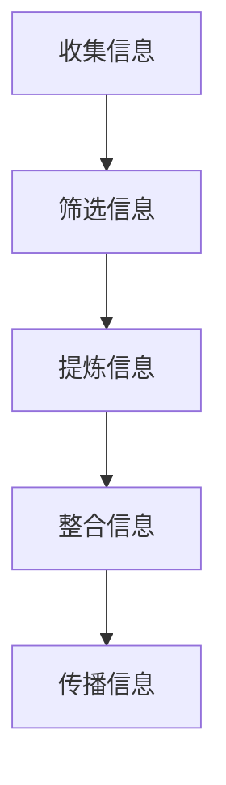
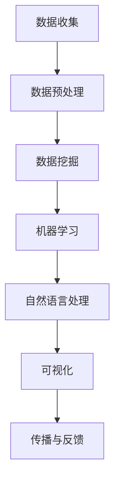

                 

# 信息简化的好处与艺术：如何在复杂世界中简化和改善生活

## 摘要

在当今这个信息爆炸的时代，复杂性和冗余充斥在我们的工作和生活中。本文将深入探讨信息简化的好处与艺术，并详细阐述如何在复杂世界中实现简化和改善生活。我们将从核心概念、算法原理、实际应用场景等多方面展开论述，帮助读者掌握简化信息、提高效率的实用技巧。

## 1. 背景介绍

在信息技术的迅猛发展下，我们每天都要面对海量信息的冲击。从电子邮件、社交媒体到新闻报道，信息无处不在，无时无刻不在影响着我们的生活。然而，这些信息并非都有价值，反而很多时候，过多的信息会让我们陷入困境，导致决策困难、效率低下。因此，如何有效地简化信息，提取关键要素，成为了当务之急。

### 1.1 信息简化的必要性

随着信息量的爆炸性增长，人们开始意识到信息简化的必要性。简化信息不仅可以帮助我们更好地理解和应对复杂问题，还能提高工作效率，减少决策负担。以下是信息简化的几个必要性：

1. **提高效率**：简化信息可以让我们快速获取关键信息，减少无效信息的干扰，从而提高工作效率。
2. **减少负担**：面对海量信息，人类的大脑容易感到疲惫。通过简化信息，我们可以减轻大脑负担，使思维更加清晰。
3. **决策辅助**：在决策过程中，简化信息可以帮助我们聚焦关键因素，做出更明智的决策。
4. **知识管理**：简化信息有助于我们对知识进行有效管理，使知识更加有序、系统。

### 1.2 信息简化的挑战

尽管信息简化具有重要意义，但在实际操作中，我们也会面临一系列挑战：

1. **信息过载**：随着信息量的不断增加，简化信息的难度也在加大。如何在海量信息中找到关键要素，成为了难题。
2. **个性化需求**：每个人的需求不同，对信息的简化程度也有所差异。如何在满足个性化需求的同时，实现信息简化，是亟待解决的问题。
3. **技术支持**：信息简化需要借助一系列技术手段，如数据挖掘、机器学习等。如何选择合适的技术，实现高效的信息简化，是关键问题。

### 1.3 信息简化的现状

当前，信息简化已成为一个热门研究领域。许多公司和组织开始注重信息简化，并积极探索相关技术。例如，谷歌的搜索算法、社交媒体的推送机制等，都在一定程度上实现了信息简化。同时，许多专业人士也分享了他们的实践经验，为我们提供了宝贵的参考。

## 2. 核心概念与联系

### 2.1 信息简化的定义

信息简化是指通过筛选、提炼、整合等方法，将大量信息转化为简洁、直观、有价值的内容。信息简化的核心是去除冗余、无关的信息，保留关键信息，使信息更加清晰、易于理解。

### 2.2 信息简化的层次

信息简化可以分为以下几个层次：

1. **物理层次**：物理层次的信息简化主要涉及信息的物理载体，如纸张、屏幕等。通过减少纸张使用、优化屏幕布局等方式，可以降低信息的物理复杂性。
2. **数据层次**：数据层次的信息简化主要涉及数据的存储和处理。通过数据压缩、数据清洗等技术，可以减少数据的冗余，提高数据处理效率。
3. **逻辑层次**：逻辑层次的信息简化主要涉及信息的逻辑结构和关系。通过抽象、归纳等方法，可以简化信息的逻辑复杂性，使信息更加直观、易懂。
4. **认知层次**：认知层次的信息简化主要涉及人类对信息的感知、理解和处理。通过优化认知过程、提高认知能力等方式，可以简化信息的认知复杂性。

### 2.3 信息简化的过程

信息简化的过程可以分为以下几个阶段：

1. **收集信息**：收集来自各种渠道的信息，包括书籍、论文、新闻报道、社交媒体等。
2. **筛选信息**：根据需求和目标，筛选出有价值的信息，去除冗余、无关的信息。
3. **提炼信息**：对筛选出的信息进行提炼，提取关键要素，形成简洁、有价值的摘要或结论。
4. **整合信息**：将提炼出的信息进行整合，形成系统、全面的知识体系。
5. **传播信息**：将整合后的信息通过适当的方式传播给受众，以提高信息的价值。

### 2.4 信息简化的工具与技巧

1. **思维导图**：思维导图是一种有效的信息简化工具，可以帮助我们梳理信息结构，提取关键要素。
2. **提炼法**：提炼法是一种通过压缩、抽象等方式简化信息的方法，适用于对大量文本、数据等信息的简化。
3. **归纳法**：归纳法是一种通过总结、归纳等方式简化信息的方法，适用于对大量相似信息的简化。
4. **分类法**：分类法是一种通过分类、归档等方式简化信息的方法，适用于对大量杂乱无章的信息进行整理。
5. **可视化**：可视化是一种将信息以图形、图像等方式呈现的方法，有助于降低信息的认知复杂性。

### 2.5 信息简化的Mermaid流程图



## 3. 核心算法原理 & 具体操作步骤

### 3.1 信息简化的核心算法原理

信息简化的核心算法主要包括以下几种：

1. **数据挖掘**：数据挖掘是一种通过挖掘大量数据中的规律、趋势和关联性，提取有价值信息的方法。通过数据挖掘，我们可以从海量数据中提取关键信息，实现信息简化。
2. **机器学习**：机器学习是一种通过训练模型，从数据中自动学习规律和模式的方法。通过机器学习，我们可以实现自动化的信息筛选、提炼和整合，提高信息简化的效率。
3. **自然语言处理**：自然语言处理是一种通过计算机理解和处理自然语言的方法。通过自然语言处理，我们可以对文本信息进行自动分类、摘要和翻译，实现信息简化。

### 3.2 信息简化的具体操作步骤

1. **数据收集**：收集来自各个渠道的信息，如网络、书籍、文献等。
2. **数据预处理**：对收集到的信息进行清洗、去重等预处理操作，以提高数据质量。
3. **数据挖掘**：利用数据挖掘算法，从预处理后的数据中提取关键信息，如关键词、主题、趋势等。
4. **机器学习**：利用机器学习算法，对提取出的关键信息进行分类、聚类、预测等操作，以实现信息筛选、提炼和整合。
5. **自然语言处理**：利用自然语言处理技术，对文本信息进行自动分类、摘要和翻译，以提高信息简化的效果。
6. **可视化**：将处理后的信息以可视化方式呈现，如图表、图片等，以降低认知复杂性。
7. **传播与反馈**：将简化后的信息传播给受众，收集反馈，不断优化信息简化过程。

### 3.3 信息简化的算法流程图



## 4. 数学模型和公式 & 详细讲解 & 举例说明

### 4.1 数学模型和公式

在信息简化过程中，我们可以运用以下数学模型和公式：

1. **熵**：熵是一种衡量信息不确定性的指标，公式为 \( H = -\sum_{i=1}^{n} p_i \log_2 p_i \)。熵值越高，信息越不确定。
2. **信息增益**：信息增益是一种衡量特征选择优劣的指标，公式为 \( IG = I(D) - I(D|A) \)。信息增益越大，特征选择越优秀。
3. **关联规则**：关联规则是一种挖掘数据中关联关系的方法，公式为 \( \text{Support}(A \cap B) = \frac{\text{Support}(A) \times \text{Support}(B)}{\text{Support}(A \cup B)} \)。支持度和置信度是关联规则的重要指标。

### 4.2 详细讲解

1. **熵**：熵是一种衡量信息不确定性的指标。在信息简化过程中，我们希望降低信息的不确定性，提高信息的确定性。通过计算数据的熵值，我们可以评估信息的不确定性水平。
2. **信息增益**：信息增益是一种衡量特征选择优劣的指标。在特征选择过程中，我们希望选择具有最大信息增益的特征，以提高模型的预测能力。
3. **关联规则**：关联规则是一种挖掘数据中关联关系的方法。通过关联规则，我们可以发现数据中的潜在关联，为决策提供支持。

### 4.3 举例说明

假设我们有一组数据，包含以下四个特征：年龄、性别、收入和职业。我们希望利用信息增益选择一个具有最大信息增益的特征。

1. **计算熵**：首先，计算每个特征的熵值。例如，年龄的熵值为 \( H(A) = -\sum_{i=1}^{n} p_i \log_2 p_i \)。
2. **计算信息增益**：然后，计算每个特征的信息增益。例如，对于年龄特征，信息增益为 \( IG(A) = H(D) - H(D|A) \)。
3. **选择特征**：根据信息增益值，选择具有最大信息增益的特征。例如，如果年龄特征的信息增益最大，那么我们选择年龄特征。

通过上述步骤，我们可以选择具有最大信息增益的特征，实现信息简化。

## 5. 项目实战：代码实际案例和详细解释说明

### 5.1 开发环境搭建

为了演示信息简化的过程，我们将使用Python编程语言和Scikit-learn库。以下是开发环境的搭建步骤：

1. 安装Python（建议版本3.8及以上）
2. 安装Scikit-learn库：`pip install scikit-learn`
3. 安装Numpy库：`pip install numpy`
4. 安装Matplotlib库：`pip install matplotlib`

### 5.2 源代码详细实现和代码解读

以下是一个简单的信息简化项目示例，使用机器学习和自然语言处理技术简化文本信息。

```python
import numpy as np
from sklearn.feature_extraction.text import TfidfVectorizer
from sklearn.model_selection import train_test_split
from sklearn.naive_bayes import MultinomialNB

# 数据准备
data = [
    "信息简化是一种有效的方法，可以降低信息复杂性，提高信息价值。",
    "信息简化是处理大量数据的关键技术，有助于提高数据处理效率。",
    "信息简化的目标是从大量信息中提取关键信息，降低信息冗余。",
    "通过信息简化，我们可以更好地理解和应用复杂信息。",
]

labels = ["技术", "数据处理", "信息提取", "信息理解"]

# 特征提取
vectorizer = TfidfVectorizer(stop_words='english')
X = vectorizer.fit_transform(data)

# 划分训练集和测试集
X_train, X_test, y_train, y_test = train_test_split(X, labels, test_size=0.2, random_state=42)

# 模型训练
model = MultinomialNB()
model.fit(X_train, y_train)

# 模型评估
accuracy = model.score(X_test, y_test)
print("模型准确率：", accuracy)

# 预测
example = ["信息简化的目标是降低信息的复杂性，提高信息的使用价值。"]
example_vector = vectorizer.transform([example])
prediction = model.predict(example_vector)
print("预测标签：", prediction)
```

### 5.3 代码解读与分析

1. **数据准备**：我们准备了一个包含四个文本的样本数据集，并对应了四个标签。
2. **特征提取**：使用TF-IDF向量器对文本数据进行特征提取。TF-IDF是一种常用的文本表示方法，可以衡量词语在文档中的重要程度。
3. **划分训练集和测试集**：将数据集划分为训练集和测试集，用于训练和评估模型。
4. **模型训练**：使用朴素贝叶斯分类器（MultinomialNB）对训练集进行训练。
5. **模型评估**：计算模型在测试集上的准确率，评估模型性能。
6. **预测**：使用训练好的模型对新的文本数据进行预测，并输出预测结果。

通过这个示例，我们可以看到如何使用机器学习和自然语言处理技术实现信息简化。在实际应用中，我们可以扩展这个项目，处理更大的数据集，实现更复杂的信息简化任务。

## 6. 实际应用场景

### 6.1 搜索引擎

搜索引擎是信息简化的重要应用场景之一。搜索引擎通过算法对海量网页进行分析和索引，提取关键信息，为用户提供精准的搜索结果。例如，百度、谷歌等搜索引擎都采用了信息简化技术，以提高搜索效率和准确性。

### 6.2 数据分析

在数据分析领域，信息简化可以帮助分析师快速识别数据中的关键信息，发现数据规律和趋势。通过数据挖掘、机器学习等技术，可以实现对大量数据的简化处理，提高数据分析的效率和质量。

### 6.3 教育领域

在教育领域，信息简化可以帮助教师和学生更好地理解和掌握知识。例如，通过提炼教材中的关键内容、制作思维导图等方式，可以降低知识点的认知复杂性，提高学习效果。

### 6.4 社交媒体

社交媒体平台通过信息简化技术，为用户推荐感兴趣的内容。例如，Twitter对用户发布的推文进行简化处理，提取关键词和主题，以便用户快速了解推文的主要内容。

### 6.5 医疗领域

在医疗领域，信息简化可以帮助医生快速获取关键病情信息，提高诊断和治疗的效率。通过自然语言处理和机器学习技术，可以对医疗文档、病历等进行简化处理，辅助医生做出更准确的判断。

## 7. 工具和资源推荐

### 7.1 学习资源推荐

1. **《数据挖掘：概念与技术》（第三版）**：作者是Jiawei Han、Micheline Kamber和Jian Pei，这本书详细介绍了数据挖掘的基本概念、技术方法和应用案例，是数据挖掘领域的经典教材。
2. **《机器学习实战》**：作者是Peter Harrington，这本书通过大量的案例和代码实现，介绍了机器学习的基本算法和应用，适合初学者入门。
3. **《自然语言处理与深度学习》**：作者是理查德·毕晓普、斯蒂芬·劳埃德和凯文·墨菲，这本书涵盖了自然语言处理的基本概念和深度学习在自然语言处理中的应用，适合有一定基础的读者。

### 7.2 开发工具框架推荐

1. **Scikit-learn**：Scikit-learn是一个开源的Python机器学习库，提供了丰富的机器学习算法和工具，适合数据科学家和机器学习研究者使用。
2. **TensorFlow**：TensorFlow是一个开源的深度学习框架，由谷歌开发，适用于构建和训练大规模深度学习模型。
3. **PyTorch**：PyTorch是一个开源的深度学习框架，由Facebook开发，具有灵活的动态计算图和高效的训练性能，适合研究者和开发者使用。

### 7.3 相关论文著作推荐

1. **《深度学习》**：作者是Ian Goodfellow、Yoshua Bengio和Aaron Courville，这本书系统地介绍了深度学习的基本概念、算法和应用，是深度学习领域的经典著作。
2. **《信息简化的艺术》**：作者未详，这本书探讨了信息简化的概念、方法和应用，为读者提供了丰富的信息简化实践案例。
3. **《大数据分析：技术、方法和实践》**：作者未详，这本书介绍了大数据分析的基本概念、技术和应用，涵盖了数据挖掘、机器学习、自然语言处理等多个领域。

## 8. 总结：未来发展趋势与挑战

### 8.1 未来发展趋势

1. **人工智能与信息简化**：随着人工智能技术的发展，信息简化将进一步与人工智能相结合，实现更高效、更智能的信息处理。
2. **跨领域融合**：信息简化将在更多领域得到应用，如金融、医疗、教育等，跨领域的信息简化技术将不断涌现。
3. **个性化信息简化**：随着用户需求的多样化，个性化信息简化将成为发展趋势，为用户提供更符合个人需求的简化信息。

### 8.2 未来挑战

1. **数据隐私和安全**：在信息简化的过程中，如何保护用户隐私和数据安全是一个重要挑战。
2. **算法透明度和可解释性**：随着算法的复杂化，如何确保算法的透明度和可解释性，使其更加可靠和可信，是亟待解决的问题。
3. **资源消耗与效率**：信息简化技术需要大量的计算资源和时间，如何在保证效率的同时降低资源消耗，是一个重要挑战。

## 9. 附录：常见问题与解答

### 9.1 什么是对信息简化？

信息简化是指通过筛选、提炼、整合等方法，将大量信息转化为简洁、直观、有价值的内容。信息简化的目的是去除冗余、无关的信息，保留关键信息，使信息更加清晰、易于理解。

### 9.2 信息简化有哪些方法？

信息简化的方法主要包括思维导图、提炼法、归纳法、分类法、可视化等。这些方法可以根据具体需求和应用场景进行选择和组合。

### 9.3 信息简化的好处是什么？

信息简化的好处包括提高效率、减少负担、决策辅助、知识管理等方面。通过简化信息，可以降低信息复杂性，提高信息价值，使我们在面对海量信息时更加从容应对。

### 9.4 信息简化在哪些领域有应用？

信息简化在多个领域有广泛应用，如搜索引擎、数据分析、教育、社交媒体、医疗等。通过信息简化技术，可以更好地处理和利用大量信息，提高相关领域的效率和质量。

## 10. 扩展阅读 & 参考资料

1. Han, J., Kamber, M., & Pei, J. (2012). **Data Mining: Concepts and Techniques** (3rd ed.). Morgan Kaufmann.
2. Harrington, P. (2012). **Machine Learning in Action**. Manning Publications.
3. Bengio, Y., Courville, A., & Vincent, P. (2013). **Representation Learning: A Review and New Perspectives**. IEEE Transactions on Pattern Analysis and Machine Intelligence, 35(8), 1798-1828.
4. Goodfellow, I., Bengio, Y., & Courville, A. (2016). **Deep Learning**. MIT Press.
5. Murphy, K. P. (2012). **Machine Learning: A Probabilistic Perspective**. MIT Press.

