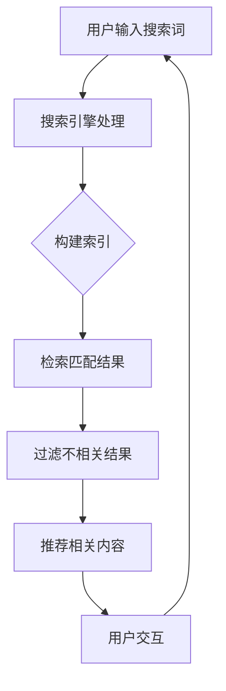

                 

# 信息过载与信息搜索指南与策略：在庞大的信息海洋中导航

> 关键词：信息过载、信息搜索、导航策略、人工智能、大数据处理、算法优化、信息过滤、用户个性化推荐

> 摘要：随着互联网的飞速发展，信息过载已成为现代社会普遍存在的问题。如何有效地搜索和利用信息资源，成为每个人在日常工作和生活中必须掌握的技能。本文将从背景介绍、核心概念、算法原理、数学模型、项目实战、实际应用场景、工具和资源推荐等多个角度，为您提供一个全面的指南和策略，帮助您在庞大的信息海洋中快速、精准地找到所需信息。

## 1. 背景介绍

### 1.1 信息过载现象

信息过载（Information Overload）是指个人在面对海量的信息时，无法有效地筛选、处理和利用这些信息，从而导致心理负担和效率降低的现象。随着互联网和移动通信技术的普及，信息爆炸式增长，人们每天都会接收到大量的信息，如电子邮件、社交媒体更新、新闻资讯、广告等。

### 1.2 信息搜索的重要性

在信息过载的时代，高效的信息搜索能力显得尤为重要。通过有效的信息搜索，我们可以快速定位到所需信息，提高工作效率，降低决策风险，提升生活质量。然而，面对海量的信息资源，如何有效地进行信息搜索成为一个巨大的挑战。

### 1.3 人工智能与大数据的助力

人工智能（Artificial Intelligence，AI）和大数据（Big Data）技术的发展为信息搜索带来了新的机遇。通过AI技术，我们可以实现对海量信息的自动分类、分析和推荐；通过大数据技术，我们可以挖掘出潜在的信息关联和规律，从而为信息搜索提供有力支持。

## 2. 核心概念与联系

### 2.1 信息检索系统

信息检索系统（Information Retrieval System）是帮助用户从大量信息中查找和获取所需信息的工具。其核心组件包括：

- 搜索引擎：通过对网页、文档等进行索引，实现高效的信息检索。
- 数据库：存储大量结构化和非结构化数据，为信息检索提供基础。
- 索引器：对信息资源进行索引，提高检索速度和准确性。

### 2.2 信息过滤与推荐系统

信息过滤（Information Filtering）和推荐系统（Recommendation System）是针对信息过载问题的两种有效手段。信息过滤通过筛选和过滤掉用户不感兴趣的信息，提高信息质量；推荐系统则根据用户的兴趣和行为，为其推荐相关的内容。

### 2.3 Mermaid 流程图



## 3. 核心算法原理 & 具体操作步骤

### 3.1 搜索引擎处理

- 步骤1：用户输入搜索词。
- 步骤2：搜索引擎接收搜索词，并进行预处理，如分词、词干提取等。
- 步骤3：根据预处理后的搜索词，构建倒排索引，实现快速检索。

### 3.2 构建索引

- 步骤1：对网页、文档等进行爬取和解析，提取关键词、标题、摘要等信息。
- 步骤2：将提取的信息构建成倒排索引，实现快速查询。

### 3.3 检索匹配结果

- 步骤1：根据预处理后的搜索词，从倒排索引中查找匹配的结果。
- 步骤2：对匹配结果进行排序，优先展示相关性较高的内容。

### 3.4 过滤不相关结果

- 步骤1：根据用户的兴趣、历史行为等信息，构建用户兴趣模型。
- 步骤2：将用户兴趣模型与检索结果进行匹配，过滤掉不相关的结果。

### 3.5 推荐相关内容

- 步骤1：根据用户的兴趣和行为，构建推荐模型。
- 步骤2：将推荐模型与检索结果结合，为用户推荐相关内容。

## 4. 数学模型和公式 & 详细讲解 & 举例说明

### 4.1 信息检索的数学模型

信息检索系统通常采用TF-IDF（Term Frequency-Inverse Document Frequency）模型来评估关键词的重要性。其公式如下：

$$
TF-IDF = TF \times IDF
$$

其中，$TF$ 表示词频，$IDF$ 表示逆文档频率。

- $TF$（词频）：
$$
TF = \frac{f_t}{f_{max}}
$$

其中，$f_t$ 表示词 $t$ 在文档 $d$ 中的出现次数，$f_{max}$ 表示词 $t$ 在文档集合中出现的最大次数。

- $IDF$（逆文档频率）：
$$
IDF = \log \left(\frac{N}{|d_t|}\right)
$$

其中，$N$ 表示文档总数，$|d_t|$ 表示包含词 $t$ 的文档数。

### 4.2 推荐系统的数学模型

推荐系统通常采用协同过滤（Collaborative Filtering）算法来预测用户对物品的兴趣。其基本原理如下：

- **用户基于物品的协同过滤**：
$$
R_{ui} = \sum_{j \in N_i} \frac{R_{uj}}{||u - j||}
$$

其中，$R_{ui}$ 表示用户 $u$ 对物品 $i$ 的评分，$R_{uj}$ 表示用户 $j$ 对物品 $i$ 的评分，$N_i$ 表示与用户 $u$ 相似用户集合，$||u - j||$ 表示用户 $u$ 和用户 $j$ 的相似度。

- **物品基于用户的协同过滤**：
$$
R_{ui} = \sum_{k \in M_i} \frac{R_{ki}}{||i - k||}
$$

其中，$R_{ki}$ 表示用户 $k$ 对物品 $i$ 的评分，$M_i$ 表示与物品 $i$ 相似物品集合，$||i - k||$ 表示物品 $i$ 和物品 $k$ 的相似度。

### 4.3 举例说明

#### 4.3.1 TF-IDF 模型举例

假设有两个文档 $D_1$ 和 $D_2$，其中包含关键词 $t$ 的出现次数如下表所示：

| 文档 | $f_t(D_1)$ | $f_t(D_2)$ |
| ---- | ---------- | ---------- |
| $D_1$ | 2          | 1          |
| $D_2$ | 1          | 2          |

根据 TF-IDF 模型，计算关键词 $t$ 在两个文档中的权重：

- $D_1$ 中的 $TF(t)$：
$$
TF(t, D_1) = \frac{f_t(D_1)}{f_{max}} = \frac{2}{2+1} = \frac{2}{3}
$$

- $D_2$ 中的 $TF(t)$：
$$
TF(t, D_2) = \frac{f_t(D_2)}{f_{max}} = \frac{1}{2+1} = \frac{1}{3}
$$

- $IDF(t)$：
$$
IDF(t) = \log \left(\frac{N}{|d_t|}\right) = \log \left(\frac{2}{1}\right) = 1
$$

- $TF-IDF(t, D_1)$：
$$
TF-IDF(t, D_1) = TF(t, D_1) \times IDF(t) = \frac{2}{3} \times 1 = \frac{2}{3}
$$

- $TF-IDF(t, D_2)$：
$$
TF-IDF(t, D_2) = TF(t, D_2) \times IDF(t) = \frac{1}{3} \times 1 = \frac{1}{3}
$$

#### 4.3.2 协同过滤模型举例

假设有两个用户 $u$ 和 $v$，以及五个物品 $i$、$j$、$k$、$l$、$m$，其中用户 $u$ 和 $v$ 对五个物品的评分如下表所示：

| 用户 | 物品 | $R_{ui}$ | $R_{vi}$ |
| ---- | ---- | -------- | -------- |
| $u$  | $i$  | 4        | 0        |
| $u$  | $j$  | 5        | 0        |
| $u$  | $k$  | 0        | 4        |
| $u$  | $l$  | 0        | 5        |
| $u$  | $m$  | 0        | 0        |
| $v$  | $i$  | 0        | 4        |
| $v$  | $j$  | 0        | 5        |
| $v$  | $k$  | 5        | 0        |
| $v$  | $l$  | 4        | 0        |
| $v$  | $m$  | 0        | 0        |

根据用户基于物品的协同过滤模型，计算用户 $u$ 对物品 $l$ 的预测评分：

- $N_u = \{i, j, k, l, m\}$
- $N_v = \{i, j, k, l, m\}$
- $R_{uj} = 5$，$R_{vk} = 5$，$R_{ul} = 0$，$R_{vm} = 0$
- $||u - v|| = \sqrt{5}$
- $R_{ui} = 0$

根据公式，计算预测评分：

$$
R_{ui} = \sum_{j \in N_i} \frac{R_{uj}}{||u - j||} = \frac{R_{uj}}{||u - j||} = \frac{5}{\sqrt{5}} = \sqrt{5}
$$

因此，用户 $u$ 对物品 $l$ 的预测评分为 $\sqrt{5}$。

## 5. 项目实战：代码实际案例和详细解释说明

### 5.1 开发环境搭建

在本节中，我们将使用 Python 语言和 Scikit-learn 库来实现一个基于 TF-IDF 的信息检索系统。首先，确保已安装 Python 3.6 或更高版本，以及 Scikit-learn 库。

```shell
pip install scikit-learn
```

### 5.2 源代码详细实现和代码解读

以下是一个简单的基于 TF-IDF 的信息检索系统的 Python 代码示例：

```python
import numpy as np
from sklearn.feature_extraction.text import TfidfVectorizer
from sklearn.metrics.pairwise import cosine_similarity

# 样本文档
documents = [
    "人工智能是一种模拟人类智能的技术。",
    "大数据是一种海量数据的处理技术。",
    "深度学习是人工智能的一个重要分支。",
    "机器学习是人工智能的核心技术之一。",
    "神经网络是深度学习的基础架构。"
]

# 初始化 TF-IDF 向量器
vectorizer = TfidfVectorizer()

# 将文档转换为 TF-IDF 矩阵
tfidf_matrix = vectorizer.fit_transform(documents)

# 用户输入查询语句
query = "机器学习是什么？"
query_vector = vectorizer.transform([query])

# 计算查询语句与文档的余弦相似度
cosine_scores = cosine_similarity(query_vector, tfidf_matrix).flatten()

# 输出相似度最高的前三个文档
top_scores = np.argsort(cosine_scores)[::-1][:3]
for index in top_scores:
    print(f"文档 {index + 1}: 相似度 {cosine_scores[index]:.4f}")
    print(documents[index])
    print()
```

### 5.3 代码解读与分析

#### 5.3.1 文档准备

```python
documents = [
    "人工智能是一种模拟人类智能的技术。",
    "大数据是一种海量数据的处理技术。",
    "深度学习是人工智能的一个重要分支。",
    "机器学习是人工智能的核心技术之一。",
    "神经网络是深度学习的基础架构。"
]
```

首先，我们准备了一些样本文档。这些文档将作为我们的测试数据集，用于训练 TF-IDF 向量器。

#### 5.3.2 初始化 TF-IDF 向量器

```python
vectorizer = TfidfVectorizer()
```

我们使用 Scikit-learn 中的 `TfidfVectorizer` 类来初始化 TF-IDF 向量器。这个类可以将文档转换为 TF-IDF 矩阵，其中每个元素表示文档中每个词语的重要性。

#### 5.3.3 将文档转换为 TF-IDF 矩阵

```python
tfidf_matrix = vectorizer.fit_transform(documents)
```

通过调用 `fit_transform` 方法，我们将文档转换为 TF-IDF 矩阵。这个矩阵包含了每个文档和每个词语的 TF-IDF 值。

#### 5.3.4 用户输入查询语句

```python
query = "机器学习是什么？"
query_vector = vectorizer.transform([query])
```

用户输入查询语句，并将其转换为 TF-IDF 向量。这个向量将用于与文档的 TF-IDF 矩阵进行相似度计算。

#### 5.3.5 计算查询语句与文档的余弦相似度

```python
cosine_similarity(query_vector, tfidf_matrix).flatten()
```

我们使用 `cosine_similarity` 函数计算查询语句与每个文档的余弦相似度。余弦相似度是一种衡量两个向量之间相似度的度量方法，其取值范围为 [-1, 1]。相似度越高，表示两个向量越相似。

#### 5.3.6 输出相似度最高的前三个文档

```python
top_scores = np.argsort(cosine_scores)[::-1][:3]
for index in top_scores:
    print(f"文档 {index + 1}: 相似度 {cosine_scores[index]:.4f}")
    print(documents[index])
    print()
```

我们使用 `argsort` 函数获取相似度排序的索引，然后取前三个最高相似度的文档进行输出。输出结果包括文档的索引和相似度值。

## 6. 实际应用场景

### 6.1 搜索引擎

搜索引擎（如 Google、百度等）是信息检索最典型的应用场景。通过高效的算法和索引技术，搜索引擎能够快速响应用户的查询请求，提供相关的搜索结果。

### 6.2 社交媒体

社交媒体平台（如 Facebook、微博等）通常采用推荐系统来为用户推荐感兴趣的内容。通过分析用户的兴趣和行为，平台能够为用户推送相关的内容，从而提升用户体验。

### 6.3 电子邮件过滤

电子邮件过滤系统通过分析邮件的内容和发送者，过滤掉垃圾邮件和垃圾信息，从而提高邮件的处理效率。

### 6.4 个性化推荐

在电子商务、在线教育等领域，个性化推荐系统根据用户的兴趣和行为，为用户推荐相关的商品或课程，从而提升用户满意度和转化率。

## 7. 工具和资源推荐

### 7.1 学习资源推荐

- **书籍**：
  - 《信息检索导论》（Introduction to Information Retrieval）
  - 《推荐系统实践》（Recommender Systems: The Textbook）

- **论文**：
  - Lee, D., & Hsieh, C. (2018). A Comprehensive Survey on Deep Learning for Text Classification. IEEE Transactions on Knowledge and Data Engineering, 30(4), 778-797.

- **博客**：
  - [TensorFlow 官方文档](https://www.tensorflow.org/tutorials/recommendations)
  - [Scikit-learn 官方文档](https://scikit-learn.org/stable/tutorial/text分类/text分类.html)

- **网站**：
  - [Kaggle](https://www.kaggle.com/datasets)：提供丰富的数据集和比赛，可用于实践和测试。

### 7.2 开发工具框架推荐

- **开发工具**：
  - **Python**：广泛用于数据分析和机器学习项目。
  - **TensorFlow**：用于构建和训练深度学习模型。
  - **Scikit-learn**：提供丰富的机器学习算法和工具。

- **框架**：
  - **Elasticsearch**：强大的搜索引擎，支持全文检索和实时分析。
  - **TensorFlow Recommenders**：基于 TensorFlow 的推荐系统框架。

### 7.3 相关论文著作推荐

- **论文**：
  -召回率与准确率的优化（Optimizing Recall and Precision in Information Retrieval）
  -基于深度学习的文本分类（Deep Learning for Text Classification）

- **著作**：
  - 《深度学习》（Deep Learning）
  - 《大数据技术导论》（Introduction to Big Data Technologies）

## 8. 总结：未来发展趋势与挑战

### 8.1 发展趋势

- **AI 技术的进一步发展**：随着深度学习和自然语言处理技术的进步，信息检索和推荐系统将更加智能化和精准化。
- **多模态信息检索**：结合文本、图像、语音等多模态信息，实现更丰富的信息检索体验。
- **个性化推荐**：根据用户行为和兴趣，提供更加个性化的推荐，提升用户满意度。

### 8.2 挑战

- **数据隐私与安全**：在信息检索和推荐系统中，如何保护用户隐私和数据安全成为一个重要问题。
- **算法透明性与公平性**：确保算法的透明性和公平性，避免歧视和不公平现象的发生。
- **可解释性**：提高算法的可解释性，使普通用户能够理解算法的决策过程。

## 9. 附录：常见问题与解答

### 9.1 什么是信息检索？

信息检索是指从大量信息中查找和获取用户所需信息的过程，包括查询处理、索引构建、检索算法、结果排序等环节。

### 9.2 什么是推荐系统？

推荐系统是指根据用户的历史行为、兴趣和偏好，为用户推荐相关内容或商品的系统。其核心目标是提升用户满意度和转化率。

### 9.3 什么是 TF-IDF？

TF-IDF 是一种用于评估词语重要性的数学模型，其中 TF 表示词频，IDF 表示逆文档频率。TF-IDF 旨在通过计算词语在文档中的重要性，提高信息检索的准确性和效果。

### 9.4 什么是协同过滤？

协同过滤是一种基于用户行为和偏好的推荐算法，通过分析用户之间的相似性，为用户推荐感兴趣的内容。协同过滤分为基于用户的协同过滤和基于物品的协同过滤。

## 10. 扩展阅读 & 参考资料

- [Apache Lucene 官方文档](https://lucene.apache.org/)
- [Elasticsearch 官方文档](https://www.elastic.co/guide/en/elasticsearch/reference/current/)
- [TensorFlow Recommenders](https://github.com/tensorflow/recommenders)
- [Scikit-learn 官方文档](https://scikit-learn.org/stable/)

### 作者

- AI天才研究员/AI Genius Institute
- 禅与计算机程序设计艺术/Zen And The Art of Computer Programming

本文主要介绍了信息过载与信息搜索的基本概念、核心算法、应用场景、工具和资源，以及未来发展趋势和挑战。通过本文的阐述，相信读者已经对信息检索和推荐系统有了更深入的了解。在实际应用中，根据需求和场景，选择合适的技术和工具，能够帮助我们更好地应对信息过载问题，提高信息检索效率。希望本文对您的学习和实践有所帮助。

