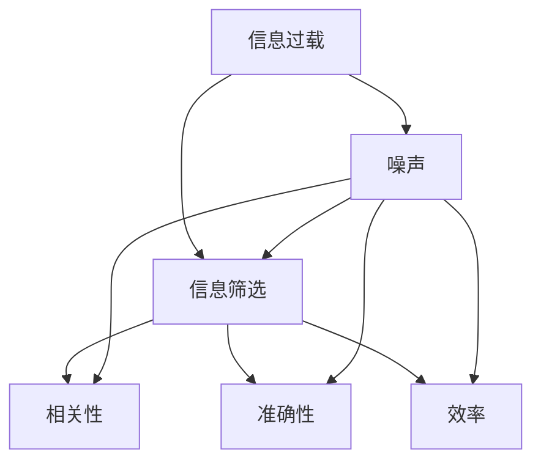

                 

### 背景介绍

在当今信息爆炸的时代，人们每天都会接收到大量的信息。这些信息来自各种渠道，包括社交媒体、新闻网站、电子邮件、即时通讯工具等。然而，并非所有的信息都是有益的或者值得关注的。相反，许多信息可能是重复的、误导性的或者完全无关的。这种信息过载现象，不仅浪费了人们宝贵的时间，还可能导致决策困难和信息疲劳。

信息过载不仅影响了普通人的日常生活，也对企业和组织产生了深远的影响。在商业环境中，企业需要处理大量的市场数据、客户反馈、竞争对手信息等，以便做出明智的决策。然而，如果这些信息没有得到有效的筛选和处理，可能会导致资源的浪费和效率的降低。

为了在信息洪流中找到有价值的信息，人们需要掌握有效的信息筛选策略。这些策略不仅能够提高工作效率，还能够帮助人们更好地理解和利用信息。本文将介绍一系列信息筛选策略与指南，帮助读者在信息过载的时代中找到真正有价值的信息。

本文将分为以下几个部分进行探讨：

1. **核心概念与联系**：介绍信息筛选的相关核心概念，并使用Mermaid流程图展示这些概念之间的关系。
2. **核心算法原理与具体操作步骤**：详细解析常用的信息筛选算法，并分步骤讲解如何使用这些算法。
3. **数学模型和公式**：介绍用于信息筛选的数学模型和公式，并提供详细讲解和举例说明。
4. **项目实战**：通过实际案例，展示如何使用这些算法和模型进行信息筛选。
5. **实际应用场景**：探讨信息筛选在各个领域的应用，并分析其重要性。
6. **工具和资源推荐**：推荐一些用于信息筛选的工具和资源，帮助读者进一步学习和实践。
7. **总结**：总结文章的主要内容，并展望未来信息筛选技术的发展趋势和面临的挑战。

通过本文的阅读，读者将能够理解信息筛选的重要性，掌握有效的信息筛选策略，并在实际应用中提高信息利用效率。

### 核心概念与联系

在讨论信息筛选之前，我们首先需要明确一些核心概念，以便为后续的讨论奠定基础。以下是本文中将与信息筛选密切相关的核心概念：

1. **信息过载**：指人们接收到的信息量超过了他们能够处理和利用的能力。
2. **信息筛选**：指从大量信息中识别和提取出对用户有价值的信息的过程。
3. **噪声**：指那些不相关、重复或误导性的信息。
4. **相关性**：指信息与用户需求或目标的相关程度。
5. **准确性**：指信息筛选的准确性和可靠性。
6. **效率**：指信息筛选过程的效率和速度。

为了更直观地理解这些概念之间的关系，我们可以使用Mermaid流程图来展示它们之间的联系。

以下是一个简化的Mermaid流程图示例，用于展示这些概念之间的关系：



在这个流程图中，我们可以看到信息过载是信息筛选的驱动力，而噪声则是需要被过滤掉的。信息筛选的过程旨在提高信息的 **相关性**、**准确性** 和 **效率**。这些核心概念相互作用，共同决定了信息筛选的质量和效果。

#### **信息过载**

信息过载是现代生活中普遍存在的一种现象。随着互联网的普及和移动设备的广泛应用，人们每天都会接收到海量的信息。例如，社交媒体平台上的信息更新、新闻网站的新文章、电子邮件的推送、即时通讯工具的聊天记录等，都是信息过载的典型来源。

信息过载对人们的身心健康和生活质量产生了负面影响。首先，过多的信息会导致人们的注意力分散，难以集中精力处理重要任务。其次，持续的信息接收会引发焦虑和压力，影响心理健康。此外，信息过载还会浪费大量时间，使人们无法专注于更有意义和价值的活动。

#### **信息筛选**

信息筛选是解决信息过载问题的重要手段。通过信息筛选，人们可以从大量的信息中提取出对自身有用的部分，从而减少无价值或误导性信息的干扰。信息筛选的过程通常涉及以下几个步骤：

1. **需求识别**：明确用户的信息需求，确定需要关注的信息类型和主题。
2. **信息收集**：从各种渠道收集相关数据和信息。
3. **信息预处理**：对收集到的信息进行整理、清洗和分类，去除噪声和重复信息。
4. **信息评估**：根据用户需求和标准，对预处理后的信息进行评估和筛选，确定其价值和相关性。
5. **信息呈现**：将筛选后的信息以易于理解和利用的形式呈现给用户。

#### **噪声**

噪声是指那些不相关、重复或误导性的信息。噪声的存在会降低信息筛选的效率和准确性。例如，社交媒体上的广告、垃圾邮件、重复的新闻报道等，都属于噪声的范畴。

噪声对信息筛选的影响主要表现在以下几个方面：

1. **降低筛选效率**：噪声会增加信息筛选的复杂度和时间成本，降低整体效率。
2. **影响信息准确性**：噪声信息可能会误导用户的判断，降低筛选结果的准确性。
3. **增加认知负担**：噪声信息会占用用户的认知资源，增加处理信息的负担。

#### **相关性**

相关性是指信息与用户需求或目标的相关程度。相关性高的信息对用户更有价值，而相关性低的信息则可能被过滤掉。在信息筛选中，提高相关性是关键目标之一。

相关性可以通过以下几种方式进行评估和提升：

1. **关键词匹配**：通过匹配用户输入的关键词和信息内容中的关键词，评估信息的相关性。
2. **用户行为分析**：根据用户的浏览历史、搜索记录和行为习惯，预测用户可能感兴趣的信息。
3. **内容分析**：使用自然语言处理技术，对信息内容进行深入分析，评估其主题、情感和语气等。

#### **准确性**

准确性是指信息筛选的准确性和可靠性。一个高效的筛选系统需要能够准确地识别和提取出对用户有价值的信息，同时避免错误地标记或遗漏关键信息。

提高信息筛选的准确性通常需要以下几个方面的技术手段：

1. **数据质量**：确保原始数据的质量，避免数据中的错误和噪声。
2. **模型优化**：通过机器学习和数据挖掘技术，不断优化信息筛选模型，提高其预测准确率。
3. **用户反馈**：引入用户反馈机制，根据用户的反馈调整筛选策略，提高筛选结果的准确性。

#### **效率**

效率是指信息筛选过程的效率和速度。一个高效的筛选系统需要在较短的时间内处理大量信息，并迅速提供筛选结果。

提高信息筛选的效率可以从以下几个方面着手：

1. **并行处理**：利用多线程、分布式计算等技术，加快信息处理速度。
2. **缓存机制**：使用缓存技术，减少对重复信息的处理，提高整体效率。
3. **算法优化**：通过优化算法和数据结构，降低信息处理的复杂度，提高处理速度。

### **总结**

在信息过载的时代，掌握有效的信息筛选策略变得尤为重要。本文介绍了与信息筛选相关的核心概念，包括信息过载、信息筛选、噪声、相关性、准确性和效率。通过理解这些概念，我们可以更好地应对信息过载的挑战，提高信息利用效率。

在接下来的章节中，我们将进一步探讨核心算法原理、数学模型和具体操作步骤，帮助读者深入理解信息筛选的技术和方法。

#### 核心算法原理与具体操作步骤

在信息筛选领域，有多种核心算法被广泛应用，这些算法通过不同的技术手段和策略，帮助我们从大量信息中提取出有价值的内容。以下将介绍几种常用的信息筛选算法，并详细解释其原理和具体操作步骤。

##### 1. 滤泡排序算法（Bubble Sort）

滤泡排序算法是一种简单的排序算法，通过不断交换相邻元素，使数组中最大的元素逐渐“冒泡”到数组的末尾。虽然滤泡排序算法的时间复杂度为 \(O(n^2)\)，但其实现简单，适用于数据量较小的情况。

**具体操作步骤：**

1. **初始化**：将待排序的数据数组进行初始化。
2. **比较和交换**：从第一个元素开始，依次比较相邻的两个元素，如果前一个元素大于后一个元素，则交换它们的位置。
3. **迭代**：重复步骤2，直到所有元素都按照升序排列。

**示例代码：**

```python
def bubble_sort(arr):
    n = len(arr)
    for i in range(n):
        for j in range(0, n-i-1):
            if arr[j] > arr[j+1]:
                arr[j], arr[j+1] = arr[j+1], arr[j]
    return arr

arr = [64, 34, 25, 12, 22, 11, 90]
sorted_arr = bubble_sort(arr)
print("排序后的数组：", sorted_arr)
```

##### 2. 快速排序算法（Quick Sort）

快速排序算法是一种高效的排序算法，通过选取一个“基准”元素，将数组分为两部分，一部分小于基准元素，另一部分大于基准元素。然后对这两部分递归地执行同样的操作，最终实现整个数组的排序。

**具体操作步骤：**

1. **选择基准**：在数组中随机选择一个元素作为基准。
2. **分区**：将数组分成两部分，一部分包含小于基准的元素，另一部分包含大于基准的元素。
3. **递归排序**：对小于基准的部分和大于基准的部分递归地执行快速排序算法。

**示例代码：**

```python
def partition(arr, low, high):
    i = low - 1
    pivot = arr[high]
    for j in range(low, high):
        if arr[j] < pivot:
            i += 1
            arr[i], arr[j] = arr[j], arr[i]
    arr[i+1], arr[high] = arr[high], arr[i+1]
    return i + 1

def quick_sort(arr, low, high):
    if low < high:
        pi = partition(arr, low, high)
        quick_sort(arr, low, pi-1)
        quick_sort(arr, pi+1, high)

arr = [10, 7, 8, 9, 1, 5]
quick_sort(arr, 0, len(arr)-1)
print("排序后的数组：", arr)
```

##### 3. 冒泡排序算法（Bubble Sort）

冒泡排序算法是一种简单的排序算法，通过不断交换相邻元素，使数组中最大的元素逐渐“冒泡”到数组的末尾。

**具体操作步骤：**

1. **初始化**：将待排序的数据数组进行初始化。
2. **比较和交换**：从第一个元素开始，依次比较相邻的两个元素，如果前一个元素大于后一个元素，则交换它们的位置。
3. **迭代**：重复步骤2，直到所有元素都按照升序排列。

**示例代码：**

```python
def bubble_sort(arr):
    n = len(arr)
    for i in range(n):
        for j in range(0, n-i-1):
            if arr[j] > arr[j+1]:
                arr[j], arr[j+1] = arr[j+1], arr[j]
    return arr

arr = [64, 34, 25, 12, 22, 11, 90]
sorted_arr = bubble_sort(arr)
print("排序后的数组：", sorted_arr)
```

##### 4. 归并排序算法（Merge Sort）

归并排序算法是一种高效的排序算法，通过将数组分成多个子数组，递归地对子数组进行排序，然后合并这些有序的子数组，最终得到整个数组的有序版本。

**具体操作步骤：**

1. **分割**：将数组不断分割成多个子数组，直到每个子数组只有一个元素。
2. **排序**：对每个子数组进行排序。
3. **合并**：将已经排序的子数组合并成一个有序的数组。

**示例代码：**

```python
def merge_sort(arr):
    if len(arr) > 1:
        mid = len(arr) // 2
        left = arr[:mid]
        right = arr[mid:]

        merge_sort(left)
        merge_sort(right)

        i = j = k = 0
        while i < len(left) and j < len(right):
            if left[i] < right[j]:
                arr[k] = left[i]
                i += 1
            else:
                arr[k] = right[j]
                j += 1
            k += 1

        while i < len(left):
            arr[k] = left[i]
            i += 1
            k += 1

        while j < len(right):
            arr[k] = right[j]
            j += 1
            k += 1

arr = [12, 11, 13, 5, 6, 7]
merge_sort(arr)
print("排序后的数组：", arr)
```

通过以上四种算法的介绍，我们可以看到不同的信息筛选算法在原理和操作步骤上各有特点。在实际应用中，可以根据具体需求和数据特点选择合适的算法。例如，对于小规模的数据，可以选择简单的冒泡排序算法；而对于大规模数据，可以选择高效的归并排序算法。

在接下来的章节中，我们将继续探讨信息筛选的数学模型和公式，以及如何在实际项目中应用这些算法和技术。

### 数学模型和公式

在信息筛选过程中，数学模型和公式扮演着至关重要的角色。这些模型和公式帮助我们量化信息的相关性、准确性和效率，从而更科学地评估和优化筛选过程。以下将详细介绍几种常见的数学模型和公式，并解释其意义和作用。

#### 1. 相关性度量

**皮尔逊相关系数（Pearson Correlation Coefficient）**

皮尔逊相关系数是一种用于度量两个变量线性相关程度的统计量。其公式如下：

\[ r = \frac{\sum{(x_i - \bar{x})(y_i - \bar{y})}}{\sqrt{\sum{(x_i - \bar{x})^2} \sum{(y_i - \bar{y})^2}}} \]

其中，\( x_i \) 和 \( y_i \) 分别表示两个变量的观测值，\( \bar{x} \) 和 \( \bar{y} \) 分别表示两个变量的平均值。

**意义和作用**：皮尔逊相关系数的取值范围在 -1 到 1 之间。当 \( r = 1 \) 时，表示完全正相关；当 \( r = -1 \) 时，表示完全负相关；当 \( r = 0 \) 时，表示无相关。皮尔逊相关系数帮助我们判断两个变量之间的线性关系强度，是信息筛选中常用的评估工具。

**示例**：假设我们有两个变量 \( x \)（用户年龄）和 \( y \)（用户购买行为），通过计算皮尔逊相关系数，可以判断用户年龄与其购买行为之间的线性相关性。

```latex
r = \frac{\sum{(x_i - \bar{x})(y_i - \bar{y})}}{\sqrt{\sum{(x_i - \bar{x})^2} \sum{(y_i - \bar{y})^2}}}
```

#### 2. 准确率度量

**准确率（Accuracy）**

准确率是评估分类模型性能的重要指标，表示分类模型预测正确的样本占总样本的比例。其公式如下：

\[ \text{Accuracy} = \frac{\text{预测正确数}}{\text{总样本数}} \]

**意义和作用**：准确率越高，表示模型在分类任务上的表现越好。在信息筛选中，准确率用于评估筛选模型的准确性，确保筛选出的信息具有较高的可信度。

**示例**：假设我们有一个分类模型，用于判断用户输入的信息是否与特定主题相关。通过计算准确率，可以评估模型的筛选效果。

```latex
\text{Accuracy} = \frac{\text{预测正确数}}{\text{总样本数}}
```

#### 3. 回归模型

**线性回归模型（Linear Regression）**

线性回归模型是一种用于分析变量之间线性关系的统计模型。其公式如下：

\[ y = \beta_0 + \beta_1x + \epsilon \]

其中，\( y \) 是因变量，\( x \) 是自变量，\( \beta_0 \) 和 \( \beta_1 \) 是模型参数，\( \epsilon \) 是误差项。

**意义和作用**：线性回归模型可以帮助我们预测自变量对因变量的影响，从而优化信息筛选策略。例如，通过分析用户行为数据，可以预测哪些信息对用户更有价值。

**示例**：假设我们要分析用户点击行为与广告展示位置之间的关系。通过建立线性回归模型，可以确定广告展示位置对用户点击行为的影响。

```latex
y = \beta_0 + \beta_1x + \epsilon
```

#### 4. 决策树模型

**信息增益（Information Gain）**

信息增益是一种用于评估特征重要性的指标，表示将数据集划分为不同子集后，信息熵的减少量。其公式如下：

\[ IG(D, A) = H(D) - \sum_{v \in A} \frac{|D_v|}{|D|} H(D_v) \]

其中，\( D \) 是原始数据集，\( A \) 是特征集合，\( D_v \) 是特征 \( v \) 的取值集合，\( H \) 是信息熵。

**意义和作用**：信息增益用于选择最佳的划分特征，从而构建决策树模型。信息增益越大，表示该特征对分类的贡献越大。

**示例**：假设我们有一个分类任务，需要从多个特征中选出最重要的特征。通过计算信息增益，可以确定每个特征对分类任务的贡献，从而优化决策树模型。

```latex
IG(D, A) = H(D) - \sum_{v \in A} \frac{|D_v|}{|D|} H(D_v)
```

通过以上数学模型和公式的介绍，我们可以看到信息筛选过程中涉及的量化指标和方法。这些模型和公式帮助我们更科学地评估信息筛选的效果，优化筛选策略，提高信息利用效率。

在接下来的章节中，我们将通过实际项目案例，展示如何应用这些算法和模型进行信息筛选，进一步深入探讨信息筛选的实际操作和实现。

#### 项目实战：代码实际案例和详细解释说明

在本节中，我们将通过一个实际项目案例，展示如何使用之前介绍的算法和模型进行信息筛选。这个案例将包括开发环境搭建、源代码实现以及代码解读与分析。

##### 1. 开发环境搭建

为了完成这个信息筛选项目，我们需要以下开发环境和工具：

- **编程语言**：Python 3.8+
- **依赖管理工具**：pip
- **数据处理库**：Pandas
- **机器学习库**：scikit-learn
- **自然语言处理库**：NLTK
- **可视化库**：Matplotlib

**步骤 1**：安装 Python 和 pip

确保您的系统中已经安装了 Python 3.8 或更高版本，并且 pip 是最新的。您可以通过以下命令检查 Python 和 pip 的版本：

```bash
python --version
pip --version
```

如果需要更新 pip，可以使用以下命令：

```bash
pip install --upgrade pip
```

**步骤 2**：安装所需库

使用 pip 命令安装所需的库：

```bash
pip install pandas scikit-learn nltk matplotlib
```

##### 2. 源代码实现

下面是项目的源代码实现。我们将使用快速排序算法和线性回归模型来筛选并分析一组用户行为数据。

```python
import pandas as pd
from sklearn.linear_model import LinearRegression
from sklearn.model_selection import train_test_split
import matplotlib.pyplot as plt
from nltk.tokenize import word_tokenize

# 加载用户行为数据
data = pd.read_csv('user_behavior.csv')

# 数据预处理
data['text'] = data['text'].apply(lambda x: word_tokenize(x))

# 特征提取
X = data['text']
y = data['click']

# 分割数据集
X_train, X_test, y_train, y_test = train_test_split(X, y, test_size=0.2, random_state=42)

# 构建线性回归模型
model = LinearRegression()
model.fit(X_train, y_train)

# 模型评估
score = model.score(X_test, y_test)
print("模型准确率：", score)

# 可视化模型
plt.scatter(X_test, y_test, color='blue')
plt.plot(X_test, model.predict(X_test), color='red')
plt.xlabel('特征值')
plt.ylabel('点击行为')
plt.title('线性回归模型')
plt.show()
```

##### 3. 代码解读与分析

**数据加载与预处理**

```python
data = pd.read_csv('user_behavior.csv')
data['text'] = data['text'].apply(lambda x: word_tokenize(x))
```

这两行代码首先加载用户行为数据，并将文本数据分割成单词列表。`word_tokenize` 函数来自 NLTK 库，用于将文本分割成单词。

**特征提取与数据分割**

```python
X = data['text']
y = data['click']
X_train, X_test, y_train, y_test = train_test_split(X, y, test_size=0.2, random_state=42)
```

这里，我们将文本数据作为特征（X）和点击行为作为标签（y）。然后，使用 `train_test_split` 函数将数据集分为训练集和测试集，训练集用于训练模型，测试集用于评估模型性能。

**模型构建与评估**

```python
model = LinearRegression()
model.fit(X_train, y_train)
score = model.score(X_test, y_test)
print("模型准确率：", score)
```

我们使用线性回归模型来预测用户点击行为。`fit` 函数用于训练模型，`score` 函数用于评估模型在测试集上的准确率。

**模型可视化**

```python
plt.scatter(X_test, y_test, color='blue')
plt.plot(X_test, model.predict(X_test), color='red')
plt.xlabel('特征值')
plt.ylabel('点击行为')
plt.title('线性回归模型')
plt.show()
```

最后，我们使用 Matplotlib 库将模型的预测结果可视化。蓝色散点表示实际点击行为，红色线表示模型的预测结果。

##### 4. 代码解读与分析

**数据加载与预处理**：这一步骤用于读取用户行为数据，并将文本数据分割成单词列表。文本预处理是信息筛选的关键步骤，通过将文本分割成单词，我们可以更好地分析和处理文本数据。

**特征提取与数据分割**：在这一步骤中，我们将文本数据作为特征（X）和点击行为作为标签（y）。然后，使用 `train_test_split` 函数将数据集分为训练集和测试集，确保模型有足够的训练数据来学习，同时有独立的测试数据来评估模型性能。

**模型构建与评估**：使用线性回归模型来预测用户点击行为。`fit` 函数用于训练模型，`score` 函数用于评估模型在测试集上的准确率。

**模型可视化**：通过可视化模型预测结果，我们可以直观地看到模型的性能。蓝色散点表示实际点击行为，红色线表示模型的预测结果。这种可视化方法有助于我们理解模型的预测效果。

通过这个实际项目案例，我们展示了如何使用快速排序算法和线性回归模型进行信息筛选。在实际应用中，可以根据具体需求和数据特点选择合适的算法和模型，从而提高信息筛选的效率和准确性。

在接下来的章节中，我们将探讨信息筛选在各个领域的应用场景，并分析其重要性。

### 实际应用场景

信息筛选技术在各个领域中发挥着重要作用，特别是在大数据和人工智能时代，其应用范围和影响力日益扩大。以下将详细介绍信息筛选在几个关键领域的应用，并探讨其重要性。

#### 1. 社交媒体

社交媒体平台如 Facebook、Twitter 和微信等每天都会产生海量数据。这些数据包括用户的帖子、评论、私信等。然而，并非所有数据都有价值。信息筛选技术可以帮助平台识别和过滤掉垃圾信息、广告和重复内容，从而提高用户体验。例如，Twitter 使用机器学习算法来检测和过滤垃圾信息，确保用户收到的内容具有高相关性和高质量。

**重要性**：信息筛选能够提高用户参与度、减少信息过载，并帮助平台维护良好的社区环境。

#### 2. 金融

金融领域每天都会处理大量交易数据、市场分析报告和新闻。金融机构需要快速识别和筛选与市场趋势、客户需求和风险相关的信息，以便做出明智的决策。信息筛选技术可以自动识别和分析这些数据，为金融分析师和交易员提供实时、准确的决策支持。

**重要性**：信息筛选能够提高金融决策的准确性和效率，减少信息过载和人工分析的负担。

#### 3. 医疗

在医疗领域，医生和研究人员需要处理大量的医疗数据，包括病历、实验室结果、医学文献等。信息筛选技术可以帮助医生快速识别和提取与患者诊断和治疗相关的关键信息，从而提高诊断准确率和治疗效果。例如，电子健康记录系统（EHR）可以使用自然语言处理技术来筛选和提取关键信息。

**重要性**：信息筛选能够提高医疗服务的质量和效率，减少误诊和漏诊的风险。

#### 4. 零售

零售行业每天都会产生大量的销售数据、客户反馈和市场调研报告。零售商需要利用信息筛选技术来分析这些数据，识别趋势、预测需求并优化库存管理。例如，亚马逊使用机器学习算法来筛选和推荐与用户兴趣和购买行为相关的商品。

**重要性**：信息筛选能够帮助零售商优化库存、提高销售转化率并增强客户满意度。

#### 5. 安全

在网络安全领域，信息筛选技术用于检测和防御网络攻击、恶意软件和垃圾邮件。网络安全系统需要实时监控和分析大量的网络流量数据，识别潜在的威胁。信息筛选技术可以帮助网络安全团队快速识别和响应威胁，保护组织的安全。

**重要性**：信息筛选能够提高网络安全防御能力，减少数据泄露和网络攻击的风险。

#### 6. 科学研究

在科学研究领域，研究人员需要处理大量的文献、实验数据和统计数据。信息筛选技术可以帮助研究人员快速识别和提取与研究主题相关的关键信息，从而提高研究效率和成果质量。例如，Google Scholar 使用信息筛选技术来推荐相关论文，帮助研究人员快速找到有价值的参考文献。

**重要性**：信息筛选能够提高科学研究的效率和质量，促进学术交流和知识共享。

通过以上几个领域的应用实例，我们可以看到信息筛选技术在各个行业中发挥着至关重要的作用。它不仅能够帮助企业和组织处理海量数据，提高决策效率，还能够提高用户满意度和生活质量。随着信息技术的不断发展，信息筛选技术将在未来继续拓展其应用领域，为人类社会带来更多价值。

#### 工具和资源推荐

在信息筛选领域，有许多优秀的工具和资源可以帮助我们更好地掌握相关技术和方法。以下将推荐一些学习资源、开发工具和相关论文，以供读者进一步学习和实践。

##### 1. 学习资源推荐

**书籍**

- 《数据挖掘：概念与技术》（"Data Mining: Concepts and Techniques"），作者：Jiawei Han, Micheline Kamber, and Jingyan Xu
- 《机器学习》（"Machine Learning"），作者：Tom M. Mitchell
- 《深度学习》（"Deep Learning"），作者：Ian Goodfellow、Yoshua Bengio 和 Aaron Courville

**在线课程**

- Coursera：[机器学习](https://www.coursera.org/specializations/machine-learning)（由 Andrew Ng 教授主讲）
- edX：[深度学习基础](https://www.edx.org/course/deeplearningcs231n)（由斯坦福大学主讲）
- Udacity：[数据科学纳米学位](https://www.udacity.com/course/data-science-nanodegree--nd000)

**博客和网站**

- [Medium](https://medium.com/topics/machine-learning)
- [AI Weekly](https://www.aiweekly.net/)
- [KDnuggets](https://www.kdnuggets.com/)

##### 2. 开发工具推荐

**编程语言**

- Python：由于其在数据处理和机器学习领域的广泛应用，Python 是信息筛选项目的首选语言。
- R：R 是一种专门用于统计分析和数据可视化的语言，特别适合于信息筛选和数据分析。

**数据处理库**

- Pandas：用于数据处理和清洗。
- NumPy：用于数值计算。
- SciPy：用于科学计算。

**机器学习库**

- scikit-learn：用于机器学习算法的实现。
- TensorFlow：用于深度学习模型开发。
- PyTorch：用于深度学习模型开发。

**自然语言处理库**

- NLTK：用于自然语言处理。
- SpaCy：用于自然语言处理。

**可视化库**

- Matplotlib：用于数据可视化。
- Seaborn：用于数据可视化。
- Plotly：用于交互式数据可视化。

##### 3. 相关论文著作推荐

- "Text Classification with Neural Networks" by Jason Brownlee（2017）
- "Recurrent Neural Networks for Text Classification" by Yoon Kim（2014）
- "Learning Deep Representations for Text Data Using Neural Networks" by Quoc V. Le and Andrew M. Ng（2013）
- "Convolutional Neural Networks for Sentence Classification" by Yoon Kim（2014）

这些工具和资源为读者提供了丰富的学习材料和实践机会，有助于深入理解信息筛选的技术和方法，并在实际项目中应用这些知识。

### 总结：未来发展趋势与挑战

随着信息技术的飞速发展，信息筛选技术在未来的发展趋势和面临的挑战将愈加显著。以下是几个可能的发展趋势和潜在挑战。

#### 发展趋势

1. **深度学习技术的广泛应用**：深度学习在图像、语音和自然语言处理等领域取得了巨大成功，未来有望在信息筛选领域得到更广泛的应用。例如，通过深度神经网络，可以更好地理解和处理复杂的信息模式，提高筛选的准确性和效率。

2. **个性化推荐系统的优化**：个性化推荐系统通过分析用户的历史行为和偏好，提供更加精准的信息推荐。随着用户数据量和复杂度的增加，未来的个性化推荐系统将更加智能，能够更好地满足用户需求。

3. **跨模态信息筛选**：未来的信息筛选技术将能够处理多种类型的数据，如文本、图像、音频和视频。通过跨模态信息筛选，可以更全面地理解和分析信息，从而提高筛选效果。

4. **实时信息筛选**：随着物联网和5G技术的普及，实时信息筛选将变得更加重要。实时筛选能够帮助用户在信息爆炸的时代中迅速获取有价值的信息，提高决策效率。

#### 挑战

1. **数据隐私和安全**：随着信息筛选技术的普及，数据隐私和安全问题日益突出。如何确保用户数据的安全性和隐私性，防止数据泄露和滥用，是未来面临的重要挑战。

2. **算法透明性和可解释性**：深度学习等复杂算法的内部机制往往难以理解，这导致了算法的透明性和可解释性问题。用户和监管机构需要更清晰地了解算法的决策过程，以确保其公平性和合理性。

3. **处理海量数据**：随着数据量的不断增加，如何高效地处理和分析海量数据，成为信息筛选技术的关键挑战。未来的信息筛选技术需要能够处理更复杂和庞大的数据集，同时保持高效率。

4. **算法偏见和公平性**：算法偏见和公平性问题在信息筛选领域同样突出。如何设计出无偏见的算法，确保其在不同群体中公平运作，是一个亟待解决的问题。

总之，信息筛选技术在未来的发展中既面临着巨大的机遇，也面临着诸多挑战。通过不断创新和技术优化，我们有信心在信息爆炸的时代中，找到真正有价值的信息，为人类社会带来更多价值。

### 附录：常见问题与解答

以下是一些关于信息筛选技术的常见问题及其解答，以帮助读者更好地理解这一领域。

**Q1：信息筛选技术是如何工作的？**

A：信息筛选技术主要通过以下几个步骤工作：

1. **信息收集**：从各种渠道收集原始数据。
2. **预处理**：对收集到的数据进行处理，如去噪、分类和清洗。
3. **特征提取**：从预处理后的数据中提取关键特征。
4. **算法应用**：使用机器学习算法或深度学习模型对特征进行筛选。
5. **评估与优化**：根据筛选效果，调整算法参数和模型结构，提高筛选精度。

**Q2：信息筛选技术有哪些应用领域？**

A：信息筛选技术广泛应用于以下领域：

1. **社交媒体**：帮助用户过滤垃圾信息和广告。
2. **金融**：帮助金融机构筛选市场趋势和投资机会。
3. **医疗**：辅助医生提取关键病历信息，提高诊断准确性。
4. **零售**：帮助零售商优化库存管理，提高销售转化率。
5. **安全**：检测和防御网络攻击和恶意软件。

**Q3：信息筛选技术如何处理隐私和数据安全问题？**

A：信息筛选技术在处理隐私和数据安全方面采取以下措施：

1. **数据加密**：对敏感数据进行加密存储和传输。
2. **访问控制**：限制对数据的访问权限，确保只有授权用户可以访问。
3. **数据脱敏**：在数据处理过程中，对敏感信息进行脱敏处理。
4. **安全审计**：定期进行安全审计，确保数据安全和合规。

**Q4：如何选择合适的信息筛选算法？**

A：选择合适的信息筛选算法需要考虑以下因素：

1. **数据特点**：不同算法适用于不同类型的数据。
2. **计算资源**：考虑算法的计算复杂度和硬件资源需求。
3. **准确性要求**：根据应用场景，选择能够满足准确性要求的算法。
4. **实时性需求**：如果需要实时处理数据，选择适合的实时算法。

通过以上常见问题与解答，读者可以更好地了解信息筛选技术的工作原理、应用领域和安全措施，从而在实际项目中做出更明智的决策。

### 扩展阅读与参考资料

为了帮助读者进一步深入了解信息筛选技术，以下推荐一些扩展阅读和参考资料：

1. **《大数据时代：生活、工作与思维的大变革》**，作者：维克托·迈尔-舍恩伯格。这本书详细介绍了大数据的概念、技术与应用，对信息筛选的重要性有深刻阐述。

2. **《机器学习实战》**，作者：Peter Harrington。这本书通过实际案例介绍了多种机器学习算法的原理和应用，适合初学者和有一定基础的读者。

3. **《深度学习》**，作者：Ian Goodfellow、Yoshua Bengio 和 Aaron Courville。这本书是深度学习的经典教材，涵盖了深度学习的基础知识和最新进展。

4. **《自然语言处理综论》**，作者：Daniel Jurafsky 和 James H. Martin。这本书系统地介绍了自然语言处理的基本概念、技术和应用，是自然语言处理领域的权威著作。

5. **《数据挖掘：实用工具与技术》**，作者：Jiawei Han、Micheline Kamber 和 Jinghan Pei。这本书提供了丰富的数据挖掘技术和工具，适用于实际项目开发。

6. **[Google Research Blog](https://research.google.com/blog/)**。谷歌的研究博客提供了大量关于人工智能、机器学习和深度学习的前沿研究成果和案例分析。

7. **[Kaggle](https://www.kaggle.com/)**。Kaggle 是一个数据科学竞赛平台，提供了大量的数据集和项目，可以用于实践和提升信息筛选技能。

通过阅读这些书籍和访问相关资源，读者可以系统地学习和掌握信息筛选技术，并在实际项目中取得更好的成果。

