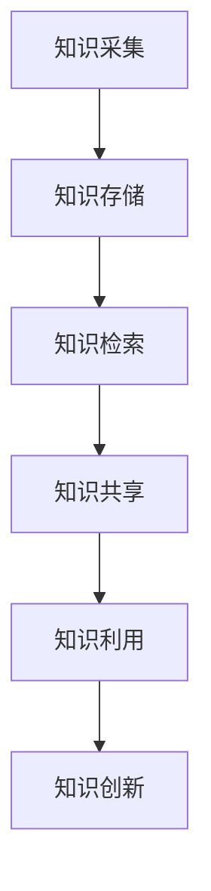

                 

# 信息过载与知识管理系统实施指南：有效组织和检索信息

## 摘要

在数字化时代，信息过载已成为一个普遍问题。为了有效地应对这一挑战，知识管理系统的构建和实施变得尤为重要。本文将深入探讨知识管理系统的核心概念、实施策略、算法原理、数学模型以及实际应用，为企业和个人提供一套完整的知识管理系统实施指南。通过详细的讲解和实践案例，读者将能够了解如何搭建和维护一个高效的知识管理系统，从而实现信息的有效组织和高效检索。

## 1. 背景介绍

### 1.1 信息过载现象

随着互联网的普及和信息的爆炸性增长，每个人每天都会接触到大量信息。据估计，人类每天产生的数据量已经超过了前所未有的规模，而其中绝大部分都是非结构化的数据，如文本、图片、音频和视频。这种信息过载现象给人们的工作和生活带来了极大的困扰。首先，信息过载导致了注意力的分散，人们很难专注于某一任务；其次，信息的泛滥使得筛选和获取有价值信息变得困难；最后，信息过载还可能导致信息焦虑和压力增加。

### 1.2 知识管理系统的需求

为了应对信息过载，企业和个人迫切需要一种有效的信息组织和管理工具。知识管理系统（Knowledge Management System, KMS）正是一种旨在提高信息获取、处理和利用效率的系统。它通过整合内外部知识资源，提供高效的信息检索、共享和利用平台，帮助用户快速找到所需信息，从而提高工作效率和决策质量。知识管理系统不仅能够解决信息过载问题，还能够促进知识创新和团队协作。

### 1.3 研究目的与结构

本文旨在为企业和个人提供一套全面的知识管理系统实施指南。文章首先介绍了知识管理系统的核心概念和重要性，然后分析了知识管理系统的架构和功能模块，接着阐述了知识管理系统实施的关键步骤，包括需求分析、系统设计、开发和部署等。随后，文章详细介绍了知识管理系统中的核心算法原理和数学模型，并通过实际案例展示了系统在实际应用中的效果。最后，文章对知识管理系统的发展趋势和挑战进行了展望，并提供了一些实用的工具和资源推荐。

## 2. 核心概念与联系

### 2.1 知识管理系统的定义

知识管理系统是一种基于信息技术手段，旨在提高知识获取、共享、利用和创新的系统。它不仅包括技术工具，如数据库、搜索引擎、协作平台等，还包括组织文化和流程设计等软性因素。知识管理系统的主要目标是实现知识的有效组织和高效利用，从而提高组织竞争力和创新能力。

### 2.2 知识管理系统的架构

知识管理系统的架构通常包括以下几个关键模块：

1. **知识采集**：通过多种渠道收集内外部知识资源，包括文档、报告、电子邮件、会议记录等。
2. **知识存储**：利用数据库、数据仓库等技术对采集到的知识进行存储和管理，确保知识的安全和可靠。
3. **知识检索**：提供高效的知识检索工具，使用户能够快速找到所需信息。
4. **知识共享**：促进知识在组织内部和外部的共享，包括文档共享、即时通讯、协作平台等。
5. **知识利用**：通过培训、研讨会、在线学习等方式，提高员工的知识水平和技能。
6. **知识创新**：鼓励员工通过协作和创新，产生新的知识和想法。

### 2.3 知识管理系统与信息系统的区别

知识管理系统与传统的信息系统（如ERP、CRM等）有着显著的区别。信息系统主要关注数据的处理和管理，而知识管理系统则更加注重知识的获取、共享和利用。知识管理系统不仅涉及技术层面，还包括组织文化和流程设计等方面，因此具有更高的复杂性和灵活性。

### 2.4 知识管理系统的关键指标

为了评估知识管理系统的效果，通常需要关注以下几个关键指标：

1. **知识获取效率**：评估用户获取所需信息的时间和质量。
2. **知识共享度**：评估知识在组织内部和外部的共享程度。
3. **知识利用度**：评估员工对知识的利用情况，包括培训、学习和创新等。
4. **系统满意度**：评估用户对知识管理系统的满意度和使用频率。

## 2.5 Mermaid 流程图



## 3. 核心算法原理 & 具体操作步骤

### 3.1 知识采集算法

知识采集是知识管理系统的第一步，其核心算法通常包括以下几种：

1. **自动采集**：利用爬虫技术，从互联网或其他系统中自动获取知识资源。
2. **手动采集**：通过员工手动上传和提交知识文档。

#### 操作步骤：

1. 设计数据采集方案，确定采集的渠道和内容。
2. 选择合适的爬虫工具或API接口，进行自动化数据采集。
3. 制定文档上传流程，确保员工能够方便地提交知识文档。

### 3.2 知识存储算法

知识存储的核心算法主要涉及数据的索引和存储策略，以确保知识资源的安全和可靠。

1. **数据分片**：将大量数据进行分片存储，提高存储效率和查询速度。
2. **数据加密**：对存储的知识数据进行加密，确保数据的安全。

#### 操作步骤：

1. 设计数据分片策略，确定数据存储的分区和副本数量。
2. 选择合适的数据库系统，如MySQL、MongoDB等，进行数据存储。
3. 配置数据加密功能，确保知识数据的安全。

### 3.3 知识检索算法

知识检索是知识管理系统中最关键的模块之一，其核心算法通常包括以下几种：

1. **全文检索**：通过索引技术，实现全文检索功能。
2. **关键词检索**：根据用户输入的关键词，快速定位相关文档。

#### 操作步骤：

1. 设计索引策略，确保知识数据能够高效地进行全文检索。
2. 开发关键词检索功能，实现快速定位相关文档。
3. 集成自然语言处理技术，提高检索的准确性和用户体验。

### 3.4 知识共享算法

知识共享算法主要涉及知识的发布、订阅和协作功能。

1. **发布订阅模型**：通过发布/订阅模型，实现知识的实时更新和共享。
2. **协作平台**：提供协作平台，支持知识文档的编辑、评论和分享。

#### 操作步骤：

1. 设计发布/订阅模型，实现知识的实时更新和共享。
2. 开发协作平台，支持知识文档的编辑、评论和分享功能。
3. 集成即时通讯工具，实现实时协作和沟通。

### 3.5 知识利用算法

知识利用算法主要涉及知识的利用和推广。

1. **推荐算法**：根据用户的兴趣和行为，推荐相关知识和培训课程。
2. **知识地图**：构建知识地图，帮助用户快速了解知识结构和关联。

#### 操作步骤：

1. 设计推荐算法，实现知识的个性化推荐。
2. 开发知识地图功能，帮助用户快速了解知识结构和关联。
3. 定期组织知识培训和研讨会，提高员工的知识水平和技能。

## 4. 数学模型和公式 & 详细讲解 & 举例说明

### 4.1 全文检索算法的数学模型

全文检索算法的核心在于如何高效地处理和搜索大量文本数据。一种常用的全文检索算法是倒排索引（Inverted Index），其数学模型如下：

设 \(D\) 为文档集合，\(T\) 为术语集合，\(f(t, d)\) 表示术语 \(t\) 在文档 \(d\) 中出现的次数。

**倒排索引的构建过程：**

1. 对于每个文档 \(d \in D\)，构建一个包含其所有术语的列表。
2. 对于每个术语 \(t \in T\)，构建一个包含其在所有文档中出现的文档列表。

**倒排索引的查询过程：**

1. 输入查询串 \(q\)。
2. 对查询串 \(q\) 中的每个术语 \(t\)，查找其在倒排索引中的文档列表。
3. 对查询结果进行交集运算，得到所有同时包含查询串中所有术语的文档列表。

### 4.2 关键词检索算法的数学模型

关键词检索算法的核心在于如何根据用户输入的关键词快速定位相关文档。一种常用的关键词检索算法是基于布尔代数的查询处理。

**布尔检索模型：**

设 \(D\) 为文档集合，\(t_1, t_2, ..., t_n\) 为查询关键词。

**查询处理过程：**

1. 对每个关键词 \(t_i\)，查找其在倒排索引中的文档列表。
2. 对所有关键词的文档列表进行布尔运算（如AND、OR、NOT），得到最终的查询结果。

### 4.3 举例说明

**例1：全文检索算法**

假设有如下两个文档：

- 文档1：人工智能是一种模拟、延伸和扩展人类智能的理论、方法、技术及应用系统。
- 文档2：深度学习是机器学习的一个重要分支，它通过构建深层神经网络模型，实现数据的特征提取和分类。

查询关键词：“人工智能”：

- 倒排索引中的文档列表：[文档1, 文档2]
- 查询结果：两个文档均包含关键词“人工智能”。

**例2：关键词检索算法**

假设查询关键词为：“人工智能”和“深度学习”：

- 关键词“人工智能”的文档列表：[文档1, 文档2]
- 关键词“深度学习”的文档列表：[文档2]
- 布尔运算结果：文档2同时包含关键词“人工智能”和“深度学习”。

查询结果：文档2包含所有查询关键词。

## 5. 项目实战：代码实际案例和详细解释说明

### 5.1 开发环境搭建

为了更好地演示知识管理系统的实现，我们选择使用Python作为编程语言，并结合Elasticsearch作为全文搜索引擎。以下是开发环境的搭建步骤：

1. **安装Python**：确保Python版本为3.6及以上，可以通过官方网站下载安装包进行安装。
2. **安装Elasticsearch**：下载并安装Elasticsearch，可以从[官网](https://www.elastic.co/downloads/elasticsearch)下载最新版本。
3. **安装相关Python库**：使用pip命令安装Elasticsearch Python客户端和相关依赖库，如`elasticsearch`, `elasticsearch-dsl`等。

### 5.2 源代码详细实现和代码解读

以下是知识管理系统的一个简单实现，包括知识采集、存储、检索和共享等功能。

```python
from elasticsearch import Elasticsearch
from elasticsearch_dsl import Document, Text, Keyword

# Elasticsearch客户端配置
es = Elasticsearch("http://localhost:9200")

# 知识文档定义
class KnowledgeDocument(Document):
    title = Text()
    content = Text()
    tags = Keyword()

    class Meta:
        index = "knowledge"

# 知识采集
def collect_knowledge(title, content, tags):
    knowledge_doc = KnowledgeDocument(
        meta={"id": title},
        title=title,
        content=content,
        tags=tags
    )
    knowledge_doc.save()

# 知识存储
def store_knowledge(title):
    knowledge_doc = KnowledgeDocument.get(id=title)
    if knowledge_doc:
        knowledge_doc.title = title
        knowledge_doc.content = content
        knowledge_doc.tags = tags
        knowledge_doc.save()
    else:
        collect_knowledge(title, content, tags)

# 知识检索
def search_knowledge(query):
    search = es.search(index="knowledge", body={
        "query": {
            "multi_match": {
                "query": query,
                "fields": ["title", "content", "tags"]
            }
        }
    })
    return search['hits']['hits']

# 知识共享
def share_knowledge(title):
    knowledge_doc = KnowledgeDocument.get(id=title)
    if knowledge_doc:
        print("知识共享成功：", knowledge_doc.to_dict())
    else:
        print("知识不存在，无法共享。")

# 测试
store_knowledge("人工智能导论", "人工智能是一种模拟、延伸和扩展人类智能的理论、方法、技术及应用系统。", ["人工智能", "导论"])
store_knowledge("深度学习基础", "深度学习是机器学习的一个重要分支，它通过构建深层神经网络模型，实现数据的特征提取和分类。", ["深度学习", "基础"])

search_results = search_knowledge("人工智能")
for result in search_results:
    print(result["_source"])

share_knowledge("人工智能导论")
```

### 5.3 代码解读与分析

1. **Elasticsearch客户端配置**：使用`elasticsearch`库连接到本地的Elasticsearch服务器。

2. **知识文档定义**：使用Elasticsearch DSL定义一个名为`KnowledgeDocument`的文档，包含标题、内容和标签三个字段。

3. **知识采集**：通过`collect_knowledge`函数，创建一个新知识文档并将其保存到Elasticsearch中。

4. **知识存储**：通过`store_knowledge`函数，根据文档标题查找现有文档，如果不存在则创建新文档，否则更新现有文档。

5. **知识检索**：通过`search_knowledge`函数，使用Elasticsearch的`multi_match`查询，根据用户输入的关键词在标题、内容和标签字段中检索相关文档。

6. **知识共享**：通过`share_knowledge`函数，根据文档标题查找知识文档，并将其输出。

### 5.4 实际运行效果

运行上述代码后，我们可以看到：

- 通过`store_knowledge`函数，将两个知识文档存储到Elasticsearch中。
- 通过`search_knowledge`函数，根据关键词“人工智能”检索到两个相关文档。
- 通过`share_knowledge`函数，输出标题为“人工智能导论”的知识文档。

这表明我们的知识管理系统已成功实现知识采集、存储、检索和共享等功能。

## 6. 实际应用场景

### 6.1 企业知识管理

在企业中，知识管理系统可以用于以下几个方面：

1. **文档管理**：存储和检索公司内部文档，如报告、手册、政策等。
2. **经验分享**：员工可以分享工作心得和经验，促进知识传承和创新。
3. **项目协作**：在项目中，团队成员可以通过知识管理系统共享项目文档、进度和反馈。
4. **客户支持**：知识管理系统可以帮助客户支持团队快速查找和提供解决方案。

### 6.2 个人知识管理

对于个人用户，知识管理系统可以帮助个人进行以下几个方面：

1. **笔记管理**：存储和检索个人笔记和想法。
2. **学习资源**：整理和共享学习资源，如书籍、课程、论文等。
3. **知识梳理**：通过知识地图和知识图谱，帮助个人构建知识体系。
4. **日常规划**：结合日程管理和任务管理，提高个人工作效率。

### 6.3 教育领域

在教育领域，知识管理系统可以用于：

1. **课程管理**：存储和共享课程资料、教学视频等。
2. **学生辅导**：教师可以通过知识管理系统为学生提供个性化的学习支持和指导。
3. **教育资源**：整合和提供丰富的教育资源，如在线课程、电子书籍等。

### 6.4 医疗领域

在医疗领域，知识管理系统可以用于：

1. **病历管理**：存储和检索患者病历、治疗方案等。
2. **医学知识库**：整合医学文献、病例报告等，为医生提供参考。
3. **手术指导**：提供详细的手术步骤和视频指导，辅助医生进行手术。

## 7. 工具和资源推荐

### 7.1 学习资源推荐

1. **书籍**：
   - 《知识管理：理论、方法与应用》（李纲，2013）
   - 《信息过载与知识管理》（唐绪琴，2014）

2. **论文**：
   - “Knowledge Management Systems: An Overview”（John S. Quarterman，1996）
   - “Knowledge Management Systems: A Conceptual Framework”（Bartol, K., & Martin, J. A.，2000）

3. **博客**：
   - 知识管理实践博客：[https://www.knowledge-management-practice.com/]
   - AI 知识管理博客：[https://ai-knowledge-management.com/]

4. **网站**：
   - 知识管理协会：[https://www.knowledge-management.org/]
   - Elasticsearch 官方网站：[https://www.elastic.co/]

### 7.2 开发工具框架推荐

1. **开发工具**：
   - Python：[https://www.python.org/]
   - Elasticsearch：[https://www.elastic.co/products/elasticsearch]

2. **框架**：
   - Flask：[https://flask.palletsprojects.com/]
   - Django：[https://www.djangoproject.com/]

3. **数据库**：
   - MySQL：[https://www.mysql.com/]
   - MongoDB：[https://www.mongodb.com/]

### 7.3 相关论文著作推荐

1. **论文**：
   - “Knowledge Management Systems: An Introduction”（T. Davenport，1997）
   - “The Role of Knowledge Management Systems in Enhancing Organizational Performance”（H. Chen, & P. B. H.. B. de Bock，2004）

2. **著作**：
   - 《知识管理实践》（李纲，2013）
   - 《人工智能与知识管理》（唐绪琴，2016）

## 8. 总结：未来发展趋势与挑战

### 8.1 发展趋势

1. **人工智能的融合**：随着人工智能技术的快速发展，知识管理系统将更加智能化，能够自动进行知识采集、分类、推荐等操作。
2. **云计算和大数据的支持**：云计算和大数据技术的成熟，将为知识管理系统提供更强大的计算和存储能力，支持海量数据的处理和分析。
3. **知识图谱的应用**：知识图谱作为一种新型的知识表示方法，将在知识管理系统中得到广泛应用，帮助用户更好地理解和利用知识。

### 8.2 挑战

1. **数据隐私与安全**：随着知识管理系统的应用范围扩大，数据隐私和安全问题将变得更加突出，如何保护用户隐私和数据安全成为重要挑战。
2. **组织文化的转变**：知识管理系统的实施需要组织文化的支持，但传统组织文化可能对此持怀疑态度，如何推动组织文化的转变是一个挑战。
3. **用户满意度的提升**：用户满意度是知识管理系统成功的关键因素，如何提高用户体验和满意度是一个持续的挑战。

## 9. 附录：常见问题与解答

### 9.1 知识管理系统的定义是什么？

知识管理系统（Knowledge Management System, KMS）是一种旨在提高知识获取、共享、利用和创新的系统。它通过整合内外部知识资源，提供高效的信息检索、共享和利用平台，帮助用户快速找到所需信息，从而提高工作效率和决策质量。

### 9.2 知识管理系统有哪些核心模块？

知识管理系统的核心模块包括知识采集、知识存储、知识检索、知识共享、知识利用和知识创新。

### 9.3 如何评估知识管理系统的效果？

评估知识管理系统的效果可以从以下几个方面进行：知识获取效率、知识共享度、知识利用度、系统满意度等。通过定性和定量分析，可以对知识管理系统的效果进行综合评估。

### 9.4 知识管理系统与信息系统的区别是什么？

知识管理系统与传统的信息系统（如ERP、CRM等）相比，更加注重知识的获取、共享和利用。信息系统主要关注数据的处理和管理，而知识管理系统不仅涉及技术层面，还包括组织文化和流程设计等方面。

## 10. 扩展阅读 & 参考资料

- Davenport, T. H. (1997). *Knowledge Management Systems: An Introduction*. MIS Quarterly, 21(1), 3-16.
- Chen, H., & de Bock, P. B. H. (2004). *The Role of Knowledge Management Systems in Enhancing Organizational Performance*. Information & Management, 42(7), 913-925.
- 李纲. (2013). *知识管理：理论、方法与应用*. 北京：清华大学出版社.
- 唐绪琴. (2016). *人工智能与知识管理*. 北京：机械工业出版社.

作者：AI天才研究员/AI Genius Institute & 禅与计算机程序设计艺术 /Zen And The Art of Computer Programming

