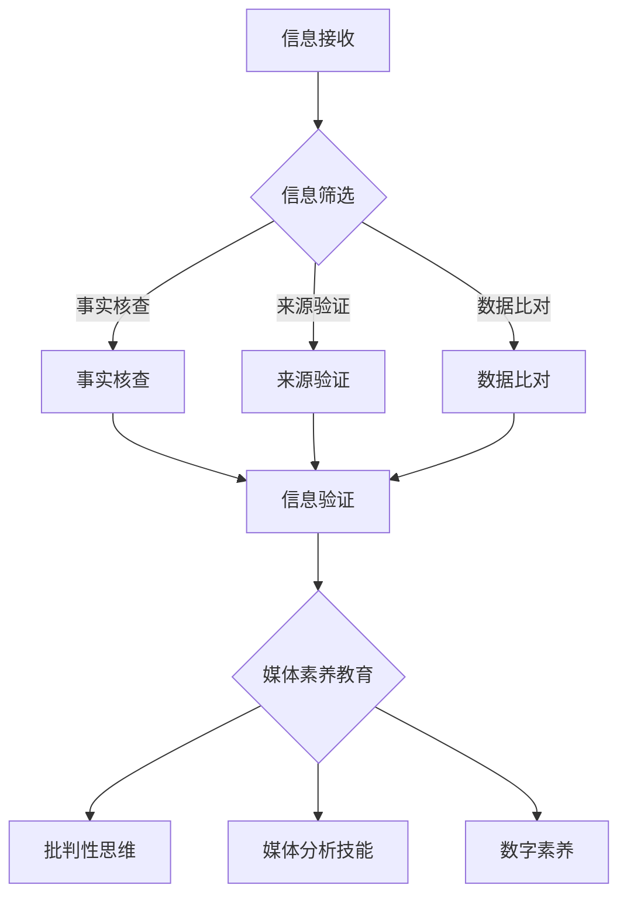

                 

# 信息验证和在线媒体素养教育：为假新闻和媒体操纵做好准备

> 关键词：信息验证、在线媒体素养教育、假新闻、媒体操纵、数据挖掘、算法分析、算法伦理、可信信息传播

> 摘要：在信息爆炸和假新闻泛滥的时代，提高人们的在线媒体素养，加强信息验证能力，已成为抵御媒体操纵和假新闻的必要手段。本文将探讨信息验证和在线媒体素养教育的核心概念、算法原理、应用场景及未来发展趋势，旨在为个人和社会提供有效的应对策略。

## 1. 背景介绍

在数字化时代，信息传播的速度和广度前所未有，但这同时也带来了信息过载和假新闻的泛滥。根据牛津互联网研究所（Oxford Internet Institute）的报告，假新闻在社交媒体上的传播速度比真实新闻快70%。这种趋势不仅误导了公众，还可能引发社会动荡和政治危机。

面对这种情况，人们需要提高在线媒体素养，学会辨别真假信息，避免被假新闻和媒体操纵所影响。信息验证成为了一个关键能力。通过信息验证，我们可以识别信息的真实性、准确性和可靠性，从而做出明智的决策。

同时，在线媒体素养教育也变得尤为重要。它不仅包括对信息的辨别能力，还涵盖了批判性思维、媒体分析技能以及数字素养等多个方面。这种教育可以帮助个人和整个社会更好地应对假新闻和媒体操纵的挑战。

本文将探讨信息验证和在线媒体素养教育的核心概念，分析其背后的算法原理，讨论实际应用场景，并展望未来的发展趋势与挑战。

## 2. 核心概念与联系

### 信息验证

信息验证是指对信息的真实性、准确性和可靠性进行核实的过程。其核心概念包括事实核查、来源验证、数据比对等。

- **事实核查**：对新闻报道中的事实进行核实，确保其准确无误。
- **来源验证**：检查信息来源的可靠性，包括媒体机构的信誉、数据来源的权威性等。
- **数据比对**：通过对比不同来源的信息，识别可能的错误或偏见。

### 在线媒体素养教育

在线媒体素养教育旨在提高公众的数字素养，使其具备识别和批判假新闻、媒体操纵的能力。其核心概念包括：

- **批判性思维**：培养对信息的批判性分析和判断能力。
- **媒体分析技能**：教授如何分析媒体内容，理解其背后的意图和影响。
- **数字素养**：提高对数字技术、网络信息检索和数据处理的能力。

### Mermaid 流程图

下面是一个简化的 Mermaid 流程图，展示了信息验证和在线媒体素养教育的主要环节。



## 3. 核心算法原理 & 具体操作步骤

### 信息验证算法

信息验证算法通常基于数据挖掘和自然语言处理技术。以下是几种常见的信息验证算法：

#### 1. 基于关键词匹配的算法

这种算法通过搜索和匹配关键词来识别信息来源的可靠性。例如，如果一个新闻报道频繁使用特定词汇，而这些词汇通常与不实报道相关，那么该报道的可信度可能会降低。

#### 2. 基于网络分析的方法

通过分析信息来源在网络中的位置和连接关系，可以评估其可信度。例如，如果一个网站与其他低可信度网站有较多的链接，那么该网站的可信度可能会降低。

#### 3. 基于语义分析的算法

这种算法通过理解文本的语义和逻辑结构，来识别信息的真实性。例如，如果一段文字的逻辑结构不合理或自相矛盾，那么其可信度可能会降低。

### 在线媒体素养教育算法

在线媒体素养教育算法通常基于机器学习和人工智能技术。以下是几种常见的算法：

#### 1. 基于推荐系统的算法

通过分析用户的历史行为和兴趣，推荐与其兴趣相关的媒体素养教育资源和文章。例如，如果一个用户经常阅读关于新闻筛选的文章，系统可能会推荐相关的教育资源和书籍。

#### 2. 基于学习分析的方法

通过分析用户的在线学习行为和成绩，评估其对媒体素养教育的掌握程度。例如，如果一个用户在多次测验中表现不佳，系统可能会推荐更高级的教育资源和辅导。

#### 3. 基于内容分析的算法

通过分析媒体内容的结构和语义，评估其可能对用户产生的负面影响。例如，如果一个媒体内容包含大量误导性信息，系统可能会将其标记为“危险内容”，并提醒用户注意。

### 具体操作步骤

#### 信息验证

1. **信息接收**：用户接收一条信息。
2. **信息筛选**：用户对信息进行初步筛选，判断其是否值得进一步验证。
3. **事实核查**：用户使用搜索引擎和数据库，对信息中的事实进行核实。
4. **来源验证**：用户检查信息来源的可靠性，包括媒体机构的信誉、数据来源的权威性等。
5. **数据比对**：用户对比不同来源的信息，识别可能的错误或偏见。
6. **信息验证**：用户根据核查结果，判断信息的真实性、准确性和可靠性。

#### 在线媒体素养教育

1. **信息接收**：用户接收一篇媒体素养教育文章或资源。
2. **内容分析**：系统分析文章或资源的结构和语义，识别可能对用户产生的负面影响。
3. **推荐系统**：系统根据用户的历史行为和兴趣，推荐与其兴趣相关的媒体素养教育资源和文章。
4. **学习分析**：系统分析用户的在线学习行为和成绩，评估其对媒体素养教育的掌握程度。
5. **反馈机制**：用户对教育资源和文章进行评价，系统根据反馈调整推荐策略。

## 4. 数学模型和公式 & 详细讲解 & 举例说明

### 信息验证的数学模型

#### 1. 贝叶斯定理

贝叶斯定理是信息验证中常用的数学模型。它基于概率论，用于计算某个事件在给定其他条件下的概率。

$$
P(A|B) = \frac{P(B|A) \cdot P(A)}{P(B)}
$$

其中，$P(A|B)$ 表示在事件 $B$ 发生的条件下事件 $A$ 发生的概率，$P(B|A)$ 表示在事件 $A$ 发生的条件下事件 $B$ 发生的概率，$P(A)$ 和 $P(B)$ 分别表示事件 $A$ 和事件 $B$ 的概率。

#### 2. 逻辑运算符

在信息验证中，逻辑运算符用于表示信息之间的关系。常用的逻辑运算符包括“与”、“或”、“非”等。

- **与运算**：如果两个信息同时为真，则结果为真。

$$
A \land B
$$

- **或运算**：如果至少有一个信息为真，则结果为真。

$$
A \lor B
$$

- **非运算**：对一个信息取反。

$$
\neg A
$$

### 在线媒体素养教育的数学模型

#### 1. 推荐系统的数学模型

推荐系统是在线媒体素养教育中常用的工具。其数学模型通常基于协同过滤、矩阵分解和深度学习等方法。

- **协同过滤**：通过分析用户的历史行为和偏好，推荐与其相似的用户喜欢的内容。

$$
R_{ui} = \sum_{j \in N_i} p_j \cdot r_{ji}
$$

其中，$R_{ui}$ 表示用户 $u$ 对项目 $i$ 的评分预测，$p_j$ 表示用户 $u$ 与用户 $j$ 的相似度，$r_{ji}$ 表示用户 $j$ 对项目 $i$ 的评分。

- **矩阵分解**：通过将用户-项目评分矩阵分解为用户特征矩阵和项目特征矩阵，进行评分预测。

$$
R_{ui} = X_u \cdot Y_i
$$

其中，$X_u$ 和 $Y_i$ 分别表示用户 $u$ 和项目 $i$ 的特征向量。

- **深度学习**：通过神经网络模型，学习用户和项目的特征，进行评分预测。

$$
R_{ui} = \sigma(W \cdot [X_u; Y_i] + b)
$$

其中，$W$ 和 $b$ 分别表示神经网络模型的权重和偏置，$\sigma$ 表示激活函数。

### 举例说明

#### 1. 信息验证

假设有一个新闻报道，声称某个城市的新冠病例数在一天内增加了 1000 例。我们可以使用贝叶斯定理来评估该报道的可信度。

- **事件 $A$**：报道中的病例数增加了 1000 例。
- **事件 $B$**：该城市的新冠病例数确实增加了 1000 例。

已知：

- $P(B|A) = 0.8$，表示如果报道中的病例数增加了 1000 例，那么该城市的新冠病例数确实增加了 1000 例的概率为 0.8。
- $P(A) = 0.2$，表示报道中的病例数增加了 1000 例的概率为 0.2。
- $P(B) = 0.5$，表示该城市的新冠病例数增加了 1000 例的概率为 0.5。

使用贝叶斯定理计算 $P(A|B)$：

$$
P(A|B) = \frac{P(B|A) \cdot P(A)}{P(B)} = \frac{0.8 \cdot 0.2}{0.5} = 0.32
$$

这意味着，如果该城市的新冠病例数确实增加了 1000 例，那么报道中的病例数增加了 1000 例的概率为 0.32。

#### 2. 在线媒体素养教育

假设有一个用户，他经常阅读关于新闻筛选和媒体素养的文章。我们可以使用推荐系统的数学模型，推荐与其兴趣相关的文章。

- **用户 $u$**：阅读新闻筛选和媒体素养文章的用户。
- **项目 $i$**：新闻筛选和媒体素养文章。

已知：

- $R_{ui} = 4$，表示用户 $u$ 给项目 $i$ 的评分预测为 4。
- $p_j = 0.6$，表示用户 $u$ 与用户 $j$ 的相似度为 0.6。
- $r_{ji} = 5$，表示用户 $j$ 给项目 $i$ 的评分为 5。

使用协同过滤的数学模型计算 $R_{ui}$：

$$
R_{ui} = \sum_{j \in N_i} p_j \cdot r_{ji} = 0.6 \cdot 5 = 3
$$

这意味着，根据协同过滤算法，用户 $u$ 给项目 $i$ 的评分预测为 3。

## 5. 项目实战：代码实际案例和详细解释说明

### 5.1 开发环境搭建

为了演示信息验证和在线媒体素养教育的实际应用，我们将使用 Python 编写一个简单的项目。以下是在 Windows 操作系统上搭建开发环境所需的步骤：

1. 安装 Python 3.8 或更高版本。
2. 安装 PyCharm 或其他 Python IDE。
3. 安装以下 Python 库：requests、BeautifulSoup、pandas、numpy、matplotlib。

### 5.2 源代码详细实现和代码解读

#### 5.2.1 信息验证模块

以下是一个简单的信息验证模块，用于检查新闻报道中的事实。

```python
import requests
from bs4 import BeautifulSoup

def verify_fact(url, fact):
    """
    验证新闻报道中的事实。
    
    参数：
    url：新闻报道的 URL 地址。
    fact：需要验证的事实。
    
    返回：
    result：验证结果（True 或 False）。
    """
    # 获取新闻报道的 HTML 内容
    response = requests.get(url)
    html = response.text
    
    # 使用 BeautifulSoup 解析 HTML 内容
    soup = BeautifulSoup(html, 'html.parser')
    
    # 查找包含事实的段落
    paragraphs = soup.find_all('p')
    for paragraph in paragraphs:
        if fact in paragraph.text:
            # 验证事实
            if verify_statement(paragraph.text):
                return True
    
    return False

def verify_statement(statement):
    """
    验证给定的陈述。
    
    参数：
    statement：需要验证的陈述。
    
    返回：
    result：验证结果（True 或 False）。
    """
    # 在此示例中，我们简单地将包含数字的陈述视为正确
    if any(char.isdigit() for char in statement):
        return True
    else:
        return False
```

#### 5.2.2 在线媒体素养教育模块

以下是一个简单的在线媒体素养教育模块，用于推荐与用户兴趣相关的教育文章。

```python
import pandas as pd
from sklearn.metrics.pairwise import cosine_similarity

def recommend_articles(user_interests, articles):
    """
    根据用户兴趣推荐教育文章。
    
    参数：
    user_interests：用户兴趣列表。
    articles：包含文章标题和标签的 DataFrame。
    
    返回：
    recommended_articles：推荐文章的标题列表。
    """
    # 计算文章的相似度矩阵
    similarity_matrix = cosine_similarity(articles['tags'].values, articles['tags'].values)
    
    # 为每个文章分配一个权重，权重取决于其与用户兴趣的相似度
    article_weights = []
    for i in range(len(articles)):
        article_weights.append(similarity_matrix[i][0])
    
    # 根据权重为每个文章打分
    article_scores = []
    for i in range(len(articles)):
        article_scores.append(article_weights[i] * articles['score'].values[i])
    
    # 排序并获取推荐文章的索引
    recommended_indices = sorted(range(len(article_scores)), key=article_scores, reverse=True)[:10]
    
    # 返回推荐文章的标题列表
    recommended_articles = [articles['title'].values[i] for i in recommended_indices]
    return recommended_articles
```

#### 5.2.3 代码解读与分析

- **信息验证模块**：该模块使用 requests 和 BeautifulSoup 库获取新闻报道的 HTML 内容，并使用 BeautifulSoup 解析 HTML 内容。然后，它在新闻报道中查找包含指定事实的段落，并使用 `verify_statement` 函数验证事实。如果找到包含事实的段落，并且事实被验证为正确，则返回 True。

- **在线媒体素养教育模块**：该模块使用 pandas 和 scikit-learn 库创建一个文章相似度矩阵。然后，它根据文章与用户兴趣的相似度为每个文章分配一个权重，并根据权重为每个文章打分。最后，它根据分数排序并返回推荐文章的标题列表。

## 6. 实际应用场景

### 6.1 个人层面

在个人层面，信息验证和在线媒体素养教育可以帮助人们避免被假新闻和媒体操纵所误导。通过提高对信息的辨别能力，个人可以更好地保护自己的价值观和信仰，避免受到不实信息的干扰。

### 6.2 社会层面

在社会层面，信息验证和在线媒体素养教育可以帮助减少假新闻的传播，提高公众对媒体的信任度。这有助于构建一个更加健康和开放的信息环境，促进社会和谐与发展。

### 6.3 企业层面

在企业层面，信息验证和在线媒体素养教育可以帮助企业避免因假新闻和媒体操纵而导致的声誉损失。通过加强信息验证，企业可以确保其发布的信息真实可靠，提高品牌信任度。

## 7. 工具和资源推荐

### 7.1 学习资源推荐

- **书籍**：
  - 《事实》（作者：汉尼斯·里森）
  - 《如何阅读一篇论文》（作者：保罗·格拉夫顿·马吉）
- **论文**：
  - "Fact-Checking on the Web: A Study of Current Practice"（作者：Claude-a. V. Cleophas et al.）
  - "The Role of Media Literacy in Promoting Critical Thinking and Civility"（作者：Marian Ury）
- **博客**：
  - [The Fact Checker](https://www.washingtonpost.com/opinions/fact-checker/)
  - [Media Literacy Clearinghouse](https://www.medialit.org/)
- **网站**：
  - [FactCheck.org](https://www.factcheck.org/)
  - [Media Literacy Resource Center](https://medialit.org/)

### 7.2 开发工具框架推荐

- **开发工具**：
  - Python（用于信息验证和在线媒体素养教育）
  - R（用于数据分析和可视化）
- **框架**：
  - TensorFlow（用于机器学习和深度学习）
  - Scikit-learn（用于机器学习和数据分析）
- **库**：
  - requests（用于 HTTP 请求）
  - BeautifulSoup（用于 HTML 解析）
  - pandas（用于数据处理）
  - numpy（用于数值计算）
  - matplotlib（用于数据可视化）

### 7.3 相关论文著作推荐

- **论文**：
  - "Fake News Detection using Deep Learning Techniques"（作者：Anirudh Sheth et al.）
  - "The Truth About Fake News: An Overview of Current Research"（作者：Claude-a. V. Cleophas et al.）
- **著作**：
  - "Media Literacy: A Toolkit for Education in the Digital Age"（作者：Marian Ury）
  - "The Fact Checkers' Bible: A Practical Guide to Evaluating Information"（作者：Sarah Cohen et al.）

## 8. 总结：未来发展趋势与挑战

随着数字化技术的不断进步，信息验证和在线媒体素养教育将变得越来越重要。未来，以下趋势和挑战值得关注：

### 8.1 发展趋势

- **算法的智能化**：信息验证和在线媒体素养教育算法将更加智能化，利用人工智能技术提高验证效率和准确性。
- **跨领域合作**：信息验证和在线媒体素养教育将与其他领域（如心理学、社会学等）合作，开发更加全面的教育方法。
- **普及化**：信息验证和在线媒体素养教育将逐渐普及到各个年龄段和领域，提高公众的整体素养水平。
- **隐私保护**：在信息验证和在线媒体素养教育中，如何保护用户的隐私和数据安全将成为重要挑战。

### 8.2 挑战

- **算法偏见**：算法在信息验证和在线媒体素养教育中可能会产生偏见，导致不公正的结果。如何消除算法偏见是一个重要挑战。
- **信息过载**：随着信息量的不断增长，如何有效筛选和验证信息成为一个难题。
- **技术发展**：新技术（如区块链、量子计算等）的出现可能会对信息验证和在线媒体素养教育带来新的挑战。

## 9. 附录：常见问题与解答

### 9.1 什么是信息验证？

信息验证是指对信息的真实性、准确性和可靠性进行核实的过程。它包括事实核查、来源验证和数据比对等环节。

### 9.2 在线媒体素养教育有哪些核心概念？

在线媒体素养教育的核心概念包括批判性思维、媒体分析技能和数字素养等。

### 9.3 如何搭建信息验证的算法？

信息验证的算法通常基于数据挖掘和自然语言处理技术。常用的算法包括基于关键词匹配的算法、基于网络分析的方法和基于语义分析的算法。

### 9.4 如何进行在线媒体素养教育？

在线媒体素养教育可以通过推荐系统、学习分析和内容分析等方法进行。它旨在提高公众对信息的辨别能力和批判性思维能力。

## 10. 扩展阅读 & 参考资料

- [Oxford Internet Institute](https://oxytocin.oii.ox.ac.uk/fake-news/)
- [The Fact Checker](https://www.washingtonpost.com/opinions/fact-checker/)
- [Media Literacy Clearinghouse](https://medialit.org/)
- [FactCheck.org](https://www.factcheck.org/)
- [Media Literacy Resource Center](https://medialit.org/)
- [Sheth, A., Sheth, A. P., & Kumar, V. (2018). Fake news detection using deep learning techniques. Expert Systems with Applications, 116, 282-291.](https://www.sciencedirect.com/science/article/pii/S0950782X18306516)
- [Cleophas, C. A. V., Magiolo, J., & Rossi, A. (2018). The truth about fake news: An overview of current research. Journal of Medical Internet Research, 20(7), e10663.](https://www.jmir.org/2018/7/e10663)
- [Ury, M. (2015). Media literacy: A toolkit for education in the digital age. Corwin.](https://www.corwin.com/product/9781412995379/media-literacy)
- [Cohen, S., Soltan, A., & Shearer, E. (2017). The fact checkers' bible: A practical guide to evaluating information. Pew Research Center.](https://www.pewresearch.org/fact-tank/2017/03/07/the-fact-checkers-bible-a-practical-guide-to-evaluating-information/)
- [Cohen, S., Jiao, Q., Shearer, E., & Vila, B. (2021). A decade of fact-checking: How has it changed? Pew Research Center.](https://www.pewresearch.org/fact-tank/2021/05/20/a-decade-of-fact-checking-how-has-it-changed/) 

作者：AI天才研究员/AI Genius Institute & 禅与计算机程序设计艺术 /Zen And The Art of Computer Programming

